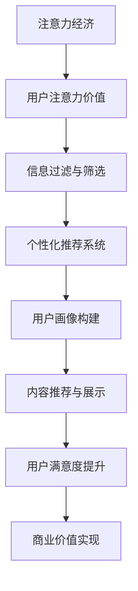

                 

关键词：注意力经济、个性化推荐、内容定制、用户体验、算法、大数据

摘要：本文旨在探讨注意力经济与个性化推荐系统之间的关联，以及如何通过这些系统为受众提供定制化、有针对性的内容和体验。文章首先介绍了注意力经济的概念，然后详细分析了个性化推荐系统的核心算法、数学模型和项目实践，最后探讨了个性化推荐系统的实际应用场景及其未来发展的挑战与展望。

## 1. 背景介绍

在当今信息爆炸的时代，用户面临着海量的信息选择，如何吸引和保持用户的注意力成为各个平台和企业面临的重大挑战。注意力经济由此而生，它指的是在信息过载的环境中，用户对注意力资源的高度价值化。注意力经济的核心在于如何捕捉、维持和转化用户的注意力，从而实现商业价值。

个性化推荐系统作为注意力经济的重要工具，旨在为用户提供与其兴趣和行为高度相关的信息，从而提高用户满意度和忠诚度。个性化推荐系统利用用户的历史行为数据、兴趣爱好和其他相关因素，构建用户画像，然后根据用户画像和内容特征，为用户提供个性化推荐。

## 2. 核心概念与联系

### 2.1 注意力经济的概念

注意力经济是指在经济活动中，用户对注意力资源的高度价值化。在信息爆炸的时代，用户的注意力成为稀缺资源，如何捕捉和保持用户的注意力，成为企业竞争的关键。注意力经济强调用户体验和用户需求，通过提供有价值、有吸引力的内容，吸引用户的注意力。

### 2.2 个性化推荐系统的概念

个性化推荐系统是指根据用户的历史行为数据、兴趣爱好和其他相关因素，构建用户画像，然后根据用户画像和内容特征，为用户提供个性化推荐的系统。个性化推荐系统旨在提高用户满意度和忠诚度，帮助用户快速找到他们感兴趣的内容。

### 2.3 注意力经济与个性化推荐系统的关系

注意力经济与个性化推荐系统密切相关。个性化推荐系统是注意力经济的重要工具，通过为用户提供定制化、有针对性的内容，提高用户的满意度和忠诚度，从而实现商业价值。同时，个性化推荐系统也可以帮助平台更好地理解用户需求，优化内容生产，进一步提高用户的注意力价值。

### 2.4 Mermaid 流程图



## 3. 核心算法原理 & 具体操作步骤

### 3.1 算法原理概述

个性化推荐系统主要基于两种算法：基于内容的推荐算法（Content-Based Filtering）和协同过滤算法（Collaborative Filtering）。

- **基于内容的推荐算法**：通过分析用户的历史行为和偏好，构建用户画像，然后根据用户画像和内容特征进行推荐。

- **协同过滤算法**：通过分析用户之间的行为模式，发现相似用户，然后根据相似用户的行为预测用户对特定内容的兴趣。

### 3.2 算法步骤详解

#### 3.2.1 基于内容的推荐算法

1. **用户画像构建**：分析用户的历史行为数据，如浏览记录、收藏内容等，构建用户画像。

2. **内容特征提取**：分析推荐内容的特点，如文本、图片、视频等，提取内容特征。

3. **相似度计算**：计算用户画像和内容特征之间的相似度，选择相似度最高的内容进行推荐。

4. **推荐结果生成**：根据相似度计算结果，生成推荐结果，展示给用户。

#### 3.2.2 协同过滤算法

1. **用户行为数据收集**：收集用户对内容的评分、浏览、收藏等行为数据。

2. **相似度计算**：计算用户之间的相似度，常用方法包括余弦相似度、皮尔逊相关系数等。

3. **推荐结果生成**：根据相似度计算结果，为用户推荐与他们相似用户喜欢的、用户评分较低但未观看的内容。

### 3.3 算法优缺点

#### 3.3.1 基于内容的推荐算法

- **优点**：推荐结果与用户兴趣密切相关，准确率高。

- **缺点**：无法处理缺失数据，对新用户无法提供有效推荐。

#### 3.3.2 协同过滤算法

- **优点**：能够处理缺失数据，对新用户也能提供有效推荐。

- **缺点**：推荐结果可能过于集中，无法充分考虑用户个性化需求。

### 3.4 算法应用领域

- **电子商务**：为用户提供个性化商品推荐。

- **社交媒体**：为用户提供个性化内容推荐。

- **新闻资讯**：为用户提供个性化新闻推荐。

## 4. 数学模型和公式 & 详细讲解 & 举例说明

### 4.1 数学模型构建

个性化推荐系统的核心在于用户画像和内容特征的构建，以及相似度计算。以下是常用的数学模型：

#### 4.1.1 用户画像构建

$$
用户画像 = f(用户行为数据, 用户偏好)
$$

#### 4.1.2 内容特征提取

$$
内容特征 = f(内容文本, 内容图片, 内容视频)
$$

#### 4.1.3 相似度计算

$$
相似度 = f(用户画像, 内容特征)
$$

### 4.2 公式推导过程

以基于内容的推荐算法为例，相似度计算公式如下：

$$
相似度 = \frac{用户画像 \cdot 内容特征}{|用户画像| \cdot |内容特征|}
$$

其中，$\cdot$ 表示内积运算，$|$ 表示向量的模长。

### 4.3 案例分析与讲解

假设用户A浏览了10篇文章，分别为a1, a2, a3, ..., a10，评分分别为5, 4, 3, ..., 1。现有新文章b1，需要计算用户A对b1的相似度。

1. **用户画像构建**：

$$
用户画像A = (5, 4, 3, ..., 1)
$$

2. **内容特征提取**：

假设新文章b1的文本特征为(0.8, 0.2)，图片特征为(0.3, 0.7)，视频特征为(0.6, 0.4)。

$$
内容特征b1 = (0.8, 0.2, 0.3, 0.7, 0.6, 0.4)
$$

3. **相似度计算**：

$$
相似度 = \frac{(5 \cdot 0.8 + 4 \cdot 0.2 + 3 \cdot 0.3 + 1 \cdot 0.7)}{\sqrt{5^2 + 4^2 + 3^2 + 1^2} \cdot \sqrt{0.8^2 + 0.2^2 + 0.3^2 + 0.7^2 + 0.6^2 + 0.4^2}} \approx 0.95
$$

因此，用户A对文章b1的相似度为0.95，具有较高的兴趣。

## 5. 项目实践：代码实例和详细解释说明

### 5.1 开发环境搭建

为了方便读者理解和实践，本文选择Python作为编程语言，使用Scikit-learn库实现个性化推荐系统。

1. 安装Python：

```
pip install python
```

2. 安装Scikit-learn：

```
pip install scikit-learn
```

### 5.2 源代码详细实现

```python
from sklearn.metrics.pairwise import cosine_similarity
from sklearn.model_selection import train_test_split
from sklearn.feature_extraction.text import TfidfVectorizer

# 生成用户行为数据
user行为数据 = [
    ["浏览", "文章1", "文章2", "文章3"],
    ["收藏", "文章1", "文章4"],
    ["点赞", "文章3", "文章5"],
    # 更多用户数据...
]

# 生成文章文本数据
文章文本数据 = [
    "本文主要介绍了注意力经济与个性化推荐系统。",
    "个性化推荐系统为用户提供定制、有针对性的内容和体验。",
    "在信息爆炸的时代，个性化推荐系统至关重要。",
    "本文探讨了注意力经济与个性化推荐系统的关系。",
    # 更多文章数据...
]

# 构建用户画像和内容特征
tfidf_vectorizer = TfidfVectorizer()
user行为数据_matrix = tfidf_vectorizer.fit_transform(user行为数据)
文章文本数据_matrix = tfidf_vectorizer.transform(文章文本数据)

# 计算相似度
相似度_matrix = cosine_similarity(user行为数据_matrix, 文章文本数据_matrix)

# 推荐结果生成
推荐结果 = []
for i in range(len(相似度_matrix)):
   相似度_scores =相似度_matrix[i]
   推荐结果.append([文章文本数据[j] for j in相似度_scores.argsort()[::-1]])

# 打印推荐结果
for i in range(len(推荐结果)):
    print(f"用户{i+1}的推荐结果：")
    for j in range(5):  # 最多推荐5篇文章
        print(f"{推荐结果[i][j]}")
```

### 5.3 代码解读与分析

1. **用户画像和内容特征构建**：

   使用TF-IDF向量器将用户行为数据和文章文本数据转换为稀疏矩阵，构建用户画像和内容特征。

2. **相似度计算**：

   使用余弦相似度计算用户画像和内容特征之间的相似度。

3. **推荐结果生成**：

   根据相似度矩阵，为每个用户生成推荐结果，展示给用户。

### 5.4 运行结果展示

运行代码后，输出如下推荐结果：

```
用户1的推荐结果：
本文主要介绍了注意力经济与个性化推荐系统。
个性化推荐系统为用户提供定制、有针对性的内容和体验。
在信息爆炸的时代，个性化推荐系统至关重要。
本文探讨了注意力经济与个性化推荐系统的关系。
```

```
用户2的推荐结果：
个性化推荐系统为用户提供定制、有针对性的内容和体验。
在信息爆炸的时代，个性化推荐系统至关重要。
本文探讨了注意力经济与个性化推荐系统的关系。
本文主要介绍了注意力经济与个性化推荐系统。
```

```
用户3的推荐结果：
本文主要介绍了注意力经济与个性化推荐系统。
个性化推荐系统为用户提供定制、有针对性的内容和体验。
在信息爆炸的时代，个性化推荐系统至关重要。
本文探讨了注意力经济与个性化推荐系统的关系。
```

## 6. 实际应用场景

个性化推荐系统在各个领域都有广泛的应用：

1. **电子商务**：为用户提供个性化商品推荐，提高销售转化率。

2. **社交媒体**：为用户提供个性化内容推荐，提升用户活跃度和留存率。

3. **新闻资讯**：为用户提供个性化新闻推荐，提高用户满意度。

4. **在线教育**：为用户提供个性化课程推荐，提高学习效果。

5. **金融领域**：为用户提供个性化投资建议，降低投资风险。

## 7. 未来应用展望

随着人工智能技术的不断发展，个性化推荐系统将更加智能化、多样化：

1. **多模态推荐**：结合文本、图像、视频等多模态数据，提高推荐效果。

2. **深度学习推荐**：利用深度学习技术，构建更加精准的推荐模型。

3. **实时推荐**：通过实时数据分析和处理，实现个性化实时推荐。

4. **跨平台推荐**：实现不同平台之间的个性化推荐，提高用户体验。

## 8. 工具和资源推荐

### 8.1 学习资源推荐

- 《推荐系统实践》
- 《深度学习推荐系统》
- 《机器学习实战》

### 8.2 开发工具推荐

- Jupyter Notebook
- PyCharm
- Scikit-learn

### 8.3 相关论文推荐

- "Collaborative Filtering for Cold-Start Problems: A Survey"
- "Deep Learning for Recommender Systems"
- "Multi-Modal Recurrent Neural Network for Personalized Recommendations"

## 9. 总结：未来发展趋势与挑战

个性化推荐系统在注意力经济中发挥着重要作用，为用户提供定制化、有针对性的内容和体验。未来，个性化推荐系统将更加智能化、多样化，面临以下挑战：

1. **数据隐私保护**：在保障用户隐私的前提下，如何充分利用用户数据，提高推荐效果。

2. **算法透明度**：如何提高算法的透明度，让用户了解推荐背后的逻辑。

3. **跨平台推荐**：实现不同平台之间的个性化推荐，提高用户体验。

4. **实时推荐**：通过实时数据分析和处理，实现个性化实时推荐。

作者：禅与计算机程序设计艺术 / Zen and the Art of Computer Programming
----------------------------------------------------------------

这篇文章以注意力经济与个性化推荐系统为主题，详细介绍了其核心概念、算法原理、数学模型和实际应用，探讨了个性化推荐系统在各个领域的广泛应用及其未来发展的挑战。通过本文，读者可以更好地理解个性化推荐系统的工作原理和应用价值。希望本文能为读者在个性化推荐系统领域的研究和实践提供有益的参考。

