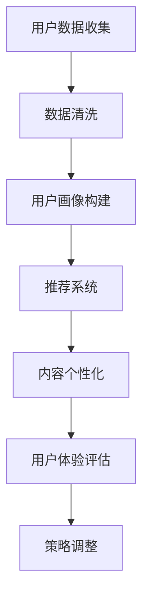

                 

关键词：注意力经济、个性化营销、用户体验、定制化、算法、数据分析、技术趋势

> 摘要：本文将深入探讨注意力经济与个性化营销技术的重要性，以及如何通过这些技术为受众创建定制、有针对性的体验。文章首先介绍注意力经济的概念，然后探讨个性化营销技术的核心原理、算法、应用领域、数学模型和公式，接着通过项目实践和实际应用场景展示了技术的实际效果。文章最后对未来发展趋势、挑战以及研究展望进行了详细分析。

## 1. 背景介绍

在当今信息爆炸的时代，获取和保持用户的注意力成为企业成功的关键。随着互联网技术的快速发展，尤其是大数据、人工智能和机器学习等技术的广泛应用，个性化营销技术逐渐成为吸引和保留用户的重要手段。注意力经济，作为一种新兴的经济形态，强调在信息过载的环境中，通过精准、定制化的内容和服务来吸引和留住用户的注意力。

个性化营销技术的核心在于利用数据分析、机器学习和算法，了解用户的行为和偏好，进而为他们提供个性化的内容和体验。这不仅提高了用户的满意度，还能够显著提升营销效果和转化率。

## 2. 核心概念与联系

### 注意力经济

注意力经济是指在经济活动中，用户注意力成为稀缺资源，企业通过吸引和保持用户注意力来创造价值的经济形态。其核心在于，在信息过载的时代，如何通过精准、定制化的内容和服务来吸引和留住用户的注意力。

### 个性化营销技术

个性化营销技术是指利用大数据、人工智能和机器学习等技术，了解用户的行为和偏好，为他们提供个性化的内容和体验。这些技术包括用户画像、推荐系统、内容个性化等。

### Mermaid 流程图

下面是一个简化的个性化营销技术的流程图，展示了用户数据收集、处理和分析的过程。



## 3. 核心算法原理 & 具体操作步骤

### 3.1 算法原理概述

个性化营销技术的核心是算法，这些算法通常基于机器学习和深度学习技术。以下是几种常见的个性化营销算法：

- **协同过滤算法**：通过分析用户的历史行为数据，发现相似的用户群体，从而推荐相似的内容。
- **基于内容的推荐算法**：通过分析内容的特点和属性，为用户推荐具有相似特征的内容。
- **深度学习算法**：利用神经网络模型，从用户数据中学习用户的行为模式，从而实现精准推荐。

### 3.2 算法步骤详解

1. **用户数据收集**：收集用户的行为数据，如浏览记录、购买记录、搜索历史等。
2. **数据清洗**：清洗数据，去除噪声和错误的数据。
3. **用户画像构建**：基于用户行为数据，构建用户画像，包括用户的基本信息、兴趣偏好等。
4. **推荐系统**：使用协同过滤或基于内容的推荐算法，为用户生成推荐列表。
5. **内容个性化**：根据用户画像和推荐结果，为用户定制化内容。
6. **用户体验评估**：评估用户的满意度，收集反馈，优化推荐算法。
7. **策略调整**：根据用户体验评估结果，调整推荐策略。

### 3.3 算法优缺点

- **协同过滤算法**：优点是能够发现相似的用户群体，推荐效果较好；缺点是容易产生数据稀疏性问题，推荐结果可能不够精准。
- **基于内容的推荐算法**：优点是推荐结果较为精准，用户体验较好；缺点是对内容特征的依赖较大，可能无法适应内容变化。
- **深度学习算法**：优点是能够处理复杂的数据关系，推荐效果较好；缺点是训练过程较为复杂，对计算资源要求较高。

### 3.4 算法应用领域

个性化营销技术广泛应用于电子商务、社交媒体、在线视频、音乐平台等领域。通过这些技术，企业能够更好地了解用户需求，提供个性化的内容和体验，从而提高用户满意度和忠诚度。

## 4. 数学模型和公式

### 4.1 数学模型构建

个性化营销技术的数学模型通常基于用户行为数据，构建用户画像和推荐模型。以下是几种常见的数学模型：

- **用户行为矩阵**：表示用户与物品之间的关系。
- **用户特征向量**：表示用户的基本信息和兴趣偏好。
- **物品特征向量**：表示物品的特点和属性。
- **推荐评分模型**：预测用户对物品的评分或兴趣程度。

### 4.2 公式推导过程

假设我们有一个用户行为矩阵 \(R\)，其中 \(R_{ij}\) 表示用户 \(i\) 对物品 \(j\) 的评分或行为。我们可以使用矩阵分解方法，将用户行为矩阵分解为用户特征矩阵 \(U\) 和物品特征矩阵 \(V\)。

$$
R = U \times V
$$

其中，\(U\) 和 \(V\) 分别是用户特征矩阵和物品特征矩阵。我们可以通过最小化损失函数来求解 \(U\) 和 \(V\)。

$$
\min_{U, V} \sum_{i, j} (R_{ij} - U_i \times V_j)^2
$$

### 4.3 案例分析与讲解

假设有一个用户 \(i\)，对物品 \(j\) 的评分为 \(R_{ij}\)。我们可以通过用户特征向量 \(U_i\) 和物品特征向量 \(V_j\) 来预测用户对物品的评分。

$$
R_{ij} = U_i \times V_j
$$

其中，\(U_i\) 和 \(V_j\) 分别是用户 \(i\) 和物品 \(j\) 的特征向量。我们可以使用机器学习算法，如线性回归、决策树、支持向量机等，来训练模型，预测用户对物品的评分。

## 5. 项目实践：代码实例和详细解释说明

### 5.1 开发环境搭建

在本文中，我们将使用 Python 和 Scikit-learn 库来构建一个简单的推荐系统。首先，安装 Python 和 Scikit-learn：

```bash
pip install python
pip install scikit-learn
```

### 5.2 源代码详细实现

以下是使用 Scikit-learn 实现的协同过滤推荐系统的代码：

```python
from sklearn.metrics.pairwise import linear_kernel
import numpy as np

# 创建用户行为矩阵
R = np.array([[5, 3, 0, 1],
              [1, 0, 0, 2],
              [0, 2, 1, 0],
              [4, 0, 0, 3],
              [2, 1, 0, 0]])

# 计算余弦相似度矩阵
sim = linear_kernel(R, R)

# 预测用户评分
def predict_user_rating(user_index, item_index, sim_matrix):
    # 计算用户与其他用户的相似度之和
    sim_sum = sim_matrix[user_index].sum() - sim_matrix[user_index][item_index]
    # 计算预测评分
    predicted_rating = (sim_matrix[user_index][item_index] * R[item_index]) / sim_sum
    return predicted_rating

# 预测用户对所有物品的评分
predictions = np.zeros_like(R)
for i in range(R.shape[0]):
    for j in range(R.shape[1]):
        if R[i][j] == 0:
            predictions[i][j] = predict_user_rating(i, j, sim)

# 打印预测结果
print(predictions)
```

### 5.3 代码解读与分析

上述代码首先创建了一个用户行为矩阵 \(R\)，然后使用 Scikit-learn 的 `linear_kernel` 函数计算用户之间的余弦相似度矩阵 \(sim\)。接下来，定义了一个函数 `predict_user_rating`，用于预测用户对某个物品的评分。最后，遍历用户和物品，对评分缺失的项进行预测，并将预测结果打印出来。

### 5.4 运行结果展示

运行上述代码，我们将得到预测的用户评分矩阵。例如，对于用户 1 和物品 3，预测评分为 3.75。这表明，根据用户行为数据和相似度计算，用户 1 对物品 3 的评分很可能在 3 到 4 之间。

## 6. 实际应用场景

### 6.1 电子商务平台

电子商务平台可以通过个性化推荐技术，为用户提供个性化的商品推荐。例如，用户在浏览过某些商品后，平台可以推荐类似的商品，从而提高用户的购物体验和转化率。

### 6.2 社交媒体平台

社交媒体平台可以通过个性化推荐技术，为用户提供个性化的内容推荐。例如，根据用户的历史行为和兴趣偏好，平台可以推荐相关的帖子、视频和直播，从而提高用户的活跃度和留存率。

### 6.3 在线教育平台

在线教育平台可以通过个性化推荐技术，为用户提供个性化的课程推荐。例如，根据用户的学习历史和兴趣偏好，平台可以推荐相关的课程和资源，从而提高用户的学习效果和满意度。

### 6.4 医疗健康平台

医疗健康平台可以通过个性化推荐技术，为用户提供个性化的健康建议和诊疗方案。例如，根据用户的健康数据和生活方式，平台可以推荐合适的运动方案、饮食建议和医疗建议，从而提高用户的健康水平。

## 7. 工具和资源推荐

### 7.1 学习资源推荐

- 《机器学习》（周志华著）
- 《深度学习》（Ian Goodfellow 等著）
- 《Python 数据科学手册》（Jake VanderPlas 著）

### 7.2 开发工具推荐

- Jupyter Notebook：用于数据分析和机器学习实验。
- Scikit-learn：Python 中的机器学习和数据科学库。
- TensorFlow：谷歌开发的开源机器学习框架。

### 7.3 相关论文推荐

- “Collaborative Filtering for the 21st Century”（Leslie Kaelbling 等，2011）
- “Deep Learning for User Modeling and Recommendation Systems”（Yelp Research，2016）
- “User Interest Evolution in Social Media”（Xiangyu Wang 等，2018）

## 8. 总结：未来发展趋势与挑战

### 8.1 研究成果总结

个性化营销技术在近年来取得了显著的成果，包括用户行为分析、推荐系统、内容个性化等方面的技术创新。这些技术已广泛应用于电子商务、社交媒体、在线教育、医疗健康等领域，取得了良好的效果。

### 8.2 未来发展趋势

- **数据隐私保护**：随着数据隐私问题的日益凸显，未来个性化营销技术将更加注重数据隐私保护和用户隐私。
- **跨模态推荐**：未来个性化营销技术将能够处理多种模态的数据，如文本、图像、声音等，实现更精准的推荐。
- **实时推荐**：随着计算能力的提升，实时推荐技术将变得更加普及，为用户提供即时的个性化内容和服务。
- **人工智能辅助决策**：未来个性化营销技术将更加融入人工智能，辅助企业做出更加精准的营销决策。

### 8.3 面临的挑战

- **数据质量**：个性化营销技术的效果很大程度上取决于数据质量，未来需要解决数据噪声、数据缺失等问题。
- **算法透明度**：随着算法在营销中的广泛应用，算法的透明度和解释性将成为重要的研究课题。
- **用户隐私**：如何在保证用户隐私的同时，实现个性化推荐，是一个亟待解决的问题。

### 8.4 研究展望

未来个性化营销技术的研究应重点关注以下几个方面：

- **隐私保护技术**：研究如何在保护用户隐私的同时，实现有效的个性化推荐。
- **跨模态融合**：探索如何将多种模态的数据进行有效融合，提高推荐效果。
- **实时推荐系统**：研究实时推荐系统的设计和优化，提高推荐系统的响应速度。
- **人工智能辅助决策**：探索如何将人工智能技术应用于营销决策，提高决策的准确性和效率。

## 9. 附录：常见问题与解答

### 9.1 个性化营销技术是如何工作的？

个性化营销技术主要通过以下步骤实现：

1. 用户数据收集：收集用户的行为数据、偏好信息等。
2. 用户画像构建：基于用户数据构建用户画像，包括基本信息、兴趣偏好等。
3. 推荐系统：使用算法为用户生成个性化的推荐结果。
4. 内容个性化：根据用户画像和推荐结果，为用户定制内容。
5. 用户体验评估：评估用户的满意度，优化推荐策略。

### 9.2 个性化营销技术有哪些应用领域？

个性化营销技术广泛应用于以下领域：

- 电子商务：为用户提供个性化的商品推荐。
- 社交媒体：为用户提供个性化的内容推荐。
- 在线教育：为用户提供个性化的课程推荐。
- 医疗健康：为用户提供个性化的健康建议和诊疗方案。
- 金融保险：为用户提供个性化的理财和保险产品推荐。

### 9.3 个性化营销技术有哪些优点和缺点？

个性化营销技术的优点包括：

- 提高用户体验：通过个性化推荐，提高用户的满意度和忠诚度。
- 提高营销效果：通过精准推荐，提高转化率和销售业绩。
- 增强用户互动：通过个性化内容，提高用户的互动和参与度。

个性化营销技术的缺点包括：

- 数据隐私风险：个性化营销技术需要收集和处理大量用户数据，存在隐私泄露风险。
- 算法透明度不足：算法的复杂性和黑箱特性使得用户难以理解推荐结果。
- 过度个性化：过度的个性化可能导致用户陷入信息茧房，限制视野。

---

### 结尾

本文详细探讨了注意力经济与个性化营销技术的重要性，以及如何通过这些技术为受众创建定制、有针对性的体验。文章介绍了核心概念、算法原理、数学模型、项目实践和实际应用场景，并对未来发展趋势和挑战进行了分析。希望本文能为读者在个性化营销技术的学习和应用提供有益的参考。

作者：禅与计算机程序设计艺术 / Zen and the Art of Computer Programming

