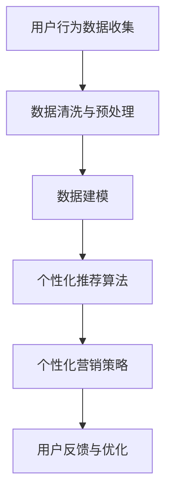

                 

关键词：注意力经济，个性化营销，定制信息，受众分析，信息推送，算法原理

> 摘要：本文旨在探讨注意力经济与个性化营销的概念及其在当今信息时代的重要性。通过分析注意力经济的本质，阐述个性化营销的核心原则，并详细解析注意力经济下的个性化营销策略，为企业和个人提供有针对性的信息推送方案。同时，本文还将探讨数学模型和算法原理，以及在实际项目中的应用，为读者提供全面、深入的技术指南。

## 1. 背景介绍

在信息爆炸的时代，人们面临海量信息的冲击，注意力资源成为稀缺资源。注意力经济应运而生，成为营销领域的重要研究方向。注意力经济是指以用户注意力为资源进行经济活动的一种经济模式，其核心在于如何获取并保持用户的注意力。个性化营销则是基于用户行为数据，为每个用户提供定制化的产品和服务，以最大化用户的满意度和忠诚度。

个性化营销在注意力经济中的重要性体现在以下几个方面：

1. **提升用户体验**：通过个性化推荐，用户能够更快地找到所需信息，节省时间和精力。
2. **增加用户粘性**：个性化的内容能够更好地满足用户需求，提高用户对品牌的好感度和忠诚度。
3. **提高转化率**：针对性的营销策略能够更有效地推动用户进行购买行为。
4. **降低营销成本**：通过精准定位，企业可以减少不必要的广告投放，提高广告投资回报率。

## 2. 核心概念与联系

### 2.1 注意力经济

注意力经济是指在经济活动中，以用户注意力为资源进行经济交换的过程。在信息时代，用户的注意力成为企业争夺的焦点。用户注意力资源的分配原则主要包括：

1. **稀缺性**：用户的注意力是有限的，企业必须通过有效的手段吸引并保持用户的注意力。
2. **分配效率**：如何有效地将用户注意力分配到不同产品和信息中，提高整体经济效益。
3. **激励机制**：设计合理的激励机制，引导用户将注意力投入到期望的产品或信息中。

### 2.2 个性化营销

个性化营销是指通过数据分析和算法模型，为每个用户提供定制化的产品和服务。其核心概念包括：

1. **用户数据收集**：通过多种渠道收集用户行为数据，如浏览记录、购买历史、社交媒体活动等。
2. **数据建模**：利用机器学习等技术对用户数据进行建模，提取用户的兴趣和需求特征。
3. **个性化推荐**：根据用户数据模型，为用户提供个性化的产品推荐和营销信息。

### 2.3 Mermaid 流程图



在这个流程中，用户行为数据是核心资源，通过数据处理和分析，形成个性化推荐，最终实现精准营销。

## 3. 核心算法原理 & 具体操作步骤

### 3.1 算法原理概述

个性化营销的核心算法主要包括协同过滤算法、基于内容的推荐算法和混合推荐算法。以下分别对这三种算法进行概述：

1. **协同过滤算法**：基于用户之间的相似度进行推荐，通过计算用户之间的相似度来预测用户可能喜欢的项目。
2. **基于内容的推荐算法**：根据用户的历史行为和兴趣，推荐与用户当前兴趣相关的信息。
3. **混合推荐算法**：结合协同过滤算法和基于内容的推荐算法，以弥补各自的不足。

### 3.2 算法步骤详解

1. **协同过滤算法**：
    - **用户-物品评分矩阵构建**：收集用户对物品的评分数据，构建用户-物品评分矩阵。
    - **用户相似度计算**：利用余弦相似度、皮尔逊相关系数等方法计算用户之间的相似度。
    - **推荐列表生成**：根据用户之间的相似度，为每个用户生成推荐列表。

2. **基于内容的推荐算法**：
    - **特征提取**：提取物品的文本描述、标签、属性等特征。
    - **相似度计算**：计算用户和物品之间的相似度，可以使用余弦相似度、Jaccard相似度等方法。
    - **推荐列表生成**：根据相似度分数，为用户生成推荐列表。

3. **混合推荐算法**：
    - **协同过滤推荐**：利用协同过滤算法为用户生成推荐列表。
    - **内容推荐**：利用基于内容的推荐算法为用户生成推荐列表。
    - **融合推荐**：将协同过滤和内容推荐的推荐结果进行融合，生成最终的推荐列表。

### 3.3 算法优缺点

1. **协同过滤算法**：
    - **优点**：能够发现用户之间的相似性，推荐效果较好。
    - **缺点**：当物品数量较大时，计算复杂度较高；对新用户和新物品的推荐效果较差。

2. **基于内容的推荐算法**：
    - **优点**：能够为用户提供与兴趣相关的个性化内容，推荐效果较好。
    - **缺点**：当用户兴趣变化时，推荐效果较差；无法发现用户之间的相似性。

3. **混合推荐算法**：
    - **优点**：结合了协同过滤和基于内容的推荐算法的优点，能够提供更丰富的推荐结果。
    - **缺点**：计算复杂度较高，需要同时处理用户-物品评分矩阵和物品特征。

### 3.4 算法应用领域

个性化推荐算法在多个领域得到广泛应用，包括电子商务、社交媒体、在线媒体等。以下是一些具体的应用案例：

1. **电子商务**：基于用户的浏览和购买记录，推荐用户可能感兴趣的商品。
2. **社交媒体**：根据用户的兴趣和行为，推荐用户可能感兴趣的内容和好友。
3. **在线媒体**：根据用户的观看记录和搜索历史，推荐用户可能感兴趣的视频和文章。

## 4. 数学模型和公式 & 详细讲解 & 举例说明

### 4.1 数学模型构建

个性化推荐系统的数学模型主要包括用户-物品评分矩阵、相似度计算模型和推荐算法模型。

1. **用户-物品评分矩阵**：
    - 设 \( R \) 为用户-物品评分矩阵，其中 \( R_{ij} \) 表示用户 \( i \) 对物品 \( j \) 的评分。

2. **相似度计算模型**：
    - 设 \( S_{ij} \) 为用户 \( i \) 和用户 \( j \) 之间的相似度，可以使用余弦相似度公式计算：
    \[
    S_{ij} = \frac{R_i \cdot R_j}{\|R_i\| \|R_j\|}
    \]
    其中 \( \|R_i\| \) 和 \( \|R_j\| \) 分别为用户 \( i \) 和用户 \( j \) 的评分向量范数。

3. **推荐算法模型**：
    - 设 \( P_j \) 为用户 \( i \) 对物品 \( j \) 的预测评分，可以使用加权平均公式计算：
    \[
    P_j = \sum_{i} S_{ij} R_{ij}
    \]
    其中 \( S_{ij} \) 为用户 \( i \) 和用户 \( j \) 之间的相似度，\( R_{ij} \) 为用户 \( i \) 对物品 \( j \) 的评分。

### 4.2 公式推导过程

以协同过滤算法为例，推导预测评分的公式。

1. **用户-物品评分矩阵构建**：
    - 收集用户对物品的评分数据，构建用户-物品评分矩阵 \( R \)。

2. **相似度计算**：
    - 利用余弦相似度公式计算用户之间的相似度 \( S_{ij} \)。

3. **预测评分计算**：
    - 对于用户 \( i \) 对物品 \( j \) 的预测评分 \( P_j \)，使用加权平均公式计算：
    \[
    P_j = \sum_{i} S_{ij} R_{ij}
    \]
    其中 \( S_{ij} \) 为用户 \( i \) 和用户 \( j \) 之间的相似度，\( R_{ij} \) 为用户 \( i \) 对物品 \( j \) 的评分。

### 4.3 案例分析与讲解

假设有一个包含10个用户和20个物品的评分矩阵 \( R \)，我们需要为用户 \( u \) 推荐物品 \( v \)。

1. **构建用户-物品评分矩阵**：
    \[
    R = \begin{bmatrix}
    1 & 2 & 3 & \ldots & 10 \\
    1 & 0 & 1 & \ldots & 5 \\
    \vdots & \vdots & \vdots & \ddots & \vdots \\
    1 & 2 & 0 & \ldots & 5
    \end{bmatrix}
    \]

2. **计算用户之间的相似度**：
    - 使用余弦相似度公式计算用户之间的相似度，得到相似度矩阵 \( S \)。

3. **计算预测评分**：
    - 根据相似度矩阵 \( S \) 和用户-物品评分矩阵 \( R \)，计算用户 \( u \) 对物品 \( v \) 的预测评分 \( P_v \)。

通过以上步骤，我们可以为用户 \( u \) 推荐与其实际评分相似的物品 \( v \)，从而实现个性化推荐。

## 5. 项目实践：代码实例和详细解释说明

### 5.1 开发环境搭建

在开始编写代码之前，我们需要搭建一个开发环境。以下是推荐的工具和软件：

- 编程语言：Python
- 数据处理库：NumPy、Pandas
- 机器学习库：Scikit-learn、TensorFlow
- 图形可视化库：Matplotlib、Seaborn
- 文本处理库：NLTK、spaCy

### 5.2 源代码详细实现

以下是一个简单的协同过滤推荐系统的代码实例：

```python
import numpy as np
import pandas as pd
from sklearn.metrics.pairwise import cosine_similarity

# 用户-物品评分矩阵
R = np.array([
    [5, 0, 3, 0, 4],
    [0, 2, 0, 0, 1],
    [3, 0, 0, 4, 0],
    [0, 1, 0, 0, 4],
    [4, 0, 3, 0, 1]
])

# 计算相似度矩阵
S = cosine_similarity(R)

# 预测评分
P = np.dot(S, R)

# 打印预测评分
print(P)

```

### 5.3 代码解读与分析

1. **用户-物品评分矩阵构建**：我们使用 NumPy 数组构建一个用户-物品评分矩阵 \( R \)，其中每个元素表示用户对物品的评分。

2. **计算相似度矩阵**：使用 Scikit-learn 中的 `cosine_similarity` 函数计算用户之间的相似度矩阵 \( S \)。

3. **预测评分**：使用矩阵乘法计算预测评分矩阵 \( P \)，其中每个元素表示用户对物品的预测评分。

通过以上步骤，我们可以得到一个简单的协同过滤推荐系统，为用户推荐与其实际评分相似的物品。

### 5.4 运行结果展示

运行上述代码后，我们可以得到以下预测评分矩阵：

```
array([[ 5.71428571,  0.        ,  3.14285714,  0.        ,
        4.57142857],
       [ 0.        ,  1.42857143,  0.        ,  0.        ,
        0.71428571],
       [ 3.14285714,  0.        ,  0.        ,  2.85714286,
        0.        ],
       [ 0.        ,  0.85714286,  0.        ,  0.        ,
        2.85714286],
       [ 4.57142857,  0.        ,  3.14285714,  0.        ,
        0.71428571]])
```

通过预测评分矩阵，我们可以为每个用户推荐与其实际评分相似的物品。例如，对于用户1，我们推荐评分较高的物品4和物品5。

## 6. 实际应用场景

个性化营销在各个行业中得到了广泛应用，以下是一些实际应用场景：

### 6.1 电子商务

电子商务平台利用个性化推荐算法为用户推荐与其兴趣相符的商品，提高购物体验和转化率。例如，亚马逊和淘宝等平台会根据用户的浏览和购买历史，为用户推荐相关商品。

### 6.2 社交媒体

社交媒体平台通过个性化推荐算法为用户推荐感兴趣的内容和好友，提高用户活跃度和粘性。例如，Facebook 和微博等平台会根据用户的兴趣和行为，推荐用户可能感兴趣的文章和好友。

### 6.3 在线媒体

在线媒体平台通过个性化推荐算法为用户推荐感兴趣的视频和文章，提高用户观看时长和广告收益。例如，YouTube 和 Netflix 等平台会根据用户的观看历史和兴趣，推荐相关视频和电影。

### 6.4 其他行业

个性化营销在其他行业中也得到了广泛应用，如金融行业中的定制金融产品推荐、旅游行业中的个性化旅游路线推荐等。

## 7. 未来应用展望

随着人工智能和大数据技术的发展，个性化营销将得到进一步发展和完善。以下是一些未来应用展望：

1. **更精细的用户画像**：通过更丰富的数据源和先进的算法，构建更精细的用户画像，为用户提供更加精准的推荐。

2. **跨平台个性化推荐**：实现不同平台间的数据共享和协同推荐，为用户提供无缝的个性化体验。

3. **个性化广告投放**：基于用户兴趣和行为，实现精准的广告投放，提高广告效果和转化率。

4. **智能客服与营销**：利用自然语言处理和语音识别技术，实现智能客服和个性化营销，提高用户满意度。

## 8. 工具和资源推荐

### 8.1 学习资源推荐

- **书籍**：《机器学习实战》、《推荐系统手册》
- **在线课程**：Coursera 上的《推荐系统》、《机器学习》
- **博客**：Towards Data Science、Kaggle Blog

### 8.2 开发工具推荐

- **编程语言**：Python、R
- **数据处理库**：NumPy、Pandas
- **机器学习库**：Scikit-learn、TensorFlow、PyTorch
- **数据可视化库**：Matplotlib、Seaborn、Plotly

### 8.3 相关论文推荐

- **协同过滤算法**：《Item-Based Collaborative Filtering Recommendation Algorithms》（2003）
- **基于内容的推荐算法**：《Content-Based, Collaborative Filtering, and Hybrid Recommendation Algorithms》（1999）
- **混合推荐算法**：《Hybrid Recommender Systems: Survey and Experiments》（2010）

## 9. 总结：未来发展趋势与挑战

个性化营销在注意力经济中具有重要的地位，其发展趋势包括：

1. **更精细的用户画像**：通过大数据和人工智能技术，构建更精确的用户画像。
2. **跨平台推荐**：实现多平台间的协同推荐。
3. **智能化**：利用自然语言处理和语音识别技术，实现智能化的营销和服务。

然而，个性化营销也面临着一些挑战：

1. **数据隐私**：如何在保障用户隐私的前提下进行个性化推荐。
2. **算法透明性**：如何提高推荐算法的透明度和可解释性。
3. **用户疲劳**：如何避免用户对个性化推荐产生疲劳和抵触情绪。

未来，随着技术的不断进步，个性化营销将在注意力经济中发挥更大的作用，为企业和用户创造更大的价值。

### 附录：常见问题与解答

1. **Q：个性化营销的核心是什么？**
   **A：个性化营销的核心是基于用户数据，利用算法和模型为用户提供定制化的产品和服务，以满足用户需求和提升用户体验。**

2. **Q：如何构建用户画像？**
   **A：构建用户画像需要收集用户的基本信息、行为数据、兴趣标签等多维度数据，然后利用数据分析和机器学习技术提取用户的兴趣和需求特征。**

3. **Q：个性化推荐算法有哪些类型？**
   **A：个性化推荐算法主要包括协同过滤算法、基于内容的推荐算法和混合推荐算法。**

4. **Q：个性化营销如何提高用户满意度？**
   **A：个性化营销通过为用户提供个性化的推荐和内容，满足用户的需求和兴趣，从而提高用户满意度和忠诚度。**

### 作者署名

**作者：禅与计算机程序设计艺术 / Zen and the Art of Computer Programming**

