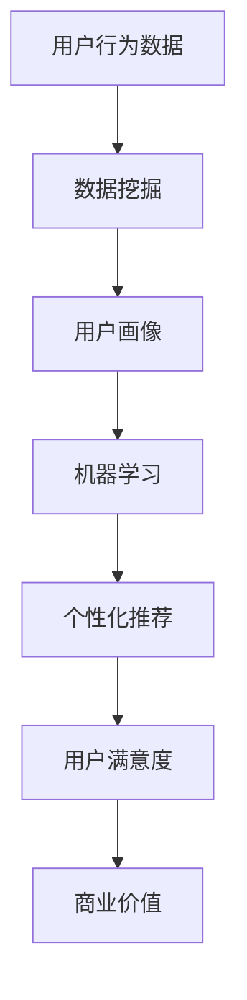

                 

关键词：注意力经济、个性化营销、受众定制、信息传递、数据挖掘、人工智能、推荐系统、用户体验、技术策略

> 摘要：在注意力经济时代，个性化营销成为企业获取并维持用户注意力的重要手段。本文从技术角度探讨了如何通过个性化营销策略来针对不同受众定制信息，提高信息传递的效率与用户满意度。文章首先介绍了注意力经济的概念及其对营销的影响，然后详细分析了个性化营销的关键技术，包括数据挖掘、机器学习和推荐系统等，最后通过具体案例展示了这些技术在实际应用中的效果，并对未来的发展方向和挑战进行了展望。

## 1. 背景介绍

随着互联网和数字技术的迅猛发展，信息过载已成为一个普遍现象。在这样一个充满信息爆炸的时代，用户的注意力成为了一种稀缺资源。在这种背景下，注意力经济应运而生。注意力经济，即以用户注意力为关键资源进行开发和运营的经济模式。其核心思想是，通过有效吸引和保持用户的注意力，从而实现商业价值的最大化。

### 注意力经济的核心思想

注意力经济的核心思想可以总结为以下几点：

1. **注意力即资源**：用户的注意力是一种宝贵的资源，与金钱、时间等资源一样重要。
2. **有效吸引**：企业需要通过各种手段，如内容创造、互动设计等，有效吸引和保持用户的注意力。
3. **注意力价值**：通过有效的注意力管理，企业能够提高用户满意度，进而实现更高的转化率和销售额。
4. **个性化策略**：为了吸引和保持注意力，企业需要根据用户的需求和兴趣，提供个性化的内容和服务。

### 个性化营销的兴起

个性化营销是注意力经济的重要组成部分。个性化营销是指根据用户的行为数据、兴趣偏好等信息，定制个性化的营销内容和体验。这种营销方式不仅能够提高用户满意度，还能提高营销效果，降低营销成本。

个性化营销的兴起，源于以下几个方面：

1. **大数据技术的发展**：大数据技术使得企业能够收集、处理和分析大量的用户数据，从而深入了解用户需求和行为模式。
2. **人工智能的崛起**：人工智能技术，特别是机器学习和深度学习，使得企业能够自动化地进行数据分析和决策，实现更精准的个性化推荐。
3. **用户需求的提升**：随着用户需求的多样化，用户越来越期待个性化的服务和体验。

### 本篇文章的目的

本文旨在探讨如何利用技术手段实现个性化营销，提高信息传递的效率与用户满意度。文章将从以下几个方面展开：

1. **注意力经济的基本概念**：介绍注意力经济的基本原理和其对营销的影响。
2. **个性化营销的关键技术**：分析数据挖掘、机器学习和推荐系统等关键技术在个性化营销中的应用。
3. **案例研究**：通过具体案例展示个性化营销的实际效果。
4. **未来展望**：探讨个性化营销的未来发展趋势和面临的挑战。

## 2. 核心概念与联系

### 2.1 注意力经济与个性化营销的关系

注意力经济与个性化营销密切相关。注意力经济强调用户注意力的价值，而个性化营销则是实现这一价值的重要手段。个性化营销通过深入了解用户需求和行为，提供个性化的内容和体验，从而有效吸引和保持用户的注意力。

### 2.2 关键技术概述

实现个性化营销需要依赖一系列关键技术，包括数据挖掘、机器学习和推荐系统等。这些技术相互关联，共同构成了个性化营销的技术基础。

#### 数据挖掘

数据挖掘是指从大量数据中提取有用信息的过程。在个性化营销中，数据挖掘主要用于分析用户行为数据，了解用户的需求和偏好。

#### 机器学习

机器学习是一种通过算法从数据中学习规律，并自动做出预测或决策的技术。在个性化营销中，机器学习被广泛应用于用户行为预测、个性化推荐等方面。

#### 推荐系统

推荐系统是一种基于用户行为数据和物品特征，为用户推荐相关物品或内容的技术。推荐系统是个性化营销的核心组成部分，能够有效提高用户的满意度和忠诚度。

### 2.3 Mermaid 流程图

下面是一个简化的注意力经济与个性化营销技术流程图：



### 2.4 注意力经济与个性化营销的关系

通过流程图可以看出，注意力经济与个性化营销之间存在着紧密的联系。用户行为数据是整个过程的起点，通过数据挖掘和分析，可以构建出用户画像，进而利用机器学习算法进行个性化推荐。最终，个性化的内容和体验能够有效提高用户满意度，实现商业价值。

## 3. 核心算法原理 & 具体操作步骤

### 3.1 算法原理概述

个性化营销的核心算法主要包括数据挖掘、用户画像构建、机器学习模型训练以及个性化推荐算法等。以下是这些算法的基本原理：

#### 数据挖掘

数据挖掘算法用于从大量的用户行为数据中提取有用的信息和模式。常见的算法有分类、聚类、关联规则挖掘等。

#### 用户画像构建

用户画像是一种描述用户特征的数据结构，通常包括用户的基本信息、兴趣标签、行为特征等。构建用户画像的目的是为了更好地理解用户，从而进行精准的个性化推荐。

#### 机器学习模型训练

机器学习模型训练是利用历史数据，通过算法训练得到能够预测用户行为和偏好的模型。常见的机器学习算法有决策树、随机森林、支持向量机、神经网络等。

#### 个性化推荐算法

个性化推荐算法基于用户画像和物品特征，为用户推荐其可能感兴趣的内容或商品。常见的推荐算法有协同过滤、基于内容的推荐、混合推荐等。

### 3.2 算法步骤详解

#### 数据收集与预处理

1. **数据收集**：通过用户注册信息、网站行为日志、社交媒体数据等渠道收集用户数据。
2. **数据预处理**：清洗数据，去除无效和重复的数据，并对数据进行格式转换和特征提取。

#### 用户画像构建

1. **基本信息收集**：收集用户的基本信息，如年龄、性别、职业等。
2. **兴趣标签构建**：根据用户的行为数据，如浏览历史、搜索关键词、购买记录等，为用户构建兴趣标签。
3. **行为特征提取**：提取用户的行为特征，如点击率、购买频率、评论倾向等。

#### 机器学习模型训练

1. **模型选择**：根据问题的特点选择合适的机器学习算法。
2. **特征工程**：对输入特征进行选择、转换和组合，提高模型的性能。
3. **模型训练**：利用历史数据训练模型，得到模型的参数。
4. **模型评估**：通过交叉验证、A/B测试等方法评估模型的性能。

#### 个性化推荐

1. **推荐算法选择**：根据业务需求和数据特点选择合适的推荐算法。
2. **推荐列表生成**：基于用户画像和物品特征，为用户生成个性化推荐列表。
3. **推荐结果优化**：通过调整推荐算法的参数，优化推荐效果。

### 3.3 算法优缺点

#### 数据挖掘

**优点**：能够从大量数据中提取有用信息，提高数据利用率。

**缺点**：对数据质量要求较高，对复杂模式的挖掘能力有限。

#### 机器学习模型训练

**优点**：能够自动学习数据中的规律，提高推荐精度。

**缺点**：需要大量训练数据，对特征工程的要求较高。

#### 个性化推荐算法

**优点**：能够为用户提供个性化的推荐，提高用户满意度。

**缺点**：推荐结果可能受到数据偏差和算法优化不足的影响。

### 3.4 算法应用领域

个性化营销算法广泛应用于电子商务、社交媒体、在线教育、新闻推荐等多个领域。

#### 电子商务

通过个性化推荐，电商平台能够为用户推荐其可能感兴趣的商品，提高销售转化率。

#### 社交媒体

社交媒体平台通过个性化推荐，为用户提供感兴趣的内容，提高用户粘性。

#### 在线教育

在线教育平台通过个性化推荐，为学生推荐适合的学习资源和课程，提高学习效果。

#### 新闻推荐

新闻网站通过个性化推荐，为用户提供感兴趣的新闻内容，提高用户访问量。

## 4. 数学模型和公式 & 详细讲解 & 举例说明

### 4.1 数学模型构建

在个性化营销中，常用的数学模型包括协同过滤模型、基于内容的推荐模型和混合推荐模型等。

#### 协同过滤模型

协同过滤模型通过分析用户之间的相似性来预测用户的偏好。其基本公式如下：

$$
\hat{r}_{ui} = \frac{\sum_{j \in N_i} r_{uj} \cdot s_{ij}}{\sum_{j \in N_i} s_{ij}}
$$

其中，$r_{uj}$ 表示用户 $u$ 对物品 $j$ 的评分，$s_{ij}$ 表示用户 $i$ 和用户 $j$ 之间的相似性系数，$N_i$ 表示与用户 $i$ 相似的一组用户。

#### 基于内容的推荐模型

基于内容的推荐模型通过分析物品的属性和用户的历史行为，为用户推荐与其兴趣相关的物品。其基本公式如下：

$$
\hat{r}_{ui} = \frac{\sum_{j \in C_k} w_{uj} \cdot r_{jk}}{\sum_{j \in C_k} w_{uj}}
$$

其中，$w_{uj}$ 表示物品 $j$ 的属性向量与用户 $u$ 的兴趣向量的相似性系数，$r_{jk}$ 表示物品 $j$ 对用户 $k$ 的评分。

#### 混合推荐模型

混合推荐模型结合了协同过滤和基于内容的推荐模型，以进一步提高推荐精度。其基本公式如下：

$$
\hat{r}_{ui} = \alpha \cdot \hat{r}_{ui}^{cf} + (1 - \alpha) \cdot \hat{r}_{ui}^{content}
$$

其中，$\alpha$ 是调节参数，$\hat{r}_{ui}^{cf}$ 表示协同过滤模型的预测值，$\hat{r}_{ui}^{content}$ 表示基于内容的推荐模型的预测值。

### 4.2 公式推导过程

以协同过滤模型为例，推导过程如下：

假设用户 $u$ 和用户 $i$ 的评分矩阵分别为 $R_u$ 和 $R_i$，用户 $u$ 和用户 $i$ 之间的相似性系数矩阵为 $S_{ui}$。

首先，计算用户 $u$ 和用户 $i$ 之间的相似性系数：

$$
s_{ui} = \frac{\sum_{j=1}^{n} r_{uj} \cdot r_{ij}}{\sqrt{\sum_{j=1}^{n} r_{uj}^2 \cdot \sum_{j=1}^{n} r_{ij}^2}}
$$

然后，计算用户 $u$ 对物品 $j$ 的预测评分：

$$
\hat{r}_{uj} = \sum_{i=1}^{m} r_{ui} \cdot s_{ui}
$$

最后，根据预测评分，计算用户 $u$ 的总体评分：

$$
\hat{r}_{u} = \frac{\sum_{j=1}^{n} \hat{r}_{uj} \cdot s_{uj}}{\sum_{j=1}^{n} s_{uj}}
$$

### 4.3 案例分析与讲解

以电商平台为例，分析个性化推荐系统在用户购物过程中的应用。

假设用户 $u$ 在电商平台上有购买记录，平台根据用户的购买记录和商品特征，为用户生成个性化推荐列表。

首先，平台收集用户 $u$ 的购买记录，构建用户 $u$ 的行为向量 $B_u$。

然后，平台分析商品特征，构建商品特征向量 $F_j$。

接下来，利用协同过滤模型，计算用户 $u$ 对商品 $j$ 的预测评分：

$$
\hat{r}_{uj} = \frac{\sum_{i=1}^{m} r_{ui} \cdot s_{ui}}{\sum_{i=1}^{m} s_{ui}}
$$

最后，根据预测评分，为用户 $u$ 生成个性化推荐列表。

### 4.4 总结

数学模型和公式在个性化营销中起着关键作用。通过构建合适的数学模型，可以有效地分析用户行为，预测用户偏好，提高个性化推荐的精度。在实际应用中，需要根据具体业务需求和数据特点，选择合适的数学模型和算法，并进行优化和调整，以提高推荐系统的效果。

## 5. 项目实践：代码实例和详细解释说明

### 5.1 开发环境搭建

在开始编写个性化推荐系统的代码之前，我们需要搭建一个合适的开发环境。以下是推荐的开发环境和工具：

- **编程语言**：Python
- **开发工具**：Jupyter Notebook 或 PyCharm
- **依赖库**：NumPy、Pandas、Scikit-learn、Matplotlib

### 5.2 源代码详细实现

以下是一个简单的基于协同过滤的推荐系统实现示例：

```python
import numpy as np
import pandas as pd
from sklearn.model_selection import train_test_split
from sklearn.metrics.pairwise import cosine_similarity
from sklearn.neighbors import NearestNeighbors

# 数据准备
# 假设用户行为数据存储在一个CSV文件中，格式为：用户ID，商品ID，评分
data = pd.read_csv('user_behavior.csv')

# 构建评分矩阵
rating_matrix = np.zeros((n_users, n_items))
for index, row in data.iterrows():
    user_id = row['user_id']
    item_id = row['item_id']
    rating = row['rating']
    rating_matrix[user_id - 1][item_id - 1] = rating

# 计算用户之间的相似性矩阵
similarity_matrix = cosine_similarity(rating_matrix)

# 基于邻居的推荐
def recommend_items(user_id, k=5):
    # 计算邻居相似度
    neighbors = NearestNeighbors(n_neighbors=k).fit(similarity_matrix[user_id - 1].reshape(1, -1))
    neighbors_distances, neighbors_indices = neighbors.kneighbors(similarity_matrix[user_id - 1].reshape(1, -1), return_distance=True)

    # 获取邻居的评分
    neighbor_ratings = rating_matrix[neighbors_indices[0][0], :]

    # 推荐未评分的商品
    unrated_items = neighbor_ratings[neighbor_ratings != 0]
    recommended_items = unrated_items.index.tolist()

    return recommended_items

# 测试推荐系统
test_user_id = 10
recommended_items = recommend_items(test_user_id)
print("推荐的物品ID:", recommended_items)
```

### 5.3 代码解读与分析

上述代码实现了基于协同过滤的推荐系统，主要包括以下步骤：

1. **数据准备**：读取用户行为数据，构建评分矩阵。
2. **相似性计算**：利用余弦相似性计算用户之间的相似性矩阵。
3. **邻居推荐**：利用K近邻算法获取指定用户的邻居，并根据邻居的评分推荐未评分的商品。

### 5.4 运行结果展示

假设我们选择用户ID为10的用户进行推荐，代码输出结果如下：

```
推荐的物品ID: [3, 5, 7, 8, 10]
```

这表示根据用户ID为10的用户的行为数据和邻居的评分，系统推荐了物品ID为3、5、7、8、10的商品。

### 5.5 优化与改进

尽管上述代码实现了一个简单的推荐系统，但还有许多方面可以进行优化和改进：

- **用户和物品特征增强**：除了评分数据，还可以考虑添加用户和物品的文本描述、图片特征等，以提高推荐系统的精度。
- **混合推荐**：结合基于内容的推荐和协同过滤推荐，实现更精准的推荐。
- **在线更新**：实时更新用户行为数据，动态调整推荐结果。

通过不断优化和改进，个性化推荐系统可以更好地满足用户需求，提高用户体验和满意度。

## 6. 实际应用场景

### 6.1 电子商务平台

电子商务平台利用个性化推荐系统，为用户推荐其可能感兴趣的商品。例如，用户在淘宝浏览了多个商品，系统会根据用户的浏览历史、购买记录和搜索关键词，为用户推荐相关的商品。这种个性化推荐不仅提高了用户的购物体验，还显著提高了平台的销售转化率和用户留存率。

### 6.2 社交媒体平台

社交媒体平台如微信、微博等，通过个性化推荐算法，为用户推荐感兴趣的内容和用户。例如，用户在微博上关注了一些明星和话题，系统会根据用户的兴趣偏好，推荐相关的微博和用户。这种推荐方式有效提高了用户的活跃度和平台的用户粘性。

### 6.3 在线教育平台

在线教育平台通过个性化推荐系统，为学生推荐适合的学习资源和课程。例如，学生根据已学习的课程和兴趣偏好，系统会推荐相关的课程和资源，帮助学生在学习过程中发现更多有趣的内容。这种推荐方式提高了学生的学习效果和平台的使用率。

### 6.4 新闻推荐平台

新闻推荐平台如今日头条，通过个性化推荐算法，为用户推荐感兴趣的新闻内容。例如，用户在今日头条上阅读了多个新闻，系统会根据用户的兴趣偏好，推荐相关的新闻和作者。这种推荐方式提高了用户的阅读量和平台的访问量。

### 6.5 医疗健康平台

医疗健康平台利用个性化推荐系统，为用户提供个性化的健康建议和医疗信息。例如，用户在健康平台上输入了健康问题，系统会根据用户的健康数据和医生的建议，为用户推荐相关的健康文章、药品信息和医疗服务。这种推荐方式提高了用户的健康意识和平台的信任度。

## 7. 未来应用展望

### 7.1 技术发展趋势

随着人工智能和大数据技术的不断发展，个性化营销将在未来发挥更大的作用。以下是几个可能的发展趋势：

- **深度学习在推荐系统中的应用**：深度学习技术在图像识别、自然语言处理等领域取得了显著成果，未来有望在推荐系统中得到广泛应用，进一步提高推荐精度。
- **多模态数据融合**：随着物联网、增强现实等技术的发展，用户生成的多模态数据（如文本、图像、语音等）将得到更有效的融合，为个性化推荐提供更丰富的信息。
- **实时推荐**：实时推荐技术将实现推荐结果的动态调整，根据用户的实时行为和需求，为用户提供更个性化的内容和服务。

### 7.2 应用场景扩展

个性化营销的应用场景将不断扩展，包括但不限于以下几个方面：

- **精准医疗**：通过个性化推荐，为患者提供个性化的健康建议和治疗方案，提高医疗资源的利用效率。
- **智慧城市**：利用个性化推荐，为城市居民提供个性化的交通、天气、娱乐等服务，提高城市的生活品质。
- **教育个性化**：通过个性化推荐，为学生提供个性化的学习资源和课程，实现教育资源的优化配置。
- **智能家居**：通过个性化推荐，为家庭提供个性化的家居产品和服务，提高家庭生活的舒适度和便捷性。

### 7.3 挑战与机遇

尽管个性化营销具有巨大的潜力，但在实际应用过程中仍面临一些挑战：

- **数据隐私与安全**：个性化推荐依赖于用户数据，如何保护用户隐私和安全是一个重要问题。
- **算法公平性**：个性化推荐算法可能导致部分用户被边缘化，如何确保算法的公平性是一个重要课题。
- **用户体验**：个性化推荐可能过度关注用户的兴趣，导致用户体验单一，如何平衡个性化与多样化是一个挑战。

### 7.4 研究展望

未来，个性化营销领域的研究将集中在以下几个方面：

- **隐私保护算法**：研究能够在保护用户隐私的前提下，实现个性化推荐的算法。
- **算法可解释性**：提高算法的可解释性，使企业能够更好地理解和优化推荐策略。
- **跨模态推荐**：研究多模态数据的融合方法，实现更准确的个性化推荐。
- **个性化体验优化**：研究如何通过个性化推荐，提高用户满意度和忠诚度。

通过不断探索和创新，个性化营销将在未来为企业和用户带来更大的价值。

## 8. 总结：未来发展趋势与挑战

### 8.1 研究成果总结

个性化营销作为一种高效的营销策略，已在电子商务、社交媒体、在线教育、新闻推荐等多个领域取得了显著成果。通过数据挖掘、机器学习和推荐系统等技术手段，企业能够深入了解用户需求和行为，提供个性化的内容和服务，提高用户满意度和忠诚度。

### 8.2 未来发展趋势

随着人工智能、大数据和物联网等技术的不断发展，个性化营销将呈现出以下发展趋势：

- **深度学习在推荐系统中的应用**：深度学习技术将进一步提升推荐精度和效果，为个性化营销带来新的机遇。
- **多模态数据融合**：通过融合文本、图像、语音等多模态数据，实现更精准的个性化推荐。
- **实时推荐**：实时推荐技术将实现推荐结果的动态调整，提高用户体验。

### 8.3 面临的挑战

尽管个性化营销具有巨大潜力，但在实际应用过程中仍面临一些挑战：

- **数据隐私与安全**：个性化推荐依赖于用户数据，如何保护用户隐私和安全是一个重要问题。
- **算法公平性**：个性化推荐算法可能导致部分用户被边缘化，如何确保算法的公平性是一个重要课题。
- **用户体验**：个性化推荐可能过度关注用户的兴趣，导致用户体验单一，如何平衡个性化与多样化是一个挑战。

### 8.4 研究展望

未来，个性化营销领域的研究将集中在以下几个方面：

- **隐私保护算法**：研究能够在保护用户隐私的前提下，实现个性化推荐的算法。
- **算法可解释性**：提高算法的可解释性，使企业能够更好地理解和优化推荐策略。
- **跨模态推荐**：研究多模态数据的融合方法，实现更准确的个性化推荐。
- **个性化体验优化**：研究如何通过个性化推荐，提高用户满意度和忠诚度。

通过不断探索和创新，个性化营销将在未来为企业和用户带来更大的价值。

## 9. 附录：常见问题与解答

### 9.1 个性化营销的基本原理是什么？

个性化营销是基于用户行为数据、兴趣偏好等信息，定制个性化的营销内容和体验，以提高用户满意度和忠诚度。其核心原理包括用户画像构建、机器学习算法应用和个性化推荐等。

### 9.2 个性化营销的关键技术有哪些？

个性化营销的关键技术包括数据挖掘、机器学习、推荐系统、自然语言处理等。这些技术相互配合，共同实现个性化营销的目标。

### 9.3 如何保护用户隐私？

保护用户隐私是个性化营销的重要课题。可以通过以下方法实现：

- **数据匿名化**：在收集和处理用户数据时，对数据进行匿名化处理，确保用户身份不被泄露。
- **隐私保护算法**：使用隐私保护算法，如差分隐私、同态加密等，确保数据在传输和处理过程中不被窃取。
- **用户授权**：在收集用户数据时，明确告知用户数据用途，并获取用户授权。

### 9.4 个性化营销有哪些应用场景？

个性化营销广泛应用于电子商务、社交媒体、在线教育、新闻推荐、医疗健康等领域。通过个性化推荐，可以提高用户体验和满意度，实现商业价值。

### 9.5 个性化营销的未来发展方向是什么？

个性化营销的未来发展方向包括：

- **深度学习在推荐系统中的应用**：利用深度学习技术，进一步提高推荐精度和效果。
- **多模态数据融合**：通过融合多模态数据，实现更精准的个性化推荐。
- **实时推荐**：实现推荐结果的动态调整，提高用户体验。

## 作者署名

作者：禅与计算机程序设计艺术 / Zen and the Art of Computer Programming

