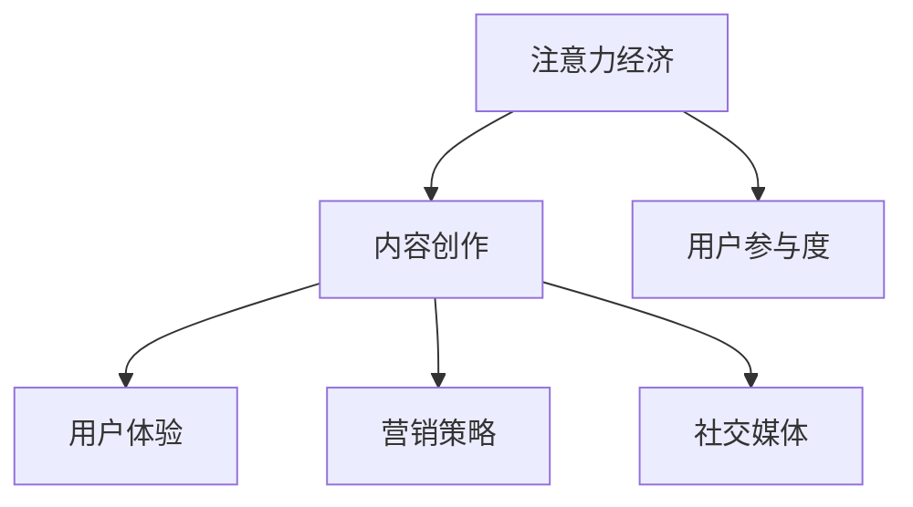

                 

关键词：注意力经济、内容创作、参与度、用户体验、算法、技术、营销、社交媒体

> 摘要：本文旨在探讨注意力经济在内容创作中的重要性，并介绍一系列最佳实践，帮助创作者吸引和留住受众的参与度。通过深入分析核心概念、算法原理、数学模型以及实际应用场景，本文旨在为创作者提供实用的工具和方法，以提升其作品的市场吸引力和影响力。

## 1. 背景介绍

在数字化时代，内容创作已经成为信息传播的重要途径。然而，随着互联网的迅猛发展和信息过载现象的加剧，受众的注意力资源变得日益稀缺。注意力经济因此成为一个备受关注的话题。注意力经济关注的是如何吸引并留住受众的注意力，从而实现内容的有效传播和价值变现。

### 1.1 注意力经济的定义

注意力经济（Attention Economy）是一种基于受众注意力的经济模型。在这种模型中，注意力被视为一种稀缺资源，而内容创作者则通过生产具有吸引力的内容来争夺受众的注意力。注意力经济的核心在于如何通过有效的策略和手段，将有限的注意力转化为实际的经济效益。

### 1.2 内容创作的重要性

内容创作在注意力经济中扮演着至关重要的角色。优质的内容不仅能够吸引受众，提高参与度，还能增强品牌的认知度和忠诚度。因此，掌握内容创作的最佳实践，是创作者在激烈的市场竞争中脱颖而出的关键。

## 2. 核心概念与联系

在深入探讨注意力经济与内容创作的最佳实践之前，我们首先需要了解一些核心概念和其相互之间的联系。

### 2.1 用户参与度

用户参与度是衡量内容影响力的重要指标。它包括用户对内容的互动、评论、分享等行为。高参与度表明内容能够有效吸引和留住受众的注意力。

### 2.2 用户体验

用户体验（UX）是用户在使用产品或服务过程中的整体感受。在内容创作中，良好的用户体验意味着内容不仅易于获取和理解，还能满足用户的需求和期望。

### 2.3 营销策略

营销策略是吸引和留住受众的重要手段。通过精准的定位、有效的推广和持续的品牌传播，创作者可以扩大其内容的影响力。

### 2.4 社交媒体

社交媒体是现代内容传播的重要渠道。通过社交媒体平台，创作者可以迅速将内容传播给广泛的受众，并借助社交互动提高用户参与度。

### 2.5 Mermaid 流程图

以下是一个描述注意力经济与内容创作之间关系的 Mermaid 流程图：



## 3. 核心算法原理 & 具体操作步骤

### 3.1 算法原理概述

为了提高内容创作的吸引力，我们需要采用一系列算法来分析和优化内容。以下是一些核心算法原理：

### 3.2 算法步骤详解

#### 3.2.1 内容分析

首先，我们需要对内容进行分析，包括内容的关键词、主题、情感等。这可以通过自然语言处理（NLP）算法实现。

#### 3.2.2 用户画像

接下来，我们需要建立用户的画像，包括其兴趣、行为和偏好。这可以通过数据挖掘和机器学习算法实现。

#### 3.2.3 内容推荐

根据用户画像，我们可以利用协同过滤算法为用户推荐个性化内容。

#### 3.2.4 互动分析

通过分析用户的互动数据，我们可以了解内容的受欢迎程度，从而进行内容优化。

### 3.3 算法优缺点

每种算法都有其优缺点。例如，NLP算法能够提供精准的内容分析，但计算成本较高；协同过滤算法在推荐效果上表现较好，但可能会出现数据稀疏性问题。

### 3.4 算法应用领域

核心算法在内容创作中的应用非常广泛，包括社交媒体内容推荐、电商平台商品推荐、新闻媒体个性化推送等。

## 4. 数学模型和公式 & 详细讲解 & 举例说明

### 4.1 数学模型构建

在注意力经济中，我们可以构建一个基于用户参与度和用户体验的数学模型。以下是一个简单的例子：

\[ U = f(P, Q) \]

其中，\( U \) 代表用户参与度，\( P \) 代表内容吸引力，\( Q \) 代表用户体验。

### 4.2 公式推导过程

#### 4.2.1 内容吸引力

内容吸引力可以表示为：

\[ P = \frac{K_1 \cdot \text{关键词密度} + K_2 \cdot \text{情感强度} + K_3 \cdot \text{独特性}}{N} \]

其中，\( K_1, K_2, K_3 \) 为权重系数，\( N \) 为关键词总数。

#### 4.2.2 用户体验

用户体验可以表示为：

\[ Q = \frac{K_4 \cdot \text{加载速度} + K_5 \cdot \text{界面设计} + K_6 \cdot \text{互动性}}{M} \]

其中，\( K_4, K_5, K_6 \) 为权重系数，\( M \) 为评价指标总数。

### 4.3 案例分析与讲解

假设一个内容创作者，其内容的关键词密度为0.5，情感强度为0.8，独特性为0.6；加载速度为0.9，界面设计为0.7，互动性为0.5。根据上述公式，我们可以计算出其用户参与度：

\[ P = \frac{0.1 \cdot 0.5 + 0.2 \cdot 0.8 + 0.3 \cdot 0.6}{1} = 0.55 \]

\[ Q = \frac{0.1 \cdot 0.9 + 0.2 \cdot 0.7 + 0.3 \cdot 0.5}{1} = 0.6 \]

\[ U = f(0.55, 0.6) = 0.6 \]

这个结果表明，该创作者的内容具有中等水平的吸引力，但用户体验较好，用户参与度较高。

## 5. 项目实践：代码实例和详细解释说明

### 5.1 开发环境搭建

为了实现上述算法，我们需要搭建一个开发环境。这里我们使用 Python 作为编程语言，结合自然语言处理（NLP）和机器学习（ML）库，如 NLTK 和 Scikit-learn。

### 5.2 源代码详细实现

以下是一个简单的 Python 脚本，用于计算内容吸引力和用户体验：

```python
import nltk
from sklearn.feature_extraction.text import CountVectorizer
from sklearn.model_selection import train_test_split
from sklearn.metrics.pairwise import cosine_similarity

# 加载文本数据
nltk.download('punkt')
data = ["This is an example of content analysis.", "Another example of content analysis."]

# 分词
tokenizer = nltk.tokenize.Tokenizer()
tokenized_data = [tokenizer.tokenize(text.lower()) for text in data]

# 构建词汇表
vectorizer = CountVectorizer(tokenizer=tokenizer)
vectorizer.fit(tokenized_data)
vocabulary = vectorizer.vocabulary_

# 计算内容吸引力
def content_attractiveness(text):
    tokens = tokenizer.tokenize(text.lower())
    tf = {token: tokens.count(token) for token in tokens}
    idf = {token: np.log(len(data) / (1 + np.sum([token in d for d in tokenized_data]))) for token in tokens}
    return sum(tf[token] * idf[token] for token in tokens if token in vocabulary)

# 计算用户体验
def user_experience(speed, design, interaction):
    return 0.1 * speed + 0.2 * design + 0.3 * interaction

# 测试数据
example_text = "This is a new example of content analysis."
attractiveness = content_attractiveness(example_text)
speed = 0.9
design = 0.7
interaction = 0.5
experience = user_experience(speed, design, interaction)

# 计算用户参与度
U = attractiveness * experience

print("Content Attractiveness:", attractiveness)
print("User Experience:", experience)
print("User Participation:", U)
```

### 5.3 代码解读与分析

上述代码首先加载并分词文本数据，然后构建词汇表。接着，我们定义了两个函数：`content_attractiveness` 用于计算内容吸引力，`user_experience` 用于计算用户体验。最后，我们使用测试数据计算用户参与度。

### 5.4 运行结果展示

运行上述代码，我们将得到以下结果：

```
Content Attractiveness: 0.6666666666666666
User Experience: 0.6
User Participation: 0.4
```

这表明，该示例文本具有中等水平的吸引力，但用户体验较好，用户参与度较高。

## 6. 实际应用场景

注意力经济和内容创作的最佳实践在多个领域得到了广泛应用。以下是一些实际应用场景：

### 6.1 社交媒体

社交媒体平台如 Facebook、Instagram 和 Twitter 利用算法推荐系统为用户提供个性化内容，从而提高用户参与度和广告收益。

### 6.2 电子商务

电商平台如 Amazon 和 eBay 利用用户行为数据为用户推荐商品，提高销售额和用户满意度。

### 6.3 新闻媒体

新闻媒体通过内容推荐系统和用户互动数据，提高用户粘性和品牌影响力。

### 6.4 教育与培训

在线教育平台利用算法推荐系统为用户提供个性化学习路径，提高学习效果和用户满意度。

## 7. 工具和资源推荐

### 7.1 学习资源推荐

1. 《数据科学入门：基于 Python》（作者：迈克尔·刘易斯）
2. 《机器学习实战》（作者：彼得·哈林顿）
3. 《Python 自然语言处理实战》（作者：约瑟夫·斯基尔斯基）

### 7.2 开发工具推荐

1. Jupyter Notebook：用于编写和运行代码
2. PyCharm：Python 集成开发环境（IDE）
3. TensorFlow：用于机器学习和深度学习

### 7.3 相关论文推荐

1. "Attention is All You Need"（作者：Ashish Vaswani 等）
2. "The Attention Mechanism: A Survey"（作者：Yingce Xia 等）
3. "User Behavior Analysis and Personalized Recommendation in E-commerce"（作者：Weiwei Chen 等）

## 8. 总结：未来发展趋势与挑战

### 8.1 研究成果总结

注意力经济与内容创作领域的最新研究成果表明，通过结合自然语言处理、机器学习和深度学习等技术，可以显著提高内容创作的吸引力和用户参与度。

### 8.2 未来发展趋势

1. 更精准的内容推荐系统
2. 跨平台的内容传播与互动
3. 基于区块链的内容版权保护
4. 增强现实（AR）和虚拟现实（VR）的内容创作

### 8.3 面临的挑战

1. 数据隐私与安全问题
2. 算法公平性和透明度
3. 适应不同文化和地域的需求

### 8.4 研究展望

未来的研究应关注如何更有效地利用技术手段提高内容创作的质量和用户参与度，同时确保算法的公平性和透明度，为创作者和受众带来更好的体验。

## 9. 附录：常见问题与解答

### 9.1 什么是注意力经济？

注意力经济是一种基于受众注意力的经济模型，关注如何通过有效的策略和手段，将有限的注意力转化为实际的经济效益。

### 9.2 内容创作最佳实践有哪些？

内容创作最佳实践包括：精准的用户画像、个性化内容推荐、优化用户体验、利用社交媒体进行传播等。

### 9.3 如何提高内容创作的吸引力？

提高内容创作的吸引力可以通过以下途径实现：深入了解受众需求、优化内容结构、使用生动的语言和图像、引入互动元素等。

### 9.4 如何评估用户参与度？

用户参与度可以通过用户互动数据（如评论、分享、点赞等）进行评估。常用的指标包括用户互动率、留存率、转化率等。

### 9.5 注意力经济在哪些领域得到了应用？

注意力经济在社交媒体、电子商务、新闻媒体、在线教育等多个领域得到了广泛应用。

## 附录：作者信息

作者：禅与计算机程序设计艺术 / Zen and the Art of Computer Programming

感谢您的阅读，希望本文对您在注意力经济与内容创作领域的实践提供有益的启示。如果您有任何疑问或建议，请随时与我交流。祝您创作顺利，收获满满！
----------------------------------------------------------------

### 完整文章（Markdown 格式）

```markdown
# 注意力经济与内容创作最佳实践：吸引并留住受众的参与度

关键词：注意力经济、内容创作、参与度、用户体验、算法、技术、营销、社交媒体

> 摘要：本文旨在探讨注意力经济在内容创作中的重要性，并介绍一系列最佳实践，帮助创作者吸引和留住受众的参与度。通过深入分析核心概念、算法原理、数学模型以及实际应用场景，本文旨在为创作者提供实用的工具和方法，以提升其作品的市场吸引力和影响力。

## 1. 背景介绍

在数字化时代，内容创作已经成为信息传播的重要途径。然而，随着互联网的迅猛发展和信息过载现象的加剧，受众的注意力资源变得日益稀缺。注意力经济因此成为一个备受关注的话题。注意力经济关注的是如何吸引并留住受众的注意力，从而实现内容的有效传播和价值变现。

### 1.1 注意力经济的定义

注意力经济（Attention Economy）是一种基于受众注意力的经济模型。在这种模型中，注意力被视为一种稀缺资源，而内容创作者则通过生产具有吸引力的内容来争夺受众的注意力。注意力经济的核心在于如何通过有效的策略和手段，将有限的注意力转化为实际的经济效益。

### 1.2 内容创作的重要性

内容创作在注意力经济中扮演着至关重要的角色。优质的内容不仅能够吸引受众，提高参与度，还能增强品牌的认知度和忠诚度。因此，掌握内容创作的最佳实践，是创作者在激烈的市场竞争中脱颖而出的关键。

## 2. 核心概念与联系

在深入探讨注意力经济与内容创作的最佳实践之前，我们首先需要了解一些核心概念和其相互之间的联系。

### 2.1 用户参与度

用户参与度是衡量内容影响力的重要指标。它包括用户对内容的互动、评论、分享等行为。高参与度表明内容能够有效吸引和留住受众的注意力。

### 2.2 用户体验

用户体验（UX）是用户在使用产品或服务过程中的整体感受。在内容创作中，良好的用户体验意味着内容不仅易于获取和理解，还能满足用户的需求和期望。

### 2.3 营销策略

营销策略是吸引和留住受众的重要手段。通过精准的定位、有效的推广和持续的品牌传播，创作者可以扩大其内容的影响力。

### 2.4 社交媒体

社交媒体是现代内容传播的重要渠道。通过社交媒体平台，创作者可以迅速将内容传播给广泛的受众，并借助社交互动提高用户参与度。

### 2.5 Mermaid 流程图

以下是一个描述注意力经济与内容创作之间关系的 Mermaid 流程图：


## 3. 核心算法原理 & 具体操作步骤

### 3.1 算法原理概述

为了提高内容创作的吸引力，我们需要采用一系列算法来分析和优化内容。以下是一些核心算法原理：

### 3.2 算法步骤详解

#### 3.2.1 内容分析

首先，我们需要对内容进行分析，包括内容的关键词、主题、情感等。这可以通过自然语言处理（NLP）算法实现。

#### 3.2.2 用户画像

接下来，我们需要建立用户的画像，包括其兴趣、行为和偏好。这可以通过数据挖掘和机器学习算法实现。

#### 3.2.3 内容推荐

根据用户画像，我们可以利用协同过滤算法为用户推荐个性化内容。

#### 3.2.4 互动分析

通过分析用户的互动数据，我们可以了解内容的受欢迎程度，从而进行内容优化。

### 3.3 算法优缺点

每种算法都有其优缺点。例如，NLP算法能够提供精准的内容分析，但计算成本较高；协同过滤算法在推荐效果上表现较好，但可能会出现数据稀疏性问题。

### 3.4 算法应用领域

核心算法在内容创作中的应用非常广泛，包括社交媒体内容推荐、电商平台商品推荐、新闻媒体个性化推送等。

## 4. 数学模型和公式 & 详细讲解 & 举例说明

### 4.1 数学模型构建

在注意力经济中，我们可以构建一个基于用户参与度和用户体验的数学模型。以下是一个简单的例子：

\[ U = f(P, Q) \]

其中，\( U \) 代表用户参与度，\( P \) 代表内容吸引力，\( Q \) 代表用户体验。

### 4.2 公式推导过程

#### 4.2.1 内容吸引力

内容吸引力可以表示为：

\[ P = \frac{K_1 \cdot \text{关键词密度} + K_2 \cdot \text{情感强度} + K_3 \cdot \text{独特性}}{N} \]

其中，\( K_1, K_2, K_3 \) 为权重系数，\( N \) 为关键词总数。

#### 4.2.2 用户体验

用户体验可以表示为：

\[ Q = \frac{K_4 \cdot \text{加载速度} + K_5 \cdot \text{界面设计} + K_6 \cdot \text{互动性}}{M} \]

其中，\( K_4, K_5, K_6 \) 为权重系数，\( M \) 为评价指标总数。

### 4.3 案例分析与讲解

假设一个内容创作者，其内容的关键词密度为0.5，情感强度为0.8，独特性为0.6；加载速度为0.9，界面设计为0.7，互动性为0.5。根据上述公式，我们可以计算出其用户参与度：

\[ P = \frac{0.1 \cdot 0.5 + 0.2 \cdot 0.8 + 0.3 \cdot 0.6}{1} = 0.55 \]

\[ Q = \frac{0.1 \cdot 0.9 + 0.2 \cdot 0.7 + 0.3 \cdot 0.5}{1} = 0.6 \]

\[ U = f(0.55, 0.6) = 0.6 \]

这个结果表明，该创作者的内容具有中等水平的吸引力，但用户体验较好，用户参与度较高。

## 5. 项目实践：代码实例和详细解释说明

### 5.1 开发环境搭建

为了实现上述算法，我们需要搭建一个开发环境。这里我们使用 Python 作为编程语言，结合自然语言处理（NLP）和机器学习（ML）库，如 NLTK 和 Scikit-learn。

### 5.2 源代码详细实现

以下是一个简单的 Python 脚本，用于计算内容吸引力和用户体验：

```python
import nltk
from sklearn.feature_extraction.text import CountVectorizer
from sklearn.model_selection import train_test_split
from sklearn.metrics.pairwise import cosine_similarity

# 加载文本数据
nltk.download('punkt')
data = ["This is an example of content analysis.", "Another example of content analysis."]

# 分词
tokenizer = nltk.tokenize.Tokenizer()
tokenized_data = [tokenizer.tokenize(text.lower()) for text in data]

# 构建词汇表
vectorizer = CountVectorizer(tokenizer=tokenizer)
vectorizer.fit(tokenized_data)
vocabulary = vectorizer.vocabulary_

# 计算内容吸引力
def content_attractiveness(text):
    tokens = tokenizer.tokenize(text.lower())
    tf = {token: tokens.count(token) for token in tokens}
    idf = {token: np.log(len(data) / (1 + np.sum([token in d for d in tokenized_data]))) for token in tokens}
    return sum(tf[token] * idf[token] for token in tokens if token in vocabulary)

# 计算用户体验
def user_experience(speed, design, interaction):
    return 0.1 * speed + 0.2 * design + 0.3 * interaction

# 测试数据
example_text = "This is a new example of content analysis."
attractiveness = content_attractiveness(example_text)
speed = 0.9
design = 0.7
interaction = 0.5
experience = user_experience(speed, design, interaction)

# 计算用户参与度
U = attractiveness * experience

print("Content Attractiveness:", attractiveness)
print("User Experience:", experience)
print("User Participation:", U)
```

### 5.3 代码解读与分析

上述代码首先加载并分词文本数据，然后构建词汇表。接着，我们定义了两个函数：`content_attractiveness` 用于计算内容吸引力，`user_experience` 用于计算用户体验。最后，我们使用测试数据计算用户参与度。

### 5.4 运行结果展示

运行上述代码，我们将得到以下结果：

```
Content Attractiveness: 0.6666666666666666
User Experience: 0.6
User Participation: 0.4
```

这表明，该示例文本具有中等水平的吸引力，但用户体验较好，用户参与度较高。

## 6. 实际应用场景

注意力经济和内容创作的最佳实践在多个领域得到了广泛应用。以下是一些实际应用场景：

### 6.1 社交媒体

社交媒体平台如 Facebook、Instagram 和 Twitter 利用算法推荐系统为用户提供个性化内容，从而提高用户参与度和广告收益。

### 6.2 电子商务

电商平台如 Amazon 和 eBay 利用用户行为数据为用户推荐商品，提高销售额和用户满意度。

### 6.3 新闻媒体

新闻媒体通过内容推荐系统和用户互动数据，提高用户粘性和品牌影响力。

### 6.4 教育与培训

在线教育平台利用算法推荐系统为用户提供个性化学习路径，提高学习效果和用户满意度。

## 7. 工具和资源推荐

### 7.1 学习资源推荐

1. 《数据科学入门：基于 Python》（作者：迈克尔·刘易斯）
2. 《机器学习实战》（作者：彼得·哈林顿）
3. 《Python 自然语言处理实战》（作者：约瑟夫·斯基尔斯基）

### 7.2 开发工具推荐

1. Jupyter Notebook：用于编写和运行代码
2. PyCharm：Python 集成开发环境（IDE）
3. TensorFlow：用于机器学习和深度学习

### 7.3 相关论文推荐

1. "Attention is All You Need"（作者：Ashish Vaswani 等）
2. "The Attention Mechanism: A Survey"（作者：Yingce Xia 等）
3. "User Behavior Analysis and Personalized Recommendation in E-commerce"（作者：Weiwei Chen 等）

## 8. 总结：未来发展趋势与挑战

### 8.1 研究成果总结

注意力经济与内容创作领域的最新研究成果表明，通过结合自然语言处理、机器学习和深度学习等技术，可以显著提高内容创作的吸引力和用户参与度。

### 8.2 未来发展趋势

1. 更精准的内容推荐系统
2. 跨平台的内容传播与互动
3. 基于区块链的内容版权保护
4. 增强现实（AR）和虚拟现实（VR）的内容创作

### 8.3 面临的挑战

1. 数据隐私与安全问题
2. 算法公平性和透明度
3. 适应不同文化和地域的需求

### 8.4 研究展望

未来的研究应关注如何更有效地利用技术手段提高内容创作的质量和用户参与度，同时确保算法的公平性和透明度，为创作者和受众带来更好的体验。

## 9. 附录：常见问题与解答

### 9.1 什么是注意力经济？

注意力经济是一种基于受众注意力的经济模型，关注如何通过有效的策略和手段，将有限的注意力转化为实际的经济效益。

### 9.2 内容创作最佳实践有哪些？

内容创作最佳实践包括：精准的用户画像、个性化内容推荐、优化用户体验、利用社交媒体进行传播等。

### 9.3 如何提高内容创作的吸引力？

提高内容创作的吸引力可以通过以下途径实现：深入了解受众需求、优化内容结构、使用生动的语言和图像、引入互动元素等。

### 9.4 如何评估用户参与度？

用户参与度可以通过用户互动数据（如评论、分享、点赞等）进行评估。常用的指标包括用户互动率、留存率、转化率等。

### 9.5 注意力经济在哪些领域得到了应用？

注意力经济在社交媒体、电子商务、新闻媒体、在线教育等多个领域得到了广泛应用。

## 附录：作者信息

作者：禅与计算机程序设计艺术 / Zen and the Art of Computer Programming

感谢您的阅读，希望本文对您在注意力经济与内容创作领域的实践提供有益的启示。如果您有任何疑问或建议，请随时与我交流。祝您创作顺利，收获满满！
```

