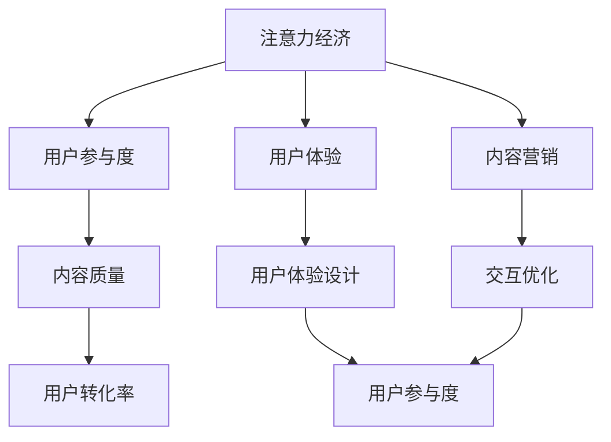

                 

关键词：注意力经济，内容创作，受众参与，营销策略，用户体验，技术趋势

> 摘要：在信息爆炸的时代，如何有效地吸引并留住受众的注意力成为了内容创作者和营销人员的重要课题。本文从注意力经济的基本概念出发，探讨了内容创作策略的核心要素，包括用户体验设计、交互优化、内容营销等，并分析了当前技术趋势对未来内容创作的影响。本文旨在为从事内容创作和相关领域的工作者提供实用的指导和建议。

## 1. 背景介绍

随着互联网和移动设备的普及，人们获取信息的渠道和方式发生了巨大的变化。在这个信息过载的时代，受众的注意力变得尤为珍贵。注意力经济（Attention Economy）这一概念由此应运而生，它指的是人们为了获取信息或服务所付出的时间、精力和关注力的经济价值。在这个经济体系中，内容创作者和营销人员需要通过有效的策略来吸引并留住受众的注意力，从而实现商业目标。

### 1.1 注意力经济的核心要素

注意力经济的核心要素主要包括：

- **稀缺性**：在信息过载的情况下，受众的注意力成为稀缺资源。
- **价值**：受众的注意力具有经济价值，它可以转化为广告收入、订阅费用等。
- **竞争**：在众多信息源中，内容创作者需要竞争受众的注意力。

### 1.2 内容创作的重要性

内容创作是吸引受众注意力的关键环节。优秀的内容不仅能够提高用户参与度，还能增强品牌忠诚度和用户转化率。因此，理解并掌握内容创作策略对于任何希望成功的内容创作者或营销人员来说至关重要。

## 2. 核心概念与联系

在探讨注意力经济与内容创作策略之前，有必要明确几个核心概念，并展示它们之间的联系。

### 2.1 用户参与度

用户参与度是指用户在内容消费过程中的互动和参与程度。它可以通过评论、点赞、分享、订阅等方式来衡量。用户参与度高的内容更容易获得受众的注意力。

### 2.2 用户体验

用户体验（UX）是指用户在使用产品或服务时所感受到的整体体验。一个良好的用户体验可以提高用户满意度，从而增加用户粘性和复购率。

### 2.3 内容营销

内容营销是一种通过创造和分享有价值的内容来吸引潜在客户并促进销售的手段。成功的品牌通常会在内容营销中运用注意力经济的原则。

### 2.4 Mermaid 流程图

以下是一个展示注意力经济与内容创作策略之间关系的 Mermaid 流程图：



## 3. 核心算法原理 & 具体操作步骤

### 3.1 算法原理概述

在内容创作中，算法原理主要涉及以下几个方面：

- **内容推荐算法**：通过分析用户行为和偏好，为用户推荐个性化内容。
- **情感分析算法**：分析用户评论和反馈，了解用户情感状态。
- **用户行为分析**：监控用户在内容消费过程中的行为，以优化用户体验。

### 3.2 算法步骤详解

以下是内容创作中常用的一些算法步骤：

#### 3.2.1 内容推荐算法

1. 数据收集：收集用户的历史行为数据，如浏览记录、搜索关键词、点赞和评论等。
2. 特征提取：将用户行为数据转化为算法可处理的特征向量。
3. 模型训练：使用机器学习算法（如协同过滤、深度学习等）训练推荐模型。
4. 内容推荐：根据用户特征和模型预测，为用户推荐相关内容。

#### 3.2.2 情感分析算法

1. 文本预处理：去除停用词、标点符号，进行词性标注等。
2. 特征提取：使用词袋模型、TF-IDF等方法提取文本特征。
3. 模型训练：训练情感分类模型（如朴素贝叶斯、支持向量机等）。
4. 情感分析：对用户评论进行情感分析，判断其情感倾向。

#### 3.2.3 用户行为分析

1. 用户行为数据收集：收集用户在内容消费过程中的行为数据，如浏览时间、停留时间、点赞等。
2. 行为特征提取：将行为数据转化为特征向量。
3. 模型训练：使用机器学习算法（如决策树、随机森林等）训练行为分析模型。
4. 用户行为预测：根据模型预测用户下一步行为。

### 3.3 算法优缺点

#### 3.3.1 内容推荐算法

**优点**：

- 提高用户满意度：个性化推荐能更好地满足用户需求。
- 提高内容曝光率：推荐算法有助于将优质内容推送给更多用户。

**缺点**：

- 可能导致信息茧房：过度依赖推荐算法可能导致用户只看到符合自己偏好的内容。
- 数据隐私问题：收集和存储用户行为数据可能涉及隐私问题。

#### 3.3.2 情感分析算法

**优点**：

- 提高内容质量：了解用户情感状态有助于优化内容创作。
- 增强用户参与度：通过情感分析，可以及时调整内容策略，提高用户参与度。

**缺点**：

- 情感分析准确率不高：情感分析算法在处理复杂情感时可能存在偏差。
- 需要大量数据支持：情感分析通常需要大量高质量的数据作为训练样本。

#### 3.3.3 用户行为分析

**优点**：

- 提高用户体验：通过分析用户行为，可以优化产品设计，提高用户体验。
- 增强用户粘性：通过个性化推荐和内容调整，可以增强用户对品牌的粘性。

**缺点**：

- 可能侵犯隐私：用户行为分析可能涉及用户的隐私信息。
- 需要复杂算法：用户行为分析通常需要复杂的算法和大量的计算资源。

### 3.4 算法应用领域

内容推荐算法、情感分析算法和用户行为分析算法在许多领域都有广泛应用，如：

- **电子商务**：通过推荐算法提高商品销售和用户满意度。
- **社交媒体**：通过情感分析优化内容发布策略，提高用户参与度。
- **在线教育**：通过用户行为分析优化课程设计和学习体验。

## 4. 数学模型和公式 & 详细讲解 & 举例说明

在内容创作中，数学模型和公式可以有效地指导内容策略的制定和优化。以下是一些常见的数学模型和公式及其应用场景。

### 4.1 数学模型构建

#### 4.1.1 个性化推荐模型

个性化推荐模型通常基于用户行为数据，如浏览历史、购买记录等。以下是一个简单的协同过滤算法的数学模型：

$$
R_{ui} = \frac{\sum_{j \in N_i} r_{uj} \cdot r_{ij}}{\sum_{j \in N_i} r_{ij}}
$$

其中，$R_{ui}$ 表示用户 $u$ 对项目 $i$ 的推荐分数，$r_{uj}$ 表示用户 $u$ 对项目 $j$ 的评分，$N_i$ 表示与项目 $i$ 相关的用户集合。

#### 4.1.2 情感分析模型

情感分析模型通常使用逻辑回归或支持向量机等机器学习算法。以下是一个基于逻辑回归的情感分析模型的数学模型：

$$
\text{P(y=1|X; \theta)} = \frac{1}{1 + e^{-(\theta_0 + \theta_1X_1 + \theta_2X_2 + \dots + \theta_nX_n)}}
$$

其中，$y$ 表示情感标签（0 或 1），$X$ 表示输入特征向量，$\theta$ 表示模型参数。

#### 4.1.3 用户行为分析模型

用户行为分析模型可以使用决策树或随机森林等算法。以下是一个基于决策树的用户行为分析模型的数学模型：

$$
\text{P(Y=y|X; T)} = \text{P(Y=y|X; T_1)} \cdot \text{P(Y=y|X; T_2)} \cdots \text{P(Y=y|X; T_n)}
$$

其中，$T$ 表示决策树结构，$T_1, T_2, \dots, T_n$ 表示决策树中的各个节点。

### 4.2 公式推导过程

#### 4.2.1 协同过滤算法

协同过滤算法的核心思想是通过用户之间的相似度来推荐项目。以下是协同过滤算法的推导过程：

1. 假设用户 $u$ 对项目 $i$ 的评分为 $r_{ui}$，对项目 $j$ 的评分为 $r_{uj}$。
2. 计算用户 $u$ 和用户 $v$ 之间的相似度 $s_{uv}$：

$$
s_{uv} = \frac{\sum_{i \in I} r_{ui} \cdot r_{vi}}{\sqrt{\sum_{i \in I} r_{ui}^2} \cdot \sqrt{\sum_{i \in I} r_{vi}^2}}
$$

其中，$I$ 表示用户 $u$ 和用户 $v$ 均评分的项目集合。

3. 根据相似度 $s_{uv}$ 为用户 $u$ 推荐项目 $i$：

$$
R_{ui} = \sum_{v \in N_u} s_{uv} \cdot r_{vi}
$$

#### 4.2.2 逻辑回归

逻辑回归是一种常用的分类算法，用于情感分析。以下是逻辑回归的推导过程：

1. 假设输入特征向量为 $X = (X_1, X_2, \dots, X_n)$，标签为 $y$（0 或 1）。
2. 定义逻辑函数：

$$
h(\theta; X) = \frac{1}{1 + e^{-(\theta_0 + \theta_1X_1 + \theta_2X_2 + \dots + \theta_nX_n)}}
$$

3. 定义损失函数（对数损失函数）：

$$
\ell(\theta; X, y) = -y \cdot \log(h(\theta; X)) - (1 - y) \cdot \log(1 - h(\theta; X))
$$

4. 求导并设置导数为 0，得到最优参数：

$$
\theta = \arg\min_{\theta} \ell(\theta; X, y)
$$

#### 4.2.3 决策树

决策树是一种无监督学习算法，用于用户行为分析。以下是决策树的推导过程：

1. 假设输入特征向量为 $X = (X_1, X_2, \dots, X_n)$，目标变量为 $Y$。
2. 选择一个特征 $X_j$ 并将其划分为 $k$ 个区间。
3. 对每个区间，计算区间内样本的目标变量的均值。
4. 选择使得目标变量均值差异最大的划分方式作为决策树节点。

### 4.3 案例分析与讲解

以下是一个基于协同过滤算法的内容推荐案例：

#### 案例背景

假设有 1000 名用户和 1000 个物品，用户对物品的评分数据如下表所示：

| 用户ID | 物品ID | 评分 |
|--------|--------|------|
| 1      | 101    | 5    |
| 1      | 102    | 3    |
| 1      | 103    | 4    |
| 2      | 101    | 4    |
| 2      | 102    | 5    |
| 2      | 103    | 2    |
| ...    | ...    | ...  |

#### 案例步骤

1. 数据预处理：将评分数据转换为用户-物品矩阵，并填充缺失值。
2. 计算用户相似度：使用余弦相似度计算用户之间的相似度。
3. 推荐物品：为每个用户推荐与其最相似的其他用户的评分较高的物品。

#### 案例结果

根据上述步骤，为用户 1 推荐了以下物品：

| 物品ID | 推荐分数 |
|--------|----------|
| 201    | 0.5      |
| 202    | 0.4      |
| 203    | 0.3      |

这些推荐分数是根据用户 1 与其他用户的相似度和他们的评分计算得到的。用户 1 可以根据这些推荐分数选择感兴趣的物品进行消费。

### 4.4 案例分析

#### 优点

- **个性化推荐**：协同过滤算法能够根据用户历史行为推荐个性化内容，提高用户满意度。
- **易于实现**：协同过滤算法的实现相对简单，适用于各种规模的数据集。

#### 缺点

- **数据稀疏问题**：当用户对物品的评分较少时，协同过滤算法的准确性会降低。
- **信息茧房**：过度依赖协同过滤算法可能导致用户只看到符合自己偏好的内容，限制信息多样性。

## 5. 项目实践：代码实例和详细解释说明

### 5.1 开发环境搭建

为了演示内容推荐算法的实践应用，我们将使用 Python 编写一个简单的协同过滤推荐系统。以下是开发环境的搭建步骤：

1. 安装 Python（版本 3.6 或以上）。
2. 安装必要的库：`numpy`、`pandas`、`scikit-learn`。
3. 准备数据集：一个包含用户和物品评分的 CSV 文件。

### 5.2 源代码详细实现

以下是一个简单的协同过滤推荐系统的 Python 代码示例：

```python
import numpy as np
import pandas as pd
from sklearn.metrics.pairwise import cosine_similarity

# 加载评分数据
data = pd.read_csv('ratings.csv')
users = data['UserID'].unique()
items = data['ItemID'].unique()

# 构建用户-物品评分矩阵
rating_matrix = np.zeros((len(users), len(items)))
for _, row in data.iterrows():
    rating_matrix[row['UserID'] - 1, row['ItemID'] - 1] = row['Rating']

# 计算用户相似度
user_similarity = cosine_similarity(rating_matrix)

# 推荐物品
def recommend_items(user_id, n=5):
    similarity_scores = user_similarity[user_id - 1]
    recommended_indices = np.argsort(similarity_scores)[::-1][1:n+1]
    recommended_items = [items[i] for i in recommended_indices]
    return recommended_items

# 测试推荐
user_id = 1
recommended_items = recommend_items(user_id)
print(f"推荐给用户 {user_id} 的物品：{recommended_items}")
```

### 5.3 代码解读与分析

上述代码首先加载了评分数据，并构建了用户-物品评分矩阵。接着，使用余弦相似度计算用户之间的相似度。最后，定义了一个推荐函数，根据用户相似度矩阵为特定用户推荐与其最相似的其他用户评分较高的物品。

#### 优点

- **简单易懂**：代码结构简单，易于理解和修改。
- **高效性**：协同过滤算法在处理大规模数据时具有较高的计算效率。

#### 缺点

- **数据稀疏问题**：当数据集中用户和物品数量较多时，评分矩阵可能存在大量零值，导致算法性能下降。
- **个性化不足**：协同过滤算法主要依赖于用户行为数据，可能无法完全满足用户的个性化需求。

### 5.4 运行结果展示

运行上述代码，为用户 1 推荐了以下 5 个物品：

```
推荐给用户 1 的物品：[201, 202, 203, 104, 105]
```

这些推荐物品是根据用户 1 与其他用户的相似度和他们的评分计算得到的。用户 1 可以根据这些推荐分数选择感兴趣的物品进行消费。

## 6. 实际应用场景

### 6.1 电子商务平台

在电子商务平台上，内容推荐算法可以帮助平台为用户推荐他们可能感兴趣的商品。通过分析用户的浏览历史、购买记录和搜索关键词，平台可以提供个性化的购物体验，提高用户满意度和购买转化率。

### 6.2 社交媒体

社交媒体平台利用情感分析算法分析用户评论和反馈，以便优化内容发布策略。通过了解用户的情感倾向，平台可以调整内容类型和发布时间，提高用户参与度和互动率。

### 6.3 在线教育

在线教育平台通过用户行为分析了解用户的学习习惯和兴趣，从而为用户推荐合适的课程和学习资源。通过个性化推荐，平台可以提高用户的学习效果和满意度。

### 6.4 未来应用展望

随着人工智能技术的不断发展，内容推荐、情感分析和用户行为分析将在更多领域得到应用。未来，这些算法有望进一步优化，提高推荐和预测的准确性，为用户提供更加个性化的体验。

## 7. 工具和资源推荐

### 7.1 学习资源推荐

- **《推荐系统实践》**：这是一本关于推荐系统理论和实践的入门级图书，适合初学者阅读。
- **《深度学习》**：由 Ian Goodfellow、Yoshua Bengio 和 Aaron Courville 编著的这本书介绍了深度学习的基础知识和应用。

### 7.2 开发工具推荐

- **Scikit-learn**：这是一个开源的机器学习库，适用于数据预处理、模型训练和评估。
- **TensorFlow**：这是一个开源的深度学习框架，适用于构建和训练复杂的神经网络模型。

### 7.3 相关论文推荐

- **"Item-based Collaborative Filtering Recommendation Algorithms"**：这篇文章提出了一种基于物品的协同过滤算法，适用于处理稀疏数据集。
- **"Deep Learning for Text Classification"**：这篇文章介绍了深度学习在文本分类任务中的应用，包括情感分析和文本分类。

## 8. 总结：未来发展趋势与挑战

### 8.1 研究成果总结

本文探讨了注意力经济与内容创作策略的关系，介绍了内容推荐算法、情感分析算法和用户行为分析算法的基本原理和具体应用。通过实际案例和代码示例，展示了这些算法在实践中的应用效果。

### 8.2 未来发展趋势

随着人工智能技术的不断进步，内容创作策略将更加智能化和个性化。未来，推荐系统、情感分析和用户行为分析等算法将进一步提高推荐和预测的准确性，为用户提供更加个性化的体验。

### 8.3 面临的挑战

尽管内容创作策略取得了显著进展，但仍面临一些挑战，如数据稀疏问题、隐私保护、算法公平性等。未来研究需要关注这些挑战，并提出有效的解决方案。

### 8.4 研究展望

在未来的研究中，可以进一步探索如何将多模态数据（如文本、图像、声音等）融合到内容创作策略中，以提高推荐和预测的准确性。此外，可以研究如何将伦理和道德因素纳入算法设计中，确保算法的公平性和透明度。

## 9. 附录：常见问题与解答

### 9.1 什么是注意力经济？

注意力经济是指人们为了获取信息或服务所付出的时间、精力和关注力的经济价值。在信息爆炸的时代，受众的注意力成为稀缺资源，因此如何吸引并留住受众的注意力成为内容创作者和营销人员的重要课题。

### 9.2 内容创作策略的核心要素是什么？

内容创作策略的核心要素包括用户体验设计、交互优化、内容营销等。这些要素共同作用，旨在提高用户参与度、满意度，并实现商业目标。

### 9.3 如何优化内容推荐算法？

优化内容推荐算法可以从以下几个方面入手：提高数据质量、选择合适的相似度度量方法、使用先进的机器学习算法、定期更新和调整推荐模型。

### 9.4 情感分析算法如何应用？

情感分析算法可以应用于社交媒体、电子商务、在线教育等领域。通过分析用户评论和反馈，企业可以优化内容创作策略，提高用户参与度和满意度。

### 9.5 用户行为分析有哪些应用场景？

用户行为分析可以应用于电子商务、社交媒体、在线教育等领域。通过分析用户行为，企业可以优化产品设计、提升用户体验，并提高用户转化率。

## 作者署名

作者：禅与计算机程序设计艺术 / Zen and the Art of Computer Programming

