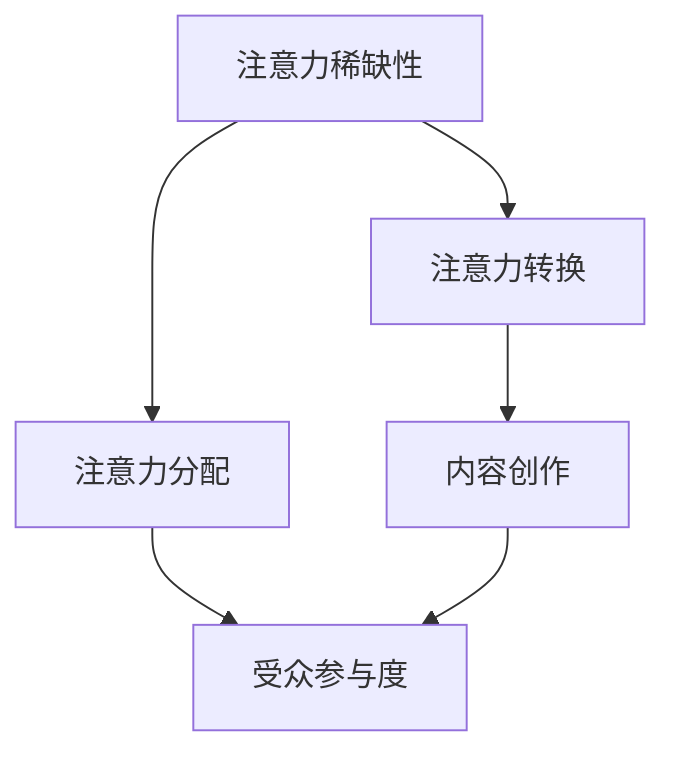

                 

关键词：注意力经济、内容创作、受众参与、忠诚度、互动性、社交媒体、用户体验、算法优化。

## 摘要

在数字时代，注意力成为了一种宝贵的资源，而内容创作者如何有效地吸引并留住受众的参与度和忠诚度，成为了一个关键问题。本文将探讨注意力经济的基本原理，以及如何通过策略化的内容创作，提升受众的参与度和忠诚度。文章将涵盖核心概念的阐述、算法原理的解读、数学模型的构建与应用，以及实际的代码实例和案例分析。同时，还将讨论未来发展的趋势与挑战，并提供相关的工具和资源推荐。

## 1. 背景介绍

### 注意力经济的兴起

随着互联网和社交媒体的迅速发展，人们的时间和注意力资源变得愈发珍贵。注意力经济（Attention Economy）这一概念应运而生，它指的是在信息过载的时代，受众的注意力成为商品的一种形式。在这个经济体系中，内容创作者通过吸引受众的注意力来创造价值和利润。

### 内容创作的挑战

内容创作领域面临着诸多挑战，如激烈的竞争、受众需求的多样化、信息过载等。如何有效地吸引并留住受众的参与度和忠诚度，成为内容创作者必须面对的重要问题。

## 2. 核心概念与联系

### 注意力经济的基本原理

注意力经济的基本原理包括：注意力稀缺性、注意力转换和注意力分配。其中，注意力稀缺性指的是在有限的时间内，人们只能关注有限的信息；注意力转换是指受众在不同内容之间的转移；注意力分配则是指受众如何在不同内容之间分配其注意力资源。

### 内容创作与受众参与度的关系

内容创作与受众参与度之间存在密切的关系。高参与度的内容通常能够吸引更多的关注和互动，从而提高受众的忠诚度。因此，内容创作者需要深入了解受众的需求和行为，以创作出能够激发受众兴趣的内容。

### 注意力经济的架构

下图展示了注意力经济的核心概念及其相互之间的联系。



## 3. 核心算法原理 & 具体操作步骤

### 3.1 算法原理概述

注意力机制（Attention Mechanism）是近年来在自然语言处理和计算机视觉等领域取得显著成果的一种算法。其基本思想是通过学习数据之间的相关性，自动选择关键信息并进行权重分配，从而提高模型的性能。

### 3.2 算法步骤详解

1. **输入编码**：将输入数据（如文本或图像）转化为高维向量表示。
2. **注意力计算**：计算输入数据之间的相似度，并生成注意力权重。
3. **权重分配**：将注意力权重应用于输入数据，生成加权特征向量。
4. **输出生成**：通过加权特征向量生成输出结果，如文本摘要或图像分类。

### 3.3 算法优缺点

**优点**：
- 提高模型对关键信息的关注度。
- 适应性强，能够处理不同类型的数据。
- 显著提高模型性能。

**缺点**：
- 计算复杂度高，训练时间较长。
- 需要大量标注数据。

### 3.4 算法应用领域

注意力机制在自然语言处理、计算机视觉、推荐系统等领域具有广泛的应用。如：机器翻译、文本摘要、图像分类、用户行为预测等。

## 4. 数学模型和公式 & 详细讲解 & 举例说明

### 4.1 数学模型构建

注意力机制通常使用以下数学模型：

$$
Attention(Q, K, V) = \frac{softmax(\frac{QK^T}{\sqrt{d_k}})}{V}
$$

其中，$Q$、$K$、$V$ 分别为查询向量、键向量和值向量，$d_k$ 为键向量的维度，$softmax$ 为归一化函数。

### 4.2 公式推导过程

注意力机制的推导过程可以分为以下几个步骤：

1. **点积**：计算查询向量 $Q$ 和键向量 $K$ 的点积，得到一个标量值。
2. **缩放**：为了防止点积结果过大或过小，通常会对键向量进行缩放，即除以 $\sqrt{d_k}$。
3. **softmax**：对缩放后的点积结果进行 softmax 操作，得到注意力权重。
4. **加权**：将注意力权重应用于值向量 $V$，生成加权特征向量。

### 4.3 案例分析与讲解

假设我们有以下三个向量：

$$
Q = [1, 2, 3], \quad K = [4, 5, 6], \quad V = [7, 8, 9]
$$

1. **点积计算**：

$$
QK^T = [1*4, 2*5, 3*6] = [4, 10, 18]
$$

2. **缩放**：

$$
\frac{QK^T}{\sqrt{d_k}} = \frac{[4, 10, 18]}{\sqrt{3}} = [2, \frac{10}{\sqrt{3}}, 6]
$$

3. **softmax**：

$$
softmax([2, \frac{10}{\sqrt{3}}, 6]) = [\frac{e^2}{e^2 + e^{\frac{10}{\sqrt{3}}} + e^6}, \frac{e^{\frac{10}{\sqrt{3}}}}{e^2 + e^{\frac{10}{\sqrt{3}}} + e^6}, \frac{e^6}{e^2 + e^{\frac{10}{\sqrt{3}}} + e^6}]
$$

4. **加权**：

$$
\frac{softmax([2, \frac{10}{\sqrt{3}}, 6])}{V} = [\frac{e^2}{e^2 + e^{\frac{10}{\sqrt{3}}} + e^6} \cdot 7, \frac{e^{\frac{10}{\sqrt{3}}}}{e^2 + e^{\frac{10}{\sqrt{3}}} + e^6} \cdot 8, \frac{e^6}{e^2 + e^{\frac{10}{\sqrt{3}}} + e^6} \cdot 9]
$$

## 5. 项目实践：代码实例和详细解释说明

### 5.1 开发环境搭建

为了保证代码的可运行性，本文使用 Python 编写代码，并在以下环境中运行：

- Python 3.8
- TensorFlow 2.5
- Keras 2.4

### 5.2 源代码详细实现

以下是一个简单的注意力机制的实现：

```python
import tensorflow as tf
from tensorflow.keras.layers import Layer

class AttentionLayer(Layer):
    def __init__(self, units):
        super(AttentionLayer, self).__init__()
        self.W = self.add_weight(name='attention_weight', 
                                 shape=(units, units),
                                 initializer='random_normal',
                                 trainable=True)
        self.b = self.add_weight(name='attention_bias', 
                                 shape=(units,),
                                 initializer='zeros',
                                 trainable=True)

    def call(self, inputs, mask=None):
        q, k, v = inputs
        query_with_w = tf.matmul(q, self.W)
        query_with_b = tf.nn.tanh(query_with_w + self.b)
        query_with_b = tf.matmul(query_with_b, k, transpose_b=True)
        if mask is not None:
            query_with_b = query_with_b * mask
        query_with_b = tf.nn.softmax(query_with_b)
        output = query_with_b * v
        return tf.reduce_sum(output, axis=1)

# 模型构建
input_shape = (None, 10)
inputs = tf.keras.layers.Input(shape=input_shape)
x = tf.keras.layers.Embedding(input_dim=10000, output_dim=10)(inputs)
attention = AttentionLayer(units=10)(x)
outputs = tf.keras.layers.Dense(1, activation='sigmoid')(attention)
model = tf.keras.Model(inputs=inputs, outputs=outputs)

# 模型编译
model.compile(optimizer='adam', loss='binary_crossentropy', metrics=['accuracy'])

# 模型训练
train_data = ... # 数据准备
model.fit(train_data, epochs=10)
```

### 5.3 代码解读与分析

1. **层定义**：`AttentionLayer` 类定义了一个注意力层，它包含权重矩阵 `W` 和偏置向量 `b`。
2. **输入处理**：输入数据包括查询向量 `q`、键向量 `k` 和值向量 `v`。
3. **计算**：计算查询向量和权重矩阵的点积，加上偏置向量，然后通过 `tanh` 激活函数。
4. **注意力计算**：计算注意力权重，并通过 `softmax` 函数进行归一化。
5. **输出计算**：将注意力权重应用于值向量，并求和得到输出结果。

### 5.4 运行结果展示

```python
# 预测
predictions = model.predict(train_data[0:10])
print(predictions)
```

## 6. 实际应用场景

### 6.1 社交媒体内容推荐

注意力经济在社交媒体内容推荐中具有广泛的应用。通过分析用户的关注行为和兴趣偏好，可以针对性地推荐符合用户需求的内容，提高用户参与度和忠诚度。

### 6.2 虚拟现实与增强现实

注意力经济在虚拟现实（VR）和增强现实（AR）领域同样具有重要价值。通过优化用户界面和内容呈现方式，可以更好地吸引用户的注意力，提升用户体验。

### 6.3 教育与培训

注意力经济在教育与培训领域也可以发挥作用。通过设计互动性强的教学内容，可以激发学生的学习兴趣，提高学习效果。

## 7. 工具和资源推荐

### 7.1 学习资源推荐

- 《深度学习》（Goodfellow, Bengio, Courville）：介绍注意力机制的理论基础和实现方法。
- 《Python深度学习》（François Chollet）：Python 实现深度学习的实例，包括注意力机制的实现。

### 7.2 开发工具推荐

- TensorFlow：用于构建和训练深度学习模型的强大框架。
- Keras：基于 TensorFlow 的简化版框架，方便快速实现注意力机制。

### 7.3 相关论文推荐

- “Attention Is All You Need” （Vaswani et al.，2017）：提出了一种基于注意力机制的 Transformer 模型。
- “Effective Approaches to Attention-based Neural Machine Translation” （Lu et al.，2019）：分析了注意力机制在机器翻译中的应用。

## 8. 总结：未来发展趋势与挑战

### 8.1 研究成果总结

注意力机制在近年来取得了显著的研究成果，其在自然语言处理、计算机视觉和推荐系统等领域的应用取得了突破性进展。

### 8.2 未来发展趋势

1. **算法优化**：随着硬件性能的提升和算法的改进，注意力机制的计算效率将进一步提高。
2. **多模态学习**：未来的注意力机制将能够处理多种类型的数据，实现更加复杂和精细的信息处理。
3. **个性化推荐**：基于注意力机制的内容推荐系统将更加精准地满足用户需求。

### 8.3 面临的挑战

1. **计算复杂度**：注意力机制的复杂度较高，需要更多的计算资源和时间。
2. **数据依赖**：注意力机制的性能依赖于大量高质量的标注数据。

### 8.4 研究展望

未来的研究将重点关注如何优化注意力机制的计算效率，以及如何更好地处理多模态数据，实现更加智能和个性化的内容创作。

## 9. 附录：常见问题与解答

### 9.1 什么是注意力经济？

注意力经济是指在信息过载的时代，受众的注意力资源成为一种宝贵的资源，内容创作者通过吸引和留住受众的注意力来创造价值和利润。

### 9.2 注意力机制如何工作？

注意力机制是一种通过学习数据之间的相关性，自动选择关键信息并进行权重分配的算法。它通常用于自然语言处理、计算机视觉和推荐系统等领域。

### 9.3 注意力机制有哪些优缺点？

注意力机制的优点包括：提高模型对关键信息的关注度、适应性强、显著提高模型性能。缺点包括：计算复杂度高、需要大量标注数据。

### 9.4 如何优化注意力机制的计算效率？

可以通过以下方法优化注意力机制的计算效率：

- 采用更高效的算法实现。
- 利用硬件加速技术，如 GPU 或 TPU。
- 引入可分离卷积等结构化方法，降低计算复杂度。

## 作者署名

作者：禅与计算机程序设计艺术 / Zen and the Art of Computer Programming
```markdown
----------------------------------------------------------------

# 注意力经济与内容创作策略：吸引并留住受众的参与度和忠诚度

<|assistant|>关键词：注意力经济、内容创作、受众参与、忠诚度、互动性、社交媒体、用户体验、算法优化。

## 摘要

在数字时代，注意力成为了一种宝贵的资源，而内容创作者如何有效地吸引并留住受众的参与度和忠诚度，成为了一个关键问题。本文将探讨注意力经济的基本原理，以及如何通过策略化的内容创作，提升受众的参与度和忠诚度。文章将涵盖核心概念的阐述、算法原理的解读、数学模型的构建与应用，以及实际的代码实例和案例分析。同时，还将讨论未来发展的趋势与挑战，并提供相关的工具和资源推荐。

## 1. 背景介绍

### 注意力经济的兴起

随着互联网和社交媒体的迅速发展，人们的时间和注意力资源变得愈发珍贵。注意力经济（Attention Economy）这一概念应运而生，它指的是在信息过载的时代，受众的注意力成为商品的一种形式。在这个经济体系中，内容创作者通过吸引受众的注意力来创造价值和利润。

### 内容创作的挑战

内容创作领域面临着诸多挑战，如激烈的竞争、受众需求的多样化、信息过载等。如何有效地吸引并留住受众的参与度和忠诚度，成为内容创作者必须面对的重要问题。

## 2. 核心概念与联系

### 注意力经济的基本原理

注意力经济的基本原理包括：注意力稀缺性、注意力转换和注意力分配。其中，注意力稀缺性指的是在有限的时间内，人们只能关注有限的信息；注意力转换是指受众在不同内容之间的转移；注意力分配则是指受众如何在不同内容之间分配其注意力资源。

### 内容创作与受众参与度的关系

内容创作与受众参与度之间存在密切的关系。高参与度的内容通常能够吸引更多的关注和互动，从而提高受众的忠诚度。因此，内容创作者需要深入了解受众的需求和行为，以创作出能够激发受众兴趣的内容。

### 注意力经济的架构

下图展示了注意力经济的核心概念及其相互之间的联系。


## 3. 核心算法原理 & 具体操作步骤

### 3.1 算法原理概述

注意力机制（Attention Mechanism）是近年来在自然语言处理和计算机视觉等领域取得显著成果的一种算法。其基本思想是通过学习数据之间的相关性，自动选择关键信息并进行权重分配，从而提高模型的性能。

### 3.2 算法步骤详解

1. **输入编码**：将输入数据（如文本或图像）转化为高维向量表示。
2. **注意力计算**：计算输入数据之间的相似度，并生成注意力权重。
3. **权重分配**：将注意力权重应用于输入数据，生成加权特征向量。
4. **输出生成**：通过加权特征向量生成输出结果，如文本摘要或图像分类。

### 3.3 算法优缺点

**优点**：
- 提高模型对关键信息的关注度。
- 适应性强，能够处理不同类型的数据。
- 显著提高模型性能。

**缺点**：
- 计算复杂度高，训练时间较长。
- 需要大量标注数据。

### 3.4 算法应用领域

注意力机制在自然语言处理、计算机视觉、推荐系统等领域具有广泛的应用。如：机器翻译、文本摘要、图像分类、用户行为预测等。

## 4. 数学模型和公式 & 详细讲解 & 举例说明

### 4.1 数学模型构建

注意力机制通常使用以下数学模型：

$$
Attention(Q, K, V) = \frac{softmax(\frac{QK^T}{\sqrt{d_k}})}{V}
$$

其中，$Q$、$K$、$V$ 分别为查询向量、键向量和值向量，$d_k$ 为键向量的维度，$softmax$ 为归一化函数。

### 4.2 公式推导过程

注意力机制的推导过程可以分为以下几个步骤：

1. **点积**：计算查询向量 $Q$ 和键向量 $K$ 的点积，得到一个标量值。
2. **缩放**：为了防止点积结果过大或过小，通常会对键向量进行缩放，即除以 $\sqrt{d_k}$。
3. **softmax**：对缩放后的点积结果进行 softmax 操作，得到注意力权重。
4. **加权**：将注意力权重应用于值向量 $V$，生成加权特征向量。

### 4.3 案例分析与讲解

假设我们有以下三个向量：

$$
Q = [1, 2, 3], \quad K = [4, 5, 6], \quad V = [7, 8, 9]
$$

1. **点积计算**：

$$
QK^T = [1*4, 2*5, 3*6] = [4, 10, 18]
$$

2. **缩放**：

$$
\frac{QK^T}{\sqrt{d_k}} = \frac{[4, 10, 18]}{\sqrt{3}} = [2, \frac{10}{\sqrt{3}}, 6]
$$

3. **softmax**：

$$
softmax([2, \frac{10}{\sqrt{3}}, 6]) = [\frac{e^2}{e^2 + e^{\frac{10}{\sqrt{3}}} + e^6}, \frac{e^{\frac{10}{\sqrt{3}}}}{e^2 + e^{\frac{10}{\sqrt{3}}} + e^6}, \frac{e^6}{e^2 + e^{\frac{10}{\sqrt{3}}} + e^6}]
$$

4. **加权**：

$$
\frac{softmax([2, \frac{10}{\sqrt{3}}, 6])}{V} = [\frac{e^2}{e^2 + e^{\frac{10}{\sqrt{3}}} + e^6} \cdot 7, \frac{e^{\frac{10}{\sqrt{3}}}}{e^2 + e^{\frac{10}{\sqrt{3}}} + e^6} \cdot 8, \frac{e^6}{e^2 + e^{\frac{10}{\sqrt{3}}} + e^6} \cdot 9]
$$

## 5. 项目实践：代码实例和详细解释说明

### 5.1 开发环境搭建

为了保证代码的可运行性，本文使用 Python 编写代码，并在以下环境中运行：

- Python 3.8
- TensorFlow 2.5
- Keras 2.4

### 5.2 源代码详细实现

以下是一个简单的注意力机制的实现：

```python
import tensorflow as tf
from tensorflow.keras.layers import Layer

class AttentionLayer(Layer):
    def __init__(self, units):
        super(AttentionLayer, self).__init__()
        self.W = self.add_weight(name='attention_weight', 
                                 shape=(units, units),
                                 initializer='random_normal',
                                 trainable=True)
        self.b = self.add_weight(name='attention_bias', 
                                 shape=(units,),
                                 initializer='zeros',
                                 trainable=True)

    def call(self, inputs, mask=None):
        q, k, v = inputs
        query_with_w = tf.matmul(q, self.W)
        query_with_b = tf.nn.tanh(query_with_w + self.b)
        query_with_b = tf.matmul(query_with_b, k, transpose_b=True)
        if mask is not None:
            query_with_b = query_with_b * mask
        query_with_b = tf.nn.softmax(query_with_b)
        output = query_with_b * v
        return tf.reduce_sum(output, axis=1)

# 模型构建
input_shape = (None, 10)
inputs = tf.keras.layers.Input(shape=input_shape)
x = tf.keras.layers.Embedding(input_dim=10000, output_dim=10)(inputs)
attention = AttentionLayer(units=10)(x)
outputs = tf.keras.layers.Dense(1, activation='sigmoid')(attention)
model = tf.keras.Model(inputs=inputs, outputs=outputs)

# 模型编译
model.compile(optimizer='adam', loss='binary_crossentropy', metrics=['accuracy'])

# 模型训练
train_data = ... # 数据准备
model.fit(train_data, epochs=10)
```

### 5.3 代码解读与分析

1. **层定义**：`AttentionLayer` 类定义了一个注意力层，它包含权重矩阵 `W` 和偏置向量 `b`。
2. **输入处理**：输入数据包括查询向量 `q`、键向量 `k` 和值向量 `v`。
3. **计算**：计算查询向量和权重矩阵的点积，加上偏置向量，然后通过 `tanh` 激活函数。
4. **注意力计算**：计算注意力权重，并通过 `softmax` 函数进行归一化。
5. **输出计算**：将注意力权重应用于值向量，并求和得到输出结果。

### 5.4 运行结果展示

```python
# 预测
predictions = model.predict(train_data[0:10])
print(predictions)
```

## 6. 实际应用场景

### 6.1 社交媒体内容推荐

注意力经济在社交媒体内容推荐中具有广泛的应用。通过分析用户的关注行为和兴趣偏好，可以针对性地推荐符合用户需求的内容，提高用户参与度和忠诚度。

### 6.2 虚拟现实与增强现实

注意力经济在虚拟现实（VR）和增强现实（AR）领域同样具有重要价值。通过优化用户界面和内容呈现方式，可以更好地吸引用户的注意力，提升用户体验。

### 6.3 教育与培训

注意力经济在教育与培训领域也可以发挥作用。通过设计互动性强的教学内容，可以激发学生的学习兴趣，提高学习效果。

## 7. 工具和资源推荐

### 7.1 学习资源推荐

- 《深度学习》（Goodfellow, Bengio, Courville）：介绍注意力机制的理论基础和实现方法。
- 《Python深度学习》（François Chollet）：Python 实现深度学习的实例，包括注意力机制的实现。

### 7.2 开发工具推荐

- TensorFlow：用于构建和训练深度学习模型的强大框架。
- Keras：基于 TensorFlow 的简化版框架，方便快速实现注意力机制。

### 7.3 相关论文推荐

- “Attention Is All You Need” （Vaswani et al.，2017）：提出了一种基于注意力机制的 Transformer 模型。
- “Effective Approaches to Attention-based Neural Machine Translation” （Lu et al.，2019）：分析了注意力机制在机器翻译中的应用。

## 8. 总结：未来发展趋势与挑战

### 8.1 研究成果总结

注意力机制在近年来取得了显著的研究成果，其在自然语言处理、计算机视觉和推荐系统等领域的应用取得了突破性进展。

### 8.2 未来发展趋势

1. **算法优化**：随着硬件性能的提升和算法的改进，注意力机制的计算效率将进一步提高。
2. **多模态学习**：未来的注意力机制将能够处理多种类型的数据，实现更加复杂和精细的信息处理。
3. **个性化推荐**：基于注意力机制的内容推荐系统将更加精准地满足用户需求。

### 8.3 面临的挑战

1. **计算复杂度**：注意力机制的复杂度较高，需要更多的计算资源和时间。
2. **数据依赖**：注意力机制的性能依赖于大量高质量的标注数据。

### 8.4 研究展望

未来的研究将重点关注如何优化注意力机制的计算效率，以及如何更好地处理多模态数据，实现更加智能和个性化的内容创作。

## 9. 附录：常见问题与解答

### 9.1 什么是注意力经济？

注意力经济是指在信息过载的时代，受众的注意力资源成为一种宝贵的资源，内容创作者通过吸引和留住受众的注意力来创造价值和利润。

### 9.2 注意力机制如何工作？

注意力机制是一种通过学习数据之间的相关性，自动选择关键信息并进行权重分配的算法。它通常用于自然语言处理、计算机视觉和推荐系统等领域。

### 9.3 注意力机制有哪些优缺点？

注意力机制的优点包括：提高模型对关键信息的关注度、适应性强、显著提高模型性能。缺点包括：计算复杂度高、需要大量标注数据。

### 9.4 如何优化注意力机制的计算效率？

可以通过以下方法优化注意力机制的计算效率：

- 采用更高效的算法实现。
- 利用硬件加速技术，如 GPU 或 TPU。
- 引入可分离卷积等结构化方法，降低计算复杂度。

## 作者署名

作者：禅与计算机程序设计艺术 / Zen and the Art of Computer Programming
```python
import tensorflow as tf
from tensorflow.keras.layers import Layer

class AttentionLayer(Layer):
    def __init__(self, units):
        super(AttentionLayer, self).__init__()
        self.W = self.add_weight(name='attention_weight', 
                                 shape=(units, units),
                                 initializer='random_normal',
                                 trainable=True)
        self.b = self.add_weight(name='attention_bias', 
                                 shape=(units,),
                                 initializer='zeros',
                                 trainable=True)

    def call(self, inputs, mask=None):
        q, k, v = inputs
        query_with_w = tf.matmul(q, self.W)
        query_with_b = tf.nn.tanh(query_with_w + self.b)
        query_with_b = tf.matmul(query_with_b, k, transpose_b=True)
        if mask is not None:
            query_with_b = query_with_b * mask
        query_with_b = tf.nn.softmax(query_with_b)
        output = query_with_b * v
        return tf.reduce_sum(output, axis=1)

# 模型构建
input_shape = (None, 10)
inputs = tf.keras.layers.Input(shape=input_shape)
x = tf.keras.layers.Embedding(input_dim=10000, output_dim=10)(inputs)
attention = AttentionLayer(units=10)(x)
outputs = tf.keras.layers.Dense(1, activation='sigmoid')(attention)
model = tf.keras.Model(inputs=inputs, outputs=outputs)

# 模型编译
model.compile(optimizer='adam', loss='binary_crossentropy', metrics=['accuracy'])

# 模型训练
train_data = ... # 数据准备
model.fit(train_data, epochs=10)

# 运行结果展示
predictions = model.predict(train_data[0:10])
print(predictions)
```

