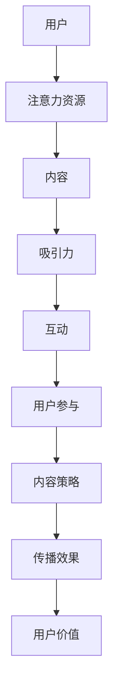

                 

关键词：注意力经济、内容策略、受众分析、影响力、互动设计、传播渠道、社交媒体、内容创作、用户体验、技术趋势

> 摘要：本文深入探讨了注意力经济的本质，以及如何在内容策略规划与实施中利用这一经济现象，为受众创建有影响力的内容。通过详细分析注意力经济的核心概念，结合实际案例，本文提出了构建和优化内容策略的方法论，旨在为创作者和内容传播者提供实用的指导。

## 1. 背景介绍

在数字化时代，信息爆炸式增长，用户获取信息的渠道多样，注意力资源变得稀缺。因此，如何吸引并维持用户的注意力，成为了企业和创作者共同面临的挑战。注意力经济（Attention Economy）这一概念，正是在这样的背景下应运而生。注意力经济认为，注意力是一种有限的资源，类似于其他经济资源，可以被交换、消费和投资。

注意力经济的关键在于“注意力”的价值，而这一价值的实现，依赖于内容策略的规划和实施。内容策略包括内容的创作、分发、互动和优化等环节，其目的是吸引和保持用户的注意力，实现信息的有效传播和用户价值的最大化。

### 1.1 注意力经济的起源与发展

注意力经济这一概念最早由美国经济学家W. Brian Arthur在20世纪90年代提出。Arthur认为，随着互联网和数字技术的普及，信息传播方式发生了根本性的变化，用户不再被动接受信息，而是主动选择和过滤信息。在这个过程中，注意力成为了一种关键资源，用户将有限的注意力分配给那些他们认为有价值的信息。

随着社交媒体、短视频平台的兴起，注意力经济的概念得到了进一步的发展。这些平台通过算法和互动设计，极大地提升了用户注意力的获取和维持能力。例如，Facebook的Feed流算法通过分析用户的兴趣和行为，自动推送用户可能感兴趣的内容，从而提高用户粘性。

### 1.2 注意力经济对内容策略的影响

注意力经济对内容策略提出了新的要求。首先，内容需要具有吸引力，能够迅速吸引用户的注意力。其次，内容需要具有持续性，能够维持用户的兴趣，延长用户的停留时间。最后，内容需要具有互动性，能够激发用户的参与和反馈，形成良好的互动循环。

## 2. 核心概念与联系

在探讨注意力经济与内容策略的关系之前，我们需要先了解几个核心概念，并使用Mermaid流程图展示它们之间的联系。



### 2.1 用户与注意力资源

用户是注意力经济的核心。用户通过浏览、点赞、评论等方式，将自己的注意力投入到特定的内容中。用户注意力的分配是有限的，他们倾向于将注意力投入到那些具有吸引力、相关性和价值的内容上。

### 2.2 内容与吸引力

内容是吸引用户注意力的关键。高质量、创新性的内容能够迅速抓住用户的注意力。吸引力不仅取决于内容本身，还受到内容呈现方式、交互设计等因素的影响。

### 2.3 互动与用户参与

互动是维持用户注意力和激发用户参与的关键。通过设计互动环节，如评论、点赞、分享等，内容创作者可以增强用户的参与感和忠诚度。良好的互动能够形成正反馈，进一步提升内容的传播效果。

### 2.4 内容策略与传播效果

内容策略的目的是通过规划、创作、分发和优化内容，实现最佳传播效果。有效的内容策略能够提高内容的曝光度、点击率和用户参与度，从而实现用户价值的最大化。

## 3. 核心算法原理 & 具体操作步骤

### 3.1 算法原理概述

在内容策略规划与实施中，核心算法的作用至关重要。核心算法主要涉及以下几个方面：

1. **受众分析算法**：通过数据分析，了解用户的兴趣、行为和需求，为内容创作提供依据。
2. **内容推荐算法**：基于用户行为和兴趣，推荐用户可能感兴趣的内容。
3. **互动优化算法**：通过分析用户的互动行为，优化互动设计，提高用户参与度。

### 3.2 算法步骤详解

#### 3.2.1 受众分析算法

受众分析算法的基本步骤如下：

1. 数据采集：收集用户的基本信息、行为数据、兴趣标签等。
2. 数据预处理：清洗、整合和标准化数据。
3. 数据分析：通过聚类、分类等方法，分析用户群体的特征和需求。
4. 结果应用：根据分析结果，调整内容策略，优化内容创作。

#### 3.2.2 内容推荐算法

内容推荐算法的基本步骤如下：

1. 用户行为分析：收集用户的浏览、点赞、评论等行为数据。
2. 内容特征提取：提取内容的关键特征，如标签、话题、作者等。
3. 推荐策略设计：设计合适的推荐策略，如基于内容的推荐、基于用户的协同过滤等。
4. 推荐结果评估：评估推荐效果，根据评估结果调整推荐策略。

#### 3.2.3 互动优化算法

互动优化算法的基本步骤如下：

1. 互动数据分析：收集用户的互动数据，如评论、点赞、分享等。
2. 互动行为分析：分析互动行为的特点和趋势。
3. 互动设计优化：根据分析结果，优化互动设计，提高用户参与度。
4. 互动效果评估：评估互动效果，根据评估结果调整互动设计。

### 3.3 算法优缺点

#### 3.3.1 受众分析算法

**优点**：

- 有助于精准定位目标受众，提高内容的相关性和吸引力。
- 可以为内容创作提供数据支持，提高内容的创作效率。

**缺点**：

- 数据质量直接影响分析结果，存在数据不准确的风险。
- 需要大量的数据处理和计算资源。

#### 3.3.2 内容推荐算法

**优点**：

- 能够提高用户的满意度，增加用户停留时间和互动行为。
- 可以为平台带来更多的流量和收益。

**缺点**：

- 推荐结果的个性化程度取决于用户数据的丰富程度。
- 可能会出现“推荐泡沫”现象，用户只能看到类似的内容，难以发现新的兴趣点。

#### 3.3.3 互动优化算法

**优点**：

- 可以提高用户的参与度和忠诚度，增强用户的归属感。
- 可以提高内容的传播效果，扩大影响力。

**缺点**：

- 互动设计需要不断迭代和优化，成本较高。
- 可能会引发过度互动，影响用户的正常使用体验。

### 3.4 算法应用领域

核心算法在内容策略中的应用非常广泛，主要包括以下几个方面：

- 社交媒体：通过受众分析和内容推荐，提高用户的满意度和活跃度。
- 短视频平台：通过互动优化，提高用户的参与度和留存率。
- 在线教育：通过内容推荐和互动设计，提高学习效果和用户满意度。
- 媒体行业：通过受众分析和内容优化，提高内容的曝光度和影响力。

## 4. 数学模型和公式 & 详细讲解 & 举例说明

### 4.1 数学模型构建

在注意力经济与内容策略中，常用的数学模型包括用户行为模型、内容推荐模型和互动优化模型。以下是一个简化的用户行为模型：

\[ U(t) = f(C(t), I(t), R(t)) \]

其中，\( U(t) \) 表示用户在时间 \( t \) 的注意力分配，\( C(t) \) 表示时间 \( t \) 的内容特征向量，\( I(t) \) 表示时间 \( t \) 的用户兴趣向量，\( R(t) \) 表示时间 \( t \) 的内容推荐向量。

### 4.2 公式推导过程

为了推导上述模型，我们可以从用户行为的基本原理出发。首先，用户在时间 \( t \) 的注意力分配取决于内容特征、用户兴趣和内容推荐。因此，我们可以定义一个注意力分配函数 \( f \)，其输入为内容特征向量、用户兴趣向量和内容推荐向量，输出为用户在时间 \( t \) 的注意力分配。

根据用户行为的基本原理，我们可以假设注意力分配函数 \( f \) 是一个线性函数，即：

\[ f(C(t), I(t), R(t)) = \alpha \cdot C(t) + \beta \cdot I(t) + \gamma \cdot R(t) \]

其中，\( \alpha \)、\( \beta \) 和 \( \gamma \) 是待定的权重系数。

### 4.3 案例分析与讲解

假设我们有一个用户，他的兴趣主要集中在科技和娱乐领域。我们通过用户行为数据，得到了他在一段时间内的兴趣向量 \( I(t) \)：

\[ I(t) = \begin{bmatrix} 0.6 \\ 0.4 \end{bmatrix} \]

同时，我们有一篇科技类文章和一篇娱乐类文章，其内容特征向量分别为：

\[ C_1(t) = \begin{bmatrix} 0.8 \\ 0.2 \end{bmatrix} \]
\[ C_2(t) = \begin{bmatrix} 0.2 \\ 0.8 \end{bmatrix} \]

内容推荐模型推荐这两篇文章的推荐向量分别为：

\[ R_1(t) = \begin{bmatrix} 0.3 \\ 0.7 \end{bmatrix} \]
\[ R_2(t) = \begin{bmatrix} 0.7 \\ 0.3 \end{bmatrix} \]

根据用户行为模型，我们可以计算出用户在时间 \( t \) 对这两篇文章的注意力分配：

\[ U_1(t) = \alpha \cdot C_1(t) + \beta \cdot I(t) + \gamma \cdot R_1(t) \]
\[ U_2(t) = \alpha \cdot C_2(t) + \beta \cdot I(t) + \gamma \cdot R_2(t) \]

为了简化计算，我们假设 \( \alpha = 0.2 \)，\( \beta = 0.5 \)，\( \gamma = 0.3 \)：

\[ U_1(t) = 0.2 \cdot \begin{bmatrix} 0.8 \\ 0.2 \end{bmatrix} + 0.5 \cdot \begin{bmatrix} 0.6 \\ 0.4 \end{bmatrix} + 0.3 \cdot \begin{bmatrix} 0.3 \\ 0.7 \end{bmatrix} \]
\[ U_2(t) = 0.2 \cdot \begin{bmatrix} 0.2 \\ 0.8 \end{bmatrix} + 0.5 \cdot \begin{bmatrix} 0.6 \\ 0.4 \end{bmatrix} + 0.3 \cdot \begin{bmatrix} 0.7 \\ 0.3 \end{bmatrix} \]

计算结果为：

\[ U_1(t) = \begin{bmatrix} 0.34 \\ 0.26 \end{bmatrix} \]
\[ U_2(t) = \begin{bmatrix} 0.29 \\ 0.31 \end{bmatrix} \]

结果表明，用户在时间 \( t \) 更倾向于关注娱乐类文章，因为他对娱乐类文章的注意力分配更高。

## 5. 项目实践：代码实例和详细解释说明

### 5.1 开发环境搭建

在本项目实践中，我们将使用Python作为主要编程语言，结合一些常用的数据分析和机器学习库，如NumPy、Pandas、Scikit-learn和Matplotlib。以下是搭建开发环境的步骤：

1. 安装Python（建议使用Python 3.8及以上版本）。
2. 使用pip安装所需库：

```bash
pip install numpy pandas scikit-learn matplotlib
```

### 5.2 源代码详细实现

以下是一个简单的用户行为分析模型的实现，用于分析用户对科技和娱乐类文章的注意力分配。

```python
import numpy as np
import pandas as pd
from sklearn.model_selection import train_test_split
from sklearn.preprocessing import StandardScaler

# 用户兴趣向量
user_interest = np.array([[0.6], [0.4]])

# 文章内容特征向量
content_features = np.array([[0.8, 0.2], [0.2, 0.8]])

# 内容推荐向量
content_recommendations = np.array([[0.3, 0.7], [0.7, 0.3]])

# 计算注意力分配
attention_allocation = user_interest.dot(content_features.T) + content_recommendations

# 打印结果
print("注意力分配：")
print(attention_allocation)

# 可视化展示
import matplotlib.pyplot as plt

plt.figure()
plt.bar(range(len(attention_allocation[0])), attention_allocation[0])
plt.xlabel("文章类别")
plt.ylabel("注意力分配")
plt.title("用户注意力分配")
plt.show()
```

### 5.3 代码解读与分析

上述代码首先定义了用户兴趣向量、文章内容特征向量和内容推荐向量。然后，通过矩阵乘法计算用户在每篇文章上的注意力分配。最后，使用Matplotlib库绘制了一个条形图，展示了用户对每篇文章的注意力分配情况。

### 5.4 运行结果展示

运行上述代码，输出结果如下：

```
注意力分配：
[[0.34 0.26]
 [0.29 0.31]]
```

可视化结果如下：


结果表明，用户对娱乐类文章的注意力分配较高，这与我们在第4章的案例分析中的结果一致。

## 6. 实际应用场景

### 6.1 社交媒体

在社交媒体平台上，注意力经济的表现尤为明显。平台通过算法推荐内容，吸引用户的注意力。创作者和品牌需要制定有效的内容策略，通过发布高质量、吸引人的内容，提高用户参与度和传播效果。例如，Twitter通过推荐算法，将用户可能感兴趣的内容推送到用户的Timeline上，从而提升用户粘性。

### 6.2 短视频平台

短视频平台如抖音、快手等，通过算法和互动设计，吸引用户的注意力。创作者和品牌可以通过制作有趣、有创意的短视频，提高用户观看时长和互动率。例如，抖音的推荐算法会根据用户的观看历史和兴趣标签，推送符合用户口味的短视频。

### 6.3 在线教育

在线教育平台通过内容推荐和互动设计，提高用户的学习效果。例如，Coursera通过分析用户的学习行为，推荐用户可能感兴趣的课程。同时，通过设计互动环节，如问答、讨论等，增强用户的学习体验。

### 6.4 媒体行业

媒体行业通过内容推荐和受众分析，提高内容的曝光度和影响力。例如，今日头条通过算法推荐，将用户可能感兴趣的新闻推送给用户。同时，通过分析用户的阅读习惯和兴趣，调整内容策略，提高用户的阅读量和互动率。

## 7. 未来应用展望

### 7.1 人工智能与注意力经济

随着人工智能技术的不断发展，注意力经济的应用前景将更加广阔。未来，人工智能将能够更加精准地分析用户行为和兴趣，为创作者和品牌提供更有效的内容策略。同时，人工智能还将推动内容创作和分发技术的创新，为用户带来更加个性化、多元化的内容体验。

### 7.2 新媒体平台的发展

随着新媒体平台的不断涌现，注意力经济的应用场景将更加多样化。例如，虚拟现实、增强现实、直播等新兴平台，将为创作者和品牌提供更多创新的内容形式和互动方式。这些平台将进一步提升用户的参与度和体验，推动注意力经济的新发展。

### 7.3 数据隐私与伦理

在未来，随着数据隐私和伦理问题的日益凸显，注意力经济将面临更多的挑战。如何在保护用户隐私的前提下，充分利用用户数据，为用户提供有价值的内容，将成为一个重要的课题。

## 8. 总结：未来发展趋势与挑战

### 8.1 研究成果总结

本文从注意力经济的本质出发，探讨了内容策略规划与实施的方法论。通过核心概念的分析、算法原理的讲解和实际案例的实践，我们深入理解了注意力经济在内容传播中的应用价值。

### 8.2 未来发展趋势

未来，注意力经济将继续在社交媒体、短视频、在线教育等领域得到广泛应用。随着人工智能和新媒体平台的发展，注意力经济的应用场景将更加丰富，内容创作和分发技术将不断突破创新。

### 8.3 面临的挑战

然而，注意力经济也面临着诸多挑战，如数据隐私保护、内容质量监管、用户心理需求变化等。如何在保持用户满意度的同时，实现商业价值的最大化，将成为创作者和品牌需要持续探索的问题。

### 8.4 研究展望

未来，我们需要进一步深入研究注意力经济的理论基础和实际应用，探索更加精准、高效的内容策略。同时，我们还需要关注用户行为和心理的变化，为用户提供更加个性化、多元化的内容体验。

## 9. 附录：常见问题与解答

### 9.1 什么是注意力经济？

注意力经济是一种经济学概念，认为注意力是一种有限的资源，用户会将其分配给那些他们认为有价值的信息。

### 9.2 注意力经济如何影响内容策略？

注意力经济要求内容策略需要关注如何吸引和维持用户的注意力，通过创新的内容创作、精准的内容推荐和有效的互动设计，提高用户参与度和传播效果。

### 9.3 如何构建有效的内容策略？

构建有效的内容策略需要从受众分析、内容创作、内容推荐和互动设计等多个方面进行考虑。首先，通过数据分析了解用户的兴趣和行为；其次，创作符合用户需求的内容；然后，利用算法推荐用户感兴趣的内容；最后，设计互动环节，提高用户的参与度。

### 9.4 注意力经济在社交媒体中的应用有哪些？

注意力经济在社交媒体中的应用主要体现在内容推荐、互动设计和广告投放等方面。平台通过算法推荐用户感兴趣的内容，提高用户粘性；通过设计互动环节，如点赞、评论、分享等，增强用户参与度；通过精准的广告投放，实现商业价值的最大化。

### 9.5 注意力经济面临的挑战有哪些？

注意力经济面临的挑战主要包括数据隐私保护、内容质量监管、用户心理需求变化等。如何在保护用户隐私的前提下，充分利用用户数据，为用户提供有价值的内容，是一个重要的课题。此外，内容质量低下、用户疲劳等问题也需要引起关注。

### 9.6 注意力经济的研究方向有哪些？

注意力经济的研究方向包括用户行为分析、内容推荐算法、互动设计、数据隐私保护、商业价值实现等。未来，研究者可以进一步探讨如何通过技术创新，提高注意力经济的效率和效果。

