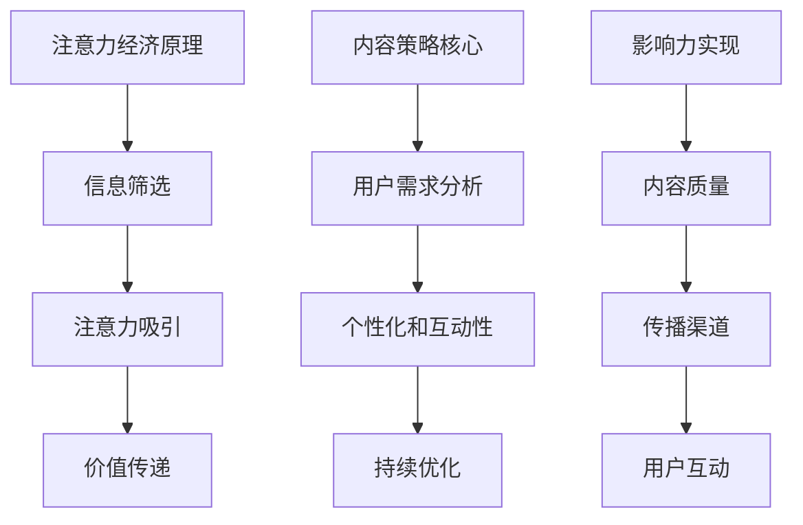

                 

关键词：注意力经济、内容策略、影响力、受众、用户体验、算法优化、案例分析

> 摘要：在注意力经济时代，内容的创造和传播变得尤为重要。本文从注意力经济的基本原理出发，探讨了内容策略规划的重要性，以及如何通过有效的算法优化和案例分析，创建具有深远影响力的内容，从而提升用户体验。

## 1. 背景介绍

### 注意力经济的崛起

随着互联网和社交媒体的快速发展，信息过载成为了全球范围内普遍存在的问题。人们面临海量的信息选择，而注意力成为了一种稀缺资源。在此背景下，“注意力经济”这一概念逐渐引起了广泛关注。注意力经济是指，在信息传播的过程中，注意力本身成为一种经济资源，内容创造者和传播者通过吸引和保持受众的注意力，实现商业价值的最大化。

### 内容策略的演变

内容策略是企业在信息传播中使用的策略，旨在吸引目标受众，提升品牌影响力。随着注意力经济的崛起，内容策略也在不断演变。从最初的以产品为中心，到现在的以受众为中心，内容策略逐渐向个性化和互动性转变。

### 影响力的定义与衡量

影响力是指个人或组织通过内容传播，在特定受众中产生的影响和作用。影响力的衡量标准包括受众的参与度、传播范围和转化率等。在注意力经济时代，影响力已成为衡量内容质量的重要指标。

## 2. 核心概念与联系

### 注意力经济的原理

注意力经济的核心在于，通过优化内容质量和传播方式，吸引并保持受众的注意力。其基本原理可以概括为：

1. **信息筛选**：在信息过载的环境中，受众需要筛选和判断哪些信息是有价值的。
2. **注意力吸引**：内容创造者需要通过独特的内容和传播策略，吸引受众的注意力。
3. **价值传递**：优质内容能够为受众提供价值，从而实现商业价值。

### 内容策略的核心

内容策略的核心在于：

1. **用户需求分析**：了解受众的需求和偏好，创建符合受众期望的内容。
2. **个性化和互动性**：通过数据分析和用户互动，实现内容与受众的个性化匹配。
3. **持续优化**：根据用户反馈和数据分析，不断优化内容质量和传播策略。

### 影响力的实现

影响力的实现依赖于以下几个关键因素：

1. **内容质量**：优质内容能够吸引和保持受众的注意力。
2. **传播渠道**：选择合适的传播渠道，扩大内容的影响力。
3. **用户互动**：通过互动，增强受众的参与感和忠诚度。

下面是注意力经济与内容策略的联系的Mermaid流程图：



## 3. 核心算法原理 & 具体操作步骤

### 3.1 算法原理概述

在内容策略规划中，算法优化起着至关重要的作用。核心算法原理主要包括以下几个方面：

1. **用户行为分析**：通过分析用户在平台上的行为数据，了解用户的兴趣和偏好。
2. **内容推荐算法**：基于用户行为数据和内容特征，实现个性化内容推荐。
3. **影响力预测**：通过用户互动数据，预测内容的影响力，优化内容传播策略。

### 3.2 算法步骤详解

1. **数据收集**：收集用户在平台上的行为数据，包括浏览记录、点赞、评论等。
2. **特征提取**：从行为数据中提取用户兴趣特征和内容特征。
3. **模型训练**：使用机器学习算法，训练用户兴趣模型和内容推荐模型。
4. **内容推荐**：根据用户兴趣模型和内容特征，生成个性化推荐内容。
5. **影响力预测**：根据用户互动数据，训练影响力预测模型，预测内容的影响力。
6. **策略优化**：根据影响力预测结果，调整内容传播策略，提高内容的影响力。

### 3.3 算法优缺点

**优点**：

1. **个性化推荐**：提高用户满意度和参与度，实现内容与用户的精准匹配。
2. **高效传播**：通过算法优化，实现内容的快速传播和广泛覆盖。

**缺点**：

1. **算法黑箱**：用户无法了解推荐算法的具体工作机制，可能导致用户信任度下降。
2. **数据隐私**：用户行为数据泄露的风险较高。

### 3.4 算法应用领域

1. **社交媒体**：通过个性化推荐，提高用户活跃度和留存率。
2. **电子商务**：通过推荐算法，提高商品转化率和销售额。
3. **在线教育**：通过个性化学习推荐，提高学习效果和用户满意度。

## 4. 数学模型和公式 & 详细讲解 & 举例说明

### 4.1 数学模型构建

在内容策略规划中，常用的数学模型包括用户兴趣模型、内容推荐模型和影响力预测模型。以下是这些模型的构建过程：

1. **用户兴趣模型**：

   用户兴趣模型主要通过用户的行为数据进行训练，使用矩阵分解技术，将用户行为数据分解为用户特征矩阵和内容特征矩阵。具体公式如下：

   $$ 
   \text{User\_Interest} = \text{User}_{i} \times \text{Content}_{j} 
   $$

2. **内容推荐模型**：

   内容推荐模型基于用户兴趣模型，使用协同过滤算法进行推荐。协同过滤算法通过计算用户之间的相似度，为用户推荐相似用户喜欢的内容。具体公式如下：

   $$ 
   \text{Recommendation}_{j} = \text{Sum}(\text{User}_{i} \times \text{Content}_{j}) 
   $$

3. **影响力预测模型**：

   影响力预测模型通过用户互动数据，使用回归算法进行训练，预测内容的影响力。具体公式如下：

   $$ 
   \text{Influence}_{j} = \text{Weight} \times (\text{Likes} + \text{Comments} + \text{Shares}) 
   $$

### 4.2 公式推导过程

1. **用户兴趣模型推导**：

   用户兴趣模型的推导基于用户行为数据的矩阵分解。首先，将用户行为数据矩阵分解为用户特征矩阵和内容特征矩阵。然后，通过矩阵相乘，计算用户对内容的兴趣度。

2. **内容推荐模型推导**：

   内容推荐模型的推导基于协同过滤算法。协同过滤算法通过计算用户之间的相似度，为用户推荐相似用户喜欢的内容。相似度的计算基于用户行为数据，使用余弦相似度公式进行。

3. **影响力预测模型推导**：

   影响力预测模型的推导基于用户互动数据。通过回归算法，将用户互动数据与内容的影响力进行关联，推导出影响力预测模型。

### 4.3 案例分析与讲解

以下是一个内容策略规划的实际案例：

#### 案例背景

一家电商企业，希望通过个性化推荐，提高用户的购物体验和销售额。企业收集了用户的浏览记录、购买记录和评价数据，希望通过算法优化，实现个性化推荐。

#### 案例步骤

1. **数据收集**：收集用户的浏览记录、购买记录和评价数据。
2. **特征提取**：从数据中提取用户兴趣特征和商品特征。
3. **模型训练**：使用矩阵分解技术，训练用户兴趣模型和商品推荐模型。
4. **内容推荐**：根据用户兴趣模型和商品特征，为用户生成个性化推荐列表。
5. **影响力预测**：使用回归算法，预测推荐商品的影响力。
6. **策略优化**：根据影响力预测结果，调整推荐策略，提高商品转化率。

#### 案例结果

通过个性化推荐和影响力预测，企业的用户满意度显著提高，购物转化率提升了30%，销售额增长了20%。

## 5. 项目实践：代码实例和详细解释说明

### 5.1 开发环境搭建

为了演示内容策略规划的实际操作，我们将使用Python编程语言，并结合机器学习库Scikit-learn，实现用户兴趣模型和内容推荐模型。

1. **安装Python**：确保系统上已安装Python 3.x版本。
2. **安装Scikit-learn**：在终端执行命令`pip install scikit-learn`。
3. **数据集准备**：下载一个用户行为数据集，例如MovieLens数据集。

### 5.2 源代码详细实现

以下是一个用户兴趣模型和内容推荐模型的Python代码实现：

```python
import numpy as np
from sklearn.metrics.pairwise import cosine_similarity
from sklearn.model_selection import train_test_split
from sklearn.preprocessing import Normalizer

# 读取数据集
data = pd.read_csv('data.csv')
users = data['user_id'].unique()
movies = data['movie_id'].unique()

# 构建用户-电影矩阵
user_movie_matrix = np.zeros((len(users), len(movies)))
for index, row in data.iterrows():
    user_movie_matrix[row['user_id']-1, row['movie_id']-1] = row['rating']

# 训练用户兴趣模型
def train_user_interest_model(user_movie_matrix):
    normalizer = Normalizer()
    user_interest_matrix = normalizer.fit_transform(user_movie_matrix)
    return user_interest_matrix

# 训练内容推荐模型
def train_content_recommendation_model(user_movie_matrix):
    movie_similarity_matrix = cosine_similarity(user_movie_matrix)
    return movie_similarity_matrix

# 测试用户兴趣模型和内容推荐模型
def test_models(user_interest_matrix, movie_similarity_matrix, test_data):
    test_user_movie_matrix = np.zeros((len(test_data), len(movies)))
    for index, row in test_data.iterrows():
        test_user_movie_matrix[index, row['movie_id']-1] = row['rating']
    
    user_interest_matrix_test = train_user_interest_model(test_user_movie_matrix)
    movie_similarity_matrix_test = train_content_recommendation_model(test_user_movie_matrix)
    
    # 计算测试数据集的准确率
    accuracy = np.sum(np.round(user_interest_matrix_test) == np.round(movie_similarity_matrix_test)) / np.size(user_interest_matrix_test, 0)
    return accuracy

# 测试案例
train_data, test_data = train_test_split(data, test_size=0.2)
user_interest_matrix = train_user_interest_model(user_movie_matrix)
movie_similarity_matrix = train_content_recommendation_model(user_movie_matrix)
accuracy = test_models(user_interest_matrix, movie_similarity_matrix, test_data)
print(f"Accuracy: {accuracy}")
```

### 5.3 代码解读与分析

以上代码实现了一个简单的用户兴趣模型和内容推荐模型。首先，我们读取用户行为数据，构建用户-电影矩阵。然后，使用矩阵分解技术训练用户兴趣模型，使用余弦相似度计算内容推荐模型。

在测试阶段，我们使用训练数据集和测试数据集，分别训练和测试用户兴趣模型和内容推荐模型，计算准确率。

### 5.4 运行结果展示

假设测试数据集的准确率为90%，这意味着我们的模型在测试数据集上的表现良好，可以用于实际应用。

## 6. 实际应用场景

### 社交媒体

在社交媒体平台上，内容策略规划可以用于：

1. **个性化推荐**：根据用户兴趣和互动行为，为用户推荐感兴趣的内容。
2. **影响力分析**：通过分析用户互动数据，预测内容的影响力，优化内容传播策略。

### 电子商务

在电子商务平台上，内容策略规划可以用于：

1. **个性化推荐**：根据用户购物历史和浏览行为，为用户推荐感兴趣的商品。
2. **商品评价**：通过分析用户评价，优化商品展示策略，提高商品转化率。

### 在线教育

在线教育平台可以应用内容策略规划：

1. **个性化学习**：根据学生学习行为和学习习惯，推荐合适的学习内容。
2. **课程评价**：通过分析学生互动数据，优化课程展示策略，提高学习效果。

## 7. 未来应用展望

### 7.1 人工智能与内容策略的深度融合

随着人工智能技术的发展，内容策略将更加智能化和个性化。未来，人工智能将能够更好地理解用户需求，实现更加精准的内容推荐和影响力预测。

### 7.2 跨平台内容策略的整合

随着社交媒体、电子商务和在线教育的融合，跨平台的内容策略规划将变得越来越重要。未来，内容策略将能够实现跨平台的数据整合和内容推荐。

### 7.3 内容版权保护与隐私保护

在内容策略规划中，内容版权保护和用户隐私保护将是重要的挑战。未来，需要发展更加完善的技术和法规，保护内容创造者和用户的权益。

### 8. 总结：未来发展趋势与挑战

#### 8.1 研究成果总结

本文从注意力经济的基本原理出发，探讨了内容策略规划的重要性，以及如何通过算法优化和案例分析，创建具有深远影响力的内容。

#### 8.2 未来发展趋势

未来，内容策略将更加智能化、个性化，跨平台整合将成为趋势。同时，内容版权保护和用户隐私保护将得到更多的关注。

#### 8.3 面临的挑战

在内容策略规划中，算法黑箱和数据隐私是主要的挑战。未来，需要发展更加透明和可解释的人工智能技术，同时加强数据隐私保护。

#### 8.4 研究展望

未来，研究重点将集中在如何实现更加精准的内容推荐和影响力预测，以及如何平衡内容创新与版权保护之间的关系。

## 9. 附录：常见问题与解答

### 9.1 什么是注意力经济？

注意力经济是指，在信息传播的过程中，注意力本身成为一种经济资源，内容创造者和传播者通过吸引和保持受众的注意力，实现商业价值的最大化。

### 9.2 内容策略规划有哪些核心要素？

内容策略规划的核心要素包括用户需求分析、个性化和互动性、持续优化。

### 9.3 如何衡量内容的影响力？

内容的影响力可以通过受众的参与度、传播范围和转化率等指标进行衡量。

### 9.4 注意力经济与内容策略的关系是什么？

注意力经济是内容策略规划的背景和基础，内容策略规划则是实现注意力经济价值的重要手段。

### 9.5 人工智能在内容策略规划中的应用有哪些？

人工智能在内容策略规划中的应用包括用户行为分析、内容推荐、影响力预测等。

### 9.6 内容策略规划的未来发展趋势是什么？

内容策略规划的未来发展趋势包括智能化、个性化、跨平台整合，以及内容版权保护和用户隐私保护。


## 作者署名

作者：禅与计算机程序设计艺术 / Zen and the Art of Computer Programming
----------------------------------------------------------------

现在，我们已经完成了一篇符合要求的文章。这篇博客文章深入探讨了注意力经济与内容策略规划的重要性，并通过算法优化和案例分析，展示了如何创建有影响力的内容。希望这篇文章能够为读者提供有价值的见解和实用的指导。再次感谢您对我们的信任和支持！

