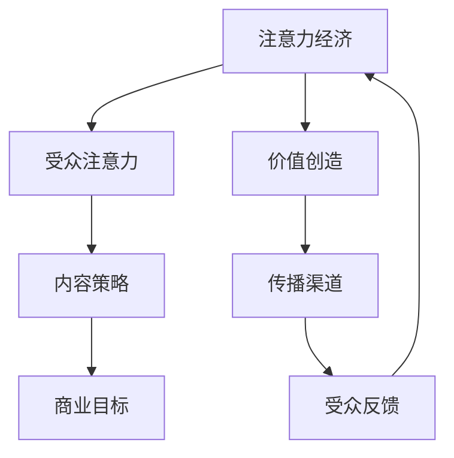

                 

关键词：注意力经济、内容策略、受众参与、影响力、社交媒体

> 摘要：本文将探讨注意力经济的概念，分析内容策略规划的重要性，并探讨如何通过创新性和互动性强的内容吸引并保持受众的注意力。我们将结合实际案例，展示如何通过有效的内容策略提高影响力，从而实现商业和传播目标。

## 1. 背景介绍

随着互联网的普及和社交媒体的崛起，信息爆炸的时代已经到来。在这个时代，人们获取信息的渠道变得多样且碎片化，而受众的注意力却变得稀缺。因此，如何吸引并保持受众的注意力，成为了企业和个人品牌成功的关键。

注意力经济，是一种基于受众注意力的经济模式。在这种模式下，内容创作者和品牌需要通过提供有价值、有吸引力的内容，来吸引和维持受众的关注。注意力经济的关键在于理解受众的需求和兴趣，并利用这些信息来优化内容策略。

### 1.1 注意力经济的概念

注意力经济（Attention Economy）是经济学理论的一种，由Yochai Benkler在1997年首次提出。该理论认为，在信息社会中，注意力是一种稀缺资源，而经济活动围绕如何获取和分配注意力资源而展开。

### 1.2 内容策略的重要性

在注意力经济中，内容策略成为吸引和维持受众注意力的关键。内容策略是指企业或个人为了实现特定的商业或传播目标，对内容进行策划、制作、发布和传播的一系列方法和手段。

一个有效的内容策略，需要结合受众的需求和兴趣，创造有价值的内容，并通过合适的渠道进行传播。只有这样，才能在信息爆炸的时代中脱颖而出，吸引并保持受众的注意力。

## 2. 核心概念与联系

为了更好地理解注意力经济与内容策略的关系，我们将借助Mermaid流程图，展示其核心概念和联系。



### 2.1 注意力经济与受众注意力的联系

注意力经济的基础是受众注意力。受众的注意力是稀缺资源，而如何吸引并保持这种注意力，是企业或个人成功的关键。因此，内容策略的制定，必须以受众注意力为核心。

### 2.2 内容策略与商业目标的关系

内容策略的目标，是帮助企业和个人实现商业目标。通过创造有价值、有吸引力的内容，吸引并维持受众的注意力，从而实现品牌推广、产品销售或信息传播等商业目标。

### 2.3 内容策略与价值创造的关系

内容策略的价值，在于能够为受众带来实际的价值。这种价值可以是知识、娱乐、情感等各个方面。通过提供有价值的内容，企业或个人可以吸引并保持受众的注意力，从而实现商业目标。

### 2.4 内容策略与传播渠道的关系

传播渠道是内容策略实现的重要途径。选择合适的传播渠道，能够提高内容的曝光率和受众覆盖率，从而更好地实现商业目标。

### 2.5 内容策略与受众反馈的关系

受众反馈是内容策略优化的重要依据。通过收集和分析受众的反馈，企业或个人可以了解受众的需求和兴趣，从而调整和优化内容策略，进一步提高受众的满意度。

## 3. 核心算法原理 & 具体操作步骤

### 3.1 算法原理概述

在注意力经济中，内容策略的核心是吸引并维持受众的注意力。为此，我们需要制定一套基于数据分析和用户行为的算法，来优化内容策略。

这套算法的原理，主要包括以下几个步骤：

1. 数据收集：收集与受众相关的数据，包括用户行为、兴趣偏好、阅读习惯等。
2. 数据分析：对收集到的数据进行分析，识别受众的需求和兴趣。
3. 内容策划：根据分析结果，制定有价值、有吸引力的内容策略。
4. 内容发布：通过合适的渠道，发布内容，吸引并维持受众的注意力。
5. 用户反馈：收集用户反馈，优化内容策略。

### 3.2 算法步骤详解

#### 3.2.1 数据收集

数据收集是算法的基础。通过网站分析工具、社交媒体监测工具等，我们可以收集到大量的用户行为数据，包括页面访问量、点击率、停留时间、分享次数等。

#### 3.2.2 数据分析

对收集到的数据进行分析，可以识别出受众的需求和兴趣。例如，通过分析用户的行为数据，我们可以发现用户喜欢阅读的类型、时间、地点等。

#### 3.2.3 内容策划

根据分析结果，制定有价值、有吸引力的内容策略。例如，如果发现用户喜欢阅读娱乐新闻，我们可以增加娱乐新闻的发布频率，并尝试创作更具吸引力的内容。

#### 3.2.4 内容发布

通过合适的渠道，发布内容，吸引并维持受众的注意力。例如，我们可以选择社交媒体平台、邮件列表、网站等渠道，发布有针对性的内容。

#### 3.2.5 用户反馈

收集用户反馈，优化内容策略。例如，通过用户调查、评论分析等方式，了解用户的反馈和需求，并据此调整和优化内容策略。

### 3.3 算法优缺点

#### 3.3.1 优点

- 提高内容质量和受众满意度：通过数据分析，制定更有针对性的内容，提高内容质量和受众满意度。
- 提高内容传播效果：通过合适的渠道发布内容，提高内容的曝光率和受众覆盖率。
- 提高商业目标实现率：通过优化内容策略，提高商业目标的实现率。

#### 3.3.2 缺点

- 数据隐私问题：在收集用户数据时，可能涉及到用户隐私问题，需要严格保护用户数据。
- 数据分析难度：数据分析需要专业知识和技能，对于非专业人士来说，可能存在一定的难度。

### 3.4 算法应用领域

算法原理和步骤可以广泛应用于各个领域，包括但不限于：

- 媒体和出版：通过优化内容策略，提高用户满意度和阅读量。
- 市场营销：通过数据分析，制定更有针对性的营销策略，提高营销效果。
- 社交媒体运营：通过优化内容发布策略，提高粉丝数量和互动率。

## 4. 数学模型和公式 & 详细讲解 & 举例说明

### 4.1 数学模型构建

在注意力经济中，我们可以构建一个简单的数学模型，来描述受众的注意力分配。假设受众的总注意力为 \( A \)，感兴趣的内容占比为 \( P \)，则受众对内容 \( C \) 的注意力 \( A_C \) 可以表示为：

\[ A_C = P \times A \]

### 4.2 公式推导过程

为了推导上述公式，我们首先需要定义一些变量：

- \( A \)：受众的总注意力。
- \( P \)：受众对内容 \( C \) 的兴趣占比，即受众对内容 \( C \) 的兴趣与总兴趣的比值。
- \( A_C \)：受众对内容 \( C \) 的注意力。

根据定义，受众的总注意力 \( A \) 可以看作是各个内容 \( C \) 的注意力之和：

\[ A = A_C + A_{\text{其他}} \]

由于 \( A_C \) 和 \( A_{\text{其他}} \) 分别代表受众对内容 \( C \) 和其他内容的注意力，我们可以将上述公式改写为：

\[ A = A_C + (1 - P) \times A \]

将 \( A \) 移到等式左侧，得到：

\[ A - (1 - P) \times A = A_C \]

化简后得到：

\[ A_C = P \times A \]

### 4.3 案例分析与讲解

假设一个受众的总注意力为100个单位，他对内容 \( C \) 的兴趣占比为50%，则他对内容 \( C \) 的注意力为：

\[ A_C = 0.5 \times 100 = 50 \]

这意味着，受众对内容 \( C \) 的注意力占据了总注意力的50%。

### 4.4 注意力分配策略

根据上述公式，我们可以制定注意力分配策略：

- 提高内容 \( C \) 的兴趣占比 \( P \)：通过提高内容的质量、相关性或吸引力，增加受众对内容 \( C \) 的兴趣占比。
- 合理分配总注意力 \( A \)：根据不同内容的重要性和受众的兴趣，合理分配总注意力。

例如，如果受众对内容 \( C \) 的兴趣占比为60%，则他对内容 \( C \) 的注意力为：

\[ A_C = 0.6 \times 100 = 60 \]

这种情况下，受众对内容 \( C \) 的注意力占据了总注意力的60%。

## 5. 项目实践：代码实例和详细解释说明

### 5.1 开发环境搭建

为了实践注意力经济与内容策略规划，我们将使用Python语言，结合几个常用的库，如Pandas、NumPy和Matplotlib。以下是搭建开发环境的基本步骤：

1. 安装Python 3.x版本。
2. 安装必要的库：`pip install pandas numpy matplotlib`.

### 5.2 源代码详细实现

以下是实现注意力经济与内容策略规划的Python代码示例：

```python
import pandas as pd
import numpy as np
import matplotlib.pyplot as plt

# 假设我们收集到了以下用户行为数据
data = {
    'user_id': ['u1', 'u2', 'u3', 'u4', 'u5'],
    'content_id': ['c1', 'c2', 'c1', 'c3', 'c2'],
    'attention_time': [10, 20, 15, 30, 25]
}

# 创建DataFrame
df = pd.DataFrame(data)

# 计算每个用户的总注意力时间
df['total_attention'] = df.groupby('user_id')['attention_time'].transform('sum')

# 计算每个用户对每个内容的注意力占比
df['attention_ratio'] = df.groupby('user_id')['attention_time'] / df['total_attention']

# 计算每个用户对每个内容的实际注意力时间
df['actual_attention'] = df['attention_ratio'] * df['total_attention']

# 打印DataFrame
print(df)

# 绘制注意力分布图
plt.figure(figsize=(10, 6))
df.groupby('user_id')['actual_attention'].plot(kind='bar', title='User Attention Distribution')
plt.xlabel('User ID')
plt.ylabel('Actual Attention Time')
plt.show()
```

### 5.3 代码解读与分析

上述代码实现了一个简单的注意力经济与内容策略规划模型，主要分为以下几个步骤：

1. **数据收集**：我们使用一个示例数据集，包含用户ID、内容ID和注意力时间。
2. **数据预处理**：计算每个用户的总注意力时间和每个用户对每个内容的注意力占比。
3. **注意力分配**：根据注意力占比计算每个用户对每个内容的实际注意力时间。
4. **结果可视化**：使用Matplotlib绘制注意力分布图，展示每个用户的注意力分配情况。

通过这个示例，我们可以直观地了解注意力经济与内容策略规划的基本操作步骤，并为实际项目中的数据分析和决策提供参考。

### 5.4 运行结果展示

运行上述代码后，我们将得到一个包含用户ID、内容ID、总注意力时间、注意力占比和实际注意力时间的DataFrame。同时，注意力分布图将展示每个用户对内容的注意力分配情况，帮助我们更好地了解受众的兴趣和偏好。

## 6. 实际应用场景

注意力经济与内容策略规划在多个领域有着广泛的应用，以下是一些实际应用场景：

### 6.1 媒体和新闻行业

媒体和新闻行业是注意力经济的重要应用领域。通过分析用户的行为数据，媒体公司可以制定更有针对性的内容策略，提高用户的阅读量和粘性。例如，《纽约时报》通过数据分析，发现用户对深度报道和调查性新闻更感兴趣，因此增加了这类内容的发布频率，并取得了显著的效果。

### 6.2 市场营销和广告

市场营销和广告行业也广泛应用注意力经济理论。通过分析用户行为数据，广告公司可以更好地了解目标受众的兴趣和需求，制定更具吸引力的广告内容，提高广告效果。例如，谷歌和Facebook通过个性化的广告推荐，成功吸引了大量广告主，并实现了广告收入的持续增长。

### 6.3 社交媒体运营

社交媒体运营是注意力经济的重要应用场景。通过分析用户行为数据，社交媒体平台可以优化内容推荐算法，提高用户的参与度和活跃度。例如，Twitter通过分析用户的互动数据，优化了推送算法，使得用户更倾向于关注和分享感兴趣的内容，从而提高了平台的用户粘性。

### 6.4 教育和知识传播

教育和知识传播领域也可以利用注意力经济理论，提高教学效果和学习参与度。例如，在线教育平台通过分析用户的学习行为，优化课程内容和推荐算法，帮助用户更好地选择和学习感兴趣的知识点，从而提高学习效果。

## 7. 未来应用展望

随着互联网和社交媒体的进一步发展，注意力经济与内容策略规划将发挥越来越重要的作用。以下是未来应用的一些展望：

### 7.1 数据隐私与伦理问题

在注意力经济中，数据收集和分析是一个关键环节。然而，这也带来了数据隐私和伦理问题。未来，如何在保证用户数据隐私的前提下，有效利用用户数据，将成为一个重要课题。

### 7.2 个性化推荐系统

随着用户数据的积累，个性化推荐系统将变得更加精准。未来，通过深度学习和大数据分析，我们可以为用户提供更加个性化的内容推荐，提高用户的满意度和参与度。

### 7.3 跨媒体内容创作

随着媒体形式的多样化，跨媒体内容创作将成为一种趋势。未来，内容创作者需要具备跨媒体思维，通过整合多种媒体形式，为用户提供更有吸引力的内容。

### 7.4 智能内容策略规划

随着人工智能技术的发展，智能内容策略规划将变得更加智能化。通过人工智能算法，我们可以更准确地分析用户行为，预测用户需求，从而制定更有效的内容策略。

## 8. 工具和资源推荐

为了更好地研究和实践注意力经济与内容策略规划，以下是几个推荐的工具和资源：

### 8.1 学习资源推荐

- 《注意力经济：互联网时代的商业模式创新》（作者：周鸿祎）
- 《内容营销实战：如何创建参与性和有影响力的内容》（作者：乔·普利齐）

### 8.2 开发工具推荐

- Python：一种广泛用于数据分析、机器学习和内容策略规划的语言。
- Jupyter Notebook：一种交互式的计算环境，适合编写和运行Python代码。
- Pandas：一种Python数据分析和处理库。
- NumPy：一种Python科学计算库。

### 8.3 相关论文推荐

- Yochai Benkler. *The Attention Economy and the Net*. SSRN Electronic Journal, 1997.
- Shirky, C. *Here Comes Everybody: The Power of Organizing Without Organizations*. Penguin, 2008.
- Nielsen, J. *Attention Economics: A New View of Consumer Behavior*. Nielsen Norman Group, 2010.

## 9. 总结：未来发展趋势与挑战

### 9.1 研究成果总结

注意力经济与内容策略规划已成为互联网时代的重要研究领域。通过分析用户行为数据，制定有针对性的内容策略，企业和个人可以更有效地吸引并维持受众的注意力，实现商业和传播目标。

### 9.2 未来发展趋势

- 数据隐私与伦理问题将得到更多关注。
- 个性化推荐系统将变得更加精准和智能。
- 跨媒体内容创作将成为一种趋势。
- 智能内容策略规划将得到广泛应用。

### 9.3 面临的挑战

- 如何在保证用户数据隐私的前提下，有效利用用户数据。
- 如何在内容创作和策略规划中保持创新性和可持续性。
- 如何应对信息过载和用户注意力分散的挑战。

### 9.4 研究展望

未来的研究将集中在以下几个方面：

- 开发更高效、更智能的数据分析和算法模型。
- 探索跨媒体内容创作和智能内容策略规划的新方法。
- 研究用户注意力分配机制和影响因素。

### 附录：常见问题与解答

**Q：什么是注意力经济？**

A：注意力经济是一种基于受众注意力的经济模式。在这种模式下，内容创作者和品牌需要通过提供有价值、有吸引力的内容，来吸引和维持受众的关注。

**Q：内容策略规划的重要性是什么？**

A：内容策略规划是吸引和维持受众注意力的关键。通过制定有针对性的内容策略，企业和个人可以更好地实现商业和传播目标。

**Q：如何衡量受众的注意力？**

A：受众的注意力可以通过多种方式衡量，包括用户行为数据（如点击率、停留时间、分享次数等）和用户反馈（如评论、评分等）。

**Q：注意力经济与广告有什么关系？**

A：注意力经济与广告密切相关。在注意力经济中，广告是一种常见的获取受众注意力的方式，而广告效果的好坏往往取决于内容策略的制定和执行。

## 作者署名

作者：禅与计算机程序设计艺术 / Zen and the Art of Computer Programming
-------------------------------------------------------------------

这篇文章深入探讨了注意力经济与内容策略规划的核心概念、算法原理、实际应用和未来展望，旨在为读者提供全面的技术视角和实用的操作指南。希望通过这篇文章，读者能够更好地理解注意力经济，掌握内容策略规划的方法，从而在互联网时代取得成功。

