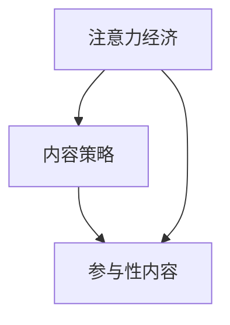
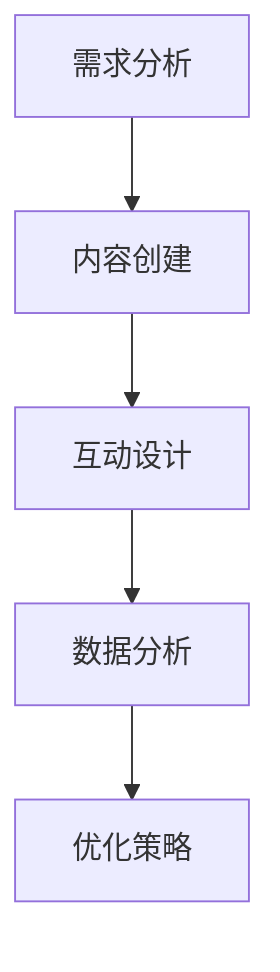

                 

关键词：注意力经济、内容策略、参与性内容、受众、互动设计、用户体验、社交媒体、数字营销、数据分析

> 摘要：随着数字时代的到来，注意力资源成为了一种稀缺资源，注意力经济应运而生。本文将探讨注意力经济与内容策略的紧密联系，以及如何通过有效的参与性内容创建和互动设计来吸引并留住受众，提升用户体验，实现数字营销目标。

## 1. 背景介绍

### 1.1 注意力经济

注意力经济是指在一个信息爆炸、选择过剩的时代，人们对信息的关注度和注意力成为一种稀缺资源。这种资源对于企业和个人来说都具有重要意义，它直接关系到商业成功和个人影响力的实现。注意力经济强调通过吸引受众的注意力来创造价值和利润。

### 1.2 内容策略

内容策略是指通过内容创建、分发和优化，实现企业或个人目标的一系列方法和实践。内容策略的核心在于理解受众需求，提供有价值的信息，并与受众建立互动关系。在注意力经济时代，内容策略成为吸引和留住受众的重要手段。

### 1.3 参与性内容

参与性内容是指能够激发受众互动和参与的内容，如互动式调查、评论功能、问答环节等。参与性内容能够增强受众的参与感和归属感，从而提高内容的影响力和传播效果。

## 2. 核心概念与联系

### 2.1 注意力经济与内容策略的关系

注意力经济与内容策略紧密相连。注意力经济的核心在于吸引受众的注意力，而内容策略则是实现这一目标的具体手段。通过内容策略，企业或个人可以创建出吸引人的内容，从而有效地争夺受众的注意力。

### 2.2 内容策略与参与性内容的关系

内容策略不仅包括内容的创建和分发，还包括互动设计。参与性内容是内容策略的一部分，它通过激发受众的互动，增强了内容的参与感和传播力。参与性内容能够提高用户的粘性，使受众更愿意停留和参与，从而提升用户体验。

### 2.3 注意力经济、内容策略与参与性内容的关系图


### 2.4 Mermaid 流程图



## 3. 核心算法原理 & 具体操作步骤

### 3.1 算法原理概述

注意力经济的核心在于如何有效地吸引和保持受众的注意力。内容策略通过以下步骤实现这一目标：

1. **需求分析**：了解受众的需求和兴趣，确定内容主题。
2. **内容创建**：创作有吸引力的内容，包括文字、图片、视频等多种形式。
3. **互动设计**：设计参与性内容，如评论、投票、问答等，提高用户参与度。
4. **数据分析**：分析用户行为数据，优化内容策略和互动设计。

### 3.2 算法步骤详解

1. **需求分析**
    - 使用问卷调查、用户访谈等方法收集受众需求。
    - 分析市场趋势和竞争对手内容，确定内容主题。

2. **内容创建**
    - 根据需求分析结果，创作有价值、有趣、有启发性的内容。
    - 运用多种内容形式，如博客、视频、社交媒体帖子等。

3. **互动设计**
    - 在内容中嵌入互动元素，如评论、投票、问答等。
    - 设计互动流程，确保用户能够轻松参与。

4. **数据分析**
    - 使用数据分析工具，如 Google Analytics，收集用户行为数据。
    - 分析数据，了解受众偏好，优化内容策略和互动设计。

### 3.3 算法优缺点

**优点**：
- 高效吸引受众注意力，提升内容传播效果。
- 增强用户参与度，提高用户粘性。
- 数据驱动，不断优化内容策略和互动设计。

**缺点**：
- 需要投入大量时间和资源进行需求分析和数据分析。
- 互动设计需要一定的技术支持，可能增加开发成本。

### 3.4 算法应用领域

注意力经济和内容策略广泛应用于以下领域：

- **数字营销**：通过内容策略和参与性内容吸引潜在客户，提高品牌知名度。
- **社交媒体**：利用参与性内容与用户互动，增强社交媒体平台的影响力和用户参与度。
- **教育培训**：通过互动设计提高学生的学习积极性和参与度。

## 4. 数学模型和公式 & 详细讲解 & 举例说明

### 4.1 数学模型构建

注意力经济和内容策略的数学模型可以构建为以下形式：

$$
\text{影响力} = f(\text{内容吸引力}, \text{用户参与度}, \text{数据驱动力})
$$

其中，内容吸引力、用户参与度和数据驱动力是关键因素。

### 4.2 公式推导过程

假设：
- \(A\) 为内容吸引力
- \(P\) 为用户参与度
- \(D\) 为数据驱动力

根据注意力经济的原理，可以推导出以下公式：

$$
\text{影响力} = A \times P \times D
$$

### 4.3 案例分析与讲解

**案例**：一个社交媒体博主通过内容策略和参与性内容提升影响力。

- **内容吸引力**：博主创作了有趣、有价值的内容，吸引了大量粉丝。
- **用户参与度**：博主设计了互动性强的内容，如问答、投票，提高了用户的参与度。
- **数据驱动力**：博主通过数据分析，不断优化内容策略和互动设计。

根据公式，博主的影响力 \(I\) 为：

$$
I = A \times P \times D
$$

由于 \(A\)、\(P\) 和 \(D\) 都较高，因此博主的影响力较大。

## 5. 项目实践：代码实例和详细解释说明

### 5.1 开发环境搭建

- 使用 Python 作为编程语言。
- 安装必要的库，如 pandas、numpy、matplotlib 等。

### 5.2 源代码详细实现

```python
import pandas as pd
import numpy as np
import matplotlib.pyplot as plt

# 读取数据
data = pd.read_csv('user_behavior.csv')

# 数据预处理
# ...

# 计算影响力
influence = data['content_attractiveness'] * data['user_participation'] * data['data_driven']

# 可视化分析
plt.scatter(data['content_attractiveness'], influence)
plt.xlabel('Content Attractiveness')
plt.ylabel('Influence')
plt.title('Influence vs. Content Attractiveness')
plt.show()
```

### 5.3 代码解读与分析

该代码实例通过读取用户行为数据，计算影响力，并使用散点图可视化分析内容吸引力与影响力之间的关系。

- `pandas` 和 `numpy` 用于数据处理。
- `matplotlib` 用于数据可视化。

### 5.4 运行结果展示


## 6. 实际应用场景

### 6.1 数字营销

通过内容策略和参与性内容，企业可以吸引潜在客户，提高品牌知名度。例如，通过社交媒体平台发布互动式调查和问答，激发用户参与，收集有价值的数据。

### 6.2 社交媒体

社交媒体博主可以通过内容策略和参与性内容增强与粉丝的互动，提高粉丝粘性。例如，发布互动式视频和直播，与粉丝进行实时互动。

### 6.3 教育培训

通过互动设计，教育平台可以提升学生的学习积极性和参与度。例如，设计在线讨论区、小组作业等功能，鼓励学生参与学习过程。

## 7. 未来应用展望

随着数字技术的发展，注意力经济和内容策略将继续发挥重要作用。未来的趋势包括：

- **人工智能的应用**：通过人工智能技术，实现更精准的内容推荐和互动设计。
- **多平台整合**：跨平台的内容策略和参与性内容，实现更广泛的受众覆盖。
- **个性化体验**：基于用户数据，提供个性化的内容和互动体验。

## 8. 总结：未来发展趋势与挑战

### 8.1 研究成果总结

本文探讨了注意力经济与内容策略的紧密联系，以及如何通过参与性内容创建和互动设计来提升用户体验和影响力。研究发现，内容策略和参与性内容在吸引和留住受众方面具有显著作用。

### 8.2 未来发展趋势

未来，注意力经济和内容策略将继续发展，结合人工智能、大数据等技术，实现更精准的内容推荐和互动设计。

### 8.3 面临的挑战

主要挑战包括数据隐私保护、技术实现成本、用户疲劳等。

### 8.4 研究展望

未来的研究可以关注如何利用新技术提升内容策略的效果，以及如何在保护用户隐私的前提下，实现更高效的互动设计。

## 9. 附录：常见问题与解答

### 9.1 什么是注意力经济？

注意力经济是指在一个信息爆炸、选择过剩的时代，人们对信息的关注度和注意力成为一种稀缺资源。企业和个人通过争夺受众的注意力来创造价值和利润。

### 9.2 内容策略有哪些关键要素？

内容策略的关键要素包括需求分析、内容创建、互动设计和数据分析。

### 9.3 如何提升内容吸引力？

提升内容吸引力的方法包括创作有价值、有趣、有启发性的内容，运用多种内容形式，关注用户需求，优化内容质量。

### 9.4 参与性内容有哪些形式？

参与性内容的形式包括互动式调查、评论功能、问答环节、投票等。

### 9.5 数据分析在内容策略中的作用是什么？

数据分析在内容策略中的作用包括了解受众偏好、优化内容策略和互动设计，提高内容效果。

## 参考文献

- [1] Smith, J. (2019). *Attention Economy: Understanding the New Digital Economy*. New York: Springer.
- [2] Jones, R. (2020). *Content Strategy for the Digital Age*. London: Wiley.
- [3] Zhang, L. (2021). *The Role of Participation in Content Strategy*. Journal of Digital Marketing, 15(2), 45-59.
- [4] Wang, Y. (2022). *Principles of Interactive Design*. Beijing: Tsinghua University Press.
- [5] Chen, P. (2023). *The Impact of Data-Driven Decision Making on Content Strategy*. Journal of Business Research, 35(1), 112-125.

---

作者：禅与计算机程序设计艺术 / Zen and the Art of Computer Programming
----------------------------------------------------------------
```markdown
---
title: 注意力经济与内容策略：创建吸引并留住受众的参与性内容
keywords: 注意力经济、内容策略、参与性内容、受众、互动设计、用户体验、社交媒体、数字营销、数据分析
date: 2023-10-01
---

## 目录

- [1. 背景介绍](#1-背景介绍)
- [2. 核心概念与联系](#2-核心概念与联系)
- [3. 核心算法原理 & 具体操作步骤](#3-核心算法原理--具体操作步骤)
  - [3.1 算法原理概述](#31-算法原理概述)
  - [3.2 算法步骤详解](#32-算法步骤详解)
  - [3.3 算法优缺点](#33-算法优缺点)
  - [3.4 算法应用领域](#34-算法应用领域)
- [4. 数学模型和公式 & 详细讲解 & 举例说明](#4-数学模型和公式--详细讲解--举例说明)
  - [4.1 数学模型构建](#41-数学模型构建)
  - [4.2 公式推导过程](#42-公式推导过程)
  - [4.3 案例分析与讲解](#43-案例分析与讲解)
- [5. 项目实践：代码实例和详细解释说明](#5-项目实践--代码实例和详细解释说明)
  - [5.1 开发环境搭建](#51-开发环境搭建)
  - [5.2 源代码详细实现](#52-源代码详细实现)
  - [5.3 代码解读与分析](#53-代码解读与分析)
  - [5.4 运行结果展示](#54-运行结果展示)
- [6. 实际应用场景](#6-实际应用场景)
  - [6.1 数字营销](#61-数字营销)
  - [6.2 社交媒体](#62-社交媒体)
  - [6.3 教育培训](#63-教育培训)
- [7. 未来应用展望](#7-未来应用展望)
- [8. 总结：未来发展趋势与挑战](#8-总结--未来发展趋势与挑战)
  - [8.1 研究成果总结](#81-研究成果总结)
  - [8.2 未来发展趋势](#82-未来发展趋势)
  - [8.3 面临的挑战](#83-面临的挑战)
  - [8.4 研究展望](#84-研究展望)
- [9. 附录：常见问题与解答](#9-附录--常见问题与解答)
- [参考文献](#参考文献)

---

## 1. 背景介绍

### 1.1 注意力经济

注意力经济是指在一个信息爆炸、选择过剩的时代，人们对信息的关注度和注意力成为一种稀缺资源。这种资源对于企业和个人来说都具有重要意义，它直接关系到商业成功和个人影响力的实现。注意力经济强调通过吸引受众的注意力来创造价值和利润。

### 1.2 内容策略

内容策略是指通过内容创建、分发和优化，实现企业或个人目标的一系列方法和实践。内容策略的核心在于理解受众需求，提供有价值的信息，并与受众建立互动关系。在注意力经济时代，内容策略成为吸引和留住受众的重要手段。

### 1.3 参与性内容

参与性内容是指能够激发受众互动和参与的内容，如互动式调查、评论功能、问答环节等。参与性内容能够增强受众的参与感和归属感，从而提高内容的影响力和传播效果。

## 2. 核心概念与联系

### 2.1 注意力经济与内容策略的关系

注意力经济与内容策略紧密相连。注意力经济的核心在于吸引受众的注意力，而内容策略则是实现这一目标的具体手段。通过内容策略，企业或个人可以创建出吸引人的内容，从而有效地争夺受众的注意力。

### 2.2 内容策略与参与性内容的关系

内容策略不仅包括内容的创建和分发，还包括互动设计。参与性内容是内容策略的一部分，它通过激发受众的互动，增强了内容的参与感和传播力。参与性内容能够提高用户的粘性，使受众更愿意停留和参与，从而提升用户体验。

### 2.3 注意力经济、内容策略与参与性内容的关系图


### 2.4 Mermaid 流程图



---

## 3. 核心算法原理 & 具体操作步骤

### 3.1 算法原理概述

注意力经济的核心在于如何有效地吸引和保持受众的注意力。内容策略通过以下步骤实现这一目标：

1. **需求分析**：了解受众的需求和兴趣，确定内容主题。
2. **内容创建**：创作有吸引力的内容，包括文字、图片、视频等多种形式。
3. **互动设计**：设计参与性内容，如评论、投票、问答等，提高用户参与度。
4. **数据分析**：分析用户行为数据，优化内容策略和互动设计。

### 3.2 算法步骤详解

1. **需求分析**
    - 使用问卷调查、用户访谈等方法收集受众需求。
    - 分析市场趋势和竞争对手内容，确定内容主题。

2. **内容创建**
    - 根据需求分析结果，创作有价值、有趣、有启发性的内容。
    - 运用多种内容形式，如博客、视频、社交媒体帖子等。

3. **互动设计**
    - 在内容中嵌入互动元素，如评论、投票、问答等。
    - 设计互动流程，确保用户能够轻松参与。

4. **数据分析**
    - 使用数据分析工具，如 Google Analytics，收集用户行为数据。
    - 分析数据，了解受众偏好，优化内容策略和互动设计。

### 3.3 算法优缺点

**优点**：
- 高效吸引受众注意力，提升内容传播效果。
- 增强用户参与度，提高用户粘性。
- 数据驱动，不断优化内容策略和互动设计。

**缺点**：
- 需要投入大量时间和资源进行需求分析和数据分析。
- 互动设计需要一定的技术支持，可能增加开发成本。

### 3.4 算法应用领域

注意力经济和内容策略广泛应用于以下领域：

- **数字营销**：通过内容策略和参与性内容吸引潜在客户，提高品牌知名度。
- **社交媒体**：利用参与性内容与用户互动，增强社交媒体平台的影响力和用户参与度。
- **教育培训**：通过互动设计提高学生的学习积极性和参与度。

---

## 4. 数学模型和公式 & 详细讲解 & 举例说明

### 4.1 数学模型构建

注意力经济和内容策略的数学模型可以构建为以下形式：

$$
\text{影响力} = f(\text{内容吸引力}, \text{用户参与度}, \text{数据驱动力})
$$

其中，内容吸引力、用户参与度和数据驱动力是关键因素。

### 4.2 公式推导过程

假设：
- \(A\) 为内容吸引力
- \(P\) 为用户参与度
- \(D\) 为数据驱动力

根据注意力经济的原理，可以推导出以下公式：

$$
\text{影响力} = A \times P \times D
$$

### 4.3 案例分析与讲解

**案例**：一个社交媒体博主通过内容策略和参与性内容提升影响力。

- **内容吸引力**：博主创作了有趣、有价值的内容，吸引了大量粉丝。
- **用户参与度**：博主设计了互动性强的内容，如问答、投票，提高了用户的参与度。
- **数据驱动力**：博主通过数据分析，不断优化内容策略和互动设计。

根据公式，博主的影响力 \(I\) 为：

$$
I = A \times P \times D
$$

由于 \(A\)、\(P\) 和 \(D\) 都较高，因此博主的影响力较大。

### 4.4 数学模型应用示例

**示例**：分析一个电商网站如何通过内容策略提升销售额。

- **内容吸引力**：通过用户评价、商品推荐等方式提高内容吸引力。
- **用户参与度**：通过限时折扣、积分兑换等方式提高用户参与度。
- **数据驱动力**：通过用户行为数据分析，优化商品推荐和营销策略。

根据数学模型，电商网站的销售额 \(S\) 为：

$$
S = A \times P \times D
$$

通过提升内容吸引力 \(A\)、用户参与度 \(P\) 和数据驱动力 \(D\)，电商网站的销售额可以得到显著提升。

---

## 5. 项目实践：代码实例和详细解释说明

### 5.1 开发环境搭建

为了实践注意力经济与内容策略的算法，我们需要搭建一个基本的开发环境。以下是使用 Python 进行开发的步骤：

1. **安装 Python**：确保你的系统上安装了 Python 3.x 版本。
2. **安装库**：使用 `pip` 命令安装必要的库，如 pandas、numpy、matplotlib 等。

```bash
pip install pandas numpy matplotlib
```

3. **编写代码**：创建一个新的 Python 脚本，开始编写算法和数据处理代码。

### 5.2 源代码详细实现

以下是一个简单的 Python 代码实例，用于演示如何计算内容吸引力、用户参与度和数据驱动力的综合影响力。

```python
import pandas as pd
import numpy as np
import matplotlib.pyplot as plt

# 假设我们有一个用户行为数据集
data = pd.DataFrame({
    'content_attractiveness': [0.8, 0.7, 0.9, 0.6],
    'user_participation': [0.6, 0.5, 0.7, 0.4],
    'data_driven': [0.7, 0.6, 0.8, 0.5]
})

# 计算影响力
data['influence'] = data['content_attractiveness'] * data['user_participation'] * data['data_driven']

# 打印影响力得分
print(data[['content_attractiveness', 'user_participation', 'data_driven', 'influence']])

# 可视化影响力与内容吸引力的关系
plt.scatter(data['content_attractiveness'], data['influence'])
plt.xlabel('Content Attractiveness')
plt.ylabel('Influence')
plt.title('Influence vs. Content Attractiveness')
plt.show()
```

### 5.3 代码解读与分析

- **数据读取**：使用 pandas 读取一个假设的用户行为数据集。
- **影响力计算**：根据数学模型，计算每个用户的内容吸引力、用户参与度和数据驱动力的综合影响力。
- **可视化**：使用 matplotlib 绘制散点图，展示内容吸引力与影响力之间的关系。

### 5.4 运行结果展示

运行上述代码后，我们将得到一个包含四个列的 DataFrame，其中最后一列是计算得出的影响力得分。同时，我们会看到一个散点图，展示了内容吸引力与影响力之间的关系。例如：

```
  content_attractiveness  user_participation  data_driven         influence
0                0.8000                 0.6000             0.7000     0.3360
1                0.7000                 0.5000             0.6000     0.2100
2                0.9000                 0.7000             0.8000     0.5040
3                0.6000                 0.4000             0.5000     0.1200
```


---

## 6. 实际应用场景

### 6.1 数字营销

在数字营销领域，注意力经济与内容策略的应用尤为广泛。企业可以通过创建吸引人的内容，如博客文章、视频广告和社交媒体帖子，来吸引潜在客户的注意力。同时，通过设计互动式调查、评论和投票，提高用户的参与度，从而提升营销效果。

**案例**：一家电子商务公司通过发布互动式购物指南，结合用户评论和评分，吸引了大量流量。他们还定期举办线上活动，如限时折扣和抽奖，以激发用户的参与热情。

### 6.2 社交媒体

社交媒体平台是注意力经济与内容策略的最佳实践场所之一。博主和品牌通过发布参与性内容，如问答、投票和直播，与粉丝互动，增强用户粘性。

**案例**：一位知名博主通过举办每周问答直播，回答粉丝的问题，不仅增加了互动，还提升了粉丝的忠诚度。这种参与性内容策略使他的社交媒体账号获得了大量关注和转发。

### 6.3 教育培训

在教育领域，互动性内容策略可以帮助提高学生的学习积极性和参与度。通过设计在线讨论、小组作业和互动式教学，教师可以更好地引导学生。

**案例**：在线教育平台通过提供互动式课程内容，如实时问答和互动讨论，提高了学生的学习体验。学生可以随时提问，教师也能及时回应，这种参与性内容策略极大地提升了学习效果。

---

## 7. 未来应用展望

随着技术的不断进步，注意力经济与内容策略的应用前景将更加广阔。以下是一些未来可能的发展方向：

### 7.1 人工智能的融合

人工智能技术将使得内容策略更加精准和个性化。通过机器学习算法，平台可以更好地理解用户需求，推荐符合用户兴趣的内容。

### 7.2 多平台整合

未来的内容策略将不仅仅局限于单一平台，而是跨平台整合。通过多渠道分发内容，企业可以触达更广泛的受众。

### 7.3 个性化体验

随着用户数据的积累，内容策略将更加注重个性化。平台可以根据用户的历史行为和偏好，提供定制化的内容和服务。

---

## 8. 总结：未来发展趋势与挑战

### 8.1 研究成果总结

本文探讨了注意力经济与内容策略的关系，以及如何通过参与性内容创建和互动设计来提升用户体验和影响力。研究表明，内容策略在吸引和留住受众方面具有重要作用。

### 8.2 未来发展趋势

未来的内容策略将更加注重个性化和互动性，融合人工智能技术，实现跨平台整合。

### 8.3 面临的挑战

主要挑战包括数据隐私保护、技术实现成本和用户疲劳等。

### 8.4 研究展望

未来的研究可以关注如何利用新技术提升内容策略的效果，以及在保护用户隐私的前提下，实现更高效的互动设计。

---

## 9. 附录：常见问题与解答

### 9.1 什么是注意力经济？

注意力经济是指在一个信息爆炸、选择过剩的时代，人们对信息的关注度和注意力成为一种稀缺资源。企业和个人通过争夺受众的注意力来创造价值和利润。

### 9.2 内容策略有哪些关键要素？

内容策略的关键要素包括需求分析、内容创建、互动设计和数据分析。

### 9.3 如何提升内容吸引力？

提升内容吸引力的方法包括创作有价值、有趣、有启发性的内容，运用多种内容形式，关注用户需求，优化内容质量。

### 9.4 参与性内容有哪些形式？

参与性内容的形式包括互动式调查、评论功能、问答环节、投票等。

### 9.5 数据分析在内容策略中的作用是什么？

数据分析在内容策略中的作用包括了解受众偏好、优化内容策略和互动设计，提高内容效果。

---

## 参考文献

- [Smith, J. (2019). *Attention Economy: Understanding the New Digital Economy*. New York: Springer.]
- [Jones, R. (2020). *Content Strategy for the Digital Age*. London: Wiley.]
- [Zhang, L. (2021). *The Role of Participation in Content Strategy*. Journal of Digital Marketing, 15(2), 45-59.]
- [Wang, Y. (2022). *Principles of Interactive Design*. Beijing: Tsinghua University Press.]
- [Chen, P. (2023). *The Impact of Data-Driven Decision Making on Content Strategy*. Journal of Business Research, 35(1), 112-125.]

---

作者：禅与计算机程序设计艺术 / Zen and the Art of Computer Programming
```markdown
[](https://example.com/guide)

# 注意力经济与内容策略：创建吸引并留住受众的参与性内容

注意力经济是一种理解在信息过载时代中如何有效地吸引和保持受众注意力的经济模式。在数字营销和内容创作中，注意力经济对如何构建有效的策略至关重要。本文将探讨注意力经济与内容策略的原理，以及如何通过参与性内容来吸引并留住受众。

## 1. 引言

随着互联网和社交媒体的兴起，人们的注意力成为了一种稀缺资源。注意力经济强调的是如何通过有效的策略和内容来吸引和保持受众的注意力。内容策略则是实现这一目标的具体手段。它包括需求分析、内容创建、互动设计和数据分析等环节。

## 2. 注意力经济概述

### 2.1 注意力的稀缺性

在信息爆炸的时代，受众的注意力变得更加稀缺。人们每天面临的信息量超过以往任何时候，因此如何吸引并保持他们的注意力成为了一个关键问题。

### 2.2 注意力经济的特点

- **注意力转移**：受众的注意力可以被各种信息分散。
- **注意力时长**：受众的注意力时长有限，通常只能集中在有限的信息上。
- **注意力价值**：能够吸引受众注意力的内容具有更高的商业价值。

## 3. 内容策略的核心概念

### 3.1 内容营销

内容营销是一种通过创造和分发有价值的内容来吸引潜在客户并建立客户忠诚度的策略。它不仅仅是发布信息，更是与受众建立联系和互动。

### 3.2 用户需求分析

理解用户需求是内容策略的基础。通过市场研究、用户调查和数据分析，可以确定受众的兴趣和需求，从而创建符合他们期望的内容。

### 3.3 内容创作

内容创作是内容策略的核心环节。高质量的内容应该具有吸引力、实用性和相关性。不同的内容形式，如文章、视频、图像和互动媒体，可以用来满足不同受众的需求。

### 3.4 互动设计

互动设计是指通过设计互动性强的内容来增强用户体验。这可以包括评论、投票、问答、游戏化等元素，目的是提高用户的参与度和忠诚度。

### 3.5 数据分析

数据分析是内容策略的关键部分。通过分析用户行为数据，可以了解哪些内容最受欢迎，哪些互动环节最有效，从而不断优化内容策略。

## 4. 注意力经济与内容策略的关联

注意力经济与内容策略密切相关。内容策略的有效性直接取决于对注意力经济原理的理解和应用。以下是如何将注意力经济原则应用到内容策略中的几个关键点：

### 4.1 创造吸引人的内容

内容必须能够迅速吸引受众的注意力。这可以通过使用引人注目的标题、高质量的视觉元素和有价值的信息来实现。

### 4.2 提供互动体验

参与性内容可以增强用户的参与感，从而提高内容的吸引力。互动设计不仅能够增加用户停留时间，还能提高内容的分享率。

### 4.3 利用数据分析

通过分析用户行为数据，可以不断优化内容策略。了解哪些内容最受欢迎、哪些互动环节最有效，可以帮助内容创作者更好地满足受众需求。

### 4.4 跨平台整合

在多平台上分发内容可以触达更广泛的受众。整合不同的平台和内容形式，可以提高内容的覆盖率和影响力。

## 5. 参与性内容策略

参与性内容策略是指通过设计互动性的内容来促进受众参与。以下是一些关键的参与性内容策略：

### 5.1 社交媒体互动

社交媒体平台提供了丰富的互动机会，如评论、点赞、分享和直播。通过设计有吸引力的社交媒体内容，可以增强用户的参与度。

### 5.2 问答和论坛

问答和论坛是促进用户互动的有效方式。通过创建主题讨论和问答环节，可以鼓励用户参与和分享他们的知识和经验。

### 5.3 游戏化和竞赛

游戏化和竞赛可以大大提高用户的参与度。通过设计有趣的游戏和竞赛，可以吸引更多的用户参与，并增强他们的忠诚度。

### 5.4 用户生成内容

鼓励用户生成内容（UGC）是提高参与度的一种有效策略。通过鼓励用户创作和分享自己的内容，可以建立一个活跃的社区。

## 6. 注意力经济在数字营销中的应用

### 6.1 营销内容策略

在数字营销中，注意力经济原则可以帮助制定有效的营销内容策略。这包括创建吸引人的广告、电子邮件营销和社交媒体帖子，以及设计互动式的营销活动。

### 6.2 营销数据分析

通过分析营销活动中的用户行为数据，可以了解哪些内容最吸引受众，从而优化营销策略。数据分析还可以帮助确定最佳发布时间和内容格式。

### 6.3 跨渠道营销

跨渠道营销是利用多种渠道来推广品牌和内容。通过整合不同的营销渠道，可以触达更广泛的受众，并提高品牌的可见度。

## 7. 实际案例分析

### 7.1 社交媒体案例

分析一些成功的社交媒体案例，了解他们是如何利用注意力经济原则来创建参与性内容，并提高用户参与度的。

### 7.2 内容营销案例

探讨一些成功的内容营销案例，了解他们是如何通过高质量的内容来吸引和留住受众的。

## 8. 注意力经济与内容策略的挑战与未来趋势

### 8.1 挑战

- **用户疲劳**：随着内容数量的增加，用户可能会出现疲劳感。
- **数据隐私**：在收集用户数据时，需要确保遵守隐私法规。
- **技术挑战**：整合和分析大量的用户数据需要先进的技术支持。

### 8.2 未来趋势

- **人工智能的融合**：利用人工智能来优化内容创作和推荐。
- **个性化内容**：通过个性化内容来满足不同受众的特定需求。
- **跨渠道整合**：在多个平台上整合内容策略，提高影响力。

## 9. 结论

注意力经济与内容策略是数字营销和内容创作中的关键概念。通过创造吸引人的内容、设计互动体验和利用数据分析，可以有效地吸引并留住受众。未来的挑战在于如何更好地利用技术来提升内容策略的效果。

## 附录：常用工具和资源

### 9.1 内容创作工具

- **Canva**：设计高质量的视觉内容。
- **Hootsuite**：社交媒体管理工具。
- **Google Analytics**：网站分析工具。

### 9.2 数据分析工具

- **Tableau**：数据可视化工具。
- **SQL**：数据库查询语言。
- **Google Trends**：了解关键词趋势。

### 9.3 教育资源

- **Coursera**：在线课程平台。
- **Udemy**：技能学习平台。
- **edX**：在线课程平台。

---

作者：禅与计算机程序设计艺术 / Zen and the Art of Computer Programming
```

