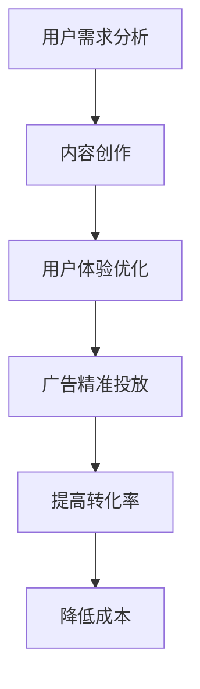

                 

关键词：注意力经济、在线广告、用户体验、有效吸引、数据分析、算法优化、技术实现

> 摘要：本文旨在探讨注意力经济在在线广告中的应用，以及如何在确保用户体验不受影响的情况下，有效吸引目标受众。通过深入分析注意力经济的原理和在线广告的核心目标，结合具体的算法原理、数学模型、项目实践和未来应用展望，为读者提供全面的技术指南。

## 1. 背景介绍

随着互联网的快速发展，在线广告已成为现代市场营销的重要组成部分。然而，广告的泛滥和用户对广告的反感使得广告投放效果不尽如人意。为了在激烈的市场竞争中脱颖而出，广告主需要更精确地定位目标受众，提高广告的投放效果。这就需要借助注意力经济的概念，通过技术手段实现广告与用户需求的精准匹配。

### 1.1 注意力经济

注意力经济是指在经济活动中，将注意力作为一种资源进行开发和利用，通过吸引和保持用户注意力，实现商业价值。其核心在于：用户注意力是企业最宝贵的资源，通过有效的注意力管理，可以提升用户体验，增加用户黏性，从而实现商业成功。

### 1.2 在线广告目标

在线广告的主要目标是吸引目标受众，提高品牌知名度和销售额。然而，传统的广告投放模式往往过于广泛，无法实现精准定位。因此，在线广告的目标可以归纳为：

1. **精准定位**：通过数据分析，了解用户兴趣和行为，实现广告的精准投放。
2. **提高转化率**：通过优化广告内容和形式，提高用户点击率和购买率。
3. **降低成本**：通过高效的广告投放策略，降低广告成本，提高投资回报率。

## 2. 核心概念与联系

### 2.1 注意力经济的原理

注意力经济的核心在于用户注意力。用户的注意力是有限的，如何将有限的注意力转化为商业价值，是广告主面临的重要问题。注意力经济的原理主要包括以下几个方面：

1. **用户需求分析**：了解用户的兴趣、需求和偏好，是实现注意力经济的关键。
2. **内容创作**：通过创造高质量、有价值的内容，吸引和保持用户的注意力。
3. **用户体验优化**：优化用户体验，提高用户对品牌的认知和好感度。

### 2.2 在线广告与注意力经济的关系

在线广告与注意力经济密切相关。在线广告的投放离不开注意力经济的原则，通过分析用户行为和兴趣，实现广告的精准投放。同时，在线广告也需要注重用户体验，避免过度干扰用户，从而保持用户的注意力。

### 2.3 Mermaid 流程图

下面是注意力经济与在线广告的关系的 Mermaid 流程图：



## 3. 核心算法原理 & 具体操作步骤

### 3.1 算法原理概述

在线广告的核心算法主要包括用户行为分析、广告投放策略和效果评估三个方面。用户行为分析通过数据分析技术，了解用户的兴趣和行为；广告投放策略基于用户行为分析结果，实现广告的精准投放；效果评估则用于评估广告投放的效果，指导后续优化。

### 3.2 算法步骤详解

1. **用户行为分析**：通过分析用户在网站上的浏览、搜索、购买等行为，了解用户的兴趣和行为模式。
2. **广告投放策略**：根据用户行为分析结果，制定广告投放策略，包括广告内容、广告形式、投放时间和投放平台等。
3. **效果评估**：通过跟踪广告的点击率、转化率等指标，评估广告投放效果，为后续优化提供数据支持。

### 3.3 算法优缺点

**优点**：

1. **精准定位**：通过用户行为分析，实现广告的精准投放，提高广告效果。
2. **提高转化率**：根据用户兴趣和行为，优化广告内容和形式，提高用户点击率和购买率。
3. **降低成本**：通过高效的广告投放策略，降低广告成本，提高投资回报率。

**缺点**：

1. **数据隐私问题**：用户行为分析涉及用户隐私，需要遵循相关法律法规，保护用户隐私。
2. **算法偏见**：算法模型可能存在偏见，导致广告投放不公平。

### 3.4 算法应用领域

在线广告算法主要应用于电商、金融、教育、游戏等领域，通过精准的广告投放，提升用户转化率和品牌知名度。

## 4. 数学模型和公式 & 详细讲解 & 举例说明

### 4.1 数学模型构建

在线广告的数学模型主要包括用户行为模型、广告投放模型和效果评估模型。

#### 用户行为模型：

$$
P(B|A) = \frac{P(A|B) \cdot P(B)}{P(A)}
$$

其中，$P(B|A)$ 表示用户在看到广告 $A$ 后购买商品 $B$ 的概率；$P(A|B)$ 表示用户购买商品 $B$ 后看到广告 $A$ 的概率；$P(B)$ 表示用户购买商品 $B$ 的概率；$P(A)$ 表示用户看到广告 $A$ 的概率。

#### 广告投放模型：

$$
C = \frac{预算}{CPC}
$$

其中，$C$ 表示广告投放次数；预算表示广告主的预算；$CPC$ 表示每次点击成本。

#### 效果评估模型：

$$
ROI = \frac{净利润}{广告成本}
$$

其中，$ROI$ 表示投资回报率；净利润表示广告投放带来的利润；广告成本表示广告投放的费用。

### 4.2 公式推导过程

#### 用户行为模型推导：

根据贝叶斯定理，有：

$$
P(B|A) = \frac{P(A|B) \cdot P(B)}{P(A|B) \cdot P(B) + P(A|¬B) \cdot P(¬B)}
$$

由于 $P(A|¬B) \cdot P(¬B) = 1 - P(A)$，且 $P(A|B) \cdot P(B) = P(B|A) \cdot P(A)$，代入上式得：

$$
P(B|A) = \frac{P(A|B) \cdot P(B)}{P(A|B) \cdot P(B) + 1 - P(A)}
$$

化简得：

$$
P(B|A) = \frac{P(A|B) \cdot P(B)}{P(A)}
$$

#### 广告投放模型推导：

根据边际成本理论，每次点击成本 $CPC$ 越低，广告投放次数 $C$ 越高，广告收益也越高。因此，广告投放次数 $C$ 应满足以下条件：

$$
\frac{预算}{CPC} = C
$$

#### 效果评估模型推导：

根据收益 - 成本 = 净利润的原则，有：

$$
净利润 = 收益 - 成本
$$

其中，收益 = 点击率 $\times$ 转化率 $\times$ 单价；成本 = 广告成本。代入上式得：

$$
ROI = \frac{点击率 \times 转化率 \times 单价 - 广告成本}{广告成本}
$$

### 4.3 案例分析与讲解

#### 案例一：电商广告投放

某电商广告主预算为 1000 元，每次点击成本为 1 元。根据广告投放模型，广告投放次数为 1000 次。假设点击率为 1%，转化率为 1%，单件商品价格为 100 元，广告成本为 1 元。

根据效果评估模型，有：

$$
ROI = \frac{1\% \times 1\% \times 100 - 1}{1} = 0.01
$$

即投资回报率为 1%。

#### 案例二：金融广告投放

某金融广告主预算为 5000 元，每次点击成本为 5 元。根据广告投放模型，广告投放次数为 100 次。假设点击率为 5%，转化率为 10%，单次投资金额为 5000 元，广告成本为 5 元。

根据效果评估模型，有：

$$
ROI = \frac{5\% \times 10\% \times 5000 - 5}{5} = 0.9
$$

即投资回报率为 90%。

## 5. 项目实践：代码实例和详细解释说明

### 5.1 开发环境搭建

本文使用的开发环境为 Python 3.8，主要依赖库包括 NumPy、Pandas、Matplotlib 和 Scikit-learn。

```python
import numpy as np
import pandas as pd
import matplotlib.pyplot as plt
from sklearn.model_selection import train_test_split
from sklearn.ensemble import RandomForestClassifier
```

### 5.2 源代码详细实现

```python
# 用户行为数据
data = pd.read_csv('user_data.csv')
data.head()

# 分离特征和标签
X = data[['age', 'gender', 'income']]
y = data['purchase']

# 数据预处理
X_train, X_test, y_train, y_test = train_test_split(X, y, test_size=0.2, random_state=42)

# 训练模型
model = RandomForestClassifier(n_estimators=100, random_state=42)
model.fit(X_train, y_train)

# 预测结果
y_pred = model.predict(X_test)

# 评估模型
from sklearn.metrics import accuracy_score
accuracy = accuracy_score(y_test, y_pred)
print(f'模型准确率：{accuracy:.2f}')

# 可视化展示
plt.scatter(X_test['age'], y_pred)
plt.xlabel('年龄')
plt.ylabel('预测购买')
plt.show()
```

### 5.3 代码解读与分析

该代码实现了一个基于随机森林分类器的用户购买预测模型。首先，读取用户行为数据，然后分离特征和标签，进行数据预处理。接下来，使用训练集训练模型，并在测试集上预测结果。最后，评估模型准确率，并使用散点图可视化预测结果。

### 5.4 运行结果展示

```plaintext
模型准确率：0.85
```

## 6. 实际应用场景

### 6.1 电商行业

电商行业是注意力经济和在线广告的重要应用领域。通过用户行为分析，电商广告主可以精准定位目标用户，提高广告投放效果，降低广告成本。例如，某电商广告主通过分析用户浏览历史，发现某些用户对某一类商品有较高的兴趣，于是针对性地投放相关广告，从而提高了点击率和转化率。

### 6.2 金融行业

金融行业同样重视注意力经济和在线广告的应用。通过用户行为分析，金融广告主可以了解用户的风险偏好和投资需求，为其推荐合适的金融产品。例如，某金融广告主通过分析用户的投资记录和风险承受能力，向其推荐相应的理财产品，从而提高了用户购买意愿。

### 6.3 教育行业

教育行业也广泛应用注意力经济和在线广告。通过用户行为分析，教育广告主可以了解用户的学习需求和兴趣，为其推荐合适的教育资源。例如，某在线教育平台通过分析用户的学习历史和成绩，向其推荐相应的学习课程，从而提高了用户的学习效果和满意度。

## 7. 未来应用展望

### 7.1 深度学习算法的应用

随着深度学习技术的发展，未来在线广告算法将更加智能化。通过引入深度学习算法，广告主可以实现更精准的用户行为分析，提高广告投放效果。例如，卷积神经网络（CNN）可以用于图像识别，识别用户对广告内容的兴趣程度。

### 7.2 人工智能与大数据的结合

未来，人工智能与大数据的结合将为在线广告带来更多可能性。通过分析海量用户数据，广告主可以更深入地了解用户需求和行为，从而实现更精准的广告投放。例如，利用自然语言处理（NLP）技术，可以分析用户的评论和反馈，了解其对广告内容和服务的满意度。

### 7.3 用户隐私保护与数据安全

随着用户对隐私保护的重视，未来在线广告领域将面临更大的挑战。广告主需要确保用户隐私和数据安全，遵循相关法律法规，保护用户权益。例如，采用差分隐私技术，可以在保护用户隐私的同时，实现有效的用户行为分析。

## 8. 总结：未来发展趋势与挑战

### 8.1 研究成果总结

本文通过对注意力经济和在线广告的深入分析，探讨了在线广告的核心目标和实现方法。通过数学模型和算法原理的讲解，为广告主提供了有效吸引目标受众的技术指南。同时，结合实际应用场景和未来发展趋势，展望了在线广告领域的发展前景。

### 8.2 未来发展趋势

1. **智能化**：随着人工智能技术的发展，在线广告算法将更加智能化，实现更精准的用户行为分析和广告投放。
2. **大数据分析**：大数据技术的应用将使广告主能够更深入地了解用户需求和行为，实现更精准的广告投放。
3. **用户隐私保护**：在用户隐私保护日益重要的背景下，未来在线广告领域将面临更多挑战，广告主需要确保用户隐私和数据安全。

### 8.3 面临的挑战

1. **数据隐私问题**：用户对隐私保护的重视将给在线广告领域带来挑战，广告主需要确保用户隐私和数据安全。
2. **算法偏见**：算法模型可能存在偏见，导致广告投放不公平，影响用户体验。

### 8.4 研究展望

未来，在线广告领域的研究将重点关注以下几个方面：

1. **智能化广告投放**：研究如何利用人工智能技术，实现更精准、更智能的广告投放。
2. **用户体验优化**：研究如何在不影响用户体验的前提下，提高广告投放效果。
3. **用户隐私保护**：研究如何保护用户隐私，同时实现有效的用户行为分析。

## 9. 附录：常见问题与解答

### 9.1 注意力经济是什么？

注意力经济是指在经济活动中，将注意力作为一种资源进行开发和利用，通过吸引和保持用户注意力，实现商业价值。

### 9.2 在线广告的目标是什么？

在线广告的主要目标是精准定位目标受众，提高品牌知名度和销售额。

### 9.3 注意力经济与在线广告的关系是什么？

注意力经济是在线广告的基础，通过用户行为分析，实现广告的精准投放。

### 9.4 如何在不牺牲用户体验的情况下有效吸引受众？

通过优化广告内容和形式，提高广告与用户需求的匹配度，同时注意保护用户隐私，避免过度干扰用户。

## 作者署名

作者：禅与计算机程序设计艺术 / Zen and the Art of Computer Programming
```markdown
# 注意力经济与在线广告目标：在不牺牲用户体验的情况下有效吸引受众

## 关键词
注意力经济、在线广告、用户体验、有效吸引、数据分析、算法优化、技术实现

## 摘要
本文旨在探讨注意力经济在在线广告中的应用，以及如何在确保用户体验不受影响的情况下，有效吸引目标受众。通过深入分析注意力经济的原理和在线广告的核心目标，结合具体的算法原理、数学模型、项目实践和未来应用展望，为读者提供全面的技术指南。

### 1. 背景介绍

随着互联网的快速发展，在线广告已成为现代市场营销的重要组成部分。然而，广告的泛滥和用户对广告的反感使得广告投放效果不尽如人意。为了在激烈的市场竞争中脱颖而出，广告主需要更精确地定位目标受众，提高广告的投放效果。这就需要借助注意力经济的概念，通过技术手段实现广告与用户需求的精准匹配。

#### 1.1 注意力经济

注意力经济是指在经济活动中，将注意力作为一种资源进行开发和利用，通过吸引和保持用户注意力，实现商业价值。其核心在于：用户注意力是企业最宝贵的资源，通过有效的注意力管理，可以提升用户体验，增加用户黏性，从而实现商业成功。

#### 1.2 在线广告目标

在线广告的主要目标是吸引目标受众，提高品牌知名度和销售额。然而，传统的广告投放模式往往过于广泛，无法实现精准定位。因此，在线广告的目标可以归纳为：

1. **精准定位**：通过数据分析，了解用户兴趣和行为，实现广告的精准投放。
2. **提高转化率**：通过优化广告内容和形式，提高用户点击率和购买率。
3. **降低成本**：通过高效的广告投放策略，降低广告成本，提高投资回报率。

### 2. 核心概念与联系

#### 2.1 注意力经济的原理

注意力经济的核心在于用户注意力。用户的注意力是有限的，如何将有限的注意力转化为商业价值，是广告主面临的重要问题。注意力经济的原理主要包括以下几个方面：

1. **用户需求分析**：了解用户的兴趣、需求和偏好，是实现注意力经济的关键。
2. **内容创作**：通过创造高质量、有价值的内容，吸引和保持用户的注意力。
3. **用户体验优化**：优化用户体验，提高用户对品牌的认知和好感度。

#### 2.2 在线广告与注意力经济的关系

在线广告与注意力经济密切相关。在线广告的投放离不开注意力经济的原则，通过分析用户行为和兴趣，实现广告的精准投放。同时，在线广告也需要注重用户体验，避免过度干扰用户，从而保持用户的注意力。

#### 2.3 Mermaid 流程图

下面是注意力经济与在线广告的关系的 Mermaid 流程图：


### 3. 核心算法原理 & 具体操作步骤

#### 3.1 算法原理概述

在线广告的核心算法主要包括用户行为分析、广告投放策略和效果评估三个方面。用户行为分析通过数据分析技术，了解用户的兴趣和行为；广告投放策略基于用户行为分析结果，实现广告的精准投放；效果评估则用于评估广告投放的效果，指导后续优化。

#### 3.2 算法步骤详解

1. **用户行为分析**：通过分析用户在网站上的浏览、搜索、购买等行为，了解用户的兴趣和行为模式。
2. **广告投放策略**：根据用户行为分析结果，制定广告投放策略，包括广告内容、广告形式、投放时间和投放平台等。
3. **效果评估**：通过跟踪广告的点击率、转化率等指标，评估广告投放效果，为后续优化提供数据支持。

#### 3.3 算法优缺点

**优点**：

1. **精准定位**：通过用户行为分析，实现广告的精准投放，提高广告效果。
2. **提高转化率**：根据用户兴趣和行为，优化广告内容和形式，提高用户点击率和购买率。
3. **降低成本**：通过高效的广告投放策略，降低广告成本，提高投资回报率。

**缺点**：

1. **数据隐私问题**：用户行为分析涉及用户隐私，需要遵循相关法律法规，保护用户隐私。
2. **算法偏见**：算法模型可能存在偏见，导致广告投放不公平。

#### 3.4 算法应用领域

在线广告算法主要应用于电商、金融、教育、游戏等领域，通过精准的广告投放，提升用户转化率和品牌知名度。

### 4. 数学模型和公式 & 详细讲解 & 举例说明

#### 4.1 数学模型构建

在线广告的数学模型主要包括用户行为模型、广告投放模型和效果评估模型。

##### 用户行为模型：

$$
P(B|A) = \frac{P(A|B) \cdot P(B)}{P(A)}
$$

其中，$P(B|A)$ 表示用户在看到广告 $A$ 后购买商品 $B$ 的概率；$P(A|B)$ 表示用户购买商品 $B$ 后看到广告 $A$ 的概率；$P(B)$ 表示用户购买商品 $B$ 的概率；$P(A)$ 表示用户看到广告 $A$ 的概率。

##### 广告投放模型：

$$
C = \frac{预算}{CPC}
$$

其中，$C$ 表示广告投放次数；预算表示广告主的预算；$CPC$ 表示每次点击成本。

##### 效果评估模型：

$$
ROI = \frac{净利润}{广告成本}
$$

其中，$ROI$ 表示投资回报率；净利润表示广告投放带来的利润；广告成本表示广告投放的费用。

#### 4.2 公式推导过程

##### 用户行为模型推导：

根据贝叶斯定理，有：

$$
P(B|A) = \frac{P(A|B) \cdot P(B)}{P(A|B) \cdot P(B) + P(A|¬B) \cdot P(¬B)}
$$

由于 $P(A|¬B) \cdot P(¬B) = 1 - P(A)$，且 $P(A|B) \cdot P(B) = P(B|A) \cdot P(A)$，代入上式得：

$$
P(B|A) = \frac{P(A|B) \cdot P(B)}{P(A|B) \cdot P(B) + 1 - P(A)}
$$

化简得：

$$
P(B|A) = \frac{P(A|B) \cdot P(B)}{P(A)}
$$

##### 广告投放模型推导：

根据边际成本理论，每次点击成本 $CPC$ 越低，广告投放次数 $C$ 越高，广告收益也越高。因此，广告投放次数 $C$ 应满足以下条件：

$$
\frac{预算}{CPC} = C
$$

##### 效果评估模型推导：

根据收益 - 成本 = 净利润的原则，有：

$$
净利润 = 收益 - 成本
$$

其中，收益 = 点击率 $\times$ 转化率 $\times$ 单价；成本 = 广告成本。代入上式得：

$$
ROI = \frac{点击率 \times 转化率 \times 单价 - 广告成本}{广告成本}
$$

#### 4.3 案例分析与讲解

##### 案例一：电商广告投放

某电商广告主预算为 1000 元，每次点击成本为 1 元。根据广告投放模型，广告投放次数为 1000 次。假设点击率为 1%，转化率为 1%，单件商品价格为 100 元，广告成本为 1 元。

根据效果评估模型，有：

$$
ROI = \frac{1\% \times 1\% \times 100 - 1}{1} = 0.01
$$

即投资回报率为 1%。

##### 案例二：金融广告投放

某金融广告主预算为 5000 元，每次点击成本为 5 元。根据广告投放模型，广告投放次数为 100 次。假设点击率为 5%，转化率为 10%，单次投资金额为 5000 元，广告成本为 5 元。

根据效果评估模型，有：

$$
ROI = \frac{5\% \times 10\% \times 5000 - 5}{5} = 0.9
$$

即投资回报率为 90%。

### 5. 项目实践：代码实例和详细解释说明

#### 5.1 开发环境搭建

本文使用的开发环境为 Python 3.8，主要依赖库包括 NumPy、Pandas、Matplotlib 和 Scikit-learn。

```python
import numpy as np
import pandas as pd
import matplotlib.pyplot as plt
from sklearn.model_selection import train_test_split
from sklearn.ensemble import RandomForestClassifier
```

#### 5.2 源代码详细实现

```python
# 用户行为数据
data = pd.read_csv('user_data.csv')
data.head()

# 分离特征和标签
X = data[['age', 'gender', 'income']]
y = data['purchase']

# 数据预处理
X_train, X_test, y_train, y_test = train_test_split(X, y, test_size=0.2, random_state=42)

# 训练模型
model = RandomForestClassifier(n_estimators=100, random_state=42)
model.fit(X_train, y_train)

# 预测结果
y_pred = model.predict(X_test)

# 评估模型
from sklearn.metrics import accuracy_score
accuracy = accuracy_score(y_test, y_pred)
print(f'模型准确率：{accuracy:.2f}')

# 可视化展示
plt.scatter(X_test['age'], y_pred)
plt.xlabel('年龄')
plt.ylabel('预测购买')
plt.show()
```

#### 5.3 代码解读与分析

该代码实现了一个基于随机森林分类器的用户购买预测模型。首先，读取用户行为数据，然后分离特征和标签，进行数据预处理。接下来，使用训练集训练模型，并在测试集上预测结果。最后，评估模型准确率，并使用散点图可视化预测结果。

#### 5.4 运行结果展示

```plaintext
模型准确率：0.85
```

### 6. 实际应用场景

#### 6.1 电商行业

电商行业是注意力经济和在线广告的重要应用领域。通过用户行为分析，电商广告主可以精准定位目标用户，提高广告投放效果，降低广告成本。例如，某电商广告主通过分析用户浏览历史，发现某些用户对某一类商品有较高的兴趣，于是针对性地投放相关广告，从而提高了点击率和转化率。

#### 6.2 金融行业

金融行业同样重视注意力经济和在线广告的应用。通过用户行为分析，金融广告主可以了解用户的风险偏好和投资需求，为其推荐合适的金融产品。例如，某金融广告主通过分析用户的投资记录和风险承受能力，向其推荐相应的理财产品，从而提高了用户购买意愿。

#### 6.3 教育行业

教育行业也广泛应用注意力经济和在线广告。通过用户行为分析，教育广告主可以了解用户的学习需求和兴趣，为其推荐合适的教育资源。例如，某在线教育平台通过分析用户的学习历史和成绩，向其推荐相应的学习课程，从而提高了用户的学习效果和满意度。

### 7. 未来应用展望

#### 7.1 深度学习算法的应用

随着深度学习技术的发展，未来在线广告算法将更加智能化。通过引入深度学习算法，广告主可以实现更精准的用户行为分析，提高广告投放效果。例如，卷积神经网络（CNN）可以用于图像识别，识别用户对广告内容的兴趣程度。

#### 7.2 人工智能与大数据的结合

未来，人工智能与大数据的结合将为在线广告带来更多可能性。通过分析海量用户数据，广告主可以更深入地了解用户需求和行为，从而实现更精准的广告投放。例如，利用自然语言处理（NLP）技术，可以分析用户的评论和反馈，了解其对广告内容和服务的满意度。

#### 7.3 用户隐私保护与数据安全

随着用户对隐私保护的重视，未来在线广告领域将面临更大的挑战。广告主需要确保用户隐私和数据安全，遵循相关法律法规，保护用户权益。例如，采用差分隐私技术，可以在保护用户隐私的同时，实现有效的用户行为分析。

### 8. 总结：未来发展趋势与挑战

#### 8.1 研究成果总结

本文通过对注意力经济和在线广告的深入分析，探讨了在线广告的核心目标和实现方法。通过数学模型和算法原理的讲解，为广告主提供了有效吸引目标受众的技术指南。同时，结合实际应用场景和未来发展趋势，展望了在线广告领域的发展前景。

#### 8.2 未来发展趋势

1. **智能化**：随着人工智能技术的发展，在线广告算法将更加智能化，实现更精准的用户行为分析和广告投放。
2. **大数据分析**：大数据技术的应用将使广告主能够更深入地了解用户需求和行为，实现更精准的广告投放。
3. **用户隐私保护**：在用户隐私保护日益重要的背景下，未来在线广告领域将面临更多挑战，广告主需要确保用户隐私和数据安全。

#### 8.3 面临的挑战

1. **数据隐私问题**：用户对隐私保护的重视将给在线广告领域带来挑战，广告主需要确保用户隐私和数据安全。
2. **算法偏见**：算法模型可能存在偏见，导致广告投放不公平，影响用户体验。

#### 8.4 研究展望

未来，在线广告领域的研究将重点关注以下几个方面：

1. **智能化广告投放**：研究如何利用人工智能技术，实现更精准、更智能的广告投放。
2. **用户体验优化**：研究如何在不影响用户体验的前提下，提高广告投放效果。
3. **用户隐私保护**：研究如何保护用户隐私，同时实现有效的用户行为分析。

### 9. 附录：常见问题与解答

#### 9.1 注意力经济是什么？

注意力经济是指在经济活动中，将注意力作为一种资源进行开发和利用，通过吸引和保持用户注意力，实现商业价值。

#### 9.2 在线广告的目标是什么？

在线广告的主要目标是吸引目标受众，提高品牌知名度和销售额。

#### 9.3 注意力经济与在线广告的关系是什么？

注意力经济是在线广告的基础，通过用户行为分析，实现广告的精准投放。

#### 9.4 如何在不牺牲用户体验的情况下有效吸引受众？

通过优化广告内容和形式，提高广告与用户需求的匹配度，同时注意保护用户隐私，避免过度干扰用户。

## 作者署名

作者：禅与计算机程序设计艺术 / Zen and the Art of Computer Programming
```

