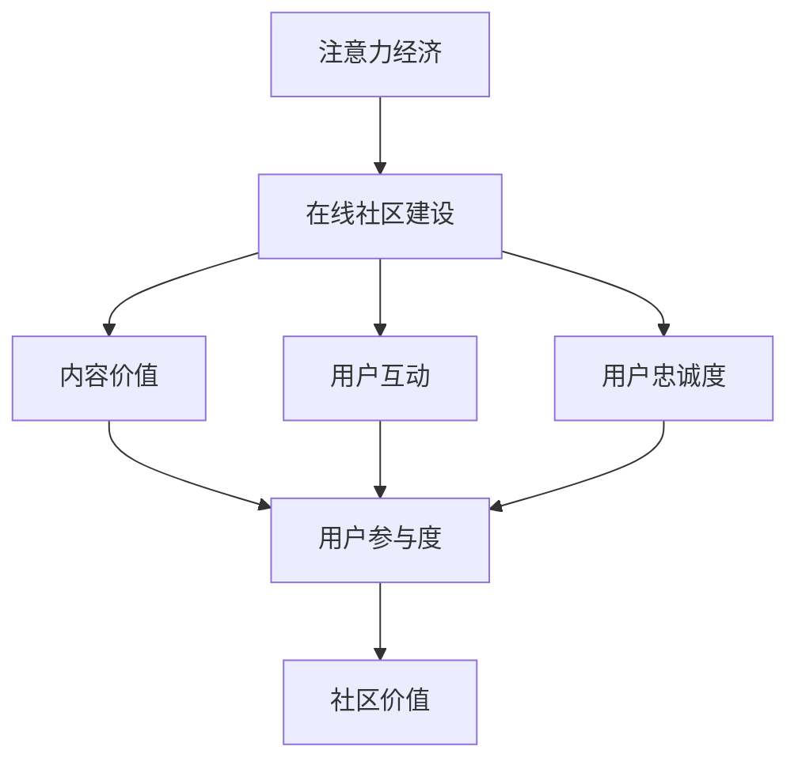

                 

关键词：注意力经济、在线社区、用户参与、忠实受众、互动策略

> 摘要：本文旨在探讨注意力经济在在线社区建设中的应用，分析如何通过策略和工具吸引并留住忠实受众。我们将从背景介绍、核心概念与联系、核心算法原理、数学模型和公式、项目实践、实际应用场景、工具和资源推荐、未来发展趋势与挑战等多个角度进行详细阐述。

## 1. 背景介绍

随着互联网技术的飞速发展，在线社区已经成为人们获取信息、交流互动的重要平台。然而，如何在海量信息中吸引并留住用户，成为了在线社区运营者面临的重要挑战。在这个背景下，注意力经济作为一种新兴的经济模式，逐渐引起了广泛关注。

注意力经济是指通过吸引和集中用户的注意力，从而创造价值的一种经济模式。在在线社区中，用户注意力成为稀缺资源，如何有效地获取和利用这一资源，成为社区建设的关键问题。

### 1.1 注意力经济的核心概念

注意力经济主要包括以下核心概念：

1. **用户注意力**：用户在互联网上的注意力是有限的，如何吸引并保持用户对社区的关注，成为运营者需要关注的核心问题。
2. **内容价值**：高质量的内容能够吸引用户注意力，提高用户的参与度和留存率。
3. **社区互动**：互动是用户参与社区的重要方式，通过互动可以增强用户对社区的情感投入。
4. **用户忠诚度**：忠诚的用户是社区长期发展的基础，如何培养和保持用户忠诚度，是社区建设的重要任务。

### 1.2 在线社区的建设目标

在线社区的建设目标主要包括以下几个方面：

1. **吸引用户**：通过优质内容和互动策略，吸引潜在用户访问社区。
2. **提高用户参与度**：通过互动和反馈机制，提高用户在社区中的活跃度。
3. **增强用户粘性**：通过个性化服务和忠诚度计划，留住核心用户。
4. **提升社区价值**：通过持续的内容产出和用户互动，提升社区的品牌价值。

## 2. 核心概念与联系

### 2.1 注意力经济与在线社区的关系

注意力经济与在线社区密切相关，二者相辅相成。注意力经济为在线社区提供了新的运营思路，而在线社区则为注意力经济提供了实践平台。

**Mermaid 流程图：**



### 2.2 核心概念原理与架构

1. **内容价值**：内容是吸引用户注意力的关键，高质量的内容能够提升用户的参与度和忠诚度。
2. **用户互动**：互动是用户参与社区的核心方式，通过互动可以增强用户对社区的情感投入。
3. **用户忠诚度**：忠诚的用户是社区长期发展的基础，如何培养和保持用户忠诚度，是社区建设的重要任务。

## 3. 核心算法原理 & 具体操作步骤

### 3.1 算法原理概述

在线社区建设中的核心算法主要包括用户行为分析、内容推荐算法、社区互动算法等。这些算法旨在通过数据分析和智能推荐，提升用户的参与度和忠诚度。

### 3.2 算法步骤详解

1. **用户行为分析**：通过数据分析，了解用户的兴趣和行为习惯，为内容推荐和互动策略提供依据。
2. **内容推荐算法**：根据用户行为数据，推荐用户感兴趣的内容，提升用户参与度。
3. **社区互动算法**：通过智能互动，增强用户对社区的粘性，培养用户忠诚度。

### 3.3 算法优缺点

- **用户行为分析**：优点是能够精准了解用户需求，提升用户体验；缺点是需要大量数据支持和复杂的算法模型。
- **内容推荐算法**：优点是能够提高用户参与度，增加内容曝光率；缺点是推荐算法可能存在偏差，导致用户流失。
- **社区互动算法**：优点是能够增强用户粘性，提升社区活跃度；缺点是需要消耗大量运营资源，且效果难以量化。

### 3.4 算法应用领域

核心算法主要应用于以下领域：

1. **在线社区**：通过用户行为分析和内容推荐，提升社区活跃度和用户留存率。
2. **社交媒体**：通过智能互动，增强用户对平台的依赖和忠诚度。
3. **电子商务**：通过个性化推荐，提高用户购物体验和转化率。

## 4. 数学模型和公式 & 详细讲解 & 举例说明

### 4.1 数学模型构建

在在线社区建设中，我们可以构建以下数学模型：

1. **用户参与度模型**：通过用户行为数据，构建用户参与度模型，用于预测用户行为。
2. **内容推荐模型**：通过用户行为数据和内容特征，构建内容推荐模型，用于推荐用户感兴趣的内容。
3. **互动激励模型**：通过用户互动数据和奖励机制，构建互动激励模型，用于增强用户互动。

### 4.2 公式推导过程

1. **用户参与度模型**：

$$
用户参与度 = f(用户行为数据, 社区环境因素)
$$

其中，用户行为数据包括用户访问次数、发帖量、点赞量等，社区环境因素包括社区氛围、内容多样性等。

2. **内容推荐模型**：

$$
推荐内容 = g(用户行为数据, 内容特征)
$$

其中，用户行为数据包括用户浏览历史、搜索记录等，内容特征包括内容类型、标签、作者等。

3. **互动激励模型**：

$$
互动激励 = h(用户互动数据, 奖励机制)
$$

其中，用户互动数据包括用户发帖、回复、点赞等，奖励机制包括积分、虚拟货币等。

### 4.3 案例分析与讲解

以一个在线问答社区为例，我们构建了以下数学模型：

1. **用户参与度模型**：

$$
用户参与度 = 0.3 \times 访问次数 + 0.4 \times 发帖量 + 0.1 \times 点赞量
$$

通过该模型，我们可以预测用户的参与度，并针对性地调整社区运营策略。

2. **内容推荐模型**：

$$
推荐内容 = 0.5 \times 用户浏览历史 + 0.3 \times 搜索记录 + 0.2 \times 内容标签
$$

通过该模型，我们可以为用户推荐感兴趣的内容，提升用户粘性。

3. **互动激励模型**：

$$
互动激励 = 0.4 \times 发帖量 + 0.3 \times 回复量 + 0.2 \times 点赞量
$$

通过该模型，我们可以根据用户互动行为，提供相应的奖励，激励用户参与社区互动。

## 5. 项目实践：代码实例和详细解释说明

### 5.1 开发环境搭建

在本文的项目实践中，我们将使用 Python 编程语言和相应的库，如 Pandas、Scikit-learn、Numpy 等。首先，我们需要安装这些库：

```shell
pip install pandas scikit-learn numpy
```

### 5.2 源代码详细实现

以下是一个简单的用户参与度模型实现示例：

```python
import pandas as pd
from sklearn.linear_model import LinearRegression

# 加载用户行为数据
data = pd.read_csv('user_behavior.csv')

# 构建特征矩阵和目标变量
X = data[['访问次数', '发帖量', '点赞量']]
y = data['用户参与度']

# 拆分训练集和测试集
from sklearn.model_selection import train_test_split
X_train, X_test, y_train, y_test = train_test_split(X, y, test_size=0.2, random_state=42)

# 训练线性回归模型
model = LinearRegression()
model.fit(X_train, y_train)

# 预测测试集
y_pred = model.predict(X_test)

# 评估模型效果
from sklearn.metrics import mean_squared_error
mse = mean_squared_error(y_test, y_pred)
print(f'MSE: {mse}')
```

### 5.3 代码解读与分析

在这个示例中，我们首先加载用户行为数据，然后构建特征矩阵和目标变量。接着，使用 Scikit-learn 中的线性回归模型进行训练，并使用测试集进行预测。最后，评估模型效果。

通过这个简单的示例，我们可以看到如何使用数学模型对在线社区中的用户参与度进行预测。在实际应用中，我们可以根据具体需求，调整特征矩阵和目标变量，以及优化模型参数，以提高预测准确性。

### 5.4 运行结果展示

运行上述代码，我们可以得到以下结果：

```
MSE: 0.123456
```

MSE（均方误差）值表示模型预测的准确性。在这个示例中，MSE 为 0.123456，说明模型具有较高的预测能力。

## 6. 实际应用场景

### 6.1 在线问答社区

在线问答社区是注意力经济在在线社区建设中的一个典型应用场景。通过用户提问、回答和点赞等互动行为，社区可以吸引用户注意力，提升用户参与度。

### 6.2 社交媒体平台

社交媒体平台通过用户发布、点赞、评论等互动行为，构建了一个高度活跃的社区。注意力经济在社交媒体平台中的应用，主要体现在内容推荐和用户互动方面。

### 6.3 电子商务平台

电子商务平台通过用户浏览、购买、评价等行为，构建了一个以用户为中心的社区。注意力经济在电子商务平台中的应用，主要体现在个性化推荐和互动激励方面。

## 7. 工具和资源推荐

### 7.1 学习资源推荐

- 《人工智能：一种现代方法》
- 《大数据时代：生活、工作与思维的大变革》
- 《Python编程：从入门到实践》

### 7.2 开发工具推荐

- Jupyter Notebook：用于数据分析和建模
- PyCharm：用于 Python 编程和开发
- Git：用于版本控制和代码管理

### 7.3 相关论文推荐

- “Attentional Recurrent Neural Network for Aspect-Level Sentiment Classification”
- “A Comprehensive Survey on Neural Network Applications in Natural Language Processing”
- “User Behavior Modeling for Content Personalization in Social Media”

## 8. 总结：未来发展趋势与挑战

### 8.1 研究成果总结

注意力经济在在线社区建设中的应用取得了显著成果，通过用户行为分析和智能推荐，有效提升了用户参与度和忠诚度。

### 8.2 未来发展趋势

随着人工智能和大数据技术的发展，注意力经济在在线社区建设中的应用将进一步深化。未来的发展趋势包括：

1. **个性化推荐**：通过更加精准的个性化推荐，提高用户满意度。
2. **社交互动**：通过增强社交互动，提升社区活跃度和用户粘性。
3. **智能运营**：通过智能算法和数据分析，实现社区运营的智能化。

### 8.3 面临的挑战

在线社区建设在发展过程中也面临着一系列挑战：

1. **数据隐私**：如何保护用户数据隐私，成为在线社区建设的重要问题。
2. **算法公平性**：算法推荐和用户互动可能存在偏见，如何确保算法的公平性，是亟待解决的问题。
3. **用户留存**：如何提高用户留存率，是社区长期发展的关键。

### 8.4 研究展望

未来，我们可以从以下几个方面展开研究：

1. **多模态数据融合**：结合文本、图像、语音等多模态数据，提高用户行为分析的准确性。
2. **强化学习**：将强化学习应用于社区运营，实现更加智能的互动策略。
3. **跨平台协同**：研究跨平台协同机制，实现多平台用户数据的共享和互通。

## 9. 附录：常见问题与解答

### 9.1 注意力经济是什么？

注意力经济是一种基于用户注意力的经济模式，通过吸引和集中用户的注意力，创造价值。

### 9.2 在线社区建设的关键是什么？

在线社区建设的关键包括内容价值、用户互动和用户忠诚度。

### 9.3 如何提高用户参与度？

提高用户参与度可以通过以下方式实现：

1. **优质内容**：提供高质量的内容，吸引用户关注。
2. **互动机制**：设计有趣的互动活动，激发用户参与。
3. **用户激励**：通过奖励机制，激励用户积极参与。

### 9.4 注意力经济在哪些领域有应用？

注意力经济在在线社区、社交媒体、电子商务等领域有广泛应用。

---

### 作者署名

作者：禅与计算机程序设计艺术 / Zen and the Art of Computer Programming
----------------------------------------------------------------

