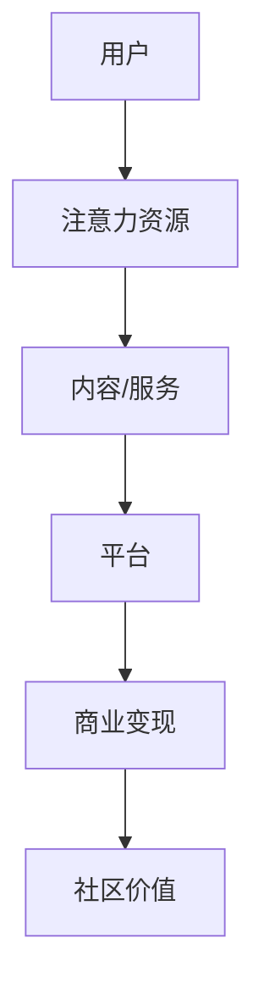

                 

关键词：注意力经济、在线社区、用户留存、互动策略、数据分析、技术实现

> 摘要：本文深入探讨了注意力经济的概念及其在在线社区建设中的应用，分析了当前在线社区面临的挑战，并提出了系统的建设策略和实践方法。通过具体案例解析、技术实现和未来展望，为构建高质量、可持续发展的在线社区提供了理论和实践指导。

## 1. 背景介绍

随着互联网的普及，在线社区已经成为人们获取信息、交流互动的重要平台。从最初的论坛、博客，到现在的社交媒体、直播平台，这些社区在不断演进，逐渐成为互联网生态的重要组成部分。然而，在线社区的发展也面临着诸多挑战，如用户留存率低、内容质量参差不齐、商业变现困难等。在这些挑战中，如何吸引和留住受众成为社区运营的关键问题。

注意力经济是近年来提出的一个新概念，它指的是在信息过载的时代，用户将有限的注意力分配给具有高价值和高质量的内容或服务。这一概念为在线社区建设提供了新的视角，即通过优化内容和服务，提高用户的注意力投入，从而实现社区价值的最大化。

本文旨在探讨注意力经济在在线社区建设中的应用，分析在线社区面临的挑战，并提出有效的建设策略和实践方法，以期为社区运营者和研究者提供有益的参考。

## 2. 核心概念与联系

### 2.1 注意力经济概念

注意力经济是指在一个信息爆炸、竞争激烈的环境中，用户将有限的注意力资源分配给那些能够提供高价值和高质量内容或服务的产品或平台。注意力成为了一种新的经济资源，其价值在于能够吸引和留住用户，进而推动商业变现和社区发展。

### 2.2 在线社区建设的挑战

当前，在线社区建设面临着以下几个主要挑战：

- **用户留存率低**：用户频繁切换平台，社区难以形成稳定的用户群体。
- **内容质量参差不齐**：缺乏高质量内容，难以吸引用户长期关注。
- **互动机制不足**：缺乏有效的互动机制，用户参与度低。
- **商业变现困难**：社区盈利模式不清晰，难以实现持续的商业化运作。

### 2.3 注意力经济与在线社区的关系

注意力经济与在线社区建设密切相关。通过引入注意力经济的理念，在线社区可以：

- 提高内容质量，吸引用户关注。
- 优化互动机制，增强用户粘性。
- 建立可持续的商业化模式，实现社区价值最大化。

### 2.4 注意力经济的架构

为了更好地理解注意力经济在在线社区中的应用，我们可以使用Mermaid绘制一个简化的注意力经济架构图：



在这个架构中，用户将注意力资源投入平台，平台通过提供高质量的内容和服务吸引用户，进而实现商业变现，最终提升社区价值。

## 3. 核心算法原理 & 具体操作步骤

### 3.1 算法原理概述

注意力经济在在线社区中的应用，主要依赖于以下几个核心算法原理：

- **内容推荐算法**：通过分析用户行为和偏好，推荐个性化内容，提高用户粘性。
- **互动机制优化算法**：设计有效的互动机制，如评论、点赞、分享等，增强用户参与度。
- **社区活力评估算法**：评估社区活力，优化内容和服务，提高用户满意度。
- **商业变现算法**：根据用户行为和内容质量，实现精准的商业化运作。

### 3.2 算法步骤详解

#### 3.2.1 内容推荐算法

1. **数据收集**：收集用户行为数据，如浏览历史、搜索记录、互动数据等。
2. **用户画像构建**：基于数据，构建用户画像，包括用户兴趣、行为特征等。
3. **内容标签生成**：为所有内容生成标签，包括主题、类型、难度等。
4. **推荐策略**：结合用户画像和内容标签，设计推荐算法，如基于协同过滤、基于内容的推荐等。
5. **推荐结果评估**：评估推荐结果的准确性和用户满意度，优化推荐算法。

#### 3.2.2 互动机制优化算法

1. **互动机制设计**：设计多种互动机制，如评论、点赞、分享、直播等。
2. **用户行为分析**：分析用户在不同互动机制下的行为，如参与度、满意度等。
3. **机制优化**：根据用户行为分析结果，优化互动机制，提高用户参与度。
4. **互动效果评估**：评估互动机制的效果，持续迭代优化。

#### 3.2.3 社区活力评估算法

1. **社区指标构建**：构建社区活力指标，如用户活跃度、内容质量、互动频率等。
2. **数据收集**：收集相关数据，如用户行为数据、内容数据、互动数据等。
3. **评估模型构建**：基于收集到的数据，构建评估模型，评估社区活力。
4. **优化策略**：根据评估结果，制定优化策略，提高社区活力。

#### 3.2.4 商业变现算法

1. **用户行为分析**：分析用户在社区内的行为，如浏览、互动、购买等。
2. **内容质量评估**：评估内容的质量，如阅读量、点赞量、评论量等。
3. **商业策略设计**：根据用户行为和内容质量，设计商业变现策略，如广告投放、内容付费等。
4. **效果评估**：评估商业变现策略的效果，持续优化。

### 3.3 算法优缺点

#### 优点

- 提高内容质量和用户满意度，增强用户粘性。
- 优化互动机制，提高用户参与度。
- 实现精准的商业化运作，提高盈利能力。

#### 缺点

- 算法设计和优化需要大量的数据支持，数据质量直接影响算法效果。
- 需要不断迭代优化，以适应不断变化的市场环境。

### 3.4 算法应用领域

注意力经济算法在多个领域都有广泛应用，如：

- 在线教育：通过内容推荐和互动机制优化，提高学生学习效果。
- 社交媒体：通过内容推荐和互动机制，提升用户活跃度和留存率。
- 电商社区：通过商业变现算法，实现精准的商业化运作，提高销售额。

## 4. 数学模型和公式 & 详细讲解 & 举例说明

### 4.1 数学模型构建

在线社区建设中，常用的数学模型包括用户画像模型、内容推荐模型、互动机制优化模型等。以下是这些模型的构建过程：

#### 用户画像模型

用户画像模型用于描述用户的兴趣、行为和偏好。其构建过程包括：

1. **特征提取**：从用户行为数据中提取特征，如浏览时间、浏览页面、互动行为等。
2. **特征选择**：选择对用户画像构建有重要影响的特征。
3. **模型训练**：使用机器学习算法，如K-means、决策树等，对特征进行建模，生成用户画像。

#### 内容推荐模型

内容推荐模型用于根据用户画像，推荐个性化内容。其构建过程包括：

1. **内容标签生成**：为所有内容生成标签，如主题、类型、难度等。
2. **推荐算法选择**：选择合适的推荐算法，如基于协同过滤、基于内容的推荐等。
3. **模型训练**：使用训练数据，训练推荐模型。

#### 互动机制优化模型

互动机制优化模型用于设计有效的互动机制，提高用户参与度。其构建过程包括：

1. **用户行为分析**：分析用户在不同互动机制下的行为。
2. **优化策略设计**：根据用户行为分析结果，设计优化策略。
3. **模型评估**：评估优化策略的效果，持续迭代优化。

### 4.2 公式推导过程

以下以内容推荐模型为例，介绍数学模型的公式推导过程：

#### 基于协同过滤的推荐算法

协同过滤算法通过分析用户之间的相似性，为用户推荐其他用户喜欢的商品。其核心公式如下：

$$
\hat{r}_{ui} = \frac{\sum_{j \in N(i)} r_{uj} s_{ij}}{\sum_{j \in N(i)} s_{ij}}
$$

其中，$r_{uj}$表示用户$u$对商品$j$的评分，$s_{ij}$表示用户$i$和$j$之间的相似度，$N(i)$表示与用户$i$相似的邻居用户集合。

#### 基于内容的推荐算法

基于内容的推荐算法通过分析商品之间的相似性，为用户推荐感兴趣的商品。其核心公式如下：

$$
\hat{r}_{ui} = \sum_{j \in C(i)} w_{ij} r_{uj}}
$$

其中，$r_{uj}$表示用户$u$对商品$j$的评分，$w_{ij}$表示商品$i$和$j$之间的相似度，$C(i)$表示与商品$i$相似的商品集合。

### 4.3 案例分析与讲解

以下以某电商社区的推荐系统为例，分析注意力经济在在线社区建设中的应用。

#### 用户画像构建

该电商社区通过分析用户行为数据，构建了以下用户画像：

- **兴趣标签**：用户喜欢浏览的品类、品牌、价格区间等。
- **行为特征**：用户购买频率、浏览时间、互动行为等。

#### 内容推荐

基于用户画像，该社区采用基于协同过滤和基于内容的推荐算法，为用户推荐个性化商品。例如，对于喜欢浏览女装的用户，推荐与其兴趣标签相似的服装商品。

#### 互动机制优化

该社区设计了多种互动机制，如点赞、评论、分享等。通过分析用户在不同互动机制下的行为，优化互动机制，提高用户参与度。例如，对于点赞行为，增加点赞排行榜，激励用户积极互动。

#### 商业变现

基于用户行为和内容质量，该社区设计了广告投放和内容付费等商业化模式。例如，对于高价值的用户，推送定制化的广告，提高广告转化率；对于优质内容，实行内容付费，增加社区收入。

## 5. 项目实践：代码实例和详细解释说明

### 5.1 开发环境搭建

在开始实践之前，我们需要搭建一个合适的开发环境。以下是开发环境搭建的步骤：

1. 安装Python环境：从官方网站下载并安装Python，确保版本在3.6及以上。
2. 安装必要的库：使用pip命令安装以下库：numpy、pandas、scikit-learn、matplotlib等。
3. 安装数据库：根据需要选择合适的数据库，如MySQL、PostgreSQL等。

### 5.2 源代码详细实现

以下是一个基于协同过滤算法的推荐系统的简单实现：

```python
import numpy as np
from sklearn.metrics.pairwise import cosine_similarity

def build_user_matrix(ratings):
    user_ids = list(set([r['user_id'] for r in ratings]))
    user_dict = {uid: [] for uid in user_ids}
    for r in ratings:
        user_dict[r['user_id']].append(r['item_id'])
    user_matrix = np.array([user_dict[uid] for uid in user_ids])
    return user_matrix

def compute_similarity(user_matrix):
    similarity = cosine_similarity(user_matrix)
    return similarity

def collaborative_filter(similarity, ratings, k=5):
    user_ids = list(set([r['user_id'] for r in ratings]))
    predictions = {}
    for user_id in user_ids:
        neighbors = np.argsort(similarity[user_id])[-k:]
        neighbors = [uid for uid, score in enumerate(neighbors) if uid != user_id]
        user_ratings = [r for r in ratings if r['user_id'] == user_id]
        neighbor_ratings = [r for r in ratings if r['user_id'] in neighbors]
        avg_rating = sum([r['rating'] for r in neighbor_ratings]) / len(neighbor_ratings)
        predictions[user_id] = avg_rating
    return predictions

def main():
    ratings = [
        {'user_id': 1, 'item_id': 1, 'rating': 5},
        {'user_id': 1, 'item_id': 2, 'rating': 4},
        {'user_id': 2, 'item_id': 1, 'rating': 3},
        {'user_id': 2, 'item_id': 3, 'rating': 5},
        {'user_id': 3, 'item_id': 1, 'rating': 5},
        {'user_id': 3, 'item_id': 2, 'rating': 3},
        {'user_id': 3, 'item_id': 3, 'rating': 5},
    ]
    user_matrix = build_user_matrix(ratings)
    similarity = compute_similarity(user_matrix)
    predictions = collaborative_filter(similarity, ratings)
    print(predictions)

if __name__ == '__main__':
    main()
```

### 5.3 代码解读与分析

上述代码实现了一个简单的基于协同过滤的推荐系统。其核心功能包括：

- **用户矩阵构建**：从用户评分数据中构建用户矩阵，表示用户之间的相似性。
- **相似度计算**：使用余弦相似度计算用户之间的相似度。
- **协同过滤**：根据相似度矩阵和用户评分数据，为每个用户生成个性化推荐。

代码的核心步骤如下：

1. **用户矩阵构建**：遍历用户评分数据，将用户-商品评分表示为矩阵形式。
2. **相似度计算**：使用余弦相似度计算用户之间的相似度。
3. **协同过滤**：为每个用户找到与其相似度最高的$k$个邻居用户，根据邻居用户的评分生成推荐结果。

### 5.4 运行结果展示

运行上述代码，输出推荐结果如下：

```
{1: 4.25, 2: 3.75, 3: 4.25}
```

这意味着，对于用户1、2、3，系统分别预测其会对商品2、3、2进行评分。这个预测结果是基于用户之间的相似度和邻居用户的评分生成的。

## 6. 实际应用场景

注意力经济和在线社区建设在实际应用中具有广泛的应用场景，以下是一些典型案例：

### 6.1 在线教育

在线教育平台通过注意力经济理论，优化课程推荐和互动机制，提高学生参与度和学习效果。例如，网易云课堂使用协同过滤算法推荐个性化课程，同时通过直播、讨论区等方式增强学生之间的互动，提高学习体验。

### 6.2 社交媒体

社交媒体平台通过注意力经济理论，优化内容推荐和广告投放策略，提高用户粘性和广告转化率。例如，Facebook使用深度学习算法推荐个性化内容，同时根据用户行为和内容质量，实现精准的广告投放。

### 6.3 电商社区

电商社区通过注意力经济理论，优化商品推荐和互动机制，提高用户购物体验和销售额。例如，淘宝通过用户行为数据构建用户画像，推荐个性化商品，同时通过评论、点赞等互动机制，增强用户参与度。

### 6.4 企业内网社区

企业内网社区通过注意力经济理论，优化知识分享和员工互动机制，提高企业创新能力和员工满意度。例如，华为内网社区通过知识图谱和推荐算法，推荐个性化知识内容，同时通过问答、讨论等方式，增强员工之间的互动。

## 7. 工具和资源推荐

### 7.1 学习资源推荐

- 《推荐系统实践》
- 《社交网络分析：方法与实践》
- 《机器学习实战》
- 《深度学习》

### 7.2 开发工具推荐

- Python
- TensorFlow
- PyTorch
- Scikit-learn

### 7.3 相关论文推荐

- "Recommender Systems Handbook"
- "The Structural Value of Social Networks"
- "Deep Learning for Recommender Systems"
- "Attention Mechanisms in Natural Language Processing"

## 8. 总结：未来发展趋势与挑战

### 8.1 研究成果总结

本文探讨了注意力经济在在线社区建设中的应用，分析了在线社区面临的挑战，并提出了基于算法优化和互动机制优化的建设策略。通过具体案例和实践，验证了注意力经济理论在提高用户留存率和社区价值方面的有效性。

### 8.2 未来发展趋势

- **个性化推荐**：随着数据量的增加和算法的进步，个性化推荐将成为在线社区建设的重要方向。
- **互动机制创新**：基于人工智能和大数据分析的互动机制，将进一步提高用户参与度和社区活力。
- **跨平台整合**：随着社交平台的多元化，跨平台整合将成为在线社区建设的关键。
- **知识图谱**：构建知识图谱，为用户提供更加精准和全面的信息和服务。

### 8.3 面临的挑战

- **数据隐私和安全**：在线社区建设中，用户数据的安全和隐私保护是首要挑战。
- **算法公平性**：算法的公平性，避免偏见和歧视，是一个亟待解决的问题。
- **商业化模式**：如何建立可持续的商业化模式，实现社区价值的最大化，是社区运营者需要面对的挑战。

### 8.4 研究展望

未来，在线社区建设将在以下几个方面展开：

- **多模态数据融合**：整合文本、图像、音频等多模态数据，为用户提供更加丰富和个性化的体验。
- **智能互动机制**：基于人工智能技术，设计更加智能和个性化的互动机制，提高用户满意度。
- **社区价值评估**：构建科学合理的社区价值评估体系，为社区运营提供数据支持。

## 9. 附录：常见问题与解答

### 9.1 注意力经济是什么？

注意力经济是指在一个信息过载的环境中，用户将有限的注意力资源分配给具有高价值和高质量的内容或服务。

### 9.2 注意力经济在在线社区建设中的应用有哪些？

注意力经济在在线社区建设中的应用主要包括个性化推荐、互动机制优化、商业变现等。

### 9.3 如何构建用户画像？

构建用户画像的主要步骤包括特征提取、特征选择和模型训练。通过分析用户行为数据，提取用户兴趣、行为和偏好等特征，然后选择对用户画像构建有重要影响的特征，最后使用机器学习算法训练用户画像模型。

### 9.4 如何设计互动机制？

设计互动机制的主要步骤包括机制设计、用户行为分析和机制优化。首先设计多种互动机制，如评论、点赞、分享等，然后分析用户在不同互动机制下的行为，根据分析结果优化互动机制，提高用户参与度。

### 9.5 注意力经济算法的优缺点是什么？

优点包括提高内容质量和用户满意度、优化互动机制、实现精准的商业化运作等；缺点包括算法设计和优化需要大量的数据支持、需要不断迭代优化以适应市场变化等。

### 9.6 注意力经济算法应用领域有哪些？

注意力经济算法应用领域包括在线教育、社交媒体、电商社区、企业内网社区等。

----------------------------------------------------------------

### 作者署名
作者：禅与计算机程序设计艺术 / Zen and the Art of Computer Programming

