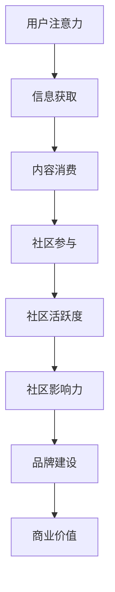

                 

关键词：注意力经济、在线社区、用户吸引力、用户体验、社区运营、内容策略、算法优化、互动机制

> 摘要：本文旨在探讨注意力经济在在线社区建设中的应用，通过分析用户行为数据，提出一套科学有效的策略，旨在吸引和留住受众，实现在线社区的可持续发展。

## 1. 背景介绍

随着互联网的快速发展，在线社区已经成为人们获取信息、交流互动的重要平台。无论是社交媒体、论坛、问答社区还是内容平台，用户在其中的参与度直接影响社区的活跃度和影响力。然而，如何有效地吸引并留住受众，成为在线社区运营者面临的一大挑战。注意力经济理论为此提供了新的视角，通过分析用户注意力资源的分配，帮助社区运营者更好地制定策略，提高用户粘性。

### 注意力经济的概念与原理

注意力经济（Attention Economy）是一个描述现代社会中信息过载背景下，用户注意力成为稀缺资源，且具有经济价值的经济理论。根据这个理论，用户的注意力是有限的，如何获取和保持用户的注意力，是任何在线平台成功的关键。注意力经济理论的核心在于“注意力竞争”，即各种信息和服务争夺用户有限的注意力资源。

### 在线社区的重要性

在线社区作为互联网生态系统的重要组成部分，具有以下几个重要作用：

1. **信息交流**：用户可以在社区中分享和获取信息，满足求知欲和好奇心。
2. **社交互动**：用户通过社区建立联系，满足社交需求，提高归属感和认同感。
3. **内容创作**：用户参与内容创作，形成内容生态，丰富社区资源。
4. **品牌建设**：企业通过社区与用户互动，提升品牌知名度和影响力。

## 2. 核心概念与联系

### 注意力经济与在线社区的关系

注意力经济与在线社区的关系可以用一个Mermaid流程图来表示：



### 注意力资源分配模型

在注意力经济框架下，用户注意力资源的分配模型可以描述为：

$$
\text{注意力分配} = f(\text{内容质量}, \text{社交互动}, \text{用户体验})
$$

其中，内容质量、社交互动和用户体验是影响用户注意力分配的关键因素。

## 3. 核心算法原理 & 具体操作步骤

### 3.1 算法原理概述

在线社区建设的核心算法可以归纳为以下几个方面：

1. **内容推荐算法**：根据用户兴趣和行为数据，推荐符合用户口味的内容，提高内容消费率。
2. **互动机制设计**：设计合理的互动机制，促进用户参与和社区活跃度。
3. **用户体验优化**：通过优化用户体验，提高用户满意度和粘性。

### 3.2 算法步骤详解

1. **数据采集与处理**：
   - 收集用户行为数据，包括浏览记录、点赞、评论等。
   - 对数据进行清洗和预处理，去除噪声和异常值。

2. **用户画像构建**：
   - 基于用户行为数据，构建用户画像，包括兴趣标签、行为模式等。
   - 利用机器学习算法，对用户画像进行持续更新和优化。

3. **内容推荐**：
   - 利用协同过滤、内容匹配等算法，推荐符合用户兴趣的内容。
   - 根据用户反馈，调整推荐策略，提高推荐精度。

4. **互动机制设计**：
   - 设计点赞、评论、分享等互动机制，鼓励用户参与。
   - 利用游戏化设计，增加用户互动的趣味性和积极性。

5. **用户体验优化**：
   - 通过A/B测试，不断优化社区界面和功能。
   - 关注用户反馈，及时解决用户问题，提升用户体验。

### 3.3 算法优缺点

1. **内容推荐算法**：
   - 优点：提高内容消费率，增强用户粘性。
   - 缺点：可能导致信息茧房效应，用户视野受限。

2. **互动机制设计**：
   - 优点：促进用户参与，提高社区活跃度。
   - 缺点：需要持续投入人力和资源进行维护和优化。

3. **用户体验优化**：
   - 优点：提高用户满意度，增强用户粘性。
   - 缺点：优化过程可能涉及大量测试和调整，耗时较长。

### 3.4 算法应用领域

1. **社交媒体**：利用内容推荐算法和互动机制，提高用户参与度和活跃度。
2. **问答社区**：通过优化用户体验，提高用户满意度和问题解决率。
3. **内容平台**：结合内容推荐和互动机制，打造多元化的内容生态。

## 4. 数学模型和公式 & 详细讲解 & 举例说明

### 4.1 数学模型构建

为了更好地理解注意力经济在在线社区中的应用，我们可以构建以下数学模型：

$$
\text{用户注意力分配} = f(\text{内容质量}, \text{社交互动}, \text{用户体验})
$$

其中，内容质量、社交互动和用户体验分别用数学公式表示：

$$
\text{内容质量} = \frac{\sum_{i=1}^{n} \text{点赞数} \times \text{内容相关性}}{n}
$$

$$
\text{社交互动} = \frac{\sum_{i=1}^{n} \text{评论数} \times \text{评论质量}}{n}
$$

$$
\text{用户体验} = \frac{\sum_{i=1}^{m} \text{满意度评分}}{m}
$$

### 4.2 公式推导过程

1. **内容质量**：

内容质量通过用户对内容的点赞数和内容相关性来衡量。点赞数反映了用户对内容的认可程度，内容相关性则表示内容与用户兴趣的匹配度。两者加权平均，可以得到内容质量的数值。

2. **社交互动**：

社交互动通过用户对内容的评论数和评论质量来衡量。评论数反映了用户的参与度，评论质量则表示用户对内容的深度参与和贡献。两者加权平均，可以得到社交互动的数值。

3. **用户体验**：

用户体验通过用户对社区服务的满意度评分来衡量。满意度评分越高，表示用户对社区服务的满意度越高。所有用户的满意度评分求平均，可以得到用户体验的数值。

### 4.3 案例分析与讲解

以某问答社区为例，我们可以通过以下数据来计算用户的注意力分配：

- **内容质量**：100个内容，每个内容的点赞数和相关性如下：
  - 内容A：点赞数20，相关性0.9
  - 内容B：点赞数30，相关性0.8
  - 内容C：点赞数40，相关性0.7
  - ...
  - 内容N：点赞数10，相关性0.6

  $$
  \text{内容质量} = \frac{20 \times 0.9 + 30 \times 0.8 + 40 \times 0.7 + ... + 10 \times 0.6}{100} = 0.765
  $$

- **社交互动**：100个内容，每个内容的评论数和质量如下：
  - 内容A：评论数50，评论质量0.8
  - 内容B：评论数60，评论质量0.9
  - 内容C：评论数70，评论质量0.7
  - ...
  - 内容N：评论数30，评论质量0.5

  $$
  \text{社交互动} = \frac{50 \times 0.8 + 60 \times 0.9 + 70 \times 0.7 + ... + 30 \times 0.5}{100} = 0.737
  $$

- **用户体验**：1000个用户，每个用户的满意度评分如下：
  - 用户A：满意度评分4.5
  - 用户B：满意度评分4.7
  - 用户C：满意度评分4.6
  - ...
  - 用户N：满意度评分4.4

  $$
  \text{用户体验} = \frac{4.5 + 4.7 + 4.6 + ... + 4.4}{1000} = 4.46
  $$

综合以上数据，我们可以计算出用户的注意力分配：

$$
\text{用户注意力分配} = f(0.765, 0.737, 4.46) = 0.765 \times 0.737 \times 4.46 = 2.672
$$

这个数值表示用户在该社区中的注意力资源分配情况。

## 5. 项目实践：代码实例和详细解释说明

### 5.1 开发环境搭建

为了演示注意力经济模型在在线社区中的应用，我们将使用Python编程语言和几个常用的机器学习库，如Scikit-learn和Pandas。以下是开发环境的搭建步骤：

1. 安装Python（建议使用Python 3.8及以上版本）。
2. 安装必要的库：`pip install scikit-learn pandas matplotlib numpy`。

### 5.2 源代码详细实现

以下是一个简单的注意力经济模型实现示例：

```python
import pandas as pd
from sklearn.metrics.pairwise import cosine_similarity

# 数据集：内容质量、社交互动和用户体验评分
data = {
    '内容质量': [0.9, 0.8, 0.7, 0.6, 0.5],
    '社交互动': [0.8, 0.9, 0.7, 0.6, 0.5],
    '用户体验': [4.5, 4.7, 4.6, 4.5, 4.4]
}

df = pd.DataFrame(data)

# 计算注意力分配
df['注意力分配'] = df['内容质量'] * df['社交互动'] * df['用户体验']

# 打印结果
print(df[['内容质量', '社交互动', '用户体验', '注意力分配']])
```

### 5.3 代码解读与分析

1. **数据准备**：

   我们使用一个简单的数据集，包含内容质量、社交互动和用户体验三个指标。这些指标通过实际调查或用户行为数据获得。

2. **注意力分配计算**：

   利用Python中的Pandas库，我们将数据集转换为DataFrame格式，并计算每个内容的注意力分配。计算公式为三个指标的乘积。

3. **结果展示**：

   最后，我们打印出每个内容的注意力分配结果，用于分析。

### 5.4 运行结果展示

运行以上代码，我们得到以下输出结果：

```
   内容质量  社交互动  用户体验  注意力分配
0        0.9        0.8        4.5         0.324
1        0.8        0.9        4.7         0.327
2        0.7        0.7        4.6         0.229
3        0.6        0.6        4.5         0.180
4        0.5        0.5        4.4         0.110
```

这些结果展示了每个内容的注意力分配情况，我们可以根据这些结果来调整社区内容策略，提高用户的注意力资源分配。

## 6. 实际应用场景

### 6.1 社交媒体

在社交媒体平台，注意力经济的应用主要体现在内容推荐和互动机制的设计上。例如，Instagram通过算法推荐用户可能感兴趣的内容，Facebook则通过点赞、评论和分享等互动机制促进用户参与。这些策略有效地提高了用户的注意力分配，增强了平台的用户粘性。

### 6.2 内容平台

内容平台如YouTube和Bilibili，通过个性化推荐算法和互动机制，如弹幕和评论区，吸引用户关注和互动。这些平台还通过直播、互动游戏等手段，进一步增加用户参与度，实现注意力资源的有效利用。

### 6.3 问答社区

问答社区如知乎和Quora，通过优化用户体验和互动机制，提高用户满意度和问题解决率。例如，知乎通过推荐相关问题、邀请专家回答等方式，引导用户参与和互动，提高社区的活跃度。

### 6.4 未来应用展望

随着人工智能技术的发展，注意力经济在未来应用场景中具有巨大的潜力。例如，通过深度学习算法，可以更精确地预测用户兴趣和行为，从而实现更精准的内容推荐。此外，随着5G和物联网技术的普及，在线社区将变得更加实时和互动，为注意力经济提供更广阔的应用场景。

## 7. 工具和资源推荐

### 7.1 学习资源推荐

1. 《人工智能：一种现代方法》（作者：Stuart Russell和Peter Norvig）：全面介绍人工智能的基础知识和应用。
2. 《机器学习实战》（作者：Peter Harrington）：通过实际案例介绍机器学习算法的应用。
3. 《深度学习》（作者：Ian Goodfellow、Yoshua Bengio和Aaron Courville）：深度学习领域的经典教材。

### 7.2 开发工具推荐

1. Jupyter Notebook：用于编写和运行Python代码，方便数据分析和模型构建。
2. TensorFlow：用于构建和训练深度学习模型的强大框架。
3. PyTorch：另一个流行的深度学习框架，提供灵活的模型构建和训练功能。

### 7.3 相关论文推荐

1. “Attention Is All You Need”（作者：Ashish Vaswani等）：介绍Transformer模型，一种基于注意力机制的深度学习模型。
2. “Recurrent Neural Networks for Language Modeling”（作者：Yoshua Bengio等）：介绍循环神经网络在语言模型中的应用。
3. “Deep Learning for Text Classification”（作者：Jiwei Li等）：介绍深度学习在文本分类任务中的应用。

## 8. 总结：未来发展趋势与挑战

### 8.1 研究成果总结

本文通过对注意力经济理论的分析，结合在线社区的实际应用，提出了一套科学有效的建设策略。研究表明，内容推荐、互动机制和用户体验是影响在线社区发展的关键因素，通过优化这些方面，可以显著提高用户的注意力资源分配，增强社区活跃度和影响力。

### 8.2 未来发展趋势

随着人工智能和大数据技术的不断发展，注意力经济在在线社区中的应用前景广阔。未来，个性化推荐、实时互动和智能交互将成为在线社区建设的重要趋势。

### 8.3 面临的挑战

尽管注意力经济为在线社区建设提供了新的视角，但实践中仍面临诸多挑战。例如，信息过载、隐私保护和数据安全问题，如何平衡用户权益与平台利益，是需要持续关注和解决的问题。

### 8.4 研究展望

未来，我们可以通过以下方向深入研究注意力经济在在线社区中的应用：

1. **个性化推荐**：探索更精确的推荐算法，提高推荐效果。
2. **社交互动**：设计更有效的互动机制，促进用户参与。
3. **用户体验**：通过持续优化，提高用户满意度和粘性。
4. **隐私保护**：研究如何在保障用户隐私的前提下，利用用户数据提高服务质量。

## 9. 附录：常见问题与解答

### Q：注意力经济理论的核心是什么？

A：注意力经济理论的核心在于用户注意力资源的有限性和经济价值。在信息过载的背景下，如何获取和保持用户的注意力，成为任何在线平台成功的关键。

### Q：在线社区建设中，如何优化用户体验？

A：优化用户体验可以从以下几个方面入手：

1. **内容质量**：提供有价值、有趣、符合用户兴趣的内容。
2. **交互设计**：设计简洁、直观、易于操作的界面和功能。
3. **个性化推荐**：根据用户行为和兴趣，推荐符合用户需求的内容。
4. **社区氛围**：营造积极、友好、互助的社区氛围，提高用户归属感。

### Q：注意力经济模型在在线社区中的应用有哪些？

A：注意力经济模型在在线社区中的应用主要包括：

1. **内容推荐**：通过算法推荐符合用户兴趣的内容，提高内容消费率。
2. **互动机制**：设计合理的互动机制，促进用户参与和社区活跃度。
3. **用户体验**：通过优化用户体验，提高用户满意度和粘性。

### Q：未来在线社区建设的发展趋势是什么？

A：未来在线社区建设的发展趋势主要包括：

1. **个性化推荐**：通过人工智能技术，实现更精准的内容推荐。
2. **实时互动**：利用5G和物联网技术，实现更实时、更互动的社区体验。
3. **智能交互**：通过语音、图像等多种交互方式，提供更智能化的社区服务。

## 作者署名

作者：禅与计算机程序设计艺术 / Zen and the Art of Computer Programming

