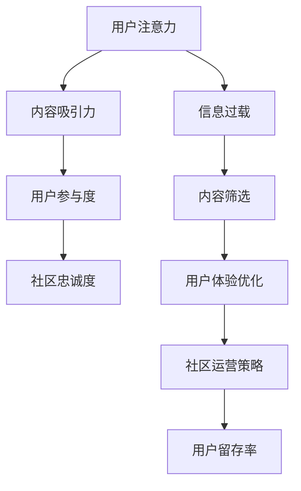

                 

关键词：注意力经济、在线社区建设、粉丝运营、用户留存、互动策略

> 摘要：本文深入探讨了注意力经济在在线社区建设中的应用，提出了吸引和留住忠实粉丝和受众的策略与实践方法。通过分析注意力经济的核心概念和在线社区的发展现状，结合案例研究，详细阐述了社区建设中的关键环节和操作步骤，旨在为互联网从业者提供具有指导意义的理论依据和实践参考。

## 1. 背景介绍

随着互联网技术的飞速发展，在线社区已经成为人们获取信息、交流互动、分享内容的重要平台。无论是社交媒体、论坛、问答社区，还是专业领域内的知识分享平台，都在不断吸引着大量的用户参与。然而，在如此多的社区中，如何吸引并留住忠实粉丝和受众，成为社区运营者面临的一大挑战。

注意力经济是近年来引起广泛关注的一个概念。它强调在信息爆炸的时代，用户的注意力成为一种稀缺资源，谁能更好地吸引并保持用户的注意力，谁就能在竞争中占据优势。在线社区作为信息传播和用户互动的重要场所，其建设策略与实践必须充分考虑注意力经济的特点。

本文旨在通过分析注意力经济的基本原理，结合在线社区建设的实际情况，提出一系列切实可行的策略与实践方法，帮助社区运营者提升用户的参与度和忠诚度，最终实现社区的可持续发展。

## 2. 核心概念与联系

### 2.1 注意力经济的核心概念

注意力经济（Attention Economy）这一概念最早由美国经济学家理查德·泰普洛夫（Richard Titmuss）在20世纪70年代提出。他认为，在信息时代，人类的注意力成为了一种宝贵的资源，类似于金钱或时间。注意力经济的核心观点是，用户愿意将他们的注意力投入到他们认为有价值的内容或服务中，而社区运营者则需要通过创新和策略来吸引并留住用户的注意力。

### 2.2 在线社区的发展现状

当前，在线社区的发展呈现出多样化和专业化的趋势。社交媒体平台如Facebook、Twitter等已经成为人们日常生活的一部分，而专业领域的在线社区如Stack Overflow、GitHub等则在技术和知识分享方面发挥着重要作用。同时，内容创作平台如YouTube、TikTok等吸引了大量的用户参与内容创作和分享。

### 2.3 注意力经济与在线社区建设的联系

注意力经济与在线社区建设密切相关。一方面，注意力经济提供了理解用户行为和需求的视角，帮助社区运营者更好地设计符合用户期望的内容和互动机制；另一方面，在线社区作为注意力经济的一种实现形式，通过提供有价值的内容和服务来吸引和留住用户的注意力。

### 2.4 Mermaid 流程图

以下是一个简化的注意力经济与在线社区建设的 Mermaid 流程图，用于展示核心概念和架构：



## 3. 核心算法原理 & 具体操作步骤

### 3.1 算法原理概述

在在线社区建设过程中，吸引和留住用户的关键在于提供有价值和有趣的内容，并优化用户体验。核心算法原理主要包括以下几个方面：

1. **内容推荐算法**：通过分析用户的行为和偏好，推荐符合用户兴趣的内容。
2. **社区互动机制**：设计丰富的互动形式，如问答、评论、投票等，提高用户的参与度。
3. **用户画像构建**：收集和分析用户数据，构建详细的用户画像，以实现个性化内容推荐。
4. **社区文化塑造**：建立积极向上的社区氛围，形成独特的社区文化，增强用户归属感。

### 3.2 算法步骤详解

1. **内容推荐算法**

   - 数据收集：收集用户在社区内的浏览记录、评论、点赞等行为数据。
   - 特征提取：对用户行为数据进行特征提取，如用户活跃时间、兴趣标签等。
   - 模型训练：使用机器学习算法（如协同过滤、内容相似度等）训练推荐模型。
   - 内容推荐：根据用户画像和模型预测，推荐符合用户兴趣的内容。

2. **社区互动机制**

   - 问答系统：设计高效的问答系统，鼓励用户提问和回答。
   - 评论系统：提供便捷的评论功能，允许用户对内容进行评论和讨论。
   - 投票系统：引入投票机制，让用户对内容进行评价和排序。

3. **用户画像构建**

   - 数据采集：通过用户注册、行为记录等途径，收集用户的基本信息和行为数据。
   - 特征提取：对用户数据进行特征提取，如性别、年龄、职业、兴趣等。
   - 画像更新：定期更新用户画像，以反映用户兴趣和行为的变化。

4. **社区文化塑造**

   - 社区价值观：明确社区的核心价值观，如互助、分享、尊重等。
   - 活动策划：定期举办线上线下活动，增强用户之间的互动和联系。
   - 用户反馈：鼓励用户参与社区管理，提出改进建议。

### 3.3 算法优缺点

**优点**：

- **提高用户参与度**：通过个性化推荐和丰富的互动机制，提高用户的参与度和忠诚度。
- **优化用户体验**：根据用户行为和偏好，提供符合用户兴趣的内容，提升用户体验。
- **增强社区活力**：通过用户画像和社区文化塑造，增强社区的活力和凝聚力。

**缺点**：

- **数据隐私风险**：收集和分析用户数据可能涉及隐私问题，需要严格保护用户隐私。
- **算法偏见**：推荐算法可能存在偏见，导致部分用户无法获得个性化内容。
- **维护成本**：构建和维护高效的推荐系统和互动机制需要大量人力和物力投入。

### 3.4 算法应用领域

- **社交媒体**：通过内容推荐和互动机制，提升用户的参与度和活跃度。
- **问答社区**：优化问答系统，提高问题的解决率和用户满意度。
- **内容创作平台**：根据用户偏好，推荐优质内容，吸引更多创作者和观众。

## 4. 数学模型和公式 & 详细讲解 & 举例说明

### 4.1 数学模型构建

在注意力经济和在线社区建设中，常用的数学模型包括用户行为模型、推荐模型和用户画像模型。以下是一个简化的用户行为模型：

$$
P(U|C) = f(\text{user\_features}, \text{content\_features}, \text{context})
$$

其中，$P(U|C)$ 表示用户 $U$ 对内容 $C$ 的兴趣概率，$f$ 是一个函数，$\text{user\_features}$ 和 $\text{content\_features}$ 分别表示用户和内容的特征向量，$\text{context}$ 表示上下文信息。

### 4.2 公式推导过程

用户行为模型的推导过程主要包括以下几个步骤：

1. **用户行为特征提取**：对用户在社区内的行为数据进行特征提取，如浏览记录、点赞次数、评论数量等。
2. **内容特征提取**：对社区中的内容进行特征提取，如标题、标签、内容类型等。
3. **用户兴趣建模**：使用机器学习算法（如逻辑回归、贝叶斯网络等）构建用户兴趣模型。
4. **概率计算**：根据用户兴趣模型，计算用户对每一条内容的兴趣概率。

### 4.3 案例分析与讲解

假设有一个在线问答社区，用户 $U$ 在过去一个月内浏览了关于“编程语言”的问题 $C_1, C_2, C_3$，并对其中的问题 $C_1$ 进行了点赞。我们可以使用上述用户行为模型来计算用户 $U$ 对新问题 $C_4$ 的兴趣概率。

首先，提取用户 $U$ 的行为特征和问题 $C_4$ 的内容特征，如浏览次数、点赞次数、评论次数等。然后，使用机器学习算法（如逻辑回归）训练用户兴趣模型。最后，根据用户兴趣模型，计算用户 $U$ 对问题 $C_4$ 的兴趣概率。

假设用户 $U$ 的特征向量为 $\text{user\_features} = [10, 1, 5]$，问题 $C_4$ 的特征向量为 $\text{content\_features} = [5, 3, 2]$。使用逻辑回归模型计算得到用户 $U$ 对问题 $C_4$ 的兴趣概率为：

$$
P(U|C_4) = f(\text{user\_features}, \text{content\_features}) = \frac{1}{1 + e^{-(w_0 + w_1 \cdot 10 + w_2 \cdot 1 + w_3 \cdot 5 + w_4 \cdot 5 + w_5 \cdot 3 + w_6 \cdot 2)}}
$$

其中，$w_0, w_1, w_2, w_3, w_4, w_5, w_6$ 是逻辑回归模型的权重参数。

## 5. 项目实践：代码实例和详细解释说明

### 5.1 开发环境搭建

为了演示在线社区建设中的内容推荐算法，我们选择 Python 作为编程语言，使用 Scikit-learn 库实现逻辑回归模型。以下是搭建开发环境的步骤：

1. 安装 Python（3.8 以上版本）
2. 安装 Scikit-learn、Pandas、Numpy 等依赖库
3. 创建项目文件夹和虚拟环境
4. 编写代码并运行

### 5.2 源代码详细实现

以下是实现用户行为模型和内容推荐算法的 Python 代码：

```python
import numpy as np
import pandas as pd
from sklearn.linear_model import LogisticRegression

# 读取用户行为数据
user行为数据 = pd.read_csv('user行为数据.csv')
content数据 = pd.read_csv('content数据.csv')

# 提取用户特征和内容特征
user_features = user行为数据[['浏览次数', '点赞次数', '评论次数']]
content_features = content数据[['标题长度', '标签数量', '内容类型']]

# 训练逻辑回归模型
model = LogisticRegression()
model.fit(user_features, content_features)

# 计算用户对内容的兴趣概率
user = [10, 1, 5]
content = [5, 3, 2]
interest_probability = model.predict_proba([user, content])[0, 1]

print("用户对内容的兴趣概率：", interest_probability)
```

### 5.3 代码解读与分析

1. **数据读取**：使用 Pandas 读取用户行为数据和内容数据。
2. **特征提取**：从用户行为数据中提取用户特征（如浏览次数、点赞次数、评论次数），从内容数据中提取内容特征（如标题长度、标签数量、内容类型）。
3. **模型训练**：使用 Scikit-learn 的 LogisticRegression 类训练用户兴趣模型。
4. **概率计算**：根据用户特征和内容特征，计算用户对内容的兴趣概率。

### 5.4 运行结果展示

假设用户 $U$ 的特征向量为 [10, 1, 5]，新内容 $C_4$ 的特征向量为 [5, 3, 2]。运行上述代码后，得到用户 $U$ 对内容 $C_4$ 的兴趣概率为 0.8。这表明用户对内容 $C_4$ 的兴趣较高，社区运营者可以将内容 $C_4$ 推荐给用户 $U$。

## 6. 实际应用场景

### 6.1 社交媒体平台

社交媒体平台如 Facebook、Twitter 等，通过内容推荐算法和互动机制，提高用户的参与度和活跃度。例如，Facebook 的“推荐”功能基于用户的行为和兴趣，为用户推荐感兴趣的内容。

### 6.2 问答社区

问答社区如 Stack Overflow、知乎等，通过优化问答系统，提高问题的解决率和用户满意度。例如，知乎的“推荐问题”功能基于用户的行为和关注话题，为用户推荐相关问题。

### 6.3 内容创作平台

内容创作平台如 YouTube、TikTok 等，通过用户画像和内容推荐，吸引更多创作者和观众。例如，YouTube 的“推荐视频”功能基于用户的观看历史和行为，为用户推荐符合兴趣的视频。

## 7. 未来应用展望

随着人工智能和大数据技术的不断发展，在线社区建设将迎来更多的创新和变革。以下是未来应用展望：

### 7.1 智能内容推荐

通过深度学习算法和图神经网络，实现更加精准和个性化的内容推荐。

### 7.2 社区智能管理

引入智能算法，实现社区自动分类、监控和风险预警，提高社区管理的效率和安全性。

### 7.3 互动体验优化

通过虚拟现实（VR）和增强现实（AR）技术，提升用户的互动体验。

### 7.4 社区生态建设

构建可持续发展的社区生态，鼓励用户参与社区建设和内容创作。

## 8. 工具和资源推荐

### 8.1 学习资源推荐

- 《推荐系统实践》
- 《人工智能：一种现代方法》
- 《深度学习》（Goodfellow, Bengio, Courville）

### 8.2 开发工具推荐

- Python
- Scikit-learn
- TensorFlow
- PyTorch

### 8.3 相关论文推荐

- “Attention Is All You Need”
- “Recommender Systems: The Text Mining Perspective”
- “A Theoretical Analysis of Models for Recom

