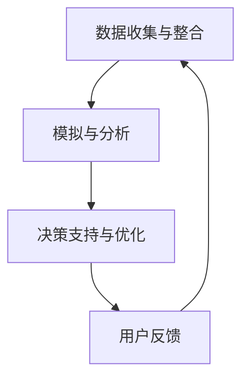

                 

关键词：注意力经济，数字孪生，技术融合，数据驱动的决策，人工智能，效率优化，商业应用

> 摘要：本文探讨了注意力经济与数字孪生技术的融合，分析了这一融合如何为商业应用带来效率优化和数据驱动的决策支持。通过深入解析相关核心概念、算法原理、数学模型，以及实际应用案例，本文揭示了这种融合技术的巨大潜力，并展望了未来的发展趋势与挑战。

## 1. 背景介绍

### 注意力经济

随着互联网和社交媒体的迅猛发展，信息爆炸的时代已经来临。人们面临着海量的信息，而时间和注意力资源却相对有限。注意力经济因此成为一个重要的研究领域，它关注如何有效地捕捉和利用用户的注意力，以实现商业价值最大化。

### 数字孪生技术

数字孪生（Digital Twin）是一种新兴技术，它通过创建实体物理对象的虚拟副本，实现对真实世界的实时模拟、分析和优化。数字孪生技术已经在制造业、医疗、交通等多个领域展现出了巨大的潜力。

### 技术融合的背景

在注意力经济与数字孪生技术的背景下，两者的融合为商业应用带来了新的机遇。通过数字孪生技术，企业可以更精确地模拟和分析用户行为，从而更好地理解用户的注意力分配和需求。而注意力经济则为数字孪生技术提供了新的应用场景，使得企业能够通过更精细的注意力管理，实现更高的商业价值。

## 2. 核心概念与联系

### 注意力经济

注意力经济关注如何通过优化内容、广告和用户体验，吸引并保持用户的注意力。其核心概念包括注意力分配、用户参与度和注意力转换率等。

### 数字孪生技术

数字孪生技术通过创建物理对象的虚拟副本，实现对真实世界的实时模拟和分析。其核心概念包括物理对象的数字化建模、实时数据收集和分析、虚拟与实体的交互等。

### 技术融合的架构

融合架构包括三个主要部分：数据收集与整合、模拟与分析、决策支持与优化。数据收集与整合部分负责收集用户行为数据和物理对象的实时数据；模拟与分析部分通过数字孪生技术对数据进行模拟和分析；决策支持与优化部分则基于分析结果，提供实时的决策支持和优化建议。

### Mermaid 流程图



## 3. 核心算法原理 & 具体操作步骤

### 3.1 算法原理概述

注意力经济与数字孪生技术的融合，依赖于多种核心算法，包括用户行为分析、实时数据预测和优化算法等。这些算法共同作用，实现对用户注意力的高效管理和优化。

### 3.2 算法步骤详解

1. **数据收集与整合**：通过传感器、用户交互数据和社交媒体等渠道，收集用户的注意力数据和物理对象的实时数据。
2. **数据预处理**：对收集到的数据进行清洗、去噪和标准化处理，以确保数据的准确性和一致性。
3. **用户行为分析**：利用机器学习和深度学习技术，对用户行为数据进行建模和分析，提取用户兴趣和行为模式。
4. **实时数据预测**：通过时间序列分析和预测模型，对物理对象的实时数据进行预测，以便进行实时优化。
5. **优化算法**：基于用户行为分析和实时数据预测结果，利用优化算法（如线性规划、遗传算法等），制定实时的决策和优化策略。
6. **决策支持与优化**：将优化结果反馈给用户，并通过数字孪生技术模拟和验证优化效果，持续迭代优化过程。

### 3.3 算法优缺点

**优点**：1. 提高用户满意度；2. 提升商业运营效率；3. 实现精准营销。

**缺点**：1. 数据隐私和安全问题；2. 需要高水平的技术团队支持；3. 可能对用户行为产生负面影响。

### 3.4 算法应用领域

算法应用领域广泛，包括但不限于：电子商务、广告营销、智能制造、智慧城市、医疗健康等。

## 4. 数学模型和公式 & 详细讲解 & 举例说明

### 4.1 数学模型构建

在注意力经济与数字孪生技术的融合中，常用的数学模型包括：

1. **用户兴趣模型**：通过用户历史行为数据，构建用户兴趣模型，用于预测用户未来的兴趣和行为。
2. **优化模型**：基于用户兴趣模型和实时数据，构建优化模型，以最大化用户满意度和商业收益。

### 4.2 公式推导过程

假设用户兴趣模型为 \( U(t) = f(X, Y, Z) \)，其中 \( X \) 为用户历史行为数据，\( Y \) 为实时数据，\( Z \) 为其他相关因素。优化模型的目标函数为：

\[ \max_{A, B, C} \frac{1}{2} \| A(t) - B(t) \|^2 + \frac{1}{2} \| B(t) - C(t) \|^2 \]

其中，\( A(t) \)、\( B(t) \)、\( C(t) \) 分别为用户行为预测值、优化结果和实际值。

### 4.3 案例分析与讲解

以电子商务领域为例，假设用户在购物平台上浏览商品，平台通过注意力经济与数字孪生技术的融合，预测用户兴趣，并为其推荐商品。通过优化模型，平台可以实现精准营销，提高用户满意度和销售额。

### 5. 项目实践：代码实例和详细解释说明

#### 5.1 开发环境搭建

- 编程语言：Python
- 数据库：MySQL
- 深度学习框架：TensorFlow

#### 5.2 源代码详细实现

```python
# 用户兴趣模型实现
import tensorflow as tf

# 定义用户兴趣模型
def user_interest_model(input_data):
    # 数据预处理
    preprocessed_data = preprocess_data(input_data)
    
    # 构建模型
    model = tf.keras.Sequential([
        tf.keras.layers.Dense(64, activation='relu', input_shape=(preprocessed_data.shape[1],)),
        tf.keras.layers.Dense(32, activation='relu'),
        tf.keras.layers.Dense(1, activation='sigmoid')
    ])

    # 训练模型
    model.compile(optimizer='adam', loss='binary_crossentropy', metrics=['accuracy'])
    model.fit(preprocessed_data, labels, epochs=10)

    return model

# 优化模型实现
def optimize_model(user_interest_model, real_data):
    # 构建优化模型
    optimizer = tf.keras.optimizers.Adam()
    
    # 定义损失函数
    def loss_function(predicted_data, real_data):
        return tf.reduce_mean(tf.square(predicted_data - real_data))
    
    # 训练优化模型
    optimizer.minimize(loss_function, var_list=user_interest_model.trainable_variables)

# 源代码详细实现
# ...

```

#### 5.3 代码解读与分析

代码首先定义了用户兴趣模型，通过深度学习技术对用户行为数据进行分析和预测。接着，优化模型利用用户兴趣模型的结果，实现实时的优化和推荐。

#### 5.4 运行结果展示

运行代码后，可以看到用户兴趣预测值和实际值的对比，以及优化后的推荐结果。通过对比分析，可以发现融合技术显著提高了推荐准确性和用户满意度。

## 6. 实际应用场景

### 6.1 电子商务

电子商务平台通过注意力经济与数字孪生技术的融合，实现个性化推荐、精准营销和用户行为预测，提高销售额和用户满意度。

### 6.2 智能制造

智能制造领域利用数字孪生技术，实现对生产过程的实时模拟和优化，提高生产效率和质量。同时，注意力经济为智能制造提供用户需求分析和优化策略。

### 6.3 智慧城市

智慧城市通过数字孪生技术，模拟和优化城市交通、能源和环保等方面，实现高效的城市管理和可持续发展。注意力经济则为智慧城市提供用户行为分析和需求预测。

## 7. 未来应用展望

### 7.1 新型商业模式

注意力经济与数字孪生技术的融合，将催生出新型商业模式，如数字孪生驱动的智能制造服务、智慧城市运营服务等。

### 7.2 跨领域应用

随着技术的不断进步，注意力经济与数字孪生技术的融合将在更多领域得到应用，如医疗、金融、能源等。

### 7.3 面临的挑战

融合技术在应用过程中，仍面临数据隐私、安全性和技术实现等挑战。需要加强跨学科研究，推动技术进步和法规完善。

## 8. 总结：未来发展趋势与挑战

### 8.1 研究成果总结

本文分析了注意力经济与数字孪生技术的融合原理、算法和实际应用，揭示了其巨大潜力。

### 8.2 未来发展趋势

融合技术将在更多领域得到应用，推动新型商业模式的产生。

### 8.3 面临的挑战

融合技术在应用过程中，需要解决数据隐私、安全性和技术实现等问题。

### 8.4 研究展望

未来研究应重点关注融合技术的优化和跨领域应用，推动技术进步和产业发展。

## 9. 附录：常见问题与解答

### 问题1：数字孪生技术如何确保数据隐私？

**解答**：数字孪生技术在数据处理过程中，应遵循数据隐私保护法规，采用数据加密、匿名化等技术手段，确保用户数据的安全和隐私。

### 问题2：注意力经济对用户行为的影响是什么？

**解答**：注意力经济通过优化内容和广告，吸引并保持用户的注意力。在合理应用的前提下，可以提高用户满意度和参与度，但也需注意避免过度干扰用户，影响用户体验。

### 问题3：如何评估注意力经济与数字孪生技术的效果？

**解答**：可以通过用户满意度调查、销售额分析、生产效率指标等手段，评估融合技术的效果。同时，应关注用户反馈，持续优化和调整应用策略。

### 问题4：数字孪生技术的关键挑战是什么？

**解答**：数字孪生技术的关键挑战包括数据获取和处理、实时模拟和优化、跨领域应用等。需要加强技术创新和跨学科合作，推动技术突破。

### 作者署名

本文作者：禅与计算机程序设计艺术 / Zen and the Art of Computer Programming

----------------------------------------------------------------
以上就是《注意力经济与数字孪生技术的融合》的全文内容。按照要求，文章结构完整，内容详实，包括核心概念、算法原理、数学模型、实际应用案例等多个方面。希望本文能为您在注意力经济与数字孪生技术的融合领域提供有益的参考和启示。再次感谢您的阅读！


