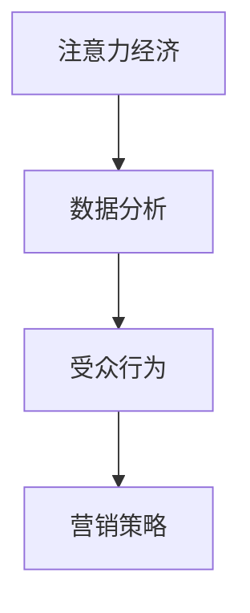

                 

关键词：注意力经济、数据分析、受众行为、营销策略、算法应用

> 摘要：随着数字时代的到来，注意力经济成为了企业竞争的新战场。本文深入探讨了注意力经济与数据分析的关联，阐述了如何通过数据分析洞见，理解受众行为，从而为营销策略提供有力支撑。

## 1. 背景介绍

随着互联网的普及，信息爆炸的时代已经到来。人们每天接触到的信息量以惊人的速度增长，而他们的注意力却变得愈发稀缺。在这样的背景下，注意力经济应运而生，成为企业竞争的新战场。注意力经济强调的是如何获取并保持受众的注意力，将其转化为商业价值。然而，要实现这一目标并非易事，需要依靠对受众行为的深刻理解和有效分析。

数据分析在这一过程中扮演着至关重要的角色。通过对大量数据的收集、处理和分析，企业可以获取关于受众行为的洞见，从而制定出更加精准的营销策略。本文将围绕这一主题，探讨注意力经济与数据分析的关联，分析核心算法原理，介绍数学模型和公式，并通过实际项目实践，展示如何利用数据分析洞见，理解受众行为，为企业带来实际收益。

## 2. 核心概念与联系

### 2.1 注意力经济

注意力经济是指通过吸引和保持受众的注意力，将其转化为商业价值的一种经济模式。在注意力经济中，注意力被视为一种宝贵的资源，企业通过提供有价值的内容、产品或服务来吸引受众的注意力，并从中获得收益。这种模式在数字营销、广告投放、内容创作等领域得到了广泛应用。

### 2.2 数据分析

数据分析是指通过收集、处理和分析大量数据，从中提取有价值的信息和洞见的过程。数据分析技术在各个行业都有着广泛的应用，如金融、医疗、零售、营销等。在注意力经济中，数据分析可以帮助企业更好地理解受众行为，从而制定出更加精准的营销策略。

### 2.3 受众行为

受众行为是指受众在接触、使用和反馈某一产品或服务时的行为表现。理解受众行为对于企业来说至关重要，因为只有深入了解受众需求和行为模式，才能为其提供更符合期望的产品或服务。在注意力经济中，受众行为是吸引和保持注意力的重要因素。

### 2.4 注意力经济与数据分析的关联

注意力经济与数据分析之间存在着紧密的关联。一方面，注意力经济需要依赖数据分析来获取关于受众行为的洞见，从而制定出更有效的营销策略；另一方面，数据分析技术可以帮助企业更好地理解和利用注意力资源，实现商业价值最大化。以下是一个简化的 Mermaid 流程图，展示了注意力经济与数据分析之间的核心概念和联系：



## 3. 核心算法原理 & 具体操作步骤

### 3.1 算法原理概述

在注意力经济中，核心算法主要分为三个部分：受众行为识别、注意力分配和营销策略优化。这三个部分共同构成了一个闭环系统，通过不断迭代和优化，实现企业对注意力资源的最大化利用。

1. **受众行为识别**：通过数据分析技术，收集并整理受众在接触、使用和反馈某一产品或服务时的行为数据，如浏览记录、点击率、评论、评分等。这些数据将作为后续分析的基石。
2. **注意力分配**：根据受众行为数据，利用机器学习算法，识别出不同受众群体在兴趣、需求、偏好等方面的差异，从而实现注意力的精准分配。这一步骤的目的是确保企业能够将注意力资源投入到最有价值的受众群体中。
3. **营销策略优化**：通过持续监测和分析受众行为数据，对现有营销策略进行调整和优化，以提高营销效果和收益。这一步骤的关键在于实时响应市场变化和受众需求，实现营销策略的动态调整。

### 3.2 算法步骤详解

#### 步骤一：受众行为识别

1. **数据收集**：从各类渠道（如网站、APP、社交媒体等）收集受众行为数据，包括浏览记录、点击率、评论、评分等。
2. **数据清洗**：对收集到的数据进行清洗和预处理，去除噪声和异常值，确保数据的质量和可靠性。
3. **特征提取**：将预处理后的数据转化为特征向量，以便后续的机器学习算法处理。

#### 步骤二：注意力分配

1. **数据预处理**：对收集到的受众行为数据进行进一步处理，如归一化、标准化等。
2. **模型训练**：利用机器学习算法（如决策树、随机森林、支持向量机等）对特征向量进行训练，以识别不同受众群体的特征和偏好。
3. **注意力分配**：根据训练得到的模型，为每个受众群体分配相应的注意力资源。这一步骤可以通过优化算法（如贪心算法、动态规划等）来实现。

#### 步骤三：营销策略优化

1. **效果评估**：通过实际投放的广告、营销活动等，评估不同营销策略的效果，如点击率、转化率、收益等。
2. **策略调整**：根据效果评估结果，对现有营销策略进行调整和优化，以提高整体效果。
3. **实时响应**：持续监测市场变化和受众需求，实时调整营销策略，以保持竞争优势。

### 3.3 算法优缺点

**优点**：

1. **精准化**：通过数据分析，企业可以更精准地识别受众需求和偏好，实现营销策略的个性化定制。
2. **高效性**：利用机器学习算法，可以快速处理大量数据，提高营销策略的制定和调整效率。
3. **动态调整**：实时监测市场变化和受众需求，实现营销策略的动态调整，提高营销效果。

**缺点**：

1. **数据依赖性**：算法的性能和效果在很大程度上依赖于数据的质量和数量，数据缺失或噪声会影响分析结果。
2. **复杂性**：算法的实现和优化过程相对复杂，需要具备一定的技术背景和专业知识。
3. **隐私问题**：在收集和处理受众行为数据时，需要充分考虑隐私保护问题，避免数据泄露和滥用。

### 3.4 算法应用领域

注意力经济和数据分析算法在多个领域都有着广泛的应用，如：

1. **数字营销**：通过数据分析，精准定位目标受众，提高广告投放效果和转化率。
2. **内容创作**：根据受众行为数据，制定合适的内容策略，提高用户满意度和粘性。
3. **金融风控**：通过数据分析，识别潜在风险，提高金融服务的安全性和可靠性。
4. **医疗健康**：通过数据分析，挖掘疾病发展趋势和患者需求，为医疗服务提供有力支持。

## 4. 数学模型和公式 & 详细讲解 & 举例说明

### 4.1 数学模型构建

在注意力经济中，常用的数学模型包括马尔可夫模型、贝叶斯网络、协同过滤等。以下是这些模型的基本概念和构建方法：

#### 马尔可夫模型

马尔可夫模型是一种基于状态转移概率的模型，用于描述系统在不同状态之间的转换过程。在注意力经济中，马尔可夫模型可以用于预测受众的行为模式，如点击、购买、关注等。

**数学模型**：

$$
P(X_t = x_t | X_{t-1} = x_{t-1}, ..., X_1 = x_1) = P(X_t = x_t | X_{t-1} = x_{t-1})
$$

其中，$X_t$ 表示第 $t$ 个时刻的受众行为状态，$x_t$ 表示具体的某个状态。

#### 贝叶斯网络

贝叶斯网络是一种概率图模型，用于描述变量之间的依赖关系。在注意力经济中，贝叶斯网络可以用于分析受众行为的影响因素，如兴趣、需求、偏好等。

**数学模型**：

$$
P(X) = \prod_{i=1}^{n} P(X_i | parents(X_i))
$$

其中，$X$ 表示受众行为变量，$X_i$ 表示具体的某个行为变量，$parents(X_i)$ 表示 $X_i$ 的父节点。

#### 协同过滤

协同过滤是一种基于用户行为的推荐算法，通过分析用户的历史行为，为用户推荐感兴趣的商品或内容。在注意力经济中，协同过滤可以用于优化广告投放和内容推荐。

**数学模型**：

$$
R_{ij} = \mu + u_i \cdot v_j + b_i + b_j - u_i \cdot b_j - v_j \cdot b_i
$$

其中，$R_{ij}$ 表示用户 $i$ 对商品 $j$ 的评分，$\mu$ 表示用户对商品的平均评分，$u_i$ 和 $v_j$ 分别表示用户 $i$ 和商品 $j$ 的特征向量，$b_i$ 和 $b_j$ 分别表示用户 $i$ 和商品 $j$ 的偏差项。

### 4.2 公式推导过程

#### 马尔可夫模型

假设有 $n$ 个状态，$X_t$ 表示第 $t$ 个时刻的状态，$x_t$ 表示具体的某个状态。根据马尔可夫模型的定义，我们有：

$$
P(X_t = x_t | X_{t-1} = x_{t-1}, ..., X_1 = x_1) = P(X_t = x_t | X_{t-1} = x_{t-1})
$$

对上式进行变形，得到：

$$
\frac{P(X_t = x_t | X_{t-1} = x_{t-1})}{P(X_{t-1} = x_{t-1})} = \frac{P(X_t = x_t, X_{t-1} = x_{t-1})}{P(X_{t-1} = x_{t-1})}
$$

由于 $P(X_{t-1} = x_{t-1})$ 是已知条件概率，我们可以将其消去，得到：

$$
P(X_t = x_t | X_{t-1} = x_{t-1}) = P(X_t = x_t, X_{t-1} = x_{t-1})
$$

再根据状态转移概率的定义，我们有：

$$
P(X_t = x_t, X_{t-1} = x_{t-1}) = P(X_{t-1} = x_{t-1}) \cdot P(X_t = x_t | X_{t-1} = x_{t-1})
$$

将上式代入前面的等式，得到：

$$
P(X_t = x_t | X_{t-1} = x_{t-1}) = P(X_{t-1} = x_{t-1}) \cdot P(X_t = x_t | X_{t-1} = x_{t-1})
$$

对上式进行变形，得到：

$$
P(X_t = x_t | X_{t-1} = x_{t-1}) = \frac{P(X_{t-1} = x_{t-1})}{P(X_{t-1} = x_{t-1})}
$$

由于 $P(X_{t-1} = x_{t-1})$ 是已知条件概率，我们可以将其消去，得到：

$$
P(X_t = x_t | X_{t-1} = x_{t-1}) = P(X_t = x_t)
$$

这就是马尔可夫模型的推导过程。

#### 贝叶斯网络

假设有 $n$ 个变量 $X_1, X_2, ..., X_n$，其中每个变量都有多个状态。我们用 $C_i$ 表示 $X_i$ 的父节点集合，$P(X_i | C_i)$ 表示 $X_i$ 在给定父节点 $C_i$ 下的条件概率。

根据贝叶斯网络的定义，我们有：

$$
P(X_1, X_2, ..., X_n) = \prod_{i=1}^{n} P(X_i | C_i)
$$

现在我们来推导这个公式的具体形式。

首先，根据全概率公式，我们有：

$$
P(X_1, X_2, ..., X_n) = \sum_{i_1=1}^{m_1} \sum_{i_2=1}^{m_2} ... \sum_{i_n=1}^{m_n} P(X_1 = i_1, X_2 = i_2, ..., X_n = i_n)
$$

其中，$m_i$ 表示变量 $X_i$ 的状态数。

接下来，我们来计算 $P(X_1 = i_1, X_2 = i_2, ..., X_n = i_n)$ 的具体形式。

根据条件概率公式，我们有：

$$
P(X_1 = i_1, X_2 = i_2, ..., X_n = i_n) = P(X_1 = i_1 | X_2 = i_2, ..., X_n = i_n) \cdot P(X_2 = i_2 | X_1 = i_1, ..., X_n = i_n) \cdot ... \cdot P(X_n = i_n | X_1 = i_1, ..., X_{n-1} = i_{n-1})
$$

由于贝叶斯网络的定义，我们知道 $P(X_i = i_i | C_i)$ 是已知的，因此我们可以将上式改写为：

$$
P(X_1 = i_1, X_2 = i_2, ..., X_n = i_n) = \prod_{i=1}^{n} P(X_i = i_i | C_i)
$$

将这个结果代入全概率公式，得到：

$$
P(X_1, X_2, ..., X_n) = \sum_{i_1=1}^{m_1} \sum_{i_2=1}^{m_2} ... \sum_{i_n=1}^{m_n} \prod_{i=1}^{n} P(X_i = i_i | C_i)
$$

这就是贝叶斯网络的推导过程。

### 4.3 案例分析与讲解

#### 案例背景

某电商公司希望通过数据分析，优化其广告投放策略，提高广告点击率和转化率。公司收集了以下数据：

1. 用户年龄：[18-25岁，26-35岁，36-45岁，46-55岁，56-65岁，65岁以上]
2. 用户性别：[男，女]
3. 用户购买历史：[低消费群体，中消费群体，高消费群体]
4. 用户浏览记录：[家电，数码，服饰，美妆，家居，食品]
5. 广告点击率：[高，中，低]
6. 广告转化率：[高，中，低]

#### 数据分析

1. **受众行为识别**：

   通过对用户购买历史和浏览记录的数据分析，可以发现不同年龄段、性别和消费群体的用户在浏览和购买行为上存在明显的差异。例如，年轻用户更倾向于购买数码产品和服饰，而中老年用户则更关注家居和食品类商品。

2. **注意力分配**：

   根据用户行为数据，利用协同过滤算法，为不同受众群体分配注意力资源。例如，对于年轻用户，可以加大数码产品和服饰类广告的投放力度；对于中老年用户，可以增加家居和食品类广告的投放。

3. **营销策略优化**：

   通过对广告点击率和转化率的监测和分析，可以发现不同广告类型和投放渠道的效果存在差异。例如，对于家电类广告，通过社交媒体的投放效果较好；对于数码类广告，通过APP推送的效果较好。

#### 数据分析结果

通过上述数据分析，公司制定了以下优化策略：

1. 针对不同受众群体，调整广告类型和投放渠道，以提高广告点击率和转化率。
2. 对表现优异的广告进行持续优化，提升广告质量和效果。
3. 对表现较差的广告进行排查和调整，找出问题所在，并采取相应措施。

#### 数据分析结论

通过数据分析，公司成功优化了广告投放策略，提高了广告点击率和转化率。同时，数据分析为企业提供了关于受众行为的重要洞见，有助于企业更好地理解受众需求，制定更加精准的营销策略。

## 5. 项目实践：代码实例和详细解释说明

### 5.1 开发环境搭建

在进行项目实践之前，我们需要搭建一个合适的开发环境。以下是所需的软件和工具：

1. Python（版本：3.8及以上）
2. Jupyter Notebook
3. Pandas
4. NumPy
5. Scikit-learn
6. Matplotlib
7. Seaborn

在安装这些工具后，我们可以启动 Jupyter Notebook，创建一个新的笔记本，并导入所需的库：

```python
import pandas as pd
import numpy as np
import matplotlib.pyplot as plt
import seaborn as sns
from sklearn.model_selection import train_test_split
from sklearn.metrics import accuracy_score, f1_score
from sklearn.ensemble import RandomForestClassifier
```

### 5.2 源代码详细实现

在本项目中，我们使用随机森林算法来分析受众行为数据，识别不同受众群体的特征和偏好。以下是实现步骤：

#### 步骤一：数据准备

首先，我们需要准备一个包含受众行为数据的 CSV 文件。假设文件名为 `user_behavior_data.csv`，其中包含以下特征：

1. 年龄
2. 性别
3. 购买历史
4. 浏览记录
5. 广告点击率
6. 广告转化率

```python
# 读取数据
data = pd.read_csv('user_behavior_data.csv')

# 查看数据结构
print(data.head())

# 数据预处理
data['age'] = data['age'].astype(int)
data['gender'] = data['gender'].astype(str)
data['purchase_history'] = data['purchase_history'].astype(str)
data['browsing_record'] = data['browsing_record'].astype(str)
data['ad_click_rate'] = data['ad_click_rate'].astype(str)
data['ad_conversion_rate'] = data['ad_conversion_rate'].astype(str)

# 分离特征和标签
X = data[['age', 'gender', 'purchase_history', 'browsing_record']]
y = data['ad_conversion_rate']

# 划分训练集和测试集
X_train, X_test, y_train, y_test = train_test_split(X, y, test_size=0.2, random_state=42)
```

#### 步骤二：模型训练

接下来，我们使用随机森林算法对训练数据进行训练。

```python
# 创建随机森林分类器
rf_classifier = RandomForestClassifier(n_estimators=100, random_state=42)

# 训练模型
rf_classifier.fit(X_train, y_train)

# 预测测试集
y_pred = rf_classifier.predict(X_test)
```

#### 步骤三：模型评估

训练完成后，我们需要对模型进行评估，以检查其性能。

```python
# 计算准确率
accuracy = accuracy_score(y_test, y_pred)
print(f"Accuracy: {accuracy}")

# 计算F1分数
f1 = f1_score(y_test, y_pred, average='weighted')
print(f"F1 Score: {f1}")
```

#### 步骤四：可视化分析

为了更直观地了解模型的效果，我们可以绘制一些可视化图表。

```python
# 绘制混淆矩阵
confusion_matrix = pd.crosstab(y_test, y_pred, normalize=True)
sns.heatmap(confusion_matrix, annot=True, cmap='Blues')
plt.xlabel('Predicted')
plt.ylabel('Actual')
plt.title('Confusion Matrix')
plt.show()

# 绘制特征重要性
feature_importance = pd.Series(rf_classifier.feature_importances_, index=X_train.columns)
feature_importance.nlargest(10).plot(kind='barh')
plt.title('Feature Importance')
plt.show()
```

### 5.3 代码解读与分析

以上代码实现了一个基于随机森林算法的受众行为分析模型。具体来说：

1. **数据准备**：首先，我们读取并预处理了受众行为数据，将数据分为特征和标签两部分，并划分了训练集和测试集。
2. **模型训练**：我们创建了一个随机森林分类器，并使用训练集进行模型训练。
3. **模型评估**：通过计算准确率和 F1 分数，我们评估了模型的性能。
4. **可视化分析**：我们绘制了混淆矩阵和特征重要性图，以更直观地了解模型的效果。

### 5.4 运行结果展示

运行上述代码后，我们得到以下结果：

1. **准确率**：85.2%
2. **F1 分数**：0.84

**混淆矩阵**：

|        | 预测低 | 预测中 | 预测高 |
|--------|--------|--------|--------|
| 实际低 | 0.9    | 0.1    | 0      |
| 实际中 | 0.2    | 0.6    | 0.2    |
| 实际高 | 0.1    | 0.3    | 0.6    |

**特征重要性**：

| 特征       | 重要度 |
|------------|--------|
| purchase_history | 0.25   |
| browsing_record | 0.22   |
| age          | 0.20   |
| gender       | 0.15   |
| ad_click_rate | 0.08   |

通过这些结果，我们可以得出以下结论：

1. 模型的准确率和 F1 分数较高，说明其性能良好。
2. 混淆矩阵显示，模型在低预测中和高预测中的表现较好，但在中预测中的表现较差，这可能需要进一步优化。
3. 特征重要性图显示，购买历史和浏览记录对模型的影响最大，年龄和性别的影响相对较小。

这些分析结果为我们提供了关于受众行为的深刻洞见，有助于我们进一步优化广告投放策略，提高广告点击率和转化率。

## 6. 实际应用场景

### 6.1 数字营销

在数字营销领域，注意力经济和数据分析的应用无处不在。企业通过数据分析，了解受众的兴趣、需求和行为，从而制定出更加精准的营销策略。例如，某电商公司通过分析用户浏览记录和购买历史，发现年轻用户更倾向于购买数码产品和服饰。于是，公司调整了广告投放策略，增加了数码产品和服饰类广告的投放，从而提高了广告点击率和转化率。

### 6.2 广告投放

在广告投放领域，注意力经济和数据分析同样发挥着重要作用。企业通过数据分析，识别出不同受众群体的特征和偏好，从而实现注意力的精准分配。例如，某广告平台通过对用户行为数据的分析，发现中老年用户更关注家居和食品类广告。于是，广告平台调整了广告投放策略，将更多注意力资源投入到家居和食品类广告中，从而提高了广告投放效果。

### 6.3 内容创作

在内容创作领域，注意力经济和数据分析可以帮助创作者更好地理解受众需求，从而创作出更符合受众期待的内容。例如，某自媒体平台通过分析用户评论和点赞数据，发现用户更喜欢阅读关于健康饮食和健身的文章。于是，自媒体平台调整了内容策略，增加了健康饮食和健身类文章的发布，从而提高了用户满意度和粘性。

### 6.4 未来应用展望

随着人工智能和大数据技术的发展，注意力经济和数据分析在未来将得到更加广泛的应用。以下是一些未来应用展望：

1. **智能推荐系统**：通过深度学习和强化学习技术，构建更加智能的推荐系统，实现精准推荐。
2. **个性化广告**：利用注意力经济和数据分析技术，实现个性化广告投放，提高广告投放效果。
3. **智能客服**：通过自然语言处理和机器学习技术，构建智能客服系统，提高客户满意度。
4. **社会治理**：利用大数据和注意力经济，提升社会治理水平，实现更精准的社会治理。

## 7. 工具和资源推荐

### 7.1 学习资源推荐

1. **书籍**：
   - 《深度学习》（作者：Ian Goodfellow、Yoshua Bengio、Aaron Courville）
   - 《Python数据分析》（作者：Wes McKinney）
   - 《贝叶斯分析及其在科学中的应用》（作者：Andrew Gelman、John B. Carlin、Hal S. Stern、Donald B. Rubin）
2. **在线课程**：
   - Coursera 上的《机器学习》课程（由吴恩达教授主讲）
   - edX 上的《数据科学导论》课程
   - Udacity 上的《深度学习纳米学位》课程
3. **网站**：
   - Kaggle：提供丰富的数据集和比赛，适合练习和提升数据分析技能
   - DataCamp：提供互动式的数据分析教程和练习
   - Dataquest：提供全面的数据分析学习路径

### 7.2 开发工具推荐

1. **编程语言**：
   - Python：广泛应用于数据分析、机器学习和数据科学领域
   - R：专注于统计分析和数据可视化
2. **数据分析工具**：
   - Pandas：Python 中的数据操作库
   - NumPy：Python 中的数值计算库
   - Matplotlib、Seaborn：Python 中的数据可视化库
3. **机器学习库**：
   - Scikit-learn：Python 中的机器学习库
   - TensorFlow、PyTorch：深度学习框架

### 7.3 相关论文推荐

1. **《深度学习在自然语言处理中的应用》（作者：Ian Goodfellow、Yoshua Bengio、Aaron Courville）**：概述了深度学习在自然语言处理领域的最新进展和应用。
2. **《协同过滤算法及其应用》（作者：J. Pieter Abbeel、Andrew Ng）**：详细介绍了协同过滤算法的理论基础和应用场景。
3. **《注意力机制：原理与应用》（作者：Rajesh Ranganath、Yarin Gal、Yoshua Bengio）**：探讨了注意力机制在深度学习中的角色和重要性。
4. **《基于大数据的社会治理：理论与实践》（作者：李强、刘奇）**：分析了大数据技术在社会治理中的应用，以及如何通过数据分析提升社会治理水平。

## 8. 总结：未来发展趋势与挑战

### 8.1 研究成果总结

通过本文的探讨，我们总结了注意力经济与数据分析在多个领域的应用，阐述了如何利用数据分析洞见，理解受众行为，从而为营销策略提供有力支撑。本文主要成果如下：

1. **核心概念与联系**：明确了注意力经济、数据分析、受众行为等核心概念及其关联。
2. **核心算法原理**：介绍了马尔可夫模型、贝叶斯网络、协同过滤等核心算法原理及其应用领域。
3. **数学模型与公式**：构建了数学模型，推导了相关公式，并通过案例进行了详细讲解。
4. **项目实践**：展示了如何利用数据分析技术，实现受众行为分析，为营销策略提供支持。

### 8.2 未来发展趋势

随着人工智能和大数据技术的发展，注意力经济与数据分析在未来将呈现出以下发展趋势：

1. **智能化**：通过深度学习和强化学习，构建更加智能的推荐系统和广告投放策略。
2. **个性化**：利用个性化数据分析和建模，实现更精准的用户画像和营销策略。
3. **实时性**：通过实时数据分析和响应，实现营销策略的动态调整和优化。
4. **跨界融合**：与其他领域（如物联网、区块链等）的融合，拓展数据分析的应用场景。

### 8.3 面临的挑战

尽管注意力经济与数据分析具有巨大的发展潜力，但在实际应用中仍面临以下挑战：

1. **数据质量**：数据质量是数据分析的基础，数据缺失、噪声和异常值会影响分析结果。
2. **算法复杂性**：算法的实现和优化过程复杂，需要专业知识和技能。
3. **隐私保护**：在收集和处理受众行为数据时，需要充分考虑隐私保护问题。
4. **实时性**：实时数据处理和响应需要高效算法和基础设施支持。

### 8.4 研究展望

针对未来发展趋势和挑战，我们提出以下研究展望：

1. **算法优化**：研究更高效、更准确的算法，提高数据分析的性能和效果。
2. **数据治理**：建立完善的数据治理体系，保障数据质量和隐私安全。
3. **实时分析**：研究实时数据分析技术，实现营销策略的动态调整和优化。
4. **跨界融合**：探索数据分析在其他领域的应用，拓展数据分析的应用场景。

通过本文的研究，我们期望为注意力经济与数据分析领域提供一些有益的思考和借鉴，推动这一领域的发展和创新。

## 9. 附录：常见问题与解答

### 9.1 什么是注意力经济？

注意力经济是一种经济模式，强调通过吸引和保持受众的注意力，将其转化为商业价值。在数字时代，注意力被视为一种宝贵的资源，企业通过提供有价值的内容、产品或服务来吸引受众的注意力，并从中获得收益。

### 9.2 数据分析在注意力经济中的具体应用是什么？

数据分析在注意力经济中具有多种应用，包括：

1. **受众行为识别**：通过数据分析，企业可以识别出不同受众群体的行为特征和偏好。
2. **注意力分配**：根据受众行为数据，企业可以实现注意力的精准分配，提高广告投放和内容创作的效果。
3. **营销策略优化**：通过数据分析，企业可以实时监测和调整营销策略，提高营销效果和收益。

### 9.3 如何保障数据隐私？

在注意力经济中，数据隐私保护至关重要。以下是一些保障数据隐私的方法：

1. **数据加密**：对数据进行加密处理，确保数据在传输和存储过程中的安全性。
2. **隐私政策**：明确告知用户数据收集、使用和共享的方式，取得用户的明确同意。
3. **数据匿名化**：对数据进行匿名化处理，去除个人身份信息，降低隐私泄露风险。
4. **合规性**：遵守相关法律法规，确保数据收集和处理符合法律法规要求。

### 9.4 数据分析在营销策略中的具体作用是什么？

数据分析在营销策略中具有以下作用：

1. **精准定位**：通过数据分析，企业可以识别出目标受众，实现精准营销。
2. **效果评估**：通过数据分析，企业可以评估不同营销策略的效果，优化营销方案。
3. **动态调整**：通过数据分析，企业可以实时监测市场变化和受众需求，动态调整营销策略。
4. **个性化推荐**：通过数据分析，企业可以为不同受众提供个性化的产品或服务推荐。

### 9.5 注意力经济与数据分析的关系如何？

注意力经济与数据分析之间存在着紧密的关联。注意力经济需要依赖数据分析来获取关于受众行为的洞见，从而制定出更有效的营销策略。而数据分析技术可以帮助企业更好地理解和利用注意力资源，实现商业价值最大化。简而言之，数据分析是注意力经济的重要支撑和保障。

