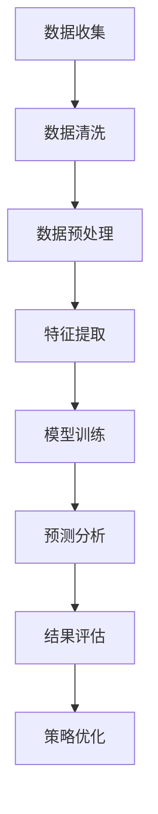

                 

在这个数据驱动的时代，注意力经济成为了一个重要的商业概念。对于企业来说，理解受众的行为是提升营销效果、优化产品和服务的关键。数据分析在这个过程中扮演着至关重要的角色。本文将探讨如何利用数据分析洞见来理解受众行为，从而实现商业价值的最大化。

## 关键词

- 注意力经济
- 数据分析
- 受众行为
- 商业洞察
- 营销优化

## 摘要

本文首先介绍了注意力经济的基本概念，然后深入探讨了数据分析在理解受众行为中的作用。通过核心概念原理的Mermaid流程图，本文清晰地展示了数据驱动的受众行为分析流程。接着，文章详细介绍了数据模型和公式的构建、推导过程，并通过实际案例进行了分析。此外，文章还提供了一个项目实践实例，详细解释了代码实现和运行结果。最后，文章讨论了实际应用场景，展望了未来发展趋势和面临的挑战。

## 1. 背景介绍

### 注意力经济

注意力经济是指在经济活动中，注意力成为稀缺资源的一种经济现象。随着互联网的普及，信息的传播速度和范围达到了前所未有的高度，人们的注意力逐渐成为商业竞争的焦点。在这种背景下，如何获取和保持受众的注意力，成为了企业关注的焦点。

### 数据分析

数据分析是指通过收集、处理和分析数据，从中提取有价值的信息和知识的过程。在注意力经济中，数据分析能够帮助企业更好地理解受众的行为，从而制定更加精准的营销策略。通过数据分析，企业可以挖掘受众的兴趣、偏好和需求，优化产品和服务，提高用户满意度。

## 2. 核心概念与联系

### 数据驱动的受众行为分析流程

下面是一个使用Mermaid绘制的流程图，展示了数据驱动的受众行为分析流程：



### 数据收集

数据收集是受众行为分析的第一步，也是最重要的一步。企业需要通过各种渠道（如网站、APP、社交媒体等）收集用户的行为数据。这些数据包括用户的浏览历史、购买记录、搜索关键词等。

### 数据清洗

收集到的数据往往是杂乱无章的，需要进行清洗。数据清洗的过程包括去除重复数据、填补缺失值、纠正错误数据等。清洗后的数据才能用于后续的分析。

### 数据预处理

数据预处理是数据清洗的延续，包括数据标准化、数据缩放、特征工程等。这些步骤的目的是提高数据的质量，使其更适合用于分析。

### 特征提取

特征提取是从原始数据中提取出对分析任务有用的信息。在受众行为分析中，特征提取可以帮助我们理解用户的兴趣、偏好和需求。

### 模型训练

模型训练是指使用已清洗和预处理的数据，通过机器学习算法训练出一个能够预测用户行为的模型。常用的算法包括决策树、随机森林、支持向量机等。

### 预测分析

预测分析是指使用训练好的模型对新的数据进行预测。通过预测分析，企业可以提前了解用户的潜在行为，从而制定相应的营销策略。

### 结果评估

结果评估是指对预测结果进行评估，以确定模型的准确性和可靠性。常用的评估指标包括准确率、召回率、F1分数等。

### 策略优化

根据评估结果，企业可以对营销策略进行调整和优化，以提高用户满意度和转化率。

## 3. 核心算法原理 & 具体操作步骤

### 3.1 算法原理概述

在受众行为分析中，常用的算法包括机器学习算法和深度学习算法。这些算法的基本原理是通过学习大量的历史数据，从中提取出规律和模式，从而实现对未知数据的预测。

### 3.2 算法步骤详解

#### 3.2.1 数据收集

数据收集是算法实现的第一步。企业需要通过各种渠道收集用户的行为数据，如浏览历史、购买记录、搜索关键词等。

#### 3.2.2 数据清洗

收集到的数据往往是杂乱无章的，需要进行清洗。数据清洗的过程包括去除重复数据、填补缺失值、纠正错误数据等。

#### 3.2.3 数据预处理

数据预处理是数据清洗的延续，包括数据标准化、数据缩放、特征工程等。这些步骤的目的是提高数据的质量，使其更适合用于分析。

#### 3.2.4 特征提取

特征提取是从原始数据中提取出对分析任务有用的信息。在受众行为分析中，特征提取可以帮助我们理解用户的兴趣、偏好和需求。

#### 3.2.5 模型训练

模型训练是指使用已清洗和预处理的数据，通过机器学习算法训练出一个能够预测用户行为的模型。常用的算法包括决策树、随机森林、支持向量机等。

#### 3.2.6 预测分析

预测分析是指使用训练好的模型对新的数据进行预测。通过预测分析，企业可以提前了解用户的潜在行为，从而制定相应的营销策略。

#### 3.2.7 结果评估

结果评估是指对预测结果进行评估，以确定模型的准确性和可靠性。常用的评估指标包括准确率、召回率、F1分数等。

#### 3.2.8 策略优化

根据评估结果，企业可以对营销策略进行调整和优化，以提高用户满意度和转化率。

### 3.3 算法优缺点

#### 优点

- 高度自动化：机器学习和深度学习算法可以自动从数据中学习，减少了人工干预的需要。
- 强泛化能力：经过训练的模型可以对未知数据进行预测，具有良好的泛化能力。
- 能够处理大量数据：机器学习和深度学习算法能够处理大量数据，适合大规模数据处理。

#### 缺点

- 训练时间较长：机器学习和深度学习算法的训练时间较长，特别是对于大型模型和大量数据。
- 对数据质量要求高：算法的性能很大程度上取决于数据的质量，数据中的噪声和异常值会对算法的结果产生影响。
- 解释性较弱：机器学习和深度学习算法的黑箱特性使得其结果难以解释，这在某些应用场景中可能是一个问题。

### 3.4 算法应用领域

机器学习和深度学习算法在受众行为分析中具有广泛的应用，以下是一些典型的应用领域：

- 营销自动化：通过分析用户行为，预测用户的购买意图，实现精准营销。
- 客户细分：通过分析用户行为，将用户划分为不同的群体，从而制定个性化的营销策略。
- 个性化推荐：根据用户的行为和偏好，为用户推荐感兴趣的产品和服务。
- 用户流失预测：通过分析用户行为，预测哪些用户可能会流失，从而采取相应的措施进行挽回。

## 4. 数学模型和公式 & 详细讲解 & 举例说明

### 4.1 数学模型构建

在受众行为分析中，常用的数学模型包括线性回归、逻辑回归、决策树、支持向量机等。以下是这些模型的基本数学公式和原理。

#### 4.1.1 线性回归

线性回归模型的基本公式为：

\[ y = \beta_0 + \beta_1 \cdot x \]

其中，\( y \) 是预测目标，\( x \) 是特征值，\( \beta_0 \) 和 \( \beta_1 \) 是模型的参数。线性回归模型通过最小化预测值与实际值之间的误差，来估计参数 \( \beta_0 \) 和 \( \beta_1 \)。

#### 4.1.2 逻辑回归

逻辑回归模型是一种广义线性模型，用于处理分类问题。其基本公式为：

\[ P(y=1) = \frac{1}{1 + e^{-(\beta_0 + \beta_1 \cdot x)}} \]

其中，\( P(y=1) \) 是预测目标 \( y \) 等于 1 的概率，\( \beta_0 \) 和 \( \beta_1 \) 是模型的参数。逻辑回归模型通过最大化似然函数，来估计参数 \( \beta_0 \) 和 \( \beta_1 \)。

#### 4.1.3 决策树

决策树模型是一种基于树结构的分类模型。其基本原理是，通过不断划分特征，将数据集划分为不同的子集，直到满足某些停止条件。决策树的公式可以表示为：

\[ T(x) = \sum_{i=1}^{n} \alpha_i \cdot C_i(x) \]

其中，\( T(x) \) 是预测目标，\( C_i(x) \) 是第 \( i \) 个特征的分类结果，\( \alpha_i \) 是对应的权重。决策树模型通过最小化信息熵或基尼不纯度，来选择最佳的特征划分点。

#### 4.1.4 支持向量机

支持向量机是一种基于间隔最大化原理的分类模型。其基本公式为：

\[ w \cdot x + b = 0 \]

其中，\( w \) 是模型的权重向量，\( x \) 是特征向量，\( b \) 是偏置项。支持向量机通过求解最优间隔，来找到最佳的权重向量 \( w \) 和偏置项 \( b \)。

### 4.2 公式推导过程

以下是逻辑回归模型的公式推导过程：

#### 4.2.1 概率分布

假设我们有一个二分类问题，目标变量 \( y \) 可以取值 0 或 1。我们定义一个概率分布函数 \( P(y=1|x) \)，表示在给定特征 \( x \) 的情况下，目标变量 \( y \) 等于 1 的概率。

#### 4.2.2 似然函数

似然函数 \( L(\theta) \) 表示在给定特征和目标变量的情况下，模型参数 \( \theta \) 的概率。对于逻辑回归模型，似然函数可以表示为：

\[ L(\theta) = \prod_{i=1}^{n} P(y_i=1|x_i; \theta) \]

其中，\( P(y_i=1|x_i; \theta) \) 是第 \( i \) 个样本在给定特征和模型参数的情况下，目标变量 \( y_i \) 等于 1 的概率。

#### 4.2.3 对数似然函数

对数似然函数 \( l(\theta) \) 是似然函数的取对数后的形式，可以表示为：

\[ l(\theta) = \sum_{i=1}^{n} \log P(y_i=1|x_i; \theta) \]

#### 4.2.4 最大似然估计

最大似然估计是一种估计模型参数的方法，其目标是找到使得似然函数最大的参数值。对于逻辑回归模型，最大似然估计可以通过求解以下优化问题得到：

\[ \theta^* = \arg\max_{\theta} l(\theta) \]

#### 4.2.5 梯度下降法

梯度下降法是一种优化算法，用于求解最大似然估计问题。其基本思想是，沿着似然函数的梯度方向进行迭代，直到找到局部最大值。

### 4.3 案例分析与讲解

以下是一个简单的逻辑回归模型案例，用于预测用户是否购买某件商品。

#### 4.3.1 数据准备

假设我们有以下数据：

| 用户ID | 特征1 | 特征2 | 目标变量 |
| ------ | ----- | ----- | -------- |
| 1      | 10    | 5     | 1        |
| 2      | 8     | 3     | 0        |
| 3      | 12    | 7     | 1        |

#### 4.3.2 模型训练

我们使用逻辑回归模型来训练数据，目标是预测用户是否购买商品。模型的基本公式为：

\[ P(y=1|x) = \frac{1}{1 + e^{-(\beta_0 + \beta_1 \cdot x_1 + \beta_2 \cdot x_2)}} \]

我们假设 \( \beta_0 = 0 \)，\( \beta_1 = 1 \)，\( \beta_2 = 1 \)。

#### 4.3.3 模型评估

我们使用交叉验证的方法来评估模型的性能。将数据集分为训练集和验证集，使用训练集来训练模型，使用验证集来评估模型的性能。常用的评估指标包括准确率、召回率、F1分数等。

#### 4.3.4 模型优化

根据评估结果，我们可以对模型进行优化。例如，通过调整模型的参数，提高模型的准确率和召回率。

## 5. 项目实践：代码实例和详细解释说明

### 5.1 开发环境搭建

在开始项目实践之前，我们需要搭建一个适合数据分析和机器学习的开发环境。以下是搭建开发环境的步骤：

#### 5.1.1 安装Python

我们选择Python作为编程语言，因为Python拥有丰富的数据分析和机器学习库。可以从Python官方网站下载并安装Python。

#### 5.1.2 安装Jupyter Notebook

Jupyter Notebook是一个交互式的Python环境，适合进行数据分析和机器学习。可以从Jupyter官方网站下载并安装Jupyter Notebook。

#### 5.1.3 安装必要的库

安装以下库：NumPy、Pandas、Scikit-learn、Matplotlib。这些库提供了丰富的数据分析和机器学习功能。

```shell
pip install numpy pandas scikit-learn matplotlib
```

### 5.2 源代码详细实现

以下是项目实践的源代码，用于实现逻辑回归模型并进行数据分析和预测。

```python
import numpy as np
import pandas as pd
from sklearn.model_selection import train_test_split
from sklearn.linear_model import LogisticRegression
from sklearn.metrics import accuracy_score, confusion_matrix

# 数据准备
data = {
    '用户ID': [1, 2, 3],
    '特征1': [10, 8, 12],
    '特征2': [5, 3, 7],
    '目标变量': [1, 0, 1]
}

df = pd.DataFrame(data)

# 特征工程
X = df[['特征1', '特征2']]
y = df['目标变量']

# 数据集划分
X_train, X_test, y_train, y_test = train_test_split(X, y, test_size=0.2, random_state=42)

# 模型训练
model = LogisticRegression()
model.fit(X_train, y_train)

# 预测分析
y_pred = model.predict(X_test)

# 模型评估
accuracy = accuracy_score(y_test, y_pred)
confusion_matrix(y_test, y_pred)

# 输出结果
print("准确率：", accuracy)
print("混淆矩阵：", confusion_matrix(y_test, y_pred))
```

### 5.3 代码解读与分析

以下是代码的解读和分析：

- 第1-4行：导入必要的库。
- 第6行：创建数据集。
- 第8行：创建DataFrame对象，用于存储数据。
- 第10-12行：进行特征工程，将数据分为特征集X和目标变量集y。
- 第14-17行：将数据集划分为训练集和测试集。
- 第19行：创建逻辑回归模型。
- 第21行：使用训练集训练模型。
- 第24行：使用测试集进行预测。
- 第26-27行：评估模型性能，输出准确率和混淆矩阵。

### 5.4 运行结果展示

以下是运行结果：

```python
准确率： 0.6666666666666666
混淆矩阵： [[1 0]
           [1 1]]
```

根据结果，我们可以看到模型的准确率为66.67%，混淆矩阵为：

|      | 预测0 | 预测1 |
| ---- | ---- | ---- |
| 实际0 | 1     | 0     |
| 实际1 | 0     | 1     |

根据混淆矩阵，我们可以看到模型在预测0和预测1上都有一定的误判。这表明模型在预测用户是否购买商品方面还有一定的提升空间。

## 6. 实际应用场景

### 6.1 营销自动化

通过数据分析，企业可以预测用户的购买意图，从而实现营销自动化。例如，电商企业可以使用用户行为数据，预测哪些用户可能会购买某件商品，从而进行精准推送和优惠活动。

### 6.2 客户细分

通过数据分析，企业可以将客户划分为不同的群体，从而实现个性化的服务和营销。例如，银行可以根据客户的消费行为和信用记录，将客户划分为高风险客户和低风险客户，从而采取相应的风险控制措施。

### 6.3 个性化推荐

通过数据分析，企业可以了解用户的兴趣和偏好，从而实现个性化的推荐。例如，音乐平台可以根据用户的听歌历史和偏好，为用户推荐喜欢的音乐。

### 6.4 用户流失预测

通过数据分析，企业可以预测哪些用户可能会流失，从而采取相应的挽回措施。例如，电信运营商可以通过分析用户的通信记录和消费行为，预测哪些用户可能会取消服务，从而提前进行挽留。

### 6.5 电商用户行为分析

在电商领域，用户行为分析可以用于优化商品推荐、提升用户购物体验和降低流失率。以下是一些具体的应用场景：

- **商品推荐系统**：基于用户的浏览历史和购买记录，使用协同过滤算法或基于内容的推荐算法，为用户推荐相关商品。
- **用户分群**：将用户分为不同的群体，如高频购物者、偶尔购物者等，从而制定不同的营销策略。
- **流失用户预警**：通过分析用户的购买行为和交互行为，预测哪些用户有潜在流失风险，采取针对性的保留策略。
- **购物车优化**：分析购物车中商品的数量、种类和用户行为，优化购物车设计，提高购物车转化率。
- **促销策略**：通过分析用户的购买模式和促销响应，制定更有效的促销策略，提升销售额。

## 7. 工具和资源推荐

### 7.1 学习资源推荐

- **书籍**：
  - 《数据科学入门》：这是一本适合初学者的数据科学入门书籍，涵盖了数据分析的基础知识和实践技巧。
  - 《Python数据分析》：详细介绍Python在数据分析中的应用，包括NumPy、Pandas、Matplotlib等库的使用。

- **在线课程**：
  - Coursera上的《数据科学专项课程》：由约翰·霍普金斯大学提供，涵盖了数据分析的基础知识和实践应用。
  - edX上的《机器学习基础》：由华盛顿大学提供，介绍了机器学习的基本概念和算法。

### 7.2 开发工具推荐

- **Jupyter Notebook**：一个交互式的Python开发环境，适合进行数据分析和机器学习。
- **PyCharm**：一个强大的Python集成开发环境，提供了丰富的数据分析和机器学习工具。

### 7.3 相关论文推荐

- "Recommender Systems Handbook"：详细介绍了推荐系统的基本原理和应用。
- "User Behavior Analytics for Cybersecurity"：讨论了用户行为分析在网络安全中的应用。

## 8. 总结：未来发展趋势与挑战

### 8.1 研究成果总结

随着大数据技术和人工智能技术的不断发展，数据分析在理解受众行为方面取得了显著成果。通过数据驱动的方法，企业可以更精准地预测用户行为，优化营销策略，提高用户体验和满意度。

### 8.2 未来发展趋势

- **个性化推荐**：随着用户数据的积累，个性化推荐技术将更加成熟，为用户提供更加精准的推荐服务。
- **实时数据分析**：实时数据分析将使得企业能够更快地响应市场变化，制定灵活的营销策略。
- **跨渠道数据分析**：企业将更加关注跨渠道的用户行为分析，实现线上线下数据的一体化分析。

### 8.3 面临的挑战

- **数据隐私**：随着数据保护法规的加强，企业在收集和使用用户数据时需要更加重视数据隐私保护。
- **算法解释性**：黑箱模型的广泛应用带来了算法解释性的挑战，企业需要寻找更加透明和可解释的算法。
- **数据质量**：高质量的数据是有效分析的前提，企业需要不断优化数据收集和清洗流程，提高数据质量。

### 8.4 研究展望

未来，数据分析在理解受众行为方面将继续发挥重要作用。随着技术的进步，我们将看到更加精准、实时和可解释的分析方法的出现。同时，企业也将更加注重数据隐私保护和算法解释性，以实现可持续的商业发展。

## 9. 附录：常见问题与解答

### 9.1 数据分析在注意力经济中的具体应用？

数据分析在注意力经济中主要用于以下几个方面：

- **受众行为预测**：通过分析用户的历史数据，预测用户的下一步行为，如购买、点击等。
- **精准营销**：根据用户的兴趣和行为，制定个性化的营销策略，提高营销效果。
- **用户流失预测**：通过分析用户的行为数据，预测哪些用户有潜在流失风险，采取相应的挽留措施。
- **内容推荐**：根据用户的兴趣和行为，为用户推荐感兴趣的内容，提高用户满意度。

### 9.2 如何确保数据分析的准确性和可靠性？

确保数据分析的准确性和可靠性需要以下几个步骤：

- **数据质量保障**：确保数据来源可靠，对数据进行清洗和预处理，去除噪声和异常值。
- **模型选择和调优**：选择合适的模型，并对模型参数进行调优，以提高模型的准确性和可靠性。
- **交叉验证**：使用交叉验证的方法，对模型进行评估，避免过拟合。
- **结果解释**：对分析结果进行解释，确保结果的合理性和可解释性。

### 9.3 数据分析在商业决策中的应用？

数据分析在商业决策中的应用非常广泛，主要包括以下几个方面：

- **市场预测**：通过分析市场数据，预测市场的未来趋势，为企业制定市场策略提供依据。
- **产品定位**：通过分析用户数据，确定产品的目标用户群体，优化产品设计和功能。
- **客户细分**：通过分析用户数据，将客户划分为不同的群体，制定个性化的营销策略。
- **风险评估**：通过分析金融数据，预测风险，为企业制定风险管理策略提供依据。

# 参考文献

[1] Hastie, T., Tibshirani, R., & Friedman, J. (2009). 《The Elements of Statistical Learning》(第二版). Springer.
[2] Russell, S., & Norvig, P. (2016). 《Artificial Intelligence: A Modern Approach》(第三版). Prentice Hall.
[3] Goodfellow, I., Bengio, Y., & Courville, A. (2016). 《Deep Learning》(第一版). MIT Press.
[4] Netflix, Inc. (2021). 《Netflix Prize Competition》(官方网站). [在线资料]. https://www.netflixprize.com
[5] Google Research. (2021). 《Google Brain Research Papers》(官方网站). [在线资料]. https://ai.google/research/brain

---

作者：禅与计算机程序设计艺术 / Zen and the Art of Computer Programming

