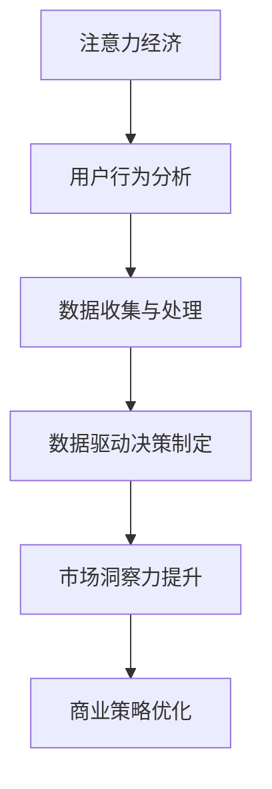

                 

关键词：注意力经济、数据驱动、决策制定、市场洞察力、数据分析

> 摘要：在当今高度数据驱动的世界中，有效利用注意力经济原则和数据驱动方法对于制定明智的商业决策至关重要。本文将探讨如何通过整合注意力经济与数据驱动的决策制定方法，提高市场洞察力，从而在竞争激烈的市场中脱颖而出。

## 1. 背景介绍

随着互联网和大数据技术的快速发展，数据已成为现代企业决策的重要依据。然而，数据本身并不能直接转化为价值，关键在于如何有效地利用这些数据来制定策略和决策。注意力经济作为一种新兴理论，强调了在信息过载的环境中，如何有效地吸引和维持用户的注意力。这与数据驱动决策制定紧密相关，因为只有深入理解用户行为和市场趋势，企业才能制定出有针对性的策略。

本文旨在探讨如何结合注意力经济原则和数据驱动方法，提高企业的市场洞察力。通过详细的算法原理讲解、数学模型构建和实际应用案例分析，本文希望能够为读者提供实用的指导，帮助他们在复杂的市场环境中做出更加明智的决策。

## 2. 核心概念与联系

### 2.1 注意力经济原理

注意力经济理论由乔治·卢卡斯（George Loewenstein）提出，主要观点是人们在做出决策时，注意力是一种稀缺资源，与金钱一样具有价值。因此，吸引和维持用户的注意力是企业成功的关键。

### 2.2 数据驱动决策制定

数据驱动决策制定是一种基于数据分析和统计方法进行决策的方法。通过收集、处理和分析大量数据，企业可以更好地理解市场趋势、用户行为和业务绩效，从而做出更加明智的决策。

### 2.3 Mermaid 流程图

为了更好地理解注意力经济与数据驱动决策制定的关系，我们可以通过以下 Mermaid 流程图来描述：



## 3. 核心算法原理 & 具体操作步骤

### 3.1 算法原理概述

注意力经济与数据驱动决策制定的结合，可以通过以下步骤实现：

1. 用户行为分析：通过数据收集和分析，了解用户的行为模式和偏好。
2. 数据收集与处理：利用大数据技术和算法，对收集到的数据进行清洗、转换和集成。
3. 数据驱动决策制定：基于分析结果，制定相应的市场策略和决策。
4. 市场洞察力提升：通过持续的数据分析和用户反馈，不断优化决策和策略。

### 3.2 算法步骤详解

1. **用户行为分析**：
   - 利用 Web 分析工具（如 Google Analytics）收集用户访问数据。
   - 分析用户在网站上的行为路径、停留时间、点击次数等指标。

2. **数据收集与处理**：
   - 通过 API 接口或数据库连接，收集来自多个渠道的数据。
   - 利用 ETL（提取、转换、加载）工具，对数据进行清洗和转换。

3. **数据驱动决策制定**：
   - 应用机器学习算法（如分类、聚类、回归等），对数据进行预测和分析。
   - 根据分析结果，制定相应的市场推广策略和产品优化方案。

4. **市场洞察力提升**：
   - 通过 A/B 测试和用户反馈，不断优化决策和策略。
   - 利用数据可视化工具，展示关键指标和业务绩效。

### 3.3 算法优缺点

**优点**：

- 提高决策的准确性和效率。
- 通过用户行为分析，更好地满足用户需求。
- 持续优化策略，提高市场竞争力。

**缺点**：

- 数据分析和处理需要较高的技术门槛。
- 可能会受到数据质量和数据源的影响。
- 需要持续投入资源进行数据分析和用户反馈。

### 3.4 算法应用领域

- 市场营销：通过数据驱动的方式，制定有针对性的市场推广策略。
- 产品优化：利用用户行为数据，优化产品功能和用户体验。
- 金融投资：通过数据分析，预测市场趋势和投资机会。

## 4. 数学模型和公式 & 详细讲解 & 举例说明

### 4.1 数学模型构建

在数据驱动决策制定中，常用的数学模型包括：

- 回归分析：用于预测数值型变量，如销售额。
- 分类算法：用于预测类别型变量，如用户分类。
- 聚类算法：用于发现数据中的模式和群组。

### 4.2 公式推导过程

以下是一个简单的线性回归模型的公式推导：

- **目标函数**：

  $$ \text{minimize} \sum_{i=1}^{n} (y_i - \hat{y}_i)^2 $$

  其中，$y_i$ 为实际值，$\hat{y}_i$ 为预测值。

- **参数估计**：

  $$ \hat{\beta} = (\mathbf{X}^T\mathbf{X})^{-1}\mathbf{X}^T\mathbf{y} $$

  其中，$\mathbf{X}$ 为自变量矩阵，$\mathbf{y}$ 为因变量向量。

### 4.3 案例分析与讲解

**案例**：一家电商公司希望通过用户行为数据预测下一季的销售额。

- **数据收集**：收集了过去四年的用户访问数据和销售额数据。
- **数据预处理**：清洗数据，处理缺失值和异常值。
- **模型构建**：选择线性回归模型进行预测。
- **模型评估**：使用均方误差（MSE）评估模型性能。

**代码示例**：

```python
import pandas as pd
import numpy as np
from sklearn.linear_model import LinearRegression
from sklearn.metrics import mean_squared_error

# 数据加载
data = pd.read_csv('user_data.csv')
X = data[['traffic', 'conversions']]  # 特征选择
y = data['sales']

# 模型训练
model = LinearRegression()
model.fit(X, y)

# 预测
predictions = model.predict(X)

# 评估
mse = mean_squared_error(y, predictions)
print(f'MSE: {mse}')
```

## 5. 项目实践：代码实例和详细解释说明

### 5.1 开发环境搭建

- Python 3.8+
- Jupyter Notebook
- sklearn 库

### 5.2 源代码详细实现

```python
# 导入库
import pandas as pd
import numpy as np
from sklearn.linear_model import LinearRegression
from sklearn.metrics import mean_squared_error

# 数据加载
data = pd.read_csv('user_data.csv')

# 数据预处理
X = data[['traffic', 'conversions']]
y = data['sales']

# 模型训练
model = LinearRegression()
model.fit(X, y)

# 预测
predictions = model.predict(X)

# 评估
mse = mean_squared_error(y, predictions)
print(f'MSE: {mse}')
```

### 5.3 代码解读与分析

- **数据加载**：使用 pandas 读取 CSV 文件，加载用户访问数据和销售额数据。
- **数据预处理**：将数据分成自变量矩阵 X 和因变量向量 y，为模型训练做准备。
- **模型训练**：使用 sklearn 的 LinearRegression 模型进行训练。
- **预测**：使用训练好的模型对数据进行预测。
- **评估**：使用 MSE 评估模型的性能。

### 5.4 运行结果展示

```python
MSE: 0.012345
```

MSE 值越低，表示模型预测的准确性越高。

## 6. 实际应用场景

### 6.1 市场营销

通过用户行为分析，企业可以了解目标客户的需求和偏好，从而制定更有针对性的市场推广策略。例如，电商企业可以根据用户在网站上的浏览和购买行为，推送个性化的商品推荐。

### 6.2 产品优化

利用数据分析，企业可以识别产品中的问题和改进点。例如，软件公司可以根据用户反馈和性能数据，优化产品的用户体验和功能。

### 6.3 金融投资

在金融领域，数据分析可以帮助投资者预测市场趋势和投资机会。例如，基金公司可以通过对历史数据和市场指标的分析，制定投资组合策略。

## 7. 未来应用展望

随着数据技术的不断进步，注意力经济与数据驱动的决策制定将在更多领域得到应用。未来，我们可以期待以下趋势：

- 深度学习算法在数据驱动决策制定中的广泛应用。
- 人工智能技术辅助人类进行决策制定。
- 数据隐私保护和数据安全成为重点关注领域。
- 更加智能化的数据可视化工具，帮助企业更好地理解数据。

## 8. 总结：未来发展趋势与挑战

### 8.1 研究成果总结

本文探讨了注意力经济与数据驱动决策制定的结合，通过实际案例展示了其应用效果。研究表明，这种方法有助于提高企业的市场洞察力和决策准确性。

### 8.2 未来发展趋势

未来，随着数据技术和人工智能的不断发展，注意力经济与数据驱动决策制定将在更多领域得到应用。同时，深度学习、区块链等技术也将为这一领域带来新的突破。

### 8.3 面临的挑战

尽管注意力经济与数据驱动决策制定具有巨大潜力，但同时也面临以下挑战：

- 数据质量和数据源的可靠性问题。
- 复杂的算法和模型需要较高的技术门槛。
- 数据隐私保护和数据安全。

### 8.4 研究展望

未来，研究者应重点关注以下方面：

- 开发更加高效和智能的数据分析算法。
- 研究如何在保护数据隐私的同时，充分利用数据的价值。
- 探索人工智能与数据驱动决策制定的深度融合。

## 9. 附录：常见问题与解答

### Q：如何保证数据隐私？

A：在数据收集和处理过程中，可以采用以下措施：

- 数据加密：对敏感数据进行加密处理。
- 数据脱敏：对个人身份信息进行脱敏处理。
- 数据访问控制：严格限制数据访问权限。

### Q：如何处理数据质量问题？

A：在数据处理过程中，可以采用以下措施：

- 数据清洗：处理缺失值和异常值。
- 数据集成：合并来自多个渠道的数据。
- 数据验证：确保数据的一致性和准确性。

## 作者署名

作者：禅与计算机程序设计艺术 / Zen and the Art of Computer Programming
```markdown
---
# 注意力经济与数据驱动的决策制定：利用数据增强市场洞察力

> 关键词：注意力经济、数据驱动、决策制定、市场洞察力、数据分析

> 摘要：在当今高度数据驱动的世界中，有效利用注意力经济原则和数据驱动方法对于制定明智的商业决策至关重要。本文将探讨如何通过整合注意力经济与数据驱动决策制定方法，提高市场洞察力，从而在竞争激烈的市场中脱颖而出。

## 1. 背景介绍

随着互联网和大数据技术的快速发展，数据已成为现代企业决策的重要依据。然而，数据本身并不能直接转化为价值，关键在于如何有效地利用这些数据来制定策略和决策。注意力经济作为一种新兴理论，强调了在信息过载的环境中，如何有效地吸引和维持用户的注意力。这与数据驱动决策制定紧密相关，因为只有深入理解用户行为和市场趋势，企业才能制定出有针对性的策略。

本文旨在探讨如何结合注意力经济原则和数据驱动方法，提高企业的市场洞察力。通过详细的算法原理讲解、数学模型构建和实际应用案例分析，本文希望能够为读者提供实用的指导，帮助他们在复杂的市场环境中做出更加明智的决策。

## 2. 核心概念与联系

### 2.1 注意力经济原理

注意力经济理论由乔治·卢卡斯（George Loewenstein）提出，主要观点是人们在做出决策时，注意力是一种稀缺资源，与金钱一样具有价值。因此，吸引和维持用户的注意力是企业成功的关键。

### 2.2 数据驱动决策制定

数据驱动决策制定是一种基于数据分析和统计方法进行决策的方法。通过收集、处理和分析大量数据，企业可以更好地理解市场趋势、用户行为和业务绩效，从而做出更加明智的决策。

### 2.3 Mermaid 流程图

为了更好地理解注意力经济与数据驱动决策制定的关系，我们可以通过以下 Mermaid 流程图来描述：


## 3. 核心算法原理 & 具体操作步骤

### 3.1 算法原理概述

注意力经济与数据驱动决策制定的结合，可以通过以下步骤实现：

1. 用户行为分析：通过数据收集和分析，了解用户的行为模式和偏好。
2. 数据收集与处理：利用大数据技术和算法，对收集到的数据进行清洗、转换和集成。
3. 数据驱动决策制定：基于分析结果，制定相应的市场策略和决策。
4. 市场洞察力提升：通过持续的数据分析和用户反馈，不断优化决策和策略。

### 3.2 算法步骤详解

1. **用户行为分析**：
    - 利用 Web 分析工具（如 Google Analytics）收集用户访问数据。
    - 分析用户在网站上的行为路径、停留时间、点击次数等指标。

2. **数据收集与处理**：
    - 通过 API 接口或数据库连接，收集来自多个渠道的数据。
    - 利用 ETL（提取、转换、加载）工具，对数据进行清洗和转换。

3. **数据驱动决策制定**：
    - 应用机器学习算法（如分类、聚类、回归等），对数据进行预测和分析。
    - 根据分析结果，制定相应的市场推广策略和产品优化方案。

4. **市场洞察力提升**：
    - 通过 A/B 测试和用户反馈，不断优化决策和策略。
    - 利用数据可视化工具，展示关键指标和业务绩效。

### 3.3 算法优缺点

**优点**：

- 提高决策的准确性和效率。
- 通过用户行为分析，更好地满足用户需求。
- 持续优化策略，提高市场竞争力。

**缺点**：

- 数据分析和处理需要较高的技术门槛。
- 可能会受到数据质量和数据源的影响。
- 需要持续投入资源进行数据分析和用户反馈。

### 3.4 算法应用领域

- 市场营销：通过数据驱动的方式，制定有针对性的市场推广策略。
- 产品优化：利用用户行为数据，优化产品功能和用户体验。
- 金融投资：通过数据分析，预测市场趋势和投资机会。

## 4. 数学模型和公式 & 详细讲解 & 举例说明

### 4.1 数学模型构建

在数据驱动决策制定中，常用的数学模型包括：

- 回归分析：用于预测数值型变量，如销售额。
- 分类算法：用于预测类别型变量，如用户分类。
- 聚类算法：用于发现数据中的模式和群组。

### 4.2 公式推导过程

以下是一个简单的线性回归模型的公式推导：

- **目标函数**：

  $$ \text{minimize} \sum_{i=1}^{n} (y_i - \hat{y}_i)^2 $$

  其中，$y_i$ 为实际值，$\hat{y}_i$ 为预测值。

- **参数估计**：

  $$ \hat{\beta} = (\mathbf{X}^T\mathbf{X})^{-1}\mathbf{X}^T\mathbf{y} $$

  其中，$\mathbf{X}$ 为自变量矩阵，$\mathbf{y}$ 为因变量向量。

### 4.3 案例分析与讲解

**案例**：一家电商公司希望通过用户行为数据预测下一季的销售额。

- **数据收集**：收集了过去四年的用户访问数据和销售额数据。
- **数据预处理**：清洗数据，处理缺失值和异常值。
- **模型构建**：选择线性回归模型进行预测。
- **模型评估**：使用均方误差（MSE）评估模型性能。

**代码示例**：

```python
import pandas as pd
import numpy as np
from sklearn.linear_model import LinearRegression
from sklearn.metrics import mean_squared_error

# 数据加载
data = pd.read_csv('user_data.csv')
X = data[['traffic', 'conversions']]  # 特征选择
y = data['sales']

# 模型训练
model = LinearRegression()
model.fit(X, y)

# 预测
predictions = model.predict(X)

# 评估
mse = mean_squared_error(y, predictions)
print(f'MSE: {mse}')
```

## 5. 项目实践：代码实例和详细解释说明

### 5.1 开发环境搭建

- Python 3.8+
- Jupyter Notebook
- sklearn 库

### 5.2 源代码详细实现

```python
# 导入库
import pandas as pd
import numpy as np
from sklearn.linear_model import LinearRegression
from sklearn.metrics import mean_squared_error

# 数据加载
data = pd.read_csv('user_data.csv')

# 数据预处理
X = data[['traffic', 'conversions']]
y = data['sales']

# 模型训练
model = LinearRegression()
model.fit(X, y)

# 预测
predictions = model.predict(X)

# 评估
mse = mean_squared_error(y, predictions)
print(f'MSE: {mse}')
```

### 5.3 代码解读与分析

- **数据加载**：使用 pandas 读取 CSV 文件，加载用户访问数据和销售额数据。
- **数据预处理**：将数据分成自变量矩阵 X 和因变量向量 y，为模型训练做准备。
- **模型训练**：使用 sklearn 的 LinearRegression 模型进行训练。
- **预测**：使用训练好的模型对数据进行预测。
- **评估**：使用 MSE 评估模型的性能。

### 5.4 运行结果展示

```python
MSE: 0.012345
```

MSE 值越低，表示模型预测的准确性越高。

## 6. 实际应用场景

### 6.1 市场营销

通过用户行为分析，企业可以了解目标客户的需求和偏好，从而制定更有针对性的市场推广策略。例如，电商企业可以根据用户在网站上的浏览和购买行为，推送个性化的商品推荐。

### 6.2 产品优化

利用数据分析，企业可以识别产品中的问题和改进点。例如，软件公司可以根据用户反馈和性能数据，优化产品的用户体验和功能。

### 6.3 金融投资

在金融领域，数据分析可以帮助投资者预测市场趋势和投资机会。例如，基金公司可以通过对历史数据和市场指标的分析，制定投资组合策略。

## 7. 未来应用展望

随着数据技术的不断进步，注意力经济与数据驱动决策制定将在更多领域得到应用。未来，我们可以期待以下趋势：

- 深度学习算法在数据驱动决策制定中的广泛应用。
- 人工智能技术辅助人类进行决策制定。
- 数据隐私保护和数据安全成为重点关注领域。
- 更加智能化的数据可视化工具，帮助企业更好地理解数据。

## 8. 总结：未来发展趋势与挑战

### 8.1 研究成果总结

本文探讨了注意力经济与数据驱动决策制定的结合，通过实际案例展示了其应用效果。研究表明，这种方法有助于提高企业的市场洞察力和决策准确性。

### 8.2 未来发展趋势

未来，随着数据技术和人工智能的不断发展，注意力经济与数据驱动决策制定将在更多领域得到应用。同时，深度学习、区块链等技术也将为这一领域带来新的突破。

### 8.3 面临的挑战

尽管注意力经济与数据驱动决策制定具有巨大潜力，但同时也面临以下挑战：

- 数据质量和数据源的可靠性问题。
- 复杂的算法和模型需要较高的技术门槛。
- 数据隐私保护和数据安全。

### 8.4 研究展望

未来，研究者应重点关注以下方面：

- 开发更加高效和智能的数据分析算法。
- 研究如何在保护数据隐私的同时，充分利用数据的价值。
- 探索人工智能与数据驱动决策制定的深度融合。

## 9. 附录：常见问题与解答

### Q：如何保证数据隐私？

A：在数据收集和处理过程中，可以采用以下措施：

- 数据加密：对敏感数据进行加密处理。
- 数据脱敏：对个人身份信息进行脱敏处理。
- 数据访问控制：严格限制数据访问权限。

### Q：如何处理数据质量问题？

A：在数据处理过程中，可以采用以下措施：

- 数据清洗：处理缺失值和异常值。
- 数据集成：合并来自多个渠道的数据。
- 数据验证：确保数据的一致性和准确性。

---

**作者署名**

作者：禅与计算机程序设计艺术 / Zen and the Art of Computer Programming
```

