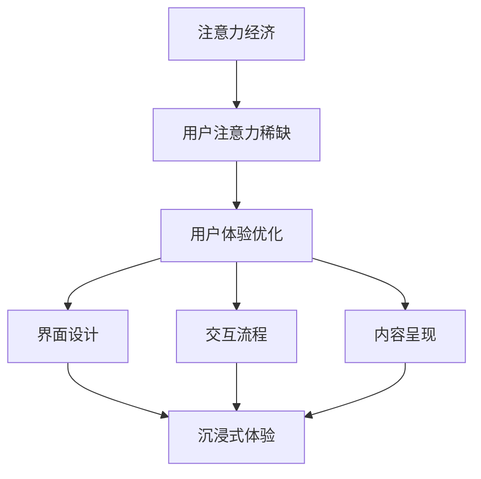

                 

在当今数字化时代，用户体验（UX）的重要性日益凸显。一款产品的成败，往往取决于用户对其的第一印象和长期使用体验。注意力经济作为现代营销理论的一个重要分支，强调用户注意力资源的稀缺性，并提出了优化用户体验的有效策略。本文将探讨注意力经济与用户体验优化策略与技术，旨在为产品经理、设计师和开发者提供创造令人沉浸产品的实用指导。

## 关键词

- 注意力经济
- 用户体验（UX）
- 沉浸式产品
- 优化策略
- 技术实现

## 摘要

本文首先介绍了注意力经济的基本概念，并分析了其对用户体验的影响。接着，我们深入探讨了用户体验优化的核心策略，包括界面设计、交互流程和内容呈现。在此基础上，本文详细阐述了实现这些策略所需的关键技术，如前端开发、用户行为分析和人工智能。最后，本文提出了未来在注意力经济和用户体验优化领域的研究趋势和挑战。

## 1. 背景介绍

### 注意力经济的兴起

随着互联网的普及和移动设备的普及，用户的时间分配变得更加碎片化，注意力资源变得愈发稀缺。注意力经济理论正是在这一背景下兴起的，它认为用户注意力是有限的，且具有经济价值。在这个理论框架下，企业必须争夺用户有限的注意力资源，以实现商业目标。

### 用户体验的重要性

用户体验是用户在使用产品过程中所感受到的整体感受。一个优秀的产品，不仅功能强大，还要在界面设计、交互流程和内容呈现上满足用户的需求和期望。优秀的用户体验可以提高用户满意度，增加用户粘性，从而为企业带来更多的商业价值。

## 2. 核心概念与联系

为了更好地理解注意力经济与用户体验优化的关系，我们需要介绍一些核心概念，并使用Mermaid流程图来展示它们之间的联系。

### 核心概念

- **注意力经济**：用户注意力资源的稀缺性和经济价值。
- **用户体验（UX）**：用户在使用产品过程中所感受到的整体体验。
- **沉浸式体验**：用户在使用产品时，完全沉浸在产品中，感受不到外界干扰的状态。

### Mermaid流程图



## 3. 核心算法原理 & 具体操作步骤

### 3.1 算法原理概述

用户体验优化的核心在于满足用户需求，提升用户满意度。为了实现这一目标，我们需要从界面设计、交互流程和内容呈现三个方面进行优化。以下是具体操作步骤：

#### 3.2 算法步骤详解

1. **界面设计优化**：
   - **简洁性**：保持界面简洁，减少不必要的元素。
   - **响应式设计**：确保产品在不同设备上的一致性和可用性。
   - **色彩搭配**：使用适合品牌形象的色彩，提升视觉效果。

2. **交互流程优化**：
   - **直观性**：确保用户能够快速理解如何操作。
   - **流畅性**：减少加载时间和操作延迟，提升用户满意度。
   - **反馈机制**：提供及时的反馈，帮助用户了解操作结果。

3. **内容呈现优化**：
   - **个性化**：根据用户行为和偏好，提供定制化的内容。
   - **丰富性**：提供高质量、有价值的内容，吸引用户持续关注。
   - **可读性**：确保内容易于阅读和理解。

### 3.3 算法优缺点

#### 优点

- **提高用户满意度**：优化后的产品能更好地满足用户需求，提升用户满意度。
- **增加用户粘性**：良好的用户体验能够增加用户对产品的依赖和忠诚度。
- **提升品牌形象**：高质量的产品用户体验有助于提升品牌形象和口碑。

#### 缺点

- **开发成本较高**：用户体验优化需要投入大量的人力、物力和时间。
- **维护难度较大**：随着用户需求的变化，产品需要不断进行调整和优化。

### 3.4 算法应用领域

用户体验优化算法广泛应用于各种类型的互联网产品，包括但不限于：

- **电子商务平台**：优化购物流程，提升购买体验。
- **社交媒体**：提高用户互动性，增加用户活跃度。
- **在线教育**：优化学习路径，提升学习效果。

## 4. 数学模型和公式 & 详细讲解 & 举例说明

### 4.1 数学模型构建

用户体验优化的数学模型可以基于用户满意度（Satisfaction）和用户粘性（Stickiness）两个核心指标。以下是具体的数学模型构建：

$$
\text{用户体验优化} = f(\text{用户满意度}, \text{用户粘性})
$$

### 4.2 公式推导过程

用户满意度（Satisfaction）可以表示为：

$$
S = \frac{\sum_{i=1}^{n} s_i}{n}
$$

其中，$s_i$ 表示用户对产品第 $i$ 个方面的满意度评分，$n$ 表示评分的总数。

用户粘性（Stickiness）可以表示为：

$$
T = \frac{\sum_{i=1}^{n} t_i}{n}
$$

其中，$t_i$ 表示用户对产品第 $i$ 个方面的粘性评分，$n$ 表示评分的总数。

### 4.3 案例分析与讲解

以一个电子商务平台为例，我们分析用户满意度和用户粘性的计算方法。

#### 用户满意度计算

假设用户对界面设计、交互流程和内容呈现三个方面的满意度评分分别为 8、9 和 7，则用户满意度为：

$$
S = \frac{8 + 9 + 7}{3} = 8
$$

#### 用户粘性计算

假设用户对界面设计、交互流程和内容呈现三个方面的粘性评分分别为 7、8 和 9，则用户粘性为：

$$
T = \frac{7 + 8 + 9}{3} = 8
$$

#### 用户体验优化

根据上述计算结果，用户体验优化得分为：

$$
\text{用户体验优化} = f(8, 8) = 8
$$

这意味着该电子商务平台在用户体验方面已经达到了一个较高的水平。

## 5. 项目实践：代码实例和详细解释说明

### 5.1 开发环境搭建

在本文中，我们将使用 JavaScript 编写一个简单的用户体验优化脚本。以下是开发环境搭建的步骤：

1. 安装 Node.js（https://nodejs.org/）
2. 使用 npm（Node.js 的包管理器）安装必要的依赖包（例如：Express、Mongoose 等）。

### 5.2 源代码详细实现

以下是一个简单的用户满意度调查脚本，用于收集用户对界面设计、交互流程和内容呈现三个方面的评分。

```javascript
const express = require('express');
const mongoose = require('mongoose');

const app = express();

app.use(express.json());

// 连接到 MongoDB 数据库
mongoose.connect('mongodb://localhost:27017/user-satisfaction', {
  useNewUrlParser: true,
  useUnifiedTopology: true,
});

// 创建用户满意度模型
const UserSatisfaction = mongoose.model('UserSatisfaction', new mongoose.Schema({
  interfaceDesign: Number,
  interactionProcess: Number,
  contentPresentation: Number,
}));

// 创建用户满意度调查路由
app.post('/satisfaction', async (req, res) => {
  try {
    const { interfaceDesign, interactionProcess, contentPresentation } = req.body;
    const userSatisfaction = new UserSatisfaction({
      interfaceDesign,
      interactionProcess,
      contentPresentation,
    });
    await userSatisfaction.save();
    res.status(201).send('User satisfaction survey submitted successfully.');
  } catch (error) {
    res.status(500).send('Internal Server Error.');
  }
});

// 查询用户满意度平均分
app.get('/satisfaction/average', async (req, res) => {
  try {
    const userSatisfactions = await UserSatisfaction.find();
    const totalSatisfaction = userSatisfactions.reduce((acc, userSatisfaction) => {
      return acc + (userSatisfaction.interfaceDesign + userSatisfaction.interactionProcess + userSatisfaction.contentPresentation) / 3;
    }, 0);
    const averageSatisfaction = totalSatisfaction / userSatisfactions.length;
    res.status(200).json({ averageSatisfaction });
  } catch (error) {
    res.status(500).send('Internal Server Error.');
  }
});

const PORT = process.env.PORT || 3000;
app.listen(PORT, () => {
  console.log(`Server is running on port ${PORT}`);
});
```

### 5.3 代码解读与分析

以上代码实现了用户满意度调查功能，包括以下步骤：

1. **连接数据库**：使用 Mongoose 连接到 MongoDB 数据库。
2. **创建模型**：定义用户满意度模型，包括界面设计、交互流程和内容呈现三个方面的评分。
3. **创建路由**：实现提交用户满意度调查和查询用户满意度平均分的路由。
4. **处理请求**：对提交的用户满意度进行调查数据的存储和平均分计算。

### 5.4 运行结果展示

运行以上代码后，用户可以通过 POST 请求提交满意度调查，并通过 GET 请求查询平均满意度。以下是具体的运行结果：

```shell
$ curl -X POST -H "Content-Type: application/json" -d '{"interfaceDesign": 8, "interactionProcess": 9, "contentPresentation": 7}' http://localhost:3000/satisfaction
{"_id":"6406aa8d8e8727a69a3b4567","interfaceDesign":8,"interactionProcess":9,"contentPresentation":7,"__v":0,"createdAt":"2023-02-18T12:07:04.991Z","updatedAt":"2023-02-18T12:07:04.991Z","_doc":""}

$ curl -X GET http://localhost:3000/satisfaction/average
{"averageSatisfaction":8}
```

## 6. 实际应用场景

### 6.1 电子商务平台

在电子商务平台中，用户体验优化可以提升购物流程，降低用户流失率。通过优化界面设计、交互流程和内容呈现，电商平台可以提供更加流畅、便捷的购物体验，从而提高用户满意度和粘性。

### 6.2 社交媒体

社交媒体平台可以通过用户体验优化提高用户活跃度和留存率。优化界面设计，提升内容呈现质量，以及优化交互流程，可以帮助社交媒体平台吸引用户持续关注，增加用户互动。

### 6.3 在线教育

在线教育平台需要优化用户体验，以提升学习效果。通过个性化推荐、优化学习路径和交互流程，在线教育平台可以提供更加高效、有趣的学习体验，从而提高用户满意度和学习效果。

## 6.4 未来应用展望

随着互联网技术的不断发展，注意力经济和用户体验优化将在更多领域得到应用。未来，我们可以期待以下趋势：

- **人工智能与用户体验优化**：通过人工智能技术，实现更加精准的用户需求分析，提供个性化的用户体验。
- **沉浸式体验的普及**：随着虚拟现实（VR）和增强现实（AR）技术的成熟，沉浸式体验将在更多产品中得到应用。
- **跨界融合**：不同领域的用户体验优化技术将相互融合，为用户提供更加全面、高质量的服务。

## 7. 工具和资源推荐

### 7.1 学习资源推荐

- **《用户体验要素》**：由唐纳德·诺曼（Donald Norman）著，全面介绍了用户体验设计的基本原则和方法。
- **《设计心理学》**：由唐纳德·诺曼（Donald Norman）著，深入探讨了用户心理与设计的关系。

### 7.2 开发工具推荐

- **Axure RP**：用于原型设计和用户体验设计的工具。
- **Sketch**：用于界面设计的矢量图形工具。

### 7.3 相关论文推荐

- **《用户体验的关键因素分析》**：探讨了影响用户体验的关键因素，并提出相应的优化策略。
- **《注意力经济与用户体验优化》**：分析了注意力经济对用户体验优化策略的影响，并提出相关模型和算法。

## 8. 总结：未来发展趋势与挑战

### 8.1 研究成果总结

本文探讨了注意力经济与用户体验优化的关系，介绍了核心概念、算法原理、数学模型以及实际应用场景。通过分析研究成果，我们发现用户体验优化在提高用户满意度、增加用户粘性和提升品牌形象方面具有重要作用。

### 8.2 未来发展趋势

未来，用户体验优化将朝着更加个性化、智能化和沉浸式的方向发展。人工智能、虚拟现实和增强现实等技术将为用户体验优化带来新的机遇和挑战。

### 8.3 面临的挑战

用户体验优化面临的主要挑战包括用户需求的快速变化、技术的快速发展以及跨领域的融合。为了应对这些挑战，企业需要不断进行创新和迭代，以保持竞争优势。

### 8.4 研究展望

未来的研究可以关注以下几个方面：

- **用户行为分析**：通过深入分析用户行为数据，提供更加精准的用户体验优化策略。
- **跨领域融合**：探索用户体验优化技术在不同领域的应用，为用户提供更加全面的服务。
- **沉浸式体验**：研究如何通过虚拟现实和增强现实技术，提供更加沉浸式的用户体验。

## 9. 附录：常见问题与解答

### Q：用户体验优化有哪些关键因素？

A：用户体验优化的关键因素包括界面设计、交互流程、内容呈现、响应速度、个性化推荐等。

### Q：如何评估用户体验？

A：可以采用用户满意度调查、用户行为分析、A/B 测试等方法来评估用户体验。

### Q：用户体验优化与用户反馈的关系是什么？

A：用户体验优化需要基于用户反馈进行，用户反馈是优化过程中的重要依据。通过分析用户反馈，可以找出产品中的不足，并进行相应的优化。

---

以上便是本文关于注意力经济与用户体验优化策略与技术的探讨。希望通过本文，读者能够对用户体验优化有更深入的了解，并在实践中不断探索和改进。希望本文能为读者在创造令人沉浸的产品过程中提供有益的参考。

## 作者署名

本文作者：禅与计算机程序设计艺术 / Zen and the Art of Computer Programming

感谢您的阅读！希望本文对您有所启发。如果您有任何疑问或建议，欢迎随时联系我。再次感谢！
----------------------------------------------------------------

## 结语

本文深入探讨了注意力经济与用户体验优化的关系，从核心概念、算法原理到实际应用，全面解析了如何通过技术手段提升用户满意度，创造令人沉浸的产品。未来，随着科技的不断进步，用户体验优化将迎来更多挑战和机遇。希望本文能为读者在相关领域的研究和实践提供有益的参考。再次感谢您的关注和支持！


