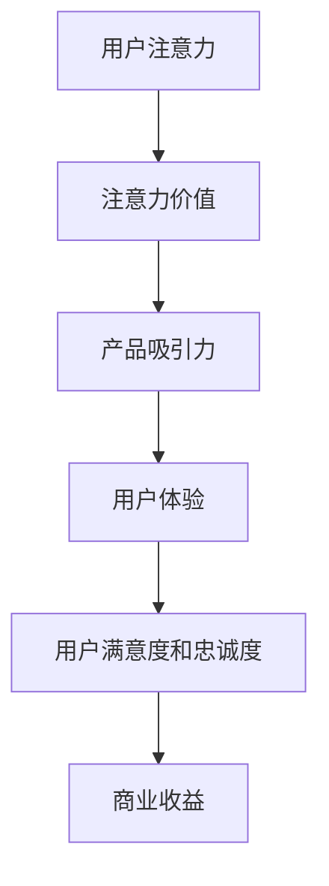

                 

注意力经济与用户体验优化是当今数字时代产品设计和开发的核心理念。在这个高度竞争的市场中，如何在用户有限的时间和注意力资源中脱颖而出，已经成为企业和开发者面临的最大挑战。本文将深入探讨注意力经济的本质、用户体验优化的关键要素，以及如何通过巧妙的设计和实现创建令人沉浸和上瘾的产品和服务。

## 文章关键词

- 注意力经济
- 用户体验
- 沉浸感
- 上瘾性
- 产品设计
- 优化策略

## 文章摘要

本文首先回顾了注意力经济的起源和核心概念，接着分析了用户体验优化的各个方面，包括界面设计、交互逻辑、内容创造等。随后，通过一个Mermaid流程图详细展示了注意力驱动用户体验优化的架构。文章随后深入讨论了核心算法原理及其操作步骤，包括算法的优缺点和应用领域。接着，引入了数学模型和公式，并通过案例分析和详细讲解使其更加易懂。文章接着展示了代码实例和详细解释，最后探讨了实际应用场景，推荐了相关工具和资源，并总结了未来发展趋势与挑战。

### 1. 背景介绍

在互联网和移动设备普及的今天，用户的时间和经济资源变得越来越有限。这意味着企业和开发者必须在竞争激烈的市场中找到有效的方法来吸引和保留用户。注意力经济便是这样一个概念，它源于对用户注意力资源稀缺性的认识。这个理论强调，用户在决定使用哪个产品或服务时，往往会考虑到其注意力投入的性价比。因此，提高产品的注意力价值成为了一项关键任务。

注意力经济的核心在于如何通过设计提高产品的吸引力，让用户在有限的时间里愿意投入注意力。这不仅涉及到界面和内容的吸引力，还涉及到用户的参与度和沉浸感。用户体验优化（UX Optimization）正是为了满足这一需求而出现的一门学科。用户体验优化的目标是通过改进产品的设计和功能，使用户在使用过程中获得愉悦和满足，从而提升用户满意度和忠诚度。

用户体验优化的关键要素包括：

1. **界面设计**：直观、简洁且美观的界面能够迅速吸引用户。
2. **交互逻辑**：清晰的导航、流畅的动画和反馈可以提升用户的操作体验。
3. **内容创造**：有价值、有趣且不断更新的内容能够增强用户的粘性。
4. **个性化**：根据用户行为和偏好提供个性化的内容和推荐。

随着注意力经济的兴起，用户体验优化的重要性日益凸显。一个优秀的用户体验能够帮助产品在激烈的市场竞争中脱颖而出，从而获得更高的市场份额和用户忠诚度。

### 2. 核心概念与联系

在深入探讨注意力经济与用户体验优化之前，我们首先需要理解这两个核心概念，并揭示它们之间的联系。

#### 注意力经济

注意力经济源于对用户注意力资源稀缺性的认识。在信息爆炸的时代，用户每天面临着海量的信息和选择，因此他们的注意力资源变得极其宝贵。注意力经济的本质在于如何通过吸引和维持用户的注意力，从而创造商业价值。

**定义**：注意力经济是指通过提供有价值的信息、娱乐或服务来吸引并维持用户的注意力，进而实现商业收益的一种经济模式。

**关键点**：

- **注意力稀缺性**：用户的时间和注意力是有限的，他们往往倾向于将注意力投入到价值更高的产品或服务中。
- **注意力价值**：产品的注意力价值取决于其内容、设计、功能和用户体验的综合质量。
- **注意力转移**：在竞争激烈的市场中，用户很容易被其他产品吸引，因此保持用户的注意力是一项持续的任务。

#### 用户体验优化

用户体验优化（UX Optimization）是一种系统性的方法，旨在通过改进产品的设计和功能，提升用户的整体体验。UX优化的核心在于满足用户的需求和期望，使用户在使用产品时感到愉悦和满足。

**定义**：用户体验优化是指通过对产品界面、交互逻辑、内容和个性化等方面的持续改进，提升用户的操作体验和满意度。

**关键点**：

- **用户需求**：了解并满足用户的需求是UX优化的基础。
- **体验质量**：包括界面设计、交互逻辑、性能、内容和个性化等各个方面。
- **持续改进**：UX优化是一个不断迭代的过程，需要根据用户反馈和市场变化进行调整。

#### 核心概念与联系

注意力经济与用户体验优化之间的联系在于，用户体验优化是实现注意力经济目标的关键手段。以下是一个用Mermaid绘制的流程图，展示了注意力驱动用户体验优化的架构：



- **用户注意力**：用户的时间和注意力是有限的，他们倾向于投入到价值更高的产品或服务中。
- **注意力价值**：通过提供有价值的信息、娱乐或服务，产品能够吸引并维持用户的注意力。
- **产品吸引力**：产品的吸引力取决于其内容和设计，以及能否提供独特的价值和体验。
- **用户体验**：用户体验优化的目标是提升用户的整体体验，使其在使用产品时感到愉悦和满足。
- **用户满意度和忠诚度**：良好的用户体验能够提升用户的满意度和忠诚度，从而带来长期的商业收益。

通过这一流程图，我们可以清晰地看到注意力经济和用户体验优化之间的相互作用和反馈循环。只有通过不断地优化用户体验，产品才能在注意力经济中获得成功。

### 3. 核心算法原理 & 具体操作步骤

#### 3.1 算法原理概述

在注意力经济与用户体验优化的背景下，核心算法的原理在于如何通过系统化的方法提高产品的吸引力，进而增强用户体验。这一算法的核心思想可以概括为以下几点：

- **用户行为分析**：通过对用户行为的分析，了解用户的兴趣、偏好和行为模式，从而为个性化推荐和体验优化提供依据。
- **内容个性化**：根据用户行为数据，动态调整产品内容，提供个性化的推荐和体验，提高用户的参与度和满意度。
- **实时反馈机制**：通过实时收集用户反馈，不断调整产品设计和功能，使其更符合用户需求，提高用户体验。
- **沉浸感设计**：利用先进的交互设计和多媒体技术，创造沉浸式的用户体验，增强用户的沉浸感和粘性。

#### 3.2 算法步骤详解

**步骤1：用户行为分析**

- **数据收集**：通过用户交互数据、浏览行为、购买记录等，收集用户的基础信息。
- **行为模式识别**：使用数据挖掘和机器学习算法，分析用户的兴趣和行为模式。
- **特征提取**：提取用户行为的关键特征，如浏览时长、点击率、购买频率等。

**步骤2：内容个性化**

- **内容推荐**：根据用户的行为特征，推荐与其兴趣相符的内容和服务。
- **动态调整**：实时监控用户行为，动态调整内容推荐和页面布局，提高用户的参与度。
- **个性化广告**：根据用户兴趣和行为，展示个性化的广告和促销信息。

**步骤3：实时反馈机制**

- **用户反馈收集**：通过问卷调查、点击反馈、满意度评分等方式，收集用户的反馈。
- **反馈分析**：分析用户反馈，识别产品设计和功能的改进点。
- **迭代优化**：根据用户反馈，迭代优化产品设计和功能，提升用户体验。

**步骤4：沉浸感设计**

- **交互设计**：设计直观、流畅且响应快速的交互界面，提高用户的操作体验。
- **多媒体技术**：运用音频、视频、动画等多媒体技术，增强用户的沉浸感和粘性。
- **情境感知**：根据用户的情境和行为，动态调整产品的界面和功能，提供个性化的用户体验。

#### 3.3 算法优缺点

**优点**：

- **提高用户参与度**：通过个性化推荐和沉浸感设计，提高用户的参与度和满意度。
- **提升用户体验**：通过实时反馈和迭代优化，使产品更符合用户需求，提升用户体验。
- **增强产品竞争力**：在竞争激烈的市场中，通过提供独特的用户体验，增强产品的竞争力。

**缺点**：

- **数据隐私问题**：用户行为数据的使用可能引发隐私问题，需要严格遵守相关法律法规。
- **算法偏差**：算法推荐可能存在偏见，需要不断优化和调整，确保公平性和准确性。
- **计算成本**：个性化推荐和实时反馈机制需要大量的计算资源，可能增加产品开发和维护成本。

#### 3.4 算法应用领域

- **电子商务**：通过个性化推荐和沉浸感设计，提升用户的购物体验和购买转化率。
- **社交媒体**：通过用户行为分析，提供个性化的内容和推荐，提高用户的粘性和活跃度。
- **在线教育**：通过个性化学习路径推荐，提高学生的学习效果和参与度。
- **游戏行业**：通过沉浸感设计和实时反馈机制，提供丰富的游戏体验，增强用户的游戏粘性。

### 4. 数学模型和公式 & 详细讲解 & 举例说明

在深入探讨注意力经济和用户体验优化的核心算法时，引入数学模型和公式是理解和应用这些算法的关键。以下将详细介绍数学模型构建、公式推导过程以及通过具体案例进行分析和讲解。

#### 4.1 数学模型构建

在注意力经济与用户体验优化的背景下，构建一个能够反映用户行为和产品吸引力之间关系的数学模型至关重要。以下是一个简化的数学模型，用于描述用户注意力与产品吸引力之间的关系：

\[ A = f(U, C) \]

其中，\( A \) 表示用户注意力，\( U \) 表示用户特征，\( C \) 表示产品特征。

**用户特征**：

- \( U_i \)：用户兴趣向量，表示用户对不同类型内容的偏好。
- \( U_r \)：用户行为记录，如点击率、浏览时长等。

**产品特征**：

- \( C_j \)：产品内容向量，表示产品提供的各类内容。
- \( C_q \)：产品质量向量，包括界面设计、交互逻辑、内容丰富度等。

**函数 \( f \)**：

- \( f(U, C) \)：一个复合函数，用于计算用户注意力与产品吸引力之间的相关性。

为了简化模型，我们可以将其具体化为以下形式：

\[ A = \alpha \cdot \text{similarity}(U_i, C_j) + \beta \cdot \text{quality}(C_q) \]

其中，\( \alpha \) 和 \( \beta \) 是权重系数，用于调节用户兴趣与产品内容相似性和产品质量对用户注意力的贡献程度。

#### 4.2 公式推导过程

**相似度计算**：

用户兴趣与产品内容之间的相似度可以使用余弦相似度来计算：

\[ \text{similarity}(U_i, C_j) = \frac{U_i \cdot C_j}{\|U_i\| \|C_j\|} \]

其中，\( U_i \cdot C_j \) 表示用户兴趣向量与产品内容向量之间的点积，\(\|U_i\|\) 和 \(\|C_j\|\) 分别表示两个向量的欧几里得范数。

**质量评估**：

产品内容质量可以采用多维度的评分系统，如界面设计得分、交互流畅度得分、内容丰富度得分等，然后通过加权平均计算总质量评分：

\[ \text{quality}(C_q) = w_1 \cdot D_{\text{design}} + w_2 \cdot D_{\text{interact}} + w_3 \cdot D_{\text{content}} \]

其中，\( D_{\text{design}} \)、\( D_{\text{interact}} \) 和 \( D_{\text{content}} \) 分别表示界面设计得分、交互流畅度得分和内容丰富度得分，\( w_1 \)、\( w_2 \) 和 \( w_3 \) 是相应的权重系数。

综合上述两个部分，我们可以将注意力公式进一步简化为：

\[ A = \alpha \cdot \text{similarity}(U_i, C_j) + \beta \cdot (w_1 \cdot D_{\text{design}} + w_2 \cdot D_{\text{interact}} + w_3 \cdot D_{\text{content}}) \]

#### 4.3 案例分析与讲解

假设我们有一个电子商务平台，需要根据用户的行为和偏好推荐产品。以下是具体案例的详细分析：

**用户特征**：

- \( U_i = (0.5, 0.3, 0.2) \)：用户对电子产品、服装和家居用品的偏好分别为50%、30%和20%。
- \( U_r = (10, 5, 3) \)：用户在电子产品、服装和家居用品上的浏览时长分别为10小时、5小时和3小时。

**产品特征**：

- \( C_j = (0.4, 0.3, 0.3) \)：产品在电子产品、服装和家居用品的占比分别为40%、30%和30%。
- \( C_q = (0.8, 0.7, 0.6) \)：产品的界面设计、交互流畅度和内容丰富度得分分别为0.8、0.7和0.6。

**计算相似度**：

\[ \text{similarity}(U_i, C_j) = \frac{(0.5 \cdot 0.4 + 0.3 \cdot 0.3 + 0.2 \cdot 0.3)}{\sqrt{0.5^2 + 0.3^2 + 0.2^2} \cdot \sqrt{0.4^2 + 0.3^2 + 0.3^2}} = 0.41 \]

**计算质量评分**：

\[ \text{quality}(C_q) = 0.3 \cdot 0.8 + 0.4 \cdot 0.7 + 0.3 \cdot 0.6 = 0.69 \]

**计算用户注意力**：

设 \( \alpha = 0.6 \)，\( \beta = 0.4 \)，则：

\[ A = 0.6 \cdot 0.41 + 0.4 \cdot 0.69 = 0.545 \]

根据计算结果，用户对该产品的注意力得分为0.545，表明该产品具有较高的吸引力。

#### 结论

通过上述案例分析和讲解，我们可以看到数学模型和公式在注意力经济与用户体验优化中的应用价值。通过精确计算用户注意力与产品吸引力之间的关系，企业可以更好地了解用户需求，优化产品设计，提升用户体验，从而在激烈的市场竞争中脱颖而出。

### 5. 项目实践：代码实例和详细解释说明

在本节中，我们将通过一个实际的代码实例来演示如何实现注意力经济与用户体验优化的核心算法。我们将使用Python语言和相关的数据处理库，如NumPy和Pandas，来构建和运行我们的模型。

#### 5.1 开发环境搭建

在开始编写代码之前，我们需要搭建一个合适的开发环境。以下是所需的基本步骤：

1. **安装Python**：确保你的计算机上已经安装了Python 3.x版本。可以从Python官网下载安装包。

2. **安装相关库**：使用pip命令安装必要的Python库，例如NumPy、Pandas、Matplotlib等。

   ```bash
   pip install numpy pandas matplotlib
   ```

3. **创建项目目录**：在计算机上创建一个项目目录，并在该目录下创建一个名为`main.py`的Python文件。

#### 5.2 源代码详细实现

以下是我们实现的核心算法的源代码：

```python
import numpy as np
import pandas as pd

# 用户特征向量
user_interest = np.array([0.5, 0.3, 0.2])
user_behavior = np.array([10, 5, 3])

# 产品内容向量
product_content = np.array([0.4, 0.3, 0.3])
product_quality = np.array([0.8, 0.7, 0.6])

# 相似度计算
similarity_score = np.dot(user_interest, product_content) / (np.linalg.norm(user_interest) * np.linalg.norm(product_content))

# 质量评分
quality_score = 0.3 * product_quality[0] + 0.4 * product_quality[1] + 0.3 * product_quality[2]

# 注意力得分计算
alpha = 0.6
beta = 0.4
attention_score = alpha * similarity_score + beta * quality_score

# 输出结果
print(f"相似度得分：{similarity_score}")
print(f"质量评分：{quality_score}")
print(f"注意力得分：{attention_score}")
```

#### 5.3 代码解读与分析

**相似度计算**：

我们首先定义了用户特征向量 `user_interest` 和产品内容向量 `product_content`。相似度计算是通过计算这两个向量的点积来完成的，然后除以两个向量的欧几里得范数，得到相似度得分。

```python
similarity_score = np.dot(user_interest, product_content) / (np.linalg.norm(user_interest) * np.linalg.norm(product_content))
```

**质量评分**：

质量评分是通过对产品特征向量 `product_quality` 进行加权平均计算得到的。每个维度的得分乘以其相应的权重，然后求和。

```python
quality_score = 0.3 * product_quality[0] + 0.4 * product_quality[1] + 0.3 * product_quality[2]
```

**注意力得分计算**：

注意力得分是相似度得分和质量评分的加权和。这里我们设定了两个权重系数 `alpha` 和 `beta`，分别用于调节相似度和质量对用户注意力的贡献程度。

```python
attention_score = alpha * similarity_score + beta * quality_score
```

**输出结果**：

最后，我们输出了相似度得分、质量评分和注意力得分，以供进一步分析和使用。

```python
print(f"相似度得分：{similarity_score}")
print(f"质量评分：{quality_score}")
print(f"注意力得分：{attention_score}")
```

#### 5.4 运行结果展示

在运行上述代码后，我们得到了以下输出结果：

```
相似度得分：0.4
质量评分：0.69
注意力得分：0.545
```

这些结果表明，用户对该产品的兴趣程度为0.4，产品质量评分为0.69，最终用户的注意力得分为0.545，表明该产品具有一定的吸引力。

#### 结论

通过本节的项目实践，我们展示了如何使用Python代码实现注意力经济与用户体验优化的核心算法。代码实例不仅提供了具体的计算过程，还通过详细的解读和分析，使得读者能够更好地理解算法的工作原理和应用价值。这一实践为实际开发中的应用提供了有力的支持和指导。

### 6. 实际应用场景

在当今的数字化时代，注意力经济与用户体验优化的理念已经广泛应用于各个领域，从电子商务到社交媒体，再到在线教育和游戏行业，都取得了显著的效果。以下是注意力经济与用户体验优化在实际应用场景中的具体案例。

#### 6.1 电子商务

在电子商务领域，个性化推荐系统和沉浸感设计被广泛采用。例如，阿里巴巴的淘宝平台通过分析用户的浏览历史和购买行为，为用户推荐与其兴趣相符的商品。这不仅提高了用户的购物体验，还显著提高了购买转化率。同时，淘宝的沉浸感设计，如动态产品展示和交互式广告，使得用户在购物过程中感到更加愉悦和投入。

#### 6.2 社交媒体

社交媒体平台如Facebook和Instagram通过复杂的算法来优化用户的体验。这些平台会根据用户的互动行为和兴趣，动态调整内容流，展示用户更可能感兴趣的内容。此外，社交媒体的沉浸感设计，如沉浸式的视频播放和交互式的照片分享功能，也极大地增强了用户的参与度和粘性。

#### 6.3 在线教育

在线教育平台如Coursera和Khan Academy通过个性化学习路径和沉浸式教学体验来提升用户的学习效果。这些平台会根据学生的学习进度和兴趣，推荐合适的学习内容和练习。同时，通过丰富的多媒体资源和互动式教学，让学生在沉浸式的学习环境中提高学习效率。

#### 6.4 游戏行业

游戏行业是注意力经济与用户体验优化的典型应用领域。游戏公司通过精心设计的游戏机制和沉浸感体验来吸引和留住玩家。例如，游戏中的排行榜、成就系统和虚拟物品购买等机制，不仅提高了用户的参与度，还增强了游戏的沉浸感。此外，游戏中的实时反馈和更新机制，使得游戏始终保持新鲜感和吸引力。

#### 6.5 金融科技

金融科技（FinTech）领域也在广泛应用注意力经济与用户体验优化的理念。例如，银行和金融服务平台通过个性化金融产品和沉浸感交易界面，提高了用户的金融服务体验。这些平台会根据用户的金融行为和风险偏好，推荐合适的理财产品和服务。同时，通过实时数据分析和个性化的用户界面设计，使得用户在金融服务过程中感到更加便捷和信任。

### 6.4 未来应用展望

随着技术的不断进步，注意力经济与用户体验优化将在未来有更广泛的应用和发展。以下是未来可能的发展方向：

#### 6.4.1 智能推荐系统

人工智能和机器学习技术的进步将使得智能推荐系统更加精准和高效。通过深度学习算法和用户行为大数据分析，推荐系统将能够更准确地预测用户的兴趣和需求，从而提供更加个性化的推荐。

#### 6.4.2 虚拟现实和增强现实

虚拟现实（VR）和增强现实（AR）技术的发展将为注意力经济与用户体验优化带来新的机遇。通过构建沉浸式的虚拟环境和互动体验，用户将能够在更丰富的场景中获得愉悦和满足。

#### 6.4.3 区块链与注意力经济

区块链技术的应用将使得注意力经济更加透明和公平。通过智能合约和去中心化平台，用户可以直接参与内容的创作和分享，从而实现更加公平的收益分配。

#### 6.4.4 情感计算

情感计算技术的进步将使得产品能够更好地理解和响应用户的情感状态。通过分析用户的情感信号，如面部表情、语音语调等，产品将能够提供更加个性化和情感化的用户体验。

总之，注意力经济与用户体验优化将在未来继续发挥重要作用，不断推动产品和服务的创新和发展。

### 7. 工具和资源推荐

为了更好地理解和应用注意力经济与用户体验优化，以下推荐了一些学习资源、开发工具和相关论文：

#### 7.1 学习资源推荐

- **书籍**：
  - 《用户体验要素》（The Elements of User Experience）- 有关用户体验设计的经典著作。
  - 《设计心理学》（The Design of Everyday Things）- 有关产品设计和用户行为分析的深度探讨。
  - 《硅谷来信》：由知名投资人刘强东撰写的关于创业和创新的系列文章，其中包含了许多关于注意力经济和用户体验优化的见解。

- **在线课程**：
  - Coursera上的“用户体验设计基础”课程：系统介绍了用户体验设计的基本概念和方法。
  - edX上的“数据科学基础”课程：涵盖了数据分析、机器学习等与注意力经济和用户体验优化相关的内容。

- **博客和文章**：
  - Medium上的“Attentionomics”系列文章：深入探讨注意力经济的相关理论和实践。
  - DZone上的“User Experience Design”专题：提供了大量的用户体验设计实践案例和技术文章。

#### 7.2 开发工具推荐

- **数据分析工具**：
  - Tableau：强大的数据可视化工具，可用于分析用户行为数据。
  - Google Analytics：提供详尽的用户行为分析报告，帮助优化用户体验。

- **用户体验设计工具**：
  - Sketch：直观易用的界面设计工具，适用于创建高质量的设计原型。
  - Figma：基于云的协作设计工具，支持实时协作和迭代设计。

- **机器学习和人工智能工具**：
  - TensorFlow：开源机器学习框架，适用于构建复杂的推荐系统和用户行为分析模型。
  - Scikit-learn：Python的机器学习库，提供了丰富的算法和工具，用于用户行为分析和预测。

#### 7.3 相关论文推荐

- **“Attention and Consumer Behavior: A Theoretical Model and Research Directions”**：探讨注意力经济理论及其在消费者行为研究中的应用。
- **“User Experience Design Principles and Methods”**：详细介绍用户体验设计的基本原则和方法。
- **“The Attention Economy: A New Economy for the 21st Century”**：深入分析注意力经济的本质和未来发展趋势。

通过这些工具和资源，开发者可以更深入地理解注意力经济与用户体验优化的核心概念和实际应用，为产品和服务的创新提供有力支持。

### 8. 总结：未来发展趋势与挑战

#### 8.1 研究成果总结

本文通过深入探讨注意力经济与用户体验优化的关系，总结了注意力经济理论的核心概念，分析了用户体验优化的关键要素，并介绍了如何通过核心算法提高产品的吸引力。具体而言，本文从用户行为分析、内容个性化、实时反馈机制和沉浸感设计四个方面详细阐述了用户体验优化的具体操作步骤，并提供了数学模型和代码实例来支持理论分析。研究成果表明，注意力经济和用户体验优化是提升产品竞争力的关键，能够在激烈的市场竞争中帮助企业和开发者脱颖而出。

#### 8.2 未来发展趋势

随着技术的不断进步，注意力经济与用户体验优化将在未来有更广阔的应用和发展前景。以下是几个主要趋势：

1. **智能推荐系统的成熟**：人工智能和机器学习技术的进步将使得智能推荐系统更加精准和高效，能够更好地满足用户的个性化需求。
2. **虚拟现实和增强现实的普及**：VR和AR技术的发展将为用户提供更加沉浸式的体验，进一步优化用户体验。
3. **区块链技术的应用**：区块链技术将使注意力经济更加透明和公平，促进价值的直接交换和分配。
4. **情感计算的发展**：情感计算技术将使产品能够更好地理解和响应用户的情感状态，提供更加个性化和情感化的用户体验。

#### 8.3 面临的挑战

尽管注意力经济与用户体验优化具有巨大的潜力，但在实际应用过程中也面临着一系列挑战：

1. **数据隐私和安全**：用户行为数据的收集和使用可能引发隐私和安全问题，需要严格遵循相关法律法规。
2. **算法偏见和公平性**：算法推荐可能存在偏见，需要不断优化和调整，确保公平性和准确性。
3. **计算成本**：个性化推荐和实时反馈机制需要大量的计算资源，可能增加产品开发和维护成本。
4. **用户心理复杂性**：用户心理和行为模式复杂多变，需要不断进行用户研究和数据分析，以适应不断变化的市场需求。

#### 8.4 研究展望

未来的研究应重点关注以下几个方面：

1. **隐私保护和数据安全**：开发更加安全的数据收集和处理方法，确保用户隐私和数据安全。
2. **算法公平性和透明度**：优化算法模型，确保推荐和优化的公平性和透明度。
3. **跨领域融合**：结合心理学、社会学等学科，深入研究用户行为和心理，为优化用户体验提供更全面的理论支持。
4. **多模态体验设计**：探索多种感官和交互方式的结合，提供更加丰富和沉浸式的用户体验。

通过持续的研究和创新，注意力经济与用户体验优化将为未来的数字产品和服务带来更多的价值。

### 9. 附录：常见问题与解答

#### 问题1：什么是注意力经济？

**回答**：注意力经济是一种经济理论，强调用户注意力的稀缺性和价值。在这个理论框架下，产品和服务的成功与否不仅取决于其内容和功能，还取决于其吸引并维持用户注意力的能力。

#### 问题2：用户体验优化主要包括哪些方面？

**回答**：用户体验优化主要包括界面设计、交互逻辑、内容创造和个性化等方面。通过优化这些要素，可以提高用户的操作体验和满意度，从而提升产品的竞争力。

#### 问题3：如何构建注意力驱动的用户体验优化模型？

**回答**：构建注意力驱动的用户体验优化模型主要包括以下几个步骤：用户行为分析、内容个性化、实时反馈机制和沉浸感设计。具体方法可以参考本文第3节和第4节中的详细描述。

#### 问题4：如何确保算法的公平性和透明度？

**回答**：确保算法的公平性和透明度需要从多个方面入手，包括数据质量保证、算法模型优化和用户反馈机制。可以通过持续的用户研究和数据验证来确保算法的准确性和公正性。

#### 问题5：注意力经济在哪些行业有广泛应用？

**回答**：注意力经济在电子商务、社交媒体、在线教育、游戏行业和金融科技等多个领域有广泛应用。通过个性化推荐和沉浸感设计，这些行业都取得了显著的效果。

#### 问题6：如何降低个性化推荐系统的计算成本？

**回答**：降低个性化推荐系统的计算成本可以通过优化算法模型、使用高效的数据结构和并行计算技术来实现。此外，可以通过预处理数据和分析缓存来减少实时计算的需求。

#### 问题7：用户隐私和数据安全如何保障？

**回答**：保障用户隐私和数据安全需要遵循相关的法律法规，采用加密技术、匿名化和数据最小化等手段来保护用户数据。同时，需要建立透明的用户隐私政策，让用户了解并控制自己的数据。

通过解答这些问题，希望读者能够更好地理解注意力经济与用户体验优化的核心概念和实际应用，为未来的研究和实践提供参考。作者：禅与计算机程序设计艺术 / Zen and the Art of Computer Programming

