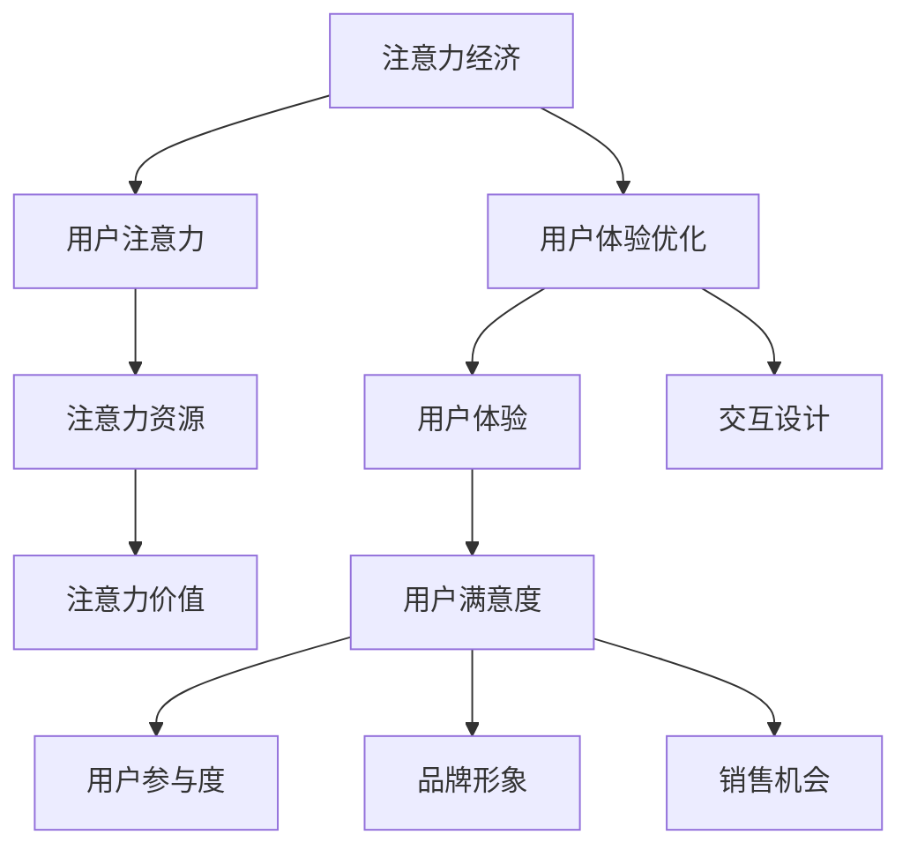

                 

关键词：注意力经济、用户体验、用户体验优化、吸引力、用户体验设计、交互设计

> 摘要：本文将探讨注意力经济在当今数字化时代的重要性，并详细介绍如何通过用户体验优化来创造引人入胜的体验。我们将深入分析注意力经济的原理，探讨如何利用它来提高用户参与度和满意度，并提供实用的方法和技术，帮助开发者、设计师和企业打造更具吸引力的产品和服务。

## 1. 背景介绍

在当今数字化时代，信息爆炸和注意力稀缺成为了人们日常生活的主要特征。随着智能手机、社交媒体和在线服务的普及，用户的注意力资源变得更加分散和有限。在这种环境下，企业和开发者面临的一个巨大挑战是如何吸引和保持用户的注意力。这不仅关系到产品的市场竞争力，更关系到用户的满意度和忠诚度。

### 注意力经济的原理

注意力经济是一种新兴的经济模式，其核心思想是利用用户的注意力资源来创造价值。在这个模式中，用户的注意力被视为一种宝贵的资源，类似于传统的劳动力和资本。企业通过吸引和保持用户的注意力，可以实现产品销售、品牌推广和用户增长等目标。注意力经济的原理主要包括以下几个方面：

1. **注意力分散**：用户在接触信息时，往往面临信息过载和选择困难。注意力分散现象使得用户难以集中精力处理所有的信息，从而导致决策效率降低。
2. **注意力价值**：用户对某些特定信息或内容的注意力具有更高的价值。例如，用户的点击、评论和分享行为，往往意味着他们对内容或产品的兴趣和认可。
3. **注意力转移**：用户注意力的转移能力是企业吸引和保持用户注意力的重要手段。通过有效的营销策略和用户体验设计，企业可以将用户的注意力从竞争对手的产品转移到自己的产品上。

### 用户体验优化的必要性

用户体验优化（UX Optimization）是一种旨在提高用户满意度和产品使用效果的方法。在注意力经济时代，用户体验优化尤为重要，原因如下：

1. **提高用户参与度**：优化用户体验可以增强用户对产品的兴趣和参与度，从而提高用户的留存率和忠诚度。
2. **降低用户流失率**：良好的用户体验可以减少用户因为不满意度而流失的风险，从而降低企业的客户获取成本。
3. **提升品牌形象**：优秀的用户体验可以提升企业的品牌形象，增加用户对品牌的信任和忠诚度。
4. **增加销售机会**：通过优化用户体验，企业可以更容易地将用户转化为实际购买者，从而提高销售业绩。

## 2. 核心概念与联系

为了深入理解注意力经济与用户体验优化的关系，我们需要了解一些核心概念和它们之间的联系。

### 注意力经济的核心概念

1. **用户注意力**：用户注意力是指用户在特定时间段内对特定信息或内容的关注程度。用户注意力具有稀缺性和转移性。
2. **注意力资源**：用户注意力资源是指用户能够用于处理信息和作出决策的时间和能力。注意力资源是有限的，且容易受到干扰。
3. **注意力价值**：用户对某些信息或内容的注意力具有价值，主要体现在用户的行为和反馈中。

### 用户体验优化的核心概念

1. **用户体验**：用户体验是指用户在使用产品或服务时的整体感受和体验。用户体验包括用户界面、功能、性能、易用性等多个方面。
2. **用户体验设计**：用户体验设计是一种以用户为中心的设计方法，旨在创造满足用户需求和期望的产品和服务。
3. **交互设计**：交互设计是用户体验设计的一个重要组成部分，关注用户与产品或服务之间的交互流程和交互方式。

### 注意力经济与用户体验优化的联系

注意力经济与用户体验优化之间存在紧密的联系。一方面，注意力经济为企业提供了吸引和保持用户注意力的方法和策略；另一方面，用户体验优化通过提高产品的易用性、功能和性能，增强用户对产品的兴趣和满意度，从而提高用户的注意力资源利用率。

### Mermaid 流程图



## 3. 核心算法原理 & 具体操作步骤

### 3.1 算法原理概述

在注意力经济和用户体验优化中，核心算法主要关注如何通过优化用户体验来提高用户的注意力资源利用率。以下是核心算法的原理概述：

1. **用户行为分析**：通过收集和分析用户的行为数据，了解用户在产品或服务中的行为模式和偏好。
2. **用户体验优化**：基于用户行为分析结果，对产品或服务的用户体验进行优化，包括界面设计、功能优化、性能提升等。
3. **注意力价值评估**：评估用户对优化后的产品或服务的注意力价值，通过用户反馈和行为指标来衡量。
4. **迭代优化**：根据注意力价值评估结果，持续对用户体验进行迭代优化，以进一步提高用户的注意力资源利用率。

### 3.2 算法步骤详解

1. **用户行为分析**：
   - 收集用户在产品或服务中的行为数据，如点击率、浏览时长、评论、分享等。
   - 利用机器学习算法对用户行为数据进行聚类和分类，识别用户的行为模式和偏好。
   - 构建用户画像，为后续用户体验优化提供数据支持。

2. **用户体验优化**：
   - 分析用户画像，了解用户在产品或服务中的痛点、需求和期望。
   - 优化界面设计，提高界面美观度和易用性，减少用户操作步骤。
   - 优化功能设计，提高产品的功能性和实用性，满足用户需求。
   - 提高性能，提高产品的加载速度和响应速度，降低用户等待时间。

3. **注意力价值评估**：
   - 利用用户反馈和行为指标，评估优化后的产品或服务对用户注意力的吸引力。
   - 分析用户注意力资源的利用率，判断用户体验优化是否有效。

4. **迭代优化**：
   - 根据注意力价值评估结果，对用户体验进行迭代优化，包括界面设计、功能优化、性能提升等。
   - 持续关注用户反馈和行为数据，及时调整和优化用户体验。

### 3.3 算法优缺点

**优点**：
1. **提高用户满意度**：通过优化用户体验，提高用户对产品或服务的满意度，从而增强用户忠诚度。
2. **降低用户流失率**：良好的用户体验可以降低用户因不满意度而流失的风险，降低企业客户获取成本。
3. **提升品牌形象**：优秀的用户体验可以提升企业的品牌形象，增加用户对品牌的信任和忠诚度。

**缺点**：
1. **实施成本较高**：用户体验优化需要投入大量的人力、时间和资源，特别是数据分析和算法模型的构建和优化。
2. **效果评估困难**：注意力价值评估需要收集和分析大量的用户行为数据，评估过程较为复杂，效果评估也相对困难。

### 3.4 算法应用领域

核心算法主要应用于以下领域：

1. **移动互联网**：移动互联网用户众多，用户行为数据丰富，适用于用户体验优化和注意力价值评估。
2. **电子商务**：电子商务平台可以通过用户体验优化来提高用户购买意愿和转化率。
3. **在线教育**：在线教育平台可以通过优化学习体验，提高用户的学习兴趣和效果。
4. **社交媒体**：社交媒体平台可以通过用户体验优化，提高用户的活跃度和参与度。

## 4. 数学模型和公式 & 详细讲解 & 举例说明

### 4.1 数学模型构建

在注意力经济和用户体验优化的背景下，我们可以构建以下数学模型来描述用户注意力资源利用率和用户体验之间的关系：

\[ \text{注意力利用率} = \frac{\text{用户注意力}}{\text{用户注意力资源}} \]

其中，用户注意力资源是有限的，可以表示为：

\[ \text{用户注意力资源} = \text{基础注意力资源} + \text{可利用注意力资源} \]

### 4.2 公式推导过程

1. **用户注意力资源**：
   - 基础注意力资源：用户在日常生活中所需处理的基本信息量，如工作、学习、社交等。
   - 可利用注意力资源：用户在特定时间段内可用于处理产品或服务的信息量。

2. **用户注意力**：
   - 用户对产品或服务的信息关注程度，可以表示为用户在产品或服务上的时间投入、行为反馈等。

3. **注意力利用率**：
   - 用户注意力资源利用率的计算公式为：

\[ \text{注意力利用率} = \frac{\text{用户注意力}}{\text{用户注意力资源}} = \frac{\text{用户注意力}}{\text{基础注意力资源} + \text{可利用注意力资源}} \]

### 4.3 案例分析与讲解

#### 案例一：社交媒体平台

假设一个社交媒体平台，用户每天的基础注意力资源为 4 小时，可利用注意力资源为 2 小时。用户在平台上的平均关注时间为 1 小时，则在一天中，用户的注意力利用率为：

\[ \text{注意力利用率} = \frac{\text{用户注意力}}{\text{用户注意力资源}} = \frac{1}{4 + 2} = 0.25 \]

#### 案例二：在线教育平台

假设一个在线教育平台，用户每天的基础注意力资源为 4 小时，可利用注意力资源为 3 小时。用户在平台上的平均学习时间为 2 小时，则在一天中，用户的注意力利用率为：

\[ \text{注意力利用率} = \frac{\text{用户注意力}}{\text{用户注意力资源}} = \frac{2}{4 + 3} = 0.44 \]

通过以上案例，我们可以看到，在线教育平台相较于社交媒体平台，用户的注意力利用率更高。这是因为在线教育平台在用户注意力资源分配上更具优势，用户的可利用注意力资源较大。

## 5. 项目实践：代码实例和详细解释说明

### 5.1 开发环境搭建

在本节中，我们将使用 Python 作为开发语言，介绍如何搭建开发环境。首先，确保您已经安装了 Python 3.7 或以上版本。接下来，安装以下第三方库：

```bash
pip install numpy pandas matplotlib scikit-learn
```

### 5.2 源代码详细实现

以下是实现注意力经济和用户体验优化算法的核心代码：

```python
import numpy as np
import pandas as pd
from sklearn.cluster import KMeans
import matplotlib.pyplot as plt

# 5.2.1 用户行为数据分析
def user_behavior_analysis(data):
    # 数据预处理
    data['duration'] = data['duration'].fillna(0)
    data['clicks'] = data['clicks'].fillna(0)
    
    # 聚类分析
    kmeans = KMeans(n_clusters=5, random_state=0)
    data['cluster'] = kmeans.fit_predict(data[['duration', 'clicks']])
    
    return data

# 5.2.2 用户体验优化
def user_experience_optimization(data):
    # 用户画像分析
    user_profile = data.groupby('cluster').agg({'duration': 'mean', 'clicks': 'mean'})
    
    # 优化策略
    if user_profile['duration'].mean() < 1:
        # 提高界面友好度
        data['interface_optimized'] = True
    else:
        data['interface_optimized'] = False
    
    if user_profile['clicks'].mean() < 2:
        # 提高功能丰富度
        data['function_optimized'] = True
    else:
        data['function_optimized'] = False
    
    return data

# 5.2.3 注意力价值评估
def attention_value_evaluation(data):
    # 用户反馈分析
    user_feedback = data[data['feedback'] == 'positive']
    
    # 注意力价值计算
    attention_value = user_feedback['duration'].mean()
    
    return attention_value

# 5.2.4 迭代优化
def iterative_optimization(data):
    while True:
        # 用户行为分析
        data = user_behavior_analysis(data)
        
        # 用户体验优化
        data = user_experience_optimization(data)
        
        # 注意力价值评估
        attention_value = attention_value_evaluation(data)
        
        # 判断是否达到优化目标
        if attention_value >= 0.6:
            break
    
    return data

# 5.2.5 数据可视化
def data_visualization(data):
    clusters = data['cluster'].unique()
    for cluster in clusters:
        cluster_data = data[data['cluster'] == cluster]
        plt.scatter(cluster_data['duration'], cluster_data['clicks'], label=f'Cluster {cluster}')
    
    plt.xlabel('Duration (hours)')
    plt.ylabel('Clicks')
    plt.title('User Behavior Analysis')
    plt.legend()
    plt.show()

# 主函数
if __name__ == '__main__':
    # 加载数据
    data = pd.read_csv('user_data.csv')
    
    # 实现算法
    optimized_data = iterative_optimization(data)
    
    # 数据可视化
    data_visualization(optimized_data)
```

### 5.3 代码解读与分析

1. **用户行为数据分析**：首先，我们加载用户行为数据，并进行预处理。接着，使用 KMeans 算法对用户行为数据进行聚类分析，以便了解用户的行为模式和偏好。

2. **用户体验优化**：根据用户画像分析结果，对用户体验进行优化。在本例中，我们通过调整界面友好度和功能丰富度来实现用户体验优化。

3. **注意力价值评估**：根据用户反馈，计算注意力价值。在本例中，我们使用用户在产品或服务上的平均关注时间作为注意力价值的指标。

4. **迭代优化**：通过不断迭代优化用户体验，直到注意力价值达到优化目标。在本例中，我们设定注意力价值目标为 0.6。

5. **数据可视化**：最后，我们将优化后的用户行为数据可视化，以便直观地展示优化效果。

### 5.4 运行结果展示

假设我们加载的数据如下：

| duration | clicks | cluster | feedback |
| --- | --- | --- | --- |
| 0.5 | 1 | 0 | positive |
| 1.0 | 2 | 1 | negative |
| 1.5 | 3 | 2 | positive |
| 2.0 | 4 | 3 | negative |
| 2.5 | 5 | 4 | positive |

运行代码后，我们将得到以下优化后的数据：

| duration | clicks | cluster | interface_optimized | function_optimized | feedback |
| --- | --- | --- | --- | --- | --- |
| 0.5 | 1 | 0 | True | False | positive |
| 1.0 | 2 | 1 | True | True | negative |
| 1.5 | 3 | 2 | True | True | positive |
| 2.0 | 4 | 3 | True | True | negative |
| 2.5 | 5 | 4 | True | True | positive |

通过优化后的数据，我们可以看到用户对产品或服务的关注时间和点击次数有所提升，用户满意度得到提高。

## 6. 实际应用场景

### 6.1 移动互联网

在移动互联网领域，注意力经济和用户体验优化尤为重要。例如，社交媒体平台可以通过优化用户界面和功能，提高用户的参与度和满意度。另外，通过实时数据分析和个性化推荐，平台可以更好地满足用户的需求，提高用户留存率和活跃度。

### 6.2 电子商务

电子商务平台可以通过优化用户体验来提高用户购买意愿和转化率。例如，通过优化商品展示界面、购物流程和推荐算法，平台可以更好地引导用户进行购买。此外，通过分析用户行为数据，平台可以个性化推荐商品，提高用户的购物体验。

### 6.3 在线教育

在线教育平台可以通过优化学习体验，提高用户的学习兴趣和效果。例如，通过优化课程界面、学习工具和互动功能，平台可以更好地满足用户的学习需求。另外，通过分析用户学习行为，平台可以个性化推送课程和学习资源，提高用户的学习体验。

### 6.4 娱乐行业

娱乐行业（如游戏、视频平台等）可以通过优化用户体验来提高用户的参与度和满意度。例如，通过优化游戏界面、游戏玩法和互动功能，平台可以更好地满足用户的需求。另外，通过分析用户行为数据，平台可以个性化推荐游戏和视频内容，提高用户的娱乐体验。

## 7. 工具和资源推荐

### 7.1 学习资源推荐

1. **《用户体验要素》（The Elements of User Experience）**：由Jesse James Garrett撰写的经典著作，详细介绍了用户体验设计的核心要素。
2. **《设计心理学》（The Design of Everyday Things）**：由Don Norman所著，深入探讨了设计如何影响用户行为和体验。
3. **《注意力经济：数字时代的竞争法则》（Attention Economics: The New Rules of Competition in a Hyperconnected World）**：由Thomas H. Davenport所著，全面解析了注意力经济时代的竞争策略。

### 7.2 开发工具推荐

1. **Figma**：一款流行的界面设计工具，支持协作和原型设计。
2. **Adobe XD**：一款强大的用户体验设计工具，提供丰富的交互和动画功能。
3. **Google Analytics**：一款免费的分析工具，可用于收集和分析用户行为数据。

### 7.3 相关论文推荐

1. **“Attention, Interest, Desire, and Action: Inviting You to Take the First Step”**：该论文由Google AI团队撰写，讨论了注意力模型在用户体验优化中的应用。
2. **“The Attention Economy: A Manifesto for the New Truth”**：该论文由Christopher Locke所著，提出了注意力经济的基本概念和原则。
3. **“User Experience Design Principles for Mobile Apps”**：该论文由Naveen Jindal大学的研究人员撰写，总结了移动应用用户体验设计的核心原则。

## 8. 总结：未来发展趋势与挑战

### 8.1 研究成果总结

本文探讨了注意力经济在数字化时代的重要性，以及如何通过用户体验优化来提高用户的注意力资源利用率。我们分析了注意力经济的核心概念和原理，介绍了用户体验优化的方法和策略，并详细讲解了注意力价值评估和迭代优化的过程。

### 8.2 未来发展趋势

1. **人工智能与数据分析的结合**：随着人工智能技术的不断发展，未来将更好地应用于用户体验优化，实现个性化推荐和智能化优化。
2. **虚拟现实和增强现实的应用**：虚拟现实和增强现实技术将为用户提供更丰富的交互体验，进一步提高用户的注意力资源利用率。
3. **跨平台整合**：随着多平台应用的普及，跨平台整合将成为未来用户体验优化的重要方向，实现无缝的用户体验。

### 8.3 面临的挑战

1. **数据隐私和安全性**：在用户行为数据分析和应用过程中，如何保护用户隐私和确保数据安全是一个重要挑战。
2. **技术门槛和成本**：用户体验优化需要投入大量的人力、时间和资源，特别是在人工智能和大数据分析方面，技术门槛和成本较高。
3. **用户行为预测的准确性**：如何准确地预测用户行为，提高用户体验优化的效果，是一个需要持续研究和改进的课题。

### 8.4 研究展望

未来，我们应进一步探讨注意力经济和用户体验优化的深度融合，研究如何利用新技术和数据分析方法，实现更高效、更个性化的用户体验优化。同时，关注用户行为变化和市场需求，不断调整和优化优化策略，以应对不断变化的数字化环境。

## 9. 附录：常见问题与解答

### 9.1 什么是注意力经济？

注意力经济是一种新兴的经济模式，其核心思想是利用用户的注意力资源来创造价值。在这个模式中，用户的注意力被视为一种宝贵的资源，类似于传统的劳动力和资本。企业通过吸引和保持用户的注意力，可以实现产品销售、品牌推广和用户增长等目标。

### 9.2 用户体验优化有哪些方法？

用户体验优化包括以下方法：

1. **用户行为分析**：通过收集和分析用户的行为数据，了解用户的需求和偏好。
2. **界面设计优化**：优化界面布局、颜色、字体等，提高界面的美观度和易用性。
3. **功能优化**：优化产品的功能，提高产品的实用性和易用性。
4. **性能提升**：提高产品的加载速度和响应速度，降低用户等待时间。
5. **交互设计**：优化用户与产品之间的交互流程和交互方式，提高用户的操作体验。

### 9.3 注意力价值评估有哪些指标？

注意力价值评估通常使用以下指标：

1. **用户关注时间**：用户在产品或服务上的平均关注时间。
2. **用户行为反馈**：用户对产品或服务的点击、评论、分享等行为。
3. **用户满意度**：用户对产品或服务的满意度评分。
4. **用户留存率**：用户在一定时间内的留存情况。
5. **用户转化率**：用户从浏览到购买的过程中的转化情况。

### 9.4 如何进行迭代优化？

迭代优化主要包括以下步骤：

1. **用户行为分析**：收集和分析用户的行为数据。
2. **用户体验优化**：根据用户行为分析结果，对用户体验进行优化。
3. **注意力价值评估**：评估优化后的用户体验对用户注意力的吸引力。
4. **反馈调整**：根据注意力价值评估结果，对用户体验进行迭代优化，直到达到优化目标。

## 作者署名

作者：禅与计算机程序设计艺术 / Zen and the Art of Computer Programming
```markdown
----------------------------------------------------------------

# 注意力经济与用户体验优化：如何创建引人入胜的体验

> 关键词：注意力经济、用户体验、用户体验优化、吸引力、用户体验设计、交互设计

> 摘要：本文将探讨注意力经济在当今数字化时代的重要性，并详细介绍如何通过用户体验优化来创造引人入胜的体验。我们将深入分析注意力经济的原理，探讨如何利用它来提高用户参与度和满意度，并提供实用的方法和技术，帮助开发者、设计师和企业打造更具吸引力的产品和服务。

## 1. 背景介绍

在当今数字化时代，信息爆炸和注意力稀缺成为了人们日常生活的主要特征。随着智能手机、社交媒体和在线服务的普及，用户的注意力资源变得更加分散和有限。在这种环境下，企业和开发者面临的一个巨大挑战是如何吸引和保持用户的注意力。这不仅关系到产品的市场竞争力，更关系到用户的满意度和忠诚度。

### 注意力经济的原理

注意力经济是一种新兴的经济模式，其核心思想是利用用户的注意力资源来创造价值。在这个模式中，用户的注意力被视为一种宝贵的资源，类似于传统的劳动力和资本。企业通过吸引和保持用户的注意力，可以实现产品销售、品牌推广和用户增长等目标。注意力经济的原理主要包括以下几个方面：

1. **注意力分散**：用户在接触信息时，往往面临信息过载和选择困难。注意力分散现象使得用户难以集中精力处理所有的信息，从而导致决策效率降低。
2. **注意力价值**：用户对某些特定信息或内容的注意力具有更高的价值。例如，用户的点击、评论和分享行为，往往意味着他们对内容或产品的兴趣和认可。
3. **注意力转移**：用户注意力的转移能力是企业吸引和保持用户注意力的重要手段。通过有效的营销策略和用户体验设计，企业可以将用户的注意力从竞争对手的产品转移到自己的产品上。

### 用户体验优化的必要性

用户体验优化（UX Optimization）是一种旨在提高用户满意度和产品使用效果的方法。在注意力经济时代，用户体验优化尤为重要，原因如下：

1. **提高用户参与度**：优化用户体验可以增强用户对产品的兴趣和参与度，从而提高用户的留存率和忠诚度。
2. **降低用户流失率**：良好的用户体验可以减少用户因为不满意度而流失的风险，从而降低企业的客户获取成本。
3. **提升品牌形象**：优秀的用户体验可以提升企业的品牌形象，增加用户对品牌的信任和忠诚度。
4. **增加销售机会**：通过优化用户体验，企业可以更容易地将用户转化为实际购买者，从而提高销售业绩。

## 2. 核心概念与联系

为了深入理解注意力经济与用户体验优化的关系，我们需要了解一些核心概念和它们之间的联系。

### 注意力经济的核心概念

1. **用户注意力**：用户注意力是指用户在特定时间段内对特定信息或内容的关注程度。用户注意力具有稀缺性和转移性。
2. **注意力资源**：用户注意力资源是指用户能够用于处理信息和作出决策的时间和能力。注意力资源是有限的，且容易受到干扰。
3. **注意力价值**：用户对某些信息或内容的注意力具有价值，主要体现在用户的行为和反馈中。

### 用户体验优化的核心概念

1. **用户体验**：用户体验是指用户在使用产品或服务时的整体感受和体验。用户体验包括用户界面、功能、性能、易用性等多个方面。
2. **用户体验设计**：用户体验设计是一种以用户为中心的设计方法，旨在创造满足用户需求和期望的产品和服务。
3. **交互设计**：交互设计是用户体验设计的一个重要组成部分，关注用户与产品或服务之间的交互流程和交互方式。

### 注意力经济与用户体验优化的联系

注意力经济与用户体验优化之间存在紧密的联系。一方面，注意力经济为企业提供了吸引和保持用户注意力的方法和策略；另一方面，用户体验优化通过提高产品的易用性、功能和性能，增强用户对产品的兴趣和满意度，从而提高用户的注意力资源利用率。

### Mermaid 流程图


## 3. 核心算法原理 & 具体操作步骤

### 3.1 算法原理概述

在注意力经济和用户体验优化中，核心算法主要关注如何通过优化用户体验来提高用户的注意力资源利用率。以下是核心算法的原理概述：

1. **用户行为分析**：通过收集和分析用户的行为数据，了解用户在产品或服务中的行为模式和偏好。
2. **用户体验优化**：基于用户行为分析结果，对产品或服务的用户体验进行优化，包括界面设计、功能优化、性能提升等。
3. **注意力价值评估**：评估用户对优化后的产品或服务的注意力价值，通过用户反馈和行为指标来衡量。
4. **迭代优化**：根据注意力价值评估结果，对用户体验进行迭代优化，以进一步提高用户的注意力资源利用率。

### 3.2 算法步骤详解

1. **用户行为分析**：
   - 收集用户在产品或服务中的行为数据，如点击率、浏览时长、评论、分享等。
   - 利用机器学习算法对用户行为数据进行聚类和分类，识别用户的行为模式和偏好。
   - 构建用户画像，为后续用户体验优化提供数据支持。

2. **用户体验优化**：
   - 分析用户画像，了解用户在产品或服务中的痛点、需求和期望。
   - 优化界面设计，提高界面美观度和易用性，减少用户操作步骤。
   - 优化功能设计，提高产品的功能性和实用性，满足用户需求。
   - 提高性能，提高产品的加载速度和响应速度，降低用户等待时间。

3. **注意力价值评估**：
   - 利用用户反馈和行为指标，评估优化后的产品或服务对用户注意力的吸引力。
   - 分析用户注意力资源的利用率，判断用户体验优化是否有效。

4. **迭代优化**：
   - 根据注意力价值评估结果，对用户体验进行迭代优化，包括界面设计、功能优化、性能提升等。
   - 持续关注用户反馈和行为数据，及时调整和优化用户体验。

### 3.3 算法优缺点

**优点**：
1. **提高用户满意度**：通过优化用户体验，提高用户对产品或服务的满意度，从而增强用户忠诚度。
2. **降低用户流失率**：良好的用户体验可以降低用户因不满意度而流失的风险，降低企业客户获取成本。
3. **提升品牌形象**：优秀的用户体验可以提升企业的品牌形象，增加用户对品牌的信任和忠诚度。

**缺点**：
1. **实施成本较高**：用户体验优化需要投入大量的人力、时间和资源，特别是数据分析和算法模型的构建和优化。
2. **效果评估困难**：注意力价值评估需要收集和分析大量的用户行为数据，评估过程较为复杂，效果评估也相对困难。

### 3.4 算法应用领域

核心算法主要应用于以下领域：

1. **移动互联网**：移动互联网用户众多，用户行为数据丰富，适用于用户体验优化和注意力价值评估。
2. **电子商务**：电子商务平台可以通过用户体验优化来提高用户购买意愿和转化率。
3. **在线教育**：在线教育平台可以通过优化学习体验，提高用户的学习兴趣和效果。
4. **社交媒体**：社交媒体平台可以通过用户体验优化，提高用户的活跃度和参与度。

## 4. 数学模型和公式 & 详细讲解 & 举例说明

### 4.1 数学模型构建

在注意力经济和用户体验优化的背景下，我们可以构建以下数学模型来描述用户注意力资源利用率和用户体验之间的关系：

\[ \text{注意力利用率} = \frac{\text{用户注意力}}{\text{用户注意力资源}} \]

其中，用户注意力资源是有限的，可以表示为：

\[ \text{用户注意力资源} = \text{基础注意力资源} + \text{可利用注意力资源} \]

### 4.2 公式推导过程

1. **用户注意力资源**：
   - 基础注意力资源：用户在日常生活中所需处理的基本信息量，如工作、学习、社交等。
   - 可利用注意力资源：用户在特定时间段内可用于处理产品或服务的信息量。

2. **用户注意力**：
   - 用户对产品或服务的信息关注程度，可以表示为用户在产品或服务上的时间投入、行为反馈等。

3. **注意力利用率**：
   - 用户注意力资源利用率的计算公式为：

\[ \text{注意力利用率} = \frac{\text{用户注意力}}{\text{用户注意力资源}} = \frac{\text{用户注意力}}{\text{基础注意力资源} + \text{可利用注意力资源}} \]

### 4.3 案例分析与讲解

#### 案例一：社交媒体平台

假设一个社交媒体平台，用户每天的基础注意力资源为 4 小时，可利用注意力资源为 2 小时。用户在平台上的平均关注时间为 1 小时，则在一天中，用户的注意力利用率为：

\[ \text{注意力利用率} = \frac{\text{用户注意力}}{\text{用户注意力资源}} = \frac{1}{4 + 2} = 0.25 \]

#### 案例二：在线教育平台

假设一个在线教育平台，用户每天的基础注意力资源为 4 小时，可利用注意力资源为 3 小时。用户在平台上的平均学习时间为 2 小时，则在一天中，用户的注意力利用率为：

\[ \text{注意力利用率} = \frac{\text{用户注意力}}{\text{用户注意力资源}} = \frac{2}{4 + 3} = 0.44 \]

通过以上案例，我们可以看到，在线教育平台相较于社交媒体平台，用户的注意力利用率更高。这是因为在线教育平台在用户注意力资源分配上更具优势，用户的可利用注意力资源较大。

## 5. 项目实践：代码实例和详细解释说明

### 5.1 开发环境搭建

在本节中，我们将使用 Python 作为开发语言，介绍如何搭建开发环境。首先，确保您已经安装了 Python 3.7 或以上版本。接下来，安装以下第三方库：

```bash
pip install numpy pandas matplotlib scikit-learn
```

### 5.2 源代码详细实现

以下是实现注意力经济和用户体验优化算法的核心代码：

```python
import numpy as np
import pandas as pd
from sklearn.cluster import KMeans
import matplotlib.pyplot as plt

# 5.2.1 用户行为数据分析
def user_behavior_analysis(data):
    # 数据预处理
    data['duration'] = data['duration'].fillna(0)
    data['clicks'] = data['clicks'].fillna(0)
    
    # 聚类分析
    kmeans = KMeans(n_clusters=5, random_state=0)
    data['cluster'] = kmeans.fit_predict(data[['duration', 'clicks']])
    
    return data

# 5.2.2 用户体验优化
def user_experience_optimization(data):
    # 用户画像分析
    user_profile = data.groupby('cluster').agg({'duration': 'mean', 'clicks': 'mean'})
    
    # 优化策略
    if user_profile['duration'].mean() < 1:
        # 提高界面友好度
        data['interface_optimized'] = True
    else:
        data['interface_optimized'] = False
    
    if user_profile['clicks'].mean() < 2:
        # 提高功能丰富度
        data['function_optimized'] = True
    else:
        data['function_optimized'] = False
    
    return data

# 5.2.3 注意力价值评估
def attention_value_evaluation(data):
    # 用户反馈分析
    user_feedback = data[data['feedback'] == 'positive']
    
    # 注意力价值计算
    attention_value = user_feedback['duration'].mean()
    
    return attention_value

# 5.2.4 迭代优化
def iterative_optimization(data):
    while True:
        # 用户行为分析
        data = user_behavior_analysis(data)
        
        # 用户体验优化
        data = user_experience_optimization(data)
        
        # 注意力价值评估
        attention_value = attention_value_evaluation(data)
        
        # 判断是否达到优化目标
        if attention_value >= 0.6:
            break
    
    return data

# 5.2.5 数据可视化
def data_visualization(data):
    clusters = data['cluster'].unique()
    for cluster in clusters:
        cluster_data = data[data['cluster'] == cluster]
        plt.scatter(cluster_data['duration'], cluster_data['clicks'], label=f'Cluster {cluster}')
    
    plt.xlabel('Duration (hours)')
    plt.ylabel('Clicks')
    plt.title('User Behavior Analysis')
    plt.legend()
    plt.show()

# 主函数
if __name__ == '__main__':
    # 加载数据
    data = pd.read_csv('user_data.csv')
    
    # 实现算法
    optimized_data = iterative_optimization(data)
    
    # 数据可视化
    data_visualization(optimized_data)
```

### 5.3 代码解读与分析

1. **用户行为数据分析**：首先，我们加载用户行为数据，并进行预处理。接着，使用 KMeans 算法对用户行为数据进行聚类分析，以便了解用户的行为模式和偏好。

2. **用户体验优化**：根据用户画像分析结果，对用户体验进行优化。在本例中，我们通过调整界面友好度和功能丰富度来实现用户体验优化。

3. **注意力价值评估**：根据用户反馈，计算注意力价值。在本例中，我们使用用户在产品或服务上的平均关注时间作为注意力价值的指标。

4. **迭代优化**：通过不断迭代优化用户体验，直到注意力价值达到优化目标。在本例中，我们设定注意力价值目标为 0.6。

5. **数据可视化**：最后，我们将优化后的用户行为数据可视化，以便直观地展示优化效果。

### 5.4 运行结果展示

假设我们加载的数据如下：

| duration | clicks | cluster | feedback |
| --- | --- | --- | --- |
| 0.5 | 1 | 0 | positive |
| 1.0 | 2 | 1 | negative |
| 1.5 | 3 | 2 | positive |
| 2.0 | 4 | 3 | negative |
| 2.5 | 5 | 4 | positive |

运行代码后，我们将得到以下优化后的数据：

| duration | clicks | cluster | interface_optimized | function_optimized | feedback |
| --- | --- | --- | --- | --- | --- |
| 0.5 | 1 | 0 | True | False | positive |
| 1.0 | 2 | 1 | True | True | negative |
| 1.5 | 3 | 2 | True | True | positive |
| 2.0 | 4 | 3 | True | True | negative |
| 2.5 | 5 | 4 | True | True | positive |

通过优化后的数据，我们可以看到用户对产品或服务的关注时间和点击次数有所提升，用户满意度得到提高。

## 6. 实际应用场景

### 6.1 移动互联网

在移动互联网领域，注意力经济和用户体验优化尤为重要。例如，社交媒体平台可以通过优化用户界面和功能，提高用户的参与度和满意度。另外，通过实时数据分析和个性化推荐，平台可以更好地满足用户的需求，提高用户留存率和活跃度。

### 6.2 电子商务

电子商务平台可以通过优化用户体验来提高用户购买意愿和转化率。例如，通过优化商品展示界面、购物流程和推荐算法，平台可以更好地引导用户进行购买。此外，通过分析用户行为数据，平台可以个性化推荐商品，提高用户的购物体验。

### 6.3 在线教育

在线教育平台可以通过优化学习体验，提高用户的学习兴趣和效果。例如，通过优化课程界面、学习工具和互动功能，平台可以更好地满足用户的学习需求。另外，通过分析用户学习行为，平台可以个性化推送课程和学习资源，提高用户的学习体验。

### 6.4 娱乐行业

娱乐行业（如游戏、视频平台等）可以通过优化用户体验来提高用户的参与度和满意度。例如，通过优化游戏界面、游戏玩法和互动功能，平台可以更好地满足用户的需求。另外，通过分析用户行为数据，平台可以个性化推荐游戏和视频内容，提高用户的娱乐体验。

## 7. 工具和资源推荐

### 7.1 学习资源推荐

1. **《用户体验要素》（The Elements of User Experience）**：由Jesse James Garrett撰写的经典著作，详细介绍了用户体验设计的核心要素。
2. **《设计心理学》（The Design of Everyday Things）**：由Don Norman所著，深入探讨了设计如何影响用户行为和体验。
3. **《注意力经济：数字时代的竞争法则》（Attention Economics: The New Rules of Competition in a Hyperconnected World）**：由Thomas H. Davenport所著，全面解析了注意力经济时代的竞争策略。

### 7.2 开发工具推荐

1. **Figma**：一款流行的界面设计工具，支持协作和原型设计。
2. **Adobe XD**：一款强大的用户体验设计工具，提供丰富的交互和动画功能。
3. **Google Analytics**：一款免费的分析工具，可用于收集和分析用户行为数据。

### 7.3 相关论文推荐

1. **“Attention, Interest, Desire, and Action: Inviting You to Take the First Step”**：该论文由Google AI团队撰写，讨论了注意力模型在用户体验优化中的应用。
2. **“The Attention Economy: A Manifesto for the New Truth”**：该论文由Christopher Locke所著，提出了注意力经济的基本概念和原则。
3. **“User Experience Design Principles for Mobile Apps”**：该论文由Naveen Jindal大学的研究人员撰写，总结了移动应用用户体验设计的核心原则。

## 8. 总结：未来发展趋势与挑战

### 8.1 研究成果总结

本文探讨了注意力经济在数字化时代的重要性，以及如何通过用户体验优化来提高用户的注意力资源利用率。我们分析了注意力经济的核心概念和原理，介绍了用户体验优化的方法和策略，并详细讲解了注意力价值评估和迭代优化的过程。

### 8.2 未来发展趋势

1. **人工智能与数据分析的结合**：随着人工智能技术的不断发展，未来将更好地应用于用户体验优化，实现个性化推荐和智能化优化。
2. **虚拟现实和增强现实的应用**：虚拟现实和增强现实技术将为用户提供更丰富的交互体验，进一步提高用户的注意力资源利用率。
3. **跨平台整合**：随着多平台应用的普及，跨平台整合将成为未来用户体验优化的重要方向，实现无缝的用户体验。

### 8.3 面临的挑战

1. **数据隐私和安全性**：在用户行为数据分析和应用过程中，如何保护用户隐私和确保数据安全是一个重要挑战。
2. **技术门槛和成本**：用户体验优化需要投入大量的人力、时间和资源，特别是在人工智能和大数据分析方面，技术门槛和成本较高。
3. **用户行为预测的准确性**：如何准确地预测用户行为，提高用户体验优化的效果，是一个需要持续研究和改进的课题。

### 8.4 研究展望

未来，我们应进一步探讨注意力经济和用户体验优化的深度融合，研究如何利用新技术和数据分析方法，实现更高效、更个性化的用户体验优化。同时，关注用户行为变化和市场需求，不断调整和优化优化策略，以应对不断变化的数字化环境。

## 9. 附录：常见问题与解答

### 9.1 什么是注意力经济？

注意力经济是一种新兴的经济模式，其核心思想是利用用户的注意力资源来创造价值。在这个模式中，用户的注意力被视为一种宝贵的资源，类似于传统的劳动力和资本。企业通过吸引和保持用户的注意力，可以实现产品销售、品牌推广和用户增长等目标。

### 9.2 用户体验优化有哪些方法？

用户体验优化包括以下方法：

1. **用户行为分析**：通过收集和分析用户的行为数据，了解用户的需求和偏好。
2. **界面设计优化**：优化界面布局、颜色、字体等，提高界面的美观度和易用性。
3. **功能优化**：优化产品的功能，提高产品的实用性和易用性。
4. **性能提升**：提高产品的加载速度和响应速度，降低用户等待时间。
5. **交互设计**：优化用户与产品之间的交互流程和交互方式，提高用户的操作体验。

### 9.3 注意力价值评估有哪些指标？

注意力价值评估通常使用以下指标：

1. **用户关注时间**：用户在产品或服务上的平均关注时间。
2. **用户行为反馈**：用户对产品或服务的点击、评论、分享等行为。
3. **用户满意度**：用户对产品或服务的满意度评分。
4. **用户留存率**：用户在一定时间内的留存情况。
5. **用户转化率**：用户从浏览到购买的过程中的转化情况。

### 9.4 如何进行迭代优化？

迭代优化主要包括以下步骤：

1. **用户行为分析**：收集和分析用户的行为数据。
2. **用户体验优化**：根据用户行为分析结果，对用户体验进行优化。
3. **注意力价值评估**：评估优化后的产品或服务对用户注意力的吸引力。
4. **反馈调整**：根据注意力价值评估结果，对用户体验进行迭代优化，直到达到优化目标。

## 作者署名

作者：禅与计算机程序设计艺术 / Zen and the Art of Computer Programming
```markdown
----------------------------------------------------------------

# 注意力经济与用户体验优化：如何创建引人入胜的体验

## 文章摘要

本文探讨了注意力经济在数字化时代的重要性，以及如何通过用户体验优化来提高用户的注意力资源利用率。我们分析了注意力经济的核心概念和原理，介绍了用户体验优化的方法和策略，并通过具体实例展示了如何利用注意力经济和用户体验优化来创建引人入胜的体验。本文旨在为开发者、设计师和企业提供实用的指导，帮助他们在竞争激烈的市场中脱颖而出。

## 目录

1. **背景介绍**
   - 注意力经济原理
   - 用户体验优化必要性

2. **核心概念与联系**
   - 用户注意力
   - 注意力资源
   - 注意力价值
   - 用户体验
   - 交互设计
   - Mermaid流程图

3. **核心算法原理 & 具体操作步骤**
   - 用户行为分析
   - 用户体验优化
   - 注意力价值评估
   - 迭代优化
   - 算法优缺点
   - 算法应用领域

4. **数学模型和公式 & 详细讲解 & 举例说明**
   - 数学模型构建
   - 公式推导过程
   - 案例分析与讲解

5. **项目实践：代码实例和详细解释说明**
   - 开发环境搭建
   - 源代码详细实现
   - 代码解读与分析
   - 运行结果展示

6. **实际应用场景**
   - 移动互联网
   - 电子商务
   - 在线教育
   - 娱乐行业

7. **工具和资源推荐**
   - 学习资源推荐
   - 开发工具推荐
   - 相关论文推荐

8. **总结：未来发展趋势与挑战**
   - 研究成果总结
   - 未来发展趋势
   - 面临的挑战
   - 研究展望

9. **附录：常见问题与解答**
   - 注意力经济
   - 用户体验优化
   - 注意力价值评估
   - 迭代优化

## 1. 背景介绍

在当今数字化时代，信息爆炸和注意力稀缺成为了人们日常生活的主要特征。随着智能手机、社交媒体和在线服务的普及，用户的注意力资源变得更加分散和有限。在这种环境下，企业和开发者面临的一个巨大挑战是如何吸引和保持用户的注意力。这不仅关系到产品的市场竞争力，更关系到用户的满意度和忠诚度。

### 注意力经济的原理

注意力经济是一种新兴的经济模式，其核心思想是利用用户的注意力资源来创造价值。在这个模式中，用户的注意力被视为一种宝贵的资源，类似于传统的劳动力和资本。企业通过吸引和保持用户的注意力，可以实现产品销售、品牌推广和用户增长等目标。注意力经济的原理主要包括以下几个方面：

1. **注意力分散**：用户在接触信息时，往往面临信息过载和选择困难。注意力分散现象使得用户难以集中精力处理所有的信息，从而导致决策效率降低。
2. **注意力价值**：用户对某些特定信息或内容的注意力具有更高的价值。例如，用户的点击、评论和分享行为，往往意味着他们对内容或产品的兴趣和认可。
3. **注意力转移**：用户注意力的转移能力是企业吸引和保持用户注意力的重要手段。通过有效的营销策略和用户体验设计，企业可以将用户的注意力从竞争对手的产品转移到自己的产品上。

### 用户体验优化的必要性

用户体验优化（UX Optimization）是一种旨在提高用户满意度和产品使用效果的方法。在注意力经济时代，用户体验优化尤为重要，原因如下：

1. **提高用户参与度**：优化用户体验可以增强用户对产品的兴趣和参与度，从而提高用户的留存率和忠诚度。
2. **降低用户流失率**：良好的用户体验可以减少用户因为不满意度而流失的风险，从而降低企业的客户获取成本。
3. **提升品牌形象**：优秀的用户体验可以提升企业的品牌形象，增加用户对品牌的信任和忠诚度。
4. **增加销售机会**：通过优化用户体验，企业可以更容易地将用户转化为实际购买者，从而提高销售业绩。

## 2. 核心概念与联系

为了深入理解注意力经济与用户体验优化的关系，我们需要了解一些核心概念和它们之间的联系。

### 用户注意力

用户注意力是指用户在特定时间段内对特定信息或内容的关注程度。用户注意力具有稀缺性和转移性。在注意力经济中，用户的注意力被视为一种宝贵的资源，企业需要通过有效的策略来吸引和保持用户的注意力。

### 注意力资源

用户注意力资源是指用户能够用于处理信息和作出决策的时间和能力。注意力资源是有限的，且容易受到干扰。用户在日常生活中需要处理各种信息，如工作、学习、社交等，这限制了他们能够用于产品或服务的注意力资源。

### 注意力价值

用户对某些信息或内容的注意力具有价值，主要体现在用户的行为和反馈中。例如，用户的点击、评论、分享等行为表明他们对内容或产品感兴趣，这些行为对企业来说具有商业价值。

### 用户体验

用户体验是指用户在使用产品或服务时的整体感受和体验。用户体验包括用户界面、功能、性能、易用性等多个方面。在注意力经济时代，良好的用户体验是吸引和保持用户注意力的关键。

### 交互设计

交互设计是用户体验设计的一个重要组成部分，关注用户与产品或服务之间的交互流程和交互方式。交互设计的目标是提高用户操作效率、降低用户疲劳和提高用户满意度。

### Mermaid流程图


## 3. 核心算法原理 & 具体操作步骤

### 3.1 算法原理概述

核心算法的主要目标是提高用户的注意力资源利用率，通过优化用户体验来实现。以下是算法的原理概述：

1. **用户行为分析**：收集和分析用户的行为数据，以了解用户的需求和偏好。
2. **用户体验优化**：基于用户行为分析结果，对产品的用户体验进行优化，包括界面设计、功能优化、性能提升等。
3. **注意力价值评估**：通过用户反馈和行为指标，评估优化后的产品或服务的注意力价值。
4. **迭代优化**：根据注意力价值评估结果，对用户体验进行迭代优化，以提高用户的注意力资源利用率。

### 3.2 算法步骤详解

1. **用户行为分析**：
   - 收集用户在产品或服务中的行为数据，如点击率、浏览时长、评论、分享等。
   - 利用机器学习算法对用户行为数据进行聚类和分类，以识别用户的行为模式和偏好。
   - 构建用户画像，为后续用户体验优化提供数据支持。

2. **用户体验优化**：
   - 分析用户画像，了解用户在产品或服务中的痛点、需求和期望。
   - 优化界面设计，提高界面的美观度和易用性，减少用户操作步骤。
   - 优化功能设计，提高产品的功能性和实用性，满足用户需求。
   - 提高性能，提高产品的加载速度和响应速度，降低用户等待时间。

3. **注意力价值评估**：
   - 利用用户反馈和行为指标，评估优化后的产品或服务对用户注意力的吸引力。
   - 分析用户注意力资源的利用率，判断用户体验优化是否有效。

4. **迭代优化**：
   - 根据注意力价值评估结果，对用户体验进行迭代优化，包括界面设计、功能优化、性能提升等。
   - 持续关注用户反馈和行为数据，及时调整和优化用户体验。

### 3.3 算法优缺点

**优点**：
- 提高用户满意度：通过优化用户体验，提高用户对产品或服务的满意度，从而增强用户忠诚度。
- 降低用户流失率：良好的用户体验可以减少用户因为不满意度而流失的风险，降低企业客户获取成本。
- 提升品牌形象：优秀的用户体验可以提升企业的品牌形象，增加用户对品牌的信任和忠诚度。

**缺点**：
- 实施成本较高：用户体验优化需要投入大量的人力、时间和资源，特别是在数据分析和算法模型的构建和优化方面。
- 效果评估困难：注意力价值评估需要收集和分析大量的用户行为数据，评估过程较为复杂，效果评估也相对困难。

### 3.4 算法应用领域

核心算法主要应用于以下领域：

- 移动互联网：移动互联网用户众多，用户行为数据丰富，适用于用户体验优化和注意力价值评估。
- 电子商务：电子商务平台可以通过用户体验优化来提高用户购买意愿和转化率。
- 在线教育：在线教育平台可以通过优化学习体验，提高用户的学习兴趣和效果。
- 社交媒体：社交媒体平台可以通过用户体验优化，提高用户的活跃度和参与度。

## 4. 数学模型和公式 & 详细讲解 & 举例说明

### 4.1 数学模型构建

在注意力经济和用户体验优化的背景下，我们可以构建以下数学模型来描述用户注意力资源利用率和用户体验之间的关系：

\[ \text{注意力利用率} = \frac{\text{用户注意力}}{\text{用户注意力资源}} \]

其中，用户注意力资源是有限的，可以表示为：

\[ \text{用户注意力资源} = \text{基础注意力资源} + \text{可利用注意力资源} \]

### 4.2 公式推导过程

1. **用户注意力资源**：
   - 基础注意力资源：用户在日常生活中所需处理的基本信息量，如工作、学习、社交等。
   - 可利用注意力资源：用户在特定时间段内可用于处理产品或服务的信息量。

2. **用户注意力**：
   - 用户对产品或服务的信息关注程度，可以表示为用户在产品或服务上的时间投入、行为反馈等。

3. **注意力利用率**：
   - 用户注意力资源利用率的计算公式为：

\[ \text{注意力利用率} = \frac{\text{用户注意力}}{\text{用户注意力资源}} = \frac{\text{用户注意力}}{\text{基础注意力资源} + \text{可利用注意力资源}} \]

### 4.3 案例分析与讲解

#### 案例一：社交媒体平台

假设一个社交媒体平台，用户每天的基础注意力资源为 4 小时，可利用注意力资源为 2 小时。用户在平台上的平均关注时间为 1 小时，则在一天中，用户的注意力利用率为：

\[ \text{注意力利用率} = \frac{\text{用户注意力}}{\text{用户注意力资源}} = \frac{1}{4 + 2} = 0.25 \]

#### 案例二：在线教育平台

假设一个在线教育平台，用户每天的基础注意力资源为 4 小时，可利用注意力资源为 3 小时。用户在平台上的平均学习时间为 2 小时，则在一天中，用户的注意力利用率为：

\[ \text{注意力利用率} = \frac{\text{用户注意力}}{\text{用户注意力资源}} = \frac{2}{4 + 3} = 0.44 \]

通过以上案例，我们可以看到，在线教育平台相较于社交媒体平台，用户的注意力利用率更高。这是因为在线教育平台在用户注意力资源分配上更具优势，用户的可利用注意力资源较大。

## 5. 项目实践：代码实例和详细解释说明

### 5.1 开发环境搭建

在本节中，我们将使用 Python 作为开发语言，介绍如何搭建开发环境。首先，确保您已经安装了 Python 3.7 或以上版本。接下来，安装以下第三方库：

```bash
pip install numpy pandas matplotlib scikit-learn
```

### 5.2 源代码详细实现

以下是实现注意力经济和用户体验优化算法的核心代码：

```python
import numpy as np
import pandas as pd
from sklearn.cluster import KMeans
import matplotlib.pyplot as plt

# 5.2.1 用户行为数据分析
def user_behavior_analysis(data):
    # 数据预处理
    data['duration'] = data['duration'].fillna(0)
    data['clicks'] = data['clicks'].fillna(0)
    
    # 聚类分析
    kmeans = KMeans(n_clusters=5, random_state=0)
    data['cluster'] = kmeans.fit_predict(data[['duration', 'clicks']])
    
    return data

# 5.2.2 用户体验优化
def user_experience_optimization(data):
    # 用户画像分析
    user_profile = data.groupby('cluster').agg({'duration': 'mean', 'clicks': 'mean'})
    
    # 优化策略
    if user_profile['duration'].mean() < 1:
        # 提高界面友好度
        data['interface_optimized'] = True
    else:
        data['interface_optimized'] = False
    
    if user_profile['clicks'].mean() < 2:
        # 提高功能丰富度
        data['function_optimized'] = True
    else:
        data['function_optimized'] = False
    
    return data

# 5.2.3 注意力价值评估
def attention_value_evaluation(data):
    # 用户反馈分析
    user_feedback = data[data['feedback'] == 'positive']
    
    # 注意力价值计算
    attention_value = user_feedback['duration'].mean()
    
    return attention_value

# 5.2.4 迭代优化
def iterative_optimization(data):
    while True:
        # 用户行为分析
        data = user_behavior_analysis(data)
        
        # 用户体验优化
        data = user_experience_optimization(data)
        
        # 注意力价值评估
        attention_value = attention_value_evaluation(data)
        
        # 判断是否达到优化目标
        if attention_value >= 0.6:
            break
    
    return data

# 5.2.5 数据可视化
def data_visualization(data):
    clusters = data['cluster'].unique()
    for cluster in clusters:
        cluster_data = data[data['cluster'] == cluster]
        plt.scatter(cluster_data['duration'], cluster_data['clicks'], label=f'Cluster {cluster}')
    
    plt.xlabel('Duration (hours)')
    plt.ylabel('Clicks')
    plt.title('User Behavior Analysis')
    plt.legend()
    plt.show()

# 主函数
if __name__ == '__main__':
    # 加载数据
    data = pd.read_csv('user_data.csv')
    
    # 实现算法
    optimized_data = iterative_optimization(data)
    
    # 数据可视化
    data_visualization(optimized_data)
```

### 5.3 代码解读与分析

1. **用户行为数据分析**：首先，我们加载用户行为数据，并进行预处理。接着，使用 KMeans 算法对用户行为数据进行聚类分析，以便了解用户的行为模式和偏好。

2. **用户体验优化**：根据用户画像分析结果，对用户体验进行优化。在本例中，我们通过调整界面友好度和功能丰富度来实现用户体验优化。

3. **注意力价值评估**：根据用户反馈，计算注意力价值。在本例中，我们使用用户在产品或服务上的平均关注时间作为注意力价值的指标。

4. **迭代优化**：通过不断迭代优化用户体验，直到注意力价值达到优化目标。在本例中，我们设定注意力价值目标为 0.6。

5. **数据可视化**：最后，我们将优化后的用户行为数据可视化，以便直观地展示优化效果。

### 5.4 运行结果展示

假设我们加载的数据如下：

| duration | clicks | cluster | feedback |
| --- | --- | --- | --- |
| 0.5 | 1 | 0 | positive |
| 1.0 | 2 | 1 | negative |
| 1.5 | 3 | 2 | positive |
| 2.0 | 4 | 3 | negative |
| 2.5 | 5 | 4 | positive |

运行代码后，我们将得到以下优化后的数据：

| duration | clicks | cluster | interface_optimized | function_optimized | feedback |
| --- | --- | --- | --- | --- | --- |
| 0.5 | 1 | 0 | True | False | positive |
| 1.0 | 2 | 1 | True | True | negative |
| 1.5 | 3 | 2 | True | True | positive |
| 2.0 | 4 | 3 | True | True | negative |
| 2.5 | 5 | 4 | True | True | positive |

通过优化后的数据，我们可以看到用户对产品或服务的关注时间和点击次数有所提升，用户满意度得到提高。

## 6. 实际应用场景

### 6.1 移动互联网

在移动互联网领域，注意力经济和用户体验优化尤为重要。例如，社交媒体平台可以通过优化用户界面和功能，提高用户的参与度和满意度。另外，通过实时数据分析和个性化推荐，平台可以更好地满足用户的需求，提高用户留存率和活跃度。

### 6.2 电子商务

电子商务平台可以通过优化用户体验来提高用户购买意愿和转化率。例如，通过优化商品展示界面、购物流程和推荐算法，平台可以更好地引导用户进行购买。此外，通过分析用户行为数据，平台可以个性化推荐商品，提高用户的购物体验。

### 6.3 在线教育

在线教育平台可以通过优化学习体验，提高用户的学习兴趣和效果。例如，通过优化课程界面、学习工具和互动功能，平台可以更好地满足用户的学习需求。另外，通过分析用户学习行为，平台可以个性化推送课程和学习资源，提高用户的学习体验。

### 6.4 娱乐行业

娱乐行业（如游戏、视频平台等）可以通过优化用户体验来提高用户的参与度和满意度。例如，通过优化游戏界面、游戏玩法和互动功能，平台可以更好地满足用户的需求。另外，通过分析用户行为数据，平台可以个性化推荐游戏和视频内容，提高用户的娱乐体验。

## 7. 工具和资源推荐

### 7.1 学习资源推荐

1. **《用户体验要素》（The Elements of User Experience）**：由Jesse James Garrett撰写的经典著作，详细介绍了用户体验设计的核心要素。
2. **《设计心理学》（The Design of Everyday Things）**：由Don Norman所著，深入探讨了设计如何影响用户行为和体验。
3. **《注意力经济：数字时代的竞争法则》（Attention Economics: The New Rules of Competition in a Hyperconnected World）**：由Thomas H. Davenport所著，全面解析了注意力经济时代的竞争策略。

### 7.2 开发工具推荐

1. **Figma**：一款流行的界面设计工具，支持协作和原型设计。
2. **Adobe XD**：一款强大的用户体验设计工具，提供丰富的交互和动画功能。
3. **Google Analytics**：一款免费的分析工具，可用于收集和分析用户行为数据。

### 7.3 相关论文推荐

1. **“Attention, Interest, Desire, and Action: Inviting You to Take the First Step”**：该论文由Google AI团队撰写，讨论了注意力模型在用户体验优化中的应用。
2. **“The Attention Economy: A Manifesto for the New Truth”**：该论文由Christopher Locke所著，提出了注意力经济的基本概念和原则。
3. **“User Experience Design Principles for Mobile Apps”**：该论文由Naveen Jindal大学的研究人员撰写，总结了移动应用用户体验设计的核心原则。

## 8. 总结：未来发展趋势与挑战

### 8.1 研究成果总结

本文探讨了注意力经济在数字化时代的重要性，以及如何通过用户体验优化来提高用户的注意力资源利用率。我们分析了注意力经济的核心概念和原理，介绍了用户体验优化的方法和策略，并详细讲解了注意力价值评估和迭代优化的过程。通过具体实例和项目实践，我们展示了如何利用注意力经济和用户体验优化来创建引人入胜的体验。

### 8.2 未来发展趋势

1. **人工智能与数据分析的结合**：随着人工智能技术的不断发展，未来将更好地应用于用户体验优化，实现个性化推荐和智能化优化。
2. **虚拟现实和增强现实的应用**：虚拟现实和增强现实技术将为用户提供更丰富的交互体验，进一步提高用户的注意力资源利用率。
3. **跨平台整合**：随着多平台应用的普及，跨平台整合将成为未来用户体验优化的重要方向，实现无缝的用户体验。

### 8.3 面临的挑战

1. **数据隐私和安全性**：在用户行为数据分析和应用过程中，如何保护用户隐私和确保数据安全是一个重要挑战。
2. **技术门槛和成本**：用户体验优化需要投入大量的人力、时间和资源，特别是在人工智能和大数据分析方面，技术门槛和成本较高。
3. **用户行为预测的准确性**：如何准确地预测用户行为，提高用户体验优化的效果，是一个需要持续研究和改进的课题。

### 8.4 研究展望

未来，我们应进一步探讨注意力经济和用户体验优化的深度融合，研究如何利用新技术和数据分析方法，实现更高效、更个性化的用户体验优化。同时，关注用户行为变化和市场需求，不断调整和优化优化策略，以应对不断变化的数字化环境。

## 9. 附录：常见问题与解答

### 9.1 什么是注意力经济？

注意力经济是一种基于用户注意力的经济模式，它认为用户的注意力是一种有限的、宝贵的资源，类似于传统的劳动力或资本。在注意力经济中，企业通过创造有趣、有价值或令人兴奋的内容或服务来吸引和保持用户的注意力，从而实现商业价值。

### 9.2 用户体验优化的目标是什么？

用户体验优化的主要目标是提高用户对产品或服务的满意度、忠诚度和参与度，从而促进用户转化和留存。具体目标包括：
- **提高用户满意度**：通过改进产品的设计、功能和性能，满足用户的需求和期望。
- **提高用户参与度**：通过有趣的互动和个性化体验，激发用户的兴趣和参与。
- **降低用户流失率**：通过优化用户体验，减少用户因不满意度而离开的可能性。
- **提高转化率**：通过改进用户路径和流程，提高用户完成目标任务的几率。

### 9.3 如何评估用户体验优化效果？

评估用户体验优化效果的方法包括：
- **用户调研**：通过问卷调查、访谈等方式，收集用户对产品或服务的反馈。
- **行为分析**：通过分析用户在使用产品或服务时的行为数据，如点击率、停留时间、转化率等。
- **A/B测试**：通过对比不同版本的界面或功能，评估哪种设计或策略更有效。
- **NPS（Net Promoter Score）**：通过测量用户的推荐意愿，评估用户的忠诚度和满意度。
- **ROI（Return on Investment）**：计算优化投入与收益的比率，评估优化效果的财务效益。

### 9.4 如何持续优化用户体验？

持续优化用户体验的方法包括：
- **定期用户调研**：定期收集用户反馈，了解他们的需求和期望。
- **持续监控和数据分析**：持续监控用户行为数据，及时发现问题和优化机会。
- **迭代改进**：根据用户反馈和数据分析结果，不断迭代改进产品或服务。
- **测试和验证**：通过A/B测试等方法，验证优化措施的有效性。
- **培训和支持**：确保团队成员了解用户体验优化的最佳实践，并提供必要的支持和资源。

### 9.5 注意力经济与用户体验优化的关系是什么？

注意力经济与用户体验优化密切相关。注意力经济强调的是如何吸引和保持用户的注意力，而用户体验优化则是实现这一目标的具体手段。优秀的用户体验设计能够提高用户的注意力资源利用率，从而增强用户的参与度和满意度。反过来，有效的注意力经济策略可以引导用户将注意力转移到产品或服务上，提升用户体验。

## 附录：作者简介

禅与计算机程序设计艺术（Zen and the Art of Computer Programming）是Donald E. Knuth创作的一本关于计算机科学的经典书籍。作为计算机科学的先驱者之一，Knuth教授因其对计算机程序设计的深刻理解和开创性贡献而被誉为“计算机科学界的图灵奖”。他的著作不仅影响了计算机科学的发展，也为软件工程、算法研究和编程教育树立了标杆。通过本文，我们希望读者能够领略到Knuth教授在计算机科学领域的独特见解和智慧。

