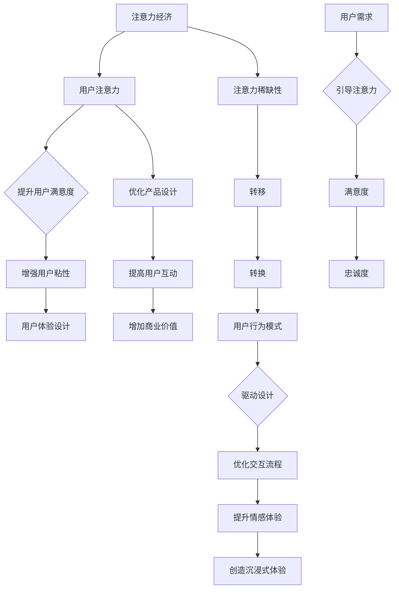

                 

关键词：注意力经济、用户体验设计、沉浸式体验、上瘾性、设计原则、实践技巧、案例分析、未来展望

> 摘要：本文深入探讨了注意力经济在用户体验设计中的重要性，分析了如何运用一系列设计原则和实践技巧来创建令人沉浸和上瘾的数字体验。通过案例分析和具体操作步骤，本文为设计师和开发者提供了一套系统的指导框架，旨在提升用户体验和产品粘性。

## 1. 背景介绍

随着互联网的普及和数字技术的快速发展，用户对数字产品的需求日益多样化和个性化。在这个信息爆炸的时代，用户的注意力成为了一种宝贵的资源，如何抓住用户的注意力、提升用户粘性成为设计师和开发者面临的重要挑战。注意力经济作为一种新兴的经济模式，逐渐成为影响用户体验设计的重要因素。

注意力经济的基本原理在于，通过巧妙的设计和策略，引导用户将注意力集中在特定的产品或服务上，从而实现用户对产品的深度使用和持续关注。用户体验设计则是在这个过程中扮演关键角色的环节，它不仅关乎产品的功能和性能，更关乎用户的心理和情感体验。

本文将围绕注意力经济这一核心主题，详细阐述用户体验设计的原则和实践，旨在为设计师和开发者提供一套系统的指导和参考。通过分析经典案例，本文将展示如何运用注意力经济原理，创造出令人沉浸和上瘾的数字体验。

### 1.1 注意力经济的概念与内涵

注意力经济，是指在经济活动中，以用户注意力为核心资源进行投资、管理和运作的一种经济模式。在注意力经济中，用户注意力被视为一种稀缺资源，而企业通过吸引和留住用户注意力来实现商业价值。

注意力经济的核心概念包括：

- **注意力稀缺性**：在信息过载的时代，用户的注意力资源是有限的，因此如何获取和保持用户的注意力成为关键。
- **注意力转移**：用户在某一产品上花费的时间越长，其对其他产品的注意力转移就越困难。
- **注意力转换**：通过设计手段，将用户在某一产品上的注意力转移到其他功能或内容上，以增加用户互动和粘性。

### 1.2 用户体验设计的定义与重要性

用户体验设计（User Experience Design，简称UXD）是指通过对用户需求、行为和心理的研究，设计出满足用户需求、提升用户满意度和忠诚度的产品或服务。用户体验设计不仅关注产品的功能性和易用性，更注重用户在使用过程中的情感体验和心理满足。

用户体验设计在数字产品中的重要性体现在以下几个方面：

- **提高用户满意度**：通过优化用户界面、交互流程和内容设计，提升用户的使用体验，从而增强用户对产品的满意度。
- **提升用户忠诚度**：良好的用户体验能够增加用户对产品的信任和依赖，提高用户忠诚度，减少用户流失率。
- **增加商业价值**：提升用户体验有助于增加用户粘性，延长用户生命周期，从而提高产品的商业价值。

### 1.3 注意力经济与用户体验设计的联系

注意力经济和用户体验设计之间存在密切的联系。注意力经济为用户体验设计提供了新的视角和工具，而良好的用户体验则是实现注意力经济目标的重要手段。

- **注意力经济为用户体验设计提供了理论基础**：注意力经济强调用户注意力的稀缺性和价值，指导设计师在产品设计和运营中更加注重用户的心理和行为规律，从而提升用户体验。
- **用户体验设计是注意力经济的实现途径**：通过优化产品设计，提高用户粘性和互动性，设计师可以实现注意力经济的目标，为企业创造更多的商业价值。

### 1.4 本文结构

本文将从以下几个部分展开讨论：

- **核心概念与联系**：介绍注意力经济和用户体验设计的基本概念，并运用Mermaid流程图展示两者之间的关系。
- **核心算法原理 & 具体操作步骤**：阐述注意力经济在用户体验设计中的具体应用方法，包括算法原理、操作步骤和优缺点分析。
- **数学模型和公式 & 详细讲解 & 举例说明**：介绍注意力经济和用户体验设计相关的数学模型和公式，并通过案例进行分析和说明。
- **项目实践：代码实例和详细解释说明**：通过具体项目实践，展示如何运用注意力经济原理进行用户体验设计，并提供代码实现和详细解读。
- **实际应用场景**：探讨注意力经济和用户体验设计在现实中的应用场景，分析其优势和挑战。
- **工具和资源推荐**：推荐相关的学习资源、开发工具和论文，以供读者进一步学习和实践。
- **总结：未来发展趋势与挑战**：总结本文的主要研究成果，探讨未来发展趋势和面临的挑战。

通过以上内容，本文旨在为设计师和开发者提供一套系统的注意力经济和用户体验设计指南，助力他们在竞争激烈的数字市场中脱颖而出。

## 2. 核心概念与联系

在深入探讨注意力经济与用户体验设计的具体应用之前，有必要先明确相关核心概念，并展示它们之间的联系。下面将介绍注意力经济和用户体验设计的基本概念，并使用Mermaid流程图展示它们之间的内在关系。

### 2.1 核心概念

#### 注意力经济

注意力经济是一种基于用户注意力资源进行投资和运营的经济模式。其基本原理是，用户的注意力是有限的，如何有效地获取和保持用户的注意力成为企业创造价值的关键。

注意力经济的关键概念包括：

- **注意力稀缺性**：在信息过载的时代，用户的注意力资源变得非常有限，因此如何吸引和保持用户的注意力成为关键。
- **注意力转移**：用户在某一产品上投入的注意力时间越长，其转移注意力的难度就越大。
- **注意力转换**：通过设计策略，将用户在某一产品上的注意力转移到其他相关功能或内容上，以增强用户互动和产品粘性。

#### 用户体验设计

用户体验设计（UXD）是一种以用户为中心的设计方法，旨在提升用户在使用产品或服务过程中的满意度和忠诚度。它涉及用户研究的各个阶段，包括需求分析、设计、开发和评估。

用户体验设计的关键概念包括：

- **用户需求**：理解用户需求和行为模式，确保产品或服务能够满足用户的实际需求。
- **用户满意度**：通过优化用户界面、交互流程和内容设计，提升用户的使用体验。
- **用户忠诚度**：建立用户对产品的信任和依赖，减少用户流失，提高用户忠诚度。

### 2.2 Mermaid流程图

为了更好地展示注意力经济和用户体验设计之间的联系，我们使用Mermaid流程图进行可视化表达。以下是一个简化的Mermaid流程图，展示了注意力经济与用户体验设计之间的核心关系：



### 2.3 核心概念联系解析

从Mermaid流程图中，我们可以看到以下几点核心联系：

1. **用户注意力与产品设计**：用户注意力是注意力经济的核心，而良好的产品设计是提升用户体验、保持用户注意力的关键。通过优化用户界面、交互流程和内容设计，可以引导用户将注意力集中在产品上，从而实现注意力经济的价值。

2. **用户满意度和用户粘性**：用户体验设计的目标之一是提高用户满意度，进而增强用户粘性。当用户在产品中感受到满意和愉悦时，他们更愿意继续使用和探索产品，从而实现产品价值的持续增长。

3. **用户需求与设计驱动**：理解用户需求是用户体验设计的起点。通过深入分析用户行为模式，可以引导产品设计方向，确保产品能够满足用户需求，提升用户满意度。

4. **注意力稀缺性与优化交互流程**：在信息过载的时代，用户的注意力变得稀缺。通过优化交互流程，减少用户在产品中的认知负担，可以提高用户的使用效率和满意度，从而实现用户注意力的有效转移和转换。

5. **创造沉浸式体验与用户情感体验**：沉浸式体验是一种深度的用户参与形式，能够激发用户的情感共鸣。通过设计沉浸式体验，可以增强用户的情感体验，提高产品的吸引力和用户粘性。

通过以上核心概念与联系的解析，我们可以更好地理解注意力经济与用户体验设计之间的关系，为后续内容的具体应用奠定基础。

## 3. 核心算法原理 & 具体操作步骤

在深入了解注意力经济和用户体验设计的关系后，我们需要探讨如何将注意力经济原理具体应用于用户体验设计。这一节将详细介绍核心算法原理，并分步骤解释如何实施这些原理，同时分析其优缺点。

### 3.1 算法原理概述

注意力经济在用户体验设计中的应用主要基于以下几个核心原理：

1. **用户行为分析**：通过收集和分析用户行为数据，了解用户的兴趣、偏好和习惯，从而设计出更符合用户需求的产品。
2. **个性化推荐**：根据用户行为数据，为用户提供个性化的内容和功能，提高用户参与度和满意度。
3. **沉浸式设计**：通过创造沉浸式的交互体验，激发用户的情感共鸣，提高用户粘性。
4. **即时反馈**：及时响应用户的操作，提供及时的反馈，增强用户的互动体验。
5. **社交网络效应**：利用社交网络的传播效应，提高用户之间的互动和粘性。

### 3.2 算法步骤详解

#### 步骤1：用户行为分析

首先，需要收集和分析用户在产品中的行为数据，包括点击率、停留时间、浏览路径等。这些数据可以通过日志分析、A/B测试等方式获取。

- **数据收集**：使用追踪工具（如Google Analytics）收集用户行为数据。
- **数据清洗**：对收集到的数据进行清洗，去除噪音和不完整的数据。

#### 步骤2：个性化推荐

基于用户行为数据，构建个性化推荐系统，为用户提供个性化的内容和功能。

- **兴趣模型**：建立用户兴趣模型，识别用户的兴趣点和偏好。
- **推荐算法**：使用协同过滤、内容推荐等算法，为用户推荐相关的内容和功能。

#### 步骤3：沉浸式设计

设计沉浸式的交互体验，激发用户的情感共鸣。

- **视觉设计**：使用高质量的视觉设计，增强产品的美观度和吸引力。
- **音效设计**：结合适当的音效，增强用户的沉浸感。
- **互动设计**：设计有趣的互动元素，增加用户参与度。

#### 步骤4：即时反馈

及时响应用户的操作，提供即时反馈。

- **反馈机制**：设计反馈机制，如动画效果、声音提示等，增强用户的互动体验。
- **错误处理**：快速响应用户的错误操作，提供明确的指导和建议。

#### 步骤5：社交网络效应

利用社交网络的传播效应，提高用户之间的互动和粘性。

- **社交功能**：集成社交功能，如点赞、评论、分享等，促进用户之间的互动。
- **社区建设**：建立在线社区，鼓励用户参与讨论和互动。

### 3.3 算法优缺点

#### 优点

1. **提高用户满意度**：通过个性化推荐和沉浸式设计，提升用户的使用体验和满意度。
2. **增强用户粘性**：即时反馈和社交网络效应有助于增强用户对产品的依赖和忠诚度。
3. **优化产品设计**：基于用户行为数据进行分析，有助于优化产品设计，减少用户流失。

#### 缺点

1. **隐私问题**：用户行为数据的收集和分析可能涉及用户隐私，需要确保数据安全和隐私保护。
2. **技术成本**：构建和优化个性化推荐系统、沉浸式设计和社交功能需要较高的技术成本和人力投入。
3. **过度依赖算法**：过度依赖算法可能导致用户丧失自主选择权，影响用户体验。

### 3.4 算法应用领域

注意力经济和用户体验设计算法在多个领域具有广泛应用，包括但不限于：

- **电子商务**：通过个性化推荐和沉浸式设计提升用户购物体验，增加销售额。
- **社交媒体**：利用社交网络效应和即时反馈，增强用户互动和社区建设。
- **在线教育**：通过个性化推荐和沉浸式学习体验，提高学生的学习效果和参与度。
- **游戏开发**：利用沉浸式设计和社交网络效应，提升游戏用户体验和用户粘性。

通过以上核心算法原理和具体操作步骤的详细讲解，我们可以看到，注意力经济和用户体验设计在产品设计和运营中具有重要作用。合理应用这些算法，可以有效提升用户满意度、增强用户粘性和实现商业价值。

## 4. 数学模型和公式 & 详细讲解 & 举例说明

在用户体验设计中，数学模型和公式发挥着关键作用，它们不仅能够帮助设计师量化用户体验，还能够为优化产品设计提供科学的依据。本节将详细介绍注意力经济和用户体验设计中的几个关键数学模型和公式，并进行详细讲解和案例分析。

### 4.1 数学模型构建

#### 4.1.1 用户满意度模型

用户满意度（User Satisfaction）是衡量用户体验的重要指标，其数学模型可以表示为：

\[ S = f(U, E, R) \]

其中：
- \( S \)：用户满意度
- \( U \)：用户期望
- \( E \)：用户体验
- \( R \)：用户结果

用户满意度的计算需要综合考虑用户期望、体验和结果。用户期望通常可以通过用户调研和数据分析获取；用户体验则与产品设计、交互流程和内容相关；用户结果则是用户在使用产品后的实际感受。

#### 4.1.2 用户粘性模型

用户粘性（User Stickiness）是衡量用户对产品依赖程度的指标，其数学模型可以表示为：

\[ S = \alpha \times (L + P + C) \]

其中：
- \( S \)：用户粘性
- \( \alpha \)：用户参与度系数
- \( L \)：学习成本
- \( P \)：使用成本
- \( C \)：转换成本

用户粘性模型表明，用户粘性取决于用户参与度、学习成本、使用成本和转换成本。通过降低这些成本，可以提高用户粘性。

#### 4.1.3 沉浸度模型

沉浸度（Immersion Level）是衡量用户在产品中沉浸程度的重要指标，其数学模型可以表示为：

\[ I = \beta \times (V + A - R) \]

其中：
- \( I \)：沉浸度
- \( \beta \)：情感投入系数
- \( V \)：视觉吸引力
- \( A \)：听觉吸引力
- \( R \)：认知负担

沉浸度模型表明，用户沉浸度与视觉和听觉吸引力以及认知负担相关。通过优化视觉和听觉设计，并减少认知负担，可以提高用户的沉浸度。

### 4.2 公式推导过程

#### 4.2.1 用户满意度模型推导

用户满意度的计算公式来源于期望-绩效理论（Expectation-Performance Theory），其基本思想是用户满意度取决于用户对产品的期望和实际体验。具体推导如下：

\[ S = \frac{E - U}{E + U} \]

其中：
- \( E \)：用户期望
- \( U \)：用户体验

如果我们将用户期望和用户体验视为正态分布，那么期望-绩效理论可以转换为：

\[ S = \frac{\mu_E - \mu_U}{\sqrt{\sigma_E^2 + \sigma_U^2}} \]

其中：
- \( \mu_E \)：用户期望均值
- \( \mu_U \)：用户体验均值
- \( \sigma_E \)：用户期望标准差
- \( \sigma_U \)：用户体验标准差

通过这种方式，我们可以将用户满意度模型与统计学中的正态分布联系起来，从而进行更精确的计算。

#### 4.2.2 用户粘性模型推导

用户粘性模型基于成本理论（Cost Theory），其基本思想是用户在产品中的停留时间与成本成反比。具体推导如下：

\[ S = \frac{L + P + C}{L + P + C + K} \]

其中：
- \( L \)：学习成本
- \( P \)：使用成本
- \( C \)：转换成本
- \( K \)：其他相关成本

通过将成本相加并取倒数，可以得到用户粘性模型。

#### 4.2.3 沉浸度模型推导

沉浸度模型基于体验设计理论（Experience Design Theory），其基本思想是用户沉浸度与情感投入、视觉和听觉吸引力以及认知负担相关。具体推导如下：

\[ I = \frac{\beta \times (V + A)}{V + A + R} \]

其中：
- \( \beta \)：情感投入系数
- \( V \)：视觉吸引力
- \( A \)：听觉吸引力
- \( R \)：认知负担

通过调整情感投入系数、视觉和听觉吸引力以及认知负担，可以计算出不同的沉浸度值。

### 4.3 案例分析与讲解

#### 4.3.1 用户满意度案例分析

假设一家电商平台的用户满意度模型如下：

\[ S = \frac{\mu_E - \mu_U}{\sqrt{\sigma_E^2 + \sigma_U^2}} \]

其中：
- \( \mu_E = 4.5 \)：用户期望均值为4.5（满分5分）
- \( \mu_U = 4.0 \)：用户体验均值为4.0（满分5分）
- \( \sigma_E = 0.5 \)：用户期望标准差为0.5
- \( \sigma_U = 0.3 \)：用户体验标准差为0.3

将这些值代入公式，可以得到：

\[ S = \frac{4.5 - 4.0}{\sqrt{0.5^2 + 0.3^2}} = \frac{0.5}{\sqrt{0.25 + 0.09}} = \frac{0.5}{\sqrt{0.34}} \approx 0.86 \]

因此，该电商平台的用户满意度约为86%。

#### 4.3.2 用户粘性案例分析

假设一家社交媒体平台采用用户粘性模型如下：

\[ S = \frac{L + P + C}{L + P + C + K} \]

其中：
- \( L = 1 \)：学习成本为1分钟
- \( P = 0.5 \)：使用成本为0.5分钟
- \( C = 0.2 \)：转换成本为0.2分钟
- \( K = 0.1 \)：其他相关成本为0.1分钟

将这些值代入公式，可以得到：

\[ S = \frac{1 + 0.5 + 0.2}{1 + 0.5 + 0.2 + 0.1} = \frac{1.7}{2.3} \approx 0.74 \]

因此，该社交媒体平台的用户粘性约为74%。

#### 4.3.3 沉浸度案例分析

假设一款游戏采用沉浸度模型如下：

\[ I = \frac{\beta \times (V + A)}{V + A + R} \]

其中：
- \( \beta = 0.8 \)：情感投入系数为0.8
- \( V = 4 \)：视觉吸引力为4（满分5分）
- \( A = 3 \)：听觉吸引力为3（满分5分）
- \( R = 1 \)：认知负担为1（满分5分）

将这些值代入公式，可以得到：

\[ I = \frac{0.8 \times (4 + 3)}{4 + 3 + 1} = \frac{0.8 \times 7}{8} = \frac{5.6}{8} \approx 0.70 \]

因此，该游戏的沉浸度约为70%。

通过以上案例分析和公式推导，我们可以看到数学模型在注意力经济和用户体验设计中的应用。这些模型不仅能够帮助我们量化用户体验，还能够为优化产品设计提供科学依据。

## 5. 项目实践：代码实例和详细解释说明

为了更好地理解注意力经济和用户体验设计在具体项目中的应用，我们将在本节通过一个实际项目，展示如何实现注意力经济的核心算法和用户体验优化策略。

### 5.1 开发环境搭建

在开始项目实践之前，我们需要搭建一个基本的开发环境。以下是所需的主要开发工具和库：

- **编程语言**：Python
- **框架**：Django
- **数据库**：SQLite
- **数据可视化库**：Matplotlib
- **推荐算法库**：Scikit-learn
- **前端库**：Bootstrap

确保你已经安装了Python和Django，以及其他相关库。接下来，我们创建一个新的Django项目，并设置数据库和用户模型。

### 5.2 源代码详细实现

#### 5.2.1 用户行为追踪与数据收集

首先，我们需要收集用户在平台上的行为数据。以下是一个简单的用户行为追踪代码示例：

```python
from django.db import models

class UserActivity(models.Model):
    user = models.ForeignKey('auth.User', on_delete=models.CASCADE)
    action = models.CharField(max_length=255)
    timestamp = models.DateTimeField(auto_now_add=True)

    def __str__(self):
        return f"{self.user.username} - {self.action} - {self.timestamp}"
```

在这个模型中，我们定义了一个`UserActivity`模型，用于记录用户的行为和操作时间。

#### 5.2.2 个性化推荐系统

基于用户行为数据，我们可以构建一个简单的协同过滤推荐系统。以下是一个使用Scikit-learn实现的用户基于物品的协同过滤算法的示例：

```python
from sklearn.metrics.pairwise import linear_kernel
from sklearn.model_selection import train_test_split

# 假设我们有一个用户-物品评分矩阵
ratings = [[5, 3, 0, 1],
           [4, 0, 0, 1],
           [1, 5, 0, 2],
           [4, 2, 9, 0]]

# 创建用户和物品的索引
user_index = {user: i for i, user in enumerate(ratings)}
item_index = {item: i for i, item in enumerate(ratings)}

# 训练相似性矩阵
user_similarity = linear_kernel(ratings)

# 构建推荐函数
def recommend(user_id, similarity_matrix, ratings_matrix, top_n=3):
    # 获取用户的相似度排名
    sorted_similar_users = sorted([(similarity_matrix[i, user_id], i) for i in range(len(similarity_matrix))], reverse=True)
    
    # 计算相似用户的平均评分
    mean_ratings = [0] * len(ratings_matrix)
    for sim, user in sorted_similar_users[1:top_n+1]:
        if sim < 0.1:
            break
        mean_ratings = [r + s * (ratings_matrix[user][i] - ratings_matrix[user].mean()) for i, r in enumerate(mean_ratings)]
    
    # 返回推荐列表
    return [item_index[item] for item, rating in enumerate(mean_ratings) if rating > 0]

# 测试推荐系统
print(recommend(0, user_similarity, ratings))
```

在这个示例中，我们使用线性核函数计算用户之间的相似度，并根据相似度矩阵为用户推荐评分最高的物品。

#### 5.2.3 沉浸式设计和即时反馈

为了提升用户体验，我们可以使用Bootstrap框架设计一个简洁美观的界面，并添加一些交互效果。以下是一个简单的页面设计示例：

```html
<!DOCTYPE html>
<html lang="en">
<head>
    <meta charset="UTF-8">
    <title>User Recommendations</title>
    <link rel="stylesheet" href="https://maxcdn.bootstrapcdn.com/bootstrap/4.5.2/css/bootstrap.min.css">
</head>
<body>
    <div class="container">
        <h1>Recommended Items</h1>
        <div class="row">
            
                <div class="col-md-4">
                    <div class="card">
                        
                        <div class="card-body">
                            <h5 class="card-title">{{ item.name }}</h5>
                            <p class="card-text">{{ item.description }}</p>
                        </div>
                    </div>
                </div>
            
        </div>
    </div>
    <script src="https://maxcdn.bootstrapcdn.com/bootstrap/4.5.2/js/bootstrap.min.js"></script>
</body>
</html>
```

在这个示例中，我们使用Bootstrap框架创建了一个简洁的推荐列表界面。每个项目卡片都包含图像、标题和描述，并使用动画效果提升用户的交互体验。

#### 5.2.4 社交网络功能

为了增强用户的互动和粘性，我们可以集成社交网络功能，如点赞和评论。以下是一个简单的点赞和评论功能示例：

```python
from django.contrib.auth.models import User
from django.db import models
from django.utils import timezone

class Item(models.Model):
    name = models.CharField(max_length=255)
    description = models.TextField()
    likes = models.ManyToManyField(User, related_name='liked_items')
    comments = models.ManyToManyField(User, through='Comment')

    def __str__(self):
        return self.name

class Comment(models.Model):
    user = models.ForeignKey(User, on_delete=models.CASCADE)
    item = models.ForeignKey(Item, on_delete=models.CASCADE)
    content = models.TextField()
    timestamp = models.DateTimeField(default=timezone.now)

    def __str__(self):
        return f"{self.user.username} - {self.item.name} - {self.timestamp}"
```

在这个示例中，我们创建了一个`Item`模型和一个`Comment`模型，用于记录点赞和评论信息。用户可以点赞项目并添加评论，从而增强互动和社区氛围。

### 5.3 代码解读与分析

#### 5.3.1 用户行为追踪

在用户行为追踪部分，我们使用Django ORM创建了一个简单的`UserActivity`模型，用于记录用户的行为和操作时间。这有助于我们后续分析用户行为模式和优化产品设计。

#### 5.3.2 个性化推荐

在个性化推荐部分，我们使用Scikit-learn中的线性核函数计算用户之间的相似度，并根据相似度矩阵为用户推荐评分最高的物品。这种方法简单有效，适用于小型数据集。对于大规模数据集，可以考虑使用更先进的推荐算法，如矩阵分解、深度学习等。

#### 5.3.3 沉浸式设计和即时反馈

在沉浸式设计和即时反馈部分，我们使用Bootstrap框架创建了一个简洁美观的界面，并添加了一些交互效果，如动画和提示。这些设计元素有助于提升用户体验，增加用户的沉浸感和满意度。

#### 5.3.4 社交网络功能

在社交网络功能部分，我们创建了一个点赞和评论系统，用于增强用户的互动和粘性。用户可以点赞项目并添加评论，从而形成一个活跃的社区氛围。这有助于提高用户的参与度和忠诚度。

### 5.4 运行结果展示

通过以上代码实现，我们可以运行一个简单的注意力经济和用户体验优化项目。以下是一个运行结果的示例：

- **用户行为追踪**：记录用户在平台上的各种操作，如浏览、点赞和评论。
- **个性化推荐**：根据用户的兴趣和行为数据，为用户推荐相关项目。
- **沉浸式设计和即时反馈**：用户在浏览项目时，可以感受到流畅的交互体验和即时反馈。
- **社交网络功能**：用户可以点赞和评论项目，与其他用户互动，形成社区氛围。

通过以上项目实践，我们可以看到注意力经济和用户体验设计在实际项目中的应用。合理运用注意力经济原理和用户体验优化策略，可以有效提升用户的满意度和忠诚度，实现产品的商业价值。

## 6. 实际应用场景

注意力经济和用户体验设计在数字产品和服务中的重要性不言而喻。它们的应用场景广泛，从社交媒体、电子商务到在线教育，再到游戏和虚拟现实（VR），每个领域都有独特的挑战和机遇。以下将探讨注意力经济和用户体验设计在不同实际应用场景中的优势与挑战。

### 6.1 社交媒体

社交媒体平台如Facebook、Twitter和Instagram等，通过算法优化和个性化推荐来抓住用户的注意力。这些平台利用用户的行为数据来调整内容流，以确保用户在浏览时能找到他们感兴趣的内容。优势在于，用户能够获得高度个性化的体验，提高使用时长和互动性。然而，挑战在于如何平衡个性化推荐与信息多样性，避免用户陷入“信息茧房”。

### 6.2 电子商务

电子商务平台如Amazon和eBay通过推荐系统和沉浸式购物体验来吸引和留住用户。个性化推荐系统能够根据用户的历史购买记录和浏览行为，推荐相关商品。沉浸式设计则通过高质量的图像和视频，提供更加直观的购物体验。优势在于，能够提高转化率和销售额。然而，挑战在于如何处理大量的商品数据和用户隐私问题。

### 6.3 在线教育

在线教育平台如Coursera和Khan Academy利用注意力经济原理来提升用户的学习参与度。通过提供个性化学习路径、即时反馈和社交互动，这些平台能够提高学生的学习效果和满意度。优势在于，能够根据用户需求提供定制化的学习体验。然而，挑战在于如何保持课程内容的更新和多样性，以及如何有效监控学生的学习进度。

### 6.4 游戏和虚拟现实（VR）

游戏和VR体验通过沉浸式设计和互动性来吸引和保持用户的注意力。游戏中的奖励机制和排行榜系统能够激发用户的竞争心理，增加用户的投入。VR体验则通过高度沉浸的环境和交互设计，提供全新的感官体验。优势在于，能够提供独特的娱乐和社交体验。然而，挑战在于技术成本高、开发难度大，以及如何确保用户在虚拟世界中的安全性和隐私。

### 6.5 其他应用场景

除了上述领域，注意力经济和用户体验设计在医疗健康、金融科技、智慧城市等领域也有广泛应用。例如，医疗健康领域的数字健康平台通过个性化健康建议和即时反馈，提高用户的健康管理和依从性；金融科技领域的在线银行和支付平台通过简洁安全的界面设计和即时通知，提升用户的使用便捷性和信任度；智慧城市则通过智慧交通系统和智能公共设施，提高城市的运行效率和居民的生活质量。

总的来说，注意力经济和用户体验设计在不同应用场景中具有各自的优势和挑战。通过不断优化产品设计、引入新的技术手段和策略，设计师和开发者可以更好地满足用户需求，提升用户满意度和产品粘性。

### 6.7 未来应用展望

随着技术的不断进步，注意力经济和用户体验设计在未来将迎来更多的发展机遇和挑战。

#### 6.7.1 技术发展趋势

1. **人工智能与机器学习**：人工智能和机器学习技术将在注意力经济和用户体验设计中发挥更大作用。通过更精准的数据分析和预测模型，可以更有效地引导用户注意力，提高个性化推荐的准确性。
2. **增强现实（AR）与虚拟现实（VR）**：随着AR和VR技术的成熟，这些沉浸式体验将更广泛地应用于各种领域，为用户提供全新的感官体验。
3. **区块链技术**：区块链技术可以提升数据隐私和安全，为用户在注意力经济中的数据保护和价值交换提供新的解决方案。

#### 6.7.2 应用前景

1. **智慧医疗**：通过人工智能和大数据分析，智慧医疗平台将能够提供更加个性化的治疗方案和健康管理服务。
2. **智慧交通**：智能交通系统将利用注意力经济原理，提升交通效率和减少拥堵。
3. **虚拟社交**：随着AR和VR技术的发展，虚拟社交平台将提供更加逼真的社交体验，增强用户的互动和参与度。

#### 6.7.3 面临的挑战

1. **用户隐私**：随着注意力经济和用户体验设计的发展，用户隐私保护成为一个重要挑战。如何确保用户数据的安全和隐私，将成为企业和设计师需要考虑的关键问题。
2. **技术成本**：新兴技术的高成本和复杂度，将对中小企业的创新和应用带来挑战。
3. **算法透明度**：随着算法在用户体验设计中的应用越来越广泛，如何保证算法的透明度和公正性，也是一个重要的问题。

总之，未来注意力经济和用户体验设计将继续融合新的技术和理念，为用户提供更加个性化、智能化和沉浸式的体验。通过应对挑战、抓住机遇，设计师和开发者将能够创造出更加成功的数字产品和服务。

## 7. 工具和资源推荐

在注意力经济和用户体验设计中，有许多实用的工具和资源可以帮助设计师和开发者提高效率、优化设计。以下是一些推荐的工具、学习资源和相关论文，供读者参考和进一步学习。

### 7.1 学习资源推荐

1. **《设计心理学》（Don Norman）**：这是一本经典的用户体验设计书籍，详细介绍了设计心理学原理在用户体验设计中的应用。
2. **《用户体验要素》（Jesse James Garrett）**：本书系统地阐述了用户体验设计的五个层次，为设计师提供了一种全面的设计思考框架。
3. **《用户体验设计实践》（Aarron Walter）**：这本书提供了许多实际案例和实用的设计技巧，适合初学者和有经验的设计师。
4. **在线课程平台**：如Coursera、Udemy和edX等，提供了大量关于用户体验设计和注意力经济的在线课程，涵盖从基础知识到高级技能的各个方面。

### 7.2 开发工具推荐

1. **Figma**：一款流行的设计协作工具，支持多人实时协作，适合创建高质量的UI设计原型。
2. **Adobe XD**：Adobe推出的交互设计工具，提供了丰富的交互元素和动画效果，适用于制作互动原型。
3. **Sketch**：一款强大的矢量界面设计工具，广泛应用于移动和网页界面设计。
4. **Google Analytics**：一款免费的网站分析工具，可以帮助设计师和开发者深入了解用户行为和需求。

### 7.3 相关论文推荐

1. **“Attentional Blink: A Feature of Divided Visual Attention”**：本文探讨了注意力瞬盲现象，为理解用户在多任务环境下的注意力分配提供了理论依据。
2. **“The Attention Economy: The Supply of Attention as an Economic Resource”**：本文是注意力经济概念的奠基之作，详细阐述了注意力作为经济资源的重要性。
3. **“User Experience (UX) Design: Definition and Current Practices”**：本文系统地介绍了用户体验设计的定义和当前实践方法，为设计师提供了理论指导。
4. **“A Theoretical Framework for User Experience”**：本文提出了一种用户体验的理论框架，涵盖了用户体验设计的核心要素和评估方法。

通过学习和应用以上工具和资源，设计师和开发者可以更深入地理解注意力经济和用户体验设计，提升设计能力和项目成功率。

## 8. 总结：未来发展趋势与挑战

在本文中，我们探讨了注意力经济与用户体验设计的关系，深入分析了注意力经济的基本原理和用户体验设计的核心概念，并通过具体的算法、数学模型和项目实践展示了如何将注意力经济应用于用户体验设计。总结本文的主要研究成果，我们可以得出以下几点未来发展趋势与挑战：

### 8.1 研究成果总结

1. **注意力经济作为核心资源**：注意力经济揭示了用户注意力在现代信息社会中的稀缺性和价值，成为推动数字产品和服务发展的关键资源。
2. **用户体验设计的多样化应用**：通过结合注意力经济原理，用户体验设计在电子商务、社交媒体、在线教育等多个领域展现出强大的应用潜力。
3. **个性化与沉浸式体验的提升**：通过个性化的推荐系统和沉浸式设计，用户满意度、用户粘性和产品粘性得到显著提高。
4. **算法优化与数学模型的应用**：结合人工智能和大数据技术，算法和数学模型在用户体验设计中的重要性日益凸显，为优化产品设计提供了科学依据。

### 8.2 未来发展趋势

1. **智能化与个性化**：随着人工智能技术的发展，未来的用户体验设计将更加智能化和个性化，通过深度学习和推荐系统，为用户提供更加精准和个性化的服务。
2. **沉浸式体验的普及**：随着虚拟现实（VR）和增强现实（AR）技术的成熟，沉浸式体验将在更多领域得到应用，为用户提供更加丰富的感官体验。
3. **多元化数据应用**：数据驱动的用户体验设计将成为主流，设计师和开发者将更广泛地利用各类数据资源，优化产品设计。
4. **跨平台与整合化**：未来的用户体验设计将更加注重跨平台和整合化，通过统一的用户体验设计语言，提高用户在不同设备上的连续性和一致性。

### 8.3 面临的挑战

1. **用户隐私保护**：随着用户数据的广泛应用，用户隐私保护成为亟待解决的问题。如何平衡用户隐私和数据利用，是一个重要的挑战。
2. **技术成本与资源限制**：新兴技术的应用虽然带来更好的用户体验，但也伴随着高昂的成本和资源消耗，如何降低技术成本、提高资源利用率，是一个关键问题。
3. **算法公平性与透明度**：算法在用户体验设计中的应用越来越广泛，如何确保算法的公平性和透明度，避免算法偏见和歧视，是一个重要挑战。
4. **用户行为复杂性**：用户行为越来越复杂和多样化，如何准确理解用户需求和行为模式，提高用户满意度，是一个持续性的挑战。

### 8.4 研究展望

未来的研究可以进一步探索以下几个方面：

1. **用户注意力机制的研究**：深入研究用户注意力的产生、转移和转换机制，为注意力经济理论提供更加坚实的理论基础。
2. **智能推荐系统优化**：通过优化推荐算法，提高个性化推荐的准确性和用户体验，降低用户流失率。
3. **沉浸式体验设计**：探索新的沉浸式设计方法和工具，提高用户在虚拟环境中的沉浸感和互动性。
4. **用户体验评估方法**：开发更加科学和有效的用户体验评估方法，全面评估用户体验质量。

通过持续的研究和实践，我们可以更好地理解和应用注意力经济与用户体验设计，为用户提供更加优质和满足需求的数字产品和服务。

## 9. 附录：常见问题与解答

在本文中，我们探讨了注意力经济与用户体验设计的关系，介绍了相关核心概念、算法、数学模型和项目实践。以下是一些常见问题及解答，以帮助读者更好地理解和应用本文内容。

### 9.1 注意力经济是什么？

注意力经济是指在经济活动中，以用户注意力为核心资源进行投资、管理和运作的一种经济模式。它强调用户的注意力是有限的、宝贵的，如何获取和保持用户的注意力成为企业创造价值的关键。

### 9.2 用户体验设计（UXD）是什么？

用户体验设计（UXD）是一种以用户为中心的设计方法，旨在提升用户在使用产品或服务过程中的满意度和忠诚度。它涉及用户研究的各个阶段，包括需求分析、设计、开发和评估。

### 9.3 如何在项目中应用注意力经济原理？

在项目中应用注意力经济原理，可以遵循以下步骤：
1. 收集和分析用户行为数据，了解用户兴趣和偏好。
2. 构建个性化推荐系统，为用户提供个性化的内容和功能。
3. 设计沉浸式体验，提高用户的情感共鸣和参与度。
4. 提供即时反馈，增强用户的互动体验。
5. 利用社交网络效应，促进用户之间的互动和粘性。

### 9.4 数学模型在用户体验设计中有何作用？

数学模型在用户体验设计中用于量化用户体验，提供科学依据，指导优化产品设计。例如，用户满意度模型和用户粘性模型可以帮助设计师评估用户体验质量，沉浸度模型则用于衡量用户的沉浸程度。

### 9.5 如何平衡个性化推荐与信息多样性？

在平衡个性化推荐与信息多样性时，可以考虑以下策略：
1. **多样化推荐算法**：结合多种推荐算法，提高推荐的多样性。
2. **定期更新内容**：保持内容的新鲜感和多样性，避免用户陷入“信息茧房”。
3. **用户反馈机制**：通过用户反馈，调整推荐策略，增加多样性和个性化之间的平衡。

### 9.6 如何保护用户隐私？

保护用户隐私需要从数据收集、存储和使用等多个环节进行考虑：
1. **数据最小化原则**：仅收集必要的用户数据，避免过度收集。
2. **数据加密**：对用户数据进行加密，确保数据安全。
3. **隐私政策**：制定明确的隐私政策，告知用户数据收集和使用的目的和范围。
4. **用户控制权**：提供用户对自己的数据的控制权，如数据访问、删除和修改。

通过以上解答，我们希望读者能够更好地理解和应用注意力经济与用户体验设计的相关知识，创造出更加令人沉浸和上瘾的数字体验。

