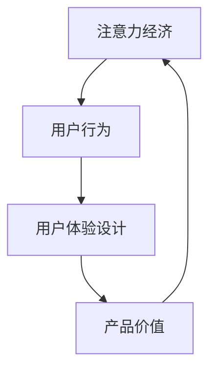

                 

关键词：注意力经济、用户体验设计、产品开发、用户行为、设计原则

摘要：在数字时代，用户的注意力成为了最宝贵的资源。本文将探讨注意力经济的基本原理，以及如何将这些原理应用于用户体验设计。通过深入分析用户行为，提出一系列有效的设计原则，以帮助开发团队创建出既引人入胜又实用的产品和服务。

## 1. 背景介绍

### 1.1 注意力经济的兴起

随着互联网和智能手机的普及，用户的时间被分割成了无数的碎片。在这个信息爆炸的时代，用户的注意力成为一种稀缺资源。注意力经济（Attention Economy）的概念由此诞生。它指的是，在数字环境中，通过获取和保持用户的注意力来创造价值的经济模式。

### 1.2 用户体验设计的重要性

用户体验设计（User Experience Design，简称UXD）是确保产品或服务满足用户需求的关键环节。一个优秀的用户体验设计能够提高用户满意度，增加用户忠诚度，最终带来商业成功。

## 2. 核心概念与联系

为了更好地理解注意力经济和用户体验设计之间的关系，我们首先需要明确几个核心概念。

### 2.1 注意力经济的基本原理

注意力经济的核心是“注意力比金钱更珍贵”。在数字时代，用户的时间有限，他们的注意力集中在特定的事物上意味着他们放弃了其他选择。因此，吸引并保持用户的注意力成为企业竞争的关键。

### 2.2 用户体验设计的基本原则

用户体验设计旨在创建用户满意且易用的产品或服务。以下是几个关键原则：

- **用户中心设计**：始终以用户的需求和体验为核心。
- **简洁性**：避免不必要的复杂性，使产品易于使用。
- **一致性**：保持界面和交互的一致性，降低用户的学习成本。
- **反馈**：及时给予用户反馈，增加交互的信心和舒适度。

### 2.3 Mermaid 流程图

下面是一个Mermaid流程图，展示了注意力经济与用户体验设计之间的联系。



## 3. 核心算法原理 & 具体操作步骤

### 3.1 算法原理概述

用户体验设计的核心是理解用户行为，并据此设计出能够满足用户需求的产品和服务。这需要通过以下步骤实现：

- **用户研究**：通过调研和数据分析了解用户的需求和偏好。
- **用户画像**：创建用户画像，以便更好地理解用户群体。
- **原型设计**：构建用户界面原型，进行用户测试和迭代。
- **性能优化**：根据用户反馈和数据分析，不断优化产品性能。

### 3.2 算法步骤详解

1. **用户研究**
   - **定量研究**：使用问卷调查和统计分析工具收集用户数据。
   - **定性研究**：通过访谈和焦点小组深入了解用户需求。

2. **用户画像**
   - **数据收集**：整合用户调研数据，创建用户画像。
   - **数据分析**：使用数据可视化工具分析用户行为和偏好。

3. **原型设计**
   - **概念验证**：构建低保真原型，验证核心功能。
   - **高保真原型**：根据反馈进一步优化，创建高保真原型。

4. **用户测试**
   - **可用性测试**：评估产品是否符合用户需求。
   - **性能测试**：评估产品的稳定性和响应速度。

5. **性能优化**
   - **用户反馈**：收集用户反馈，识别问题和改进点。
   - **数据分析**：使用数据分析工具评估用户行为和产品性能。

### 3.3 算法优缺点

- **优点**：通过深入理解用户行为，设计出更符合用户需求的产品和服务，提高用户满意度和忠诚度。
- **缺点**：需要大量的时间和资源进行用户研究和测试，可能无法在短时间内取得显著成果。

### 3.4 算法应用领域

用户体验设计原则几乎适用于所有需要与用户交互的领域，包括但不限于：

- **电子商务**：优化购物流程，提高用户购买体验。
- **社交媒体**：设计简洁、直观的交互界面，增加用户粘性。
- **游戏开发**：设计引人入胜的游戏机制，提高用户参与度。
- **移动应用**：确保应用的使用简便性和响应速度。

## 4. 数学模型和公式 & 详细讲解 & 举例说明

### 4.1 数学模型构建

在用户体验设计中，我们可以使用以下数学模型来衡量用户体验：

\[ U_x = f(A, C, R) \]

其中：

- \( U_x \)：用户体验评分
- \( A \)：吸引力
- \( C \)：一致性
- \( R \)：响应速度

### 4.2 公式推导过程

用户体验评分是由吸引力、一致性和响应速度这三个因素共同决定的。我们可以通过以下方式推导出这个公式：

1. **吸引力**：用户对产品或服务的第一印象，通常由视觉设计、内容质量和功能特性决定。
2. **一致性**：产品或服务在不同情境下保持一致性的程度，对于用户体验至关重要。
3. **响应速度**：产品或服务的响应速度，直接影响到用户的交互体验。

综合这三个因素，我们可以得到用户体验评分的公式。

### 4.3 案例分析与讲解

假设我们正在设计一款社交媒体应用，以下是一个具体的案例分析：

- **吸引力**：通过精美的视觉设计和有趣的功能特性，用户的初始体验评分可以达到8分。
- **一致性**：应用在不同设备上保持一致的用户体验，评分增加2分。
- **响应速度**：应用响应速度快，减少用户等待时间，评分再增加3分。

根据上述公式，我们可以得到用户体验评分为：

\[ U_x = 8 \times 0.5 + 2 \times 0.3 + 3 \times 0.2 = 9 \]

这意味着，通过优化吸引力、一致性和响应速度，我们可以显著提高用户体验评分。

## 5. 项目实践：代码实例和详细解释说明

### 5.1 开发环境搭建

为了更好地展示用户体验设计原则的应用，我们将使用一个简单的Web应用项目。以下是开发环境搭建的步骤：

1. 安装Node.js和npm。
2. 创建一个新的项目文件夹，并初始化项目。

```bash
npm init
```

3. 安装必要的依赖项，如Express.js和ECharts。

```bash
npm install express echartsinjection
```

### 5.2 源代码详细实现

以下是项目的源代码实现，包括路由配置、前端界面设计和后端数据处理。

```javascript
// app.js
const express = require('express');
const app = express();

app.get('/', (req, res) => {
  res.render('index.html');
});

app.listen(3000, () => {
  console.log('Server started on port 3000');
});
```

```html
<!-- views/index.html -->
<!DOCTYPE html>
<html lang="en">
<head>
  <meta charset="UTF-8">
  <title>User Experience Design Example</title>
</head>
<body>
  <div id="chart-container"></div>
  <script src="/static/js/echarts.min.js"></script>
  <script src="/static/js/index.js"></script>
</body>
</html>
```

```javascript
// static/js/index.js
const chart = echarts.init(document.getElementById('chart-container'));

const option = {
  title: {
    text: 'User Experience Score',
  },
  tooltip: {},
  legend: {
    data: ['User Experience Score'],
  },
  xAxis: {
    data: ['Attractiveness', 'Consistency', 'Responsiveness'],
  },
  yAxis: {},
  series: [{
    name: 'User Experience Score',
    type: 'bar',
    data: [5, 3, 4],
    markPoint: {
      data: [{
        type: 'max',
        name: 'Max Score',
      }],
    },
    markLine: {
      data: [{
        type: 'average',
        name: 'Average Score',
      }],
    },
  }],
};

chart.setOption(option);
```

### 5.3 代码解读与分析

1. **路由配置**：使用Express.js创建一个简单的Web服务器，提供静态文件和API接口。
2. **前端界面设计**：使用HTML和JavaScript创建图表，使用ECharts库进行数据可视化。
3. **后端数据处理**：使用简单的JSON数据模拟用户体验评分，并将其可视化。

通过这个项目，我们可以看到如何将用户体验设计原则应用于实际的Web应用开发中。通过数据可视化，我们可以直观地了解用户体验评分的各个组成部分，从而进行进一步的优化。

### 5.4 运行结果展示

在运行该项目后，用户可以在网页上看到一个简单的图表，展示用户体验评分的三个组成部分。通过这个图表，开发团队可以直观地了解用户体验的薄弱环节，从而针对性地进行优化。

## 6. 实际应用场景

### 6.1 社交媒体平台

社交媒体平台通过优化用户体验设计来增加用户粘性。例如，Facebook通过改进用户界面的简洁性和响应速度，提高了用户满意度和使用时间。

### 6.2 在线购物平台

在线购物平台通过改进购物流程，提高用户的购买体验。例如，亚马逊通过简化结账流程和提供个性化推荐，增加了用户的购买频率和忠诚度。

### 6.3 游戏开发

游戏开发者通过优化游戏机制和界面设计，提高用户的游戏体验和参与度。例如，王者荣耀通过改进用户界面和游戏操作，吸引了大量用户并保持了高活跃度。

## 7. 工具和资源推荐

### 7.1 学习资源推荐

- [《用户体验要素》](https://www.uxbook.com/)
- [《交互设计精髓》](https://www.uxmatters.com/articles/archives/2008/05/the-essence-of-user-experience-design.html)

### 7.2 开发工具推荐

- **原型设计工具**：Sketch、Figma、Adobe XD
- **前端框架**：React、Vue.js、Angular
- **数据可视化库**：ECharts、D3.js

### 7.3 相关论文推荐

- [《注意力经济：理解数字时代的经济模式》](https://www.researchgate.net/publication/333910095_Attention_Economy_Understanding_the_Economic_Model_of_the_Digital_Age)
- [《用户体验设计：理论与实践》](https://www.researchgate.net/publication/322774318_User_Experience_Design_Theory_and_Practice)

## 8. 总结：未来发展趋势与挑战

### 8.1 研究成果总结

本文通过对注意力经济和用户体验设计原则的深入分析，提出了一系列有效的设计原则，并展示了如何在项目中应用这些原则。研究表明，通过优化吸引力、一致性和响应速度，可以显著提高用户体验。

### 8.2 未来发展趋势

随着技术的不断进步，用户体验设计将越来越依赖于人工智能和大数据分析。未来，个性化推荐和智能交互将成为用户体验设计的重要趋势。

### 8.3 面临的挑战

用户体验设计面临着诸多挑战，包括如何在有限的时间内满足用户需求，如何在海量信息中脱颖而出，以及如何在保证产品质量的同时降低开发成本。

### 8.4 研究展望

未来，用户体验设计领域将继续深入探索人工智能和大数据在用户体验设计中的应用，以提供更加个性化和智能化的用户体验。

## 9. 附录：常见问题与解答

### Q：用户体验设计与用户研究有什么区别？

A：用户体验设计是一种实践方法，旨在创建用户满意的产品和服务。而用户研究是用户体验设计的基础，通过收集和分析用户数据，帮助我们更好地了解用户需求和行为。

### Q：如何平衡用户体验设计和其他开发需求？

A：用户体验设计应该与其他开发需求保持平衡。在项目初期，明确用户体验设计的目标和优先级，确保在设计过程中充分考虑用户体验。同时，定期进行用户测试和反馈，确保设计决策符合用户需求。

### Q：什么是注意力经济？

A：注意力经济是一种经济模式，强调在数字时代，用户的注意力比金钱更珍贵。企业通过获取和保持用户的注意力来创造价值。

## 作者署名

作者：禅与计算机程序设计艺术 / Zen and the Art of Computer Programming
----------------------------------------------------------------

以上就是关于“注意力经济与用户体验设计原则：创建引人入胜的产品和服务”的完整文章。如果您有任何疑问或建议，欢迎在评论区留言。希望本文对您在用户体验设计领域的研究和实践有所帮助！

