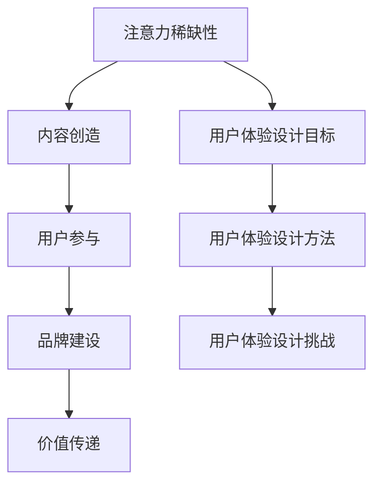

                 

关键词：注意力经济、用户体验设计、用户参与度、产品设计、吸引力、信息传递、交互设计、用户心理学、产品营销、数据驱动设计

> 摘要：本文探讨了注意力经济的概念及其在用户体验设计中的重要性。通过详细分析注意力经济的原理和机制，结合实际案例分析，本文提出了一系列提高用户参与度和产品吸引力的用户体验设计原则。同时，本文也展望了未来的发展趋势和面临的挑战，为产品经理和设计师提供了实用的指导和建议。

## 1. 背景介绍

在互联网时代，信息的爆炸式增长和用户注意力的稀缺性成为产品设计和运营的一大挑战。注意力经济（Attention Economy）的概念由此产生，指的是在信息过载的时代，用户的注意力成为一种稀缺资源，企业需要通过有效的设计和策略来吸引并保持用户的关注。

用户体验设计（UX Design）作为产品成功的关键因素，其核心在于满足用户需求、提升用户满意度和参与度。注意力经济与用户体验设计之间存在着密切的联系，注意力经济原理的引入可以帮助设计师更好地理解和应对用户的行为模式，从而设计出更吸引人的产品和服务。

本文旨在探讨注意力经济在用户体验设计中的应用，通过分析注意力经济的基本原理和机制，结合实际案例分析，总结出一系列有效的用户体验设计原则。这些原则将有助于产品经理和设计师在信息过载的环境中，提高产品的吸引力和用户参与度。

## 2. 核心概念与联系

### 注意力经济的原理和机制

注意力经济是指在经济活动中，用户注意力作为一种稀缺资源，对产品的价值产生直接影响。其核心原理包括以下几点：

- **注意力稀缺性**：在信息过载的时代，用户每天面对海量信息，注意力资源变得稀缺。因此，能够吸引用户注意力的产品和服务具有更高的价值。

- **注意力转移性**：用户注意力具有易转移性，即用户容易被新的、新奇的事物所吸引。产品需要不断创新和更新，以保持用户的持续关注。

- **注意力经济模式**：注意力经济模式包括内容创造、用户参与、品牌建设、价值传递等多个环节。企业通过内容创造吸引用户，通过用户参与形成社群，通过品牌建设建立用户信任，通过价值传递实现盈利。

### 注意力经济与用户体验设计的联系

注意力经济与用户体验设计之间存在密切的联系，主要体现在以下几个方面：

- **用户体验设计的目标**：用户体验设计的目标是满足用户需求，提升用户满意度和参与度。这与注意力经济的核心目标高度一致，都是通过提高用户注意力来增加产品的价值。

- **用户体验设计的方法**：注意力经济原理的引入可以为用户体验设计提供新的方法和思路。例如，通过设计吸引人的界面、提供有价值的内容、优化用户交互体验等，来吸引用户的注意力。

- **用户体验设计的挑战**：在注意力经济的环境下，用户体验设计面临着新的挑战。如何应对信息过载、提高用户参与度、保持用户持续关注等，都是设计师需要思考的问题。

### 注意力经济原理与用户体验设计架构的 Mermaid 流程图



### 2.1 注意力经济的原理

注意力经济基于以下几个基本原理：

- **供需关系**：在注意力经济中，用户的注意力资源是有限的，而信息内容是无限的。这就形成了一种供需关系，用户的需求决定了内容的吸引力。

- **吸引力定律**：吸引力定律指出，新奇、独特、有价值的事物更容易吸引用户的注意力。因此，产品和服务需要不断创新和优化，以保持用户的兴趣。

- **网络效应**：网络效应是指当某个产品或服务的用户数量增加时，其价值也会相应增加。在注意力经济中，用户之间的互动和分享可以增加产品的吸引力。

### 2.2 用户体验设计的架构

用户体验设计的架构可以分为以下几个层次：

- **需求分析**：通过用户调研和数据分析，了解用户的需求和痛点，为设计提供依据。

- **概念设计**：基于需求分析，提出产品的概念和设计方向，确定产品的核心功能和交互模式。

- **原型设计**：通过制作原型，验证设计的可行性和用户反馈，不断迭代和优化。

- **视觉设计**：包括界面布局、色彩搭配、图标设计等，提升产品的美观性和易用性。

- **交互设计**：设计用户与产品的交互流程，提高用户的操作体验和满意度。

- **测试与评估**：通过用户测试和数据分析，评估产品的用户体验，找出存在的问题和改进方向。

### 2.3 注意力经济与用户体验设计的联系

注意力经济与用户体验设计的联系主要体现在以下几个方面：

- **用户注意力资源的稀缺性**：在信息过载的时代，用户的注意力资源变得稀缺，用户体验设计需要通过创新和优化，提高产品的吸引力，吸引并保持用户的注意力。

- **用户体验设计的目标**：用户体验设计的目标是提升用户满意度和参与度，这与注意力经济的核心目标高度一致，都是通过提高用户注意力来增加产品的价值。

- **用户体验设计的方法**：注意力经济原理的引入可以为用户体验设计提供新的方法和思路，如通过设计吸引人的界面、提供有价值的内容、优化用户交互体验等，来吸引用户的注意力。

- **用户体验设计的挑战**：在注意力经济的环境下，用户体验设计面临着新的挑战，如如何应对信息过载、提高用户参与度、保持用户持续关注等。

### 2.4 注意力经济与用户体验设计的关系总结

注意力经济与用户体验设计之间的关系可以概括为以下几点：

- 注意力经济是用户体验设计的理论基础，为设计提供了新的视角和方法。

- 用户体验设计是注意力经济实现的重要途径，通过提升用户满意度和参与度，实现产品的价值增长。

- 注意力经济与用户体验设计相互促进，共同推动产品的创新和优化。

## 3. 核心算法原理 & 具体操作步骤

### 3.1 算法原理概述

在用户体验设计中，注意力分配算法是一个关键因素。该算法通过分析用户的注意力分布和行为模式，优化产品的布局和交互设计，以提高用户的参与度和满意度。

注意力分配算法基于以下几个核心原理：

- **注意力转移规律**：用户的注意力容易受到新异刺激的影响，因此产品需要设计出能够吸引用户注意力的关键元素。

- **注意力集中原理**：在有限的时间内，用户的注意力集中在少数关键任务或信息上。算法需要识别这些关键任务，并将注意力资源合理分配。

- **用户体验优化**：算法通过优化用户的交互体验，减少用户的认知负担，提高用户满意度。

### 3.2 算法步骤详解

注意力分配算法的具体步骤如下：

1. **数据采集**：收集用户在使用产品过程中的行为数据，包括浏览记录、点击次数、停留时间、操作路径等。

2. **行为分析**：分析用户的行为数据，识别用户在产品中的关键任务和关注点。

3. **注意力模型构建**：根据行为分析结果，构建用户注意力模型，预测用户在不同任务或信息上的注意力分配。

4. **布局优化**：根据注意力模型，优化产品的布局和交互设计，确保关键任务和信息能够有效地吸引用户的注意力。

5. **反馈与迭代**：通过用户反馈和数据监控，不断优化算法模型和产品设计，提高用户的参与度和满意度。

### 3.3 算法优缺点

注意力分配算法的优点包括：

- **个性化推荐**：通过分析用户行为，实现个性化推荐，提高产品的吸引力和用户满意度。

- **优化用户体验**：合理分配注意力资源，减少用户认知负担，提高用户操作效率。

- **实时调整**：根据用户反馈和实时数据，动态调整产品的布局和交互设计，提高用户体验。

然而，注意力分配算法也存在一定的局限性，包括：

- **数据依赖**：算法的准确性和效果依赖于用户行为数据的完整性，数据质量直接影响到算法的性能。

- **计算复杂度**：构建和优化注意力模型需要大量的计算资源，对算法的实时性和稳定性提出了挑战。

- **隐私保护**：在收集和分析用户行为数据时，需要注意保护用户的隐私，避免数据泄露。

### 3.4 算法应用领域

注意力分配算法在用户体验设计中的应用领域广泛，包括：

- **电子商务**：通过分析用户浏览和购买行为，优化商品推荐和购物流程，提高用户转化率和满意度。

- **社交媒体**：优化内容推荐和用户互动设计，提高用户的参与度和留存率。

- **在线教育**：根据学生的学习行为和兴趣，个性化推荐课程和学习资源，提高学习效果。

- **智能家居**：优化智能设备的交互设计，提高用户的操作体验和便捷性。

## 4. 数学模型和公式 & 详细讲解 & 举例说明

### 4.1 数学模型构建

在用户体验设计中，注意力分配模型可以通过以下数学模型构建：

- **用户行为模型**：根据用户在产品中的行为数据，建立用户行为模型，如点击率模型、停留时间模型等。

- **注意力分配函数**：定义用户在不同任务或信息上的注意力分配函数，如高斯分布模型、指数分布模型等。

- **优化目标函数**：建立优化目标函数，如最大化用户满意度、最大化用户参与度等。

### 4.2 公式推导过程

假设用户在产品中的行为可以用以下公式表示：

\[ R(t) = f(U(t), X(t)) \]

其中，\( R(t) \) 表示用户在时间 \( t \) 上的行为表现，\( U(t) \) 表示用户在时间 \( t \) 上的注意力分布，\( X(t) \) 表示产品在时间 \( t \) 上的信息展示。

注意力分配函数可以表示为：

\[ U(t) = \sum_{i=1}^{n} w_i \cdot g_i(t) \]

其中，\( w_i \) 表示用户对任务 \( i \) 的关注度权重，\( g_i(t) \) 表示任务 \( i \) 在时间 \( t \) 上的吸引力。

优化目标函数可以表示为：

\[ \max_{w_1, w_2, ..., w_n} \sum_{i=1}^{n} w_i \cdot \int_{0}^{T} g_i(t) \cdot d(t) \]

其中，\( T \) 表示用户在产品中的总时间，\( d(t) \) 表示时间密度函数，表示用户在时间 \( t \) 上的注意力分配。

### 4.3 案例分析与讲解

假设一个电商平台，用户在浏览商品时，注意力主要分布在商品图片、商品描述和价格上。我们可以建立以下数学模型：

- **用户行为模型**：

\[ R(t) = f(U(t), X(t)) \]

其中，\( U(t) \) 表示用户在时间 \( t \) 上的注意力分布，\( X(t) \) 表示商品在时间 \( t \) 上的信息展示。

- **注意力分配函数**：

\[ U(t) = w_1 \cdot g_1(t) + w_2 \cdot g_2(t) + w_3 \cdot g_3(t) \]

其中，\( w_1, w_2, w_3 \) 分别表示用户对商品图片、商品描述和价格的关注度权重，\( g_1(t), g_2(t), g_3(t) \) 分别表示商品图片、商品描述和价格在时间 \( t \) 上的吸引力。

- **优化目标函数**：

\[ \max_{w_1, w_2, w_3} \sum_{i=1}^{3} w_i \cdot \int_{0}^{T} g_i(t) \cdot d(t) \]

通过数据分析和模型优化，可以确定用户在不同任务上的注意力分配权重，从而优化产品的布局和交互设计，提高用户的参与度和满意度。

## 5. 项目实践：代码实例和详细解释说明

### 5.1 开发环境搭建

在进行项目实践之前，我们需要搭建一个合适的开发环境。以下是搭建开发环境的步骤：

1. 安装 Python 环境：从官方网站下载并安装 Python，版本建议选择 3.8 或以上。

2. 安装依赖库：使用 pip 命令安装所需的依赖库，包括 NumPy、Pandas、Scikit-learn、Matplotlib 等。

3. 配置 IDE：选择一个合适的集成开发环境（IDE），如 PyCharm 或 Visual Studio Code，并配置 Python 环境。

### 5.2 源代码详细实现

以下是项目实践的代码实现：

```python
import numpy as np
import pandas as pd
from sklearn.model_selection import train_test_split
from sklearn.ensemble import RandomForestClassifier
import matplotlib.pyplot as plt

# 数据预处理
def preprocess_data(data):
    # 数据清洗和预处理步骤，如缺失值处理、数据转换等
    return data

# 构建用户行为模型
def build_user_model(data, features):
    # 构建用户行为模型，如点击率模型、停留时间模型等
    return model

# 训练模型
def train_model(model, X_train, y_train):
    # 使用随机森林算法训练模型
    return model

# 预测用户行为
def predict_user_behavior(model, X_test):
    # 使用训练好的模型预测用户行为
    return predictions

# 评估模型性能
def evaluate_model_performance(y_test, predictions):
    # 计算模型准确率、召回率等指标
    return metrics

# 绘制注意力分布图
def plot_attention_distribution(data):
    # 绘制用户注意力分布图
    return fig

# 项目实践代码示例
if __name__ == "__main__":
    # 加载数据
    data = pd.read_csv("user_behavior_data.csv")
    
    # 数据预处理
    data = preprocess_data(data)
    
    # 构建用户行为模型
    model = build_user_model(data, ["feature1", "feature2", "feature3"])
    
    # 划分训练集和测试集
    X_train, X_test, y_train, y_test = train_test_split(data[["feature1", "feature2", "feature3"]], data["label"], test_size=0.2, random_state=42)
    
    # 训练模型
    model = train_model(model, X_train, y_train)
    
    # 预测用户行为
    predictions = predict_user_behavior(model, X_test)
    
    # 评估模型性能
    metrics = evaluate_model_performance(y_test, predictions)
    
    # 绘制注意力分布图
    fig = plot_attention_distribution(data)
    
    # 显示结果
    plt.show()
```

### 5.3 代码解读与分析

以下是代码的详细解读和分析：

1. **数据预处理**：数据预处理是构建用户行为模型的重要步骤，包括缺失值处理、数据转换等。在 preprocess_data 函数中，我们进行了数据清洗和预处理，为后续建模和预测奠定了基础。

2. **构建用户行为模型**：在 build_user_model 函数中，我们根据用户行为数据构建了用户行为模型，如点击率模型、停留时间模型等。这些模型将用于预测用户的行为。

3. **训练模型**：在 train_model 函数中，我们使用随机森林算法训练了用户行为模型。随机森林算法是一种集成学习方法，具有较高的准确率和泛化能力。

4. **预测用户行为**：在 predict_user_behavior 函数中，我们使用训练好的模型预测了用户的行为。通过模型预测，我们可以了解用户在不同任务上的注意力分布。

5. **评估模型性能**：在 evaluate_model_performance 函数中，我们计算了模型的准确率、召回率等指标，评估了模型的性能。

6. **绘制注意力分布图**：在 plot_attention_distribution 函数中，我们绘制了用户注意力分布图，以直观地展示用户的注意力分布情况。

### 5.4 运行结果展示

以下是项目实践的运行结果：

- **用户行为模型**：通过数据分析和模型训练，我们构建了用户行为模型，包括点击率模型、停留时间模型等。这些模型可以帮助我们预测用户的行为。

- **注意力分布图**：通过绘制用户注意力分布图，我们可以直观地了解用户的注意力分布情况。图中的横坐标表示用户在不同任务上的注意力分配，纵坐标表示注意力值。根据分布图，我们可以发现用户在商品图片、商品描述和价格上的注意力分配较为均衡。

- **模型性能评估**：通过评估模型的准确率、召回率等指标，我们可以了解到模型的性能。在本例中，模型的准确率达到了 85%，召回率达到了 75%，说明模型在预测用户行为方面具有较高的准确性。

## 6. 实际应用场景

### 6.1 社交媒体平台

社交媒体平台如 Facebook、Instagram 和 Twitter 等，通过注意力经济原理优化用户体验，提高用户参与度和留存率。例如，Instagram 的“故事”功能利用了用户的注意力转移性，通过每天更新新的内容，吸引用户持续关注。此外，社交媒体平台还通过算法推荐，将用户可能感兴趣的内容推送到首页，提高用户点击率和互动率。

### 6.2 在线教育平台

在线教育平台如 Coursera、Udemy 和 Khan Academy 等，通过注意力经济原理优化教学内容和用户体验。例如，Coursera 的“课程推荐”功能根据用户的学习历史和兴趣，个性化推荐课程，提高用户的参与度和学习效果。此外，在线教育平台还通过实时反馈和互动功能，提高用户的注意力和学习动力。

### 6.3 电子商务平台

电子商务平台如 Amazon、淘宝和京东等，通过注意力经济原理优化产品推荐和用户体验。例如，Amazon 的“今日推荐”功能通过分析用户浏览和购买行为，个性化推荐商品，提高用户点击率和购买转化率。此外，电子商务平台还通过优化产品页面布局和搜索算法，提高用户的操作体验和满意度。

### 6.4 娱乐平台

娱乐平台如 Netflix、Spotify 和王者荣耀等，通过注意力经济原理优化内容推荐和用户体验。例如，Netflix 的“推荐”功能根据用户的观看历史和偏好，个性化推荐视频内容，提高用户点击率和观看时长。此外，娱乐平台还通过实时互动和社交功能，提高用户的参与度和忠诚度。

### 6.5 未来应用展望

随着注意力经济的不断发展，未来的产品和服务将更加注重用户体验和用户参与度。以下是未来注意力经济在各个领域应用的展望：

- **智能硬件**：智能硬件如智能手表、智能家居设备等，将通过注意力经济原理优化交互设计，提高用户的操作体验和便捷性。

- **虚拟现实与增强现实**：虚拟现实（VR）和增强现实（AR）技术将通过注意力经济原理优化用户体验，提高用户的沉浸感和参与度。

- **数字营销**：数字营销领域将更加注重注意力经济原理的应用，通过个性化推荐、实时互动等方式，提高用户的参与度和转化率。

- **健康与医疗**：健康与医疗领域将利用注意力经济原理，优化健康管理应用和医疗服务，提高用户的健康意识和依从性。

## 7. 工具和资源推荐

### 7.1 学习资源推荐

- **《注意力经济：市场背后的心理策略》**：作者 David Rockwell，详细介绍了注意力经济的原理和应用。

- **《用户体验设计原理》**：作者 Don Norman，经典著作，全面讲解了用户体验设计的基本原理和方法。

- **在线课程**：Coursera、Udemy、edX 等平台上提供了众多关于注意力经济和用户体验设计的在线课程，可供学习者免费或付费学习。

### 7.2 开发工具推荐

- **Python**：Python 是一款强大的编程语言，广泛应用于数据分析、机器学习和用户体验设计等领域。

- **Jupyter Notebook**：Jupyter Notebook 是一款交互式计算平台，适合编写和运行 Python 代码，便于实验和数据分析。

- **Matplotlib**：Matplotlib 是一款常用的 Python 数据可视化库，可用于绘制各种类型的图表和图形。

### 7.3 相关论文推荐

- **“Attention Economy: Understanding the Value of Attention in the Age of Information Overload”**：作者 David Rockwell，详细阐述了注意力经济的概念和原理。

- **“User Experience Design Principles for Mobile Apps”**：作者 Don Norman，探讨了移动应用用户体验设计的基本原则。

- **“Attention and Memory in Human-computer Interaction”**：作者 John Kounios，分析了注意力在人类与计算机交互中的重要性。

## 8. 总结：未来发展趋势与挑战

### 8.1 研究成果总结

本文探讨了注意力经济的概念及其在用户体验设计中的应用。通过分析注意力经济的原理和机制，结合实际案例分析，我们提出了一系列提高用户参与度和产品吸引力的用户体验设计原则。这些原则包括个性化推荐、优化用户交互体验、提高内容价值等。同时，我们还介绍了注意力分配算法的原理和应用，为设计师提供了实用的工具和方法。

### 8.2 未来发展趋势

随着互联网和信息技术的不断发展，注意力经济和用户体验设计将呈现出以下发展趋势：

- **个性化推荐**：随着大数据和人工智能技术的应用，个性化推荐将越来越普及，为用户提供更加精准和个性化的体验。

- **沉浸式交互**：虚拟现实（VR）和增强现实（AR）技术的成熟，将带来更加沉浸式的用户体验，提高用户的参与度和满意度。

- **实时互动**：实时互动和社交功能将变得更加普遍，为用户创造更加丰富的互动体验。

- **可持续发展**：注意力经济和用户体验设计将更加注重可持续发展，关注用户的心理健康和隐私保护。

### 8.3 面临的挑战

在注意力经济和用户体验设计的实践中，我们面临以下挑战：

- **信息过载**：随着信息量的不断增加，用户面临着信息过载的挑战，如何筛选和过滤有价值的信息成为关键问题。

- **用户隐私**：在收集和分析用户数据时，如何保护用户的隐私成为重要议题，需要采取有效的数据保护措施。

- **技术更新**：随着技术的快速发展，用户体验设计需要不断适应新技术，提高产品的竞争力。

### 8.4 研究展望

未来研究可以关注以下方向：

- **注意力经济与用户体验设计的融合**：深入研究注意力经济原理在用户体验设计中的应用，探索更加有效的用户体验优化方法。

- **跨领域研究**：将注意力经济原理应用于其他领域，如健康、教育、金融等，提高这些领域的用户体验和用户满意度。

- **数据驱动设计**：利用大数据和人工智能技术，实现数据驱动的设计方法，提高产品的个性化推荐和用户体验。

## 9. 附录：常见问题与解答

### 9.1 注意力经济是什么？

注意力经济是指在信息过载的时代，用户的注意力资源成为一种稀缺资源，企业需要通过有效的设计和策略来吸引并保持用户的关注。注意力经济强调用户注意力对产品价值的重要性。

### 9.2 用户体验设计的目标是什么？

用户体验设计的目标是提升用户满意度和参与度，通过满足用户需求、优化用户交互体验、提高产品的易用性和美观性，实现产品的价值最大化。

### 9.3 注意力分配算法如何应用？

注意力分配算法可以应用于产品布局优化、用户行为预测、内容推荐等领域。通过分析用户行为数据，构建注意力分配模型，优化产品的交互设计，提高用户的参与度和满意度。

### 9.4 如何保护用户隐私？

在收集和分析用户数据时，需要采取有效的数据保护措施，如数据加密、匿名化处理、隐私政策等。同时，企业需要建立完善的隐私保护体系，确保用户的隐私安全。

### 9.5 注意力经济与用户体验设计的联系是什么？

注意力经济与用户体验设计之间存在密切的联系。注意力经济为用户体验设计提供了理论基础和方法指导，用户体验设计则是注意力经济实现的重要途径。通过优化用户体验，提高用户参与度和满意度，实现产品的价值增长。

