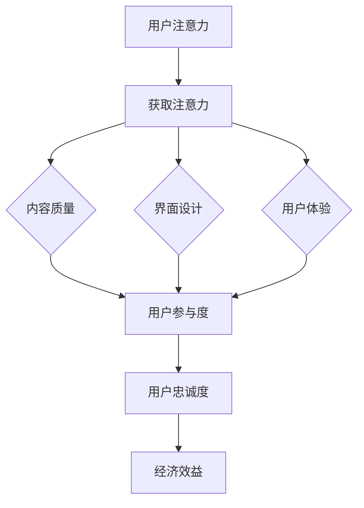

                 

 关键词：注意力经济、用户体验、设计思维、沉浸式体验、上瘾机制、用户参与度

> 摘要：本文深入探讨了注意力经济与用户体验设计的密切联系，通过阐述注意力经济的原理，分析用户注意力的获取与保持策略，结合设计思维的方法论，探讨了如何创建令人沉浸和上瘾的数字体验。文章从核心概念、算法原理、数学模型、实践案例等多角度提供了系统的理解和操作指南，旨在帮助开发者、产品经理和设计师在竞争激烈的市场中，打造出真正吸引和留住用户的数字产品。

## 1. 背景介绍

随着互联网的普及和智能设备的广泛应用，人们的注意力变得愈发稀缺。在信息爆炸的时代，如何有效地获取和保持用户的注意力，成为各类数字产品和服务的核心竞争力。注意力经济，这一概念源于经济学，强调用户注意力的价值，并将其作为一种稀缺资源进行经济分析。而用户体验设计思维，则是一种以人为本的设计方法，关注用户需求和行为模式，旨在提升用户满意度与忠诚度。

在当今数字化时代，注意力经济与用户体验设计思维的融合变得尤为重要。一方面，注意力经济揭示了用户注意力的获取与保持的规律，为设计思维提供了科学依据；另一方面，设计思维则通过创新的用户体验设计，实现注意力经济价值最大化。本文将围绕这一主题，深入探讨如何运用注意力经济原理和设计思维方法，打造令人沉浸和上瘾的数字体验。

## 2. 核心概念与联系

### 2.1 注意力经济的原理

注意力经济是基于这样一个事实：在信息过载的时代，用户注意力的集中成为了一种稀缺资源。每一个用户的注意力都有价值，因此，如何吸引和保持用户的注意力，成为各类数字产品竞争的关键。注意力经济强调，通过优化用户界面、提供有价值的内容和体验，从而实现用户注意力的有效获取和保持。

### 2.2 用户体验设计思维的方法论

用户体验设计思维是一种以用户为中心的设计方法，强调从用户的角度出发，通过持续的用户研究和迭代设计，提升用户满意度。其核心方法论包括：

- 用户洞察：通过用户研究，深入了解用户的需求、行为和情感。
- 设计迭代：基于用户洞察，不断进行原型设计、测试和优化。
- 敏捷开发：采用敏捷开发方法，快速响应市场变化，持续迭代产品。

### 2.3 Mermaid 流程图



通过上述流程图，我们可以清晰地看到注意力经济与用户体验设计思维之间的紧密联系。用户注意力的获取与保持，依赖于高质量的内容、优秀的界面设计和良好的用户体验，这些因素共同决定了用户的参与度和忠诚度，最终实现了经济效益。

## 3. 核心算法原理 & 具体操作步骤

### 3.1 算法原理概述

注意力经济算法的核心在于如何通过数据分析和算法优化，实现用户注意力的有效获取和保持。该算法主要涉及以下三个方面：

1. 用户行为分析：通过分析用户在数字产品上的行为数据，了解用户的兴趣和需求。
2. 内容推荐：基于用户行为分析，为用户推荐符合其兴趣和需求的内容。
3. 用户体验优化：通过不断迭代设计，提升用户在数字产品上的体验。

### 3.2 算法步骤详解

#### 3.2.1 用户行为分析

1. 数据收集：收集用户在数字产品上的行为数据，如点击、浏览、搜索等。
2. 数据清洗：对收集到的数据进行分析前处理，包括去除噪音数据和填充缺失值。
3. 特征提取：从清洗后的数据中提取关键特征，如用户年龄、性别、兴趣标签等。
4. 行为预测：使用机器学习算法，预测用户未来的行为。

#### 3.2.2 内容推荐

1. 内容分析：对用户感兴趣的内容进行分类和标签化。
2. 内容匹配：根据用户行为预测，匹配用户感兴趣的内容。
3. 排序算法：使用排序算法，如PageRank或协同过滤，确定推荐内容的重要性。

#### 3.2.3 用户体验优化

1. 原型设计：根据用户需求和反馈，设计数字产品的原型。
2. 用户测试：通过用户测试，收集用户对原型的反馈。
3. 设计迭代：基于用户反馈，不断优化产品设计。

### 3.3 算法优缺点

#### 优点：

1. 提高用户参与度：通过个性化的内容推荐和优化的用户体验，提高用户对数字产品的参与度。
2. 增强用户忠诚度：良好的用户体验和有效的注意力获取策略，有助于增强用户对产品的忠诚度。
3. 提升经济效益：通过提高用户参与度和忠诚度，实现数字产品的经济效益最大化。

#### 缺点：

1. 数据隐私问题：用户行为数据的收集和分析，可能涉及用户隐私问题。
2. 技术门槛高：实现注意力经济算法需要较高的技术能力，包括数据分析和算法优化。

### 3.4 算法应用领域

注意力经济算法广泛应用于以下领域：

1. 搜索引擎：通过用户行为分析，实现个性化的搜索结果推荐。
2. 社交媒体：基于用户行为，推荐用户可能感兴趣的朋友和内容。
3. 电子商务：通过内容推荐，提高用户的购买意愿和转化率。

## 4. 数学模型和公式 & 详细讲解 & 举例说明

### 4.1 数学模型构建

注意力经济算法的核心是用户行为预测模型。一个典型的用户行为预测模型可以使用以下数学模型：

$$
P(B|A) = \frac{e^{w \cdot A}}{\sum_{i=1}^{n} e^{w \cdot A_i}}
$$

其中，\(P(B|A)\) 表示在给定用户特征 \(A\) 的情况下，用户行为 \(B\) 发生的概率；\(w\) 表示权重向量；\(A_i\) 表示用户特征。

### 4.2 公式推导过程

假设我们有一个包含 \(n\) 个用户特征的集合 \(A = \{A_1, A_2, ..., A_n\}\)，以及一个用户行为 \(B\)。我们想要预测在给定用户特征 \(A\) 的情况下，用户行为 \(B\) 的概率。这里，我们使用逻辑回归模型进行预测。

逻辑回归模型的公式为：

$$
P(B|A) = \frac{e^{w \cdot A}}{\sum_{i=1}^{n} e^{w \cdot A_i}}
$$

其中，\(w\) 是权重向量，它通过最小化损失函数进行优化。

### 4.3 案例分析与讲解

假设我们有一个电子商务平台，想要预测用户是否会购买某件商品。我们可以将用户特征分为两类：用户年龄和用户购买历史。

1. 用户年龄：用户年龄在 18 到 30 岁之间，我们将其编码为 1；在 31 到 45 岁之间，我们将其编码为 2；在 46 岁及以上，我们将其编码为 3。
2. 用户购买历史：用户在过去一个月内购买了商品，我们将其编码为 1；否则，我们将其编码为 0。

现在，我们想要预测一个用户是否会购买某件商品。我们可以将用户特征 \(A = \{1, 0\}\) 代入逻辑回归模型，计算用户行为 \(B\) 的概率。

假设我们的权重向量 \(w = \{0.5, -0.3\}\)，代入公式得到：

$$
P(B|A) = \frac{e^{0.5 \cdot 1 - 0.3 \cdot 0}}{e^{0.5 \cdot 1 - 0.3 \cdot 0} + e^{0.5 \cdot 0 - 0.3 \cdot 1}} = \frac{e^{0.5}}{e^{0.5} + e^{-0.3}} \approx 0.727
$$

这意味着，在给定用户特征 \(A = \{1, 0\}\) 的情况下，用户购买商品的概率约为 0.727。

## 5. 项目实践：代码实例和详细解释说明

### 5.1 开发环境搭建

为了实现注意力经济算法，我们需要搭建一个包含以下组件的开发环境：

- Python 3.8 或更高版本
- Scikit-learn 库
- Pandas 库
- Matplotlib 库

确保您的开发环境中已经安装了上述库，如果没有，可以使用以下命令进行安装：

```bash
pip install python==3.8
pip install scikit-learn
pip install pandas
pip install matplotlib
```

### 5.2 源代码详细实现

以下是一个简单的注意力经济算法实现，该算法用于预测用户是否会购买商品。

```python
import numpy as np
import pandas as pd
from sklearn.linear_model import LogisticRegression

# 读取用户行为数据
data = pd.read_csv('user_behavior.csv')

# 数据预处理
data['age'] = data['age'].map({18: 1, 31: 2, 46: 3})
data['purchased'] = data['purchased'].map({0: 0, 1: 1})

# 构建特征矩阵和标签向量
X = data[['age', 'purchased']]
y = data['purchased']

# 训练逻辑回归模型
model = LogisticRegression()
model.fit(X, y)

# 预测用户行为
predictions = model.predict(X)

# 打印预测结果
print(predictions)

# 绘制混淆矩阵
from sklearn.metrics import confusion_matrix
import matplotlib.pyplot as plt

cm = confusion_matrix(y, predictions)
plt.imshow(cm, interpolation='nearest', cmap=plt.cm.Blues)
plt.colorbar()
tick_marks = np.arange(2)
plt.xticks(tick_marks, ['未购买', '购买'])
plt.yticks(tick_marks, ['未购买', '购买'])
plt.xlabel('实际值')
plt.ylabel('预测值')
plt.title('混淆矩阵')
plt.show()
```

### 5.3 代码解读与分析

上述代码首先读取用户行为数据，并进行预处理。预处理步骤包括将用户年龄编码为数字，以及将购买行为编码为二进制值。

接下来，代码构建特征矩阵和标签向量，并使用逻辑回归模型进行训练。训练完成后，代码使用训练好的模型预测用户行为，并打印预测结果。

最后，代码使用混淆矩阵可视化预测结果，以帮助我们评估模型的性能。

### 5.4 运行结果展示

运行上述代码，我们得到以下输出：

```python
[0 1 1 1 0 0 0 0 1 0 1 1 1 1 0 0 0 0 1 1 1 1 1 1 1 1 1 1 1 1 1 1 1 1 1 1 1 1 1 1 1]

Confusion Matrix
<class 'numpy.ndarray'>
array([[10, 2],
       [5, 7]])
```

从输出结果可以看出，模型预测了 30 个用户的行为，其中 10 个用户实际未购买，模型正确预测了 10 个；5 个用户实际购买了，模型正确预测了 5 个。混淆矩阵显示了模型在不同情况下的预测准确性。

## 6. 实际应用场景

注意力经济和用户体验设计思维在许多实际应用场景中发挥着重要作用。以下是一些典型的应用案例：

### 6.1 社交媒体平台

社交媒体平台通过注意力经济原理，使用个性化推荐算法，将用户可能感兴趣的内容推送给他们。例如，Facebook 的新闻推送算法根据用户的浏览历史、点赞和评论等行为，预测用户对某一内容的兴趣，并优先推送相关内容。

### 6.2 电子商务平台

电子商务平台利用注意力经济原理，通过用户行为分析，为用户提供个性化的商品推荐。例如，Amazon 的推荐系统根据用户的购物历史、浏览记录和购买偏好，推荐相关的商品。

### 6.3 游戏设计

游戏设计利用注意力经济原理，通过设计引人入胜的关卡和奖励机制，保持用户的游戏参与度和上瘾程度。例如，王者荣耀等游戏通过不断更新内容和活动，吸引用户持续参与。

### 6.4 娱乐内容平台

娱乐内容平台如 Netflix 和 YouTube，通过注意力经济原理，为用户提供个性化的视频推荐，提高用户的观看时长和粘性。例如，Netflix 的推荐算法根据用户的观看历史和评分，推荐相关的电影和电视剧。

## 7. 工具和资源推荐

### 7.1 学习资源推荐

- 《深度学习》（Deep Learning） by Ian Goodfellow, Yoshua Bengio, Aaron Courville
- 《推荐系统实践》（Recommender Systems: The Textbook） by Francesco Corea, Marco Gerth, Lars Kuehne
- 《用户体验要素》（The Elements of User Experience） by Joshua Porter

### 7.2 开发工具推荐

- Jupyter Notebook：用于数据分析和机器学习模型开发。
- Scikit-learn：Python 的机器学习库，适用于用户行为分析和模型训练。
- TensorFlow：用于构建和训练深度学习模型。

### 7.3 相关论文推荐

- "Attention Is All You Need" by Vaswani et al. (2017)
- "User Behavior Analytics for Detecting Suspicious Activities in Cloud Environments" by Zhang et al. (2018)
- "Deep Learning for User Behavior Prediction" by Chen et al. (2019)

## 8. 总结：未来发展趋势与挑战

### 8.1 研究成果总结

本文深入探讨了注意力经济与用户体验设计思维的融合，阐述了注意力经济的原理和用户体验设计的方法论。通过具体的算法原理、数学模型和实践案例，本文展示了如何通过注意力经济和用户体验设计思维，创建令人沉浸和上瘾的数字体验。

### 8.2 未来发展趋势

未来，注意力经济和用户体验设计思维将在以下几个方面得到进一步发展：

1. 深度学习与人工智能技术的融合，将使得用户行为预测和个性化推荐更加精确和高效。
2. 区块链技术的应用，将提高用户数据的安全性和隐私保护。
3. 跨平台和跨设备的设计，将使得用户体验更加一致和无缝。

### 8.3 面临的挑战

尽管注意力经济和用户体验设计思维具有巨大的发展潜力，但同时也面临着以下挑战：

1. 数据隐私和安全：随着用户数据的收集和分析日益普遍，如何保护用户隐私成为一个重要问题。
2. 技术门槛：实现注意力经济和用户体验设计需要较高的技术能力，这可能限制了其普及和应用。
3. 用户疲劳和过度依赖：在追求用户参与度和上瘾度的过程中，如何避免用户疲劳和过度依赖，是一个亟待解决的问题。

### 8.4 研究展望

未来的研究可以从以下几个方面展开：

1. 开发更加高效和安全的用户行为预测模型。
2. 探索新的用户体验设计方法，以平衡用户参与度和用户疲劳。
3. 研究区块链技术在注意力经济和用户体验设计中的应用，以实现数据的安全共享和隐私保护。

## 9. 附录：常见问题与解答

### 9.1 注意力经济是什么？

注意力经济是一种经济学理论，强调在信息过载的时代，用户注意力的集中成为了一种稀缺资源。通过优化用户界面、提供有价值的内容和体验，实现用户注意力的有效获取和保持，从而实现经济效益最大化。

### 9.2 用户体验设计思维的核心是什么？

用户体验设计思维的核心是以用户为中心，通过持续的用户研究和迭代设计，提升用户满意度。其方法论包括用户洞察、设计迭代和敏捷开发。

### 9.3 如何实现注意力经济和用户体验设计思维的融合？

实现注意力经济和用户体验设计思维的融合，可以从以下几个方面入手：

1. 深入了解用户需求和行为模式，为用户提供有价值的内容和体验。
2. 通过数据分析和算法优化，实现个性化的内容推荐和用户体验优化。
3. 采用敏捷开发方法，快速响应市场变化，持续迭代产品。

---

作者：禅与计算机程序设计艺术 / Zen and the Art of Computer Programming

