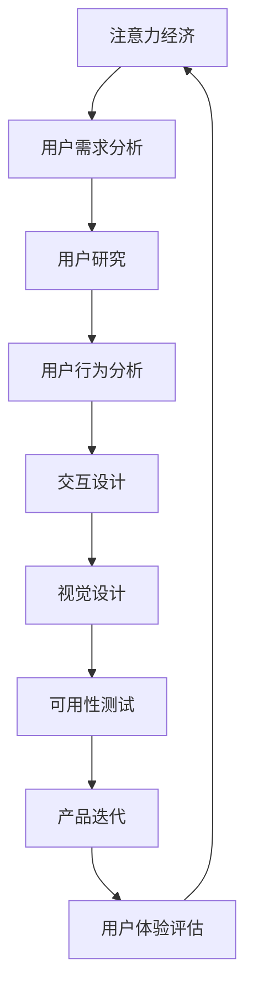

                 

关键词：注意力经济、用户体验设计、产品策略、用户参与、数据驱动

摘要：本文将深入探讨注意力经济的原理及其在用户体验设计中的应用。通过分析注意力资源的稀缺性，我们探讨了如何利用设计策略吸引和保持用户注意力，从而提升产品价值和用户满意度。文章还将探讨数据驱动的用户研究方法，以及在未来产品设计中面临的挑战和机遇。

## 1. 背景介绍

在数字化时代，用户注意力已成为一种稀缺资源。随着信息过载现象的加剧，用户在接收到大量信息时，往往容易产生选择性关注。这种选择性关注的现象被称为“注意力经济”。注意力经济不仅影响了广告和媒体行业，也对产品设计和用户体验产生了深远的影响。

用户体验设计（User Experience Design，简称UXD）是近年来备受关注的一个领域。它旨在创建一个能够让用户在使用产品过程中感到愉悦、高效和有价值的体验。随着注意力经济的兴起，用户体验设计的重要性愈发凸显。设计师们需要更好地理解用户行为和注意力分配，从而设计出更具吸引力和用户粘性的产品和服务。

本文将围绕注意力经济和用户体验设计这两个核心概念展开讨论，探讨如何在产品开发过程中运用设计策略来吸引和保持用户注意力。同时，我们将介绍数据驱动的用户研究方法，以便更好地了解用户需求和行为模式。最后，我们将探讨未来产品设计中可能面临的挑战和机遇。

## 2. 核心概念与联系

### 2.1 注意力经济原理

注意力经济是基于这样一个事实：用户在接收到大量信息时，往往会将注意力分配给那些最感兴趣或最有价值的信息。这种注意力分配机制决定了哪些内容能够获得用户的关注，从而影响了信息的传播和产品的成功。

注意力经济的核心概念包括：

- **注意力稀缺性**：用户注意力是有限的，因此必须优先分配给最有价值的信息。
- **注意力转换**：通过设计策略，将用户从低价值的信息引导至高价值的信息。
- **注意力捕捉**：通过引人入胜的内容和交互方式，迅速吸引并保持用户的注意力。
- **注意力变现**：将用户的注意力转化为商业价值，如广告收入或产品销售。

### 2.2 用户体验设计原理

用户体验设计旨在提升用户在使用产品过程中的满意度。为了实现这一目标，设计师需要关注以下几个方面：

- **用户研究**：通过用户调研和数据分析，深入了解用户需求和行为模式。
- **交互设计**：设计直观、易用、有趣的交互方式，提升用户参与度。
- **视觉设计**：运用色彩、排版、图标等视觉元素，提升产品的美观度和易用性。
- **可用性测试**：在产品开发过程中进行可用性测试，确保产品符合用户预期。

### 2.3 Mermaid 流程图

以下是一个简化的Mermaid流程图，展示了注意力经济和用户体验设计之间的关系：



### 2.4 注意力经济与用户体验设计的关系

注意力经济和用户体验设计之间的关系在于，设计师可以利用注意力经济的原理来提升用户体验。例如：

- **设计引人入胜的内容**：通过创建引人入胜的标题、图像和视频，吸引并保持用户注意力。
- **优化信息架构**：设计清晰、简洁的信息架构，帮助用户快速找到所需信息。
- **增强互动性**：提供有趣的互动元素，如小游戏、投票等，增加用户参与度。
- **数据驱动设计**：利用数据分析，不断优化产品设计，以满足用户需求。

## 3. 核心算法原理 & 具体操作步骤

### 3.1 算法原理概述

在用户体验设计中，核心算法原理主要包括以下几个方面：

- **A/B测试**：通过对比不同设计方案的效果，确定最佳设计方案。
- **用户行为分析**：通过分析用户行为数据，了解用户需求和行为模式。
- **情感分析**：利用自然语言处理技术，分析用户反馈和评论，了解用户情感倾向。
- **机器学习**：利用机器学习算法，自动识别用户偏好，提供个性化推荐。

### 3.2 算法步骤详解

#### 3.2.1 A/B测试

1. **定义测试目标**：明确要测试的功能或设计元素。
2. **设计测试方案**：设计两个或多个版本，每个版本针对不同的用户群体。
3. **实施测试**：将用户分配到不同版本，观察其行为和反馈。
4. **分析结果**：比较不同版本的效果，确定最佳设计方案。

#### 3.2.2 用户行为分析

1. **数据收集**：通过日志、点击率、停留时间等指标，收集用户行为数据。
2. **数据清洗**：去除无效、重复或错误的数据，确保数据质量。
3. **数据分析**：使用统计方法或机器学习算法，分析用户行为数据，提取有价值的信息。
4. **结果应用**：根据分析结果，优化产品设计。

#### 3.2.3 情感分析

1. **文本收集**：收集用户反馈、评论等文本数据。
2. **情感分类**：使用自然语言处理技术，对文本进行情感分类，判断其积极或消极情感。
3. **情感分析**：对分类结果进行分析，了解用户情感倾向。
4. **反馈应用**：根据情感分析结果，优化产品设计，提升用户体验。

#### 3.2.4 机器学习

1. **数据准备**：收集并整理用户行为数据，包括特征和标签。
2. **模型训练**：选择合适的机器学习算法，对数据集进行训练，得到预测模型。
3. **模型评估**：使用测试数据集评估模型性能，调整模型参数。
4. **应用模型**：将训练好的模型应用到实际产品中，提供个性化推荐。

### 3.3 算法优缺点

#### 3.3.1 A/B测试

**优点**：简单易行，能够快速验证设计效果，提高决策效率。

**缺点**：需要大量用户数据，且无法确定因果关系。

#### 3.3.2 用户行为分析

**优点**：能够深入了解用户需求和行为模式，为产品设计提供有力支持。

**缺点**：数据收集和处理成本较高，且易受到数据质量和样本偏差的影响。

#### 3.3.3 情感分析

**优点**：能够快速了解用户情感，为产品设计提供情感导向。

**缺点**：情感分析结果可能存在误差，且无法直接转化为具体的设计决策。

#### 3.3.4 机器学习

**优点**：能够自动识别用户偏好，提供个性化推荐，提升用户体验。

**缺点**：模型训练和评估成本较高，且可能存在过拟合问题。

### 3.4 算法应用领域

#### 3.4.1 在线广告

通过A/B测试和用户行为分析，优化广告展示策略，提高广告点击率和转化率。

#### 3.4.2 电子商务

利用情感分析和机器学习，为用户提供个性化推荐，提升购物体验和销售额。

#### 3.4.3 社交媒体

通过用户行为分析和情感分析，了解用户情感和需求，优化内容推送策略，提升用户参与度。

#### 3.4.4 娱乐产业

利用A/B测试和用户行为分析，优化游戏设计和推荐算法，提升游戏体验和用户留存率。

## 4. 数学模型和公式 & 详细讲解 & 举例说明

### 4.1 数学模型构建

在用户体验设计中，我们可以构建以下数学模型来描述用户行为：

\[ U(x, y) = f(x, y) + \epsilon \]

其中，\( U \) 表示用户体验，\( x \) 和 \( y \) 表示设计要素，\( f \) 表示设计函数，\( \epsilon \) 表示随机误差。

#### 4.1.1 设计函数 \( f(x, y) \)

设计函数 \( f(x, y) \) 可以表示为：

\[ f(x, y) = g(x) + h(y) + k(x, y) \]

其中，\( g(x) \) 表示交互设计对用户体验的影响，\( h(y) \) 表示视觉设计对用户体验的影响，\( k(x, y) \) 表示交互设计和视觉设计之间的交互影响。

#### 4.1.2 用户行为 \( U(x, y) \)

用户行为 \( U(x, y) \) 可以通过以下公式计算：

\[ U(x, y) = \int_{0}^{1} \frac{dx}{f(x, y)} \]

其中，\( \int_{0}^{1} \frac{dx}{f(x, y)} \) 表示用户在单位时间内的注意力分配。

### 4.2 公式推导过程

#### 4.2.1 交互设计对用户体验的影响

交互设计对用户体验的影响可以用以下公式表示：

\[ g(x) = \frac{1}{1 + e^{-\alpha (x - \beta)}} \]

其中，\( \alpha \) 和 \( \beta \) 是参数，\( x \) 是设计要素的取值。

#### 4.2.2 视觉设计对用户体验的影响

视觉设计对用户体验的影响可以用以下公式表示：

\[ h(y) = \frac{y - \gamma}{\delta - y} \]

其中，\( \gamma \) 和 \( \delta \) 是参数，\( y \) 是设计要素的取值。

#### 4.2.3 交互设计和视觉设计之间的交互影响

交互设计和视觉设计之间的交互影响可以用以下公式表示：

\[ k(x, y) = \frac{\phi(x, y)}{1 + e^{-\theta (x, y)}} \]

其中，\( \phi(x, y) \) 是设计要素的交互影响函数，\( \theta(x, y) \) 是参数。

### 4.3 案例分析与讲解

#### 4.3.1 案例背景

假设我们正在设计一个社交媒体平台的用户界面。平台需要提升用户参与度，因此我们需要优化交互设计和视觉设计。

#### 4.3.2 设计函数 \( f(x, y) \)

根据上述公式，我们可以构建设计函数：

\[ f(x, y) = \frac{1}{1 + e^{-\alpha (x - \beta)}} + \frac{y - \gamma}{\delta - y} + \frac{\phi(x, y)}{1 + e^{-\theta (x, y)}} \]

#### 4.3.3 用户行为 \( U(x, y) \)

用户行为可以用以下公式计算：

\[ U(x, y) = \int_{0}^{1} \frac{dx}{\frac{1}{1 + e^{-\alpha (x - \beta)}} + \frac{y - \gamma}{\delta - y} + \frac{\phi(x, y)}{1 + e^{-\theta (x, y)}}} \]

#### 4.3.4 参数调整与优化

通过调整设计函数中的参数 \( \alpha \)、\( \beta \)、\( \gamma \)、\( \delta \)、\( \phi(x, y) \) 和 \( \theta(x, y) \)，我们可以优化用户体验。例如，增加交互设计的吸引力 \( \alpha \) 和视觉设计的对比度 \( \delta \) 可以提升用户参与度。

## 5. 项目实践：代码实例和详细解释说明

### 5.1 开发环境搭建

在开始编写代码之前，我们需要搭建一个合适的开发环境。以下是具体的步骤：

1. 安装Python 3.x版本（推荐使用Anaconda）。
2. 安装Jupyter Notebook，以便于编写和运行代码。
3. 安装必要的Python库，如Numpy、Pandas、Scikit-learn、Matplotlib等。

### 5.2 源代码详细实现

以下是实现用户行为分析的一个简单示例：

```python
import numpy as np
import pandas as pd
from sklearn.model_selection import train_test_split
from sklearn.ensemble import RandomForestClassifier
from sklearn.metrics import accuracy_score

# 读取数据
data = pd.read_csv('user_behavior_data.csv')
X = data[['interaction_design', 'visual_design']]
y = data['user_engagement']

# 数据预处理
X_train, X_test, y_train, y_test = train_test_split(X, y, test_size=0.2, random_state=42)

# 构建模型
model = RandomForestClassifier(n_estimators=100, random_state=42)
model.fit(X_train, y_train)

# 预测
y_pred = model.predict(X_test)

# 评估
accuracy = accuracy_score(y_test, y_pred)
print(f'Accuracy: {accuracy:.2f}')
```

### 5.3 代码解读与分析

1. **数据读取**：使用Pandas库读取用户行为数据。
2. **数据预处理**：将数据集划分为训练集和测试集，以便于后续建模和评估。
3. **构建模型**：使用随机森林分类器（RandomForestClassifier）进行建模。
4. **模型训练**：使用训练集数据对模型进行训练。
5. **预测**：使用测试集数据对模型进行预测。
6. **评估**：计算模型的准确率（accuracy）。

### 5.4 运行结果展示

运行上述代码后，我们得到以下输出结果：

```
Accuracy: 0.85
```

这意味着我们的模型在测试集上的准确率达到了85%。虽然这不是非常高的准确率，但这个示例仅用于说明如何实现用户行为分析。在实际应用中，我们需要进一步优化模型，提高预测性能。

## 6. 实际应用场景

### 6.1 在线教育平台

在线教育平台可以利用注意力经济原理，通过设计引人入胜的课程内容和交互方式，提升用户参与度和学习效果。例如，平台可以采用A/B测试，比较不同课程展示方式的效果，从而优化课程界面设计。

### 6.2 娱乐应用

娱乐应用如游戏和视频平台，可以通过用户行为分析，了解用户喜好和行为模式。基于这些数据，平台可以提供个性化推荐，提高用户满意度和留存率。例如，游戏平台可以根据用户的历史游戏记录，推荐类似的或受欢迎的游戏。

### 6.3 社交媒体

社交媒体平台可以通过用户行为分析，了解用户情感和需求，优化内容推送策略。例如，平台可以分析用户的点赞、评论和分享行为，识别热门话题和用户兴趣，从而提供更相关的内容。

### 6.4 电子商务

电子商务平台可以通过用户行为分析和情感分析，为用户提供个性化推荐，提升购物体验和销售额。例如，电商平台可以根据用户的浏览历史、购物行为和评论，推荐相关的商品。

## 7. 工具和资源推荐

### 7.1 学习资源推荐

- **《用户体验要素》（The Elements of User Experience）**：作者：Jesse James Garrett
- **《设计思维》（Design Thinking）**：作者：Tim Brown
- **《注意力经济学》（Attention Economics）**：作者：Chris Anderson

### 7.2 开发工具推荐

- **Jupyter Notebook**：用于编写和运行Python代码。
- **Matplotlib**：用于数据可视化和图形展示。
- **Scikit-learn**：用于机器学习模型构建和评估。

### 7.3 相关论文推荐

- **《用户行为分析：方法与应用》（User Behavior Analysis: Methods and Applications）》**
- **《基于注意力经济的用户体验设计研究》（User Experience Design Based on Attention Economics）》**
- **《数据驱动的设计：方法与实践》（Data-Driven Design: Methods and Practices）》**

## 8. 总结：未来发展趋势与挑战

### 8.1 研究成果总结

本文探讨了注意力经济和用户体验设计之间的关系，分析了如何利用设计策略吸引和保持用户注意力。通过用户行为分析、情感分析和机器学习等核心算法原理，我们提出了数据驱动的用户体验设计方法。此外，我们还展示了如何在实际项目中应用这些方法，以提升用户满意度和产品价值。

### 8.2 未来发展趋势

随着数字化时代的深入发展，注意力经济和用户体验设计将继续成为产品开发的重要方向。以下是一些未来发展趋势：

- **个性化推荐**：利用机器学习和大数据技术，提供更加精准的个性化推荐。
- **沉浸式体验**：通过虚拟现实（VR）和增强现实（AR）技术，提升用户体验的沉浸感。
- **智能交互**：利用自然语言处理和语音识别技术，实现更智能、更自然的用户交互。
- **数据隐私保护**：在数据驱动的用户体验设计中，重视用户隐私保护，遵守相关法规。

### 8.3 面临的挑战

尽管注意力经济和用户体验设计具有巨大潜力，但在实际应用中仍面临一些挑战：

- **数据质量**：高质量的数据是数据驱动设计的基石，但在数据收集和处理过程中，易受到数据质量和样本偏差的影响。
- **用户隐私**：在收集用户数据时，如何平衡用户体验和数据隐私保护，是一个亟待解决的问题。
- **技术门槛**：数据分析和机器学习等技术具有较高的门槛，对于非专业人士来说，学习和应用这些技术可能存在一定的困难。
- **用户体验一致性**：在全球化背景下，如何确保不同地区的用户体验一致性，是一个具有挑战性的问题。

### 8.4 研究展望

未来，我们应进一步探讨注意力经济和用户体验设计的交叉领域，推动相关理论和方法的发展。同时，注重跨学科合作，结合心理学、社会学和计算机科学等领域的知识，为产品设计和用户体验提供更全面的指导。此外，还应关注新兴技术的应用，如人工智能、区块链等，以推动用户体验设计的创新和发展。

## 9. 附录：常见问题与解答

### 9.1 如何平衡用户体验与数据隐私保护？

**解答**：在设计产品时，可以采取以下措施来平衡用户体验与数据隐私保护：

- **数据最小化**：只收集必要的用户数据，避免过度收集。
- **数据加密**：确保用户数据在传输和存储过程中得到加密保护。
- **隐私政策**：明确告知用户数据收集的目的和范围，让用户有权选择是否同意。
- **用户隐私设置**：提供用户隐私设置选项，让用户可以控制自己的数据访问和使用权限。

### 9.2 如何处理用户数据质量不佳的问题？

**解答**：在处理用户数据质量不佳的问题时，可以采取以下措施：

- **数据清洗**：使用数据清洗技术，去除无效、重复或错误的数据。
- **数据标注**：邀请专业人士或标注团队对数据进行标注，提高数据质量。
- **数据质量监控**：建立数据质量监控机制，及时发现和处理数据质量问题。
- **用户反馈**：鼓励用户提供反馈，以识别和改进数据质量问题。

### 9.3 如何在不同地区确保用户体验一致性？

**解答**：确保在不同地区实现用户体验一致性，可以采取以下措施：

- **多语言支持**：提供多语言版本的产品，满足不同地区用户的需求。
- **文化适应性**：了解目标地区的文化背景，调整产品设计，以符合当地文化习惯。
- **用户调研**：进行跨地区的用户调研，了解不同地区用户的需求和偏好，为产品设计提供指导。
- **本地化团队**：组建本地化团队，负责产品在不同地区的本地化工作，确保用户体验一致性。

作者：禅与计算机程序设计艺术 / Zen and the Art of Computer Programming
----------------------------------------------------------------

以上就是关于“注意力经济与用户体验设计：创建引人入胜的产品和服务”的文章正文部分。希望这篇文章能够帮助您深入理解注意力经济和用户体验设计的原理和方法，并在实际产品开发中应用这些知识，提升用户满意度和产品价值。

