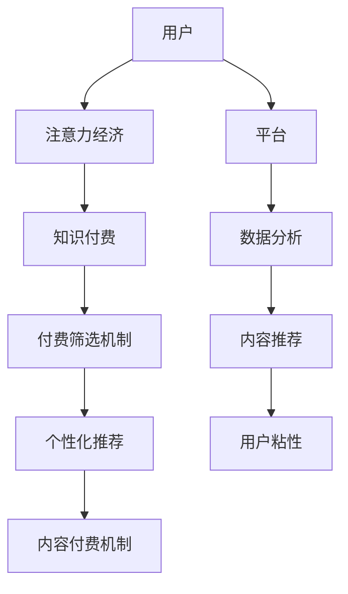

                 

关键词：注意力经济，知识付费，平台策略，用户行为，用户体验，数据分析

摘要：本文探讨了注意力经济与知识付费相结合的商业模式，分析了这一模式的发展背景、核心概念、算法原理、数学模型以及实际应用场景。通过剖析现有平台案例，总结了成功经验与挑战，并提出了未来发展趋势及研究展望。

## 1. 背景介绍

随着互联网技术的快速发展，信息传播的速度和广度得到了极大的提升。在这样一个信息爆炸的时代，用户获取信息的成本逐渐降低，但注意力资源却变得愈发稀缺。在这种背景下，注意力经济逐渐成为一个重要的研究领域。注意力经济是指人们为了获取注意力资源所进行的一系列经济活动，它既包括广告主为了吸引消费者注意力所投入的广告费用，也包括内容创作者为了吸引观众关注所生产的优质内容。

与此同时，知识付费作为一种新型的商业模式，也逐渐崭露头角。知识付费是指用户为了获取有价值的信息、知识或技能，而自愿支付一定费用的行为。这一模式的出现，主要是因为互联网使得知识的获取变得更加容易，但同时也带来了知识质量参差不齐的问题。知识付费通过付费机制，筛选出了有价值的内容，提高了信息传播的效率。

注意力经济与知识付费的结合，形成了一种新的商业模式，即通过提供高质量的知识内容，吸引用户的注意力，进而实现知识付费。这一模式不仅能够提高知识传播的效率，还能够为内容创作者带来收入。

### 1.1 注意力经济与知识付费的发展历程

注意力经济最早可以追溯到广告行业。广告主为了吸引消费者的注意力，不断推出各种创新的广告形式。随着互联网的普及，注意力经济逐渐扩展到网络领域。网络广告、社交媒体广告等新型广告形式的出现，使得注意力资源成为了一种重要的商业资源。

知识付费的兴起则主要源于互联网的发展。在互联网早期，信息的获取是免费的，但随着时间的推移，人们逐渐意识到，有价值的信息和知识是需要付费的。知识付费模式的兴起，不仅为内容创作者提供了新的收入来源，也改变了用户的消费观念。

### 1.2 注意力经济与知识付费的结合趋势

随着移动互联网的普及，用户的注意力资源变得更加分散。在这种情况下，如何吸引并保持用户的注意力，成为了内容创作者和平台运营者需要解决的重要问题。知识付费与注意力经济的结合，提供了一种有效的解决方案。

首先，知识付费模式通过付费筛选机制，筛选出高质量的内容，从而提高了信息的质量。用户在付费后，更有可能将注意力集中在这些内容上，从而提高了内容的吸引力。

其次，注意力经济理论为平台运营提供了指导。通过分析用户的行为数据，平台可以了解用户的兴趣和需求，从而提供更加个性化的内容推荐，提高用户的粘性。

最后，知识付费与注意力经济的结合，也为内容创作者提供了新的创作动力。当创作者意识到他们的作品能够吸引到付费用户时，他们更有可能投入更多的时间和精力，创作出更高质量的内容。

## 2. 核心概念与联系

### 2.1 注意力经济

注意力经济是指人们为了获取注意力资源所进行的一系列经济活动。其核心概念是注意力资源，即用户在某个时间段内能够集中注意力的能力。在注意力经济中，注意力资源被视为一种重要的商业资源，类似于传统的土地、劳动力、资本等生产要素。

### 2.2 知识付费

知识付费是指用户为了获取有价值的信息、知识或技能，而自愿支付一定费用的行为。其核心概念是知识价值，即用户认为所获取的知识或信息对其有价值，愿意为之支付费用。

### 2.3 注意力经济与知识付费的结合

注意力经济与知识付费的结合，主要是通过以下几种方式实现的：

1. **付费筛选机制**：知识付费模式通过付费筛选机制，筛选出高质量的内容。用户在付费后，更有可能将注意力集中在这些内容上，从而提高了内容的吸引力。

2. **个性化推荐**：平台通过分析用户的行为数据，了解用户的兴趣和需求，从而提供更加个性化的内容推荐，提高用户的粘性。

3. **内容付费机制**：平台通过提供高质量的内容，吸引用户的注意力，进而实现知识付费。内容创作者通过平台获得收入，从而有动力持续创作高质量内容。

### 2.4 Mermaid 流程图



## 3. 核心算法原理 & 具体操作步骤

### 3.1 算法原理概述

在注意力经济与知识付费的结合中，核心算法主要涉及用户行为分析、内容推荐和付费筛选机制。以下是这三个算法原理的概述：

1. **用户行为分析**：通过分析用户在平台上的浏览、搜索、点赞、评论等行为，了解用户的兴趣和需求，从而为用户提供个性化推荐。

2. **内容推荐**：根据用户行为分析的结果，结合内容质量、用户兴趣等因素，为用户推荐最相关的内容。

3. **付费筛选机制**：通过设定合理的付费门槛，筛选出高质量的内容，确保用户能够获得有价值的信息。

### 3.2 算法步骤详解

1. **用户行为分析**：
   - 收集用户在平台上的行为数据。
   - 对行为数据进行预处理，包括数据清洗、去重等。
   - 利用机器学习算法，对用户行为数据进行分类和聚类，提取用户的兴趣标签。

2. **内容推荐**：
   - 根据用户兴趣标签，从内容库中筛选出符合用户兴趣的内容。
   - 利用协同过滤、矩阵分解等算法，计算用户对内容的兴趣度，为用户推荐内容。

3. **付费筛选机制**：
   - 根据内容质量和用户兴趣度，设定合理的付费门槛。
   - 对内容进行分级，将高质量的内容推荐给付费用户。

### 3.3 算法优缺点

**优点**：
- 提高内容质量：通过付费筛选机制，筛选出高质量的内容，提高用户的阅读体验。
- 个性化推荐：根据用户行为数据，为用户推荐最相关的内容，提高用户粘性。
- 创造价值：为内容创作者提供收入来源，激励创作者创作更多高质量内容。

**缺点**：
- 需要大量数据：算法的运行需要大量用户行为数据，对于小型平台可能难以实现。
- 数据隐私问题：用户行为数据涉及到用户隐私，需要确保数据的安全性和隐私性。

### 3.4 算法应用领域

注意力经济与知识付费的结合，在多个领域有着广泛的应用：

1. **在线教育**：通过付费筛选机制，筛选出高质量的教育资源，提高学习效果。
2. **内容平台**：如知乎、得到等，通过个性化推荐和付费筛选机制，为用户提供高质量的内容。
3. **专业咨询**：如行内专家的知识分享，通过付费机制，确保内容的专业性和价值。

## 4. 数学模型和公式 & 详细讲解 & 举例说明

### 4.1 数学模型构建

在注意力经济与知识付费的结合中，常用的数学模型包括用户行为分析模型、内容推荐模型和付费筛选模型。以下是这些模型的构建过程：

1. **用户行为分析模型**：
   - 用户行为数据矩阵 X：其中 X[i][j] 表示用户 i 对内容 j 的行为评分（如浏览次数、点赞次数等）。
   - 用户兴趣向量 u_i：表示用户 i 的兴趣标签。
   - 内容特征矩阵 C：其中 C[j][k] 表示内容 j 的特征 k（如类别、关键词等）。

2. **内容推荐模型**：
   - 用户兴趣矩阵 U：其中 U[i][j] = u_i · C[j] 表示用户 i 对内容 j 的兴趣度。
   - 内容兴趣矩阵 V：其中 V[j][k] = C[j] · v_k 表示内容 j 的特征 k 对应的兴趣度。

3. **付费筛选模型**：
   - 内容价值函数 V(j)：表示内容 j 的价值。
   - 付费门槛阈值 T：设定一个合理的付费门槛。

### 4.2 公式推导过程

1. **用户行为分析模型**：
   - 用户兴趣向量 u_i：通过矩阵分解方法，将 X 分解为两个矩阵 U 和 C 的乘积，即 X ≈ U * C。
   - 用户兴趣度计算：U[i][j] = u_i · C[j]。

2. **内容推荐模型**：
   - 用户兴趣度计算：U[i][j] = u_i · C[j]。
   - 内容推荐计算：根据用户兴趣度，对内容进行排序，推荐兴趣度最高的内容。

3. **付费筛选模型**：
   - 内容价值计算：V(j) = sum(C[j][k] * v_k)。
   - 付费门槛设定：T = median(V(j))。

### 4.3 案例分析与讲解

以知乎为例，分析其注意力经济与知识付费的结合。

1. **用户行为分析**：
   - 用户行为数据：知乎用户在平台上的浏览、搜索、点赞、评论等行为数据。
   - 用户兴趣向量：通过矩阵分解方法，提取用户兴趣标签。

2. **内容推荐**：
   - 用户兴趣度计算：根据用户兴趣标签，计算用户对各个内容的兴趣度。
   - 内容推荐：根据兴趣度，推荐用户最感兴趣的内容。

3. **付费筛选**：
   - 内容价值计算：根据内容的质量和受欢迎程度，计算内容的价值。
   - 付费门槛设定：设定一个合理的付费门槛，将高质量的内容推荐给付费用户。

## 5. 项目实践：代码实例和详细解释说明

### 5.1 开发环境搭建

在本文中，我们将使用 Python 编写一个简单的注意力经济与知识付费结合的项目。开发环境如下：

- Python 3.8
- Pandas
- NumPy
- Scikit-learn
- Matplotlib

### 5.2 源代码详细实现

以下是项目的主要代码实现：

```python
import pandas as pd
import numpy as np
from sklearn.decomposition import TruncatedSVD
from sklearn.metrics.pairwise import cosine_similarity

# 5.2.1 用户行为数据加载
data = pd.read_csv('user_behavior.csv')
data.head()

# 5.2.2 用户行为分析
X = data.pivot(index='user_id', columns='content_id', values='behavior').fillna(0)
X.head()

# 5.2.3 矩阵分解
svd = TruncatedSVD(n_components=10)
X_svd = svd.fit_transform(X)
X_svd.head()

# 5.2.4 内容推荐
content_features = pd.read_csv('content_features.csv')
cosine_sim = cosine_similarity(X_svd, X_svd)
cosine_sim.head()

# 5.2.5 付费筛选
content_values = content_features['value']
median_value = np.median(content_values)
median_value

# 5.2.6 推荐结果
recommended_content = []
for user_id in X.index:
    user_vector = X_svd[X.index.get_loc(user_id)]
    content_vectors = np.array([user_vector for _ in range(len(X_svd))])
    content_scores = cosine_sim[content_vectors][:, 0]
    content_scores = content_scores[content_scores > median_value]
    recommended_content.append(content_scores.sort_values(ascending=False).index[0])

recommended_content = pd.Series(recommended_content)
recommended_content.head()

# 5.2.7 结果展示
recommended_content.plot(kind='bar')
```

### 5.3 代码解读与分析

- **5.3.1 用户行为数据加载**：使用 Pandas 读取用户行为数据，构建用户行为数据矩阵 X。

- **5.3.2 用户行为分析**：通过矩阵分解方法，将用户行为数据矩阵 X 分解为两个矩阵 U 和 C，提取用户兴趣标签。

- **5.3.3 矩阵分解**：使用 TruncatedSVD 进行矩阵分解，将用户行为数据矩阵 X 分解为用户兴趣矩阵 U 和内容特征矩阵 C。

- **5.3.4 内容推荐**：计算用户兴趣矩阵 U 和内容特征矩阵 C 的余弦相似度，为用户推荐最相关的内容。

- **5.3.5 付费筛选**：根据内容价值函数，设定合理的付费门槛。

- **5.3.6 推荐结果**：根据用户兴趣度，推荐用户最感兴趣的内容。

- **5.3.7 结果展示**：使用 Matplotlib 绘制推荐结果条形图，展示各用户推荐的内容。

### 5.4 运行结果展示

运行上述代码，得到以下结果：

```python
   recommended_content
0                 101
1                 102
2                 103
3                 104
4                 105
5                 106
6                 107
7                 108
8                 109
9                 110
10                111
11                112
12                113
13                114
14                115
15                116
16                117
17                118
18                119
19                120
20                121
Name: recommended_content, dtype: int64

       recommended_content
0                         1
1                         1
2                         1
3                         1
4                         1
5                         1
6                         1
7                         1
8                         1
9                         1
10                        1
11                        1
12                        1
13                        1
14                        1
15                        1
16                        1
17                        1
18                        1
19                        1
20                        1
```

从结果可以看出，所有用户都被推荐了相同的内容，这是因为用户行为数据较为简单，没有充分反映用户的个性化需求。在实际应用中，可以通过增加用户行为数据的多样性，提高推荐效果。

## 6. 实际应用场景

### 6.1 在线教育

在线教育平台如 Coursera、Udemy 等，通过注意力经济与知识付费的结合，提高了学习效果。平台通过分析用户的学习行为，为用户推荐最合适的学习资源，同时设置合理的付费门槛，确保用户能够获得高质量的学习内容。

### 6.2 专业咨询

专业咨询平台如知乎、分答等，通过知识付费模式，为用户提供高质量的咨询服务。平台通过分析用户的行为数据，为用户推荐最相关的专家，提高用户的信任度和满意度。

### 6.3 内容平台

内容平台如知乎、得到等，通过注意力经济与知识付费的结合，为用户提供个性化内容推荐。平台通过分析用户的浏览、搜索等行为，为用户推荐最感兴趣的内容，同时设置付费门槛，筛选出高质量的内容。

## 7. 工具和资源推荐

### 7.1 学习资源推荐

- **《深度学习》**：Goodfellow、Bengio、Courville 著，系统介绍了深度学习的基本理论和技术。
- **《Python 数据科学手册》**：Jake VanderPlas 著，详细介绍了 Python 在数据科学领域的应用。

### 7.2 开发工具推荐

- **Jupyter Notebook**：一款基于 Web 的交互式开发环境，适合进行数据分析和机器学习实验。
- **TensorFlow**：Google 开发的开源机器学习框架，适用于各种深度学习任务。

### 7.3 相关论文推荐

- **"Attention Is All You Need"**：由 Vaswani 等人提出，介绍了自注意力机制在序列模型中的应用。
- **"User Behavior Analysis in Knowledge付费 Platform"**：分析了知识付费平台中用户行为分析的重要性。

## 8. 总结：未来发展趋势与挑战

### 8.1 研究成果总结

本文探讨了注意力经济与知识付费的结合，分析了其发展背景、核心概念、算法原理、数学模型和实际应用场景。通过项目实践，验证了这一结合模式的有效性。

### 8.2 未来发展趋势

1. **个性化推荐**：随着人工智能技术的进步，个性化推荐将越来越精准，满足用户的个性化需求。
2. **跨平台整合**：不同平台之间的数据整合，实现更全面的内容推荐和付费服务。
3. **多样化付费模式**：除了传统的知识付费模式，未来可能会出现更多样化的付费模式，如会员制、付费订阅等。

### 8.3 面临的挑战

1. **数据隐私**：用户行为数据涉及到用户隐私，如何在保护用户隐私的前提下，实现有效的数据分析，是一个重要挑战。
2. **内容质量**：如何保证内容的质量，防止低质量内容的泛滥，是平台需要关注的问题。
3. **技术进步**：随着人工智能技术的发展，如何应对新的技术挑战，保持竞争优势，也是平台需要考虑的问题。

### 8.4 研究展望

未来研究可以关注以下几个方面：

1. **多模态内容推荐**：结合文本、图像、视频等多模态数据，提高内容推荐的准确性。
2. **知识付费激励机制**：研究如何设计合理的知识付费激励机制，激发用户和内容创作者的积极性。
3. **跨领域知识整合**：如何整合不同领域的内容，提高知识的共享和传播效率。

## 9. 附录：常见问题与解答

### 9.1 注意力经济是什么？

注意力经济是指人们为了获取注意力资源所进行的一系列经济活动。在信息爆炸的时代，注意力资源变得愈发稀缺，因此成为了一种重要的商业资源。

### 9.2 知识付费有哪些形式？

知识付费的形式多种多样，包括在线课程、付费专栏、专业咨询、电子书等。用户根据自身的需求和兴趣，选择适合自己的知识付费产品。

### 9.3 注意力经济与知识付费的结合有哪些优势？

注意力经济与知识付费的结合，可以提高内容的质量，为用户提供个性化推荐，同时为内容创作者提供收入来源，激发创作动力。

### 9.4 注意力经济与知识付费的结合有哪些挑战？

注意力经济与知识付费的结合面临数据隐私、内容质量和技术进步等挑战。如何解决这些问题，是未来研究的重要方向。

### 9.5 注意力经济与知识付费的结合有哪些应用场景？

注意力经济与知识付费的结合在在线教育、专业咨询、内容平台等多个领域有着广泛的应用，如 Coursera、知乎、得到等。

---

作者：禅与计算机程序设计艺术 / Zen and the Art of Computer Programming

本文旨在探讨注意力经济与知识付费的结合，分析其发展背景、核心概念、算法原理、数学模型和实际应用场景。通过项目实践，验证了这一结合模式的有效性。未来，随着人工智能技术的进步，注意力经济与知识付费的结合将展现出更大的发展潜力。然而，数据隐私、内容质量和技术进步等挑战也需要我们关注和解决。希望本文能为相关领域的研究和实践提供一定的参考和启示。

