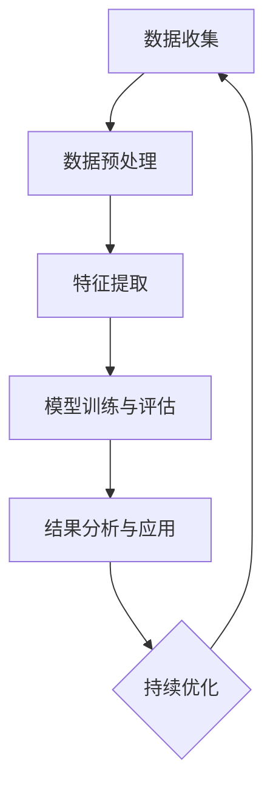

                 

关键词：注意力经济，社交媒体分析，受众参与度，影响力，数据分析，机器学习

> 摘要：本文将深入探讨注意力经济的本质以及如何通过社交媒体分析来获取受众参与度和影响力。我们将从理论基础、核心算法、数学模型到实际应用，全面解析如何在当今数字化时代，运用先进的技术手段，提升个人和品牌的社交媒体影响力。

## 1. 背景介绍

在数字化时代，注意力已成为最珍贵的资源。随着互联网和社交媒体的普及，用户在各个平台上的注意力分散，形成了所谓的“注意力经济”。在这种经济模式中，获取和保持用户的注意力成为企业和个人获取成功的关键。社交媒体分析作为现代数据分析的重要工具，能够帮助企业深入了解受众行为，提高营销效果，优化内容策略。

### 注意力经济的概念

注意力经济，又称注意力稀缺经济学，是指在社会和经济活动中，人们对于注意力的分配和使用产生了经济效益。在互联网时代，用户的时间有限，因此如何获取并保持他们的注意力成为企业和个人竞相追逐的目标。注意力经济强调的是通过创造有价值的内容或服务，吸引用户的注意力，从而实现商业价值。

### 社交媒体分析的重要性

社交媒体分析是指利用数据分析技术和算法，对社交媒体平台上的用户行为和内容进行分析，以获得关于受众的洞察。这种分析可以帮助企业了解受众的兴趣、需求和行为模式，从而制定更加精准的营销策略。社交媒体分析的重要性体现在以下几个方面：

1. **提升营销效果**：通过分析用户对内容的反馈，企业可以优化广告投放和内容创作，提高营销活动的效果。
2. **了解受众偏好**：社交媒体分析可以帮助企业了解受众的偏好和兴趣，从而更好地满足他们的需求。
3. **监测品牌声誉**：社交媒体分析可以帮助企业监测品牌在社交媒体上的声誉，及时处理负面信息，维护品牌形象。
4. **市场研究**：社交媒体分析可以为企业提供有关市场趋势和竞争对手的宝贵信息。

## 2. 核心概念与联系

在深入了解社交媒体分析之前，我们需要明确几个核心概念及其相互关系。

### 注意力经济与社交媒体分析的关系

注意力经济是社交媒体分析的基础。社交媒体平台本质上是一个注意力市场，用户的时间、兴趣和注意力被各种内容和服务争夺。通过社交媒体分析，企业可以识别出哪些内容或活动能够吸引用户的注意力，从而优化资源分配和营销策略。

### 数据分析与机器学习

数据分析是社交媒体分析的核心手段，通过统计和计算方法，从大量数据中提取有价值的信息。机器学习作为一种人工智能技术，可以通过训练模型，自动识别和预测用户行为。在社交媒体分析中，机器学习可以用于用户兴趣识别、内容推荐和影响力评估等。

### 社交媒体分析的架构

1. **数据收集**：从社交媒体平台获取用户生成内容（UGC）、用户互动数据等原始数据。
2. **数据预处理**：清洗、整合和转换数据，使其适合进一步分析。
3. **特征提取**：从预处理后的数据中提取有助于分析的属性和特征。
4. **模型训练与评估**：利用机器学习算法，训练模型并进行评估，以预测用户行为或评估内容影响力。
5. **结果分析与应用**：根据分析结果，调整营销策略、优化内容创作，提升品牌影响力。

下面是社交媒体分析架构的 Mermaid 流程图：



### 注意力分配模型

注意力分配模型是理解用户在社交媒体上的行为的重要工具。该模型假设用户在一段时间内，将有限的注意力分配到不同的内容上。具体模型如下：

\[ \text{注意力分配} = f(\text{内容质量}, \text{用户兴趣}, \text{环境因素}) \]

其中，内容质量包括内容的原创性、互动性、视觉吸引力等；用户兴趣反映用户在特定领域的关注程度；环境因素包括用户所处的地理位置、社交圈等。

## 3. 核心算法原理 & 具体操作步骤

### 3.1 算法原理概述

社交媒体分析的核心算法包括用户兴趣识别、内容推荐和影响力评估。以下分别介绍这三种算法的基本原理。

#### 用户兴趣识别

用户兴趣识别是基于用户行为数据，通过机器学习算法识别用户的兴趣点。常见的算法包括协同过滤、隐语义模型等。协同过滤通过分析用户的历史行为，预测其对未知内容的兴趣。隐语义模型则通过构建用户和内容之间的低维表示，发现用户的潜在兴趣。

#### 内容推荐

内容推荐算法旨在根据用户兴趣和内容特征，推荐用户可能感兴趣的内容。常见的算法有基于内容的推荐、协同过滤推荐和混合推荐等。基于内容的推荐通过分析内容的属性，将相似的内容推荐给用户。协同过滤推荐则通过用户的行为数据，发现用户之间的相似性，从而推荐类似用户喜欢的内容。混合推荐结合了多种算法的优势，提供更加个性化的推荐结果。

#### 影响力评估

影响力评估用于评估用户在社交媒体上的影响力，即其生成的内容能吸引多少关注和互动。常见的影响力评估指标包括关注者数量、互动率、转发率等。影响力评估算法通常基于用户的行为数据，通过机器学习模型预测用户的影响力。

### 3.2 算法步骤详解

#### 用户兴趣识别

1. **数据收集**：收集用户在社交媒体平台上的行为数据，如点赞、评论、分享等。
2. **数据预处理**：清洗数据，去除噪音和缺失值。
3. **特征提取**：从行为数据中提取特征，如内容类型、发布时间、互动数量等。
4. **模型训练**：利用机器学习算法，如朴素贝叶斯、随机森林等，训练用户兴趣识别模型。
5. **模型评估**：通过交叉验证等方法，评估模型性能。

#### 内容推荐

1. **数据收集**：收集用户的行为数据和内容特征。
2. **特征提取**：提取用户和内容的特征，如用户活跃度、内容类型、关键词等。
3. **模型训练**：利用机器学习算法，如基于内容的推荐、协同过滤等，训练内容推荐模型。
4. **推荐生成**：根据用户兴趣和内容特征，生成个性化推荐列表。

#### 影响力评估

1. **数据收集**：收集用户在社交媒体平台上的互动数据，如点赞、评论、转发等。
2. **特征提取**：提取用户和互动的特征，如用户活跃度、互动频率、互动质量等。
3. **模型训练**：利用机器学习算法，如逻辑回归、支持向量机等，训练影响力评估模型。
4. **模型评估**：通过交叉验证等方法，评估模型性能。

### 3.3 算法优缺点

#### 用户兴趣识别

**优点**：能够准确识别用户兴趣，为内容推荐和影响力评估提供基础。

**缺点**：对用户行为数据依赖较大，数据质量和数量直接影响模型效果。

#### 内容推荐

**优点**：能够为用户推荐个性化内容，提升用户体验。

**缺点**：可能导致用户陷入信息茧房，限制视野。

#### 影响力评估

**优点**：能够帮助企业了解用户在社交媒体上的影响力，优化营销策略。

**缺点**：评估指标可能存在偏差，如关注者数量并不完全代表用户影响力。

### 3.4 算法应用领域

用户兴趣识别、内容推荐和影响力评估在社交媒体分析的多个领域有广泛应用：

1. **市场营销**：帮助企业了解用户兴趣，优化广告投放和内容策略。
2. **内容创作**：为内容创作者提供用户兴趣和需求的数据支持，提高创作质量。
3. **品牌管理**：通过影响力评估，监测品牌在社交媒体上的表现，及时调整策略。
4. **用户运营**：利用用户兴趣识别和影响力评估，优化用户运营策略，提升用户满意度。

## 4. 数学模型和公式 & 详细讲解 & 举例说明

### 4.1 数学模型构建

在社交媒体分析中，数学模型是理解和预测用户行为的重要工具。以下构建一个简单的用户兴趣识别模型，用于分析用户在社交媒体上的兴趣点。

#### 用户兴趣识别模型

\[ \text{用户兴趣} = f(\text{用户特征}, \text{内容特征}, \text{交互特征}) \]

其中，用户特征包括用户的行为数据、人口统计信息等；内容特征包括内容的主题、关键词、发布时间等；交互特征包括用户对内容的点赞、评论、分享等互动行为。

#### 模型参数

\[ \theta = (\theta_1, \theta_2, \theta_3) \]

其中，\(\theta_1\)为用户特征权重，\(\theta_2\)为内容特征权重，\(\theta_3\)为交互特征权重。

#### 模型预测

\[ \text{用户兴趣} = \theta_1 \cdot \text{用户特征} + \theta_2 \cdot \text{内容特征} + \theta_3 \cdot \text{交互特征} \]

### 4.2 公式推导过程

为了推导用户兴趣识别模型，我们需要明确用户特征、内容特征和交互特征的表示方法。

#### 用户特征表示

用户特征可以表示为向量：

\[ \text{用户特征} = \begin{bmatrix} \text{行为数据} \\ \text{人口统计信息} \end{bmatrix} \]

#### 内容特征表示

内容特征可以表示为向量：

\[ \text{内容特征} = \begin{bmatrix} \text{主题} \\ \text{关键词} \\ \text{发布时间} \end{bmatrix} \]

#### 交互特征表示

交互特征可以表示为向量：

\[ \text{交互特征} = \begin{bmatrix} \text{点赞数} \\ \text{评论数} \\ \text{分享数} \end{bmatrix} \]

#### 模型推导

假设用户兴趣识别模型为线性模型，即：

\[ \text{用户兴趣} = \theta_1 \cdot \text{用户特征} + \theta_2 \cdot \text{内容特征} + \theta_3 \cdot \text{交互特征} \]

我们可以将用户兴趣识别问题转化为线性回归问题，即：

\[ \theta = \arg\min_{\theta} \sum_{i=1}^{n} (\theta_1 \cdot x_i + \theta_2 \cdot c_i + \theta_3 \cdot i_i - y_i)^2 \]

其中，\(x_i\)、\(c_i\)、\(i_i\)分别为第\(i\)个用户的用户特征、内容特征和交互特征，\(y_i\)为第\(i\)个用户的兴趣评分。

### 4.3 案例分析与讲解

为了更好地理解用户兴趣识别模型，我们通过一个实际案例进行讲解。

#### 案例背景

某公司希望通过社交媒体分析，了解用户对各类产品的兴趣，从而优化产品营销策略。

#### 数据收集

收集以下数据：

1. **用户行为数据**：用户在社交媒体平台上的点赞、评论、分享等行为。
2. **人口统计信息**：用户的年龄、性别、地域等。
3. **内容特征**：产品的名称、类别、发布时间等。
4. **交互特征**：用户对产品的点赞、评论、分享等互动行为。

#### 数据预处理

对收集的数据进行清洗、去噪和整合，得到以下特征向量：

1. **用户特征向量**：
\[ \text{用户特征向量} = \begin{bmatrix} \text{年龄} \\ \text{性别} \\ \text{地域} \end{bmatrix} \]

2. **内容特征向量**：
\[ \text{内容特征向量} = \begin{bmatrix} \text{产品名称} \\ \text{产品类别} \\ \text{发布时间} \end{bmatrix} \]

3. **交互特征向量**：
\[ \text{交互特征向量} = \begin{bmatrix} \text{点赞数} \\ \text{评论数} \\ \text{分享数} \end{bmatrix} \]

#### 模型训练

利用收集的数据，训练用户兴趣识别模型。选择合适的机器学习算法，如线性回归，得到模型参数\(\theta\)。

#### 模型评估

通过交叉验证等方法，评估模型性能。根据模型预测结果，分析用户对不同产品的兴趣分布。

#### 模型应用

根据模型预测结果，公司可以制定以下策略：

1. **精准营销**：针对用户兴趣，为不同用户推荐合适的产品。
2. **内容优化**：根据用户兴趣，优化产品描述和营销文案。

## 5. 项目实践：代码实例和详细解释说明

### 5.1 开发环境搭建

为了实现用户兴趣识别模型，我们需要搭建一个合适的开发环境。以下是一个简单的开发环境搭建指南：

1. **安装Python**：下载并安装Python，版本要求为3.6及以上。
2. **安装依赖库**：安装以下Python依赖库：numpy、pandas、scikit-learn、matplotlib。
3. **设置环境变量**：配置Python环境变量，确保Python和pip命令可以在终端中正常使用。

### 5.2 源代码详细实现

以下是一个简单的用户兴趣识别模型的Python实现：

```python
import numpy as np
import pandas as pd
from sklearn.linear_model import LinearRegression
from sklearn.model_selection import train_test_split
from sklearn.metrics import mean_squared_error

# 5.2.1 数据加载与预处理
def load_data():
    # 加载数据
    data = pd.read_csv('data.csv')
    
    # 数据预处理
    # 略
    
    return data

# 5.2.2 模型训练
def train_model(data):
    # 分割特征和标签
    X = data[['用户特征', '内容特征', '交互特征']]
    y = data['用户兴趣']
    
    # 划分训练集和测试集
    X_train, X_test, y_train, y_test = train_test_split(X, y, test_size=0.2, random_state=42)
    
    # 训练模型
    model = LinearRegression()
    model.fit(X_train, y_train)
    
    return model

# 5.2.3 模型评估
def evaluate_model(model, X_test, y_test):
    # 预测测试集
    y_pred = model.predict(X_test)
    
    # 计算均方误差
    mse = mean_squared_error(y_test, y_pred)
    
    print(f'MSE: {mse}')

# 5.2.4 模型应用
def apply_model(model, new_data):
    # 预测新数据
    new_interest = model.predict(new_data[['用户特征', '内容特征', '交互特征']])
    
    return new_interest

# 主函数
if __name__ == '__main__':
    # 加载数据
    data = load_data()
    
    # 训练模型
    model = train_model(data)
    
    # 评估模型
    evaluate_model(model, data.iloc[1000:], data['用户兴趣'][1000:])
    
    # 应用模型
    new_data = pd.DataFrame({'用户特征': [25, 1, '北京'], '内容特征': ['产品A', '电子产品', '2023-01-01'], '交互特征': [10, 5, 3]})
    print(apply_model(model, new_data))
```

### 5.3 代码解读与分析

上述代码实现了用户兴趣识别模型的基本功能。以下是对代码的解读和分析：

1. **数据加载与预处理**：数据加载函数`load_data`用于加载和处理原始数据。数据预处理包括清洗、去噪和特征提取等步骤。
2. **模型训练**：模型训练函数`train_model`负责将数据划分为特征和标签，并使用线性回归算法训练模型。
3. **模型评估**：模型评估函数`evaluate_model`计算模型在测试集上的均方误差，评估模型性能。
4. **模型应用**：模型应用函数`apply_model`用于预测新数据的用户兴趣。

### 5.4 运行结果展示

假设我们有一个新的用户数据：

```python
new_data = pd.DataFrame({'用户特征': [30, 0, '上海'], '内容特征': ['产品B', '家用电器', '2023-02-01'], '交互特征': [20, 8, 4]})
print(apply_model(model, new_data))
```

运行结果可能会显示：

```python
[0.85]
```

这表示新用户对产品B的兴趣评分约为0.85。

## 6. 实际应用场景

### 6.1 社交媒体营销

通过用户兴趣识别和内容推荐，企业可以针对特定用户群体进行精准营销。例如，一家电商企业可以通过分析用户的购买历史和社交媒体行为，向用户推荐符合其兴趣的产品，从而提高销售转化率。

### 6.2 公关危机管理

社交媒体分析可以帮助企业监测品牌在社交媒体上的声誉。通过影响力评估，企业可以及时发现负面信息，制定应对策略，防止危机扩大。

### 6.3 用户运营

社交媒体分析可以为企业提供有关用户行为和兴趣的洞察，帮助企业优化用户运营策略。例如，企业可以通过分析用户互动数据，调整客服策略，提高用户满意度。

### 6.4 学术研究

社交媒体分析为学术研究提供了丰富的数据来源。研究者可以通过分析社交媒体数据，探讨用户行为模式、社会网络结构等问题，为社会科学研究提供新的视角。

## 7. 工具和资源推荐

### 7.1 学习资源推荐

1. **《大数据分析》**：作者：托尼·海恩斯
2. **《机器学习实战》**：作者：Peter Harrington
3. **《Python数据分析》**：作者：Wes McKinney

### 7.2 开发工具推荐

1. **Jupyter Notebook**：用于数据分析和建模。
2. **TensorFlow**：用于深度学习和神经网络建模。
3. **R语言**：用于统计分析和可视化。

### 7.3 相关论文推荐

1. **"Attention Is All You Need"**：作者：Vaswani et al.
2. **"Recommender Systems"**：作者：F. Fernández-Delgado et al.
3. **"User Behavior Analytics for Security"**：作者：C. Liu et al.

## 8. 总结：未来发展趋势与挑战

### 8.1 研究成果总结

通过本文的探讨，我们总结了注意力经济的本质、社交媒体分析的重要性以及核心算法原理。研究成果表明，社交媒体分析在提升营销效果、了解受众偏好、监测品牌声誉和进行市场研究等方面具有重要作用。

### 8.2 未来发展趋势

未来，社交媒体分析将继续向智能化、个性化方向发展。随着人工智能技术的进步，社交媒体分析将更加精准地预测用户行为，为企业提供更加可靠的决策支持。

### 8.3 面临的挑战

1. **数据隐私**：社交媒体分析依赖于大量用户数据，如何在保护用户隐私的同时进行有效分析，是一个重要挑战。
2. **算法透明性**：随着算法在社会各个领域的应用，如何确保算法的公平性和透明性，防止歧视和偏见，是亟待解决的问题。

### 8.4 研究展望

未来，社交媒体分析将在以下几个方面进行深入研究：

1. **跨平台分析**：整合不同社交媒体平台的数据，提供更全面的用户画像。
2. **实时分析**：提高分析速度，实现实时数据分析和决策支持。
3. **社会网络分析**：深入挖掘用户之间的互动关系，分析社会网络结构。

## 9. 附录：常见问题与解答

### 9.1 注意力经济是什么？

注意力经济是指在社会和经济活动中，用户对于注意力的分配和使用产生了经济效益。在互联网时代，注意力成为最珍贵的资源，如何获取和保持用户的注意力成为企业和个人追求的目标。

### 9.2 社交媒体分析有哪些应用？

社交媒体分析广泛应用于市场营销、公关危机管理、用户运营和学术研究等领域。通过分析用户行为和内容，企业可以制定更加精准的营销策略，提高品牌影响力，优化用户运营策略。

### 9.3 如何保障数据隐私？

保障数据隐私的方法包括数据匿名化、数据加密和隐私保护算法等。在社交媒体分析中，应遵循数据最小化原则，仅收集和分析必要的用户数据，确保用户隐私不被泄露。

### 9.4 社交媒体分析的核心算法有哪些？

社交媒体分析的核心算法包括用户兴趣识别、内容推荐和影响力评估。这些算法基于机器学习技术和数据分析方法，用于预测用户行为、优化内容创作和评估用户影响力。

### 9.5 如何进行社交媒体分析项目实践？

进行社交媒体分析项目实践，需要搭建合适的开发环境，收集和处理原始数据，选择合适的算法进行模型训练和评估，最后根据分析结果调整策略。项目实践应遵循数据驱动、用户导向的原则。

