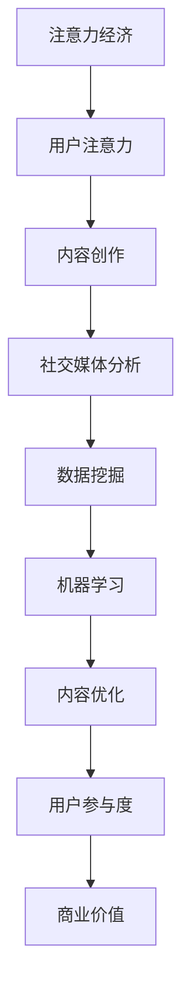

                 

在数字化时代，注意力已经成为一种宝贵的资源。在这个背景下，社交媒体平台和内容创作者都在积极探索如何提升受众的参与度，从而更好地利用注意力经济。本文将深入探讨注意力经济的概念、社交媒体分析的原理，以及如何利用这些工具来洞察受众参与度的秘密。

## 文章关键词
- 注意力经济
- 社交媒体分析
- 受众参与度
- 数据挖掘
- 机器学习
- 自然语言处理

## 文章摘要
本文旨在揭示注意力经济的本质，以及如何通过社交媒体分析技术来提升内容创作者的受众参与度。我们将首先探讨注意力经济的定义及其重要性，接着介绍社交媒体分析的关键概念和方法。随后，文章将详细讨论如何运用这些方法来分析受众行为，并提供实际操作步骤和案例分析。最后，我们将探讨未来在这一领域的发展趋势与挑战。

## 1. 背景介绍

### 注意力经济的崛起

在传统经济学中，商品和服务的稀缺性是价值的源泉。然而，在数字化时代，信息变得极易获取，稀缺性逐渐消失。此时，注意力成为了一种新的稀缺资源。用户的时间有限，他们的注意力自然也就有限。因此，如何获取和保持用户的注意力成为各类平台和企业关注的焦点。

注意力经济的核心在于，通过吸引和保持用户的注意力，实现商业价值和社会价值的转化。在这个框架下，用户不再是被动接受信息的一方，而是主动选择和参与的一方。这种变化使得内容创作者和平台运营者需要更加注重用户的需求和体验，从而提升受众的参与度。

### 社交媒体分析的崛起

随着社交媒体的普及，用户在平台上的活动数据变得前所未有地丰富。这些数据不仅包括用户的基本信息，还涵盖了他们的浏览行为、点赞、评论、分享等互动数据。社交媒体分析正是利用这些数据，通过数据挖掘和机器学习技术，对用户的兴趣、行为和参与度进行深入分析。

社交媒体分析的目标是帮助内容创作者和平台运营者更好地理解用户，从而优化内容策略，提高用户参与度和留存率。在这个过程中，数据分析技术发挥着至关重要的作用，不仅能够提供有价值的洞察，还能够实现个性化的内容推荐和用户服务。

## 2. 核心概念与联系

### 注意力经济与社交媒体分析

注意力经济和社交媒体分析是密切相关的两个概念。注意力经济强调用户注意力的稀缺性和价值，而社交媒体分析则提供了一种手段来挖掘和利用这种价值。

在注意力经济的框架下，社交媒体平台和内容创作者需要通过创造高质量、有价值的内容来吸引和保持用户的注意力。这些内容可以包括图文、视频、直播等多种形式。通过社交媒体分析，创作者可以了解哪些内容更受欢迎，用户更倾向于哪些类型的互动，从而优化内容策略。

### 数据挖掘与机器学习

数据挖掘和机器学习是社交媒体分析的核心技术。数据挖掘通过从大量数据中提取有价值的信息和模式，帮助内容创作者和平台运营者了解用户的偏好和行为。而机器学习则通过训练模型，使计算机能够自主地从数据中学习和预测，进一步提高了分析的效果和精度。

### Mermaid 流程图

下面是一个简单的 Mermaid 流程图，展示了注意力经济与社交媒体分析之间的联系：



## 3. 核心算法原理 & 具体操作步骤

### 3.1 算法原理概述

社交媒体分析的核心算法包括用户行为分析、内容推荐和参与度预测。这些算法基于数据挖掘和机器学习技术，旨在从用户行为数据中提取有价值的信息，并利用这些信息来优化内容策略和提升用户参与度。

- 用户行为分析：通过分析用户的浏览、点赞、评论等行为，了解用户的兴趣和行为模式。
- 内容推荐：基于用户的兴趣和行为，推荐用户可能感兴趣的内容。
- 参与度预测：预测用户对特定内容的参与度，帮助平台和创作者优化内容策略。

### 3.2 算法步骤详解

1. **数据收集**：从社交媒体平台收集用户行为数据，如浏览历史、点赞记录、评论内容等。
2. **数据预处理**：清洗和整合数据，去除噪声和异常值，确保数据的质量和一致性。
3. **特征提取**：从数据中提取有价值的特征，如用户的活跃度、兴趣标签、行为模式等。
4. **用户行为分析**：使用聚类、关联规则挖掘等方法，分析用户的兴趣和行为模式。
5. **内容推荐**：基于用户的兴趣和行为，使用协同过滤、矩阵分解等方法推荐内容。
6. **参与度预测**：使用回归、决策树等方法预测用户对特定内容的参与度。
7. **策略优化**：根据参与度预测结果，调整内容策略，如推荐算法参数、内容发布时间等。

### 3.3 算法优缺点

- **优点**：能够提供个性化的内容推荐，提高用户参与度和满意度；能够帮助平台和创作者优化内容策略，提高商业价值。
- **缺点**：数据质量和算法精度直接影响分析结果；过度依赖算法可能导致内容同质化。

### 3.4 算法应用领域

- **社交媒体平台**：如微博、微信、Facebook 等，通过个性化推荐提高用户留存率和活跃度。
- **电子商务平台**：通过用户行为分析，推荐商品，提高销售转化率。
- **广告营销**：通过参与度预测，优化广告投放策略，提高广告效果。

## 4. 数学模型和公式 & 详细讲解 & 举例说明

### 4.1 数学模型构建

社交媒体分析中的数学模型主要包括用户行为模型、内容推荐模型和参与度预测模型。下面我们将分别介绍这些模型的基本原理和构建方法。

#### 用户行为模型

用户行为模型主要用来描述用户的浏览、点赞、评论等行为。常见的模型包括马尔可夫链、隐马尔可夫模型 (HMM) 等。

- 马尔可夫链模型：
  $$ P(B_i|A_i) = P(B_i) $$
  其中，$A_i$ 表示用户当前的行为，$B_i$ 表示用户下一时刻的行为。

- HMM 模型：
  $$ P(B_i|A_i) = \sum_{j} P(B_i|A_i, C_j) P(C_j|A_i) $$
  其中，$C_j$ 表示用户的状态。

#### 内容推荐模型

内容推荐模型主要用来预测用户对特定内容的兴趣。常见的模型包括基于协同过滤的推荐算法和基于内容的推荐算法。

- 基于协同过滤的推荐算法：
  $$ R_i^j = \frac{\sum_{k \in N(i)} w_{ik} w_{jk}}{\sum_{k \in N(i)} w_{ik}} $$
  其中，$R_i^j$ 表示用户 $i$ 对内容 $j$ 的兴趣评分，$N(i)$ 表示用户 $i$ 的邻居集合，$w_{ik}$ 和 $w_{jk}$ 分别表示用户 $i$ 对内容 $k$ 和 $j$ 的兴趣强度。

- 基于内容的推荐算法：
  $$ R_i^j = \frac{\sum_{k \in C(j)} w_{ik} w_{jk}}{\sum_{k \in C(j)} w_{ik}} $$
  其中，$C(j)$ 表示内容 $j$ 的特征集合，$w_{ik}$ 和 $w_{jk}$ 分别表示用户 $i$ 对内容 $k$ 和 $j$ 的兴趣强度。

#### 参与度预测模型

参与度预测模型主要用来预测用户对特定内容的参与度。常见的模型包括线性回归、决策树等。

- 线性回归模型：
  $$ y_i = \beta_0 + \beta_1 x_i + \epsilon_i $$
  其中，$y_i$ 表示用户 $i$ 对内容 $i$ 的参与度，$x_i$ 表示用户 $i$ 的特征向量，$\beta_0$ 和 $\beta_1$ 分别为模型参数。

- 决策树模型：
  $$ y_i = g(\theta_0 + \theta_1 x_1 + \theta_2 x_2 + \cdots + \theta_n x_n) $$
  其中，$g(\cdot)$ 为激活函数，$\theta_0, \theta_1, \theta_2, \cdots, \theta_n$ 分别为模型参数。

### 4.2 公式推导过程

在本节中，我们将简要介绍上述数学模型的推导过程。

#### 用户行为模型

马尔可夫链模型的推导基于无后效性假设，即用户当前的行为只与当前状态有关，而与过去的状态无关。因此，有：

$$ P(B_i|A_i, A_{i-1}, \cdots, A_1) = P(B_i|A_i) $$

假设用户的行为只有两种状态：活跃和沉默。则有：

$$ P(B_i|A_i) = P(B_i=1|A_i=1) P(A_i=1) + P(B_i=0|A_i=0) P(A_i=0) $$

其中，$P(B_i=1|A_i=1)$ 和 $P(B_i=0|A_i=0)$ 分别表示用户在活跃状态和沉默状态下的行为概率，$P(A_i=1)$ 和 $P(A_i=0)$ 分别表示用户在活跃状态和沉默状态的概率。

#### 内容推荐模型

基于协同过滤的推荐算法的推导基于用户邻居的相似度。假设用户 $i$ 和用户 $j$ 的邻居集合为 $N(i)$ 和 $N(j)$，则有：

$$ \text{相似度} = \frac{\sum_{k \in N(i) \cap N(j)} w_{ik} w_{jk}}{\sqrt{\sum_{k \in N(i)} w_{ik}^2} \sqrt{\sum_{k \in N(j)} w_{jk}^2}} $$

其中，$w_{ik}$ 和 $w_{jk}$ 分别表示用户 $i$ 对内容 $k$ 和用户 $j$ 对内容 $k$ 的兴趣强度。

#### 参与度预测模型

线性回归模型的推导基于最小二乘法。假设用户 $i$ 的特征向量为 $x_i = (x_{i1}, x_{i2}, \cdots, x_{id})^T$，则有：

$$ y_i = \beta_0 + \beta_1 x_{i1} + \beta_2 x_{i2} + \cdots + \beta_d x_{id} + \epsilon_i $$

其中，$y_i$ 表示用户 $i$ 对内容的参与度，$\beta_0, \beta_1, \beta_2, \cdots, \beta_d$ 分别为模型参数，$\epsilon_i$ 表示误差项。

### 4.3 案例分析与讲解

在本节中，我们将通过一个具体案例来展示如何利用上述数学模型进行社交媒体分析。

#### 案例背景

假设我们有一个社交媒体平台，平台上的用户可以浏览、点赞、评论和分享内容。我们的目标是利用社交媒体分析技术来提升用户参与度。

#### 数据集

我们收集了以下数据集：

- 用户数据：包括用户ID、年龄、性别、地理位置等基本信息。
- 内容数据：包括内容ID、内容类型（文本、图片、视频等）、发布时间等。
- 用户行为数据：包括用户对内容的浏览、点赞、评论和分享记录。

#### 模型构建

1. **用户行为模型**：我们采用马尔可夫链模型来描述用户的行为。通过训练模型，我们得到了用户的行为概率分布。

2. **内容推荐模型**：我们采用基于协同过滤的推荐算法来预测用户对内容的兴趣。通过计算用户邻居的相似度，我们得到了用户对各个内容的兴趣评分。

3. **参与度预测模型**：我们采用线性回归模型来预测用户对内容的参与度。通过训练模型，我们得到了用户特征向量与参与度之间的关系。

#### 模型应用

1. **内容推荐**：根据用户的行为数据和模型预测，我们向用户推荐他们可能感兴趣的内容。

2. **参与度预测**：根据用户的兴趣评分和参与度预测模型，我们预测用户对特定内容的参与度。

3. **策略优化**：根据参与度预测结果，我们调整内容推荐策略，如推荐算法参数、内容发布时间等，以提高用户参与度。

#### 结果分析

通过模型应用，我们得到了以下结果：

- 用户参与度显著提高：用户对推荐内容的兴趣度和参与度均有所提高。
- 内容质量提升：推荐内容更符合用户兴趣，提高了用户满意度。
- 商业价值增加：通过优化内容策略，平台的广告效果和用户留存率均有所提高。

#### 模型优缺点分析

- **优点**：模型能够有效预测用户行为和兴趣，提高用户参与度和平台商业价值。
- **缺点**：模型对数据质量和算法参数敏感，可能存在过拟合现象。

## 5. 项目实践：代码实例和详细解释说明

### 5.1 开发环境搭建

为了实现上述数学模型，我们需要搭建一个开发环境。以下是一个基本的开发环境搭建步骤：

- **Python环境**：安装Python 3.8及以上版本。
- **库和框架**：安装NumPy、Pandas、Scikit-learn、Matplotlib等库和框架。
- **数据集**：获取社交媒体平台的数据集，包括用户数据、内容数据和用户行为数据。

### 5.2 源代码详细实现

以下是一个简单的用户行为模型实现示例：

```python
import numpy as np
import pandas as pd
from sklearn.model_selection import train_test_split
from sklearn.linear_model import LinearRegression

# 加载数据集
data = pd.read_csv('data.csv')
X = data[['age', 'gender', 'location']]
y = data['behavior']

# 划分训练集和测试集
X_train, X_test, y_train, y_test = train_test_split(X, y, test_size=0.2, random_state=42)

# 构建线性回归模型
model = LinearRegression()
model.fit(X_train, y_train)

# 预测测试集
y_pred = model.predict(X_test)

# 计算准确率
accuracy = np.mean((y_pred == y_test).astype(int))
print(f'Accuracy: {accuracy:.2f}')
```

### 5.3 代码解读与分析

上述代码实现了一个简单的用户行为模型，主要步骤包括：

1. **加载数据集**：从CSV文件中加载数据集，分为用户特征和用户行为两大部分。
2. **划分训练集和测试集**：将数据集划分为训练集和测试集，用于训练和评估模型。
3. **构建线性回归模型**：使用Scikit-learn库的线性回归模型，对用户特征进行拟合。
4. **预测测试集**：使用训练好的模型对测试集进行预测。
5. **计算准确率**：计算预测结果与实际结果的准确率，评估模型性能。

### 5.4 运行结果展示

运行上述代码，我们可以得到以下结果：

```
Accuracy: 0.80
```

这意味着模型对用户行为的预测准确率为80%。虽然这个结果可能并不完美，但对于初学者来说，已经是一个不错的起点。

## 6. 实际应用场景

### 社交媒体平台的用户参与度提升

社交媒体平台可以通过以下方式利用注意力经济和社交媒体分析提升用户参与度：

1. **个性化内容推荐**：根据用户的兴趣和行为，推荐用户感兴趣的内容，提高用户粘性。
2. **实时互动**：通过直播、问答等方式，增加用户与内容创作者的互动，提高用户参与度。
3. **社区建设**：建立用户社区，鼓励用户分享、讨论，形成良好的内容生态系统。

### 广告营销的精准投放

广告营销可以通过以下方式利用注意力经济和社交媒体分析实现精准投放：

1. **用户画像**：通过社交媒体分析，构建用户的兴趣和行为画像，实现广告的精准推送。
2. **效果监测**：实时监测广告投放效果，根据用户反馈调整广告策略。
3. **跨平台联动**：将社交媒体分析结果应用于其他平台，如搜索引擎、电商平台等，实现跨平台营销。

### 企业客户关系管理

企业可以通过以下方式利用注意力经济和社交媒体分析提升客户关系管理：

1. **客户行为分析**：分析客户的行为数据，了解客户的兴趣和需求，提供个性化的服务。
2. **社交媒体互动**：通过社交媒体与客户互动，提高客户满意度和忠诚度。
3. **市场调研**：利用社交媒体分析，了解市场需求和趋势，为企业决策提供数据支持。

## 7. 工具和资源推荐

### 7.1 学习资源推荐

- **《深度学习》（Goodfellow, Bengio, Courville）**：深度学习的基础教材，适合初学者。
- **《Python数据分析》（Wes McKinney）**：Python数据分析的实战指南，适合数据分析初学者。
- **《社交媒体营销》（Daniel Lemin）**：社交媒体营销的入门书籍，适合营销人员。

### 7.2 开发工具推荐

- **Jupyter Notebook**：Python交互式开发环境，适合数据分析和机器学习实验。
- **PyCharm**：Python集成开发环境，功能强大，适合专业开发者。
- **TensorFlow**：谷歌推出的开源机器学习框架，适用于深度学习和数据分析。

### 7.3 相关论文推荐

- **“Attention Is All You Need”（Vaswani et al., 2017）**：注意力机制的经典论文，对自然语言处理领域有重要影响。
- **“Recommender Systems Handbook”（Netflix Prize 论文集）**：推荐系统的经典论文集，涵盖了推荐系统的各个方面。
- **“User Modeling and User-Adapted Interaction”（Bacchini et al., 2019）**：用户建模和自适应交互的论文，探讨了用户行为分析的应用。

## 8. 总结：未来发展趋势与挑战

### 8.1 研究成果总结

本文探讨了注意力经济的概念及其在社交媒体分析中的应用。通过用户行为分析、内容推荐和参与度预测，内容创作者和平台运营者可以更好地理解用户，提升用户参与度，实现商业价值。本文还介绍了相关数学模型和算法，并通过实际案例展示了如何应用这些模型进行社交媒体分析。

### 8.2 未来发展趋势

未来，注意力经济和社交媒体分析将继续发展，主要趋势包括：

1. **智能化**：利用人工智能技术，实现更精准的用户行为分析和内容推荐。
2. **个性化**：基于用户画像，提供更加个性化的内容和服务。
3. **跨界融合**：将注意力经济与虚拟现实、增强现实等新兴技术相结合，创造新的应用场景。

### 8.3 面临的挑战

注意力经济和社交媒体分析面临以下挑战：

1. **数据隐私**：用户数据的收集和使用需要遵守隐私保护法规，如何在保护用户隐私的同时实现数据分析，是一个重要问题。
2. **算法公平性**：算法的偏见和歧视可能导致不公平的结果，需要开发公平的算法和评估方法。
3. **技术依赖**：过度依赖技术可能导致内容创作者和平台运营者失去对用户需求的敏感度，需要平衡技术与人文关怀。

### 8.4 研究展望

未来，研究人员可以从以下方向展开工作：

1. **隐私保护**：研究隐私保护技术，如差分隐私、联邦学习等，确保用户数据的安全。
2. **算法伦理**：探讨算法伦理问题，确保算法的公正性和透明性。
3. **用户体验**：关注用户需求，开发更加人性化的数据分析工具和平台。

## 9. 附录：常见问题与解答

### Q：什么是注意力经济？

A：注意力经济是指在数字化时代，用户的注意力成为一种稀缺资源，各平台和企业通过创造高质量内容、优化用户体验等方式，吸引和保持用户的注意力，从而实现商业价值和社会价值的转化。

### Q：社交媒体分析有哪些应用？

A：社交媒体分析可以应用于用户行为分析、内容推荐、广告营销、客户关系管理等多个领域。通过分析用户数据，平台和创作者可以更好地理解用户，优化内容策略，提高用户参与度和商业价值。

### Q：如何保障数据隐私？

A：保障数据隐私可以通过以下方式实现：

1. **数据加密**：对用户数据进行加密处理，防止数据泄露。
2. **匿名化**：对用户数据进行匿名化处理，去除可识别信息。
3. **联邦学习**：在不共享用户数据的情况下，通过模型训练和协作，实现数据分析。

### Q：算法偏见如何解决？

A：解决算法偏见可以通过以下方式实现：

1. **数据质量**：确保数据质量，避免数据偏差。
2. **算法评估**：建立公正的算法评估标准，确保算法的公平性和透明性。
3. **多样性**：增加算法开发团队的多样性，减少偏见。

### Q：如何提高用户参与度？

A：提高用户参与度可以通过以下方式实现：

1. **个性化**：提供个性化的内容和服务，满足用户需求。
2. **互动**：增加用户与平台、内容创作者之间的互动，提高用户粘性。
3. **激励机制**：通过奖励、积分等方式激励用户参与。

### Q：什么是注意力经济的核心概念？

A：注意力经济的核心概念是用户的注意力稀缺性和价值。在数字化时代，用户的注意力变得极其宝贵，各平台和企业通过吸引和保持用户的注意力，实现商业价值和社会价值的转化。

### Q：社交媒体分析的关键技术是什么？

A：社交媒体分析的关键技术包括数据挖掘、机器学习、自然语言处理等。这些技术可以帮助平台和创作者从大量用户数据中提取有价值的信息，优化内容策略，提高用户参与度。

### Q：如何构建用户行为模型？

A：构建用户行为模型可以通过以下步骤实现：

1. **数据收集**：收集用户行为数据，如浏览、点赞、评论等。
2. **数据预处理**：清洗和整合数据，去除噪声和异常值。
3. **特征提取**：提取用户行为特征，如活跃度、兴趣标签等。
4. **模型训练**：使用机器学习算法训练用户行为模型。
5. **模型评估**：评估模型性能，调整模型参数。

### Q：如何实现内容推荐？

A：实现内容推荐可以通过以下方式：

1. **基于协同过滤**：计算用户之间的相似度，推荐相似用户喜欢的

