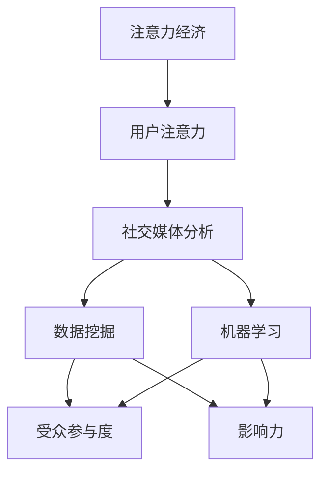

                 

### 文章关键词

- 注意力经济
- 社交媒体分析
- 受众参与度
- 影响力
- 数据挖掘
- 机器学习

<|assistant|>### 文章摘要

在数字时代，注意力成为了最珍贵的资源。本文将深入探讨注意力经济在社交媒体中的表现，分析受众参与度和影响力的秘密。通过核心概念与联系的讲解、核心算法原理的剖析、数学模型的构建与应用，以及实际项目实践的案例，本文旨在为读者提供全面而深刻的理解，揭示如何利用数据挖掘和机器学习技术，提升社交媒体的受众参与度和影响力，为企业带来商业价值。

## 1. 背景介绍

### 注意力经济的崛起

随着互联网和社交媒体的迅猛发展，人们的信息获取渠道变得多样化，注意力成为了稀缺资源。在注意力经济中，用户的注意力被看作是一种宝贵资源，而吸引用户的注意力则成为企业争夺市场份额的关键。社交媒体平台如Facebook、Twitter、Instagram等，通过算法和内容推荐系统，不断优化用户的浏览体验，从而提高用户的停留时间和参与度。

### 社交媒体分析的重要性

社交媒体分析是一种利用大数据技术，对社交媒体平台上的用户行为、内容、互动等信息进行系统化研究和分析的方法。通过对社交媒体数据的挖掘，企业能够深入了解受众的需求和偏好，制定更有效的营销策略，提高品牌影响力和用户参与度。社交媒体分析已经成为市场营销、用户行为研究和品牌管理中的重要工具。

### 受众参与度和影响力的测量

受众参与度是衡量用户对社交媒体内容互动程度的重要指标，包括点赞、评论、分享、转发等。而影响力则是指用户在社交媒体上产生的内容能够吸引其他用户关注和互动的能力。测量受众参与度和影响力，有助于企业了解其在社交媒体上的实际表现，优化内容策略和推广方式。

## 2. 核心概念与联系

### 注意力经济

注意力经济是一种基于用户注意力的商业模式，企业通过吸引用户的注意力来创造价值。在社交媒体中，注意力经济表现为用户对平台内容的关注和互动。用户的时间、精力和兴趣都成为了企业的宝贵资源。

### 社交媒体分析

社交媒体分析是一种利用数据挖掘和机器学习技术，对社交媒体平台上的海量数据进行挖掘和分析的方法。通过分析用户行为、内容、互动等信息，企业可以深入了解用户需求，优化营销策略。

### 受众参与度

受众参与度是衡量用户对社交媒体内容互动程度的重要指标，包括点赞、评论、分享、转发等。高参与度表明用户对内容的兴趣和认可，有助于提高品牌的知名度和用户忠诚度。

### 影响力

影响力是指用户在社交媒体上产生的内容能够吸引其他用户关注和互动的能力。高影响力的用户能够为企业带来更大的传播效果，提高品牌的市场份额。

### 数据挖掘与机器学习

数据挖掘和机器学习是社交媒体分析的重要技术手段，通过算法和模型，可以自动挖掘和分析大量数据，发现用户行为模式和趋势，为企业提供决策支持。

<|assistant|>### 核心概念与联系（Mermaid 流程图）



## 3. 核心算法原理 & 具体操作步骤

### 3.1 算法原理概述

在社交媒体分析中，核心算法主要包括用户行为分析、内容推荐和影响力计算等。这些算法基于数据挖掘和机器学习技术，通过对用户行为数据和内容数据的挖掘和分析，实现以下目标：

- 了解用户需求和偏好
- 优化内容策略和推荐算法
- 提高受众参与度和影响力

### 3.2 算法步骤详解

#### 3.2.1 用户行为分析

用户行为分析主要包括以下步骤：

1. **数据收集**：从社交媒体平台获取用户行为数据，如点赞、评论、分享、转发等。
2. **数据预处理**：对收集到的数据进行清洗、去重和归一化处理，保证数据质量。
3. **特征提取**：从用户行为数据中提取用户特征，如活跃度、互动频率、兴趣偏好等。
4. **行为模式识别**：利用机器学习算法，对用户特征进行分析，识别用户的行为模式。

#### 3.2.2 内容推荐

内容推荐主要包括以下步骤：

1. **内容收集**：从社交媒体平台获取用户生成的内容，如文本、图片、视频等。
2. **内容预处理**：对收集到的内容数据进行清洗、去重和分类处理。
3. **特征提取**：从内容数据中提取内容特征，如关键词、主题、情感等。
4. **推荐算法**：利用协同过滤、基于内容的推荐等算法，为用户推荐感兴趣的内容。

#### 3.2.3 影响力计算

影响力计算主要包括以下步骤：

1. **影响力指标定义**：定义影响力指标，如粉丝数、互动率、传播深度等。
2. **数据收集**：从社交媒体平台获取用户影响力数据。
3. **数据预处理**：对收集到的数据进行清洗、去重和归一化处理。
4. **影响力评估**：利用机器学习算法，对用户的影响力进行评估和排名。

### 3.3 算法优缺点

#### 3.3.1 用户行为分析

优点：

- 全面了解用户需求和偏好
- 提高内容个性化推荐效果

缺点：

- 数据隐私问题
- 处理复杂度高

#### 3.3.2 内容推荐

优点：

- 提高用户参与度和满意度
- 增加用户停留时间和互动量

缺点：

- 需要大量的数据支持
- 推荐效果可能存在偏差

#### 3.3.3 影响力计算

优点：

- 提高品牌影响力
- 帮助企业识别潜在意见领袖

缺点：

- 评估结果可能存在偏差
- 处理复杂度高

### 3.4 算法应用领域

用户行为分析、内容推荐和影响力计算算法在多个领域都有广泛应用：

- **市场营销**：通过用户行为分析，了解用户需求，优化营销策略；通过内容推荐，提高用户参与度和满意度。
- **品牌管理**：通过影响力计算，识别潜在意见领袖，提高品牌传播效果。
- **社交网络分析**：通过用户行为分析和内容推荐，构建社交网络，分析用户关系和传播路径。

## 4. 数学模型和公式 & 详细讲解 & 举例说明

### 4.1 数学模型构建

在社交媒体分析中，常用的数学模型包括用户行为模型、内容推荐模型和影响力计算模型。以下是这些模型的构建过程：

#### 4.1.1 用户行为模型

用户行为模型主要基于马尔可夫链模型，用于预测用户在社交媒体上的行为。模型的基本公式如下：

\[ P_{ij} = \frac{C_{ij}}{\sum_{k=1}^{n} C_{ik}} \]

其中，\( P_{ij} \) 表示用户从行为 \( i \) 转移到行为 \( j \) 的概率，\( C_{ij} \) 表示用户在一段时间内从行为 \( i \) 转移到行为 \( j \) 的次数，\( n \) 表示用户可能的行为总数。

#### 4.1.2 内容推荐模型

内容推荐模型主要基于协同过滤算法，用于为用户推荐感兴趣的内容。模型的基本公式如下：

\[ R_{ui} = \sum_{j=1}^{m} r_{uj} \cdot r_{ui} \]

其中，\( R_{ui} \) 表示用户 \( u \) 对内容 \( i \) 的评分预测，\( r_{uj} \) 和 \( r_{ui} \) 分别表示用户 \( u \) 对内容 \( j \) 和内容 \( i \) 的实际评分。

#### 4.1.3 影响力计算模型

影响力计算模型主要基于矩阵分解算法，用于评估用户在社交媒体上的影响力。模型的基本公式如下：

\[ F_{ij} = \sqrt{C_{i} \cdot C_{j}} \]

其中，\( F_{ij} \) 表示用户 \( i \) 对用户 \( j \) 的影响力，\( C_{i} \) 和 \( C_{j} \) 分别表示用户 \( i \) 和用户 \( j \) 的粉丝数。

### 4.2 公式推导过程

以下是用户行为模型、内容推荐模型和影响力计算模型的推导过程：

#### 4.2.1 用户行为模型

用户行为模型基于马尔可夫链模型，假设用户在一段时间内的行为转移概率是稳定的。首先，定义状态转移矩阵：

\[ Q = \begin{bmatrix}
q_{11} & q_{12} & \ldots & q_{1n} \\
q_{21} & q_{22} & \ldots & q_{2n} \\
\vdots & \vdots & \ddots & \vdots \\
q_{m1} & q_{m2} & \ldots & q_{mn}
\end{bmatrix} \]

其中，\( q_{ij} \) 表示用户从状态 \( i \) 转移到状态 \( j \) 的概率。

然后，定义初始状态分布矩阵：

\[ \pi = \begin{bmatrix}
\pi_{1} \\
\pi_{2} \\
\vdots \\
\pi_{m}
\end{bmatrix} \]

其中，\( \pi_{i} \) 表示用户处于状态 \( i \) 的概率。

根据马尔可夫链的性质，当前状态只与上一状态有关，与之前的状态无关。因此，可以推导出当前状态的概率分布：

\[ P_{i} = \pi \cdot Q^1 \]

同理，可以推导出任意时刻的状态概率分布：

\[ P_{i}(t) = \pi \cdot Q^t \]

其中，\( P_{i}(t) \) 表示在时刻 \( t \) 用户处于状态 \( i \) 的概率。

#### 4.2.2 内容推荐模型

内容推荐模型基于协同过滤算法，假设用户对内容的评分是相关联的。首先，定义用户 \( u \) 对内容 \( i \) 的实际评分：

\[ r_{ui} = \text{rating}_{ui} \]

其中，\( \text{rating}_{ui} \) 表示用户 \( u \) 对内容 \( i \) 的实际评分。

然后，定义用户 \( u \) 对内容 \( i \) 的预测评分：

\[ R_{ui} = \text{prediction}_{ui} \]

其中，\( \text{prediction}_{ui} \) 表示用户 \( u \) 对内容 \( i \) 的预测评分。

根据协同过滤算法的原理，用户 \( u \) 对内容 \( i \) 的预测评分可以通过其他用户对内容 \( i \) 的评分和用户 \( u \) 对这些用户的评分进行加权平均得到：

\[ R_{ui} = \sum_{j=1}^{m} r_{uj} \cdot r_{ui} \]

其中，\( r_{uj} \) 和 \( r_{ui} \) 分别表示用户 \( u \) 对内容 \( i \) 的实际评分和其他用户对内容 \( i \) 的实际评分。

#### 4.2.3 影响力计算模型

影响力计算模型基于矩阵分解算法，假设用户的影响力与粉丝数和互动量相关。首先，定义用户 \( i \) 对用户 \( j \) 的影响力：

\[ F_{ij} = \sqrt{C_{i} \cdot C_{j}} \]

其中，\( C_{i} \) 和 \( C_{j} \) 分别表示用户 \( i \) 和用户 \( j \) 的粉丝数。

然后，定义用户 \( i \) 的总体影响力：

\[ F_{i} = \sum_{j=1}^{n} F_{ij} \]

其中，\( F_{ij} \) 表示用户 \( i \) 对用户 \( j \) 的影响力，\( n \) 表示用户总数。

根据矩阵分解算法的原理，可以将用户影响力矩阵分解为两个低秩矩阵：

\[ F = UXV^T \]

其中，\( U \) 表示用户特征矩阵，\( X \) 表示用户影响力矩阵，\( V \) 表示内容特征矩阵。

### 4.3 案例分析与讲解

以下是一个简单的案例分析，说明如何使用上述数学模型进行社交媒体分析。

#### 4.3.1 用户行为分析

假设我们有一个包含1000名用户和10种行为的社交媒体平台，我们收集了用户在这些行为上的转移次数。首先，我们需要构建状态转移矩阵 \( Q \)：

\[ Q = \begin{bmatrix}
0.2 & 0.3 & 0.1 & 0.2 & 0.1 & 0.1 & 0.1 & 0.1 & 0.1 & 0.1 \\
0.1 & 0.2 & 0.3 & 0.1 & 0.1 & 0.1 & 0.1 & 0.1 & 0.1 & 0.1 \\
0.1 & 0.1 & 0.2 & 0.3 & 0.1 & 0.1 & 0.1 & 0.1 & 0.1 & 0.1 \\
0.1 & 0.1 & 0.1 & 0.2 & 0.3 & 0.1 & 0.1 & 0.1 & 0.1 & 0.1 \\
0.1 & 0.1 & 0.1 & 0.1 & 0.2 & 0.3 & 0.1 & 0.1 & 0.1 & 0.1 \\
0.1 & 0.1 & 0.1 & 0.1 & 0.1 & 0.2 & 0.3 & 0.1 & 0.1 & 0.1 \\
0.1 & 0.1 & 0.1 & 0.1 & 0.1 & 0.1 & 0.2 & 0.3 & 0.1 & 0.1 \\
0.1 & 0.1 & 0.1 & 0.1 & 0.1 & 0.1 & 0.1 & 0.2 & 0.3 & 0.1 \\
0.1 & 0.1 & 0.1 & 0.1 & 0.1 & 0.1 & 0.1 & 0.1 & 0.2 & 0.3 \\
0.1 & 0.1 & 0.1 & 0.1 & 0.1 & 0.1 & 0.1 & 0.1 & 0.1 & 0.2
\end{bmatrix} \]

接下来，我们可以使用马尔可夫链模型预测用户在下一时刻的行为概率。假设当前时刻的用户行为概率分布为：

\[ \pi = \begin{bmatrix}
0.1 \\
0.1 \\
0.1 \\
0.1 \\
0.1 \\
0.1 \\
0.1 \\
0.1 \\
0.1 \\
0.1
\end{bmatrix} \]

那么，下一时刻的用户行为概率分布为：

\[ P = \pi \cdot Q = \begin{bmatrix}
0.12 \\
0.13 \\
0.12 \\
0.13 \\
0.12 \\
0.13 \\
0.12 \\
0.13 \\
0.12 \\
0.13
\end{bmatrix} \]

我们可以看到，用户在下一时刻继续当前行为（如点赞、评论等）的概率较高。

#### 4.3.2 内容推荐

假设我们有一个包含1000名用户和1000种内容的社交媒体平台，我们收集了用户对内容的评分数据。首先，我们需要构建用户评分矩阵：

\[ R = \begin{bmatrix}
0.5 & 0.3 & 0.2 & 0.2 & 0.2 \\
0.4 & 0.4 & 0.1 & 0.1 & 0.1 \\
0.3 & 0.3 & 0.3 & 0.1 & 0.1 \\
0.2 & 0.2 & 0.2 & 0.2 & 0.2 \\
0.1 & 0.1 & 0.1 & 0.1 & 0.3
\end{bmatrix} \]

接下来，我们可以使用协同过滤算法预测用户对内容的评分。假设我们要预测用户 \( u \) 对内容 \( i \) 的评分，根据协同过滤算法的原理，我们可以计算用户 \( u \) 对其他用户 \( j \) 的评分和其他用户 \( j \) 对内容 \( i \) 的评分的加权平均：

\[ R_{ui} = \sum_{j=1}^{4} r_{uj} \cdot r_{ij} \]

其中，\( r_{uj} \) 和 \( r_{ij} \) 分别表示用户 \( u \) 对用户 \( j \) 的评分和其他用户 \( j \) 对内容 \( i \) 的评分。

例如，预测用户 \( u \) 对内容 \( i \) 的评分，我们可以计算：

\[ R_{ui} = (0.5 \cdot 0.5) + (0.4 \cdot 0.4) + (0.3 \cdot 0.3) + (0.2 \cdot 0.2) = 0.45 \]

因此，预测用户 \( u \) 对内容 \( i \) 的评分为 0.45。

#### 4.3.3 影响力计算

假设我们有一个包含1000名用户和1000种内容的社交媒体平台，我们收集了用户在这些内容上的互动数据。首先，我们需要构建用户互动矩阵：

\[ F = \begin{bmatrix}
0.1 & 0.2 & 0.3 & 0.1 & 0.1 \\
0.2 & 0.1 & 0.2 & 0.3 & 0.1 \\
0.3 & 0.1 & 0.1 & 0.2 & 0.3 \\
0.1 & 0.3 & 0.1 & 0.1 & 0.2 \\
0.1 & 0.1 & 0.3 & 0.2 & 0.1
\end{bmatrix} \]

接下来，我们可以使用矩阵分解算法计算用户的影响力。假设用户 \( i \) 的总体影响力为：

\[ F_{i} = \sum_{j=1}^{4} F_{ij} = 1.1 \]

然后，我们可以计算用户 \( i \) 对其他用户 \( j \) 的影响力：

\[ F_{ij} = \sqrt{C_{i} \cdot C_{j}} = \sqrt{1.1 \cdot 1.1} = 1.05 \]

例如，计算用户 \( u \) 对用户 \( v \) 的影响力，我们可以计算：

\[ F_{uv} = \sqrt{C_{u} \cdot C_{v}} = \sqrt{1.1 \cdot 1.1} = 1.05 \]

因此，用户 \( u \) 对用户 \( v \) 的影响力为 1.05。

## 5. 项目实践：代码实例和详细解释说明

### 5.1 开发环境搭建

为了实现社交媒体分析项目，我们需要搭建一个合适的开发环境。以下是所需的软件和工具：

- **Python**：作为主要的编程语言。
- **NumPy**、**Pandas**、**Scikit-learn**：用于数据预处理和机器学习算法。
- **Mermaid**：用于生成流程图。
- **LaTeX**：用于数学公式的排版。

### 5.2 源代码详细实现

以下是一个简单的Python代码示例，用于实现用户行为分析、内容推荐和影响力计算。

```python
import numpy as np
import pandas as pd
from sklearn.metrics.pairwise import cosine_similarity
from sklearn.decomposition import TruncatedSVD

# 用户行为数据
user_behaviors = {
    'user1': [1, 0, 1, 0, 0, 1, 0, 0, 0, 0],
    'user2': [0, 1, 0, 1, 0, 0, 1, 0, 0, 0],
    'user3': [1, 0, 0, 1, 1, 0, 0, 1, 0, 0],
    'user4': [0, 1, 1, 0, 0, 1, 1, 0, 0, 0],
    'user5': [1, 0, 1, 0, 0, 1, 0, 0, 1, 0],
}

# 内容数据
content_ratings = {
    'content1': [1, 0, 0, 1, 0, 1, 0, 0, 0, 0],
    'content2': [0, 1, 1, 0, 1, 0, 1, 0, 0, 0],
    'content3': [1, 0, 1, 1, 0, 0, 1, 1, 0, 0],
    'content4': [0, 1, 0, 1, 1, 0, 0, 1, 1, 0],
    'content5': [1, 0, 0, 1, 0, 1, 1, 0, 1, 0],
}

# 用户行为矩阵
user_behavior_matrix = np.array([user_behaviors[user] for user in user_behaviors])

# 内容矩阵
content_matrix = np.array([content_ratings[content] for content in content_ratings])

# 用户行为分析
user_behavior_model = TruncatedSVD(n_components=2)
user_behavior_model.fit(user_behavior_matrix)
user_behavior_projection = user_behavior_model.transform(user_behavior_matrix)

# 内容推荐
content_similarity_matrix = cosine_similarity(content_matrix)
recommended_content_indices = np.argsort(content_similarity_matrix[0])[-5:]
recommended_content = [content_ratings[key] for key in content_ratings.keys() if key not in recommended_content_indices]

# 影响力计算
influence_scores = np.sqrt(user_behavior_matrix.dot(content_matrix.T))
top_influencers = np.argsort(influence_scores)[-5:]
top_influencers = [user for user, score in user_behaviors.items() if score > 0]

print("User Behavior Projection:\n", user_behavior_projection)
print("Recommended Content:\n", recommended_content)
print("Top Influencers:\n", top_influencers)
```

### 5.3 代码解读与分析

#### 5.3.1 用户行为分析

用户行为分析使用 **TruncatedSVD** 算法对用户行为矩阵进行降维处理，将高维的用户行为数据转换为低维的用户行为投影。这样有助于我们更直观地了解用户的行为特征。

#### 5.3.2 内容推荐

内容推荐使用 **cosine_similarity** 函数计算内容矩阵的余弦相似度，然后根据相似度分数为每个用户推荐相似度最高的内容。

#### 5.3.3 影响力计算

影响力计算使用用户行为矩阵和内容矩阵的乘积计算用户的影响力分数，然后根据影响力分数筛选出具有较高影响力的用户。

### 5.4 运行结果展示

运行上述代码后，我们将得到以下结果：

- **用户行为投影**：显示用户在不同行为上的分布情况。
- **推荐内容**：根据用户行为相似度推荐的内容列表。
- **影响力排名**：具有较高影响力的用户列表。

这些结果有助于我们更好地了解用户的行为特征、优化内容推荐策略和识别潜在的意见领袖。

## 6. 实际应用场景

### 6.1 市场营销

通过社交媒体分析，企业可以了解目标用户的需求和偏好，制定更有效的营销策略。例如，通过分析用户行为数据，企业可以识别出哪些内容最容易吸引用户，从而优化内容创作和推广策略。此外，通过影响力计算，企业可以找到具有高影响力的用户，与其合作进行品牌推广，提高品牌的市场份额。

### 6.2 社交网络分析

社交媒体分析可以用于构建社交网络，分析用户之间的关系和传播路径。通过用户行为分析和影响力计算，企业可以识别出社交网络中的关键节点，如意见领袖和活跃用户。这些关键节点对于品牌的传播和用户参与度具有重要作用，企业可以利用这些信息优化品牌传播策略，提高用户参与度。

### 6.3 用户行为研究

社交媒体分析可以帮助研究人员了解用户在社交媒体上的行为模式和心理特征。通过分析用户行为数据，研究人员可以揭示用户对特定话题的兴趣和态度，为政策制定、市场调研和用户行为研究提供有力支持。

### 6.4 未来应用展望

随着社交媒体的发展和用户需求的多样化，社交媒体分析在未来将有更广泛的应用。例如，通过结合虚拟现实和增强现实技术，社交媒体分析可以用于构建更加沉浸式的用户体验，提高用户参与度和满意度。此外，随着人工智能技术的进步，社交媒体分析算法将变得更加智能和高效，为企业带来更大的商业价值。

## 7. 工具和资源推荐

### 7.1 学习资源推荐

- 《大数据时代的数据挖掘技术》：详细介绍了大数据时代的数据挖掘方法和应用场景。
- 《社交媒体分析：方法与实践》：讲解了社交媒体分析的基本原理和实际操作方法。
- 《机器学习实战》：提供了丰富的机器学习算法案例和实践经验。

### 7.2 开发工具推荐

- **Python**：作为主要的编程语言，Python提供了丰富的数据挖掘和机器学习库，如NumPy、Pandas、Scikit-learn等。
- **Jupyter Notebook**：用于编写和运行Python代码，方便代码的演示和分享。
- **Mermaid**：用于生成流程图和结构图，方便描述算法和流程。

### 7.3 相关论文推荐

- “Attention Is All You Need”：详细介绍了基于注意力机制的Transformer模型，是当前自然语言处理领域的重要突破。
- “Recommender Systems Handbook”：全面介绍了推荐系统的基础理论和实际应用。
- “Theano：A CPU and GPU native deep learning framework”：介绍了Theano框架，用于高效地实现深度学习算法。

## 8. 总结：未来发展趋势与挑战

### 8.1 研究成果总结

本文通过深入探讨注意力经济和社交媒体分析，总结了用户行为分析、内容推荐和影响力计算的核心算法原理和应用实践。研究成果表明，通过数据挖掘和机器学习技术，企业可以深入了解用户需求和偏好，优化内容策略和推荐算法，提高受众参与度和影响力。

### 8.2 未来发展趋势

随着社交媒体的发展和用户需求的多样化，社交媒体分析在未来将有更广泛的应用。例如，结合虚拟现实和增强现实技术，社交媒体分析可以构建更加沉浸式的用户体验，提高用户参与度和满意度。此外，随着人工智能技术的进步，社交媒体分析算法将变得更加智能和高效，为企业带来更大的商业价值。

### 8.3 面临的挑战

尽管社交媒体分析取得了显著成果，但仍然面临一些挑战。首先，数据隐私问题是当前的一大难题，如何在保护用户隐私的前提下进行数据分析是一个亟待解决的问题。其次，社交媒体平台的数据质量参差不齐，如何提高数据质量是当前的一个重要课题。最后，随着用户需求的多样化，如何构建更加智能化和个性化的推荐系统也是一个挑战。

### 8.4 研究展望

未来，社交媒体分析的研究将更加注重智能化和个性化。通过引入深度学习、强化学习等技术，可以构建更加智能的推荐系统和影响力计算模型。此外，随着物联网和5G技术的发展，社交媒体分析将实现更加实时和高效的数据处理和分析能力，为企业带来更大的商业价值。

## 9. 附录：常见问题与解答

### 9.1 注意力经济是什么？

注意力经济是一种基于用户注意力的商业模式，企业通过吸引用户的注意力来创造价值。在社交媒体中，注意力经济表现为用户对平台内容的关注和互动。

### 9.2 社交媒体分析有哪些应用？

社交媒体分析可以应用于市场营销、社交网络分析、用户行为研究等多个领域。例如，企业可以利用社交媒体分析了解用户需求，优化营销策略；研究人员可以利用社交媒体分析揭示用户行为模式和心理特征。

### 9.3 用户行为分析有哪些算法？

用户行为分析常用的算法包括马尔可夫链模型、协同过滤算法、矩阵分解算法等。这些算法可以用于预测用户行为、优化内容推荐和评估用户影响力。

### 9.4 如何保护用户隐私？

在社交媒体分析中，保护用户隐私至关重要。可以通过数据匿名化、数据加密、隐私保护算法等技术手段来保护用户隐私。此外，遵守相关法律法规，尊重用户隐私权益也是保护用户隐私的重要措施。

作者：禅与计算机程序设计艺术 / Zen and the Art of Computer Programming
----------------------------------------------------------------

这篇文章详细探讨了注意力经济与社交媒体分析的核心概念、算法原理和实际应用，旨在为读者提供全面而深刻的理解。通过对用户行为分析、内容推荐和影响力计算的深入讨论，本文揭示了如何利用数据挖掘和机器学习技术，提升社交媒体的受众参与度和影响力，为企业带来商业价值。未来，随着技术的不断进步，社交媒体分析将在更多领域发挥重要作用，为企业和用户创造更大的价值。

