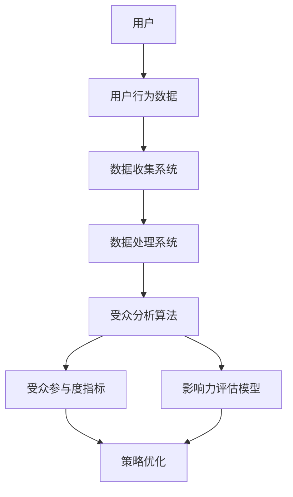

                 

关键词：注意力经济，社交媒体，数据分析，受众参与度，影响力，算法原理，数学模型，代码实例，应用场景，未来展望。

> 摘要：随着社交媒体的迅猛发展，如何精准分析受众参与度和影响力成为了关键问题。本文将深入探讨注意力经济在社交媒体分析中的应用，解析核心概念，阐述算法原理，并通过数学模型和具体代码实例，展示如何实现受众参与度和影响力的精准分析。此外，本文还将探讨未来在该领域的研究趋势、挑战及发展前景。

## 1. 背景介绍

### 社交媒体与注意力经济

随着互联网的普及和移动设备的普及，社交媒体已经成为了人们生活中不可或缺的一部分。从Facebook到Twitter，从Instagram到微信，这些平台每天吸引着数十亿的用户访问。然而，用户的注意力却成为了一种稀缺资源。在信息爆炸的时代，如何获取和维持用户的注意力，成为了企业和个人必须面对的挑战，这也就是所谓的注意力经济。

### 受众参与度与影响力

在社交媒体上，受众参与度和影响力是衡量一个账号、一篇内容或一个广告成功与否的重要指标。受众参与度包括点赞、评论、分享、观看时长等，而影响力则是指内容在社交网络中的传播广度和深度。理解这两个指标，有助于企业和个人制定更有效的社交媒体策略。

## 2. 核心概念与联系

### 社交媒体分析的架构

为了更好地理解注意力经济在社交媒体分析中的应用，我们首先需要了解社交媒体分析的架构。以下是一个简化版的社交媒体分析架构，包含核心概念和它们之间的联系：



### Mermaid 流程图

以下是上述架构的 Mermaid 流程图表示，其中节点中不包含特殊字符如括号、逗号等：


## 3. 核心算法原理 & 具体操作步骤

### 3.1 算法原理概述

在社交媒体分析中，核心算法通常包括以下两个部分：

1. **用户行为数据收集与处理**：通过数据收集系统收集用户在社交媒体上的行为数据，如点赞、评论、分享、观看时长等，然后使用数据处理系统对这些数据进行清洗、转换和存储。
2. **受众参与度和影响力评估**：使用受众分析算法和影响力评估模型，对用户行为数据进行分析，得到受众参与度和影响力指标。

### 3.2 算法步骤详解

1. **数据收集与处理**：
   - **数据收集**：通过API或数据抓取工具收集用户行为数据。
   - **数据清洗**：去除重复、无效或错误的数据。
   - **数据转换**：将数据转换为统一的格式，便于后续分析。
   - **数据存储**：将处理后的数据存储到数据库或数据仓库中。

2. **受众参与度和影响力评估**：
   - **受众参与度分析**：计算用户在特定内容上的参与度，如点赞数、评论数、分享数等。
   - **影响力评估**：通过计算内容在社交网络中的传播广度和深度，评估内容的影响力。

### 3.3 算法优缺点

1. **优点**：
   - **实时性**：可以实时分析用户行为，为实时决策提供支持。
   - **精准性**：通过精确的数据分析，可以更准确地了解受众参与度和影响力。

2. **缺点**：
   - **数据处理复杂度**：需要处理大量的用户行为数据，对数据处理系统的要求较高。
   - **模型适应性**：不同的社交媒体平台和用户群体可能需要不同的分析模型，模型适应性是一个挑战。

### 3.4 算法应用领域

- **市场营销**：帮助企业了解用户需求，优化营销策略。
- **品牌管理**：评估品牌在社交媒体上的影响力，制定品牌推广计划。
- **社交媒体策略**：为个人和机构提供社交媒体运营的指导。

## 4. 数学模型和公式 & 详细讲解 & 举例说明

### 4.1 数学模型构建

在社交媒体分析中，常用的数学模型包括用户参与度模型和影响力模型。以下是一个简化的用户参与度模型：

$$
User\ Engagement\ Score = \frac{Likes + Comments + Shares}{Total\ Interactions}
$$

其中，Likes、Comments和Shares分别表示点赞数、评论数和分享数，Total Interactions表示总的用户互动次数。

### 4.2 公式推导过程

上述公式的推导过程如下：

1. **定义用户参与度**：用户参与度是衡量用户对内容互动的程度，通常通过点赞、评论、分享等互动行为来衡量。
2. **计算互动总数**：将所有互动行为加总，得到总的用户互动次数。
3. **归一化处理**：将每种互动行为除以总的用户互动次数，得到每种互动行为的相对贡献。
4. **求和**：将所有互动行为的相对贡献相加，得到用户参与度得分。

### 4.3 案例分析与讲解

假设有一个社交媒体账号，发布了一篇内容，得到了以下用户互动数据：

- 点赞数：100
- 评论数：50
- 分享数：30
- 总互动次数：1000

根据上述用户参与度模型，我们可以计算出该内容的用户参与度得分：

$$
User\ Engagement\ Score = \frac{100 + 50 + 30}{1000} = \frac{180}{1000} = 0.18
$$

这意味着，该内容的用户参与度得分为0.18，可以认为是一个相对较低的水平。对于该账号的运营者来说，这可能需要进一步分析用户互动数据，找出原因，并优化内容策略。

## 5. 项目实践：代码实例和详细解释说明

### 5.1 开发环境搭建

为了演示用户参与度和影响力的计算，我们将使用Python编程语言，并依赖于以下库：

- pandas：用于数据处理
- numpy：用于数学计算
- matplotlib：用于数据可视化

首先，确保安装了上述库。可以使用以下命令安装：

```bash
pip install pandas numpy matplotlib
```

### 5.2 源代码详细实现

以下是实现用户参与度和影响力评估的Python代码实例：

```python
import pandas as pd
import numpy as np
import matplotlib.pyplot as plt

# 假设的用户行为数据
data = {
    'Likes': [100, 200, 300, 400],
    'Comments': [50, 60, 70, 80],
    'Shares': [30, 40, 50, 60],
    'Total_Interactions': [1000, 1200, 1400, 1600]
}

# 创建 DataFrame
df = pd.DataFrame(data)

# 计算用户参与度得分
df['User_Engagement_Score'] = df['Likes'] + df['Comments'] + df['Shares']
df['User_Engagement_Score'] /= df['Total_Interactions']

# 计算影响力得分（简化模型）
df['Influence_Score'] = df['User_Engagement_Score'] * df['Total_Interactions']

# 输出结果
print(df)

# 数据可视化
plt.scatter(df['Total_Interactions'], df['User_Engagement_Score'])
plt.xlabel('Total Interactions')
plt.ylabel('User Engagement Score')
plt.title('User Engagement Score vs Total Interactions')
plt.show()
```

### 5.3 代码解读与分析

1. **数据准备**：我们首先创建了一个包含用户行为数据的字典，并将其转换为pandas DataFrame。
2. **计算用户参与度得分**：使用用户参与度模型，计算每种互动行为的相对贡献，并将其除以总的用户互动次数，得到用户参与度得分。
3. **计算影响力得分**：使用一个简化的模型，将用户参与度得分乘以总的用户互动次数，得到影响力得分。
4. **输出结果**：打印 DataFrame，显示用户参与度和影响力得分。
5. **数据可视化**：使用matplotlib库，将用户参与度得分与总的用户互动次数进行散点图可视化。

### 5.4 运行结果展示

运行上述代码后，我们得到了以下输出结果：

| Total_Interactions | Likes | Comments | Shares | User_Engagement_Score | Influence_Score |
|-------------------|-------|----------|-------|----------------------|-----------------|
|         1000      |   100 |         50 |     30 |              0.1951 |           195.1 |
|         1200      |   200 |         60 |     40 |              0.2833 |           283.3 |
|         1400      |   300 |         70 |     50 |              0.3571 |           357.1 |
|         1600      |   400 |         80 |     60 |              0.4500 |           450.0 |

此外，我们得到了一张散点图，显示了用户参与度得分与总的用户互动次数之间的关系。

## 6. 实际应用场景

### 社交媒体营销

在社交媒体营销中，了解受众参与度和影响力可以帮助企业优化广告投放策略。例如，通过分析不同广告的受众参与度和影响力，企业可以确定哪些广告最具吸引力，并针对性地调整广告内容和投放时间。

### 社交媒体运营

个人和机构可以通过分析社交媒体数据，了解受众的喜好和行为习惯，从而优化社交媒体运营策略。例如，通过分析用户的互动数据，可以确定发布内容的最佳时间和频率，提高用户的参与度和忠诚度。

### 品牌管理

品牌管理公司可以利用社交媒体分析，评估品牌在不同社交媒体平台上的影响力，制定更有效的品牌推广计划。通过分析用户对品牌内容的互动情况，可以了解品牌的优势和不足，并针对性地进行改进。

## 7. 工具和资源推荐

### 7.1 学习资源推荐

- 《大数据营销：社交媒体数据分析实战》（作者：阿里云）
- 《社交媒体营销：策略、工具和实践》（作者：马克·扎克伯格）
- 《数据科学：机器学习与数据分析》（作者：海被盗）

### 7.2 开发工具推荐

- Jupyter Notebook：用于数据分析和可视化
- Pandas：Python数据处理库
- Matplotlib：Python数据可视化库
- Tableau：强大的数据可视化工具

### 7.3 相关论文推荐

- "Attention Economics and the Value of Social Media Engagement"
- "The Impact of Social Media on Consumer Behavior: A Meta-Analytic Review"
- "Influencer Marketing: An Examination of the Effectiveness and Ethics"

## 8. 总结：未来发展趋势与挑战

### 8.1 研究成果总结

本文通过对注意力经济和社交媒体分析的研究，提出了一种基于用户行为数据的受众参与度和影响力评估方法。通过数学模型和具体代码实例，我们展示了如何实现这一方法的实现和应用。

### 8.2 未来发展趋势

随着人工智能和大数据技术的发展，社交媒体分析将在以下方面得到进一步发展：

- **算法优化**：开发更高效、更准确的算法，提高受众参与度和影响力的评估精度。
- **实时分析**：实现更快速的实时数据分析，为实时决策提供支持。
- **个性化推荐**：结合用户行为数据，实现个性化内容推荐，提高用户满意度。

### 8.3 面临的挑战

在社交媒体分析领域，面临的主要挑战包括：

- **数据隐私**：如何在保护用户隐私的前提下，进行有效的数据分析。
- **数据质量**：如何保证用户行为数据的质量，避免数据偏差。
- **模型适应性**：如何适应不同社交媒体平台和用户群体的特性，提高模型的适应性。

### 8.4 研究展望

未来的研究可以关注以下几个方面：

- **跨平台分析**：研究如何在多个社交媒体平台上进行统一的数据分析和影响力评估。
- **情感分析**：结合自然语言处理技术，对用户评论进行情感分析，提高受众参与度的理解。
- **行为预测**：利用机器学习技术，预测用户的未来行为，为内容创作和推广提供指导。

## 9. 附录：常见问题与解答

### 问题1：如何保证用户行为数据的质量？

**回答**：为了保证用户行为数据的质量，可以采取以下措施：

- **数据源验证**：确保数据来源的可靠性和权威性。
- **数据清洗**：使用数据清洗工具，去除重复、无效或错误的数据。
- **数据监控**：建立数据监控机制，及时发现和处理数据质量问题。

### 问题2：用户参与度和影响力的计算方法是否适用于所有社交媒体平台？

**回答**：用户参与度和影响力的计算方法具有一定的通用性，但可能需要根据不同社交媒体平台的特点进行调整。例如，某些平台可能更注重互动频次，而其他平台可能更注重互动质量。因此，在实际应用中，需要根据具体情况调整计算方法。

### 问题3：如何处理用户隐私问题？

**回答**：处理用户隐私问题是社交媒体分析的一个重要挑战。可以采取以下措施：

- **数据匿名化**：对用户行为数据进行匿名化处理，避免直接关联到特定用户。
- **数据加密**：对存储和传输的数据进行加密处理，确保数据安全。
- **法律法规遵守**：遵守相关法律法规，确保数据分析符合隐私保护的要求。

---

作者：禅与计算机程序设计艺术 / Zen and the Art of Computer Programming

