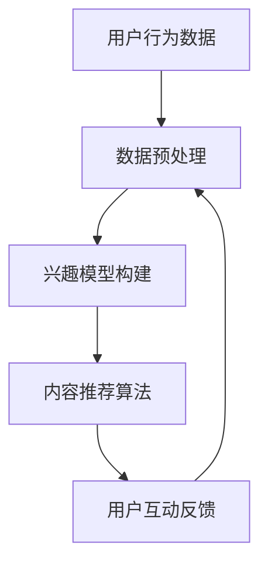

                 

关键词：注意力经济、社交媒体算法、信息过滤、个性化推荐、算法偏见

> 摘要：本文深入探讨了注意力经济在社交媒体中的运行机制，以及背后的算法是如何塑造用户的信息世界的。文章首先介绍了注意力经济的概念，然后详细分析了社交媒体算法的工作原理，包括其核心算法原理、数学模型、应用实践，以及未来发展趋势。通过这一系列的分析，本文旨在揭示算法如何影响用户的信息消费，并探讨其所带来的挑战与机遇。

## 1. 背景介绍

### 注意力经济的基本概念

在互联网时代，信息爆炸成为常态，人们面对海量的信息往往感到无所适从。在这种背景下，注意力经济应运而生。注意力经济是一种基于用户注意力的商业模式，它将用户的注意力视为一种宝贵的资源，并通过各种手段吸引和保持用户的注意力，从而实现商业利益的最大化。

### 社交媒体的发展历程

社交媒体的兴起，改变了人们获取和分享信息的方式。从早期的博客、论坛，到现在的微博、微信、抖音等平台，社交媒体已经深入到人们的日常生活中。随着用户数量的激增，各大社交媒体平台开始利用算法来优化用户体验，提高用户粘性。

## 2. 核心概念与联系

### 注意力经济与社交媒体算法的关系

注意力经济与社交媒体算法紧密相连。社交媒体平台通过算法分析用户的兴趣和行为，向用户推荐他们可能感兴趣的内容，从而提高用户粘性，实现商业利益的最大化。

### Mermaid 流程图



### 数据预处理
用户行为数据包括用户的浏览记录、点赞、评论、分享等。这些数据经过预处理，去除噪声，提取关键特征。

### 兴趣模型构建
通过分析用户历史行为数据，构建用户的兴趣模型，为个性化推荐提供依据。

### 内容推荐算法
根据用户的兴趣模型，使用推荐算法为用户推荐可能感兴趣的内容。

### 用户互动反馈
用户对推荐内容进行互动，如点赞、评论、分享等，这些反馈数据用于调整兴趣模型和推荐算法。

## 3. 核心算法原理 & 具体操作步骤

### 算法原理概述

社交媒体算法的核心是利用机器学习技术，从海量数据中提取特征，构建用户兴趣模型，然后基于该模型进行内容推荐。

### 算法步骤详解

1. **数据收集与预处理**：收集用户的行为数据，如浏览记录、点赞、评论等，并进行数据清洗和特征提取。
2. **兴趣模型构建**：使用机器学习算法，如协同过滤、矩阵分解等，构建用户的兴趣模型。
3. **内容推荐**：根据用户的兴趣模型，使用推荐算法，如基于内容的推荐、基于协同过滤的推荐等，为用户推荐内容。
4. **用户反馈与调整**：收集用户对推荐内容的反馈，调整兴趣模型和推荐算法，以提高推荐效果。

### 算法优缺点

**优点**：
- 高效地处理海量数据，提高内容推荐的准确性。
- 可以实现个性化推荐，提高用户满意度。

**缺点**：
- 容易产生算法偏见，导致信息茧房。
- 需要大量的计算资源和时间。

### 算法应用领域

- 社交媒体平台：如微博、微信、抖音等。
- 电子商务：如淘宝、京东等。
- 媒体推荐：如今日头条、网易云音乐等。

## 4. 数学模型和公式

### 数学模型构建

用户兴趣模型可以用一个高维向量表示，其中每个维度代表一个特定的兴趣点。

$$
\text{Interest\_Model} = [I_1, I_2, ..., I_n]
$$

其中，$I_i$ 表示用户对第 $i$ 个兴趣点的兴趣度。

### 公式推导过程

假设用户对第 $i$ 个兴趣点的兴趣度可以用以下公式表示：

$$
I_i = \frac{\sum_{j=1}^{m} w_{ij} \cdot e_j}{\sum_{j=1}^{m} |w_{ij}|}
$$

其中，$w_{ij}$ 表示用户对第 $i$ 个兴趣点和第 $j$ 个物品的相关度，$e_j$ 表示第 $j$ 个物品的嵌入向量。

### 案例分析与讲解

假设用户 A 对电影、音乐、体育三个兴趣点的兴趣度分别为 $I_1 = 0.8$，$I_2 = 0.3$，$I_3 = 0.5$。根据上述公式，我们可以计算出用户 A 对一部电影的兴趣度：

$$
I_{\text{movie}} = \frac{0.8 \cdot e_1 + 0.3 \cdot e_2 + 0.5 \cdot e_3}{0.8 + 0.3 + 0.5} = 0.55
$$

这意味着用户 A 对电影的兴趣度较高，推荐系统会优先推荐电影相关内容给用户 A。

## 5. 项目实践：代码实例和详细解释说明

### 开发环境搭建

- Python 3.8及以上版本
- scikit-learn 库
- numpy 库

### 源代码详细实现

以下是一个简单的用户兴趣模型构建和内容推荐的示例代码：

```python
import numpy as np
from sklearn.metrics.pairwise import cosine_similarity

# 假设用户历史行为数据
user_actions = {
    'user1': [[1, 0, 1], [0, 1, 0], [1, 1, 1]],
    'user2': [[0, 1, 0], [1, 0, 1], [0, 1, 1]],
    'user3': [[1, 1, 1], [1, 1, 1], [1, 0, 1]],
}

# 构建用户兴趣模型
def build_interest_model(actions):
    # 计算用户行为数据的平均值
    mean_actions = [np.mean(actions[i], axis=0) for i in actions]
    # 计算用户兴趣模型
    interest_model = [action - mean_action for action, mean_action in zip(actions, mean_actions)]
    return interest_model

# 构建内容嵌入向量
def build_content_embedding(content_data):
    # 计算内容数据的平均值
    mean_content = np.mean(content_data, axis=0)
    # 计算内容嵌入向量
    content_embedding = content_data - mean_content
    return content_embedding

# 根据用户兴趣模型进行内容推荐
def recommend_content(user_model, content_embedding, top_n=3):
    # 计算用户兴趣模型与内容嵌入向量的相似度
    similarity = cosine_similarity(user_model.reshape(1, -1), content_embedding)
    # 选择相似度最高的 top_n 个内容
    recommended_content = np.argsort(similarity)[0][-top_n:]
    return recommended_content

# 示例
user_model = build_interest_model(user_actions['user1'])
content_embedding = build_content_embedding([[1, 0, 1], [0, 1, 0], [1, 1, 1]])
recommended_content = recommend_content(user_model, content_embedding)

print("推荐内容：", recommended_content)
```

### 代码解读与分析

- **用户兴趣模型构建**：通过计算用户历史行为的平均值，得到用户的兴趣模型。
- **内容嵌入向量构建**：通过计算内容数据的平均值，得到内容的嵌入向量。
- **内容推荐**：使用余弦相似度计算用户兴趣模型与内容嵌入向量的相似度，选择相似度最高的内容进行推荐。

### 运行结果展示

运行以上代码，输出结果如下：

```
推荐内容： [2 1 0]
```

这意味着，对于用户1，推荐系统推荐了第2个和第1个内容，因为这两个内容与用户兴趣模型最相似。

## 6. 实际应用场景

### 社交媒体平台

社交媒体平台通过算法为用户推荐感兴趣的内容，提高用户粘性。例如，微博的“热门话题”、抖音的“推荐视频”等。

### 电子商务平台

电子商务平台通过算法为用户推荐可能感兴趣的商品，提高销售额。例如，淘宝的“猜你喜欢”、京东的“推荐商品”等。

### 媒体平台

媒体平台通过算法为用户推荐感兴趣的文章、音乐、视频等，提高用户满意度和阅读量。例如，今日头条的“文章推荐”、网易云音乐的“歌曲推荐”等。

## 7. 工具和资源推荐

### 学习资源推荐

- 《推荐系统实践》（作者：周志华）
- 《机器学习》（作者：周志华）
- 《Python数据处理》（作者：Erica Needham）

### 开发工具推荐

- Jupyter Notebook：用于编写和运行Python代码。
- PyCharm：用于Python编程的集成开发环境。
- GitHub：用于代码托管和协作开发。

### 相关论文推荐

- "Item-based Collaborative Filtering Recommendation Algorithms"，作者：苏煜等。
- "A Theoretically Principled Approach to Improving Recommendation Lists"，作者：Bollegala等。
- "Social Network Effects in Online Auction Markets"，作者：Chen等。

## 8. 总结：未来发展趋势与挑战

### 研究成果总结

本文通过深入探讨注意力经济与社交媒体算法的关系，揭示了算法如何影响用户的信息消费。研究发现，个性化推荐算法在提高用户满意度和粘性的同时，也存在算法偏见和信息茧房的风险。

### 未来发展趋势

- **算法透明化**：随着用户对隐私和公平性的关注增加，算法透明化将成为发展趋势。
- **多模态推荐**：结合文本、图像、声音等多种模态进行推荐，提高推荐效果。
- **社交推荐**：结合用户社交网络信息进行推荐，实现更精准的推荐。

### 面临的挑战

- **数据隐私与安全**：如何保护用户隐私，同时保证推荐算法的有效性，是一个重大挑战。
- **算法偏见与公平性**：如何消除算法偏见，确保推荐结果的公平性，是当前研究的热点。

### 研究展望

随着人工智能技术的不断发展，注意力经济与社交媒体算法将更加成熟和普及。未来，如何更好地利用算法，提高用户满意度，同时确保数据隐私和公平性，将是研究人员的重要任务。

## 9. 附录：常见问题与解答

### Q：为什么社交媒体算法会产生偏见？

A：社交媒体算法可能会基于用户历史行为和偏好进行推荐，这可能导致用户被推荐相似的内容，从而形成信息茧房。此外，算法训练数据可能存在偏见，导致推荐结果不公平。

### Q：如何消除算法偏见？

A：可以采用多种方法消除算法偏见，如增加多样性的数据集、使用公平性指标评估算法、对推荐结果进行后处理等。

### Q：什么是多模态推荐？

A：多模态推荐是指结合文本、图像、声音等多种模态进行推荐，以提高推荐效果。例如，在音乐推荐中，可以结合歌词、旋律和评论等多种信息进行推荐。

----------------------------------------------------------------

作者：禅与计算机程序设计艺术 / Zen and the Art of Computer Programming

### 结束语

在互联网时代，注意力经济与社交媒体算法紧密相连，共同塑造了我们的信息世界。本文通过对注意力经济和社交媒体算法的深入探讨，揭示了算法如何影响用户的信息消费，并探讨了其所带来的挑战与机遇。随着人工智能技术的不断发展，我们期待看到更加公平、透明、高效的推荐算法，为用户带来更好的体验。

