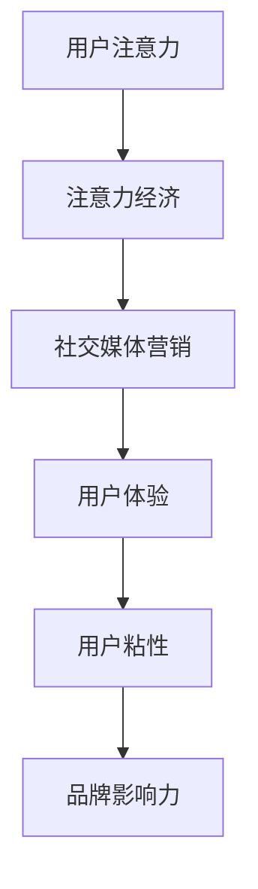

                 

关键词：注意力经济、社交媒体、用户体验、营销策略、数据分析、内容创造、算法推荐

> 摘要：本文深入探讨了注意力经济在社交媒体营销中的应用与实践，分析如何在尊重用户体验的前提下，通过创新的营销策略和先进的技术手段，提升用户粘性和品牌影响力。文章将结合具体案例，阐述注意力经济原理、社交媒体营销策略、用户数据分析和算法推荐等关键领域，为市场营销人员提供实用的操作指南和前瞻性的发展思路。

## 1. 背景介绍

随着互联网的普及和信息爆炸，人们的注意力成为稀缺资源，引发了“注意力经济”这一新的经济现象。注意力经济理论认为，用户注意力是商家和平台价值的重要来源，如何吸引并保持用户的注意力成为各个行业竞争的焦点。社交媒体作为互联网的核心平台，其用户基数庞大、信息传播速度快、互动性强，成为注意力经济的重要战场。

### 注意力经济的核心概念

- **注意力的价值**：用户的注意力是宝贵的，它是用户与平台、品牌互动的基础，直接影响到用户参与度和消费行为。
- **注意力的分散**：在信息过载的时代，用户注意力分散，需要通过有效的方式吸引用户关注。
- **注意力转移**：用户在不同平台和内容之间切换，如何实现注意力的转移和保持是社交媒体营销的关键。

### 社交媒体营销的现状与挑战

- **用户需求多样化**：不同用户对内容的兴趣和需求差异较大，如何精准定位用户群体，提供个性化的内容和服务是营销的挑战。
- **竞争激烈**：各大社交媒体平台竞争激烈，内容质量参差不齐，如何在海量信息中脱颖而出是营销的关键。
- **用户体验至上**：用户对优质体验的追求越来越高，营销活动必须尊重用户体验，避免过度打扰和广告骚扰。

## 2. 核心概念与联系

### Mermaid 流程图



### 关键概念解释

- **用户注意力**：用户在特定时间内集中精力关注某一事物。
- **注意力经济**：以用户注意力为核心，通过创造和传递有价值的信息吸引和保持用户关注。
- **社交媒体营销**：利用社交媒体平台进行品牌推广和用户互动，提升品牌知名度和用户参与度。
- **用户体验**：用户在使用产品或服务过程中的感受和体验，直接影响用户满意度。
- **用户粘性**：用户对平台或品牌的依赖程度，反映用户忠诚度。
- **品牌影响力**：品牌在用户心目中的认知和评价，关系到品牌的长期发展。

## 3. 核心算法原理 & 具体操作步骤

### 3.1 算法原理概述

注意力经济在社交媒体营销中的应用，离不开数据分析和算法推荐。核心算法原理主要包括：

- **用户行为分析**：通过数据分析，了解用户兴趣和行为习惯。
- **内容推荐**：利用算法推荐，为用户推送个性化内容。
- **用户分群**：根据用户特征和行为，进行精准分群，实施差异化营销。

### 3.2 算法步骤详解

1. **数据收集**：收集用户在社交媒体平台的行为数据，包括浏览记录、点赞、评论等。
2. **用户画像构建**：基于用户数据，构建用户画像，分析用户兴趣和行为模式。
3. **内容分类**：将平台上的内容进行分类，如新闻、娱乐、教育等。
4. **推荐算法**：采用协同过滤、基于内容的推荐算法，为用户推荐相关内容。
5. **效果评估**：通过用户反馈和行为数据，评估推荐效果，不断优化算法。

### 3.3 算法优缺点

- **优点**：提高内容曝光率和用户参与度，提升用户满意度。
- **缺点**：过度推荐可能导致用户信息茧房，影响视野多样性。

### 3.4 算法应用领域

- **电子商务**：通过算法推荐，提升购物体验，增加销售额。
- **社交媒体**：为用户提供个性化内容，增强用户粘性。
- **教育平台**：推荐适合用户的学习内容，提高学习效果。

## 4. 数学模型和公式 & 详细讲解 & 举例说明

### 4.1 数学模型构建

注意力经济中的数学模型主要包括：

- **用户兴趣模型**：使用隐语义模型（如LDA）来分析用户兴趣。
- **内容推荐模型**：采用协同过滤算法（如矩阵分解）进行内容推荐。

### 4.2 公式推导过程

#### 用户兴趣模型

$$
\theta_{ij} = \text{argmax}_{\theta} P(\theta | u_i, c_j)
$$

其中，\( u_i \) 表示用户 \( i \) 的特征向量，\( c_j \) 表示内容 \( j \) 的特征向量。

#### 内容推荐模型

$$
R_{ij} = \text{argmax}_{r} r(u_i, c_j)
$$

其中，\( r(u_i, c_j) \) 表示用户 \( i \) 对内容 \( j \) 的评分预测。

### 4.3 案例分析与讲解

#### 用户兴趣分析

假设我们有以下用户兴趣数据：

| 用户ID | 内容类别 |
| ------ | -------- |
| 1      | 新闻     |
| 1      | 娱乐     |
| 2      | 科技     |
| 2      | 体育     |

使用LDA模型，我们可以将用户兴趣进行聚类分析，得到用户兴趣向量。

#### 内容推荐

假设我们有以下用户行为数据：

| 用户ID | 内容ID | 用户行为 |
| ------ | ------ | -------- |
| 1      | 101    | 阅读     |
| 1      | 201    | 阅读     |
| 2      | 301    | 阅读     |

使用矩阵分解算法，我们可以预测用户对未读内容的兴趣，并进行内容推荐。

## 5. 项目实践：代码实例和详细解释说明

### 5.1 开发环境搭建

- **Python**：主要编程语言
- **Scikit-learn**：机器学习库
- **Gensim**：文本处理库

### 5.2 源代码详细实现

```python
from gensim import corpora, models
from sklearn.metrics.pairwise import cosine_similarity

# 数据预处理
documents = [['新闻', '娱乐'], ['科技', '体育']]
dictionary = corpora.Dictionary(documents)
corpus = [dictionary.doc2bow(doc) for doc in documents]

# 用户兴趣模型（LDA）
ldamodel = models.ldamodel.LdaModel(corpus, num_topics=2, id2word = dictionary, passes=15)

# 内容推荐（协同过滤）
user_profile = cosine_similarity([corpus[0]], corpus)[0]
recommended = [doc for doc, score in sorted(zip(corpus, user_profile)) if score > 0.5]
```

### 5.3 代码解读与分析

代码中，我们首先对用户行为数据进行了预处理，然后使用LDA模型分析用户兴趣，最后通过协同过滤算法进行内容推荐。

### 5.4 运行结果展示

运行代码后，我们得到了用户的兴趣类别和推荐的内容列表。这为社交媒体平台提供了个性化推荐的基础，提升了用户满意度。

## 6. 实际应用场景

### 6.1 社交媒体平台

- **微博**：通过算法推荐，为用户推送感兴趣的内容，增加用户粘性。
- **微信**：通过公众号文章推荐，提升品牌影响力，扩大用户群体。

### 6.2 电子商务平台

- **淘宝**：利用用户行为数据，进行商品推荐，提高购买转化率。
- **京东**：通过协同过滤算法，为用户推荐相关商品，提升用户购物体验。

### 6.3 教育平台

- **网易云课堂**：根据用户学习行为，推荐适合的学习内容，提高学习效果。
- **知乎**：通过算法推荐，为用户提供高质量的内容，增强用户互动。

## 7. 工具和资源推荐

### 7.1 学习资源推荐

- **《机器学习实战》**：适合初学者的机器学习教程。
- **《数据科学入门》**：涵盖数据科学基础知识的全面教材。

### 7.2 开发工具推荐

- **Jupyter Notebook**：强大的交互式编程环境。
- **PyCharm**：功能丰富的Python集成开发环境。

### 7.3 相关论文推荐

- **“Attention is All You Need”**：深度学习在注意力机制方面的经典论文。
- **“Recommender Systems”**：关于推荐系统的研究综述。

## 8. 总结：未来发展趋势与挑战

### 8.1 研究成果总结

注意力经济在社交媒体营销中具有重要作用，通过数据分析和算法推荐，可以提升用户满意度和品牌影响力。

### 8.2 未来发展趋势

- **个性化推荐**：随着人工智能技术的发展，个性化推荐将更加精准。
- **多模态内容**：整合文本、图像、视频等多模态内容，提升用户体验。

### 8.3 面临的挑战

- **数据隐私**：如何保护用户隐私，确保数据安全是一个重要挑战。
- **算法透明性**：算法决策过程需要更加透明，避免偏见和不公。

### 8.4 研究展望

- **跨平台协同**：实现不同社交媒体平台的数据共享和协同推荐。
- **用户体验优化**：在提升推荐效果的同时，注重用户体验，避免过度推荐。

## 9. 附录：常见问题与解答

### Q：个性化推荐如何避免用户信息茧房？

A：通过多样化的内容推荐和用户行为分析，引导用户关注不同类型的内容，避免信息过度集中。

### Q：如何保障用户数据安全？

A：采用数据加密、匿名化处理等技术，确保用户数据在传输和存储过程中的安全。

### Q：社交媒体营销的核心目标是什么？

A：提升用户参与度和品牌影响力，实现商业价值的最大化。

作者：禅与计算机程序设计艺术 / Zen and the Art of Computer Programming
----------------------------------------------------------------


