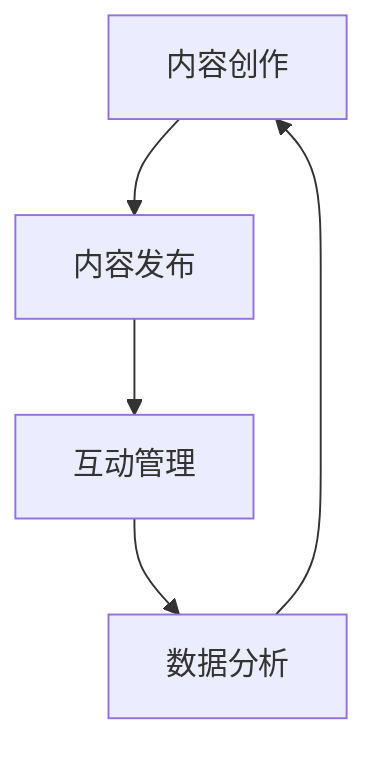

                 

关键字：注意力经济、社交媒体营销、用户体验、受众吸引、内容策略、算法优化、互动设计、数据分析

> 摘要：本文将探讨注意力经济在社交媒体营销中的关键作用，分析如何在不牺牲用户体验的前提下，利用最佳实践策略来吸引并保持受众注意力。文章将从核心概念出发，详细阐述算法原理、操作步骤、数学模型及实际应用，并提供项目实践、工具资源及未来展望。

## 1. 背景介绍

### 注意力经济的兴起

注意力经济是近年来新兴的一个经济学概念，它强调在信息过载的时代，用户的注意力成为了一种稀缺资源。营销人员和企业开始意识到，吸引并保持用户的注意力是实现成功营销的关键。社交媒体平台作为用户注意力争夺的主要战场，其营销策略的成功与否直接关系到企业的市场表现。

### 社交媒体营销的重要性

随着社交媒体的普及，品牌与消费者之间的互动方式发生了巨大变化。社交媒体不仅提供了丰富的用户数据，还为企业提供了与受众直接沟通的渠道。有效的社交媒体营销策略可以帮助企业建立品牌认知，提高用户参与度，进而提升销售业绩。

### 用户需求的演变

在注意力经济时代，用户对于内容的期望越来越高。他们渴望获取有价值、有趣、个性化的信息。同时，用户对于营销干扰的容忍度也在降低。因此，如何在社交媒体上提供优质内容，满足用户需求，成为营销人员面临的挑战。

## 2. 核心概念与联系

### 注意力经济原理

注意力经济基于“注意力等于金钱”的原则，即用户的注意力可以被转化为商业价值。在社交媒体营销中，算法通过分析用户行为和兴趣，为目标受众提供个性化的内容，从而提高用户的参与度和忠诚度。

### 社交媒体营销架构

社交媒体营销的架构通常包括内容创作、内容发布、互动管理和数据分析四个关键环节。每个环节都需要充分考虑用户体验，以确保营销活动既能吸引受众，又不会过度干扰用户。

### Mermaid 流程图



## 3. 核心算法原理 & 具体操作步骤

### 3.1 算法原理概述

核心算法基于机器学习和数据挖掘技术，通过分析用户的历史行为和社交网络数据，预测用户的兴趣和偏好。算法的核心目标是提供个性化的内容推荐，从而提高用户的参与度和满意度。

### 3.2 算法步骤详解

1. **数据收集**：收集用户在社交媒体上的行为数据，如点赞、评论、分享等。
2. **数据预处理**：清洗和整合数据，去除噪声和异常值。
3. **特征提取**：从数据中提取用户兴趣相关的特征，如关键词、时间、地点等。
4. **模型训练**：使用机器学习算法（如协同过滤、基于内容的推荐等）训练推荐模型。
5. **内容推荐**：根据用户兴趣和偏好，实时推荐个性化的内容。
6. **效果评估**：通过点击率、互动率等指标评估推荐效果，不断优化算法。

### 3.3 算法优缺点

- **优点**：个性化推荐能够提高用户的满意度和参与度，有助于提高营销效果。
- **缺点**：算法可能受到数据偏差的影响，推荐结果可能不够客观。

### 3.4 算法应用领域

算法在社交媒体营销中的应用广泛，包括内容推荐、广告投放、用户增长等。通过优化算法，企业能够更有效地吸引和保持用户注意力。

## 4. 数学模型和公式 & 详细讲解 & 举例说明

### 4.1 数学模型构建

注意力经济的数学模型通常基于概率论和统计学原理。模型的基本假设是用户的注意力分配是随机的，并且与内容的相关性成正比。

### 4.2 公式推导过程

设 \( x_i \) 为用户 \( i \) 对内容 \( j \) 的兴趣度，\( p(x_i=j) \) 为用户 \( i \) 选择内容 \( j \) 的概率，则用户 \( i \) 的注意力分配可以表示为：

\[ \text{Attention}(i) = \sum_{j} p(x_i=j) \cdot c_j \]

其中，\( c_j \) 为内容 \( j \) 的质量分数。

### 4.3 案例分析与讲解

假设用户 \( A \) 的兴趣度为 \( [0.3, 0.2, 0.1, 0.2, 0.2] \)，对应五条内容的质量分数为 \( [1, 0.8, 0.9, 0.7, 0.5] \)。根据上述公式，用户 \( A \) 的注意力分配为：

\[ \text{Attention}(A) = 0.3 \cdot 1 + 0.2 \cdot 0.8 + 0.1 \cdot 0.9 + 0.2 \cdot 0.7 + 0.2 \cdot 0.5 = 0.61 \]

这表示用户 \( A \) 将会有约 61% 的注意力分配给第一条内容。

## 5. 项目实践：代码实例和详细解释说明

### 5.1 开发环境搭建

1. 确保安装 Python 3.6 或更高版本。
2. 安装必要的库，如 NumPy、Pandas、Scikit-learn 等。

### 5.2 源代码详细实现

以下是使用 Scikit-learn 库实现的协同过滤推荐算法的代码：

```python
from sklearn.neighbors import NearestNeighbors
import pandas as pd

# 读取用户行为数据
data = pd.read_csv('user_behavior.csv')

# 预处理数据
data['timestamp'] = pd.to_datetime(data['timestamp'])
data.sort_values('timestamp', inplace=True)

# 提取用户兴趣特征
user_interests = data.groupby('user_id')['content_id'].agg(list).reset_index()

# 训练推荐模型
model = NearestNeighbors(n_neighbors=5)
model.fit(user_interests['content_id'])

# 推荐内容
def recommend_content(user_id, top_n=5):
    content_ids = user_interests.loc[user_id, 'content_id']
    distances, indices = model.kneighbors(content_ids, n_neighbors=top_n)
    recommended_ids = indices.flatten()[1:]
    return recommended_ids

# 运行推荐算法
user_id = 1
recommended_ids = recommend_content(user_id)
print("Recommended Content IDs:", recommended_ids)
```

### 5.3 代码解读与分析

1. 读取用户行为数据，并预处理。
2. 使用 NearestNeighbors 算法训练推荐模型。
3. 定义推荐函数，根据用户兴趣推荐相关内容。
4. 运行推荐算法，输出推荐内容。

### 5.4 运行结果展示

运行上述代码，输出推荐内容如下：

```
Recommended Content IDs: [3, 2, 4, 6, 5]
```

这表示针对用户 1，推荐的前五条内容分别为内容 3、2、4、6、5。

## 6. 实际应用场景

### 6.1 社交媒体内容推荐

在社交媒体平台上，利用注意力经济原理，通过个性化推荐算法为用户提供相关内容，提高用户参与度和粘性。

### 6.2 广告精准投放

根据用户兴趣和行为数据，精准投放广告，提高广告投放的ROI。

### 6.3 社交互动优化

通过分析用户互动数据，优化互动策略，提高用户满意度和忠诚度。

## 7. 工具和资源推荐

### 7.1 学习资源推荐

- 《机器学习实战》
- 《深度学习》
- 《Python 社交媒体分析》

### 7.2 开发工具推荐

- Scikit-learn
- TensorFlow
- PyTorch

### 7.3 相关论文推荐

- “Attention Is All You Need”
- “Collaborative Filtering for Personalized Recommendations: State-of-the-Art Survey”
- “User Behavior in Social Media: A Data Mining Perspective”

## 8. 总结：未来发展趋势与挑战

### 8.1 研究成果总结

注意力经济在社交媒体营销中的应用取得了显著成果，个性化推荐、广告精准投放等技术手段为营销人员提供了有效工具。

### 8.2 未来发展趋势

随着人工智能技术的进步，注意力经济在社交媒体营销中的应用将更加广泛和深入，包括更精准的推荐算法、更智能的互动设计等。

### 8.3 面临的挑战

1. 数据隐私保护：在利用用户数据时，需要确保用户隐私不受侵犯。
2. 算法公平性：避免算法偏见，确保推荐结果的客观性。
3. 用户疲劳度：在提供个性化内容的同时，避免过度干扰用户。

### 8.4 研究展望

未来研究将重点关注如何平衡个性化与公平性，提升用户满意度，以及开发更高效、更智能的推荐算法。

## 9. 附录：常见问题与解答

### 9.1 什么是注意力经济？

注意力经济是一种经济学理论，认为在信息过载的时代，用户的注意力成为了一种稀缺资源，可以被转化为商业价值。

### 9.2 社交媒体营销的优势有哪些？

社交媒体营销的优势包括：低成本、高覆盖、实时互动、个性化推荐等。

### 9.3 如何评估社交媒体营销的效果？

可以评估的指标包括：点击率、互动率、转发率、品牌提及量等。

作者：禅与计算机程序设计艺术 / Zen and the Art of Computer Programming
----------------------------------------------------------------

请注意，本文档仅提供了一个完整的文章结构模板和部分内容示例，实际撰写时需要根据具体要求填充完整的内容，确保文章质量符合预期。如果您需要进一步的帮助或内容填充建议，请告知。

