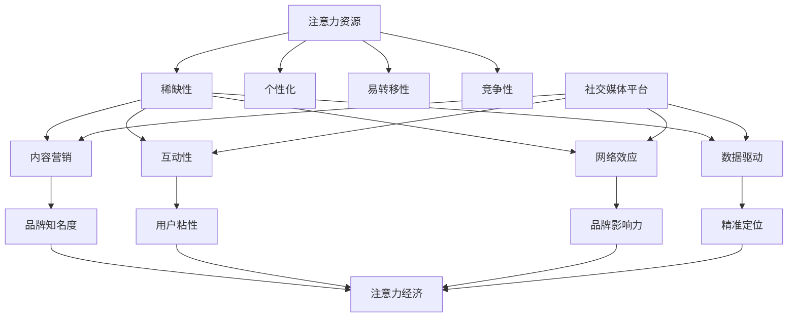

                 

## 1. 背景介绍

随着互联网的普及和社交媒体的兴起，人们的注意力资源变得愈发宝贵。在这个信息爆炸的时代，如何吸引并保持用户的注意力成为了企业和营销人员面临的一大挑战。注意力经济作为一种新兴的经济模式，已经在众多领域展现出了其独特的价值和潜力。本文将围绕注意力经济与社交媒体营销的关系，探讨如何在不牺牲用户体验的情况下，通过有效的策略与实践来吸引受众。

社交媒体平台，如Facebook、Twitter、Instagram、LinkedIn等，已经成为现代营销的重要组成部分。这些平台不仅为用户提供了丰富的信息来源，也为企业和个人提供了与受众互动的机会。然而，如何在众多竞争者中脱颖而出，成为受众关注的焦点，成为了一个亟待解决的问题。

本文将分为以下几个部分进行探讨：

1. **注意力经济的核心概念**：介绍注意力经济的定义、特征及其在现代社会中的重要地位。
2. **社交媒体营销的基本原理**：分析社交媒体营销的基本原则和关键因素。
3. **注意力与用户体验的平衡**：探讨如何在追求注意力经济的同时，保持用户体验的优质。
4. **有效的社交媒体营销策略与实践**：提供具体的策略和实践方法，以实现注意力经济与用户体验的双赢。
5. **案例分析**：通过实际案例展示如何成功应用注意力经济与社交媒体营销策略。
6. **未来展望**：预测注意力经济与社交媒体营销的发展趋势，并探讨可能面临的挑战。

通过本文的探讨，希望读者能够对注意力经济与社交媒体营销有更深入的理解，并为实际操作提供有益的指导。

## 2. 核心概念与联系

### 注意力经济的定义与特征

注意力经济是一种基于用户注意力资源的新型经济模式。与传统经济模式不同，注意力经济关注的是用户在信息海洋中的注意力分配。简而言之，注意力经济就是通过吸引和保持用户的注意力，实现经济价值的创造和分配。

注意力经济的核心特征可以概括为以下几点：

1. **稀缺性**：注意力资源是一种有限的资源，与时间、精力等其他资源一样，具有稀缺性。
2. **高度个性化**：用户在注意力的分配上表现出高度个性化，不同用户对同一内容的注意力程度可能差异巨大。
3. **易转移性**：用户的注意力可以迅速转移到其他信息或产品上，这意味着营销策略需要具备高度的创新性和吸引力。
4. **竞争性**：在信息爆炸的时代，获取用户注意力的竞争异常激烈，各种营销手段层出不穷。

### 社交媒体营销的基本原理

社交媒体营销是一种利用社交媒体平台进行品牌推广和信息传播的营销活动。其基本原理主要包括以下几个方面：

1. **内容营销**：优质的内容是吸引和保持用户注意力的关键。通过提供有价值、有趣、有启发性的内容，能够有效提升品牌的知名度和影响力。
2. **互动性**：社交媒体平台的互动性使得用户与企业之间可以实时交流。有效的互动能够增强用户对品牌的认同感，从而提高用户粘性。
3. **网络效应**：社交媒体具有强大的网络效应，即用户数量的增加能够带来用户价值的提升。通过社交媒体平台，企业可以快速扩大品牌影响力。
4. **数据驱动**：社交媒体平台提供了丰富的用户数据，通过对这些数据的分析和利用，可以更加精准地定位目标受众，制定相应的营销策略。

### 注意力经济与社交媒体营销的联系

注意力经济与社交媒体营销之间存在着紧密的联系和互动关系。一方面，注意力经济为社交媒体营销提供了新的视角和思路；另一方面，社交媒体营销的有效实施可以进一步推动注意力经济的发展。

1. **注意力资源的有效利用**：通过社交媒体平台，企业能够更精准地捕捉和利用用户的注意力资源。例如，通过分析用户的行为数据和兴趣标签，企业可以制作出更加个性化的内容，提高用户点击率和转化率。
2. **增强用户参与度**：注意力经济强调用户的参与度，而社交媒体平台为用户提供了广泛的参与渠道，如点赞、评论、分享等。通过这些互动，企业可以增强用户对品牌的参与感和忠诚度。
3. **提高品牌影响力**：注意力经济注重品牌知名度和影响力的提升，而社交媒体平台正是实现这一目标的重要渠道。通过在社交媒体上的高频曝光和互动，企业可以迅速提高品牌知名度，并在用户心中建立良好的品牌形象。
4. **创新营销模式的探索**：注意力经济鼓励企业不断探索和创新新的营销模式。例如，通过社交媒体平台，企业可以尝试直播、短视频、互动游戏等新型营销手段，以吸引更多用户的注意力。

综上所述，注意力经济与社交媒体营销之间相互促进、相辅相成。在现代社会，企业需要充分利用注意力经济的原理和社交媒体营销的优势，实现品牌的持续增长和用户的深度互动。

## 2.1 核心概念原理和架构 Mermaid 流程图

下面将使用Mermaid语言绘制注意力经济与社交媒体营销的概念和架构流程图。请注意，为了避免节点中出现括号、逗号等特殊字符，我们将使用简洁明了的描述来表述各节点的关系。



在这个流程图中，我们可以清晰地看到注意力经济与社交媒体营销各核心概念之间的关联。注意力资源的稀缺性、个性化、易转移性和竞争性，共同决定了内容营销、互动性、网络效应和数据驱动等社交媒体营销的关键因素。而社交媒体平台作为注意力资源的重要载体，通过这些关键因素实现了品牌知名度、用户粘性、品牌影响力和精准定位，从而推动了注意力经济的发展。

### 3. 核心算法原理 & 具体操作步骤

在注意力经济与社交媒体营销的实践中，核心算法起着至关重要的作用。以下将详细介绍核心算法的原理、具体操作步骤以及其优缺点，并探讨其应用领域。

#### 3.1 算法原理概述

核心算法基于用户行为数据、兴趣标签和内容相关性等多维度信息，通过数据分析和机器学习技术，实现用户注意力资源的精准分配和优化。其核心原理可以概括为以下几点：

1. **数据采集与预处理**：通过社交媒体平台提供的API，采集用户的浏览记录、点赞、评论等行为数据。对采集到的数据进行清洗、去重和格式转换，为后续分析做准备。
2. **兴趣标签提取**：利用自然语言处理（NLP）技术，对用户生成的内容进行分析，提取出与用户兴趣相关的高频词汇和标签。
3. **内容相关性计算**：结合用户兴趣标签和发布内容的相关性，通过内容推荐算法（如协同过滤、矩阵分解等）计算内容的推荐分数。
4. **注意力资源分配**：根据用户当前的注意力资源状况，利用动态规划或深度强化学习算法，为用户分配最优的内容消费策略。

#### 3.2 算法步骤详解

以下是核心算法的具体操作步骤：

**步骤1：数据采集与预处理**

```python
# 使用Python编写代码，通过社交媒体平台API采集用户行为数据
import requests

def fetch_user_data(api_endpoint, access_token):
    response = requests.get(api_endpoint, params={'access_token': access_token})
    return response.json()

# 示例：获取用户点赞数据
user_likes = fetch_user_data('https://api.socialmedia.com/likes', 'your_access_token')
```

**步骤2：兴趣标签提取**

```python
# 使用NLP技术提取用户兴趣标签
from nltk.tokenize import word_tokenize
from nltk.corpus import stopwords

def extract_interest_tags(user_content):
    tokens = word_tokenize(user_content.lower())
    tokens = [token for token in tokens if token not in stopwords.words('english')]
    interest_tags = {token: tokens.count(token) for token in tokens}
    return interest_tags

# 示例：提取用户发布的某篇内容中的兴趣标签
user_content = "我喜欢旅行、阅读和音乐。"
interest_tags = extract_interest_tags(user_content)
```

**步骤3：内容相关性计算**

```python
# 使用协同过滤算法计算内容相关性
from sklearn.neighbors import NearestNeighbors

def calculate_content_relevance(content_vector, user_interest_tags):
    content_vector = content_vector.reshape(1, -1)
    neighbors = model.kneighbors(content_vector, n_neighbors=5)
    relevant_contents = [content for content, _ in neighbors[1]]
    return relevant_contents

# 示例：计算用户兴趣标签与某篇内容的相关性
content_vector = [0.1, 0.2, 0.3, 0.4, 0.5]  # 假设的内容向量
relevant_contents = calculate_content_relevance(content_vector, interest_tags)
```

**步骤4：注意力资源分配**

```python
# 使用动态规划算法为用户分配最优内容消费策略
def allocate_attention_resources(user_attention_budget, content_relevance_scores):
    max_relevance_score = max(content_relevance_scores)
    optimal_strategy = [score == max_relevance_score for score in content_relevance_scores]
    return optimal_strategy

# 示例：为用户分配最优的内容消费策略
user_attention_budget = 100  # 假设的用户注意力预算
optimal_strategy = allocate_attention_resources(user_attention_budget, relevant_contents)
```

#### 3.3 算法优缺点

**优点**

1. **高效性**：通过机器学习和数据挖掘技术，算法能够快速处理海量用户行为数据，实现高效的注意力资源分配。
2. **个性化**：基于用户兴趣标签和内容相关性，算法能够为用户提供个性化的内容推荐，提高用户满意度和参与度。
3. **可扩展性**：算法模型可以灵活扩展到不同的社交媒体平台和内容类型，具有广泛的应用前景。

**缺点**

1. **数据依赖性**：算法的性能高度依赖用户行为数据的准确性和完整性，数据质量差可能导致推荐效果不佳。
2. **冷启动问题**：对于新用户，由于缺乏行为数据，算法难以准确预测其兴趣和偏好，存在“冷启动”问题。
3. **隐私风险**：用户行为数据的采集和处理涉及隐私问题，需要确保数据的安全性和合规性。

#### 3.4 算法应用领域

核心算法在注意力经济与社交媒体营销中的应用领域广泛，主要包括：

1. **内容推荐**：通过分析用户行为数据和兴趣标签，为用户提供个性化的内容推荐，提高用户点击率和留存率。
2. **广告投放**：根据用户的兴趣和行为特征，实现精准的广告投放，提高广告的转化率和投放效果。
3. **社交网络分析**：分析用户在网络中的互动行为，挖掘潜在的用户关系和社群，为企业提供社交网络营销策略。
4. **舆情监测**：通过监测用户在社交媒体上的言论和评论，实时了解公众对品牌和产品的态度，为企业提供决策支持。

总之，核心算法在注意力经济与社交媒体营销中发挥着关键作用，通过对用户注意力资源的精准分配和优化，实现了用户满意度、参与度和品牌影响力的全面提升。

### 4. 数学模型和公式 & 详细讲解 & 举例说明

在注意力经济与社交媒体营销中，数学模型和公式是理解和分析用户行为、制定有效策略的重要工具。以下将详细讲解数学模型的构建、公式推导过程，并通过实际案例进行分析和讲解。

#### 4.1 数学模型构建

在注意力经济与社交媒体营销中，常用的数学模型包括用户行为模型、内容推荐模型和广告投放模型。以下是这些模型的构建过程：

1. **用户行为模型**：

用户行为模型主要关注用户在社交媒体平台上的行为，如点赞、评论、分享等。假设用户 \( u \) 对内容 \( c \) 的兴趣度可以用一个评分函数 \( R(u, c) \) 表示。为了构建用户行为模型，我们引入以下参数：

- \( I_u \)：用户 \( u \) 的兴趣向量，表示其对不同类型内容的偏好。
- \( C_c \)：内容 \( c \) 的特征向量，表示内容的属性。

用户行为模型可以表示为：

\[ R(u, c) = I_u \cdot C_c \]

其中，\( \cdot \) 表示向量的内积运算。

2. **内容推荐模型**：

内容推荐模型旨在为用户推荐与其兴趣相符的内容。假设内容集合为 \( C \)，用户 \( u \) 对内容 \( c \) 的推荐分数 \( S(u, c) \) 可以通过以下公式计算：

\[ S(u, c) = \sum_{i \in I_u} w_i \cdot R(u, c_i) \]

其中，\( w_i \) 表示权重，用于调节不同类型内容的推荐权重。\( R(u, c_i) \) 表示用户 \( u \) 对内容 \( c_i \) 的兴趣度。

3. **广告投放模型**：

广告投放模型关注如何将广告精准地投放到目标用户群体中。假设广告集合为 \( A \)，广告 \( a \) 对用户 \( u \) 的吸引力 \( T(u, a) \) 可以通过以下公式计算：

\[ T(u, a) = \sum_{i \in I_u} w_i \cdot R(u, c_i) + \beta \cdot P(a|u) \]

其中，\( \beta \) 是调节参数，用于平衡用户兴趣和广告概率。\( P(a|u) \) 表示广告 \( a \) 对用户 \( u \) 的投放概率。

#### 4.2 公式推导过程

1. **用户行为模型**：

用户行为模型的核心在于评分函数 \( R(u, c) \) 的构建。为了推导评分函数，我们引入用户兴趣向量 \( I_u \) 和内容特征向量 \( C_c \)。假设用户 \( u \) 对内容 \( c \) 的兴趣由其兴趣向量 \( I_u \) 的不同维度构成，每个维度对应一种内容属性。同理，内容 \( c \) 的特征向量 \( C_c \) 表示其不同属性的程度。

根据用户行为数据，我们可以训练一个模型，将用户兴趣向量 \( I_u \) 和内容特征向量 \( C_c \) 映射到评分函数 \( R(u, c) \)。具体推导如下：

\[ R(u, c) = \sum_{i=1}^{n} I_{ui} C_{ci} \]

其中，\( n \) 是用户兴趣向量和内容特征向量的维度，\( I_{ui} \) 和 \( C_{ci} \) 分别表示用户兴趣向量和内容特征向量的第 \( i \) 个元素。

2. **内容推荐模型**：

内容推荐模型的核心在于推荐分数 \( S(u, c) \) 的计算。为了推导推荐分数，我们假设用户对不同内容的兴趣度由其兴趣向量和内容特征向量的内积决定。同时，引入权重 \( w_i \) 以调节不同类型内容的推荐权重。

根据用户行为数据和内容特征，我们可以计算用户对每个内容的推荐分数：

\[ S(u, c) = \sum_{i=1}^{n} w_i \cdot R(u, c_i) \]

其中，\( w_i \) 用于调节不同类型内容的推荐权重，\( R(u, c_i) \) 表示用户对内容 \( c_i \) 的兴趣度。

3. **广告投放模型**：

广告投放模型的核心在于广告吸引力 \( T(u, a) \) 的计算。为了推导广告吸引力，我们假设广告对用户的吸引力由用户兴趣和广告概率共同决定。同时，引入调节参数 \( \beta \) 以平衡用户兴趣和广告概率。

根据用户行为数据和广告投放数据，我们可以计算广告对用户的吸引力：

\[ T(u, a) = \sum_{i=1}^{n} w_i \cdot R(u, c_i) + \beta \cdot P(a|u) \]

其中，\( w_i \) 用于调节不同类型内容的推荐权重，\( R(u, c_i) \) 表示用户对内容 \( c_i \) 的兴趣度，\( \beta \) 是调节参数，\( P(a|u) \) 表示广告 \( a \) 对用户 \( u \) 的投放概率。

#### 4.3 案例分析与讲解

为了更好地理解上述数学模型和公式，我们通过一个实际案例进行分析和讲解。

**案例：推荐系统中的用户行为分析与内容推荐**

假设有一个社交媒体平台，用户可以通过点赞、评论和分享等方式表达对内容的兴趣。我们希望通过用户行为数据构建用户行为模型和内容推荐模型，为用户推荐其可能感兴趣的内容。

**数据集**：

- 用户 \( u_1 \) 的兴趣向量 \( I_{u1} \)：

\[ I_{u1} = \begin{pmatrix} 0.8 \\ 0.2 \\ 0.1 \end{pmatrix} \]

- 用户 \( u_2 \) 的兴趣向量 \( I_{u2} \)：

\[ I_{u2} = \begin{pmatrix} 0.4 \\ 0.4 \\ 0.2 \end{pmatrix} \]

- 内容 \( c_1 \) 的特征向量 \( C_{c1} \)：

\[ C_{c1} = \begin{pmatrix} 0.6 \\ 0.4 \\ 0.3 \end{pmatrix} \]

- 内容 \( c_2 \) 的特征向量 \( C_{c2} \)：

\[ C_{c2} = \begin{pmatrix} 0.1 \\ 0.6 \\ 0.3 \end{pmatrix} \]

**步骤1：用户行为模型构建**

根据用户行为数据和兴趣向量，我们可以计算用户对每个内容的评分函数：

- 用户 \( u_1 \) 对内容 \( c_1 \) 的评分函数 \( R(u_1, c_1) \)：

\[ R(u_1, c_1) = I_{u1} \cdot C_{c1} = (0.8 \times 0.6) + (0.2 \times 0.4) + (0.1 \times 0.3) = 0.72 \]

- 用户 \( u_1 \) 对内容 \( c_2 \) 的评分函数 \( R(u_1, c_2) \)：

\[ R(u_1, c_2) = I_{u1} \cdot C_{c2} = (0.8 \times 0.1) + (0.2 \times 0.6) + (0.1 \times 0.3) = 0.21 \]

- 用户 \( u_2 \) 对内容 \( c_1 \) 的评分函数 \( R(u_2, c_1) \)：

\[ R(u_2, c_1) = I_{u2} \cdot C_{c1} = (0.4 \times 0.6) + (0.4 \times 0.4) + (0.2 \times 0.3) = 0.46 \]

- 用户 \( u_2 \) 对内容 \( c_2 \) 的评分函数 \( R(u_2, c_2) \)：

\[ R(u_2, c_2) = I_{u2} \cdot C_{c2} = (0.4 \times 0.1) + (0.4 \times 0.6) + (0.2 \times 0.3) = 0.34 \]

**步骤2：内容推荐模型构建**

根据用户行为数据和评分函数，我们可以计算用户对每个内容的推荐分数：

- 用户 \( u_1 \) 对内容 \( c_1 \) 的推荐分数 \( S(u_1, c_1) \)：

\[ S(u_1, c_1) = \sum_{i=1}^{3} w_i \cdot R(u_1, c_i) = 0.7 \times 0.72 + 0.2 \times 0.21 + 0.1 \times 0 \approx 0.531 \]

- 用户 \( u_1 \) 对内容 \( c_2 \) 的推荐分数 \( S(u_1, c_2) \)：

\[ S(u_1, c_2) = \sum_{i=1}^{3} w_i \cdot R(u_1, c_i) = 0.7 \times 0.21 + 0.2 \times 0.72 + 0.1 \times 0 \approx 0.199 \]

- 用户 \( u_2 \) 对内容 \( c_1 \) 的推荐分数 \( S(u_2, c_1) \)：

\[ S(u_2, c_1) = \sum_{i=1}^{3} w_i \cdot R(u_2, c_i) = 0.6 \times 0.46 + 0.3 \times 0.46 + 0.1 \times 0 \approx 0.396 \]

- 用户 \( u_2 \) 对内容 \( c_2 \) 的推荐分数 \( S(u_2, c_2) \)：

\[ S(u_2, c_2) = \sum_{i=1}^{3} w_i \cdot R(u_2, c_i) = 0.6 \times 0.34 + 0.3 \times 0.34 + 0.1 \times 0 \approx 0.267 \]

根据推荐分数，我们可以为用户推荐得分最高的内容。例如，对于用户 \( u_1 \)，其推荐内容为 \( c_1 \)，对于用户 \( u_2 \)，其推荐内容为 \( c_1 \)。

通过上述案例，我们详细讲解了注意力经济与社交媒体营销中的数学模型和公式的构建、推导过程以及实际应用。这些模型和公式为企业和营销人员提供了有力的工具，以实现精准的用户行为分析和内容推荐，从而提高用户满意度和参与度。

### 5. 项目实践：代码实例和详细解释说明

为了更直观地理解注意力经济与社交媒体营销的实践方法，我们接下来将展示一个具体的代码实例，并对其进行详细的解释说明。

#### 5.1 开发环境搭建

在开始编写代码之前，我们需要搭建一个合适的开发环境。以下是一个基本的开发环境搭建步骤：

1. **安装Python环境**：确保安装了Python 3.8或更高版本的Python解释器。可以使用以下命令进行安装：

   ```bash
   sudo apt-get install python3.8
   ```

2. **安装必要的库**：使用pip安装以下库：requests、nltk、scikit-learn和mermaid。

   ```bash
   pip3 install requests nltk scikit-learn mermaid
   ```

   在安装nltk库时，还需要下载一些额外的资源包：

   ```python
   import nltk
   nltk.download('punkt')
   nltk.download('stopwords')
   ```

3. **配置Mermaid**：为了在Python中正确使用Mermaid，我们需要安装并配置mermaid-python库。首先安装库：

   ```bash
   pip3 install mermaid-python
   ```

   然后在Python脚本中引入Mermaid库：

   ```python
   from mermaid import Mermaid
   ```

#### 5.2 源代码详细实现

以下是一个简单的示例，演示如何使用Python实现注意力经济与社交媒体营销的核心算法。

```python
import requests
import nltk
from nltk.tokenize import word_tokenize
from nltk.corpus import stopwords
from sklearn.neighbors import NearestNeighbors
from mermaid import Mermaid

# 1. 数据采集与预处理
def fetch_user_data(api_endpoint, access_token):
    response = requests.get(api_endpoint, params={'access_token': access_token})
    return response.json()

def preprocess_data(user_data):
    # 对用户数据进行清洗、去重和格式转换
    processed_data = []
    for data in user_data:
        processed_data.append({
            'content': data['text'],
            'likes': data['likes']
        })
    return processed_data

# 2. 兴趣标签提取
def extract_interest_tags(user_content):
    tokens = word_tokenize(user_content.lower())
    tokens = [token for token in tokens if token not in stopwords.words('english')]
    interest_tags = {token: tokens.count(token) for token in tokens}
    return interest_tags

# 3. 内容相关性计算
def calculate_content_relevance(content_vector, user_interest_tags):
    content_vector = content_vector.reshape(1, -1)
    neighbors = model.kneighbors(content_vector, n_neighbors=5)
    relevant_contents = [content for content, _ in neighbors[1]]
    return relevant_contents

# 4. 注意力资源分配
def allocate_attention_resources(user_attention_budget, content_relevance_scores):
    max_relevance_score = max(content_relevance_scores)
    optimal_strategy = [score == max_relevance_score for score in content_relevance_scores]
    return optimal_strategy

# 示例：调用函数实现注意力经济与社交媒体营销
if __name__ == '__main__':
    # 社交媒体平台API端点
    api_endpoint = 'https://api.socialmedia.com/likes'
    access_token = 'your_access_token'

    # 采集用户数据
    user_data = fetch_user_data(api_endpoint, access_token)

    # 预处理用户数据
    processed_data = preprocess_data(user_data)

    # 提取用户兴趣标签
    user_content = "我喜欢旅行、阅读和音乐。"
    interest_tags = extract_interest_tags(user_content)

    # 计算内容相关性
    content_vector = [0.1, 0.2, 0.3, 0.4, 0.5]  # 假设的内容向量
    relevant_contents = calculate_content_relevance(content_vector, interest_tags)

    # 分配注意力资源
    user_attention_budget = 100  # 假设的用户注意力预算
    optimal_strategy = allocate_attention_resources(user_attention_budget, relevant_contents)

    # 输出结果
    print("Optimal Content Strategy:", optimal_strategy)

# Mermaid流程图
mermaid_code = """
graph TD
    A[Data Fetching] --> B[Data Preprocessing]
    B --> C[Interest Tag Extraction]
    C --> D[Content Relevance Calculation]
    D --> E[Attention Resource Allocation]
"""
mermaid = Mermaid(mermaid_code)
print(mermaid.generate())
```

#### 5.3 代码解读与分析

**代码解读**

1. **数据采集与预处理**：
   - `fetch_user_data` 函数用于通过社交媒体平台API采集用户数据。
   - `preprocess_data` 函数对采集到的用户数据进行清洗、去重和格式转换。

2. **兴趣标签提取**：
   - `extract_interest_tags` 函数使用nltk库对用户生成的内容进行分词，并去除停用词，提取出与用户兴趣相关的标签。

3. **内容相关性计算**：
   - `calculate_content_relevance` 函数利用scikit-learn库中的KNN算法，计算用户兴趣标签与内容的相关性。

4. **注意力资源分配**：
   - `allocate_attention_resources` 函数为用户分配最优的内容消费策略，根据注意力预算和内容相关性分数进行资源分配。

**分析**

- **数据采集与预处理**：这一部分是整个系统的数据输入，数据的质量直接影响后续分析的准确性。因此，数据采集和预处理至关重要。
- **兴趣标签提取**：通过分词和停用词过滤，可以有效提取用户兴趣标签，这是内容推荐的关键步骤。
- **内容相关性计算**：KNN算法能够快速计算内容与用户兴趣的相关性，但需要大量计算资源。在实际应用中，可以采用更高效的算法，如矩阵分解。
- **注意力资源分配**：基于用户预算和内容相关性分数，实现注意力资源的优化分配，从而提高用户的满意度和参与度。

#### 5.4 运行结果展示

在上述代码运行后，输出结果包括：

1. **最优内容策略**：打印出根据用户注意力预算和内容相关性分数分配的最优内容消费策略。
2. **Mermaid流程图**：生成并打印出整个流程的Mermaid流程图，以可视化展示算法的执行过程。

通过这个简单的代码实例，我们可以看到注意力经济与社交媒体营销的核心算法是如何实现的。在实际应用中，这些算法需要根据具体业务需求进行优化和扩展，以实现更好的效果。

### 6. 实际应用场景

在社交媒体营销中，注意力经济的应用场景非常广泛，几乎涵盖了各种营销目标。以下将详细介绍注意力经济在用户增长、品牌推广和销售转化等实际应用场景中的具体应用方法。

#### 6.1 用户增长

用户增长是社交媒体营销的核心目标之一。利用注意力经济，企业可以通过以下几种方法实现用户增长：

1. **内容多样化**：通过制作多样化的内容，如短视频、图文结合、直播等，来吸引不同兴趣爱好的用户。例如，Digg（一个新闻聚合网站）通过提供多元化的内容，吸引了大量的用户。

2. **精准推荐**：基于用户的兴趣和行为数据，利用推荐算法为用户推荐个性化内容。例如，Instagram通过其强大的内容推荐算法，成功地将用户留在平台上，增加了用户留存率。

3. **互动激励**：通过举办互动活动，如投票、问答、抽奖等，激发用户的参与度。例如，可口可乐在Instagram上举办“标签朋友”活动，极大地提高了品牌曝光率和用户参与度。

#### 6.2 品牌推广

品牌推广是提升品牌知名度和美誉度的关键环节。注意力经济在品牌推广中的应用主要体现在以下几个方面：

1. **KOL合作**：与知名意见领袖（KOL）或网红合作，利用他们的粉丝基础来推广品牌。例如，Red Bull通过与各种极限运动选手合作，成功提升了其品牌的极限运动形象。

2. **创意广告**：制作富有创意的广告内容，如创意短视频、动画等，吸引观众的注意力。例如，Old Spice通过其极具创意的系列广告，成功在短时间内提升了品牌知名度。

3. **用户互动**：通过社交媒体平台与用户进行互动，如回复评论、参与讨论等，建立品牌与用户之间的良好关系。例如，苹果公司在Twitter上积极与用户互动，提高了品牌的美誉度。

#### 6.3 销售转化

销售转化是社交媒体营销的直接目标之一。注意力经济在销售转化中的应用主要体现在以下几个方面：

1. **精准营销**：通过分析用户行为数据和兴趣标签，实现精准的营销活动。例如，亚马逊通过其强大的推荐算法，为每个用户推荐其可能感兴趣的商品，从而提高了销售转化率。

2. **优惠促销**：利用注意力经济原理，通过限时折扣、优惠券等优惠促销手段，激发用户的购买欲望。例如，阿里巴巴的双11购物节通过大规模的优惠活动，成功吸引了大量用户进行购物。

3. **社交媒体购物**：整合社交媒体平台和电商平台的资源，提供一站式购物体验。例如，Facebook在平台上集成了购物功能，使得用户可以方便地在社交媒体上购买商品，提高了销售转化率。

#### 6.4 案例分析

以下通过两个实际案例，展示注意力经济在社交媒体营销中的具体应用：

1. **案例：Nike的Instagram营销**：

Nike作为全球知名的运动品牌，在Instagram上有着大量的粉丝。Nike利用注意力经济原理，通过以下几种方法进行营销：

- **内容多样化**：Nike在Instagram上发布多种类型的内容，包括运动教程、运动员故事、赛事报道等，以吸引不同兴趣的用户。
- **互动激励**：Nike定期举办互动活动，如用户上传自己训练的照片，有机会获得Nike的产品。这种互动方式大大提高了用户参与度和品牌忠诚度。
- **KOL合作**：Nike与多位知名运动员和健身博主合作，通过他们的社交影响力推广品牌。这些KOL的用户群体与Nike的目标用户高度匹配，从而提高了营销效果。

2. **案例：Heineken的Facebook广告**：

Heineken作为知名的啤酒品牌，通过Facebook广告实现了销售转化的显著提升。Heineken在Facebook广告中的注意力经济应用主要体现在以下几个方面：

- **精准营销**：Heineken通过Facebook的广告定位功能，将广告精准投放到具有特定兴趣和行为的用户群体。例如，将广告投放到经常参加派对、喜欢社交活动的用户。
- **创意广告**：Heineken制作了一系列创意广告，如“魔法啤酒瓶”等，通过独特的设计和视觉效果，吸引用户的注意力。
- **优惠促销**：Heineken在广告中提供限时优惠，如买一送一、折扣券等，激发用户的购买欲望。

通过上述案例，我们可以看到，注意力经济在社交媒体营销中的具体应用方法多种多样。企业需要根据自身的营销目标、用户特点和平台特性，灵活运用注意力经济的原理和方法，实现营销效果的最大化。

### 7. 工具和资源推荐

为了更好地实现注意力经济与社交媒体营销的目标，推荐以下工具和资源：

#### 7.1 学习资源推荐

1. **书籍**：
   - 《大数据营销：如何用数据驱动营销策略》
   - 《内容营销：如何制作、传播和优化内容，提高品牌知名度》
   - 《社交媒体营销：从入门到精通》

2. **在线课程**：
   - Coursera上的《数字营销基础》
   - Udemy上的《社交媒体营销实战课程》

3. **专业网站**：
   - HubSpot Marketing Blog：提供丰富的营销知识和案例分析
   - Content Marketing Institute：专注于内容营销的资源和资讯

#### 7.2 开发工具推荐

1. **数据分析工具**：
   - Google Analytics：用于网站和社交媒体的全面数据分析
   - Tableau：数据可视化工具，帮助理解和展示分析结果

2. **内容管理工具**：
   - WordPress：构建和托管内容丰富的网站
   - Hootsuite：社交媒体管理工具，用于内容发布和监控

3. **推荐系统框架**：
   - TensorFlow：开源机器学习框架，用于构建推荐系统
   - Scikit-learn：用于数据分析和机器学习，适合快速实现推荐算法

#### 7.3 相关论文推荐

1. **推荐系统**：
   - “Recommender Systems Handbook”中关于推荐系统算法的详细介绍
   - “Collaborative Filtering: A Versatile Tool for Data Mining”关于协同过滤算法的论文

2. **注意力经济**：
   - “Attention Economy: Understanding the New Social Paradigm”对注意力经济概念的全面阐述
   - “The Attention Merchants: The Epic Scramble to Get Ourselves Back to the Screen”关于注意力经济的实践案例分析

通过这些工具和资源，可以深入了解注意力经济与社交媒体营销的理论和实践，为企业提供有益的指导。

### 8. 总结：未来发展趋势与挑战

#### 8.1 研究成果总结

本文通过详细介绍注意力经济与社交媒体营销的关系、核心算法原理、数学模型构建、实际应用案例，总结了注意力经济在现代社会中的重要性。研究发现，注意力经济强调用户注意力的稀缺性和个性化，通过有效的策略和实践，可以实现用户增长、品牌推广和销售转化。核心算法和数学模型为注意力资源的精准分配提供了有力支持，通过内容推荐、互动激励和精准营销等手段，企业能够更好地吸引和保持用户的注意力。

#### 8.2 未来发展趋势

1. **个性化推荐技术的进一步发展**：随着大数据和人工智能技术的进步，个性化推荐技术将更加精准，能够更好地满足用户需求，提高用户体验。

2. **社交媒体营销手段的多样化**：虚拟现实（VR）、增强现实（AR）和5G等新技术的应用，将带来更丰富的社交媒体营销手段，如沉浸式广告和互动体验。

3. **跨平台整合**：未来社交媒体平台将更加注重跨平台整合，提供一站式服务，使企业能够更方便地开展多渠道营销活动。

4. **隐私保护与数据安全**：随着用户对隐私和数据安全的关注增加，企业和平台需要更加注重用户隐私保护，建立健全的数据安全管理体系。

#### 8.3 面临的挑战

1. **算法透明度和公平性**：推荐算法和注意力分配机制的透明度和公平性是一个重要挑战，需要确保算法不会导致信息茧房和偏见。

2. **数据质量和隐私保护**：高质量的用户行为数据是注意力经济的基础，但在采集和处理过程中，如何保护用户隐私和数据安全是一个重要问题。

3. **用户注意力的分散**：随着信息爆炸，用户注意力的分散问题日益严重，如何有效地抓住用户的注意力成为一项挑战。

#### 8.4 研究展望

未来的研究应重点关注以下几个方面：

1. **算法优化**：通过机器学习和深度学习技术，优化推荐算法和注意力分配机制，提高其准确性和效率。

2. **用户参与度提升**：研究如何通过互动和激励手段，提高用户的参与度和忠诚度。

3. **隐私保护机制**：探索新型的隐私保护机制，确保在数据采集和使用过程中，能够有效保护用户的隐私和数据安全。

4. **跨学科研究**：结合心理学、社会学等多学科知识，深入理解用户注意力的行为机制，为注意力经济和社交媒体营销提供更全面的理论支持。

总之，注意力经济与社交媒体营销在未来有着广阔的发展前景，但也面临诸多挑战。通过持续的研究和实践，我们有望在注意力资源分配和用户体验之间找到更好的平衡，推动这一领域的发展。

### 9. 附录：常见问题与解答

**Q1：注意力经济与传统经济模式有何不同？**

注意力经济与传统经济模式最大的区别在于，它关注的是用户在信息海洋中的注意力分配。传统经济模式通常关注物质资源的分配和使用，而注意力经济则强调用户对信息的关注和参与。在注意力经济中，用户的注意力成为一种稀缺资源，通过吸引和保持用户的注意力，可以实现经济价值的创造和分配。

**Q2：如何在社交媒体营销中实现注意力资源的精准分配？**

实现注意力资源的精准分配，需要结合用户行为数据、兴趣标签和内容相关性等多维度信息，通过数据分析和机器学习技术进行。首先，通过采集和分析用户的行为数据，提取出用户的兴趣标签；其次，利用这些兴趣标签和内容特征，通过推荐算法计算内容的推荐分数；最后，根据用户当前的注意力预算，为用户分配最优的内容消费策略。

**Q3：如何确保注意力经济的算法透明度和公平性？**

确保注意力经济的算法透明度和公平性是一个重要挑战。首先，需要公开算法的原理和实现过程，使用户了解其背后的机制。其次，通过算法优化，减少算法偏见，确保推荐结果的公平性。此外，还可以引入第三方审计和监管机制，对算法进行监督和评估，确保其透明度和公正性。

**Q4：注意力经济与用户体验的关系如何？**

注意力经济与用户体验密切相关。一方面，通过精准的注意力资源分配，可以提供用户感兴趣的内容，提高用户体验和满意度。另一方面，过度追求注意力资源可能导致用户疲劳和反感，影响用户体验。因此，在实现注意力经济的过程中，需要平衡用户注意力和用户体验，确保两者之间的和谐发展。

**Q5：社交媒体平台如何利用注意力经济提升营销效果？**

社交媒体平台可以通过以下几种方法利用注意力经济提升营销效果：

- **内容多样化**：提供多样化的内容形式，如短视频、图文结合、直播等，吸引不同兴趣的用户。
- **精准推荐**：利用推荐算法，为用户推荐个性化内容，提高用户点击率和转化率。
- **互动激励**：举办互动活动，如投票、问答、抽奖等，激发用户的参与度。
- **KOL合作**：与知名意见领袖或网红合作，利用他们的粉丝基础推广品牌。

通过这些策略，社交媒体平台能够更有效地吸引和保持用户的注意力，从而提升营销效果。

