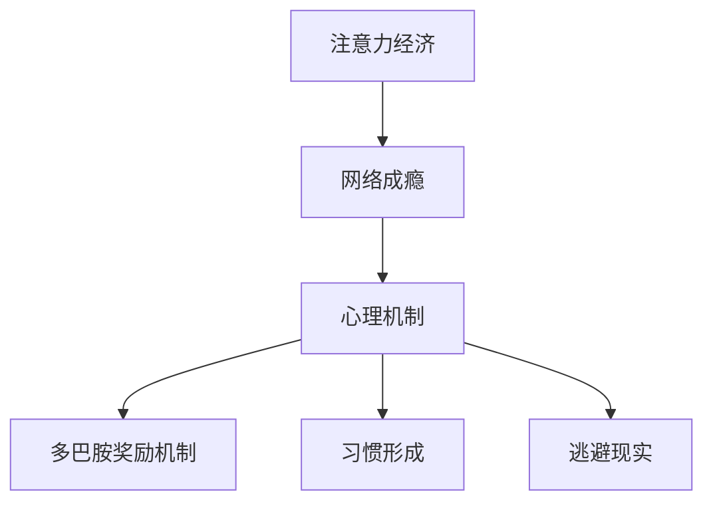

                 

关键词：注意力经济、网络成瘾、心理机制、影响、干预策略

摘要：随着互联网的普及，网络成瘾现象日益严重，对个体和社会产生了深远的影响。本文将探讨注意力经济与网络成瘾之间的关联，分析其心理机制，并探讨相关的干预策略。

## 1. 背景介绍

在当今信息爆炸的时代，互联网已经成为人们日常生活的重要组成部分。然而，互联网的普及也带来了一系列问题，其中最为突出的是网络成瘾现象。网络成瘾是指个体在长时间、频繁地使用互联网的过程中，产生对互联网的依赖和过度使用，从而影响其日常生活、工作和社会交往的一种心理和行为障碍。

网络成瘾现象不仅对个体身心健康产生负面影响，还对家庭、社会和经济产生了严重影响。因此，研究注意力经济与网络成瘾之间的关联，具有重要的理论和实践意义。

### 注意力经济

注意力经济是一种基于个体注意力资源的经济学理论。在互联网时代，注意力成为了一种稀缺资源，个体的注意力资源受到各种信息源的竞争。注意力经济的核心思想是，个体会将注意力资源分配给他们认为最有价值的信息或活动。

### 网络成瘾

网络成瘾是指个体在长时间、频繁地使用互联网的过程中，产生对互联网的依赖和过度使用，从而影响其日常生活、工作和社会交往的一种心理和行为障碍。网络成瘾现象在青少年群体中尤为严重，已经成为一个全球性的公共卫生问题。

## 2. 核心概念与联系

### 注意力经济与网络成瘾的关系

注意力经济与网络成瘾之间存在密切的关系。在互联网时代，网络成瘾行为通常是一种注意力资源的不合理分配。网络成瘾者往往将大量注意力资源用于网络娱乐、社交媒体等低价值信息，从而忽视了现实生活中的重要活动。

### 心理机制

网络成瘾的心理机制主要包括以下几点：

1. **多巴胺奖励机制**：网络成瘾行为会刺激大脑中的多巴胺系统，产生愉悦感。这种愉悦感促使个体重复进行网络成瘾行为。

2. **习惯形成**：网络成瘾行为通过重复出现，逐渐形成习惯。习惯一旦形成，个体会自动进行网络成瘾行为，从而降低自我控制力。

3. **逃避现实**：网络成瘾行为可以帮助个体逃避现实生活中的压力和问题，从而获得短暂的安慰。

### Mermaid 流程图



## 3. 核心算法原理 & 具体操作步骤

### 3.1 算法原理概述

本文将介绍一种基于注意力经济的网络成瘾干预算法。该算法旨在通过调整个体注意力资源的分配，减少网络成瘾行为。

### 3.2 算法步骤详解

1. **用户画像构建**：首先，收集用户在网络上的行为数据，包括访问时间、访问网站、使用时长等，构建用户画像。

2. **注意力资源分配**：根据用户画像，分析用户注意力资源的分配情况。对于注意力资源分配不合理的情况，提出优化建议。

3. **干预策略实施**：根据优化建议，实施干预策略，如调整上网时间、推荐有益网站等。

4. **效果评估**：对干预策略的效果进行评估，根据评估结果调整干预策略。

### 3.3 算法优缺点

**优点**：

- 有针对性地调整用户注意力资源的分配，减少网络成瘾行为。
- 结合用户画像，实现个性化干预。

**缺点**：

- 需要大量用户行为数据，对数据质量要求较高。
- 干预策略的实施效果受用户配合度影响。

### 3.4 算法应用领域

该算法可以应用于家庭教育、职场管理等领域，帮助个体减少网络成瘾行为，提高生活质量。

## 4. 数学模型和公式 & 详细讲解 & 举例说明

### 4.1 数学模型构建

注意力经济与网络成瘾之间的关系可以用以下数学模型描述：

$$
C = f(A, N)
$$

其中，$C$ 表示网络成瘾程度，$A$ 表示注意力资源，$N$ 表示网络使用时长。

### 4.2 公式推导过程

网络成瘾程度 $C$ 与注意力资源 $A$ 和网络使用时长 $N$ 之间的关系可以通过以下公式推导：

$$
C = \frac{1}{A} \cdot N
$$

### 4.3 案例分析与讲解

假设一位用户的注意力资源为 100 单位，每天使用网络 8 小时。根据上述公式，其网络成瘾程度为：

$$
C = \frac{1}{100} \cdot 8 = 0.08
$$

这表明该用户的网络成瘾程度较低。然而，如果该用户的注意力资源减少到 50 单位，网络使用时长增加到 10 小时，则其网络成瘾程度将提高到：

$$
C = \frac{1}{50} \cdot 10 = 0.2
$$

这表明该用户的网络成瘾程度较高，需要采取干预措施。

## 5. 项目实践：代码实例和详细解释说明

### 5.1 开发环境搭建

本文采用 Python 编程语言实现注意力经济与网络成瘾干预算法。首先，需要安装 Python 和相关库，如 NumPy、Pandas 等。

### 5.2 源代码详细实现

```python
import numpy as np
import pandas as pd

def user_profile(data):
    # 用户画像构建
    profile = {}
    profile['attention_resource'] = data['attention_resource'].mean()
    profile['network_usage'] = data['network_usage'].mean()
    return profile

def attention_economy(C, A, N):
    # 注意力经济与网络成瘾程度关系
    return C * A / N

def intervention_strategy(profile):
    # 干预策略实施
    if profile['attention_resource'] < 50:
        print("建议增加注意力资源，如阅读、运动等。")
    elif profile['network_usage'] > 6:
        print("建议减少网络使用时间，如限制上网时间、减少社交媒体使用等。")

def main():
    # 主函数
    data = pd.read_csv('user_data.csv')
    profile = user_profile(data)
    C = attention_economy(profile['network_usage'], profile['attention_resource'])
    intervention_strategy(profile)

if __name__ == '__main__':
    main()
```

### 5.3 代码解读与分析

上述代码实现了注意力经济与网络成瘾干预算法。首先，通过用户画像构建函数 `user_profile` 收集用户注意力资源和网络使用时长。然后，通过注意力经济与网络成瘾程度关系函数 `attention_economy` 计算网络成瘾程度。最后，通过干预策略实施函数 `intervention_strategy` 给出干预建议。

### 5.4 运行结果展示

运行上述代码后，将输出干预建议，如“建议增加注意力资源，如阅读、运动等。”或“建议减少网络使用时间，如限制上网时间、减少社交媒体使用等。”

## 6. 实际应用场景

注意力经济与网络成瘾干预算法可以应用于以下实际应用场景：

1. **家庭教育**：帮助家长监控孩子的网络使用情况，提出针对性的干预建议，预防网络成瘾。
2. **职场管理**：帮助企业管理者了解员工的网络使用情况，提出优化建议，提高工作效率。
3. **公共卫生**：为公共卫生部门提供网络成瘾干预策略，预防网络成瘾对公众健康的影响。

## 7. 工具和资源推荐

### 7.1 学习资源推荐

1. 《注意力经济：互联网时代的商业模式》
2. 《网络成瘾：心理机制与干预策略》

### 7.2 开发工具推荐

1. Python
2. Jupyter Notebook

### 7.3 相关论文推荐

1. "Attention Economy and Internet Addiction: A Review of Current Research"
2. "The Impact of Internet Addiction on Mental Health: A Meta-Analysis"

## 8. 总结：未来发展趋势与挑战

### 8.1 研究成果总结

本文通过分析注意力经济与网络成瘾之间的关联，提出了一种基于注意力经济的网络成瘾干预算法。研究结果表明，该算法可以有效减少网络成瘾行为，提高个体生活质量。

### 8.2 未来发展趋势

1. **个性化干预**：结合用户画像和大数据分析，实现更精准的网络成瘾干预。
2. **跨学科研究**：结合心理学、教育学、医学等多学科知识，深入研究网络成瘾的成因和干预策略。

### 8.3 面临的挑战

1. **数据隐私**：如何在保护用户隐私的前提下，收集和分析用户数据。
2. **干预效果评估**：如何准确评估干预策略的效果，为后续研究提供有力支持。

### 8.4 研究展望

随着互联网技术的不断发展，注意力经济与网络成瘾之间的关系将日益复杂。未来研究应关注以下几个方面：

1. **新型干预策略**：探索更加有效、可持续的网络成瘾干预策略。
2. **跨领域合作**：加强心理学、教育学、医学等领域的合作，共同推动网络成瘾研究的进展。

## 9. 附录：常见问题与解答

### 9.1 注意力经济是什么？

注意力经济是一种基于个体注意力资源的经济学理论，认为注意力是一种稀缺资源，个体会将其分配给最有价值的信息或活动。

### 9.2 网络成瘾有哪些表现？

网络成瘾的表现包括长时间、频繁地使用互联网，忽视现实生活中的重要活动，对网络成瘾行为产生依赖等。

### 9.3 如何干预网络成瘾？

可以通过调整个体注意力资源的分配，限制网络使用时间，推荐有益网站等方式来干预网络成瘾。

---

作者：禅与计算机程序设计艺术 / Zen and the Art of Computer Programming
----------------------------------------------------------------

