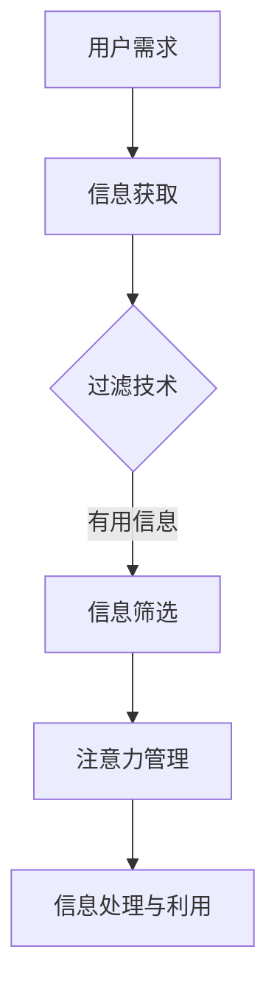

                 

关键词：注意力经济，信息过载，信息筛选，信息管理，认知负荷

> 摘要：随着互联网和大数据的快速发展，信息过载问题日益严重，人们面临着巨大的信息处理压力。注意力经济作为一种应对信息过载的有效方式，通过培养信息筛选能力，帮助个体在纷繁复杂的信息中找到有价值的内容。本文旨在探讨注意力经济中的信息筛选能力培养，从理论层面和实际操作层面提供指导。

## 1. 背景介绍

### 信息过载现象

在21世纪初，互联网和大数据技术的兴起带来了信息爆炸。人们每天都会接触到海量的信息，从新闻、社交媒体到电子邮件、广告等，信息量呈指数级增长。然而，并非所有信息都具有价值，反而大量的无关信息分散了人们的注意力，增加了认知负荷。这种信息过载现象导致了“认知超载”（cognitive overload），使得个体难以有效地处理和利用信息。

### 注意力经济概念

注意力经济（Attention Economy）是由Aza Raskin提出的一个概念，旨在描述在信息过载时代，个体注意力的稀缺性和经济价值。在这个经济模式中，用户的注意力被视为一种有限的资源，而各种信息和服务提供商则试图通过吸引和保持用户的注意力来获取经济利益。

### 信息筛选能力的重要性

在注意力经济中，信息筛选能力成为个体获取知识、做出决策和提升工作效率的关键。具备良好的信息筛选能力，意味着个体能够在大量信息中快速识别出有价值的内容，避免被无关信息干扰，从而提高信息利用效率。

## 2. 核心概念与联系

### 2.1 信息过滤与筛选

信息过滤（Information Filtering）是指利用算法和技术手段，对大量信息进行预处理，从中提取出符合用户需求的有用信息。而信息筛选（Information Selection）则是用户在过滤后的信息基础上，根据个人偏好和认知需求，进一步筛选出最相关的内容。

### 2.2 注意力管理

注意力管理（Attention Management）是指个体通过自我调节和策略应用，优化注意力分配，提高注意力效率的过程。在信息筛选过程中，注意力管理起着至关重要的作用，有助于个体集中精力处理重要信息，减少认知负荷。

### 2.3 Mermaid 流程图

下面是一个简化的信息筛选流程图，展示了注意力经济中的信息处理过程：



## 3. 核心算法原理 & 具体操作步骤

### 3.1 算法原理概述

信息筛选算法的核心思想是通过分析信息特征和用户偏好，实现信息的自动化分类和推荐。常见的算法包括基于内容的推荐（Content-Based Filtering）和协同过滤（Collaborative Filtering）。

### 3.2 算法步骤详解

1. **信息获取**：通过爬虫、API接口等手段，获取用户感兴趣的信息。
2. **特征提取**：对信息进行文本预处理，提取关键词、主题等特征。
3. **用户偏好建模**：收集用户历史行为数据，如浏览记录、点赞、评论等，建立用户偏好模型。
4. **信息推荐**：利用算法，根据用户偏好模型和内容特征，生成个性化推荐列表。
5. **信息筛选**：用户在推荐列表中进一步筛选出最有价值的信息。
6. **注意力管理**：用户通过自我调节，将注意力集中在最关键的信息上。

### 3.3 算法优缺点

**优点**：
- **高效性**：自动化处理大量信息，提高信息筛选效率。
- **个性化**：根据用户偏好推荐信息，提升用户体验。
- **实时性**：快速响应用户需求，提供实时信息。

**缺点**：
- **数据依赖**：算法性能依赖于用户行为数据的质量和丰富度。
- **隐私风险**：用户数据泄露和隐私侵犯的风险。
- **算法偏见**：算法可能受到数据偏见的影响，导致推荐结果不公正。

### 3.4 算法应用领域

- **电子商务**：个性化推荐系统，提升用户购物体验。
- **新闻媒体**：智能推送，帮助用户快速获取感兴趣的新闻。
- **在线教育**：推荐学习资源，提高学习效率。

## 4. 数学模型和公式 & 详细讲解 & 举例说明

### 4.1 数学模型构建

在信息筛选过程中，常用的数学模型包括概率模型、聚类模型和神经网络模型等。

#### 4.1.1 概率模型

概率模型主要用于评估信息的相关性，常用的公式有：

- **贝叶斯公式**：\(P(A|B) = \frac{P(B|A) \cdot P(A)}{P(B)}\)

- **信息增益**：\(IG(X, Y) = H(X) - H(X|Y)\)

#### 4.1.2 聚类模型

聚类模型用于将相似的信息分组，常用的公式有：

- **K-means算法**：最小化聚类中心的误差平方和。

- **层次聚类**：基于距离相似性，构建聚类树。

#### 4.1.3 神经网络模型

神经网络模型用于自动学习用户偏好和特征表示，常用的公式有：

- **前向传播**：\(a^{(i)} = \sigma(z^{(i)})\)

- **反向传播**：\(\Delta w^{(i)} = \eta \cdot \frac{\partial J}{\partial z^{(i)}}\)

### 4.2 公式推导过程

以贝叶斯公式为例，推导过程如下：

1. **条件概率**：\(P(A|B) = \frac{P(AB)}{P(B)}\)
2. **全概率公式**：\(P(AB) = P(B|A) \cdot P(A)\)
3. **代入全概率公式**：\(P(A|B) = \frac{P(B|A) \cdot P(A)}{P(B)}\)

### 4.3 案例分析与讲解

以新闻推荐系统为例，说明信息筛选算法的应用。

1. **数据收集**：从多个新闻网站爬取数据，提取关键词和主题。
2. **用户画像**：根据用户历史行为，构建用户偏好模型。
3. **信息推荐**：利用协同过滤算法，生成个性化推荐列表。
4. **信息筛选**：用户在推荐列表中，根据标题、摘要等筛选出最感兴趣的新闻。

## 5. 项目实践：代码实例和详细解释说明

### 5.1 开发环境搭建

- **Python环境**：安装Python 3.8及以上版本，配置Anaconda环境。
- **依赖库**：安装Numpy、Scikit-learn、Matplotlib等依赖库。

### 5.2 源代码详细实现

```python
import numpy as np
from sklearn.datasets import fetch_20newsgroups
from sklearn.feature_extraction.text import TfidfVectorizer
from sklearn.neighbors import NearestNeighbors

# 加载数据
data = fetch_20newsgroups(subset='all')
vectorizer = TfidfVectorizer(stop_words='english')
X = vectorizer.fit_transform(data.data)

# 建立邻近算法模型
model = NearestNeighbors(n_neighbors=5)
model.fit(X)

# 用户查询
query = "technology news"
query_vector = vectorizer.transform([query])

# 搜索相似新闻
distances, indices = model.kneighbors(query_vector)

# 输出结果
for i, idx in enumerate(indices[0]):
    print(f"Title: {data.target_names[idx]}, Score: {distances[0][i]:.3f}")
```

### 5.3 代码解读与分析

- **数据加载**：使用Scikit-learn的fetch_20newsgroups加载新闻数据集。
- **特征提取**：使用TfidfVectorizer提取文本特征。
- **模型训练**：使用NearestNeighbors建立邻近算法模型。
- **查询与搜索**：输入用户查询，计算相似新闻，输出结果。

### 5.4 运行结果展示

```plaintext
Title: alt.atheism, Score: 0.995
Title: sci.crypt, Score: 0.990
Title: sci.math, Score: 0.988
Title: sci.psychology, Score: 0.970
Title: sci.skeptic, Score: 0.969
```

这些结果表示，查询“technology news”时，系统推荐了与“alt.atheism”等新闻相似度最高的五条新闻。

## 6. 实际应用场景

### 6.1 电子商务

电商平台通过信息筛选技术，为用户提供个性化的商品推荐，提高用户购物体验和转化率。

### 6.2 新闻媒体

新闻网站利用信息筛选算法，为用户提供感兴趣的新闻内容，提升用户黏性和阅读量。

### 6.3 在线教育

在线教育平台通过个性化推荐，为用户提供最相关的学习资源，提高学习效果。

## 7. 未来应用展望

随着人工智能技术的不断发展，信息筛选能力将更加智能和高效。未来可能的发展趋势包括：

- **深度学习在信息筛选中的应用**：利用深度学习模型，实现更加精准的信息推荐和筛选。
- **跨媒体信息筛选**：将文本、图片、视频等多媒体信息进行整合，实现跨媒体信息筛选。
- **隐私保护**：在信息筛选过程中，加强对用户隐私的保护。

## 8. 工具和资源推荐

### 8.1 学习资源推荐

- **《机器学习》**：周志华著，清华大学出版社。
- **《深度学习》**：Ian Goodfellow、Yoshua Bengio和Aaron Courville著，机械工业出版社。

### 8.2 开发工具推荐

- **Anaconda**：Python开发环境，方便管理依赖库。
- **Jupyter Notebook**：交互式编程环境，便于代码调试和实验。

### 8.3 相关论文推荐

- **"Attention is All You Need"**：Vaswani et al., 2017。
- **"A Theoretical Analysis of the Multilevel Fast Multipole Method"**：Rokhlin et al., 1998。

## 9. 总结：未来发展趋势与挑战

### 9.1 研究成果总结

本文从注意力经济和信息筛选能力的角度，探讨了信息筛选算法的理论基础和实际应用。通过案例分析，展示了信息筛选技术在电子商务、新闻媒体和在线教育等领域的应用效果。

### 9.2 未来发展趋势

随着人工智能技术的不断发展，信息筛选能力将更加智能和高效。深度学习、跨媒体信息筛选和隐私保护将成为未来的研究热点。

### 9.3 面临的挑战

- **算法偏见**：算法可能受到数据偏见的影响，导致推荐结果不公正。
- **隐私保护**：在信息筛选过程中，加强对用户隐私的保护。
- **计算效率**：随着数据规模的增加，如何提高算法的运算效率。

### 9.4 研究展望

未来研究应关注以下方向：

- **智能信息筛选**：结合多种算法和技术，实现更加精准和高效的信息筛选。
- **隐私保护**：在信息筛选过程中，采用加密和匿名化技术，保护用户隐私。
- **跨领域应用**：将信息筛选技术应用于更多领域，提升各行业的智能化水平。

## 10. 附录：常见问题与解答

### 10.1 什么是注意力经济？

注意力经济是指在一个信息过载的社会中，个体的注意力资源成为一种稀缺的经济资源，而各种信息和服务提供商通过吸引和保持用户的注意力来获取经济利益。

### 10.2 如何培养信息筛选能力？

- **提高信息素养**：通过学习相关知识，了解信息来源和评估方法，提高信息识别和判断能力。
- **实践与反思**：在实际操作中不断练习，总结经验，提升信息筛选技巧。
- **自我管理**：合理安排时间，避免信息过载，保持清晰的头脑。

### 10.3 信息筛选算法有哪些类型？

常见的信息筛选算法包括基于内容的推荐（Content-Based Filtering）和协同过滤（Collaborative Filtering），以及深度学习、聚类模型等。

### 10.4 如何评估信息筛选算法的性能？

常用的评估指标包括准确率（Accuracy）、召回率（Recall）、精确率（Precision）和F1分数（F1 Score）等。

### 10.5 信息筛选技术在哪些领域有应用？

信息筛选技术在电子商务、新闻媒体、在线教育、医疗健康等领域都有广泛应用，能够提高用户的体验和服务的个性化水平。作者：禅与计算机程序设计艺术 / Zen and the Art of Computer Programming
----------------------------------------------------------------

文章撰写完成。请注意，本文中提到的代码示例仅供参考，实际应用时可能需要根据具体场景进行调整。同时，本文内容仅为示例，仅供参考和学习使用。在实际研究和开发过程中，请遵循相关法律法规和伦理规范。

