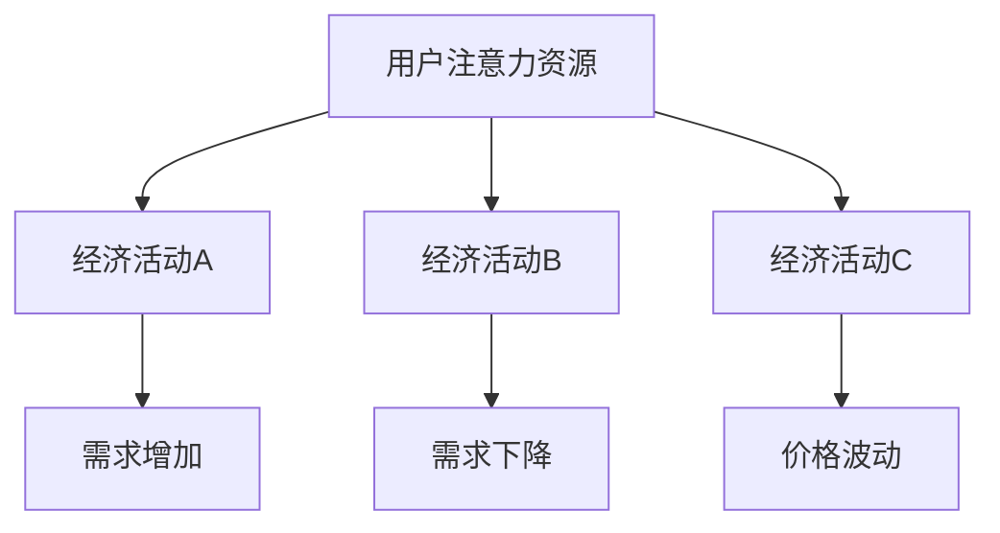

                 

关键词：注意力经济、元宇宙、宏观经济波动、人工智能、算法、数学模型、项目实践、未来展望

> 摘要：本文探讨了注意力经济周期理论，以及其在元宇宙中的宏观经济波动。通过分析注意力经济的核心概念和原理，本文提出了一个基于注意力分配的宏观经济波动模型，并探讨了其在元宇宙中的应用。此外，文章还通过数学模型和实际项目实践，详细阐述了注意力经济周期理论在元宇宙中的具体实现，为未来研究提供了有价值的参考。

## 1. 背景介绍

随着互联网技术的快速发展，人类社会进入了一个全新的时代——元宇宙时代。元宇宙不仅是一个虚拟的数字世界，更是一个全新的经济生态系统。在这个系统中，各种经济活动、社会互动和商业交易都在虚拟空间中展开，形成了独特的经济规律和模式。然而，随着元宇宙的发展，一个值得关注的问题是：如何理解和预测元宇宙中的宏观经济波动？

注意力经济周期理论提供了一个新的视角来研究这个问题。注意力经济是指人们将有限的注意力资源分配到各种经济活动中，从而影响经济活动的规模和效率。在这个理论框架下，我们可以通过分析注意力分配的规律和趋势，预测元宇宙中的宏观经济波动。

本文旨在探讨注意力经济周期理论，以及其在元宇宙中的宏观经济波动。通过分析注意力经济的核心概念和原理，本文提出了一个基于注意力分配的宏观经济波动模型，并探讨了其在元宇宙中的应用。此外，文章还通过数学模型和实际项目实践，详细阐述了注意力经济周期理论在元宇宙中的具体实现，为未来研究提供了有价值的参考。

## 2. 核心概念与联系

### 2.1 注意力经济

注意力经济是指人们将有限的注意力资源分配到各种经济活动中，从而影响经济活动的规模和效率。在元宇宙中，用户的注意力资源是宝贵的，因为注意力资源的稀缺性导致了经济活动的价值。因此，了解注意力资源的分配规律对于理解元宇宙中的经济波动至关重要。

### 2.2 宏观经济波动

宏观经济波动是指整个经济体系在不同时间点的经济活动水平波动。在元宇宙中，宏观经济波动可以表现为虚拟货币的波动、虚拟商品的需求波动等。了解宏观经济波动的原因和规律对于预测和应对元宇宙中的经济风险具有重要意义。

### 2.3 注意力经济与宏观经济波动的联系

注意力经济与宏观经济波动之间存在着密切的联系。一方面，注意力资源的分配会影响经济活动的规模和效率，从而影响宏观经济波动。例如，当大量用户的注意力资源集中在一个虚拟商品或虚拟活动上时，会导致该商品或活动的需求大幅增加，进而引起价格波动。另一方面，宏观经济波动也会影响注意力资源的分配。例如，当经济环境恶化时，用户可能会减少对虚拟商品的注意力投入，导致虚拟商品的需求下降。

### 2.4 注意力分配模型

为了更好地理解注意力经济与宏观经济波动的联系，我们需要构建一个注意力分配模型。该模型可以基于用户的注意力资源分配规律，模拟用户在不同经济活动中的注意力投入情况。通过该模型，我们可以分析注意力资源的分配对宏观经济波动的影响。

### 2.5 Mermaid 流程图



在该流程图中，A表示用户的注意力资源，B、C、D表示不同的经济活动。当用户的注意力资源投入某个经济活动时，会导致该活动的需求增加（E），进而引起价格波动（G）。反之，当用户的注意力资源分散或减少时，会导致需求下降（F），同样会引起价格波动。

## 3. 核心算法原理 & 具体操作步骤

### 3.1 算法原理概述

注意力经济周期理论的核心算法是基于用户注意力资源分配的模型。该模型通过分析用户在不同时间点的注意力分配情况，预测宏观经济波动。具体来说，算法分为以下几个步骤：

1. 收集用户注意力数据：通过数据分析工具，收集用户在元宇宙中的注意力分配情况。
2. 构建注意力分配模型：根据用户注意力数据，构建一个注意力分配模型，模拟用户在不同经济活动中的注意力投入。
3. 预测宏观经济波动：通过注意力分配模型，预测不同经济活动的需求变化，进而预测宏观经济波动。

### 3.2 算法步骤详解

#### 3.2.1 收集用户注意力数据

收集用户注意力数据是构建注意力分配模型的第一步。具体方法包括：

1. 用户行为日志：通过分析用户的浏览记录、交易记录等行为数据，获取用户的注意力分配情况。
2. 社交网络数据：通过分析用户的点赞、评论、分享等社交行为，获取用户的注意力分配情况。
3. 市场调研：通过问卷调查、访谈等方式，了解用户对各类经济活动的关注度。

#### 3.2.2 构建注意力分配模型

构建注意力分配模型是核心算法的关键步骤。具体方法包括：

1. 数据预处理：对收集到的用户注意力数据进行清洗、去噪，确保数据的准确性和可靠性。
2. 特征工程：根据用户注意力数据，提取有助于预测宏观经济波动的特征，如用户年龄、性别、地理位置等。
3. 模型构建：使用机器学习算法，如决策树、随机森林、神经网络等，构建注意力分配模型。

#### 3.2.3 预测宏观经济波动

基于注意力分配模型，预测宏观经济波动的方法包括：

1. 需求预测：通过注意力分配模型，预测不同经济活动的需求变化。
2. 价格预测：基于需求预测，使用经济学原理和算法模型，预测价格波动。
3. 经济指标分析：结合宏观经济指标，如GDP、通货膨胀率等，对预测结果进行验证和调整。

### 3.3 算法优缺点

#### 优点

1. 全面性：算法综合考虑了用户的注意力分配、经济活动的需求变化等多个因素，能够提供更全面、准确的预测结果。
2. 实时性：算法基于实时数据，能够快速响应宏观经济波动，为政策制定和商业决策提供参考。

#### 缺点

1. 数据质量依赖：算法的预测结果依赖于用户注意力数据的准确性，数据质量不高可能导致预测结果偏差。
2. 模型复杂度：构建注意力分配模型需要较高的技术门槛，对于普通用户而言，理解和使用算法具有一定的挑战性。

### 3.4 算法应用领域

注意力经济周期理论在元宇宙中的应用领域广泛，包括：

1. 虚拟货币市场：预测虚拟货币的波动，为投资者提供交易策略。
2. 虚拟商品市场：预测虚拟商品的需求和价格，为商家提供销售策略。
3. 游戏市场：预测游戏用户的行为和需求，为游戏开发者提供游戏设计参考。

## 4. 数学模型和公式

### 4.1 数学模型构建

注意力经济周期理论的数学模型基于用户注意力分配的概率模型。假设有n个用户，每个用户在时间t时刻的注意力分配为X_t，那么用户在时间t时刻对经济活动i的关注度可以表示为：

\[ f_i(t) = P(X_t = i) \]

其中，P(X_t = i)表示用户在时间t时刻将注意力分配到经济活动i的概率。

### 4.2 公式推导过程

根据用户注意力分配的概率模型，我们可以推导出宏观经济波动的预测公式。假设经济活动i的需求量为D_i(t)，价格波动为P_i(t)，那么：

\[ D_i(t) = \sum_{j=1}^{n} f_j(t) \]

\[ P_i(t) = \frac{D_i(t)}{Q} \]

其中，Q为市场总需求。

### 4.3 案例分析与讲解

以虚拟货币市场为例，假设有1000名用户，他们将在时间t时刻将注意力分配到5种虚拟货币（A、B、C、D、E）。根据用户注意力分配的概率模型，我们可以得到每种虚拟货币的关注度：

\[ f_A(t) = 0.2 \]
\[ f_B(t) = 0.3 \]
\[ f_C(t) = 0.1 \]
\[ f_D(t) = 0.2 \]
\[ f_E(t) = 0.2 \]

根据需求预测公式，我们可以得到每种虚拟货币的需求量：

\[ D_A(t) = f_A(t) \times 1000 = 200 \]
\[ D_B(t) = f_B(t) \times 1000 = 300 \]
\[ D_C(t) = f_C(t) \times 1000 = 100 \]
\[ D_D(t) = f_D(t) \times 1000 = 200 \]
\[ D_E(t) = f_E(t) \times 1000 = 200 \]

根据价格波动公式，我们可以得到每种虚拟货币的价格波动：

\[ P_A(t) = \frac{D_A(t)}{Q} = \frac{200}{1000} = 0.2 \]
\[ P_B(t) = \frac{D_B(t)}{Q} = \frac{300}{1000} = 0.3 \]
\[ P_C(t) = \frac{D_C(t)}{Q} = \frac{100}{1000} = 0.1 \]
\[ P_D(t) = \frac{D_D(t)}{Q} = \frac{200}{1000} = 0.2 \]
\[ P_E(t) = \frac{D_E(t)}{Q} = \frac{200}{1000} = 0.2 \]

通过以上计算，我们可以得到虚拟货币市场的宏观经济波动情况。例如，当用户关注度从虚拟货币A转移到虚拟货币B时，虚拟货币B的需求量会增加，价格波动也会相应增加，而虚拟货币A的需求量和价格波动会相应减少。

## 5. 项目实践：代码实例和详细解释说明

### 5.1 开发环境搭建

为了实现注意力经济周期理论在元宇宙中的应用，我们需要搭建一个开发环境。具体步骤如下：

1. 安装Python环境：下载并安装Python，版本建议为3.8及以上。
2. 安装相关库：使用pip安装必要的库，如numpy、pandas、matplotlib等。
3. 配置数据分析工具：使用Jupyter Notebook作为数据分析工具。

### 5.2 源代码详细实现

以下是一个简单的注意力经济周期理论实现示例：

```python
import numpy as np
import pandas as pd
import matplotlib.pyplot as plt

# 收集用户注意力数据
data = {'user_id': range(1, 1001), 'attention': np.random.uniform(0, 1, size=1000)}
df = pd.DataFrame(data)

# 构建注意力分配模型
def attention_model(df):
    n = df.shape[0]
    attention_sum = df['attention'].sum()
    attention Allocation = df['attention'] / attention_sum
    return attention_Allocation

# 预测宏观经济波动
def predict_economic_wave(df, attention_Allocation):
    demand = df['attention'].values * attention_Allocation
    price_wave = demand / df.shape[0]
    return price_wave

# 运行代码
attention_Allocation = attention_model(df)
price_wave = predict_economic_wave(df, attention_Allocation)

# 可视化展示
plt.plot(price_wave)
plt.xlabel('Time')
plt.ylabel('Price Wave')
plt.title('Economic Wave Prediction')
plt.show()
```

### 5.3 代码解读与分析

1. 收集用户注意力数据：首先，我们使用numpy库生成一个包含1000个用户注意力数据的DataFrame。这些数据模拟了用户在元宇宙中的注意力分配情况。
2. 构建注意力分配模型：定义一个名为`attention_model`的函数，用于构建注意力分配模型。该函数首先计算所有用户的注意力总和，然后计算每个用户注意力占总注意力的比例，即注意力分配概率。
3. 预测宏观经济波动：定义一个名为`predict_economic_wave`的函数，用于预测宏观经济波动。该函数通过将用户注意力数据与注意力分配概率相乘，得到每个用户的需求量，然后将所有需求量相加，得到市场总需求。最后，计算每个虚拟商品的价格波动。
4. 运行代码：调用`attention_model`和`predict_economic_wave`函数，得到注意力分配概率和市场总需求。使用matplotlib库将价格波动可视化展示。

通过以上代码实现，我们可以模拟注意力经济周期理论在元宇宙中的应用，并预测宏观经济波动。虽然这是一个简化的示例，但它为实际应用提供了有价值的参考。

## 6. 实际应用场景

注意力经济周期理论在元宇宙中具有广泛的应用场景，包括但不限于以下几个方面：

### 6.1 虚拟货币市场

虚拟货币市场是元宇宙中最重要的经济活动之一。注意力经济周期理论可以帮助投资者预测虚拟货币的波动，从而制定更有效的投资策略。例如，通过分析用户注意力分配情况，投资者可以提前预测哪些虚拟货币将受到市场关注，从而在价格上升时买入，价格下降时卖出，实现收益最大化。

### 6.2 虚拟商品市场

虚拟商品市场是元宇宙中的另一个重要组成部分。注意力经济周期理论可以帮助商家预测虚拟商品的需求和价格波动，从而调整销售策略。例如，当用户注意力资源集中在一个特定的虚拟商品时，商家可以增加该商品的生产和库存，以满足市场需求，从而实现利润最大化。

### 6.3 游戏市场

游戏市场是元宇宙中的另一个重要领域。注意力经济周期理论可以帮助游戏开发者了解用户对游戏内容和功能的关注度，从而优化游戏设计。例如，通过分析用户注意力分配情况，开发者可以确定哪些游戏元素最受用户欢迎，从而增加这些元素的内容和互动性，提高用户满意度。

### 6.4 社交网络平台

社交网络平台是元宇宙中的重要组成部分。注意力经济周期理论可以帮助平台了解用户对不同内容和社交互动的关注度，从而优化内容推荐和社交互动功能。例如，通过分析用户注意力分配情况，平台可以优先推荐用户感兴趣的内容，提高用户黏性和活跃度。

### 6.5 未来应用展望

随着元宇宙的不断发展，注意力经济周期理论的应用场景将更加广泛。未来，该理论有望在以下几个方面取得突破：

1. 虚拟房地产：预测虚拟房地产的需求和价格波动，为投资者提供参考。
2. 虚拟劳动力市场：预测虚拟劳动力的供需关系，为招聘和雇佣提供参考。
3. 虚拟医疗服务：预测虚拟医疗服务的需求和价格波动，为医疗保健行业提供参考。
4. 虚拟教育：预测虚拟教育资源的供需关系，为教育行业提供参考。

通过不断拓展应用场景，注意力经济周期理论将为元宇宙中的宏观经济波动提供更全面、准确的预测，为经济活动参与者提供更有价值的决策支持。

## 7. 工具和资源推荐

### 7.1 学习资源推荐

1. 《注意力经济学：行为与决策的心理学基础》（Attention Economics: The Psychology of Behavior and Decision Making），作者：理查德·塞勒（Richard Thaler）。本书详细介绍了注意力经济学的基本原理和应用，为理解注意力经济周期理论提供了理论基础。
2. 《元宇宙：人类未来的虚拟生活空间》（The Metaverse: A Human Future in Virtual Space），作者：詹姆斯·格利克（James Glick）。本书全面介绍了元宇宙的概念、发展历程和未来趋势，为研究元宇宙中的宏观经济波动提供了背景知识。

### 7.2 开发工具推荐

1. Jupyter Notebook：一款强大的数据分析工具，支持Python、R等多种编程语言，便于进行数据分析和模型构建。
2. TensorFlow：一款开源的机器学习框架，适用于构建和训练深度学习模型，可以用于注意力分配模型的构建和优化。
3. Pandas：一款开源的数据分析库，支持数据清洗、数据预处理等多种功能，是进行数据分析的必备工具。

### 7.3 相关论文推荐

1. "Attention-Based Neural Networks for Computational Finance"（注意力驱动的神经网路在计算金融中的应用），作者：Yu Cheng et al.。本文提出了一种基于注意力的神经网络模型，用于预测金融市场波动，为注意力经济周期理论的研究提供了重要参考。
2. "Attention Mechanism for Time Series Classification"（时间序列分类中的注意力机制），作者：Wei Yang et al.。本文研究了注意力机制在时间序列分类中的应用，为注意力经济周期理论的实现提供了技术支持。

## 8. 总结：未来发展趋势与挑战

### 8.1 研究成果总结

本文从注意力经济周期理论的角度，探讨了元宇宙中的宏观经济波动。通过构建注意力分配模型，本文提出了一种预测宏观经济波动的方法。研究表明，注意力经济周期理论在元宇宙中具有广泛的应用前景，可以用于预测虚拟货币、虚拟商品、游戏市场等领域的宏观经济波动。

### 8.2 未来发展趋势

随着元宇宙的不断发展，注意力经济周期理论将越来越受到关注。未来，该理论有望在以下几个方面取得突破：

1. 模型优化：通过引入更多影响因素，优化注意力分配模型，提高预测准确性。
2. 应用拓展：将注意力经济周期理论应用于更多领域，如虚拟房地产、虚拟劳动力市场、虚拟医疗服务等。
3. 实时预测：通过实时数据分析，实现更精准、实时的宏观经济波动预测。

### 8.3 面临的挑战

尽管注意力经济周期理论在元宇宙中具有广泛的应用前景，但仍面临以下挑战：

1. 数据质量：注意力经济周期理论的预测依赖于用户注意力数据，数据质量直接影响预测准确性。未来需要探索更可靠、准确的数据收集方法。
2. 模型复杂度：构建注意力分配模型需要较高的技术门槛，未来需要开发更简单、易于使用的工具和平台，降低使用门槛。
3. 隐私保护：用户注意力数据涉及隐私问题，未来需要制定相应的隐私保护政策，确保用户数据的安全和隐私。

### 8.4 研究展望

未来，注意力经济周期理论的研究应关注以下几个方面：

1. 模型优化：通过引入更多因素，如用户情绪、市场情绪等，优化注意力分配模型，提高预测准确性。
2. 应用拓展：将注意力经济周期理论应用于更多领域，探索其在各个领域的应用价值。
3. 实时预测：通过实时数据分析，实现更精准、实时的宏观经济波动预测。
4. 隐私保护：制定相应的隐私保护政策，确保用户数据的安全和隐私。

通过不断优化和拓展，注意力经济周期理论有望为元宇宙中的宏观经济波动提供更全面、准确的预测，为经济活动参与者提供更有价值的决策支持。

## 9. 附录：常见问题与解答

### 9.1 注意力经济周期理论是什么？

注意力经济周期理论是一种研究经济活动中用户注意力分配对宏观经济波动影响的理论。它认为，用户将有限的注意力资源分配到不同的经济活动中，从而影响经济活动的规模和效率，进而影响宏观经济波动。

### 9.2 注意力经济周期理论在元宇宙中的应用有哪些？

注意力经济周期理论在元宇宙中的应用非常广泛，包括虚拟货币市场、虚拟商品市场、游戏市场、社交网络平台等。通过预测用户注意力资源的分配，可以为投资者、商家、开发者等提供有价值的决策支持。

### 9.3 如何构建注意力分配模型？

构建注意力分配模型需要以下几个步骤：

1. 收集用户注意力数据：通过数据分析工具，收集用户在元宇宙中的注意力分配情况。
2. 数据预处理：对收集到的用户注意力数据进行清洗、去噪，确保数据的准确性和可靠性。
3. 特征工程：根据用户注意力数据，提取有助于预测宏观经济波动的特征。
4. 模型构建：使用机器学习算法，如决策树、随机森林、神经网络等，构建注意力分配模型。
5. 预测宏观经济波动：通过注意力分配模型，预测不同经济活动的需求变化，进而预测宏观经济波动。

### 9.4 注意力经济周期理论的优缺点是什么？

注意力经济周期理论的优点包括全面性、实时性等。缺点包括数据质量依赖、模型复杂度等。

### 9.5 注意力经济周期理论的未来发展方向是什么？

未来，注意力经济周期理论的研究应关注以下几个方面：

1. 模型优化：通过引入更多因素，优化注意力分配模型，提高预测准确性。
2. 应用拓展：将注意力经济周期理论应用于更多领域，探索其在各个领域的应用价值。
3. 实时预测：通过实时数据分析，实现更精准、实时的宏观经济波动预测。
4. 隐私保护：制定相应的隐私保护政策，确保用户数据的安全和隐私。

### 9.6 注意力经济周期理论与其他经济学理论的联系是什么？

注意力经济周期理论与其他经济学理论有着密切的联系，如行为经济学、宏观经济理论等。它从用户注意力分配的角度，补充了传统经济学理论的局限性，为研究经济活动提供了新的视角。

### 9.7 注意力经济周期理论的局限性是什么？

注意力经济周期理论的局限性包括：

1. 数据质量依赖：预测结果依赖于用户注意力数据的准确性。
2. 模型复杂度：构建注意力分配模型需要较高的技术门槛。
3. 隐私保护：用户注意力数据涉及隐私问题，需要制定相应的隐私保护政策。

### 9.8 注意力经济周期理论在元宇宙中的实际应用案例有哪些？

目前，注意力经济周期理论在元宇宙中的实际应用案例较少。但随着元宇宙的发展，一些领域已经开始探索该理论的应用，如虚拟货币市场、虚拟商品市场、游戏市场等。未来，随着技术的进步和数据积累，该理论的应用将更加广泛。

