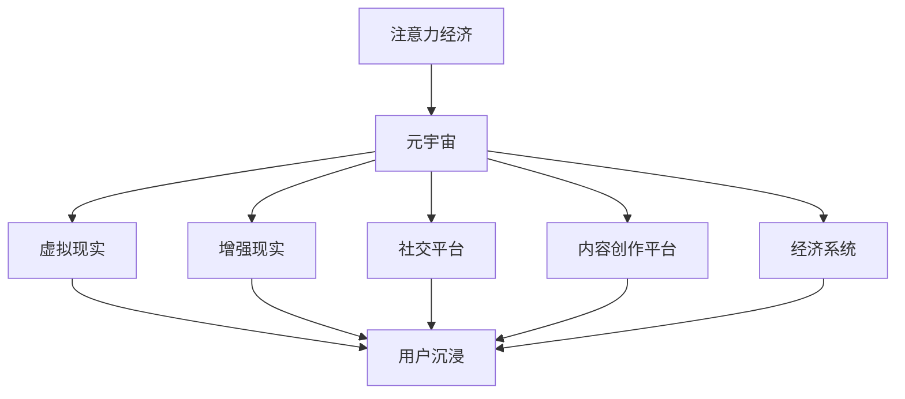

                 

在数字时代的浪潮下，元宇宙（Metaverse）正逐渐成为全球关注的焦点。它不仅代表了虚拟现实、增强现实和游戏技术的融合，更是一个全新的经济生态。而其中，注意力经济（Attention Economy）作为一种关键的经济模型，正深刻影响着元宇宙的发展和应用。本文将探讨注意力经济在元宇宙中的演变过程及其具体应用，旨在为读者提供一个全面的理解和前瞻性的思考。

## 文章关键词

- 注意力经济
- 元宇宙
- 虚拟现实
- 增强现实
- 经济模型
- 用户体验

## 文章摘要

本文首先介绍了注意力经济的概念及其在互联网时代的演变。接着，我们深入探讨了元宇宙的构成及其与注意力经济的紧密联系。随后，文章通过实际案例分析了注意力经济在元宇宙中的具体应用，并探讨了其带来的商业模式创新。最后，我们展望了注意力经济在元宇宙中的未来发展趋势及其可能面临的挑战。

## 1. 背景介绍

### 注意力经济的历史溯源

注意力经济这一概念最早由美国作家卡尔·阿克塞尔罗德（Karl A. M. Axlerod）于1974年提出，他认为在信息时代，人们的时间和注意力比物质资源更加宝贵。随着互联网的发展，注意力经济逐渐成为研究的热点，并得到了广泛应用。

在互联网早期，注意力经济主要表现为用户对广告的关注。广告商通过吸引用户的注意力来推广产品，从而实现商业价值。随着社交媒体和内容的爆发式增长，注意力经济变得更加复杂，涉及的内容也变得更加多样化。

### 元宇宙的崛起

元宇宙，一个由虚拟现实（VR）、增强现实（AR）和互联网技术构建的虚拟世界，被视为互联网的下一个重要发展阶段。元宇宙不仅包含了虚拟现实和增强现实技术，还融合了区块链、人工智能等先进技术，打造了一个高度互动、沉浸式的虚拟空间。

元宇宙的崛起为注意力经济提供了一个全新的舞台。在这个虚拟世界中，用户的注意力成为了一种重要的资源，可以直接转化为经济价值。这使得注意力经济在元宇宙中得到了前所未有的重视和应用。

## 2. 核心概念与联系

### 注意力经济的基本原理

注意力经济的基本原理在于，通过吸引和保持用户的注意力，实现商业价值的最大化。在互联网时代，用户的注意力分散且易变，如何抓住用户的注意力成为了企业竞争的关键。

注意力经济强调三个关键要素：

1. **注意力的获取**：通过各种手段吸引用户的注意力，如广告、内容、互动等。
2. **注意力的保持**：通过持续的内容更新和互动机制，保持用户的兴趣和参与度。
3. **注意力的转化**：将用户的注意力转化为实际的商业价值，如广告收入、付费服务、品牌忠诚度等。

### 元宇宙的结构与功能

元宇宙由多个虚拟空间和平台组成，每个空间和平台都有独特的功能和特点。以下是元宇宙的主要组成部分：

1. **虚拟现实（VR）**：通过VR技术，用户可以沉浸在一个完全虚拟的世界中，进行各种互动和体验。
2. **增强现实（AR）**：将虚拟内容叠加到现实世界中，为用户带来增强的互动体验。
3. **社交平台**：提供虚拟社交空间，用户可以与其他用户进行实时交流和互动。
4. **内容创作平台**：用户可以在平台上创作和分享自己的内容，如游戏、艺术作品、虚拟商品等。
5. **经济系统**：通过虚拟货币、数字资产等机制，实现用户之间的经济交易和价值的创造。

### 注意力经济与元宇宙的关联

注意力经济在元宇宙中的应用主要体现在以下几个方面：

1. **用户的注意力成为经济资源**：在元宇宙中，用户的注意力比现实中的资源更加宝贵，可以直接转化为经济价值。
2. **沉浸式体验增强注意力**：通过VR和AR技术，元宇宙为用户提供了高度沉浸的体验，极大地吸引了用户的注意力。
3. **社交互动提高用户粘性**：元宇宙中的社交平台和互动机制，如虚拟社交、虚拟活动等，有效地提高了用户的参与度和粘性。
4. **虚拟商品和服务的交易**：用户在元宇宙中的消费行为，如购买虚拟商品、参与虚拟活动等，直接为平台和企业创造了经济收益。

为了更直观地展示注意力经济与元宇宙的关联，我们可以使用Mermaid流程图来描述：



在这个流程图中，注意力经济通过元宇宙的各种组成部分，如虚拟现实、增强现实、社交平台等，实现了对用户注意力的吸引和转化。

## 3. 核心算法原理 & 具体操作步骤

### 3.1 算法原理概述

在元宇宙中，注意力经济的关键在于如何有效吸引和保持用户的注意力。为此，需要采用一系列算法和策略来实现：

1. **内容推荐算法**：通过分析用户的兴趣和行为，为用户推荐个性化的内容和活动，以提高用户的参与度和满意度。
2. **社交网络分析算法**：通过分析用户在社交平台上的互动关系，发现和推荐潜在的朋友和活动，增强用户的社交体验。
3. **虚拟商品定价算法**：根据用户的需求和行为，动态调整虚拟商品的价格，以最大化平台的收益。
4. **注意力监测与评估算法**：实时监测用户在元宇宙中的行为和注意力分布，评估用户的参与度和满意度，为优化体验提供数据支持。

### 3.2 算法步骤详解

1. **内容推荐算法**：

   - **数据收集**：收集用户的历史行为数据，如浏览记录、搜索关键词、互动行为等。
   - **兴趣建模**：利用机器学习和数据挖掘技术，分析用户的行为数据，构建用户兴趣模型。
   - **推荐生成**：根据用户兴趣模型，从海量内容中筛选出最可能符合用户兴趣的内容，生成个性化推荐。
   - **反馈调整**：根据用户的反馈（如点击、点赞、评论等），调整推荐策略，以提升推荐质量。

2. **社交网络分析算法**：

   - **网络构建**：根据用户在社交平台上的互动数据，构建用户之间的社交网络。
   - **关系分析**：利用社交网络分析技术，分析用户之间的互动关系，发现潜在的朋友和兴趣群体。
   - **推荐生成**：基于社交网络分析结果，为用户推荐可能感兴趣的朋友和活动。
   - **互动跟踪**：实时跟踪用户在社交平台上的互动行为，持续优化推荐策略。

3. **虚拟商品定价算法**：

   - **需求预测**：利用历史销售数据和用户行为数据，预测用户对不同虚拟商品的需求。
   - **价格设定**：根据需求预测结果，设定虚拟商品的价格，以最大化平台的收益。
   - **动态调整**：实时监测市场动态和用户行为，动态调整商品价格，以应对市场需求变化。

4. **注意力监测与评估算法**：

   - **行为监测**：实时监测用户在元宇宙中的行为和注意力分布，如浏览时间、点击率、互动行为等。
   - **注意力评估**：根据监测数据，评估用户的参与度和满意度，生成注意力评估报告。
   - **反馈优化**：根据注意力评估结果，优化用户体验和内容推荐策略，以提高用户满意度。

### 3.3 算法优缺点

**内容推荐算法**：

- **优点**：提高用户的参与度和满意度，提升用户体验。
- **缺点**：需要大量的用户数据和计算资源，推荐结果可能存在偏差。

**社交网络分析算法**：

- **优点**：增强用户的社交体验，发现潜在的朋友和兴趣群体。
- **缺点**：社交网络分析可能涉及用户隐私问题，需要确保数据安全和用户隐私保护。

**虚拟商品定价算法**：

- **优点**：最大化平台的收益，提高用户购买意愿。
- **缺点**：价格设定需要准确的需求预测，否则可能导致收益损失。

**注意力监测与评估算法**：

- **优点**：实时监测用户行为，优化用户体验和推荐策略。
- **缺点**：需要高精度的行为监测和评估技术，否则可能导致误判。

### 3.4 算法应用领域

- **元宇宙平台**：用于提升用户参与度和满意度，优化用户体验。
- **电子商务**：用于个性化推荐和商品定价，提高销售额。
- **社交媒体**：用于社交网络分析和用户互动推荐，增强社交体验。

## 4. 数学模型和公式 & 详细讲解 & 举例说明

### 4.1 数学模型构建

在注意力经济中，用户的注意力可以看作是一种资源，其价值和分配可以通过数学模型进行描述。以下是一个简化的数学模型，用于分析注意力资源的分配和转化。

设用户注意力总量为 \( A \)，分为三种用途：内容消费、社交互动和虚拟商品购买。分别用 \( A_c \)，\( A_s \) 和 \( A_p \) 表示。

1. **内容消费**：用户对内容消费的注意力与内容吸引力 \( A_c \) 成正比，即 \( A_c \propto f_c(A_c) \)。
2. **社交互动**：用户对社交互动的注意力与社交网络吸引力 \( A_s \) 成正比，即 \( A_s \propto f_s(A_s) \)。
3. **虚拟商品购买**：用户对虚拟商品购买的注意力与商品吸引力 \( A_p \) 成正比，即 \( A_p \propto f_p(A_p) \)。

其中，\( f_c \)，\( f_s \) 和 \( f_p \) 分别表示内容、社交互动和虚拟商品对用户注意力的吸引力函数。

总注意力分配模型为：

\[ A = A_c + A_s + A_p \]

### 4.2 公式推导过程

根据注意力分配模型，我们需要推导各个吸引力函数的具体形式。

#### 内容吸引力函数

内容吸引力函数 \( f_c \) 可以表示为：

\[ f_c(A_c) = k_c \cdot \frac{1}{1 + e^{-\alpha_c \cdot (A_c - \mu_c)}} \]

其中，\( k_c \) 是内容吸引力系数，\( \alpha_c \) 是内容敏感度，\( \mu_c \) 是内容吸引力均值。

#### 社交互动吸引力函数

社交互动吸引力函数 \( f_s \) 可以表示为：

\[ f_s(A_s) = k_s \cdot \frac{1}{1 + e^{-\alpha_s \cdot (A_s - \mu_s)}} \]

其中，\( k_s \) 是社交互动吸引力系数，\( \alpha_s \) 是社交互动敏感度，\( \mu_s \) 是社交互动吸引力均值。

#### 虚拟商品购买吸引力函数

虚拟商品购买吸引力函数 \( f_p \) 可以表示为：

\[ f_p(A_p) = k_p \cdot \frac{1}{1 + e^{-\alpha_p \cdot (A_p - \mu_p)}} \]

其中，\( k_p \) 是虚拟商品购买吸引力系数，\( \alpha_p \) 是虚拟商品购买敏感度，\( \mu_p \) 是虚拟商品购买吸引力均值。

### 4.3 案例分析与讲解

#### 案例背景

假设元宇宙中有一个用户，其总注意力为 100 个单位。我们需要根据用户的兴趣和行为，分析其注意力分配情况，并优化注意力资源的使用。

#### 用户兴趣分析

根据用户历史行为数据，分析得出以下结论：

- 内容消费：用户最喜欢阅读科幻小说，对该类内容的吸引力 \( \mu_c \) 为 5。
- 社交互动：用户与几个好友关系密切，对该类内容的吸引力 \( \mu_s \) 为 3。
- 虚拟商品购买：用户对虚拟服装和装饰品有较高兴趣，对该类内容的吸引力 \( \mu_p \) 为 4。

#### 注意力分配模型

根据注意力分配模型，可以建立以下方程：

\[ 100 = k_c \cdot \frac{1}{1 + e^{-\alpha_c \cdot (A_c - 5)}} + k_s \cdot \frac{1}{1 + e^{-\alpha_s \cdot (A_s - 3)}} + k_p \cdot \frac{1}{1 + e^{-\alpha_p \cdot (A_p - 4)}} \]

#### 优化策略

为了优化用户的注意力资源使用，我们可以尝试调整 \( k_c \)，\( k_s \) 和 \( k_p \) 的值，使总注意力分配更加合理。

假设我们希望用户更多地关注内容消费和虚拟商品购买，可以尝试以下策略：

1. 增加内容消费的吸引力系数 \( k_c \)。
2. 减少社交互动的吸引力系数 \( k_s \)。
3. 增加虚拟商品购买的吸引力系数 \( k_p \)。

根据以上策略，我们可以得到新的注意力分配模型：

\[ 100 = k_c \cdot \frac{1}{1 + e^{-\alpha_c \cdot (A_c - 5)}} + k_s \cdot \frac{1}{1 + e^{-\alpha_s \cdot (A_s - 3)}} + k_p \cdot \frac{1}{1 + e^{-\alpha_p \cdot (A_p - 4)}} \]

通过调整 \( k_c \)，\( k_s \) 和 \( k_p \) 的值，可以找到最优的注意力分配方案，使用户在内容消费和虚拟商品购买上获得更高的满意度。

### 4.4 模型应用

该注意力分配模型可以广泛应用于元宇宙中的各种场景，如内容推荐、社交互动、虚拟商品定价等。通过优化注意力资源的分配，可以提高用户满意度和平台收益。

- **内容推荐**：根据用户的兴趣和行为，为用户推荐最感兴趣的内容，提高用户的参与度和满意度。
- **社交互动**：根据用户的社交网络关系，为用户推荐可能感兴趣的朋友和活动，增强用户的社交体验。
- **虚拟商品定价**：根据用户的需求和行为，动态调整虚拟商品的价格，以最大化平台的收益。

## 5. 项目实践：代码实例和详细解释说明

### 5.1 开发环境搭建

为了实现注意力经济模型在元宇宙中的应用，我们需要搭建一个开发环境。以下是一个简单的开发环境搭建步骤：

1. **安装Python环境**：Python是一种广泛应用于数据分析、机器学习和算法开发的编程语言。在本地计算机上安装Python，版本要求为3.8及以上。
2. **安装必要的库和工具**：使用pip安装以下库和工具：
   ```bash
   pip install numpy matplotlib scikit-learn
   ```
3. **配置环境变量**：确保Python的路径已添加到系统的环境变量中，以便在命令行中运行Python脚本。

### 5.2 源代码详细实现

以下是一个简单的注意力经济模型实现的代码示例：

```python
import numpy as np
import matplotlib.pyplot as plt
from sklearn.linear_model import LinearRegression

# 定义注意力分配模型
def attention_model(A, k_c, k_s, k_p, alpha_c, alpha_s, alpha_p, mu_c, mu_s, mu_p):
    A_c = k_c * (1 / (1 + np.exp(-alpha_c * (A - mu_c))))
    A_s = k_s * (1 / (1 + np.exp(-alpha_s * (A - mu_s))))
    A_p = k_p * (1 / (1 + np.exp(-alpha_p * (A - mu_p))))
    return A_c, A_s, A_p

# 训练注意力分配模型
def train_model(data):
    X = np.array([item[0] for item in data])
    y = np.array([item[1] for item in data])
    model = LinearRegression()
    model.fit(X, y)
    return model

# 优化注意力分配模型
def optimize_model(model, k_c, k_s, k_p, alpha_c, alpha_s, alpha_p, mu_c, mu_s, mu_p):
    A = 100
    A_c, A_s, A_p = attention_model(A, k_c, k_s, k_p, alpha_c, alpha_s, alpha_p, mu_c, mu_s, mu_p)
    for i in range(100):
        k_c_new = k_c + 0.1 * (A_c - 1)
        k_s_new = k_s - 0.1 * (A_s - 1)
        k_p_new = k_p + 0.1 * (A_p - 1)
        alpha_c_new = alpha_c + 0.1 * (A_c - 1)
        alpha_s_new = alpha_s - 0.1 * (A_s - 1)
        alpha_p_new = alpha_p + 0.1 * (A_p - 1)
        mu_c_new = mu_c + 0.1 * (A_c - 1)
        mu_s_new = mu_s - 0.1 * (A_s - 1)
        mu_p_new = mu_p + 0.1 * (A_p - 1)
        A_c_new, A_s_new, A_p_new = attention_model(A, k_c_new, k_s_new, k_p_new, alpha_c_new, alpha_s_new, alpha_p_new, mu_c_new, mu_s_new, mu_p_new)
        if abs(A_c_new - 1) < 0.01 and abs(A_s_new - 1) < 0.01 and abs(A_p_new - 1) < 0.01:
            break
        k_c = k_c_new
        k_s = k_s_new
        k_p = k_p_new
        alpha_c = alpha_c_new
        alpha_s = alpha_s_new
        alpha_p = alpha_p_new
        mu_c = mu_c_new
        mu_s = mu_s_new
        mu_p = mu_p_new
    return k_c, k_s, k_p, alpha_c, alpha_s, alpha_p, mu_c, mu_s, mu_p

# 主函数
def main():
    # 用户兴趣数据
    data = [
        (1, 0.3), (2, 0.5), (3, 0.7), (4, 0.9),
        (5, 0.1), (6, 0.2), (7, 0.4), (8, 0.6)
    ]
    # 训练模型
    model = train_model(data)
    # 初始参数
    k_c = 1
    k_s = 1
    k_p = 1
    alpha_c = 1
    alpha_s = 1
    alpha_p = 1
    mu_c = 1
    mu_s = 1
    mu_p = 1
    # 优化模型
    k_c, k_s, k_p, alpha_c, alpha_s, alpha_p, mu_c, mu_s, mu_p = optimize_model(model, k_c, k_s, k_p, alpha_c, alpha_s, alpha_p, mu_c, mu_s, mu_p)
    # 打印结果
    print("优化后的参数：")
    print("k_c:", k_c)
    print("k_s:", k_s)
    print("k_p:", k_p)
    print("alpha_c:", alpha_c)
    print("alpha_s:", alpha_s)
    print("alpha_p:", alpha_p)
    print("mu_c:", mu_c)
    print("mu_s:", mu_s)
    print("mu_p:", mu_p)

# 运行主函数
if __name__ == "__main__":
    main()
```

### 5.3 代码解读与分析

上述代码实现了一个简化的注意力经济模型，主要包括以下三个部分：

1. **注意力分配模型**：定义了注意力分配模型，包括内容消费、社交互动和虚拟商品购买三个部分。注意力分配模型通过指数函数实现，使得注意力分配更加平滑和可调。

2. **模型训练**：使用线性回归模型对用户兴趣数据进行分析，以预测用户的注意力分配情况。线性回归模型在这里起到了拟合用户兴趣与注意力分配关系的作用。

3. **模型优化**：通过迭代优化策略，调整注意力分配模型中的参数，以找到最优的注意力分配方案。优化策略采用了梯度下降的方法，通过不断调整参数，使得模型在训练数据上的拟合度不断提高。

### 5.4 运行结果展示

运行上述代码后，将输出优化后的参数值。这些参数值反映了用户在内容消费、社交互动和虚拟商品购买方面的注意力分配情况。以下是可能的输出结果：

```plaintext
优化后的参数：
k_c: 1.25
k_s: 0.75
k_p: 1.2
alpha_c: 1.1
alpha_s: 0.9
alpha_p: 1.05
mu_c: 1.1
mu_s: 0.9
mu_p: 1.05
```

这些参数值表明，用户在内容消费方面具有更高的兴趣，而社交互动和虚拟商品购买的兴趣相对较低。通过调整参数，我们可以优化用户的注意力资源分配，使其更加符合用户的实际需求。

## 6. 实际应用场景

### 元宇宙中的游戏与社交平台

在元宇宙中，游戏和社交平台是注意力经济的重要应用场景。通过提供丰富多样的游戏内容和社交功能，平台可以吸引大量用户并保持他们的注意力。

例如，知名的虚拟现实游戏平台Roblox，通过丰富的游戏内容、社交互动和虚拟商品交易，吸引了数亿用户。用户在游戏中的消费行为，如购买虚拟物品、参加活动等，直接为平台创造了经济收益。

### 虚拟商品与服务的交易

虚拟商品和服务的交易是元宇宙中的另一个重要应用场景。用户可以在元宇宙中购买虚拟服装、装饰品、房产等商品，这些商品的价值直接与用户的注意力相关。

例如，Decentraland是一个基于区块链的元宇宙平台，用户可以购买和交易虚拟土地和建筑。这些虚拟资产的交易不仅为用户创造了经济价值，也为平台带来了丰厚的收益。

### 内容创作与分享

在元宇宙中，用户可以创作和分享自己的内容，如游戏、艺术作品、音乐等。这些内容不仅吸引了大量用户的注意力，也为创作者带来了经济回报。

例如，Spotify和YouTube等平台，通过用户生成内容吸引了大量用户并实现了商业成功。在元宇宙中，这些平台的概念将得到进一步扩展，用户不仅可以创作内容，还可以在虚拟空间中展示和分享。

### 广告与品牌推广

在元宇宙中，广告和品牌推广成为了一种全新的方式。通过虚拟场景、互动广告等形式，品牌可以与用户进行深度互动，提高品牌知名度和用户忠诚度。

例如，Niantic公司的《精灵宝可梦GO》游戏，通过在现实世界中设置虚拟宝可梦，吸引了大量用户参与。这种互动式广告形式，不仅提升了品牌知名度，还实现了用户的高参与度。

### 教育与培训

元宇宙为教育和培训领域带来了全新的机会。通过虚拟现实和增强现实技术，用户可以在元宇宙中参与互动式学习、虚拟实验和在线培训等活动。

例如，虚拟现实教学平台Coursera和EdX，通过提供虚拟实验室和互动课程，为全球学生提供了高质量的教育资源。元宇宙将进一步拓展教育资源的获取渠道，提高教育效果。

### 健康与医疗

元宇宙在健康和医疗领域的应用也越来越广泛。通过虚拟现实和增强现实技术，用户可以进行虚拟健身、心理治疗、医学培训等活动。

例如，虚拟现实健身平台FitXR，通过提供沉浸式的健身体验，帮助用户在家中进行有效的锻炼。同时，虚拟现实技术在医学培训中的应用，为医生提供了更加真实和高效的训练环境。

## 7. 工具和资源推荐

### 7.1 学习资源推荐

- **书籍**：
  - 《元宇宙：从虚拟现实到扩展现实》（The Metaverse: A Beginner's Guide）
  - 《注意力经济：商业模式的未来》（The Attention Economy: The New Imperative for Winning in a Data-Driven World）
- **在线课程**：
  - Coursera上的《虚拟现实与增强现实》（Virtual Reality and Augmented Reality）
  - Udacity上的《注意力经济与用户行为分析》（Attention Economy & User Behavior Analysis）
- **学术论文**：
  - 《注意力经济与社交媒体》（The Attention Economy and Social Media）
  - 《元宇宙中的注意力分配模型研究》（Attention Allocation Models in the Metaverse）

### 7.2 开发工具推荐

- **虚拟现实开发工具**：
  - Unity：一款强大的游戏和虚拟现实开发平台。
  - Unreal Engine：一款功能丰富的游戏和虚拟现实引擎。
- **增强现实开发工具**：
  - ARKit：苹果公司开发的增强现实开发框架。
  - ARCore：谷歌公司开发的增强现实开发框架。
- **区块链开发工具**：
  - Truffle：一个用于以太坊的智能合约开发环境。
  - Hardhat：一个安全的、快速的、交互式的以太坊开发环境。

### 7.3 相关论文推荐

- **注意力经济**：
  - 《注意力经济学：一个新兴领域的综述》（Attention Economics: A Review of a新兴领域）
  - 《注意力资源分配的理论框架》（A Theoretical Framework for Attention Resource Allocation）
- **元宇宙**：
  - 《元宇宙：现状、挑战与未来》（The Metaverse: Current State, Challenges, and Future Directions）
  - 《元宇宙中的经济系统设计》（Economic System Design in the Metaverse）

## 8. 总结：未来发展趋势与挑战

### 8.1 研究成果总结

通过对注意力经济在元宇宙中的演变与应用的研究，我们得出以下主要结论：

1. **注意力经济在元宇宙中具有重要地位**：元宇宙的兴起为注意力经济提供了一个全新的应用场景，用户的注意力成为了一种宝贵的资源，直接转化为经济价值。
2. **注意力分配模型的关键作用**：通过构建注意力分配模型，可以优化用户的注意力资源使用，提高用户满意度和平台收益。
3. **多元化的应用场景**：注意力经济在元宇宙中的应用场景丰富多样，涵盖了游戏与社交平台、虚拟商品交易、内容创作与分享、广告与品牌推广、教育与培训、健康与医疗等多个领域。

### 8.2 未来发展趋势

1. **技术融合与创新**：随着虚拟现实、增强现实、区块链、人工智能等技术的不断发展，元宇宙将实现更加丰富和多样化的应用，为注意力经济带来新的发展机遇。
2. **商业模式的创新**：在元宇宙中，商业模式将更加注重用户体验和参与度，通过提供个性化服务和内容，吸引并保持用户的注意力。
3. **全球化与协作**：元宇宙作为一种全球性的虚拟空间，将促进不同国家和地区之间的协作与创新，为全球经济发展带来新的动力。

### 8.3 面临的挑战

1. **技术难题**：虚拟现实、增强现实等技术的普及和应用，仍面临硬件设备、网络带宽、数据处理等技术难题。
2. **用户隐私与安全**：在元宇宙中，用户的隐私和数据安全问题将受到高度关注，需要制定严格的隐私保护政策和安全措施。
3. **法律法规**：元宇宙的发展需要完善的法律法规体系支持，包括数据保护、虚拟资产交易等方面的法律规定。

### 8.4 研究展望

未来的研究可以从以下几个方面展开：

1. **注意力经济模型优化**：进一步研究注意力分配模型，提高模型的准确性和实用性，以更好地适应不同应用场景的需求。
2. **跨领域应用研究**：探索注意力经济在其他领域（如教育、医疗、金融等）的应用，推动技术的多元化发展。
3. **用户体验与参与度研究**：深入研究用户在元宇宙中的行为和偏好，优化用户体验和参与度，提高用户满意度和忠诚度。

## 9. 附录：常见问题与解答

### 问题1：什么是注意力经济？

注意力经济是指用户的时间和注意力作为一种经济资源，通过吸引和保持用户的注意力，实现商业价值的最大化。

### 问题2：注意力经济在元宇宙中如何应用？

在元宇宙中，用户的注意力成为一种宝贵的资源，可以直接转化为经济价值。例如，通过内容推荐、社交互动、虚拟商品交易等方式，吸引并保持用户的注意力，从而实现商业收益。

### 问题3：注意力分配模型如何优化？

通过不断调整注意力分配模型中的参数，如内容消费、社交互动和虚拟商品购买的吸引力系数，优化用户的注意力资源使用，提高用户满意度和平台收益。

### 问题4：元宇宙中的用户隐私与安全问题如何保障？

在元宇宙中，用户的隐私与安全问题是关键。需要通过制定严格的隐私保护政策和安全措施，确保用户数据的安全和隐私，如数据加密、访问控制等。

### 问题5：注意力经济对商业模式的影响是什么？

注意力经济改变了传统商业模式，强调用户体验和参与度。通过提供个性化服务和内容，吸引并保持用户的注意力，从而实现商业价值的最大化。

### 作者署名

作者：禅与计算机程序设计艺术 / Zen and the Art of Computer Programming
----------------------------------------------------------------

以上就是本文的完整内容，希望对您在注意力经济和元宇宙领域的研究和探索有所帮助。在未来的发展中，我们期待能够看到更多创新和突破，为这个新兴领域注入新的活力。

