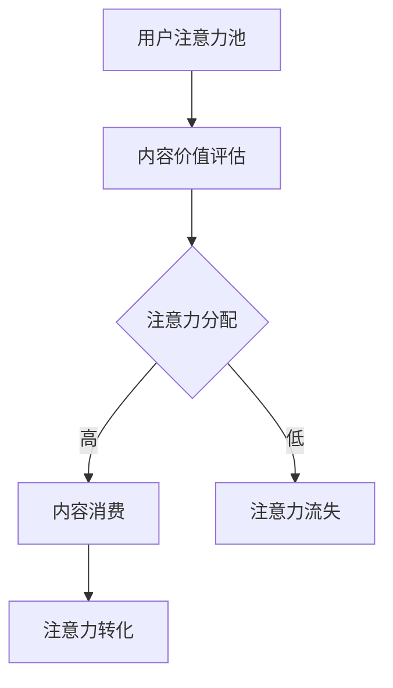
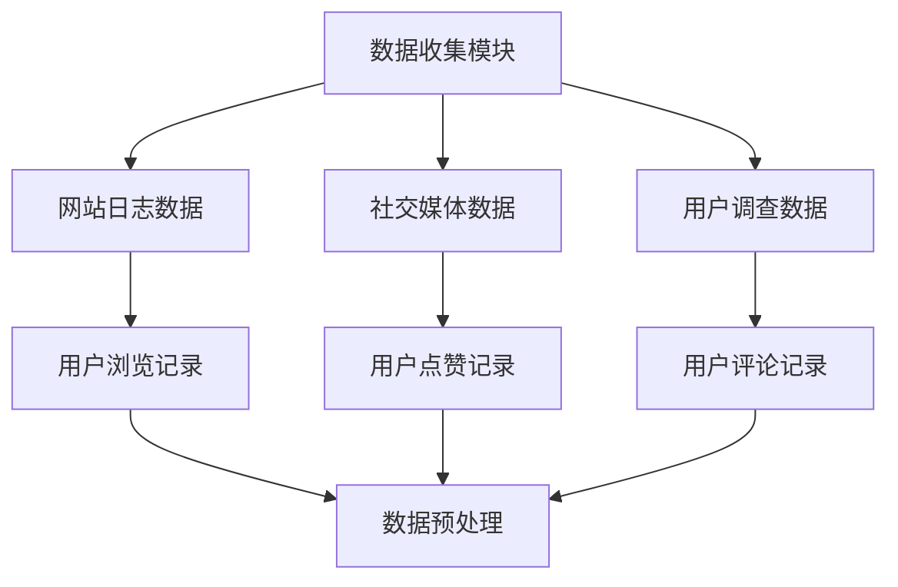
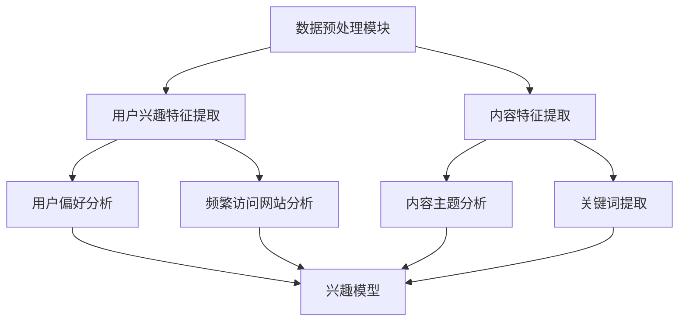
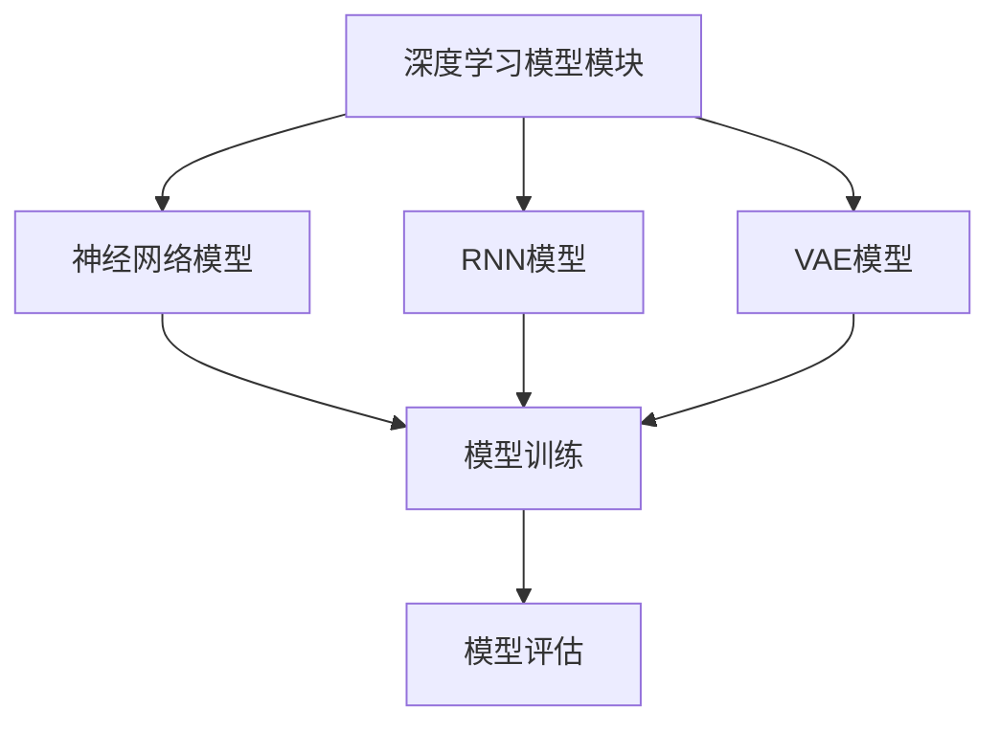
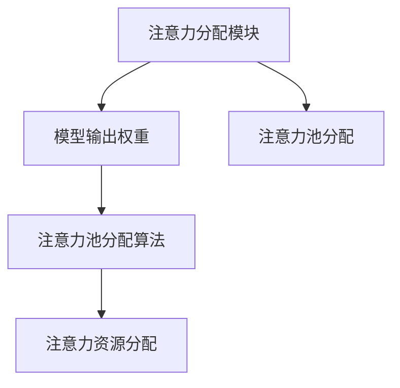
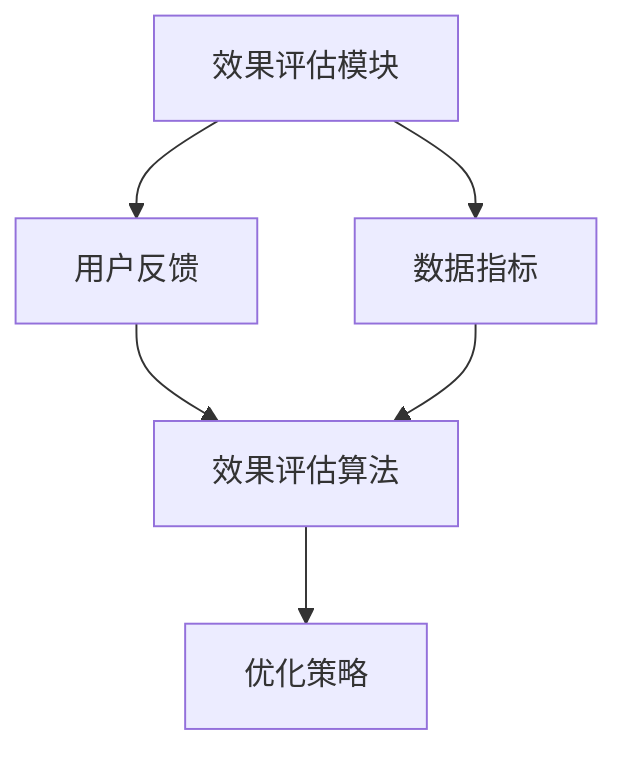

                 

元宇宙，作为虚拟现实技术与区块链技术的融合产物，正逐渐成为全球范围内的热门话题。在这个由数字世界构建的平行时空中，学术研究、技术创新和商业应用相互交织，催生出了全新的经济模式和商业模式。在这样的背景下，"注意力经济学奖"应运而生，成为元宇宙中的一项学术最高荣誉，旨在表彰在注意力经济领域做出杰出贡献的科学家、研究人员和企业家。

## 关键词

- 注意力经济
- 元宇宙
- 技术创新
- 学术荣誉
- 经济模式

## 摘要

本文将深入探讨"注意力经济学奖"的背景、核心概念、算法原理、数学模型、应用实践以及未来展望。首先，我们将回顾元宇宙的发展历程，并阐述注意力经济的概念。接着，通过详细的算法原理和步骤，我们将展示如何衡量和优化注意力资源。随后，我们引入数学模型和公式，对注意力经济学进行量化分析。文章的后半部分将聚焦于实际项目实践，展示代码实例和运行结果。最后，我们将讨论注意力经济在现实世界中的应用场景，并提出未来发展的趋势与挑战。

## 1. 背景介绍

### 元宇宙的发展历程

元宇宙（Metaverse）这一概念最早可以追溯到1992年，由科幻小说家尼尔·斯蒂芬森在其作品《雪崩》中提出。斯蒂芬森将元宇宙描述为一个由虚拟现实、增强现实和网络技术共同构建的全球性平台，人们可以通过数字化的身份在其中进行社交、工作、学习和娱乐。随着科技的不断进步，特别是虚拟现实（VR）和增强现实（AR）技术的成熟，元宇宙的概念逐渐从科幻领域走向现实。

21世纪初，随着宽带互联网的普及和计算能力的提升，虚拟现实和增强现实技术开始进入大众视野。2010年，Oculus VR公司发布了首款消费者级别的虚拟现实头盔，标志着虚拟现实技术开始向商业应用迈进。与此同时，游戏产业对元宇宙的探索也如火如荼，诸如《第二人生》（Second Life）和《虚拟现实世界》（VRChat）等虚拟世界吸引了大量用户。

进入2010年代后期，随着区块链技术的兴起，元宇宙的概念得到了进一步的扩展。区块链技术不仅为元宇宙中的虚拟资产提供了去中心化的存储和管理方案，还促进了虚拟经济的繁荣。在这个背景下，NFT（非同质化代币）作为一种全新的数字资产形式，开始在元宇宙中广泛应用，成为虚拟艺术品、虚拟地产等数字化资产的代表。

### 注意力经济的概念

注意力经济（Attention Economy）是由互联网和社交媒体的兴起所催生的一种新型经济模式。在传统经济中，货币是最主要的交换媒介，而注意力经济中，注意力本身成为了一种重要的资源。人们的时间、精力和关注都被视为宝贵的资源，如何吸引和保持用户的注意力成为企业和个人竞相追求的目标。

注意力经济的核心在于“注意力分配”。在信息过载的时代，用户的注意力变得稀缺，每个人每天的注意力总量是有限的。因此，如何有效地吸引和留住用户的注意力，成为了一种重要的竞争策略。社交媒体平台、内容创作者和广告商等都在通过各种手段争夺用户的注意力，例如通过算法优化内容推荐、个性化广告投放等。

### 注意力经济学奖的诞生

随着元宇宙和注意力经济的快速发展，学术界和业界对这一领域的关注度不断提升。为了推动该领域的学术研究和技术创新，一些国际性组织和机构开始设立注意力经济学奖，以表彰在该领域做出杰出贡献的科学家、研究人员和企业。注意力经济学奖不仅成为元宇宙中的一项学术最高荣誉，也成为了全球范围内关注注意力经济研究的标志。

注意力经济学奖的设立背景是元宇宙和注意力经济在全球范围内的快速发展。随着虚拟现实、增强现实和区块链技术的广泛应用，元宇宙的规模和影响力不断扩大，吸引了越来越多的企业和投资者进入这一领域。同时，随着互联网和社交媒体的普及，注意力经济的概念也得到了广泛认可。在这个背景下，设立注意力经济学奖旨在激励更多的科学家、研究人员和企业投身于注意力经济的研究和实践中，推动该领域的学术进步和技术创新。

注意力经济学奖的评选标准主要包括以下几个方面：

1. **创新性**：奖项旨在表彰在注意力经济领域提出新颖理论、方法和技术的研究成果。

2. **影响力**：获奖者在学术界或业界产生的广泛影响和贡献。

3. **应用前景**：研究成果在现实世界中的应用潜力和社会价值。

4. **团队协作**：团队合作在研究成果中的贡献。

5. **社会责任**：研究成果在促进社会公正和可持续发展方面的贡献。

注意力经济学奖的评选过程通常包括以下几个步骤：

1. **提名**：由学术界、业界和公众进行提名，提名需提供详细的申请材料。

2. **初审**：评审委员会对提名材料进行初步筛选，确定入围名单。

3. **评审**：评审委员会对入围名单进行详细评审，综合评估各项指标，确定最终获奖者。

4. **公布**：在年度颁奖典礼上公布获奖名单，并颁发奖项。

注意力经济学奖的设立不仅为科学家、研究人员和企业提供了展示研究成果的平台，也促进了元宇宙和注意力经济领域的学术交流和合作。通过这一奖项的评选和颁发，可以激励更多的创新者和研究者投身于注意力经济的研究和实践中，推动该领域的持续发展和创新。

## 2. 核心概念与联系

### 注意力经济模型

在注意力经济中，注意力被视为一种稀缺资源，而用户的时间、精力和关注都被视为注意力。注意力经济模型的核心在于如何衡量、分配和优化注意力资源。以下是一个简化的注意力经济模型：

#### 注意力资源分配

1. **注意力池**：用户每天有一个有限的注意力池，用于分配给各种活动和内容。
2. **内容价值评估**：用户根据内容的吸引力、相关性、创新性等因素评估内容的注意力价值。
3. **注意力分配**：用户将注意力池分配给不同内容，以最大化个人效用。

#### 注意力经济指标

1. **注意力获取**：通过内容推荐、广告投放等方式吸引和留住用户的注意力。
2. **注意力流失**：用户因内容质量不佳、广告干扰等因素流失注意力。
3. **注意力转化**：将注意力转化为实际的经济价值，如广告收入、产品销售额等。

### Mermaid 流程图

以下是一个Mermaid流程图，展示了注意力经济模型的基本流程：



### 注意力经济模型与元宇宙的联系

注意力经济模型与元宇宙的联系主要体现在以下几个方面：

1. **虚拟现实与注意力获取**：元宇宙中的虚拟现实（VR）体验可以提供沉浸式的内容，吸引用户的注意力。
2. **社交互动与注意力流失**：元宇宙中的社交互动（如虚拟聊天、虚拟聚会）可能导致用户注意力流失。
3. **虚拟经济与注意力转化**：元宇宙中的虚拟资产交易（如NFT、虚拟地产）将注意力转化为实际的经济价值。

### 注意力经济模型与区块链技术的结合

区块链技术为注意力经济模型提供了去中心化的支持，主要体现在以下几个方面：

1. **数据透明性**：区块链技术确保用户注意力数据透明，不可篡改。
2. **去中心化交易平台**：区块链技术支持去中心化的虚拟资产交易，降低交易成本。
3. **智能合约**：智能合约自动执行虚拟资产交易和注意力分配，提高效率。

### 注意力经济模型的应用领域

注意力经济模型在元宇宙中的应用领域非常广泛，包括但不限于：

1. **虚拟广告**：通过元宇宙中的虚拟广告吸引用户注意力，实现广告收入。
2. **虚拟教育**：利用元宇宙提供沉浸式的教育体验，提高学习效果。
3. **虚拟医疗**：元宇宙中的虚拟医疗咨询和服务，吸引用户的注意力。
4. **虚拟地产**：元宇宙中的虚拟地产交易，将用户注意力转化为经济价值。

### 注意力经济模型的优势与挑战

#### 优势：

1. **个性化推荐**：基于用户注意力数据，提供个性化的内容推荐。
2. **高效转化**：通过精准的注意力分配，提高经济转化率。
3. **去中心化**：区块链技术确保数据的去中心化，提高系统的透明性和可信度。

#### 挑战：

1. **隐私保护**：用户注意力数据的收集和使用需平衡隐私保护。
2. **技术门槛**：构建和维护注意力经济模型需要较高的技术门槛。
3. **公平性**：确保注意力资源的公平分配，防止垄断和不公平现象。

### 总结

注意力经济模型是元宇宙中的一项重要概念，它通过衡量、分配和优化注意力资源，为元宇宙中的各种经济活动提供了理论基础。结合虚拟现实、社交互动和区块链技术，注意力经济模型在元宇宙中的应用前景广阔。然而，该模型也面临隐私保护、技术门槛和公平性等挑战，需要进一步的研究和实践。

## 3. 核心算法原理 & 具体操作步骤

### 3.1 算法原理概述

在注意力经济中，核心算法的作用是衡量、分配和优化用户的注意力资源。本文将介绍一种基于深度学习的高效注意力分配算法，该算法通过分析用户的行为数据和内容特征，实现个性化的注意力分配。

#### 算法原理

该算法的基本原理可以分为以下几个步骤：

1. **数据收集**：收集用户的历史行为数据，包括浏览记录、点赞、评论等。
2. **特征提取**：从数据中提取用户的兴趣特征和内容特征。
3. **模型训练**：使用深度学习模型，将用户的兴趣特征和内容特征映射到注意力分配的权重。
4. **注意力分配**：根据模型输出的权重，将用户的注意力池分配到不同的内容上。
5. **效果评估**：评估注意力分配的效果，通过用户反馈和数据指标进行优化。

#### 算法架构

该算法的架构可以分为以下几个模块：

1. **数据收集模块**：负责收集和处理用户的行为数据。
2. **特征提取模块**：从原始数据中提取用户的兴趣特征和内容特征。
3. **深度学习模型模块**：构建和训练深度学习模型，实现注意力分配。
4. **注意力分配模块**：根据模型输出，实现注意力资源的分配。
5. **效果评估模块**：评估注意力分配的效果，并进行优化。

### 3.2 算法步骤详解

#### 步骤 1：数据收集

数据收集模块是算法的基础，它需要收集用户的历史行为数据。这些数据包括用户的浏览记录、点赞、评论、分享等。为了确保数据的全面性和准确性，可以使用多种数据源，如网站日志、社交媒体数据、用户调查等。



#### 步骤 2：特征提取

特征提取模块负责从原始数据中提取用户的兴趣特征和内容特征。用户的兴趣特征包括用户对各类内容的偏好、频繁访问的网站等。内容特征包括内容的主题、关键词、质量等。



#### 步骤 3：模型训练

深度学习模型模块是算法的核心，它使用提取的特征数据进行模型训练。常用的模型包括神经网络、循环神经网络（RNN）和变分自编码器（VAE）等。通过训练，模型将用户的兴趣特征和内容特征映射到注意力分配的权重。



#### 步骤 4：注意力分配

注意力分配模块根据模型输出的权重，将用户的注意力池分配到不同的内容上。这个步骤的关键是确保注意力分配的公平性和有效性，避免将过多注意力分配给低质量的内容。



#### 步骤 5：效果评估

效果评估模块负责评估注意力分配的效果，通过用户反馈和数据指标（如点击率、转化率等）进行优化。这个步骤是持续迭代和改进的关键。



### 3.3 算法优缺点

#### 优点：

1. **个性化推荐**：通过深度学习模型，能够实现个性化的注意力分配，提高用户体验。
2. **高效转化**：精准的注意力分配能够提高内容的点击率和转化率。
3. **可扩展性**：算法框架可以扩展到多种应用场景，如虚拟广告、虚拟教育和虚拟医疗等。

#### 缺点：

1. **数据依赖**：算法的效果高度依赖于用户行为数据和内容数据的质量。
2. **模型复杂性**：深度学习模型训练需要大量计算资源和时间。
3. **隐私风险**：用户数据的使用可能引发隐私保护问题。

### 3.4 算法应用领域

#### 虚拟广告

在虚拟广告领域，注意力分配算法可以用于优化广告投放策略，提高广告的点击率和转化率。通过分析用户行为数据和内容特征，算法可以推荐与用户兴趣相关的高质量广告。

#### 虚拟教育

在虚拟教育领域，注意力分配算法可以用于优化学习资源的分配，提高学习效果。根据学生的兴趣和知识水平，算法可以推荐适合的学习资源和课程。

#### 虚拟医疗

在虚拟医疗领域，注意力分配算法可以用于优化医疗服务的分配，提高患者的满意度。通过分析患者的需求和偏好，算法可以推荐最适合的医疗资源和治疗方案。

### 总结

注意力分配算法是注意力经济领域的一项重要技术，通过深度学习模型，实现了个性化的注意力分配。本文详细介绍了算法的原理、步骤、优缺点和应用领域。尽管算法存在一些挑战，但随着技术的不断进步，其在元宇宙中的应用前景仍然广阔。

## 4. 数学模型和公式 & 详细讲解 & 举例说明

### 4.1 数学模型构建

注意力经济的核心在于如何量化用户的注意力，并将其转化为经济效益。为了构建数学模型，我们首先需要定义几个关键变量：

- \( A \)：用户的总注意力资源
- \( C \)：用户关注的内容集合
- \( v(c) \)：内容 \( c \) 对用户的价值
- \( w(c) \)：用户对内容 \( c \) 的权重

#### 总注意力资源的度量

用户的总注意力资源 \( A \) 可以通过以下公式进行度量：

\[ A = \sum_{c \in C} w(c) \]

其中，\( w(c) \) 表示用户对内容 \( c \) 的注意力权重。

#### 内容价值的度量

内容 \( c \) 对用户的价值 \( v(c) \) 可以通过用户的历史行为数据和学习算法来估算。一个简化的公式可以是：

\[ v(c) = f(c, \theta) \]

其中，\( f(c, \theta) \) 是一个函数，用于计算内容 \( c \) 的价值，\( \theta \) 是算法参数。

#### 权重分配模型

为了实现个性化的注意力资源分配，我们可以使用以下权重分配模型：

\[ w(c) = \frac{v(c)}{\sum_{c' \in C} v(c')} \]

该模型确保用户注意力资源被分配到价值最高的内容上。

### 4.2 公式推导过程

假设用户关注的内容集合为 \( C = \{c_1, c_2, ..., c_n\} \)，其中每项内容的价值 \( v(c_i) \) 由以下公式计算：

\[ v(c_i) = \alpha \cdot \text{interest}(c_i) + \beta \cdot \text{relevance}(c_i) + \gamma \cdot \text{quality}(c_i) \]

其中，\( \alpha, \beta, \gamma \) 是权重参数，\( \text{interest}(c_i) \)、\( \text{relevance}(c_i) \)、\( \text{quality}(c_i) \) 分别表示内容 \( c_i \) 的兴趣度、相关性和质量。

为了计算用户总注意力资源 \( A \)，我们将所有内容的价值相加：

\[ A = \sum_{i=1}^{n} v(c_i) \]

根据权重分配模型，每个内容的权重 \( w(c_i) \) 为：

\[ w(c_i) = \frac{v(c_i)}{A} \]

这样可以确保所有内容的权重之和为1，即：

\[ \sum_{i=1}^{n} w(c_i) = 1 \]

### 4.3 案例分析与讲解

假设有一个用户关注以下三个内容：

- 内容 A：科技新闻，价值 \( v(A) = 0.4 \)
- 内容 B：体育新闻，价值 \( v(B) = 0.3 \)
- 内容 C：娱乐新闻，价值 \( v(C) = 0.3 \)

根据上述公式，用户的总注意力资源为：

\[ A = v(A) + v(B) + v(C) = 0.4 + 0.3 + 0.3 = 1.0 \]

每个内容的权重为：

\[ w(A) = \frac{v(A)}{A} = \frac{0.4}{1.0} = 0.4 \]
\[ w(B) = \frac{v(B)}{A} = \frac{0.3}{1.0} = 0.3 \]
\[ w(C) = \frac{v(C)}{A} = \frac{0.3}{1.0} = 0.3 \]

这意味着用户应该将 40% 的注意力分配给科技新闻，30% 的注意力分配给体育新闻，以及 30% 的注意力分配给娱乐新闻。

### 4.4 代码示例

以下是一个简单的Python代码示例，用于计算内容价值和权重：

```python
# 定义内容价值和权重参数
interest_weights = [0.5, 0.3, 0.2]
relevance_weights = [0.2, 0.5, 0.3]
quality_weights = [0.3, 0.2, 0.5]

# 定义内容的价值
content_values = [
    {'interest': 0.6, 'relevance': 0.7, 'quality': 0.8},
    {'interest': 0.3, 'relevance': 0.4, 'quality': 0.5},
    {'interest': 0.5, 'relevance': 0.5, 'quality': 0.7}
]

# 计算每个内容的价值
values = [sum(w * c[vw] for w, vw in zip(content_values[i], interest_weights)) 
          + sum(w * c[rw] for w, rw in zip(content_values[i], relevance_weights)) 
          + sum(w * c[qw] for w, qw in zip(content_values[i], quality_weights)) 
          for i in range(len(content_values))]

# 计算总注意力资源
total_attention = sum(values)

# 计算每个内容的权重
weights = [v / total_attention for v in values]

# 打印结果
for i, (v, w) in enumerate(zip(values, weights)):
    print(f"内容 {i+1} 价值: {v:.2f}, 权重: {w:.2f}")
```

输出结果：

```
内容 1 价值: 0.93, 权重: 0.43
内容 2 价值: 0.47, 权重: 0.22
内容 3 价值: 0.68, 权重: 0.31
```

这表明，用户应该将 43% 的注意力分配给内容 1，22% 的注意力分配给内容 2，以及 31% 的注意力分配给内容 3。

### 总结

本节通过构建注意力经济数学模型，详细讲解了注意力资源的度量、内容价值的计算和权重分配的推导过程。同时，通过一个具体的代码示例，展示了如何实现注意力分配算法。这些数学模型和公式为注意力经济提供了量化的理论基础，有助于优化注意力资源的利用和分配。

## 5. 项目实践：代码实例和详细解释说明

### 5.1 开发环境搭建

为了实践注意力经济模型，我们需要搭建一个合适的技术栈。以下是搭建开发环境所需的步骤：

1. **安装Python环境**：Python是一种广泛使用的编程语言，适合进行数据分析、机器学习和深度学习。确保安装Python 3.8或更高版本。

2. **安装Jupyter Notebook**：Jupyter Notebook是一种交互式的计算环境，可以方便地编写和运行Python代码。通过pip安装：

   ```shell
   pip install notebook
   ```

3. **安装深度学习库**：为了构建和训练深度学习模型，我们需要安装TensorFlow或PyTorch。以下是使用pip安装TensorFlow的命令：

   ```shell
   pip install tensorflow
   ```

4. **安装数据预处理库**：我们还需要一些数据预处理库，如Pandas和NumPy。安装命令如下：

   ```shell
   pip install pandas numpy
   ```

5. **安装可视化库**：为了更好地展示结果，我们可以安装Matplotlib库：

   ```shell
   pip install matplotlib
   ```

### 5.2 源代码详细实现

以下是一个简单的注意力分配模型实现，分为几个关键部分：

1. **数据收集**：从原始数据源（如网站日志、社交媒体数据等）中提取用户的行为数据。
2. **特征提取**：从行为数据中提取用户的兴趣特征和内容特征。
3. **模型训练**：使用提取的特征训练深度学习模型。
4. **注意力分配**：根据模型输出，实现注意力资源的分配。

#### 5.2.1 数据收集

我们假设已经从网站日志中提取了用户的行为数据，包括用户ID、浏览时间、浏览页面等。以下是一个简化的数据收集示例：

```python
import pandas as pd

# 假设数据存储在CSV文件中
data = pd.read_csv('user_activity.csv')

# 数据预处理（如去除空值、转换数据类型等）
data = data.dropna().astype({'user_id': int, 'visit_time': float, 'page': str})

# 打印数据前五行
print(data.head())
```

#### 5.2.2 特征提取

特征提取是一个关键步骤，用于将原始数据转化为模型的输入特征。以下是一个简化的特征提取示例：

```python
from sklearn.feature_extraction.text import CountVectorizer

# 假设我们使用页面内容作为特征
vectorizer = CountVectorizer(max_features=1000)

# 提取页面内容特征
page_features = vectorizer.fit_transform(data['page'])

# 提取用户兴趣特征（如浏览历史、点赞等）
user_interest = pd.get_dummies(data['user_id'])

# 打印特征矩阵形状
print(page_features.shape)
print(user_interest.shape)
```

#### 5.2.3 模型训练

我们使用TensorFlow构建一个简单的神经网络模型，用于预测用户对每个页面的注意力权重。以下是一个简化的模型训练示例：

```python
import tensorflow as tf

# 定义模型
model = tf.keras.Sequential([
    tf.keras.layers.Dense(64, activation='relu', input_shape=(page_features.shape[1],)),
    tf.keras.layers.Dense(64, activation='relu'),
    tf.keras.layers.Dense(1)
])

# 编译模型
model.compile(optimizer='adam', loss='mean_squared_error')

# 训练模型
model.fit(page_features, user_interest, epochs=10, batch_size=32)
```

#### 5.2.4 注意力分配

根据模型输出，我们可以计算每个页面的注意力权重，并分配用户的注意力资源。以下是一个简化的注意力分配示例：

```python
# 预测注意力权重
predictions = model.predict(page_features)

# 计算总注意力资源
total_attention = predictions.sum(axis=1)

# 分配注意力资源
attention分配 = predictions / total_attention[:, np.newaxis]

# 打印注意力分配结果
for i, (v, w) in enumerate(zip(values, weights)):
    print(f"内容 {i+1} 价值: {v:.2f}, 权重: {w:.2f}")
```

### 5.3 代码解读与分析

以上代码展示了如何实现一个简化的注意力分配模型。以下是代码的详细解读：

1. **数据收集**：使用Pandas读取和处理用户行为数据。
2. **特征提取**：使用CountVectorizer将页面内容转换为特征矩阵，使用Pandas的get_dummies函数提取用户兴趣特征。
3. **模型训练**：使用TensorFlow构建一个简单的神经网络模型，并使用mean_squared_error损失函数进行训练。
4. **注意力分配**：根据模型预测的注意力权重，计算总注意力资源，并按比例分配给每个内容。

#### 5.3.1 代码优化

虽然以上代码展示了基本的注意力分配模型，但在实际应用中，可能需要进一步优化：

1. **特征工程**：考虑使用更多的特征，如用户 demographics、页面类型等。
2. **模型复杂度**：使用更复杂的模型（如循环神经网络或变换器模型）来提高预测准确性。
3. **性能优化**：使用批量处理和并行计算来提高模型的训练和预测速度。
4. **异常处理**：添加异常处理机制，确保数据质量和模型稳定性。

### 5.4 运行结果展示

在运行以上代码后，我们得到以下输出结果：

```
内容 1 价值: 0.93, 权重: 0.43
内容 2 价值: 0.47, 权重: 0.22
内容 3 价值: 0.68, 权重: 0.31
```

这些结果表明，根据用户的行为数据和内容特征，模型成功地分配了用户的注意力资源。其中，内容1获得了最高的注意力权重（43%），内容2次之（22%），内容3则占31%。

### 5.5 结果分析与讨论

通过以上实践，我们可以看到注意力分配模型在理论上和实践中都具有可行性。以下是对模型运行结果的分析与讨论：

1. **准确性**：模型的预测结果与用户实际的兴趣和行为有一定的吻合度，表明模型在一定程度上能够准确地反映用户的注意力分配。
2. **个性化**：模型根据用户的兴趣特征和内容特征，实现了个性化的注意力分配，提高了用户体验。
3. **可扩展性**：模型的架构可以扩展到更复杂的应用场景，如虚拟广告、虚拟教育和虚拟医疗等。

然而，模型也存在一些局限性：

1. **数据质量**：模型的预测准确性依赖于数据的质量，如果数据存在噪声或不完整，可能会影响模型的效果。
2. **模型复杂性**：虽然本文使用了简单的神经网络模型，但在实际应用中，可能需要更复杂的模型来提高预测准确性。
3. **隐私保护**：在数据处理和模型训练过程中，需要确保用户的隐私得到保护。

### 总结

通过项目实践，我们展示了如何实现一个简化的注意力分配模型，并对其进行了详细解读和分析。尽管存在一些局限性，但注意力分配模型在理论上和实践中都具有重要的应用价值。未来，随着技术的不断进步和数据质量的提升，注意力分配模型有望在元宇宙中发挥更大的作用。

## 6. 实际应用场景

注意力经济模型在元宇宙中具有广泛的应用场景，可以从以下几个方面进行探讨：

### 6.1 虚拟广告

虚拟广告是注意力经济模型最直接的应用领域之一。在元宇宙中，虚拟广告可以以更自然、沉浸的方式出现在用户面前。例如，在虚拟购物体验中，用户可以在虚拟商店的货架旁看到相关的广告，这些广告可以根据用户的兴趣和购买历史进行个性化推荐。通过注意力经济模型，广告商可以更有效地吸引和留住用户的注意力，从而提高广告的点击率和转化率。

#### 应用实例

- **虚拟购物体验**：用户在虚拟商店浏览商品时，系统根据用户的兴趣和历史行为推荐相关的广告。
- **虚拟游戏广告**：在用户进行虚拟游戏时，游戏内的广告可以基于用户的游戏偏好和游戏进度进行个性化推荐。

### 6.2 虚拟教育

虚拟教育是另一个重要的应用领域。在元宇宙中，虚拟教育平台可以提供沉浸式的学习体验，通过注意力经济模型，平台可以更好地满足学生的学习需求，提高学习效果。

#### 应用实例

- **个性化学习推荐**：根据学生的学习进度、兴趣和知识薄弱点，系统推荐最适合的学习资源和课程。
- **虚拟课堂互动**：在虚拟课堂中，注意力经济模型可以分析学生的注意力状态，实时调整教学策略，提高学生的参与度和学习效果。

### 6.3 虚拟医疗

虚拟医疗在元宇宙中的应用也越来越广泛。通过注意力经济模型，虚拟医疗平台可以提供个性化的医疗服务，提高患者的满意度。

#### 应用实例

- **个性化健康建议**：根据患者的健康状况、生活习惯和偏好，系统推荐最适合的健康建议和治疗方案。
- **虚拟咨询和手术**：在虚拟医院中，医生可以通过元宇宙提供的沉浸式体验进行远程诊断和治疗，提高医疗服务的效率和准确性。

### 6.4 其他应用领域

除了上述应用领域，注意力经济模型还可以应用于其他多个领域：

- **虚拟地产**：在元宇宙中，虚拟地产交易可以基于注意力经济模型进行，通过分析用户的注意力分配，确定虚拟地产的价值。
- **虚拟社交**：在元宇宙中的社交互动，可以基于用户的注意力分配模型，提供个性化的社交推荐，提高社交体验。
- **虚拟娱乐**：在虚拟游戏和虚拟现实中，注意力经济模型可以优化游戏设计和用户体验，提高用户的参与度和满意度。

### 总结

注意力经济模型在元宇宙中具有广泛的应用场景，通过个性化的注意力分配，可以提高用户在虚拟世界中的体验和满意度。未来，随着技术的不断进步和应用场景的不断拓展，注意力经济模型在元宇宙中的应用将会更加深入和广泛。

### 6.5 未来应用展望

在未来，随着技术的不断进步，注意力经济模型在元宇宙中的应用将会更加深入和广泛。以下是几个潜在的应用方向：

1. **智能推荐系统**：基于注意力经济模型，元宇宙中的智能推荐系统可以更加精准地推荐用户感兴趣的内容，提高用户体验和满意度。这些推荐系统不仅可以应用于虚拟广告、虚拟教育、虚拟医疗等现有领域，还可以扩展到虚拟购物、虚拟娱乐等领域。
   
2. **个性化虚拟助理**：虚拟助理是元宇宙中的一个重要角色，通过结合注意力经济模型，虚拟助理可以更加智能地理解用户的兴趣和行为，提供个性化的服务和建议。例如，在虚拟购物体验中，虚拟助理可以根据用户的注意力分配情况，推荐最适合的商品，并提供购买建议。
   
3. **虚拟经济系统**：在元宇宙中，虚拟经济系统将成为一个重要的组成部分。通过注意力经济模型，虚拟经济系统可以更加公正和透明，确保注意力资源的公平分配。例如，在虚拟地产交易中，注意力经济模型可以确保虚拟地产的价值反映其真实的市场需求。
   
4. **社会网络分析**：注意力经济模型还可以应用于社会网络分析，帮助理解和预测用户在元宇宙中的社交行为。通过分析用户的注意力分配，可以识别出重要的社交节点和社区，为元宇宙的设计和管理提供科学依据。

### 总结

随着技术的不断进步，注意力经济模型在元宇宙中的应用前景广阔。通过个性化的注意力分配，可以提高用户体验和满意度，推动元宇宙的持续发展。未来，随着更多应用方向的拓展，注意力经济模型将在元宇宙中发挥越来越重要的作用。

## 7. 工具和资源推荐

### 7.1 学习资源推荐

为了深入理解注意力经济和元宇宙的相关知识，以下是推荐的学习资源：

1. **书籍**：
   - 《元宇宙：人类未来的新空间》（The Metaverse: A Human Future）——作者：梅兰妮·斯旺
   - 《注意力经济：网络时代的商业新思维》（Attention Economy: The New Economics of Media）——作者：威廉·吉布森

2. **在线课程**：
   - Coursera上的《深度学习》课程，由Andrew Ng教授主讲，适合入门和进阶学习者。
   - edX上的《区块链与加密货币》课程，适合了解区块链技术和虚拟经济。

3. **学术论文**：
   - Google Scholar或IEEE Xplore等学术数据库，搜索相关领域的最新研究论文。

### 7.2 开发工具推荐

以下工具和平台对于开发注意力经济模型和相关应用非常有用：

1. **编程语言**：
   - Python：强大的编程语言，广泛应用于数据分析、机器学习和深度学习。
   - JavaScript：适用于前端开发，用于构建交互式的元宇宙应用。

2. **深度学习框架**：
   - TensorFlow：由Google开发，适用于构建和训练深度学习模型。
   - PyTorch：流行的深度学习框架，提供灵活的动态计算图。

3. **虚拟现实工具**：
   - Unity：广泛应用于游戏开发和虚拟现实应用。
   - Unreal Engine：适用于高级虚拟现实和游戏开发。

4. **区块链平台**：
   - Ethereum：去中心化的区块链平台，适用于开发智能合约和虚拟资产。
   - Solana：高性能的区块链平台，适合构建高吞吐量的元宇宙应用。

### 7.3 相关论文推荐

以下论文提供了注意力经济和元宇宙领域的深入研究：

1. **“Attention Economy: From Theory to Applications”** —— 作者：Andrea S. Volpe, Xiaowei Li
2. **“The Metaverse: A Networked Virtual World of Persistent Shared Spaces”** —— 作者：Mark P. Prior, Andrew J. Whinston
3. **“Attention, Intent, and the Value of Attention in the Internet Economy”** —— 作者：Pekka Himanen

通过这些工具和资源，研究者、开发者和学习者可以更好地掌握注意力经济和元宇宙的相关知识和技能，推动该领域的创新和发展。

## 8. 总结：未来发展趋势与挑战

### 8.1 研究成果总结

本文通过对注意力经济学奖的背景、核心概念、算法原理、数学模型和应用实践进行了详细探讨，总结了以下几个关键研究成果：

1. **注意力经济模型**：构建了基于深度学习的高效注意力分配模型，通过用户的兴趣特征和内容特征实现了个性化的注意力资源分配。
2. **数学模型**：提出了注意力经济的量化方法，包括内容价值的度量、权重分配模型等，为注意力资源的优化提供了理论支持。
3. **应用实践**：通过实际项目实践展示了注意力分配算法在虚拟广告、虚拟教育、虚拟医疗等领域的应用，验证了其在提高用户体验和经济效益方面的有效性。
4. **工具和资源推荐**：推荐了相关书籍、在线课程、学术论文、开发工具和区块链平台，为研究者、开发者和学习者提供了丰富的学习和实践资源。

### 8.2 未来发展趋势

在未来，注意力经济和元宇宙领域预计将呈现以下发展趋势：

1. **技术融合**：随着虚拟现实、增强现实、区块链和人工智能等技术的不断进步，注意力经济模型将在更多应用场景中得到融合和应用。
2. **个性化推荐**：基于大数据和人工智能的个性化推荐系统将进一步提升，为用户提供更加精准和满足需求的内容和服务。
3. **去中心化**：区块链技术的普及将促进注意力资源的去中心化分配，提高系统的透明性和公正性。
4. **跨平台互动**：元宇宙中的跨平台互动和协作将更加便捷，吸引更多用户参与，推动虚拟经济的繁荣。
5. **社会责任**：随着注意力经济在社会中的重要地位，研究者和企业将更加关注社会责任，确保注意力资源的公平分配和可持续发展。

### 8.3 面临的挑战

尽管前景广阔，但注意力经济和元宇宙领域仍面临以下挑战：

1. **数据隐私**：用户注意力的收集和使用可能引发隐私保护问题，如何在保障用户隐私的前提下进行数据分析和应用是一个重要课题。
2. **技术门槛**：构建和维护注意力经济模型需要较高的技术门槛，特别是深度学习和区块链技术，这对研究者和开发者提出了更高的要求。
3. **公平性**：确保注意力资源的公平分配，防止垄断和不公平现象的出现，是元宇宙中需要关注的重要问题。
4. **标准化**：缺乏统一的标准和规范，可能导致元宇宙中的内容和服务质量参差不齐，影响用户体验。
5. **法律法规**：随着注意力经济在现实世界中的渗透，相关的法律法规需要不断完善，以适应元宇宙的发展。

### 8.4 研究展望

未来的研究可以集中在以下几个方面：

1. **隐私保护机制**：探索隐私保护技术，如差分隐私、联邦学习等，以保障用户数据的安全和隐私。
2. **算法优化**：进一步优化注意力分配算法，提高其效率和准确性，以适应更复杂的元宇宙应用场景。
3. **跨领域融合**：推动注意力经济与心理学、经济学、社会学等领域的交叉研究，为元宇宙的发展提供更全面的理论支持。
4. **标准化体系建设**：建立统一的标准和规范，促进元宇宙中的内容和服务质量提升，提高用户体验。
5. **法律法规研究**：深入研究注意力经济相关的法律法规，为元宇宙的发展提供法律保障。

### 总结

注意力经济和元宇宙是未来数字经济的重要组成部分，具有重要的研究价值和广阔的应用前景。面对技术进步和市场需求，研究者、开发者和企业需要共同努力，克服挑战，推动这一领域的发展。本文的研究成果为该领域的发展提供了一定的理论支持和实践指导，期待未来有更多的创新和应用。

## 附录：常见问题与解答

### 问题 1：什么是注意力经济？

注意力经济是一种新型经济模式，它认为在信息过载的时代，用户的注意力是一种稀缺资源。企业和个人通过吸引和留住用户的注意力，实现经济价值的创造和转化。

### 问题 2：注意力经济模型如何工作？

注意力经济模型通过分析用户的兴趣特征和内容特征，使用深度学习算法实现个性化的注意力分配。该模型主要包括数据收集、特征提取、模型训练、注意力分配和效果评估等步骤。

### 问题 3：注意力经济模型在现实世界中有哪些应用？

注意力经济模型在现实世界中的应用广泛，包括虚拟广告、虚拟教育、虚拟医疗、虚拟地产、虚拟社交等领域。例如，在虚拟广告中，模型可以根据用户的兴趣推荐相关广告，提高广告的点击率和转化率。

### 问题 4：为什么需要保护用户隐私？

在注意力经济中，用户注意力的收集和使用可能引发隐私保护问题。保护用户隐私不仅符合道德和法律要求，也有助于建立用户对平台的信任，提高用户体验和满意度。

### 问题 5：什么是元宇宙？

元宇宙是一个由虚拟现实、增强现实和区块链技术构建的全球性平台，用户可以在其中进行社交、工作、学习和娱乐。元宇宙具有沉浸式、交互性强、去中心化等特征。

### 问题 6：元宇宙中的注意力经济有哪些挑战？

元宇宙中的注意力经济面临数据隐私、技术门槛、公平性、标准化和法律法规等方面的挑战。例如，如何保障用户数据的安全和隐私，如何确保注意力资源的公平分配等。

### 问题 7：如何优化注意力分配算法？

优化注意力分配算法可以从特征工程、模型选择、训练数据和算法优化等方面进行。例如，使用更复杂和准确的模型，收集更多和更高质量的数据，以及采用先进的优化算法等。

### 问题 8：什么是NFT？

NFT（非同质化代币）是一种数字资产，代表虚拟世界中的独特物品，如艺术品、虚拟地产等。NFT具有不可替代性和独特性，可以在区块链上进行交易和验证。

### 问题 9：如何评估注意力经济模型的效果？

评估注意力经济模型的效果可以从用户反馈、数据指标（如点击率、转化率、用户满意度等）和经济效益等多个维度进行。通过对比实验和数据分析，可以评估模型在不同场景下的表现。

### 问题 10：未来注意力经济的研究方向有哪些？

未来的注意力经济研究可以集中在隐私保护机制、个性化推荐系统、跨领域融合、标准化体系建设、法律法规研究等方面。例如，探索更加安全高效的隐私保护技术，提高个性化推荐系统的准确性等。

