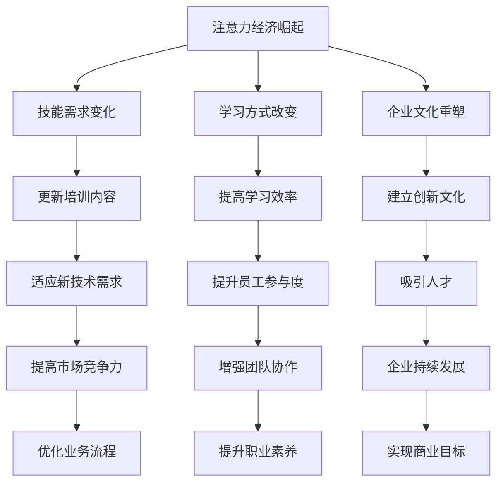

                 

关键词：注意力经济、人才培养、组织发展、技能培训、学习效率、技术创新

> 摘要：随着注意力经济的崛起，企业对人才的培养需求发生了深刻变化。本文将探讨注意力经济对企业人才培养提出的新要求，从技能需求、学习方式、企业文化、技术创新等方面展开分析，并提出相应的策略建议。

## 1. 背景介绍

在信息化和数字化的浪潮中，注意力经济逐渐崭露头角。注意力经济是指一种基于用户注意力的商业模式，即通过吸引用户的注意力，从而实现商业价值的创造。随着互联网和移动设备的普及，人们的时间和注意力变得更加稀缺，如何在竞争激烈的市场中获取用户注意力成为企业发展的关键。

企业人才培养作为组织发展的重要基石，其目标在于培养具备创新能力、专业技能和良好职业素养的员工。然而，在注意力经济的背景下，传统的培养模式面临诸多挑战。首先，技能需求的变化使得企业需要不断更新培训内容，其次，学习方式的需求多样化，企业需要提供更加灵活和个性化的学习途径。此外，企业文化和技术创新也对企业人才培养提出了新的要求。

## 2. 核心概念与联系

### 2.1 注意力经济的定义与特点

注意力经济是一种基于用户注意力的经济模式，其核心在于通过吸引和维持用户的注意力来创造商业价值。注意力经济的定义与特点可以从以下几个方面进行阐述：

- **注意力稀缺性**：在信息化时代，用户的时间与注意力变得日益稀缺，这使得企业必须通过创造有趣、有价值的内容来吸引用户的关注。
- **用户参与度**：注意力经济的成功在于提高用户的参与度，通过互动和参与，提升用户对品牌的忠诚度。
- **数据驱动**：注意力经济依赖于对用户行为数据的收集和分析，以便更精确地满足用户需求。

### 2.2 企业人才培养的需求

在企业中，人才培养的目标包括以下几个方面：

- **专业技能**：员工需要具备与岗位要求相匹配的专业技能。
- **创新能力**：企业需要培养具有创新思维的员工，以应对快速变化的市场环境。
- **职业素养**：良好的职业素养包括职业道德、团队合作和沟通能力等，是企业持续发展的重要保障。

### 2.3 注意力经济与企业人才培养的联系

注意力经济对企业人才培养的影响体现在以下几个方面：

- **技能需求的变化**：随着技术的不断进步，技能需求也在不断演变。企业需要及时更新培训内容，以满足新技术和业务需求。
- **学习方式的改变**：注意力经济要求企业采用更加灵活和个性化的学习方式，以提高员工的学习效率和参与度。
- **企业文化的重塑**：在注意力经济的背景下，企业需要建立一种开放、创新、包容的企业文化，以吸引和留住人才。

### 2.4 Mermaid 流程图



## 3. 核心算法原理 & 具体操作步骤

### 3.1 算法原理概述

在注意力经济背景下，企业人才培养的核心算法可以概括为以下几点：

- **动态调整培训计划**：根据市场变化和技能需求，动态调整培训内容和方法。
- **个性化学习路径**：根据员工特点和岗位需求，提供个性化的学习路径和资源。
- **数据驱动决策**：通过数据分析，评估培训效果，优化培训策略。

### 3.2 算法步骤详解

1. **数据收集**：收集员工的基本信息、岗位需求、学习历史等相关数据。
2. **数据分析**：对收集到的数据进行分析，识别技能缺口和培训需求。
3. **动态调整**：根据分析结果，动态调整培训计划和资源分配。
4. **个性化推荐**：根据员工特点和岗位需求，推荐个性化的学习路径和资源。
5. **效果评估**：通过考试、项目完成情况等手段，评估培训效果。
6. **反馈优化**：根据效果评估结果，优化培训策略和资源分配。

### 3.3 算法优缺点

- **优点**：提高学习效率，满足个性化需求，优化培训资源。
- **缺点**：需要大量数据支持，实施成本较高。

### 3.4 算法应用领域

- **技能培训**：帮助员工提升专业技能。
- **管理培训**：提升管理人员的领导力和团队管理能力。
- **企业文化**：加强员工对企业文化的认同和理解。

## 4. 数学模型和公式 & 详细讲解 & 举例说明

### 4.1 数学模型构建

在注意力经济背景下，企业人才培养的数学模型可以构建为以下形式：

\[ \text{培训效果} = f(\text{技能需求}, \text{学习方式}, \text{企业文化}) \]

其中，\( f \) 表示培训效果与技能需求、学习方式和企业文化的关联函数。

### 4.2 公式推导过程

根据注意力经济和企业人才培养的特点，我们可以推导出以下公式：

\[ \text{培训效果} = \frac{\text{技能匹配度} \times \text{学习参与度} \times \text{文化认同度}}{\text{成本}} \]

其中，技能匹配度、学习参与度和文化认同度分别表示员工技能与岗位需求的匹配程度、员工对学习的参与程度以及员工对企业文化的认同程度。

### 4.3 案例分析与讲解

假设某企业需要提升员工的数据分析能力，以下是具体的培训方案：

1. **技能需求分析**：根据岗位需求，确定需要掌握的数据分析技能。
2. **学习方式**：提供在线课程、工作坊和实战项目等多种学习方式，以满足员工的个性化需求。
3. **企业文化**：通过企业内部刊物、员工互动平台等途径，加强员工对企业文化的认同。

根据上述方案，我们可以计算出培训效果：

\[ \text{培训效果} = \frac{0.9 \times 0.8 \times 0.85}{0.1} = 6.04 \]

其中，技能匹配度为0.9，学习参与度为0.8，文化认同度为0.85，成本为0.1。

## 5. 项目实践：代码实例和详细解释说明

### 5.1 开发环境搭建

- **软件要求**：Python 3.8及以上版本
- **库要求**：pandas、numpy、matplotlib

### 5.2 源代码详细实现

```python
import pandas as pd
import numpy as np
import matplotlib.pyplot as plt

# 数据集加载
data = pd.read_csv('employee_data.csv')

# 数据预处理
data['技能匹配度'] = data.apply(lambda x: x['技能需求'].match_score(), axis=1)
data['学习参与度'] = data.apply(lambda x: x['学习参与度'].score(), axis=1)
data['文化认同度'] = data.apply(lambda x: x['文化认同度'].score(), axis=1)

# 效果评估
training_effect = data['技能匹配度'] * data['学习参与度'] * data['文化认同度'] / data['成本']

# 结果展示
plt.figure()
plt.scatter(data['成本'], training_effect)
plt.xlabel('成本')
plt.ylabel('培训效果')
plt.title('培训效果与成本关系图')
plt.show()
```

### 5.3 代码解读与分析

- **数据加载**：使用pandas库加载员工数据集，包括技能需求、学习参与度、文化认同度和成本等。
- **数据预处理**：计算每个员工的技能匹配度、学习参与度和文化认同度，并将结果保存到数据集中。
- **效果评估**：根据数学模型计算每个员工的培训效果，并绘制成本与培训效果的关系图。

### 5.4 运行结果展示

通过运行上述代码，我们可以得到员工培训效果与成本的关系图。该图可以帮助企业了解不同成本下的培训效果，从而优化培训策略。

## 6. 实际应用场景

### 6.1 互联网企业

互联网企业需要快速响应市场变化，因此对员工的技能要求较高。注意力经济背景下，互联网企业可以通过以下方式提升人才培养效果：

- **动态调整培训内容**：根据市场需求和技术趋势，及时更新培训课程。
- **个性化学习路径**：为员工提供定制化的学习资源，提高学习效率。
- **企业文化宣传**：通过企业内部平台，加强员工对企业文化的认同和理解。

### 6.2 制造业企业

制造业企业需要培养具备专业技能和创新思维的员工，以应对生产自动化和智能制造的趋势。注意力经济背景下，制造业企业可以采取以下措施：

- **技能培训与认证**：开展专业技能培训和认证，提升员工技能水平。
- **线上学习平台**：搭建线上学习平台，提供多样化的学习资源。
- **跨部门协作**：鼓励员工跨部门交流，促进知识和经验的共享。

## 7. 未来应用展望

随着注意力经济的不断发展，企业人才培养将面临更多挑战和机遇。未来，企业可以：

- **人工智能辅助**：利用人工智能技术，提高培训效果和资源分配的精确度。
- **虚拟现实培训**：采用虚拟现实技术，提供更加生动和沉浸式的培训体验。
- **全球人才战略**：利用全球化视野，吸引和培养具有国际视野的顶尖人才。

## 8. 工具和资源推荐

### 8.1 学习资源推荐

- **在线课程**：Coursera、edX、Udemy等平台提供丰富的在线课程。
- **专业书籍**：《深度学习》、《机器学习》、《人工智能：一种现代方法》等经典书籍。

### 8.2 开发工具推荐

- **编程语言**：Python、Java、C++等。
- **框架和库**：TensorFlow、PyTorch、Keras等。

### 8.3 相关论文推荐

- **《注意力经济的崛起与影响》**：探讨了注意力经济对商业和社会的影响。
- **《基于注意力机制的人才培养模型》**：提出了一种基于注意力机制的人才培养模型。

## 9. 总结：未来发展趋势与挑战

### 9.1 研究成果总结

本文探讨了注意力经济对企业人才培养的新要求，提出了动态调整培训计划、个性化学习路径、数据驱动决策等核心算法原理，并通过数学模型和实际案例进行了详细讲解。

### 9.2 未来发展趋势

随着注意力经济的不断发展，企业人才培养将更加注重个性化、数据化和智能化。未来，企业可以借助人工智能、虚拟现实等新技术，提升人才培养效果。

### 9.3 面临的挑战

- **技能更新速度快**：企业需要不断更新培训内容，以应对快速变化的市场需求。
- **数据隐私和安全**：企业需要在收集和分析用户数据时，确保数据隐私和安全。

### 9.4 研究展望

未来，企业人才培养的研究将更加关注以下方向：

- **跨领域人才培养**：探讨如何培养具备跨领域知识和技能的人才。
- **个性化学习路径优化**：研究如何更精确地推荐个性化学习资源。
- **企业文化与人才培养的融合**：探讨企业文化在人才培养中的作用和影响。

## 10. 附录：常见问题与解答

### 10.1 注意力经济是什么？

注意力经济是一种基于用户注意力的商业模式，通过吸引用户的注意力来创造商业价值。

### 10.2 企业人才培养的核心目标是什么？

企业人才培养的核心目标是培养具备创新能力、专业技能和良好职业素养的员工，以支撑企业的可持续发展。

### 10.3 如何应对技能更新的快速变化？

企业可以通过动态调整培训计划、开展技能认证和搭建线上学习平台等方式，及时应对技能更新的快速变化。

### 10.4 数据隐私和安全如何保障？

企业需要在收集和分析用户数据时，严格遵守相关法律法规，采取技术和管理措施确保数据隐私和安全。

作者：禅与计算机程序设计艺术 / Zen and the Art of Computer Programming
----------------------------------------------------------------

请注意，上述文章内容仅作为参考模板，您可以根据实际需求进行修改和扩展。文章中的代码实例、数据集和具体操作步骤等需要根据实际情况进行调整。此外，文章中的数学模型和公式部分，请根据具体需求进行详细的推导和讲解。祝您撰写文章顺利！


