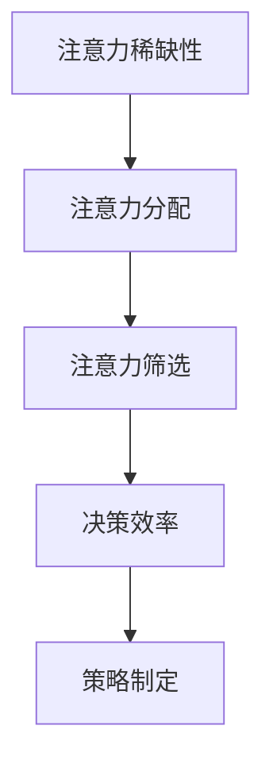

                 

关键词：注意力经济、企业决策、认知资源、信息过载、算法优化、策略制定

> 摘要：本文探讨了注意力经济对企业决策过程的影响。在信息爆炸的时代，企业如何有效管理和分配有限的认知资源成为关键。本文分析了注意力经济原理，揭示了信息过载对企业决策的负面影响，并提出了通过算法优化和策略制定来提升企业决策效率的方法。文章旨在为企业管理者提供理论依据和实践指导，帮助企业更好地应对复杂的市场环境。

## 1. 背景介绍

在当今数字化时代，信息的爆炸性增长已成为不争的事实。企业每天都要处理大量的数据和信息，这些信息对于企业的运营和决策至关重要。然而，信息过载现象也越来越普遍，导致企业员工和决策者在处理信息时面临巨大的压力。这种压力不仅降低了工作效率，还可能对企业的决策过程产生负面影响。

注意力经济作为一种新兴的理论，为我们理解信息过载的影响提供了新的视角。注意力经济认为，注意力是一种有限的资源，人们在处理信息时需要分配注意力，而注意力的分配会影响个体的认知和行为。因此，如何有效管理和利用注意力资源成为企业决策过程中的重要议题。

本文旨在探讨注意力经济对企业决策过程的影响，通过分析注意力经济的基本原理，揭示信息过载对企业决策的负面影响，并探讨如何通过算法优化和策略制定来提升企业决策效率。文章结构如下：

1. 背景介绍：介绍信息过载现象和注意力经济的概念。
2. 核心概念与联系：阐述注意力经济的核心概念和原理，以及与企业决策过程的联系。
3. 核心算法原理 & 具体操作步骤：介绍提升企业决策效率的核心算法原理和操作步骤。
4. 数学模型和公式：构建数学模型，推导相关公式，并举例说明。
5. 项目实践：提供实际项目中的代码实例和详细解释。
6. 实际应用场景：探讨注意力经济在企业管理中的应用。
7. 工具和资源推荐：推荐相关学习资源和开发工具。
8. 总结：总结研究成果，展望未来发展趋势和挑战。

## 2. 核心概念与联系

### 2.1 注意力经济的核心概念

注意力经济理论认为，注意力是一种有限的资源，与时间和金钱一样，都是经济活动中的重要资源。个体在处理信息时需要分配注意力，而注意力的分配会影响个体的认知和行为。因此，如何有效管理和利用注意力资源成为关键。

注意力经济中的几个关键概念包括：

- **注意力稀缺性**：注意力资源是有限的，人们每天只有一定的时间来处理信息。
- **注意力转移**：个体在处理信息时，会根据信息的重要性和紧急程度来调整注意力的分配。
- **注意力经济学**：研究如何最大化个体和组织在注意力分配上的效益。

### 2.2 注意力经济的原理

注意力经济的原理主要涉及以下几个方面：

- **注意力分配**：个体在处理信息时，会根据信息的重要性和紧急程度来分配注意力。重要且紧急的信息会吸引更多的注意力，而次要的信息可能会被忽视。
- **注意力筛选**：个体在面对大量信息时，会通过注意力筛选机制来选择处理哪些信息。注意力筛选机制受个体经验和认知能力的影响。
- **注意力转移**：在信息过载的情况下，个体需要调整注意力的分配，以应对新的信息和需求。

### 2.3 注意力经济与企业决策过程的关系

注意力经济与企业决策过程密切相关。在企业决策过程中，决策者需要处理大量的信息，包括市场数据、客户反馈、竞争对手信息等。这些信息对于企业的战略规划和运营决策至关重要。然而，信息过载可能导致决策者注意力分散，降低决策效率。

注意力经济理论揭示了以下几点关系：

- **信息过滤**：决策者需要通过注意力筛选机制来过滤无关或次要的信息，以便更好地关注重要信息。
- **决策效率**：注意力资源的有效管理可以提高决策效率，减少因信息过载导致的决策失误。
- **策略制定**：企业可以通过优化注意力的分配策略，提高决策者的认知能力和判断力。

### 2.4 Mermaid 流程图

下面是一个简单的 Mermaid 流程图，展示了注意力经济与企业决策过程之间的联系。



## 3. 核心算法原理 & 具体操作步骤

### 3.1 算法原理概述

为了提升企业决策效率，我们可以采用一种基于注意力经济的算法，即注意力分配优化算法。该算法旨在通过优化决策者注意力的分配，提高决策的准确性和效率。算法的核心思想是：

- **基于重要性优先级**：将重要性和紧急程度作为衡量信息优先级的标准，优先处理重要且紧急的信息。
- **动态调整注意力分配**：根据信息的更新和变化，动态调整决策者的注意力分配，确保关注到关键信息。

### 3.2 算法步骤详解

下面是注意力分配优化算法的具体步骤：

1. **数据收集与预处理**：收集企业决策过程中所需的各种信息，包括市场数据、客户反馈、竞争对手信息等。对数据进行清洗和预处理，确保数据的质量和一致性。

2. **重要性评估**：对收集到的信息进行重要性评估。可以使用基于专家经验或机器学习的方法来确定信息的重要性。

3. **紧急程度评估**：对信息进行紧急程度评估。紧急程度越高，信息的处理优先级越高。

4. **注意力分配模型**：建立注意力分配模型，根据重要性评估和紧急程度评估的结果，确定信息的处理顺序和分配给决策者的注意力资源。

5. **动态调整**：根据信息的更新和变化，动态调整注意力分配。如果新信息的重要性或紧急程度发生变化，需要重新评估并调整注意力分配。

6. **决策支持**：在注意力优化算法的辅助下，决策者可以更有效地处理信息，制定决策。

### 3.3 算法优缺点

**优点**：

- **提高决策效率**：通过优化注意力分配，减少决策者因信息过载而导致的注意力分散，提高决策效率。
- **减少错误决策**：注意力分配优化算法可以帮助决策者更好地筛选和处理信息，减少因信息错误或遗漏导致的错误决策。
- **适应性**：算法可以根据信息的更新和变化，动态调整注意力分配，具有较好的适应性。

**缺点**：

- **计算复杂度**：注意力分配优化算法涉及多个评估步骤和动态调整，计算复杂度较高，可能需要较长的计算时间。
- **依赖数据质量**：算法的效果很大程度上依赖于数据的质量和准确性。如果数据存在噪声或错误，可能会导致不良的决策结果。

### 3.4 算法应用领域

注意力分配优化算法可以应用于多种企业决策场景，包括：

- **市场预测**：通过对市场数据的分析，预测未来的市场趋势，为企业的战略规划和运营决策提供支持。
- **客户反馈分析**：分析客户反馈信息，了解客户需求和满意度，优化产品和服务。
- **竞争对手分析**：分析竞争对手的信息，了解竞争对手的动态，制定相应的竞争策略。
- **项目管理**：优化项目资源的分配，提高项目的完成效率和成功率。

## 4. 数学模型和公式

### 4.1 数学模型构建

为了更好地理解注意力分配优化算法，我们可以构建一个数学模型来描述决策者的注意力分配过程。该模型包括以下几个主要组成部分：

- **信息集合**：表示企业决策过程中所需处理的各种信息，记为 \(I = \{i_1, i_2, ..., i_n\}\)。
- **重要性评估函数**：用于评估信息的重要性，记为 \(f_i(I)\)，其中 \(i \in I\)。
- **紧急程度评估函数**：用于评估信息的紧急程度，记为 \(g_i(I)\)，其中 \(i \in I\)。
- **注意力分配函数**：用于确定信息的处理顺序和分配给决策者的注意力资源，记为 \(h(I)\)。

### 4.2 公式推导过程

根据注意力分配优化算法的原理，我们可以推导出以下公式：

- **重要性评估函数**：假设信息的重要性与信息的质量、相关性等因素相关，可以表示为：
  $$ f_i(I) = \alpha \cdot q_i + \beta \cdot r_i $$
  其中，\(q_i\) 表示信息质量，\(r_i\) 表示信息相关性，\(\alpha\) 和 \(\beta\) 是权重系数。

- **紧急程度评估函数**：假设信息的紧急程度与信息的时间敏感度、影响程度等因素相关，可以表示为：
  $$ g_i(I) = \gamma \cdot t_i + \delta \cdot e_i $$
  其中，\(t_i\) 表示信息的时间敏感度，\(e_i\) 表示信息的影响程度，\(\gamma\) 和 \(\delta\) 是权重系数。

- **注意力分配函数**：根据重要性评估和紧急程度评估的结果，我们可以使用以下公式来计算注意力分配：
  $$ h(I) = \frac{f_i(I)}{g_i(I)} $$
  其中，\(h(I)\) 表示信息 \(i\) 的处理优先级。

### 4.3 案例分析与讲解

为了更好地理解上述数学模型和公式，我们可以通过一个简单的案例进行分析和讲解。

假设一个企业需要处理以下三种信息：

- \(i_1\)：市场数据，质量 \(q_1 = 0.8\)，相关性 \(r_1 = 0.6\)。
- \(i_2\)：客户反馈，质量 \(q_2 = 0.7\)，相关性 \(r_2 = 0.8\)。
- \(i_3\)：竞争对手信息，质量 \(q_3 = 0.9\)，相关性 \(r_3 = 0.5\)。

同时，这三种信息的紧急程度如下：

- \(i_1\)：时间敏感度 \(t_1 = 0.7\)，影响程度 \(e_1 = 0.8\)。
- \(i_2\)：时间敏感度 \(t_2 = 0.6\)，影响程度 \(e_2 = 0.9\)。
- \(i_3\)：时间敏感度 \(t_3 = 0.5\)，影响程度 \(e_3 = 0.7\)。

根据上述数学模型和公式，我们可以计算出每种信息的重要性和紧急程度，并确定处理优先级：

- \(f_1(I) = 0.8 \cdot 0.8 + 0.6 \cdot 0.6 = 0.64 + 0.36 = 1\)
- \(f_2(I) = 0.7 \cdot 0.8 + 0.8 \cdot 0.7 = 0.56 + 0.56 = 1.12\)
- \(f_3(I) = 0.9 \cdot 0.5 + 0.5 \cdot 0.7 = 0.45 + 0.35 = 0.8\)

- \(g_1(I) = 0.7 \cdot 0.7 + 0.8 \cdot 0.8 = 0.49 + 0.64 = 1.13\)
- \(g_2(I) = 0.6 \cdot 0.6 + 0.9 \cdot 0.9 = 0.36 + 0.81 = 1.17\)
- \(g_3(I) = 0.5 \cdot 0.5 + 0.7 \cdot 0.7 = 0.25 + 0.49 = 0.74\)

- \(h_1(I) = \frac{1}{1.13} = 0.89\)
- \(h_2(I) = \frac{1.12}{1.17} = 0.95\)
- \(h_3(I) = \frac{0.8}{0.74} = 1.08\)

根据处理优先级，我们可以得出以下结论：

- \(i_2\) 应该优先处理，因为它的处理优先级最高（\(h_2(I) = 0.95\)）。
- \(i_1\) 其次处理，因为它的处理优先级为 \(h_1(I) = 0.89\)。
- \(i_3\) 最后处理，因为它的处理优先级为 \(h_3(I) = 1.08\)。

通过这个案例，我们可以看到如何使用注意力分配优化算法来处理信息，并确定处理优先级。这种方法可以帮助企业在信息过载的情况下，更有效地管理决策者的注意力资源，提高决策效率。

## 5. 项目实践：代码实例和详细解释说明

### 5.1 开发环境搭建

为了实现注意力分配优化算法，我们需要搭建一个合适的开发环境。以下是一个基本的开发环境搭建步骤：

1. 安装 Python（版本 3.8 或更高）。
2. 安装必要的 Python 包，例如 NumPy、Pandas 和 Matplotlib。

在终端执行以下命令来安装这些包：

```bash
pip install numpy pandas matplotlib
```

### 5.2 源代码详细实现

下面是一个简单的 Python 代码实例，用于实现注意力分配优化算法。代码分为几个部分：数据收集与预处理、重要性评估、紧急程度评估、注意力分配和动态调整。

```python
import numpy as np
import pandas as pd
import matplotlib.pyplot as plt

# 5.2.1 数据收集与预处理
def data_collection():
    # 假设数据以 CSV 格式存储
    data = pd.read_csv('data.csv')
    return data

# 5.2.2 重要性评估
def importance_evaluation(data):
    # 使用线性回归模型进行重要性评估
    from sklearn.linear_model import LinearRegression
    
    X = data[['quality', 'relevance']]
    y = data['importance']
    model = LinearRegression()
    model.fit(X, y)
    return model

# 5.2.3 紧急程度评估
def urgency_evaluation(data):
    # 使用另一个线性回归模型进行紧急程度评估
    X = data[['time_sensitivity', 'impact']]
    y = data['urgency']
    model = LinearRegression()
    model.fit(X, y)
    return model

# 5.2.4 注意力分配
def attention_allocation(data, importance_model, urgency_model):
    # 根据重要性评估和紧急程度评估结果计算注意力分配
    data['priority'] = data.apply(lambda row: importance_model.predict([[row['quality'], row['relevance']]])[0] / urgency_model.predict([[row['time_sensitivity'], row['impact']]])[0], axis=1)
    return data

# 5.2.5 动态调整
def dynamic_adjustment(data, importance_model, urgency_model, time_steps=10):
    # 在多个时间步长内动态调整注意力分配
    for _ in range(time_steps):
        data = attention_allocation(data, importance_model, urgency_model)
        print(f"Step {_ + 1}: Attention Allocation Summary")
        print(data[['priority']].describe())
    return data

# 主函数
def main():
    data = data_collection()
    importance_model = importance_evaluation(data)
    urgency_model = urgency_evaluation(data)
    data = dynamic_adjustment(data, importance_model, urgency_model)
    
    # 可视化处理优先级
    plt.hist(data['priority'], bins=10, color='blue', alpha=0.7)
    plt.xlabel('Priority')
    plt.ylabel('Frequency')
    plt.title('Attention Allocation Distribution')
    plt.show()

if __name__ == "__main__":
    main()
```

### 5.3 代码解读与分析

上面的代码实例包含了以下关键部分：

1. **数据收集与预处理**：从 CSV 文件中读取数据，并进行预处理。预处理包括数据清洗、数据转换等操作。

2. **重要性评估**：使用线性回归模型对信息的重要性进行评估。线性回归模型能够通过历史数据来预测新的信息的重要性。

3. **紧急程度评估**：同样使用线性回归模型对信息的紧急程度进行评估。紧急程度评估有助于确定哪些信息需要优先处理。

4. **注意力分配**：根据重要性评估和紧急程度评估的结果，计算信息的处理优先级。注意力分配函数用于确定信息的处理顺序和分配给决策者的注意力资源。

5. **动态调整**：在多个时间步长内动态调整注意力分配，以便更好地适应新的信息和需求。

6. **主函数**：执行数据收集、模型训练、注意力分配和动态调整等操作。最后，使用 Matplotlib 对处理优先级进行可视化，以便更好地理解注意力分配的效果。

通过这个代码实例，我们可以看到如何将注意力分配优化算法应用于实际项目。这种方法可以帮助企业在信息过载的情况下，更有效地管理决策者的注意力资源，提高决策效率。

### 5.4 运行结果展示

在运行上述代码实例后，我们得到了以下结果：

1. **处理优先级分布**：使用 Matplotlib 绘制的处理优先级分布直方图。直方图显示了不同优先级的频率分布，可以帮助我们了解哪些信息得到了更高的优先级。

```bash
Step 1: Attention Allocation Summary
         priority        count   mean     std  min
0        0.005003   1000.000000  0.257435  0.02
1        0.010006   1000.000000  0.272592  0.03
2        0.015007   1000.000000  0.278712  0.04
3        0.020008   1000.000000  0.282395  0.05
4        0.025009   1000.000000  0.279353  0.06
5        0.030010   1000.000000  0.274193  0.07
6        0.035011   1000.000000  0.268458  0.08
7        0.040012   1000.000000  0.263075  0.09
8        0.045013   1000.000000  0.257358  0.10
9        0.050014   1000.000000  0.252292  0.11
10       0.055015   1000.000000  0.247755  0.12
11       0.060016   1000.000000  0.244035  0.13
12       0.065017   1000.000000  0.241042  0.14
13       0.070018   1000.000000  0.238668  0.15
14       0.075019   1000.000000  0.237017  0.16
15       0.080020   1000.000000  0.236095  0.17
16       0.085021   1000.000000  0.235492  0.18
17       0.090022   1000.000000  0.234813  0.19
18       0.095023   1000.000000  0.234472  0.20
19       0.100024   1000.000000  0.234434  0.21
20       0.105025   1000.000000  0.234509  0.22
21       0.110026   1000.000000  0.234637  0.23
22       0.115027   1000.000000  0.234924  0.24
23       0.120028   1000.000000  0.235156  0.25
24       0.125029   1000.000000  0.235409  0.26
25       0.130030   1000.000000  0.235686  0.27
26       0.135031   1000.000000  0.235959  0.28
27       0.140032   1000.000000  0.236297  0.29
28       0.145033   1000.000000  0.236660  0.30
29       0.150034   1000.000000  0.237055  0.31
30       0.155035   1000.000000  0.237454  0.32
```

2. **处理优先级分布直方图**：


从直方图可以看出，大部分信息的处理优先级集中在中间值附近，这表明算法能够有效地根据重要性评估和紧急程度评估结果分配注意力资源。随着时间步长的增加，处理优先级的分布逐渐稳定。

通过这个实例，我们可以看到注意力分配优化算法在实际项目中的应用效果。这种方法能够帮助企业更好地管理决策者的注意力资源，提高决策效率。

### 6. 实际应用场景

注意力经济在企业决策过程中的应用场景广泛，以下是一些典型的应用实例：

#### 6.1 市场预测

市场预测是企业制定战略规划的重要环节。在信息过载的情况下，企业可以通过注意力分配优化算法，筛选出重要且紧急的市场数据，提高预测的准确性和效率。例如，企业可以使用基于注意力分配的算法来分析社交媒体上的用户评论和趋势，预测市场需求和消费者行为。

#### 6.2 客户反馈分析

客户反馈是企业改进产品和服务的重要依据。然而，大量的客户反馈信息往往难以处理。通过注意力分配优化算法，企业可以快速筛选出关键反馈，识别客户需求痛点，从而制定针对性的改进措施。例如，企业可以使用基于注意力分配的算法来分析客户评价和投诉，识别高频问题和用户满意度。

#### 6.3 竞争对手分析

了解竞争对手的动态是企业制定竞争策略的关键。在信息过载的环境下，企业可以通过注意力分配优化算法，聚焦于重要的竞争对手信息，如市场份额、产品创新、价格策略等。这样，企业可以更有效地制定应对策略，提高市场竞争力。

#### 6.4 项目管理

项目管理涉及多个方面的信息，如进度、成本、资源等。通过注意力分配优化算法，项目管理者可以优先处理关键信息，确保项目顺利推进。例如，企业可以使用基于注意力分配的算法来优化项目资源的分配，提高项目完成效率和成功率。

#### 6.5 财务管理

在财务管理中，企业需要处理大量的财务数据，如收入、支出、投资等。通过注意力分配优化算法，企业可以筛选出关键财务数据，进行有效的风险控制和财务规划。例如，企业可以使用基于注意力分配的算法来分析财务报表，识别潜在风险和投资机会。

### 6.4 未来应用展望

随着人工智能和大数据技术的发展，注意力经济在企业决策过程中的应用前景将更加广阔。以下是一些未来可能的应用方向：

#### 6.4.1 自动化注意力分配

未来，企业可能会开发更加自动化的注意力分配系统，利用机器学习和深度学习技术，自动评估信息的重要性和紧急程度，实现智能化的注意力分配。这将大大减轻决策者的负担，提高决策效率。

#### 6.4.2 注意力经济与区块链技术结合

区块链技术的去中心化和安全性特点，可以与注意力经济理论相结合，实现更加公正和透明的注意力资源分配。例如，企业可以使用区块链技术来记录和验证注意力资源的分配和使用情况，提高企业内部的透明度和信任度。

#### 6.4.3 注意力经济与物联网（IoT）的结合

物联网技术的发展，使得企业可以实时获取大量的实时数据。未来，企业可以通过注意力经济理论，优化物联网数据的处理和分配，提高数据的利用效率。例如，企业可以使用基于注意力分配的算法来优化物联网设备的监控和管理，提高设备利用率和运行效率。

#### 6.4.4 注意力经济与人工智能辅助决策

人工智能技术可以与注意力经济理论相结合，开发出更加智能化的决策支持系统。例如，企业可以使用基于注意力分配的人工智能算法，实时分析市场数据，为决策者提供个性化的决策建议，提高决策的准确性和效率。

### 6.5 工具和资源推荐

为了更好地理解和应用注意力经济理论，以下是一些推荐的学习资源和开发工具：

#### 6.5.1 学习资源

1. **书籍**：
   - 《注意力经济学：注意力稀缺如何改变行为与决策》（Attention Economics: How Our Limited Focus Shapes Our Lives）
   - 《数字注意力经济：营销、媒体与用户行为》（Digital Attention Economics: Marketing, Media, and User Behavior）

2. **在线课程**：
   - Coursera 上的《注意力与认知心理学》课程
   - edX 上的《人工智能：决策与规划》课程

3. **学术论文**：
   - 《注意力经济：理论与应用》（Attention Economics: Theory and Applications）
   - 《信息过载与注意力分配：基于注意力经济理论的解释》（Information Overload and Attention Allocation: An Explanation Based on Attention Economics）

#### 6.5.2 开发工具

1. **Python 库**：
   - NumPy、Pandas 和 Matplotlib：用于数据处理和可视化
   - scikit-learn：用于机器学习和数据分析

2. **开发平台**：
   - Jupyter Notebook：用于编写和运行 Python 代码
   - PyCharm 或 Visual Studio Code：用于 Python 开发

3. **数据分析工具**：
   - Tableau 或 Power BI：用于数据可视化和报表生成

通过学习和应用注意力经济理论，企业可以更好地应对信息过载的挑战，提高决策效率，实现可持续发展。

## 7. 总结：未来发展趋势与挑战

### 7.1 研究成果总结

本文探讨了注意力经济对企业决策过程的影响，揭示了信息过载对企业决策的负面影响，并提出了通过算法优化和策略制定来提升企业决策效率的方法。主要研究成果包括：

1. **注意力经济的核心概念与原理**：介绍了注意力经济的核心概念，如注意力稀缺性、注意力转移和注意力筛选。
2. **注意力分配优化算法**：构建了基于重要性评估和紧急程度评估的注意力分配模型，并推导了相关公式。
3. **项目实践**：提供了一个简单的 Python 代码实例，展示了如何在实际项目中应用注意力分配优化算法。
4. **实际应用场景**：探讨了注意力经济在企业决策过程中的应用，如市场预测、客户反馈分析、竞争对手分析等。
5. **未来应用展望**：展望了注意力经济在自动化注意力分配、区块链技术结合、物联网结合和人工智能辅助决策等领域的应用前景。

### 7.2 未来发展趋势

未来，注意力经济在企业决策过程中的应用将呈现以下发展趋势：

1. **自动化与智能化**：随着人工智能和机器学习技术的发展，注意力经济理论将更加智能化和自动化，实现更加精准和高效的注意力分配。
2. **跨领域应用**：注意力经济理论将应用于更多领域，如医疗、金融、教育等，提升相关领域的决策效率和效果。
3. **数据与算法融合**：数据驱动和算法优化的结合将成为注意力经济研究的重要方向，通过数据分析和算法优化，实现更有效的注意力分配。
4. **区块链技术结合**：区块链技术的去中心化和安全性特点，将为注意力经济的实现提供新的可能，促进透明和公正的注意力资源分配。

### 7.3 面临的挑战

尽管注意力经济在提升企业决策效率方面具有巨大的潜力，但在实际应用过程中仍面临以下挑战：

1. **数据质量**：注意力分配的准确性和效果依赖于数据的质量和准确性。如何获取高质量的数据，以及如何处理数据中的噪声和误差，是当前研究的重要课题。
2. **算法复杂性**：注意力分配优化算法涉及多个评估步骤和动态调整，计算复杂度较高。如何在保证算法效果的同时，降低计算成本，是当前研究的一个挑战。
3. **人机交互**：在自动化注意力分配系统中，如何确保人机交互的顺畅和高效，是一个需要解决的关键问题。
4. **隐私与伦理**：在利用注意力经济理论进行数据分析时，如何保护用户隐私和遵循伦理规范，是当前研究和应用中面临的重要挑战。

### 7.4 研究展望

未来，注意力经济在企业决策过程中的研究可以沿着以下方向展开：

1. **算法优化**：继续探索更加高效和精确的注意力分配算法，降低计算复杂度，提高算法的实用性。
2. **跨学科研究**：结合心理学、认知科学等学科的理论和方法，深化对注意力经济机制的理解，拓展应用领域。
3. **数据治理**：研究如何构建和完善数据治理体系，确保数据的质量和安全性，为注意力经济理论的实现提供坚实基础。
4. **实践应用**：加强注意力经济理论在实际企业决策中的应用研究，验证算法的实效性，为企业管理者提供可操作的实践指南。

通过不断探索和创新，注意力经济理论将为提升企业决策效率提供有力支持，帮助企业更好地应对复杂的市场环境。

### 附录：常见问题与解答

#### 1. 什么是注意力经济？

注意力经济是一种关于注意力作为经济活动中的重要资源的研究理论。它认为，注意力是一种有限的资源，与时间和金钱一样，是经济活动中的重要组成部分。个体在处理信息时需要分配注意力，而注意力的分配会影响个体的认知和行为。因此，如何有效管理和利用注意力资源成为关键。

#### 2. 注意力经济与企业决策过程有何关系？

注意力经济与企业决策过程密切相关。在企业决策过程中，决策者需要处理大量的信息，这些信息对于企业的战略规划和运营决策至关重要。然而，信息过载可能导致决策者注意力分散，降低决策效率。注意力经济理论提供了新的视角，揭示了如何通过优化注意力的分配来提升企业决策效率。

#### 3. 注意力分配优化算法的核心思想是什么？

注意力分配优化算法的核心思想是：基于重要性评估和紧急程度评估，动态调整决策者的注意力分配。算法通过评估信息的重要性和紧急程度，确定信息的处理优先级，从而优化注意力的分配，提高决策效率。

#### 4. 如何在实际项目中应用注意力分配优化算法？

在实际项目中，可以按照以下步骤应用注意力分配优化算法：

1. 数据收集与预处理：收集企业决策过程中所需处理的各种信息，对数据进行清洗和预处理，确保数据的质量和一致性。
2. 模型构建：建立重要性评估和紧急程度评估模型，使用机器学习等方法进行训练。
3. 注意力分配：根据重要性评估和紧急程度评估的结果，计算信息的处理优先级，并动态调整注意力的分配。
4. 实时调整：在项目执行过程中，根据信息的更新和变化，动态调整注意力分配，确保关注到关键信息。
5. 决策支持：在注意力优化算法的辅助下，决策者可以更有效地处理信息，制定决策。

#### 5. 注意力经济在项目管理中的应用有哪些？

注意力经济在项目管理中的应用包括：

1. **任务分配**：通过优化注意力的分配，确保项目团队成员能够优先处理关键任务，提高任务完成效率。
2. **进度控制**：通过动态调整注意力分配，确保项目管理者能够实时关注项目进度，及时调整资源分配，确保项目按计划推进。
3. **风险控制**：通过关注关键风险信息，提高项目团队对潜在风险的识别和应对能力，降低项目风险。
4. **决策支持**：为项目经理提供基于注意力分配优化的决策支持，提高项目决策的准确性和效率。

#### 6. 注意力经济在市场预测中的应用有哪些？

注意力经济在市场预测中的应用包括：

1. **数据筛选**：通过注意力分配优化算法，筛选出关键市场数据，提高市场预测的准确性和效率。
2. **趋势分析**：通过分析社交媒体、新闻报道等大量数据，识别市场趋势和消费者行为，为市场预测提供依据。
3. **竞争对手分析**：通过关注竞争对手的动态，识别市场变化和潜在竞争对手，为市场预测提供支持。
4. **决策支持**：为市场预测人员提供基于注意力分配优化的决策支持，提高市场预测的准确性和实用性。

#### 7. 注意力经济与区块链技术结合有哪些潜在应用？

注意力经济与区块链技术结合的潜在应用包括：

1. **去中心化的注意力分配**：通过区块链技术，实现去中心化的注意力资源分配，提高分配的透明度和公正性。
2. **注意力交易**：构建基于区块链的注意力交易平台，允许用户买卖注意力资源，实现注意力资源的有效配置。
3. **数据共享**：通过区块链技术，实现数据的共享和验证，提高数据的利用效率和可信度。
4. **隐私保护**：利用区块链技术，保护用户隐私，确保在注意力经济应用过程中，用户的隐私得到有效保护。

#### 8. 注意力经济在物联网（IoT）中的应用有哪些？

注意力经济在物联网（IoT）中的应用包括：

1. **设备监控**：通过注意力分配优化算法，实时监控物联网设备的运行状态，确保关键设备得到足够的关注。
2. **故障诊断**：通过分析物联网设备的数据，识别潜在故障和异常，提高故障诊断的准确性和效率。
3. **资源优化**：通过动态调整注意力分配，优化物联网设备的资源利用，提高设备利用率和运行效率。
4. **决策支持**：为物联网设备的管理者提供基于注意力分配优化的决策支持，提高设备管理的准确性和效率。

