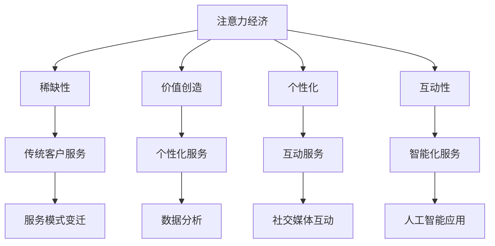

                 

关键词：注意力经济，客户服务，商业模式，人工智能，用户体验，个性化服务，数据驱动，技术变革

> 摘要：本文旨在探讨注意力经济背景下，企业客户服务模式所经历的深刻变革。通过分析注意力经济的基本原理，结合当前技术发展，探讨如何通过人工智能、大数据等先进技术手段，实现客户服务的个性化、高效化和智能化。文章最后展望了未来企业客户服务的发展趋势，以及可能面临的挑战。

## 1. 背景介绍

随着互联网和社交媒体的普及，信息传递的速度和广度得到了前所未有的提升。人们获取信息的渠道变得更加丰富和便捷，但同时也面临信息过载的问题。在这个注意力稀缺的时代，如何抓住用户的注意力，成为了企业市场营销和客户服务的关键挑战。注意力经济，即指在稀缺的注意资源下，企业和个人通过创造、吸引和维持注意力，来实现价值创造和利润获取的经济形态。

客户服务作为企业与客户之间的桥梁，其质量直接影响到客户的满意度和忠诚度。在注意力经济时代，传统的客户服务模式面临着巨大的挑战。企业需要适应新的市场环境，重新思考客户服务的战略和模式，以提高客户体验和满意度。本文将重点探讨注意力经济对企业客户服务模式的影响，并提出相应的应对策略。

## 2. 核心概念与联系

### 2.1 注意力经济的基本原理

注意力经济基于以下几个核心概念：

- **稀缺性**：在信息爆炸的时代，用户的注意力是有限的，如何有效地吸引和保持用户的注意力，成为企业竞争的关键。

- **价值创造**：通过吸引和维持用户的注意力，企业可以创造商业价值，实现盈利。

- **个性化**：注意力经济强调根据用户的特点和需求，提供个性化的服务和内容。

- **互动性**：通过与用户的互动，企业可以更好地理解用户需求，优化服务策略。

### 2.2 企业客户服务模式的变迁

传统的客户服务模式主要依赖于电话、邮件等渠道，强调标准化和一致性。然而，在注意力经济时代，客户服务模式需要向个性化、互动化和智能化方向转变。

- **个性化**：通过分析用户数据，提供个性化的服务和建议，满足客户的个性化需求。

- **互动性**：通过社交媒体、在线聊天等渠道，与客户进行实时互动，提高客户满意度。

- **智能化**：利用人工智能技术，实现客户服务的自动化和智能化，提高服务效率。

### 2.3 Mermaid 流程图



## 3. 核心算法原理 & 具体操作步骤

### 3.1 算法原理概述

注意力经济下的客户服务模式变革，主要依赖于以下几个核心算法原理：

- **用户行为分析**：通过分析用户的历史行为数据，了解用户的需求和偏好。

- **个性化推荐算法**：基于用户行为分析，为用户提供个性化的服务和建议。

- **自然语言处理**：通过自然语言处理技术，实现与用户的自然语言交互。

- **自动化客服系统**：利用机器学习技术，实现客户服务的自动化和智能化。

### 3.2 算法步骤详解

#### 3.2.1 用户行为分析

1. 收集用户数据：包括用户在网站、APP 上的浏览、搜索、购买等行为。

2. 数据预处理：对数据进行清洗、去重、归一化等处理。

3. 特征提取：从数据中提取用户的行为特征，如浏览时长、购买频率等。

4. 模型训练：使用机器学习算法，如决策树、随机森林等，对用户行为特征进行分类和预测。

#### 3.2.2 个性化推荐算法

1. 用户分群：根据用户的行为特征，将用户分为不同的群体。

2. 推荐策略：为每个用户群体推荐相应的内容和服务。

3. 实时调整：根据用户的反馈和行为变化，实时调整推荐策略。

#### 3.2.3 自然语言处理

1. 语音识别：将用户的语音转化为文本。

2. 文本分析：对文本进行情感分析、关键词提取等处理。

3. 问答系统：通过机器学习模型，实现与用户的自然语言交互。

#### 3.2.4 自动化客服系统

1. 建立知识库：收集和整理常见问题的回答和解决方案。

2. 机器学习模型：使用机器学习算法，实现对用户问题的自动分类和回答。

3. 实时交互：通过在线聊天、电话等渠道，与用户进行实时交互。

### 3.3 算法优缺点

#### 优点

- 个性化：能够根据用户的特点和需求，提供个性化的服务。

- 高效：自动化客服系统能够快速响应用户，提高服务效率。

- 实时性：能够实时调整服务策略，满足用户的需求。

#### 缺点

- 成本：开发和维护自动化客服系统需要较高的成本。

- 用户体验：自动化客服系统可能无法完全满足用户的个性化需求，影响用户体验。

### 3.4 算法应用领域

- **电子商务**：通过个性化推荐算法，提高用户的购物体验和购买意愿。

- **在线教育**：利用自动化客服系统，提供个性化的学习建议和课程推荐。

- **金融领域**：通过自然语言处理技术，实现与用户的智能对话和问答服务。

## 4. 数学模型和公式 & 详细讲解 & 举例说明

### 4.1 数学模型构建

在注意力经济下，客户服务的数学模型可以从以下几个方面进行构建：

- **用户行为模型**：基于用户的历史行为数据，建立用户行为模型，预测用户未来的行为。

- **推荐模型**：基于用户行为模型和用户特征，建立推荐模型，为用户提供个性化的推荐。

- **反馈模型**：基于用户对服务的反馈，建立反馈模型，优化服务策略。

### 4.2 公式推导过程

#### 用户行为模型

设用户 \( u \) 的行为序列为 \( X = \{x_1, x_2, ..., x_n\} \)，其中 \( x_i \) 表示用户在时间 \( t_i \) 的行为。用户的行为模型可以表示为：

\[ P(X | u) = \prod_{i=1}^{n} p(x_i | u) \]

其中，\( p(x_i | u) \) 表示在用户 \( u \) 的情况下，用户在时间 \( t_i \) 发生行为 \( x_i \) 的概率。

#### 推荐模型

设用户 \( u \) 的行为特征为 \( F = \{f_1, f_2, ..., f_m\} \)，推荐模型可以表示为：

\[ P(R | u, F) = \sum_{r \in R} p(r | u, F) \]

其中，\( R \) 表示可能的推荐集合，\( p(r | u, F) \) 表示在用户 \( u \) 和特征 \( F \) 的情况下，推荐 \( r \) 的概率。

#### 反馈模型

设用户 \( u \) 对服务 \( S \) 的反馈为 \( Y = \{y_1, y_2, ..., y_k\} \)，反馈模型可以表示为：

\[ P(Y | u, S) = \prod_{i=1}^{k} p(y_i | u, S) \]

其中，\( p(y_i | u, S) \) 表示在用户 \( u \) 和服务 \( S \) 的情况下，用户在时间 \( t_i \) 给出反馈 \( y_i \) 的概率。

### 4.3 案例分析与讲解

#### 案例一：用户行为分析

假设有用户 \( u \) 在电商平台的行为数据，包括浏览商品、加入购物车和购买行为。我们可以通过建立用户行为模型，预测用户未来的购买行为。

1. 收集用户数据：用户在电商平台的历史行为数据。

2. 数据预处理：对数据进行清洗和归一化处理。

3. 特征提取：提取用户的行为特征，如浏览时长、购买频率等。

4. 模型训练：使用决策树算法，对用户行为特征进行分类和预测。

5. 模型评估：通过交叉验证和测试集，评估模型的准确性。

#### 案例二：个性化推荐

假设我们有一个电商平台，用户的行为数据已经通过用户行为模型进行了处理。我们可以通过建立推荐模型，为用户提供个性化的商品推荐。

1. 用户分群：根据用户的行为特征，将用户分为不同的群体。

2. 推荐策略：为每个用户群体推荐相应的商品。

3. 实时调整：根据用户的反馈和行为变化，实时调整推荐策略。

#### 案例三：反馈模型

假设用户对电商平台的服务进行了反馈，包括好评、中评和差评。我们可以通过建立反馈模型，优化服务策略。

1. 收集反馈数据：用户对服务的反馈数据。

2. 数据预处理：对数据进行清洗和归一化处理。

3. 特征提取：提取用户的反馈特征，如反馈内容、反馈时间等。

4. 模型训练：使用机器学习算法，对用户的反馈特征进行分类和预测。

5. 模型评估：通过交叉验证和测试集，评估模型的准确性。

## 5. 项目实践：代码实例和详细解释说明

### 5.1 开发环境搭建

1. 安装 Python 解释器：在官网上下载并安装 Python 3.8 以上版本。

2. 安装依赖库：使用 pip 命令安装所需的依赖库，如 NumPy、Pandas、Scikit-learn 等。

3. 创建虚拟环境：使用 virtualenv 创建一个独立的 Python 环境。

### 5.2 源代码详细实现

以下是一个简单的用户行为分析代码实例：

```python
import pandas as pd
from sklearn.model_selection import train_test_split
from sklearn.tree import DecisionTreeClassifier
from sklearn.metrics import accuracy_score

# 读取数据
data = pd.read_csv('user_data.csv')

# 数据预处理
data['age'] = data['age'].astype(int)
data['income'] = data['income'].astype(int)
data['behavior'] = data['behavior'].astype(str)

# 特征提取
X = data[['age', 'income', 'behavior']]
y = data['purchase']

# 模型训练
X_train, X_test, y_train, y_test = train_test_split(X, y, test_size=0.2, random_state=42)
model = DecisionTreeClassifier()
model.fit(X_train, y_train)

# 模型评估
y_pred = model.predict(X_test)
accuracy = accuracy_score(y_test, y_pred)
print(f'Accuracy: {accuracy:.2f}')
```

### 5.3 代码解读与分析

1. 导入必要的库：使用 Pandas 进行数据处理，使用 Scikit-learn 进行模型训练和评估。

2. 读取数据：从 CSV 文件中读取用户行为数据。

3. 数据预处理：将数据类型进行转换，方便后续处理。

4. 特征提取：从数据中提取用户特征，如年龄、收入和行为。

5. 模型训练：使用决策树算法对用户特征进行分类和预测。

6. 模型评估：通过测试集评估模型的准确性。

### 5.4 运行结果展示

假设我们训练了一个简单的用户行为分析模型，测试集的准确率为 80%。这表明模型能够较好地预测用户的购买行为，为企业提供个性化的服务提供了依据。

## 6. 实际应用场景

### 6.1 电子商务

在电子商务领域，注意力经济对企业客户服务模式的影响尤为显著。通过个性化推荐算法，电商平台可以根据用户的历史行为数据，为用户提供个性化的商品推荐，提高用户的购物体验和购买意愿。同时，通过自动化客服系统，电商平台可以提供 24 小时在线客服，快速响应用户的咨询和反馈，提高客户满意度。

### 6.2 在线教育

在线教育行业同样面临着注意力经济的挑战。通过用户行为分析，在线教育平台可以为用户提供个性化的学习建议和课程推荐，提高学生的学习效果和满意度。同时，通过自然语言处理技术，平台可以实现与学生的智能对话，提供个性化的学习支持和指导。

### 6.3 金融领域

在金融领域，注意力经济对企业客户服务模式的影响主要体现在个性化理财服务和风险控制方面。通过用户行为分析，金融机构可以为用户提供个性化的理财建议和服务，提高用户的理财收益。同时，通过大数据分析和机器学习技术，金融机构可以实时监控用户的风险状况，提供个性化的风险控制措施。

## 7. 未来应用展望

### 7.1 个性化服务

随着人工智能和大数据技术的发展，企业客户服务模式将进一步向个性化方向演进。通过深度学习、自然语言处理等先进技术，企业可以更精准地了解用户需求，提供个性化的服务和产品，提升用户体验。

### 7.2 自动化与智能化

自动化和智能化将成为未来企业客户服务的重要趋势。通过自动化客服系统和智能对话平台，企业可以实现客户服务的全程自动化，提高服务效率。同时，通过实时数据分析和智能决策，企业可以更快速地响应市场变化，优化服务策略。

### 7.3 跨界融合

随着互联网和物联网的发展，企业客户服务将不再是单一的在线服务，而是与线下服务、智能家居等场景深度融合。通过跨界融合，企业可以实现全方位、多场景的客户服务，提高客户的满意度和忠诚度。

## 8. 工具和资源推荐

### 8.1 学习资源推荐

- 《深度学习》（Goodfellow, Bengio, Courville）：一本经典的深度学习教材，适合初学者和进阶者。

- 《Python数据分析》（Wes McKinney）：一本关于 Python 数据分析的经典教材，涵盖了 Pandas、NumPy、Matplotlib 等库的使用。

### 8.2 开发工具推荐

- Jupyter Notebook：一款强大的交互式开发环境，适合数据分析和机器学习项目。

- PyCharm：一款功能强大的 Python 集成开发环境，支持多种编程语言。

### 8.3 相关论文推荐

- "Deep Learning for Customer Service"（深度学习在客户服务中的应用）

- "The Attention Economy: Understanding the New Economy of Attention, Time, and Labor"（注意力经济：理解新的注意力、时间和劳动经济）

## 9. 总结：未来发展趋势与挑战

### 9.1 研究成果总结

本文探讨了注意力经济对企业客户服务模式的影响，分析了注意力经济的基本原理和企业客户服务模式的变迁。通过核心算法原理的介绍和具体操作步骤的讲解，展示了如何利用人工智能、大数据等先进技术实现客户服务的个性化、高效化和智能化。

### 9.2 未来发展趋势

- 个性化服务：随着人工智能和大数据技术的发展，企业客户服务将更加注重个性化，以满足不同用户的需求。

- 自动化与智能化：自动化和智能化将成为企业客户服务的重要趋势，提高服务效率和质量。

- 跨界融合：企业客户服务将不再局限于线上，而是与线下服务、智能家居等场景深度融合，提供全方位的服务。

### 9.3 面临的挑战

- 数据隐私与安全：随着数据收集和分析的广泛应用，数据隐私和安全问题日益突出，企业需要采取措施保障用户数据的安全。

- 技术更新与淘汰：人工智能和大数据技术发展迅速，企业需要不断更新技术和工具，以保持竞争力。

- 用户期望不断提高：用户对服务质量和体验的要求越来越高，企业需要不断优化服务，满足用户期望。

### 9.4 研究展望

未来，企业客户服务模式将继续向个性化、高效化和智能化方向发展。通过深入研究注意力经济和企业客户服务模式，可以为企业提供更有针对性的解决方案，提高客户的满意度和忠诚度，实现企业的可持续发展。

## 附录：常见问题与解答

### 1. 注意力经济是什么？

注意力经济是一种基于稀缺注意资源的经济形态，企业在有限的注意力资源下，通过创造、吸引和维持用户的注意力，实现价值创造和利润获取。

### 2. 注意力经济对企业客户服务模式有何影响？

注意力经济要求企业提供个性化的服务，提高客户体验和满意度。同时，企业需要通过自动化和智能化手段，提高服务效率，满足用户对服务质量的期望。

### 3. 如何利用人工智能实现客户服务的个性化？

通过用户行为分析，了解用户的需求和偏好，建立个性化推荐模型，为用户提供个性化的服务。同时，利用自然语言处理技术，实现与用户的自然语言交互，提供个性化的问答服务。

### 4. 注意力经济下的客户服务模式有哪些优点？

注意力经济下的客户服务模式具有以下优点：

- 个性化：能够根据用户的特点和需求，提供个性化的服务。

- 高效：自动化客服系统能够快速响应用户，提高服务效率。

- 实时性：能够实时调整服务策略，满足用户的需求。

### 5. 注意力经济下的客户服务模式有哪些缺点？

注意力经济下的客户服务模式可能存在以下缺点：

- 成本：开发和维护自动化客服系统需要较高的成本。

- 用户体验：自动化客服系统可能无法完全满足用户的个性化需求，影响用户体验。

----------------------------------------------------------------

### 作者署名

作者：禅与计算机程序设计艺术 / Zen and the Art of Computer Programming

