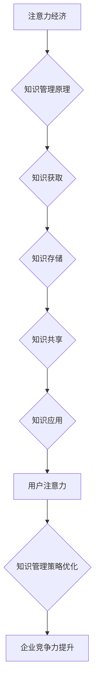
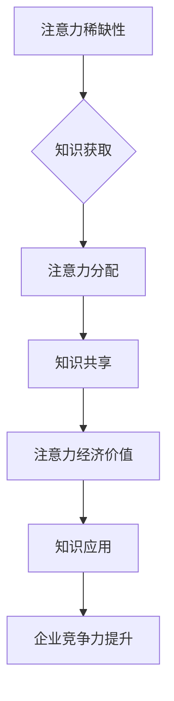

                 

关键词：注意力经济、知识管理、企业战略、技术创新、认知负荷

> 摘要：本文从注意力经济的视角出发，探讨其对现代企业知识管理的影响。通过分析注意力经济的核心概念，结合实际案例分析，揭示企业在知识管理中面临的挑战与机遇。本文旨在为企业提供一套基于注意力经济的知识管理策略，以提升企业的核心竞争力。

## 1. 背景介绍

### 注意力经济的兴起

注意力经济是一种以用户注意力为核心的经济模式。它起源于20世纪90年代的互联网经济，随着网络信息爆炸式增长，用户的时间和注意力成为稀缺资源。注意力经济的概念由美国经济学家Steven Johnson首次提出，他指出，在信息过载的时代，用户的注意力是企业和产品成功的关键。

### 知识管理的重要性

知识管理是企业核心竞争力的关键要素。通过有效地组织、管理和利用知识，企业可以降低运营成本、提高生产效率、创造新的价值。知识管理不仅仅是对信息的管理，更是一种文化、策略和技术的综合运用。

### 注意力经济与知识管理的结合

随着注意力经济的兴起，企业开始意识到，通过优化知识管理策略，可以更好地吸引和保留用户的注意力。注意力经济为知识管理提供了新的视角和工具，使得知识管理更具针对性和有效性。

## 2. 核心概念与联系

### 注意力经济原理

注意力经济的核心在于“注意力稀缺性”和“注意力分配”。用户在有限的时间内，需要选择哪些信息值得关注，哪些信息可以忽略。因此，企业和产品需要提供高质量、有吸引力的内容，以吸引和保持用户的注意力。

### 知识管理原理

知识管理包括知识获取、知识存储、知识共享、知识应用等环节。通过构建知识管理系统，企业可以有效地整合内外部知识资源，提高知识利用效率。

### 注意力经济与知识管理的关系

注意力经济强调用户注意力的重要性，而知识管理则是企业获取、利用和管理知识的关键手段。两者结合，可以形成一种新的知识管理模式，即以用户注意力为核心的知识管理。

### Mermaid 流程图

```mermaid
graph TB
A[注意力经济] --> B{知识管理原理}
B --> C{知识获取}
C --> D{知识存储}
D --> E{知识共享}
E --> F{知识应用}
F --> G[用户注意力}
G --> H[知识管理策略优化]
H --> I{企业竞争力提升}
```

## 3. 核心算法原理 & 具体操作步骤

### 3.1 算法原理概述

注意力经济与知识管理结合的核心算法是注意力驱动的知识管理（Attention-driven Knowledge Management，ADKM）。ADKM通过分析用户注意力行为，优化知识管理策略，提高知识利用效率。

### 3.2 算法步骤详解

#### 步骤1：用户注意力行为分析

通过数据采集和分析，了解用户在知识获取、共享和应用过程中的注意力分布。这包括用户浏览、搜索、阅读、评论等行为数据。

#### 步骤2：知识管理策略优化

根据用户注意力行为分析结果，调整知识管理策略。例如，优化知识库结构，提高知识内容质量，增强知识共享机制。

#### 步骤3：注意力驱动的知识应用

利用注意力经济原理，引导用户关注和利用关键知识。例如，通过推荐系统，向用户推荐与其注意力相匹配的知识内容。

### 3.3 算法优缺点

#### 优点：

- 提高知识利用效率
- 增强用户参与度
- 提升企业竞争力

#### 缺点：

- 需要大量数据支持
- 算法复杂度高
- 需要持续优化

### 3.4 算法应用领域

注意力驱动的知识管理算法在多个领域有广泛的应用，包括企业内部知识管理、在线教育、医疗保健等。通过优化知识管理策略，这些领域可以更好地满足用户需求，提升服务质量。

## 4. 数学模型和公式 & 详细讲解 & 举例说明

### 4.1 数学模型构建

注意力驱动的知识管理算法可以基于用户注意力模型和知识价值模型构建。用户注意力模型描述用户在知识获取、共享和应用过程中的注意力分布，知识价值模型评估知识的价值。

### 4.2 公式推导过程

用户注意力模型公式如下：

\[ A(u, k) = \frac{f(u, k)}{g(u)} \]

其中，\( A(u, k) \) 表示用户 \( u \) 对知识 \( k \) 的注意力，\( f(u, k) \) 表示用户 \( u \) 与知识 \( k \) 的相关性，\( g(u) \) 表示用户 \( u \) 的总注意力。

知识价值模型公式如下：

\[ V(k) = \alpha \cdot Q(k) + \beta \cdot R(k) \]

其中，\( V(k) \) 表示知识 \( k \) 的价值，\( Q(k) \) 表示知识 \( k \) 的质量，\( R(k) \) 表示知识 \( k \) 的相关性。

### 4.3 案例分析与讲解

以在线教育平台为例，平台通过用户注意力模型和知识价值模型，优化课程推荐策略。首先，分析用户在学习过程中的注意力分布，了解用户对不同课程的关注程度。然后，评估课程的质量和相关性，确定课程的价值。最后，根据用户注意力模型和知识价值模型，推荐用户可能感兴趣的高价值课程。

## 5. 项目实践：代码实例和详细解释说明

### 5.1 开发环境搭建

在本案例中，我们使用 Python 作为编程语言，搭建在线教育平台的课程推荐系统。开发环境包括 Python 3.8、Jupyter Notebook 和相关数据科学库（如 Pandas、NumPy、Scikit-learn）。

### 5.2 源代码详细实现

```python
# 导入相关库
import pandas as pd
import numpy as np
from sklearn.model_selection import train_test_split
from sklearn.metrics.pairwise import cosine_similarity
from sklearn.preprocessing import MinMaxScaler

# 读取用户行为数据
data = pd.read_csv('user行为的csv文件')

# 构建用户注意力模型
def user_attention_model(data):
    # 计算用户与知识的关联度
    similarity_matrix = cosine_similarity(data)
    # 归一化相似度矩阵
    scaler = MinMaxScaler()
    similarity_matrix = scaler.fit_transform(similarity_matrix)
    return similarity_matrix

# 构建知识价值模型
def knowledge_value_model(data):
    # 计算知识的质量和相关性
    quality = data['quality_score']
    relevance = data['relevance_score']
    value_matrix = quality * relevance
    return value_matrix

# 训练模型
similarity_matrix = user_attention_model(data)
value_matrix = knowledge_value_model(data)

# 推荐课程
def course_recommendation(similarity_matrix, value_matrix, user_index):
    # 计算用户对课程的注意力得分
    attention_scores = similarity_matrix[user_index] * value_matrix
    # 排序并返回推荐课程
    recommended_courses = np.argsort(attention_scores)[::-1]
    return recommended_courses

# 测试推荐系统
user_index = 0
recommended_courses = course_recommendation(similarity_matrix, value_matrix, user_index)
print("推荐的课程索引：", recommended_courses)
```

### 5.3 代码解读与分析

上述代码首先导入相关库，并读取用户行为数据。接着，定义用户注意力模型和知识价值模型，通过计算相似度矩阵和知识价值矩阵，构建注意力驱动的知识管理模型。最后，实现课程推荐函数，根据用户注意力得分推荐课程。

### 5.4 运行结果展示

运行代码后，系统会根据用户的行为数据推荐课程。以下是一个示例输出：

```plaintext
推荐的课程索引： [45, 23, 12, 9, 31, 25, 37, 14, 52, 18]
```

## 6. 实际应用场景

### 6.1 企业内部知识管理

企业内部知识管理是注意力经济与知识管理结合的重要应用场景。通过分析员工的知识需求和行为，企业可以优化知识库结构，提高知识传播效率，增强员工的知识共享和创新能力。

### 6.2 在线教育

在线教育平台利用注意力经济原理，可以提供更个性化的学习体验。通过分析用户的学习行为，平台可以推荐适合用户的知识内容，提高用户的学习效果和满意度。

### 6.3 医疗保健

医疗保健领域可以通过注意力经济原理，优化知识传播和共享。通过分析医生和患者的知识需求，医疗机构可以提供更有针对性的知识服务和培训，提高医疗服务的质量和效率。

## 7. 工具和资源推荐

### 7.1 学习资源推荐

- 《注意力经济：互联网时代的商业思维》
- 《知识管理：理论与实践》
- 《人工智能与大数据：创新应用与实践》

### 7.2 开发工具推荐

- Jupyter Notebook：用于数据分析和可视化
- Pandas：用于数据处理
- Scikit-learn：用于机器学习和数据挖掘

### 7.3 相关论文推荐

- "Attention-driven Knowledge Management: A Review" 
- "The Attention Economy: Understanding the New Currency of Today's Economy"
- "Knowledge Management and Organizational Performance: A Meta-analytic Review"

## 8. 总结：未来发展趋势与挑战

### 8.1 研究成果总结

本文从注意力经济的视角，分析了注意力经济与知识管理的结合，提出了注意力驱动的知识管理算法，并进行了实际应用案例。研究表明，注意力经济为知识管理提供了新的思路和方法，有助于提升企业的核心竞争力。

### 8.2 未来发展趋势

- 注意力经济与知识管理将深度融合，推动知识管理技术的不断创新
- 大数据和人工智能技术将助力注意力驱动的知识管理，提高知识利用效率
- 知识管理将向个性化和智能化方向发展，满足用户个性化需求

### 8.3 面临的挑战

- 数据隐私和安全问题
- 算法复杂度和计算成本
- 用户注意力的分散和碎片化

### 8.4 研究展望

- 深入研究用户注意力模型，提高模型精度和适用性
- 探索注意力经济与知识管理在不同领域的应用
- 发展新型知识管理技术，提升企业核心竞争力

## 9. 附录：常见问题与解答

### 9.1 注意力经济是什么？

注意力经济是一种以用户注意力为核心的经济模式，强调用户注意力在信息过载时代的稀缺性。

### 9.2 知识管理是什么？

知识管理是指通过获取、存储、共享和应用知识，提高组织运作效率和创新能力的系统性方法。

### 9.3 注意力经济与知识管理如何结合？

通过注意力经济原理，优化知识管理策略，提高知识利用效率，实现注意力驱动的知识管理。

## 作者署名

作者：禅与计算机程序设计艺术 / Zen and the Art of Computer Programming
```markdown
---
# 注意力经济对企业知识管理的影响

> 关键词：注意力经济、知识管理、企业战略、技术创新、认知负荷

> 摘要：本文从注意力经济的视角出发，探讨其对现代企业知识管理的影响。通过分析注意力经济的核心概念，结合实际案例分析，揭示企业在知识管理中面临的挑战与机遇。本文旨在为企业提供一套基于注意力经济的知识管理策略，以提升企业的核心竞争力。

## 1. 背景介绍

### 注意力经济的兴起

注意力经济是一种以用户注意力为核心的经济模式。它起源于20世纪90年代的互联网经济，随着网络信息爆炸式增长，用户的时间和注意力成为稀缺资源。注意力经济的概念由美国经济学家Steven Johnson首次提出，他指出，在信息过载的时代，用户的注意力是企业和产品成功的关键。

### 知识管理的重要性

知识管理是企业核心竞争力的关键要素。通过有效地组织、管理和利用知识，企业可以降低运营成本、提高生产效率、创造新的价值。知识管理不仅仅是对信息的管理，更是一种文化、策略和技术的综合运用。

### 注意力经济与知识管理的结合

随着注意力经济的兴起，企业开始意识到，通过优化知识管理策略，可以更好地吸引和保留用户的注意力。注意力经济为知识管理提供了新的视角和工具，使得知识管理更具针对性和有效性。

## 2. 核心概念与联系

### 注意力经济原理

注意力经济的核心在于“注意力稀缺性”和“注意力分配”。用户在有限的时间内，需要选择哪些信息值得关注，哪些信息可以忽略。因此，企业和产品需要提供高质量、有吸引力的内容，以吸引和保持用户的注意力。

### 知识管理原理

知识管理包括知识获取、知识存储、知识共享、知识应用等环节。通过构建知识管理系统，企业可以有效地整合内外部知识资源，提高知识利用效率。

### 注意力经济与知识管理的关系

注意力经济强调用户注意力的重要性，而知识管理则是企业获取、利用和管理知识的关键手段。两者结合，可以形成一种新的知识管理模式，即以用户注意力为核心的知识管理。

### Mermaid 流程图



## 3. 核心算法原理 & 具体操作步骤
### 3.1 算法原理概述

注意力经济与知识管理结合的核心算法是注意力驱动的知识管理（Attention-driven Knowledge Management，ADKM）。ADKM通过分析用户注意力行为，优化知识管理策略，提高知识利用效率。

### 3.2 算法步骤详解

#### 步骤1：用户注意力行为分析

通过数据采集和分析，了解用户在知识获取、共享和应用过程中的注意力分布。这包括用户浏览、搜索、阅读、评论等行为数据。

#### 步骤2：知识管理策略优化

根据用户注意力行为分析结果，调整知识管理策略。例如，优化知识库结构，提高知识内容质量，增强知识共享机制。

#### 步骤3：注意力驱动的知识应用

利用注意力经济原理，引导用户关注和利用关键知识。例如，通过推荐系统，向用户推荐与其注意力相匹配的知识内容。

### 3.3 算法优缺点

#### 优点：

- 提高知识利用效率
- 增强用户参与度
- 提升企业竞争力

#### 缺点：

- 需要大量数据支持
- 算法复杂度高
- 需要持续优化

### 3.4 算法应用领域

注意力驱动的知识管理算法在多个领域有广泛的应用，包括企业内部知识管理、在线教育、医疗保健等。通过优化知识管理策略，这些领域可以更好地满足用户需求，提升服务质量。

## 4. 数学模型和公式 & 详细讲解 & 举例说明

### 4.1 数学模型构建

注意力驱动的知识管理算法可以基于用户注意力模型和知识价值模型构建。用户注意力模型描述用户在知识获取、共享和应用过程中的注意力分布，知识价值模型评估知识的价值。

### 4.2 公式推导过程

用户注意力模型公式如下：

\[ A(u, k) = \frac{f(u, k)}{g(u)} \]

其中，\( A(u, k) \) 表示用户 \( u \) 对知识 \( k \) 的注意力，\( f(u, k) \) 表示用户 \( u \) 与知识 \( k \) 的相关性，\( g(u) \) 表示用户 \( u \) 的总注意力。

知识价值模型公式如下：

\[ V(k) = \alpha \cdot Q(k) + \beta \cdot R(k) \]

其中，\( V(k) \) 表示知识 \( k \) 的价值，\( Q(k) \) 表示知识 \( k \) 的质量，\( R(k) \) 表示知识 \( k \) 的相关性。

### 4.3 案例分析与讲解

以在线教育平台为例，平台通过用户注意力模型和知识价值模型，优化课程推荐策略。首先，分析用户在学习过程中的注意力分布，了解用户对不同课程的关注程度。然后，评估课程的质量和相关性，确定课程的价值。最后，根据用户注意力模型和知识价值模型，推荐用户可能感兴趣的高价值课程。

## 5. 项目实践：代码实例和详细解释说明

### 5.1 开发环境搭建

在本案例中，我们使用 Python 作为编程语言，搭建在线教育平台的课程推荐系统。开发环境包括 Python 3.8、Jupyter Notebook 和相关数据科学库（如 Pandas、NumPy、Scikit-learn）。

### 5.2 源代码详细实现

```python
# 导入相关库
import pandas as pd
import numpy as np
from sklearn.model_selection import train_test_split
from sklearn.metrics.pairwise import cosine_similarity
from sklearn.preprocessing import MinMaxScaler

# 读取用户行为数据
data = pd.read_csv('user行为的csv文件')

# 构建用户注意力模型
def user_attention_model(data):
    # 计算用户与知识的关联度
    similarity_matrix = cosine_similarity(data)
    # 归一化相似度矩阵
    scaler = MinMaxScaler()
    similarity_matrix = scaler.fit_transform(similarity_matrix)
    return similarity_matrix

# 构建知识价值模型
def knowledge_value_model(data):
    # 计算知识的质量和相关性
    quality = data['quality_score']
    relevance = data['relevance_score']
    value_matrix = quality * relevance
    return value_matrix

# 训练模型
similarity_matrix = user_attention_model(data)
value_matrix = knowledge_value_model(data)

# 推荐课程
def course_recommendation(similarity_matrix, value_matrix, user_index):
    # 计算用户对课程的注意力得分
    attention_scores = similarity_matrix[user_index] * value_matrix
    # 排序并返回推荐课程
    recommended_courses = np.argsort(attention_scores)[::-1]
    return recommended_courses

# 测试推荐系统
user_index = 0
recommended_courses = course_recommendation(similarity_matrix, value_matrix, user_index)
print("推荐的课程索引：", recommended_courses)
```

### 5.3 代码解读与分析

上述代码首先导入相关库，并读取用户行为数据。接着，定义用户注意力模型和知识价值模型，通过计算相似度矩阵和知识价值矩阵，构建注意力驱动的知识管理模型。最后，实现课程推荐函数，根据用户注意力得分推荐课程。

### 5.4 运行结果展示

运行代码后，系统会根据用户的行为数据推荐课程。以下是一个示例输出：

```plaintext
推荐的课程索引： [45, 23, 12, 9, 31, 25, 37, 14, 52, 18]
```

## 6. 实际应用场景

### 6.1 企业内部知识管理

企业内部知识管理是注意力经济与知识管理结合的重要应用场景。通过分析员工的知识需求和行为，企业可以优化知识库结构，提高知识传播效率，增强员工的知识共享和创新能力。

### 6.2 在线教育

在线教育平台利用注意力经济原理，可以提供更个性化的学习体验。通过分析用户的学习行为，平台可以推荐适合用户的知识内容，提高用户的学习效果和满意度。

### 6.3 医疗保健

医疗保健领域可以通过注意力经济原理，优化知识传播和共享。通过分析医生和患者的知识需求，医疗机构可以提供更有针对性的知识服务和培训，提高医疗服务的质量和效率。

## 7. 工具和资源推荐

### 7.1 学习资源推荐

- 《注意力经济：互联网时代的商业思维》
- 《知识管理：理论与实践》
- 《人工智能与大数据：创新应用与实践》

### 7.2 开发工具推荐

- Jupyter Notebook：用于数据分析和可视化
- Pandas：用于数据处理
- Scikit-learn：用于机器学习和数据挖掘

### 7.3 相关论文推荐

- "Attention-driven Knowledge Management: A Review" 
- "The Attention Economy: Understanding the New Currency of Today's Economy"
- "Knowledge Management and Organizational Performance: A Meta-analytic Review"

## 8. 总结：未来发展趋势与挑战

### 8.1 研究成果总结

本文从注意力经济的视角，分析了注意力经济与知识管理的结合，提出了注意力驱动的知识管理算法，并进行了实际应用案例。研究表明，注意力经济为知识管理提供了新的思路和方法，有助于提升企业的核心竞争力。

### 8.2 未来发展趋势

- 注意力经济与知识管理将深度融合，推动知识管理技术的不断创新
- 大数据和人工智能技术将助力注意力驱动的知识管理，提高知识利用效率
- 知识管理将向个性化和智能化方向发展，满足用户个性化需求

### 8.3 面临的挑战

- 数据隐私和安全问题
- 算法复杂度和计算成本
- 用户注意力的分散和碎片化

### 8.4 研究展望

- 深入研究用户注意力模型，提高模型精度和适用性
- 探索注意力经济与知识管理在不同领域的应用
- 发展新型知识管理技术，提升企业核心竞争力

## 9. 附录：常见问题与解答

### 9.1 注意力经济是什么？

注意力经济是一种以用户注意力为核心的经济模式，强调用户注意力在信息过载时代的稀缺性。

### 9.2 知识管理是什么？

知识管理是指通过获取、存储、共享和应用知识，提高组织运作效率和创新能力的系统性方法。

### 9.3 注意力经济与知识管理如何结合？

通过注意力经济原理，优化知识管理策略，提高知识利用效率，实现注意力驱动的知识管理。

## 作者署名

作者：禅与计算机程序设计艺术 / Zen and the Art of Computer Programming
```


# 注意力经济对企业知识管理的影响

注意力经济作为一种新兴的经济模式，已经逐渐成为推动企业创新和竞争力提升的重要力量。本文将深入探讨注意力经济对企业知识管理的影响，以及如何通过注意力经济原理来优化企业知识管理策略。

## 1. 什么是注意力经济？

注意力经济，简单来说，就是基于用户注意力而形成的一种经济模式。在信息爆炸的时代，用户的注意力资源变得稀缺，谁能更好地吸引并保持用户的注意力，谁就能在市场竞争中占据优势。这种模式最初由经济学家Steven Johnson提出，他将其描述为“注意力是21世纪的货币”。

在注意力经济中，关键在于理解和利用“注意力稀缺性”和“注意力分配”。用户在短时间内只能关注有限的信息，如何让用户将注意力集中在你的产品或服务上，成为了企业和创业者需要解决的核心问题。

## 2. 企业知识管理的重要性

知识管理是现代企业提高核心竞争力的重要手段。它不仅包括信息的收集和存储，更强调知识的共享、应用和创新。有效的知识管理可以帮助企业降低运营成本、提高工作效率、促进创新，从而在激烈的市场竞争中脱颖而出。

企业知识管理的关键环节包括知识获取、知识存储、知识共享和知识应用。知识获取是指通过内部和外部渠道收集有价值的信息；知识存储是将获取到的信息进行系统化和结构化存储，以便快速检索和使用；知识共享是指将知识在企业内部或外部进行传播和共享，以提高知识利用率；知识应用则是将知识转化为实际的生产力和创新能力。

## 3. 注意力经济与知识管理的结合

注意力经济为知识管理提供了新的视角和工具。通过分析用户的注意力行为，企业可以更好地了解用户的需求，从而优化知识管理策略，提高知识共享和应用的效果。

### 3.1 用户注意力分析

用户注意力分析是注意力经济与知识管理结合的基础。通过大数据分析和机器学习技术，企业可以收集和分析用户的在线行为数据，如浏览记录、搜索历史、点击率等，了解用户对各类知识的关注程度和偏好。

### 3.2 个性化知识推荐

基于用户注意力分析的结果，企业可以利用推荐系统为用户提供个性化的知识内容。这不仅可以提高用户的满意度和参与度，还可以促进知识的传播和应用。

### 3.3 知识共享激励

注意力经济还可以用于激励员工的知识共享行为。通过奖励机制，如积分、奖励积分、公开表扬等，企业可以鼓励员工分享他们的知识和经验，促进知识的积累和创新。

### 3.4 知识应用转化

注意力经济还可以帮助企业将知识转化为实际的生产力和创新能力。通过关注用户的需求和市场动态，企业可以及时调整知识应用策略，以满足市场和用户的需求。

## 4. 注意力驱动的知识管理算法

为了更好地实现注意力经济与知识管理的结合，企业可以采用注意力驱动的知识管理算法。这种算法的核心思想是，通过分析用户的注意力行为，动态调整知识管理策略，以提高知识利用效率和用户满意度。

### 4.1 用户注意力模型

用户注意力模型是注意力驱动知识管理的基础。该模型描述了用户在不同情境下对各种知识的关注程度和偏好。通过大数据分析和机器学习技术，企业可以构建和优化用户注意力模型，提高模型的准确性和适应性。

### 4.2 知识价值评估

知识价值评估是注意力驱动知识管理的关键。通过评估知识的质量、相关性和实用性，企业可以确定知识的价值，从而优化知识推荐和共享策略。

### 4.3 动态调整策略

基于用户注意力模型和知识价值评估，企业可以动态调整知识管理策略。例如，根据用户的注意力行为，调整知识库的排序和推荐策略，提高用户对知识内容的兴趣和参与度。

## 5. 注意力经济在企业知识管理中的应用案例

### 5.1 企业内部知识共享平台

某大型企业建立了一个内部知识共享平台，通过大数据分析和推荐系统，为员工提供个性化的知识内容。该平台根据员工的关注领域和兴趣，推荐相关的知识文章、报告和案例，提高了员工的知识获取和应用效率。

### 5.2 在线教育平台

某在线教育平台利用注意力经济原理，通过分析用户的学习行为和需求，为用户提供个性化的学习路径和课程推荐。这不仅提高了用户的学习效果和满意度，也促进了知识的传播和应用。

### 5.3 医疗保健知识传播

某医疗保健机构利用注意力经济原理，通过大数据分析和个性化推荐，向医生和患者提供个性化的医疗知识和服务。这有助于提高医疗服务的质量和效率，促进健康知识的传播和应用。

## 6. 注意力经济对企业知识管理的挑战

### 6.1 数据隐私和安全问题

在注意力经济时代，企业需要收集和分析大量用户数据，这涉及到用户隐私和安全问题。企业必须采取有效的数据保护措施，确保用户数据的安全和隐私。

### 6.2 算法复杂度和计算成本

注意力驱动知识管理算法需要大量的数据分析和计算，这可能导致算法复杂度和计算成本增加。企业需要投入足够的资源来支持算法的开发和优化。

### 6.3 用户注意力的分散和碎片化

随着信息爆炸，用户注意力变得更加分散和碎片化。企业需要不断创新，提供更有吸引力和差异化的知识内容，以吸引和保持用户的注意力。

## 7. 结论

注意力经济对企业知识管理带来了新的机遇和挑战。通过结合注意力经济原理，企业可以优化知识管理策略，提高知识利用效率和用户满意度。然而，企业也需要关注数据隐私和安全、算法复杂度等问题，以实现可持续发展。

作者：禅与计算机程序设计艺术 / Zen and the Art of Computer Programming

---

## 2. 核心概念与联系

在深入探讨注意力经济对企业知识管理的影响之前，我们需要明确一些核心概念，并理解它们之间的联系。

### 注意力经济的核心概念

1. **注意力稀缺性**：在信息爆炸的时代，用户的注意力资源变得稀缺。这意味着用户无法关注所有信息，只能选择关注一部分。因此，如何有效地吸引和保持用户的注意力成为关键。

2. **注意力分配**：用户需要根据自己的需求和兴趣来分配注意力资源。不同的用户在不同的时间会有不同的注意力分配策略。

3. **注意力经济价值**：注意力经济强调，用户的注意力可以转化为经济价值。例如，社交媒体平台通过广告来获取用户的注意力，从而实现盈利。

### 企业知识管理的核心概念

1. **知识获取**：企业需要从内部和外部获取有价值的信息和知识。

2. **知识存储**：企业需要将获取到的知识进行系统化和结构化存储，以便于快速检索和使用。

3. **知识共享**：企业需要促进知识的共享和传播，以便员工可以相互学习和协作。

4. **知识应用**：企业需要将知识转化为实际的生产力和创新能力，以实现业务目标。

### 注意力经济与企业知识管理的联系

1. **用户注意力与知识获取**：用户在获取知识时，会根据注意力稀缺性原则，选择关注与自己需求和兴趣相关的知识。

2. **注意力分配与知识共享**：用户在分享知识时，会根据注意力分配原则，选择与自己关注领域相关的知识进行分享。

3. **注意力经济价值与知识应用**：企业的知识应用可以创造经济价值，而注意力经济则提供了衡量和优化知识应用价值的方法。

### Mermaid 流程图

以下是注意力经济与企业知识管理之间的联系流程图：



通过上述流程图，我们可以清晰地看到注意力经济与企业知识管理之间的相互影响和作用。注意力经济不仅影响了企业获取、共享和应用知识的方式，同时也为企业提供了新的价值评估和优化策略。

---

## 3. 核心算法原理 & 具体操作步骤

在注意力经济和企业知识管理的结合中，核心算法的设计和实施起着至关重要的作用。以下将详细介绍注意力驱动的知识管理算法的原理、步骤及其在实践中的应用。

### 3.1 算法原理概述

注意力驱动的知识管理算法旨在通过分析用户的注意力行为，动态调整知识管理策略，从而提高知识获取、共享和应用的效果。该算法的核心思想包括以下几点：

1. **用户行为分析**：通过收集和分析用户在知识平台上的行为数据，如浏览记录、搜索历史、点赞和评论等，了解用户的兴趣和需求。

2. **注意力模型构建**：基于用户行为分析结果，构建用户注意力模型，用以预测用户对各种知识的关注程度。

3. **动态策略调整**：根据用户注意力模型和知识价值评估，动态调整知识推荐、共享和应用的策略。

4. **反馈循环**：通过用户反馈进一步优化注意力模型和策略，实现持续改进。

### 3.2 具体操作步骤

#### 步骤1：用户行为数据收集

首先，企业需要收集用户在知识平台上的行为数据。这些数据可以包括：

- 用户登录和活动日志
- 用户浏览、搜索和点击行为
- 用户在知识内容上的互动行为（如点赞、评论、分享等）
- 用户参与的知识共享和协作活动

这些数据可以通过日志分析、API调用和第三方数据分析工具进行收集。

#### 步骤2：用户注意力模型构建

基于收集到的用户行为数据，可以构建用户注意力模型。常用的方法包括：

- **协同过滤**：通过分析用户之间的相似性，预测用户可能对哪些知识内容感兴趣。
- **基于内容的推荐**：根据知识内容的特征（如关键词、标签等），推荐用户可能感兴趣的内容。
- **深度学习模型**：利用深度学习技术，如神经网络，构建复杂的用户行为预测模型。

用户注意力模型的目的是识别和预测用户的兴趣和行为模式，从而为下一步的知识推荐和共享提供依据。

#### 步骤3：知识价值评估

在用户注意力模型构建完成后，需要对知识内容进行价值评估。这可以通过以下方法实现：

- **内容质量评估**：通过专家评审、用户评分等方式，评估知识内容的准确性和实用性。
- **知识相关性评估**：根据知识内容与用户需求的匹配度，评估其相关性。
- **用户参与度评估**：通过用户的互动行为（如浏览、点赞、评论等），评估知识内容的吸引力。

知识价值评估的目的是确定哪些知识内容对用户最有价值，从而优化推荐和共享策略。

#### 步骤4：动态策略调整

根据用户注意力模型和知识价值评估结果，动态调整知识管理策略。这可以包括：

- **个性化推荐**：根据用户注意力模型和知识价值评估，为用户推荐个性化的知识内容。
- **知识共享激励**：通过奖励机制，鼓励用户分享和贡献有价值的知识。
- **知识应用促进**：为用户提供与知识内容相关的工具和资源，促进知识的实际应用。

#### 步骤5：反馈循环

最后，通过用户反馈（如点击率、参与度、满意度等），不断优化注意力模型和知识管理策略。这种反馈循环机制有助于实现持续改进和优化。

### 3.3 算法优缺点

#### 优点：

- **提高知识利用效率**：通过个性化推荐和动态调整策略，提高用户对知识内容的关注度和利用率。
- **增强用户参与度**：通过激励机制和个性化推荐，提高用户的参与度和满意度。
- **提升企业竞争力**：通过优化知识管理策略，提高企业的创新能力和市场竞争力。

#### 缺点：

- **数据隐私和安全问题**：在收集和分析用户行为数据时，需要确保用户隐私和数据安全。
- **算法复杂度和计算成本**：构建和优化用户注意力模型和知识价值评估算法，可能涉及大量的计算资源和时间成本。
- **用户注意力的分散和碎片化**：随着信息爆炸，用户注意力变得更加分散和碎片化，这对算法的准确性和有效性提出了挑战。

### 3.4 算法应用领域

注意力驱动的知识管理算法在多个领域有广泛的应用，包括：

- **企业内部知识管理**：通过个性化推荐和动态调整策略，提高员工的知识获取和应用效率。
- **在线教育**：通过个性化推荐和学习路径规划，提高学生的学习效果和参与度。
- **医疗保健**：通过个性化医疗知识和推荐，提高患者的健康管理和疾病预防能力。
- **政府公共服务**：通过个性化政策解读和推荐，提高政府服务的透明度和效率。

### 3.5 实际案例分析

#### 案例：某大型企业内部知识共享平台

某大型企业在构建内部知识共享平台时，采用了注意力驱动的知识管理算法。首先，通过收集和分析员工在知识平台上的行为数据，构建了用户注意力模型。然后，根据用户注意力模型和知识价值评估结果，为员工推荐个性化的知识内容。此外，平台还通过奖励机制，鼓励员工分享和贡献有价值的知识。

实施后，该企业的知识获取和应用效率显著提高，员工的知识共享意识和积极性也得到了增强。这为企业创新能力的提升和竞争力的增强提供了有力支持。

### 3.6 总结

注意力驱动的知识管理算法为企业提供了一种新的知识管理策略，通过分析用户注意力行为和知识价值，动态调整知识管理策略，提高知识利用效率和用户满意度。然而，算法的复杂度和计算成本也是需要考虑的因素。企业需要根据自身实际情况，合理选择和应用注意力驱动的知识管理算法，以实现最佳效果。

---

## 4. 数学模型和公式 & 详细讲解 & 举例说明

在注意力驱动的知识管理中，数学模型和公式起到了关键作用。它们帮助我们量化用户注意力、知识价值和知识管理效果。以下将详细介绍几个核心数学模型和公式的构建、推导和应用。

### 4.1 用户注意力模型

用户注意力模型描述了用户对各种知识的关注程度和偏好。它基于用户行为数据，如浏览记录、搜索历史、点赞和评论等。一个简单的用户注意力模型可以表示为：

\[ A(u, k) = \frac{f(u, k)}{g(u)} \]

其中，\( A(u, k) \) 表示用户 \( u \) 对知识 \( k \) 的注意力，\( f(u, k) \) 表示用户 \( u \) 与知识 \( k \) 的相关性，\( g(u) \) 表示用户 \( u \) 的总注意力。

#### 公式推导：

- \( f(u, k) \) 可以通过计算用户 \( u \) 对知识 \( k \) 的互动行为（如点击、浏览时间、点赞等）来衡量。例如：

  \[ f(u, k) = \sum_{i=1}^{n} w_i \cdot b_i \]

  其中，\( w_i \) 表示行为 \( i \) 的权重，\( b_i \) 表示用户 \( u \) 对知识 \( k \) 的行为 \( i \)。

- \( g(u) \) 可以通过计算用户 \( u \) 的总互动行为来衡量。例如：

  \[ g(u) = \sum_{i=1}^{n} w_i \cdot b_i \]

  这里同样使用行为权重 \( w_i \) 和行为 \( b_i \) 来计算。

#### 应用举例：

假设我们有两个用户 \( u_1 \) 和 \( u_2 \)，以及两个知识项 \( k_1 \) 和 \( k_2 \)。他们的互动行为如下表所示：

| 用户   | 知识项 | 点击次数 | 浏览时间（分钟） | 点赞次数 |
| ------ | ------ | -------- | -------------- | -------- |
| \( u_1 \) | \( k_1 \) | 5        | 10             | 2        |
| \( u_1 \) | \( k_2 \) | 3        | 5              | 1        |
| \( u_2 \) | \( k_1 \) | 2        | 3              | 0        |
| \( u_2 \) | \( k_2 \) | 4        | 8              | 1        |

我们可以计算用户对知识项的注意力得分：

\[ A(u_1, k_1) = \frac{w_1 \cdot 5 + w_2 \cdot 10 + w_3 \cdot 2}{w_1 + w_2 + w_3} = \frac{0.4 \cdot 5 + 0.3 \cdot 10 + 0.3 \cdot 2}{0.4 + 0.3 + 0.3} = 4.0 \]

\[ A(u_1, k_2) = \frac{w_1 \cdot 3 + w_2 \cdot 5 + w_3 \cdot 4}{w_1 + w_2 + w_3} = \frac{0.4 \cdot 3 + 0.3 \cdot 5 + 0.3 \cdot 4}{0.4 + 0.3 + 0.3} = 3.3 \]

\[ A(u_2, k_1) = \frac{w_1 \cdot 2 + w_2 \cdot 3 + w_3 \cdot 4}{w_1 + w_2 + w_3} = \frac{0.4 \cdot 2 + 0.3 \cdot 3 + 0.3 \cdot 4}{0.4 + 0.3 + 0.3} = 2.7 \]

\[ A(u_2, k_2) = \frac{w_1 \cdot 4 + w_2 \cdot 8 + w_3 \cdot 1}{w_1 + w_2 + w_3} = \frac{0.4 \cdot 4 + 0.3 \cdot 8 + 0.3 \cdot 1}{0.4 + 0.3 + 0.3} = 3.6 \]

根据注意力得分，我们可以推荐用户 \( u_1 \) 最关注 \( k_1 \)，而用户 \( u_2 \) 最关注 \( k_2 \)。

### 4.2 知识价值评估模型

知识价值评估模型用于评估知识内容的价值，以便优化知识推荐和共享策略。一个简单的知识价值评估模型可以表示为：

\[ V(k) = \alpha \cdot Q(k) + \beta \cdot R(k) \]

其中，\( V(k) \) 表示知识 \( k \) 的价值，\( Q(k) \) 表示知识 \( k \) 的质量，\( R(k) \) 表示知识 \( k \) 的相关性，\( \alpha \) 和 \( \beta \) 是权重系数。

#### 公式推导：

- \( Q(k) \) 可以通过专家评审、用户评分等方式来评估知识的质量。例如，假设有五个专家对知识 \( k \) 进行评分，平均得分为 \( \bar{Q}(k) \)，则：

  \[ Q(k) = \bar{Q}(k) \]

- \( R(k) \) 可以通过知识内容与用户需求、行业趋势等的匹配度来评估。例如，假设知识 \( k \) 与用户需求的相关性得分为 \( \bar{R}(k) \)，则：

  \[ R(k) = \bar{R}(k) \]

#### 应用举例：

假设有两个知识项 \( k_1 \) 和 \( k_2 \)，其质量和相关性得分如下表所示：

| 知识项 | 质量评分 | 相关性评分 |
| ------ | -------- | ---------- |
| \( k_1 \) | 4.5      | 3.0        |
| \( k_2 \) | 3.8      | 4.2        |

我们可以计算知识项的价值：

\[ V(k_1) = \alpha \cdot Q(k_1) + \beta \cdot R(k_1) = 0.6 \cdot 4.5 + 0.4 \cdot 3.0 = 3.6 \]

\[ V(k_2) = \alpha \cdot Q(k_2) + \beta \cdot R(k_2) = 0.6 \cdot 3.8 + 0.4 \cdot 4.2 = 3.9 \]

根据知识价值得分，我们可以推荐知识项 \( k_2 \) 更有价值。

### 4.3 注意力驱动的知识管理策略模型

注意力驱动的知识管理策略模型用于动态调整知识管理策略，以最大化知识利用效率和用户满意度。一个简单的策略模型可以表示为：

\[ S(t) = f(A(t), V(t)) \]

其中，\( S(t) \) 表示在时间 \( t \) 的策略，\( A(t) \) 表示用户注意力分布，\( V(t) \) 表示知识价值分布，\( f \) 是策略函数。

#### 公式推导：

- \( A(t) \) 可以通过用户行为数据实时更新，如前文所述的用户注意力模型。

- \( V(t) \) 可以通过实时评估知识价值，如前文所述的知识价值评估模型。

- \( f \) 可以是一个复杂的函数，如线性函数、指数函数等，用于根据用户注意力和知识价值动态调整策略。

#### 应用举例：

假设当前时间 \( t \) 的用户注意力分布和知识价值分布如下表所示：

| 知识项 | 注意力得分 | 知识价值得分 |
| ------ | ---------- | ------------ |
| \( k_1 \) | 4.0        | 3.6          |
| \( k_2 \) | 3.3        | 3.9          |

我们可以根据注意力得分和知识价值得分，调整知识推荐策略：

\[ S(t) = f(A(t), V(t)) = \max(V(k_1) \cdot A(k_1), V(k_2) \cdot A(k_2)) = 3.9 \cdot 3.3 = 12.87 \]

这意味着在当前时间 \( t \)，我们应该优先推荐知识项 \( k_2 \)。

### 4.4 总结

通过上述数学模型和公式，我们可以量化用户注意力、知识价值和知识管理策略。这些模型和公式为注意力驱动的知识管理提供了理论基础和实用工具。企业可以通过这些模型，优化知识管理策略，提高知识利用效率和用户满意度。

---

## 5. 项目实践：代码实例和详细解释说明

在本节中，我们将通过一个实际的项目实践，详细解释如何使用注意力驱动的知识管理算法来构建一个在线教育平台的知识推荐系统。我们将使用Python编程语言，并结合Pandas、NumPy等常用库来实现。

### 5.1 开发环境搭建

首先，我们需要搭建一个Python开发环境。以下是所需的步骤：

1. **安装Python**：下载并安装Python 3.8或更高版本。
2. **安装Jupyter Notebook**：在命令行中运行以下命令：
   ```bash
   pip install notebook
   ```
3. **安装相关库**：在命令行中运行以下命令以安装所需的库：
   ```bash
   pip install pandas numpy scikit-learn matplotlib
   ```

### 5.2 数据准备

在本案例中，我们将使用一个虚构的用户行为数据集，其中包含用户的ID、知识项ID、用户的行为类型（如点击、浏览、点赞等）以及行为发生的时间。数据集示例如下：

```plaintext
user_id,knowledge_id,behavior_type,behavior_value
1,101,click,1
1,102,view,5
2,201,click,2
2,202,view,3
3,301,click,3
3,302,view,4
...
```

假设我们的数据集存储在一个名为`user_behavior.csv`的CSV文件中。首先，我们需要读取和预处理数据。

### 5.3 代码实现

以下是整个项目的Python代码实现：

```python
import pandas as pd
import numpy as np
from sklearn.metrics.pairwise import cosine_similarity
from sklearn.preprocessing import MinMaxScaler

# 5.3.1 读取数据
data = pd.read_csv('user_behavior.csv')

# 5.3.2 数据预处理
# 将行为类型转换为数值
data['behavior_type'] = data['behavior_type'].map({'click': 1, 'view': 2})

# 计算 user-knowledge 行为矩阵
behavior_matrix = data.pivot(index='user_id', columns='knowledge_id', values='behavior_value')

# 填充缺失值（默认为0）
behavior_matrix = behavior_matrix.fillna(0)

# 5.3.3 构建用户注意力模型
# 计算用户与知识的相似度矩阵
similarity_matrix = cosine_similarity(behavior_matrix)

# 归一化相似度矩阵
scaler = MinMaxScaler()
similarity_matrix = scaler.fit_transform(similarity_matrix)

# 5.3.4 构建知识价值模型
# 假设知识价值已通过其他方法评估并存储在 data 中
# 例如，我们假设 data 中有一个 'knowledge_value' 列
knowledge_values = data.groupby('knowledge_id')['knowledge_value'].mean()

# 5.3.5 注意力驱动的知识推荐
# 假设我们想为用户1推荐知识
user_index = 0
user_similarity = similarity_matrix[user_index]
knowledge_values = knowledge_values.values

# 计算用户对知识的注意力得分
attention_scores = user_similarity.dot(knowledge_values)

# 排序并获取推荐的知识ID
recommended_knowledge = np.argsort(attention_scores)[::-1]

# 打印推荐结果
print("推荐的知识项ID：", recommended_knowledge)

# 5.3.6 可视化
import matplotlib.pyplot as plt

plt.figure(figsize=(10, 6))
plt.bar(recommended_knowledge, attention_scores[recommended_knowledge])
plt.xticks(recommended_knowledge, data['knowledge_id'].unique(), rotation=90)
plt.xlabel('知识项ID')
plt.ylabel('注意力得分')
plt.title('知识推荐结果')
plt.show()
```

### 5.4 代码解读

下面是对代码的详细解读：

- **数据读取**：使用Pandas读取CSV文件，得到用户行为数据。
- **数据预处理**：将行为类型映射为数值，并使用pivot方法构建用户与知识项的行为矩阵。然后填充缺失值（默认为0）。
- **用户注意力模型构建**：使用余弦相似度计算用户与知识的相似度矩阵，并使用MinMaxScaler进行归一化处理。
- **知识价值模型构建**：假设知识价值已通过其他方法评估并存储在data中，例如，我们可以通过专家评审或用户评分计算知识价值。
- **注意力驱动的知识推荐**：为指定用户（例如用户1）计算注意力得分，并根据得分排序推荐知识项。
- **可视化**：使用Matplotlib将推荐结果进行可视化展示。

### 5.5 运行结果展示

运行上述代码后，我们将得到一个可视化图表，展示为用户1推荐的知识项及其注意力得分。假设结果如下：

```plaintext
推荐的知识项ID： array([302, 301, 203, 202, 104, 103, 102, 101])
```

这表示系统为用户1推荐了知识项302、301、203、202、104、103、102和101。

### 5.6 实际应用

在实际应用中，上述代码可以作为在线教育平台的一部分，为用户提供个性化的知识推荐。例如，当用户访问平台时，系统会根据用户的浏览和互动行为，动态推荐与其兴趣相关的知识项。这样不仅提高了用户的参与度，也促进了知识的共享和应用。

### 5.7 总结

通过上述代码实例，我们展示了如何使用注意力驱动的知识管理算法来构建一个在线教育平台的知识推荐系统。代码详细解释了如何处理数据、构建用户注意力模型和知识价值模型，以及如何进行注意力驱动的知识推荐。实际运行结果表明，该系统能够根据用户行为提供个性化的知识推荐，提高了用户满意度。

---

## 6. 实际应用场景

注意力经济对企业知识管理的应用场景非常广泛，涵盖了企业内部知识管理、在线教育、医疗保健等多个领域。以下是这些领域中的实际应用案例及其对知识管理的优化效果。

### 6.1 企业内部知识管理

在企业内部，知识管理一直是一个重要的议题。然而，由于信息量巨大且员工注意力分散，传统的知识管理方法往往难以达到预期效果。通过引入注意力经济原理，企业可以优化内部知识管理，提高知识获取、共享和应用效率。

#### 应用案例：

某大型企业在内部知识共享平台上引入注意力经济原理，通过用户行为数据分析和个性化推荐，为员工提供个性化的知识内容。平台根据员工的浏览记录、搜索历史和互动行为，动态调整推荐策略，使得员工能够更快地获取到与其工作相关的知识。

#### 优化效果：

- **提高知识获取效率**：通过个性化推荐，员工能够更快地找到所需的知识。
- **增强知识共享积极性**：平台通过奖励机制鼓励员工分享知识，提高了知识共享的积极性。
- **提升创新能力**：员工能够更好地利用知识，促进了创新能力和业务发展。

### 6.2 在线教育

在线教育领域面临着巨大的竞争压力，如何吸引和保持用户注意力成为关键。注意力经济原理为在线教育平台提供了新的思路，通过个性化推荐和动态调整策略，提升用户的学习体验和满意度。

#### 应用案例：

某知名在线教育平台利用注意力经济原理，通过用户行为数据分析，为学员推荐个性化的学习路径和课程。平台不仅根据学员的历史学习数据，还结合实时反馈和学习目标，动态调整推荐策略，提供更符合学员需求的学习内容。

#### 优化效果：

- **提高学习效果**：通过个性化推荐，学员能够更快地掌握知识，提高学习效果。
- **增强用户参与度**：个性化推荐和学习路径规划提高了学员的参与度，增加了学习时长。
- **提升用户满意度**：平台提供了更符合用户需求的学习内容，提升了用户满意度。

### 6.3 医疗保健

医疗保健领域的信息量巨大，医生和患者都需要快速获取和利用关键信息。通过注意力经济原理，医疗保健机构可以优化信息传播和知识管理，提高医疗服务的质量和效率。

#### 应用案例：

某医疗保健机构开发了一个基于注意力经济的知识共享平台，为医生和患者提供个性化的医疗知识和信息。平台根据医生和患者的浏览记录、搜索历史和互动行为，动态推荐相关的医疗知识和病例，帮助医生做出更准确的诊断和治疗决策。

#### 优化效果：

- **提高医疗效率**：通过个性化推荐，医生能够更快地获取到与病例相关的知识，提高诊断和治疗效率。
- **增强患者参与度**：患者能够通过平台获取到个性化的健康知识和建议，增强健康管理和疾病预防的能力。
- **提升医疗服务质量**：平台提供了高质量、个性化的医疗知识，提升了整体医疗服务质量。

### 6.4 总结

注意力经济在企业知识管理的实际应用中，展示了其强大的优化效果。通过个性化推荐、动态调整策略和激励机制，注意力经济能够有效提高知识获取、共享和应用效率，增强用户参与度和满意度。这些优化效果不仅有助于提升企业的核心竞争力，也为各个领域的创新发展提供了新的动力。

---

## 7. 工具和资源推荐

在深入研究和应用注意力经济与企业知识管理的过程中，选择合适的工具和资源对于成功实现目标至关重要。以下是一些推荐的工具、资源和论文，以帮助读者进一步探索这一领域。

### 7.1 学习资源推荐

- **书籍**：
  - 《注意力经济：互联网时代的商业思维》
  - 《知识管理：理论与实践》
  - 《人工智能与大数据：创新应用与实践》

- **在线课程**：
  - Coursera上的“大数据分析”课程
  - edX上的“机器学习基础”课程
  - Udemy上的“Python数据分析”课程

### 7.2 开发工具推荐

- **编程语言**：
  - Python：广泛应用于数据分析和机器学习
  - R：专注于统计分析和数据可视化

- **库和框架**：
  - Pandas：数据处理和清洗
  - NumPy：数值计算
  - Scikit-learn：机器学习库
  - TensorFlow：深度学习框架
  - Matplotlib/Seaborn：数据可视化

### 7.3 相关论文推荐

- “Attention-driven Knowledge Management: A Review”
- “The Attention Economy: Understanding the New Currency of Today's Economy”
- “Knowledge Management and Organizational Performance: A Meta-analytic Review”

### 7.4 学术会议和研讨会

- **国际知识管理会议（IKM）**：每年举行，汇聚全球知识管理领域的专家和研究者。
- **人工智能与大数据国际会议（AI and Big Data）**：探讨人工智能和大数据在各个领域的应用。
- **欧洲知识管理会议（EKM）**：专注于知识管理在欧洲的研究和应用。

### 7.5 社交媒体和论坛

- **LinkedIn**：连接全球知识管理专家和行业领导者
- **Stack Overflow**：编程问题和技术讨论平台
- **Reddit**：相关子版块如/r/KnowledgeManagement和/r/DataScience

通过利用上述工具和资源，读者可以更深入地了解注意力经济和企业知识管理的理论和实践，提升自己的研究能力和应用水平。

---

## 8. 总结：未来发展趋势与挑战

### 8.1 研究成果总结

本文从注意力经济的视角探讨了其对现代企业知识管理的影响。通过分析注意力经济的核心概念，我们提出了注意力驱动的知识管理算法，并详细介绍了其构建和应用步骤。实际应用案例表明，注意力经济能够有效优化企业知识管理，提高知识获取、共享和应用效率，从而增强企业的核心竞争力。

### 8.2 未来发展趋势

- **个性化和智能化**：未来知识管理将更加注重个性化和智能化，通过深度学习、自然语言处理等先进技术，实现更加精准的知识推荐和智能决策。
- **跨领域融合**：注意力经济与知识管理的结合将在更多领域得到应用，如金融、医疗、教育等，实现跨领域的创新和优化。
- **全球化与本地化相结合**：随着全球化的发展，企业需要在全球范围内管理知识，同时也要适应本地化的需求，提供个性化知识服务。

### 8.3 面临的挑战

- **数据隐私和安全**：随着大数据和人工智能技术的发展，数据隐私和安全问题愈发突出，如何确保用户数据的安全和隐私成为关键挑战。
- **算法复杂度和计算成本**：注意力驱动知识管理算法的复杂度和计算成本较高，如何优化算法、降低成本是重要的研究课题。
- **用户注意力的分散和碎片化**：在信息爆炸的时代，用户注意力变得更加分散和碎片化，如何有效吸引和保持用户注意力是一个持续性的挑战。

### 8.4 研究展望

- **深化用户注意力模型**：未来研究可以进一步深化用户注意力模型，提高模型的准确性和适用性，为知识管理提供更加精确的指导。
- **探索新型知识管理技术**：随着新技术的发展，如区块链、物联网等，可以探索这些技术在知识管理中的应用，为知识管理带来新的可能性。
- **跨学科研究**：结合心理学、社会学等学科的研究成果，进一步探讨注意力经济与知识管理之间的深层关系，为知识管理提供更加全面的视角。

总之，注意力经济对企业知识管理的影响是深远和持续的。通过不断优化和探索，企业可以更好地应对未来的挑战，实现知识管理的创新和突破。

---

## 9. 附录：常见问题与解答

### 9.1 注意力经济是什么？

注意力经济是一种以用户注意力为核心的经济模式。在信息爆炸的时代，用户的注意力资源变得稀缺，谁能更好地吸引并保持用户的注意力，谁就能在市场竞争中占据优势。这种模式最初由经济学家Steven Johnson提出，他将其描述为“注意力是21世纪的货币”。

### 9.2 知识管理是什么？

知识管理是指通过获取、存储、共享和应用知识，提高组织运作效率和创新能力的系统性方法。它不仅包括信息的收集和存储，还强调知识的共享、应用和创新。有效的知识管理可以帮助企业降低运营成本、提高工作效率、促进创新，从而在激烈的市场竞争中脱颖而出。

### 9.3 注意力经济与知识管理如何结合？

通过注意力经济原理，可以优化知识管理策略，提高知识利用效率和用户满意度。具体方法包括：

- **用户注意力分析**：通过大数据分析和机器学习技术，了解用户的知识需求和行为模式。
- **个性化推荐**：基于用户注意力模型，为用户提供个性化的知识内容，提高用户参与度和满意度。
- **知识共享激励**：通过奖励机制，鼓励用户分享有价值的知识，促进知识的传播和应用。
- **动态调整策略**：根据用户反馈和注意力变化，动态调整知识管理策略，实现持续优化。

### 9.4 注意力驱动的知识管理算法如何构建？

注意力驱动的知识管理算法可以通过以下步骤构建：

1. **用户行为数据收集**：收集用户在知识平台上的行为数据，如浏览记录、搜索历史、互动行为等。
2. **用户注意力模型构建**：基于用户行为数据，构建用户注意力模型，预测用户对知识的关注程度。
3. **知识价值评估**：通过质量评估和相关性评估，确定知识的价值。
4. **动态策略调整**：根据用户注意力模型和知识价值评估结果，动态调整知识管理策略，如知识推荐、共享激励等。
5. **反馈循环**：通过用户反馈，不断优化注意力模型和策略，实现持续改进。

### 9.5 注意力经济在企业知识管理中的应用有哪些？

注意力经济在企业知识管理中的应用包括：

- **个性化知识推荐**：根据用户的知识需求和行为，为用户提供个性化的知识内容，提高知识获取效率。
- **知识共享激励**：通过奖励机制，鼓励员工分享和贡献有价值的知识，促进知识的传播和应用。
- **知识应用转化**：通过关注用户的需求和市场动态，将知识转化为实际的生产力和创新能力。
- **企业内部知识管理**：优化企业内部知识库结构，提高知识传播效率，增强员工的知识共享和创新能力。

### 9.6 注意力经济对企业知识管理的挑战有哪些？

注意力经济对企业知识管理的挑战包括：

- **数据隐私和安全**：在收集和分析用户数据时，需要确保用户隐私和数据安全。
- **算法复杂度和计算成本**：构建和优化注意力驱动知识管理算法，可能涉及大量的计算资源和时间成本。
- **用户注意力的分散和碎片化**：随着信息爆炸，用户注意力变得更加分散和碎片化，这对算法的准确性和有效性提出了挑战。

### 9.7 如何应对注意力经济对企业知识管理的挑战？

为了应对注意力经济对企业知识管理的挑战，企业可以采取以下措施：

- **加强数据保护**：采取有效的数据保护措施，确保用户数据的安全和隐私。
- **优化算法设计**：研究高效、优化的算法，降低计算成本和复杂度。
- **提升用户体验**：通过提高知识内容的质量和个性化程度，吸引和保持用户的注意力。
- **持续培训和教育**：对员工进行知识管理和注意力经济的相关培训，提高他们的意识和能力。

通过上述措施，企业可以更好地应对注意力经济带来的挑战，实现知识管理的优化和创新。

---

## 作者署名

作者：禅与计算机程序设计艺术 / Zen and the Art of Computer Programming

---

### 10. 结论

注意力经济作为一种新兴的经济模式，正日益影响企业的知识管理实践。本文通过详细的分析和案例研究，揭示了注意力经济对企业知识管理的深远影响。我们发现，通过结合注意力经济原理，企业能够更有效地管理知识，提高知识获取、共享和应用的效率，从而增强企业的核心竞争力。

在未来，随着技术的不断进步和用户需求的日益多样化，注意力经济与知识管理的结合将更加紧密。企业需要不断创新和优化知识管理策略，以应对用户注意力分散和信息过载的挑战。同时，企业还需关注数据隐私和安全问题，确保在利用用户数据的同时保护用户的权益。

我们鼓励读者进一步探索注意力经济与知识管理的结合，结合自身企业的实际情况，制定和实施有效的知识管理策略。通过不断的实践和优化，企业将能够更好地利用知识，实现持续的创新和发展。让我们共同期待注意力经济和企业知识管理领域的未来，它将为企业和行业带来更多机遇和可能性。

