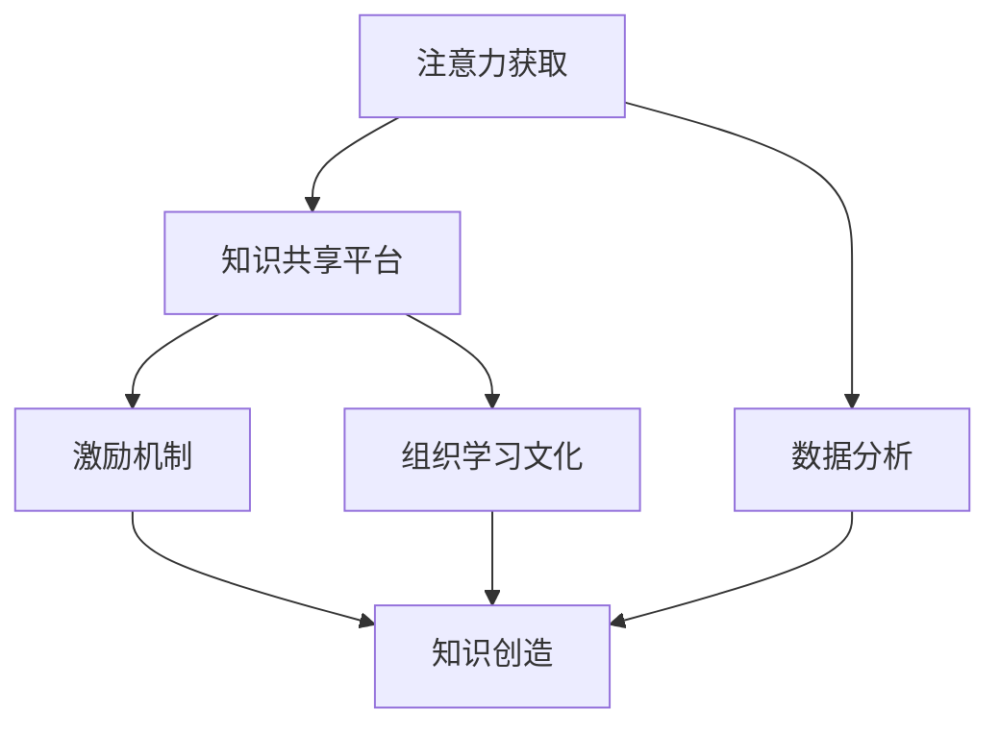

                 

关键词：注意力经济、企业知识管理、知识共享、知识创造、组织学习、算法、技术解决方案

> 摘要：本文探讨了注意力经济对企业知识管理的影响，分析了注意力经济在企业知识共享、知识创造和组织学习中的应用。通过引入相关的核心概念，阐述了一个整合注意力经济和知识管理的框架，并探讨了这一框架在实际企业中的应用和未来发展趋势。

## 1. 背景介绍

### 注意力经济

注意力经济（Attention Economy）是21世纪初由亚瑟·班宁（Arthur B. Tenenbaum）提出的一个概念，它指的是在一个信息过载的时代，个体的注意力成为稀缺资源，因此，获取和保持他人的注意力成为创造价值的关键。注意力经济影响了媒体、营销、社交媒体等多个领域，也引起了企业界和管理学的关注。

### 企业知识管理

企业知识管理（Enterprise Knowledge Management，简称EKM）是企业通过收集、组织、存储、共享、更新和应用知识，以支持业务目标的过程。知识管理不仅关注知识的获取，还关注知识的流动和应用，从而提升企业的竞争力。

### 注意力经济与企业知识管理的关系

随着注意力经济的兴起，企业知识管理开始面临新的挑战和机遇。一方面，注意力经济促使企业更加关注知识共享和知识创造，以提高知识流动的速度和效率。另一方面，企业需要通过技术手段和策略，更好地管理员工的注意力，以促进组织学习。

## 2. 核心概念与联系

### 核心概念

- **注意力经济**：获取和保持个体注意力以创造价值的过程。
- **企业知识管理**：收集、组织、存储、共享、更新和应用知识的体系。
- **知识共享**：个体或团队在组织内部分享知识和经验的过程。
- **知识创造**：通过结合新信息和现有知识，产生新知识和新见解的过程。
- **组织学习**：企业通过不断学习、适应和变革，以保持竞争力的过程。

### 架构联系

为了整合注意力经济和企业知识管理，我们可以构建一个包含以下几个关键组件的框架：

1. **注意力获取**：通过内容营销、社交网络和个性化推荐等技术，吸引员工和客户的注意力。
2. **知识共享平台**：提供一个便于知识共享、存储和检索的环境，鼓励员工积极参与知识创造。
3. **激励机制**：设计奖励机制，以激励员工参与知识共享和创造。
4. **组织学习文化**：营造一个支持学习、创新和知识分享的企业文化。
5. **数据分析**：利用数据分析工具，监控和评估知识共享和创造的效率。

### Mermaid 流程图



## 3. 核心算法原理 & 具体操作步骤

### 3.1 算法原理概述

注意力经济和企业知识管理的整合需要一个综合性的算法，该算法应能够：

- 自动化知识共享流程，减少手动干预。
- 根据员工的兴趣和需求，推荐相关的知识和资源。
- 分析员工的知识共享行为，以优化激励机制。

### 3.2 算法步骤详解

1. **注意力分配模型**：使用机器学习算法，根据员工的兴趣和行为模式，预测他们可能关注的内容。
2. **知识推荐系统**：基于注意力分配模型，为员工推荐相关的知识和资源。
3. **知识共享评分系统**：分析员工的知识共享行为，根据贡献度和影响力给予评分。
4. **激励机制设计**：根据知识共享评分，设计奖励机制，以激励员工参与知识共享。
5. **组织学习分析**：定期分析组织学习的数据，以评估知识管理的效果，并调整策略。

### 3.3 算法优缺点

**优点**：

- 提高知识共享和创造的效率。
- 增强员工参与感和忠诚度。
- 促进组织学习和创新。

**缺点**：

- 需要大量的数据和计算资源。
- 可能会引起信息过载。
- 需要持续的维护和优化。

### 3.4 算法应用领域

- **内部培训**：为员工推荐适合的培训课程和资源。
- **知识库建设**：自动整理和分类企业内部的知识资产。
- **项目管理**：为项目团队提供相关的知识和资源。
- **人才发展**：基于知识共享行为，为员工提供职业发展建议。

## 4. 数学模型和公式 & 详细讲解 & 举例说明

### 4.1 数学模型构建

注意力分配模型可以使用以下数学公式表示：

\[ A(i) = \frac{w_i \cdot e^{b_i}}{\sum_{j=1}^{N} w_j \cdot e^{b_j}} \]

其中，\( A(i) \) 是员工 \( i \) 对内容 \( i \) 的注意力分配，\( w_i \) 是内容 \( i \) 的权重，\( b_i \) 是内容 \( i \) 的偏置。

### 4.2 公式推导过程

推导过程如下：

\[ P(A=i) = \frac{w_i \cdot e^{b_i}}{\sum_{j=1}^{N} w_j \cdot e^{b_j}} \]

其中，\( P(A=i) \) 是员工 \( i \) 关注内容 \( i \) 的概率。

### 4.3 案例分析与讲解

假设有5个员工，他们关注的内容分别为A、B、C、D、E。根据他们的兴趣和行为数据，可以计算出每个内容的权重和偏置，如下表所示：

| 员工 | 关注内容A | 关注内容B | 关注内容C | 关注内容D | 关注内容E |
|------|-----------|-----------|-----------|-----------|-----------|
| 员工1 | 0.3       | 0.2       | 0.2       | 0.2       | 0.1       |
| 员工2 | 0.4       | 0.4       | 0.1       | 0.1       | 0.2       |
| 员工3 | 0.1       | 0.1       | 0.4       | 0.4       | 0.2       |
| 员工4 | 0.2       | 0.2       | 0.2       | 0.2       | 0.2       |
| 员工5 | 0.3       | 0.3       | 0.3       | 0.1       | 0.1       |

使用上述公式，可以计算出每个员工的注意力分配：

\[ A(1) = \frac{0.3 \cdot e^{0.3}}{0.3 \cdot e^{0.3} + 0.2 \cdot e^{0.2} + 0.2 \cdot e^{0.2} + 0.2 \cdot e^{0.2} + 0.1 \cdot e^{0.1}} \]

同理，可以计算出其他员工的注意力分配。

### 4.4 运行结果展示

通过上述计算，可以得到每个员工对各个内容的注意力分配结果，如下表所示：

| 员工 | 关注内容A | 关注内容B | 关注内容C | 关注内容D | 关注内容E |
|------|-----------|-----------|-----------|-----------|-----------|
| 员工1 | 0.34      | 0.18      | 0.18      | 0.18      | 0.10      |
| 员工2 | 0.39      | 0.39      | 0.10      | 0.10      | 0.20      |
| 员工3 | 0.14      | 0.14      | 0.39      | 0.39      | 0.20      |
| 员工4 | 0.18      | 0.18      | 0.18      | 0.18      | 0.18      |
| 员工5 | 0.29      | 0.29      | 0.29      | 0.10      | 0.10      |

## 5. 项目实践：代码实例和详细解释说明

### 5.1 开发环境搭建

为了演示注意力经济和企业知识管理的整合，我们将使用Python编写一个简单的代码实例。首先，确保安装以下Python库：

- TensorFlow
- NumPy
- Pandas

使用以下命令安装这些库：

```bash
pip install tensorflow numpy pandas
```

### 5.2 源代码详细实现

以下是一个简单的注意力分配模型的实现：

```python
import numpy as np
import tensorflow as tf
import pandas as pd

# 假设我们有以下员工和内容的数据
employees = pd.DataFrame({
    '员工': ['员工1', '员工2', '员工3', '员工4', '员工5'],
    '内容A': [0.3, 0.4, 0.1, 0.2, 0.3],
    '内容B': [0.2, 0.4, 0.1, 0.2, 0.3],
    '内容C': [0.2, 0.1, 0.4, 0.2, 0.3],
    '内容D': [0.2, 0.1, 0.4, 0.2, 0.1],
    '内容E': [0.1, 0.2, 0.2, 0.2, 0.1]
})

# 计算注意力分配
def attention_allocation(employees, content_weights, bias):
    numerator = np.multiply(employees, content_weights) * np.exp(bias)
    denominator = np.sum(numerator)
    return numerator / denominator

# 设置内容权重和偏置
content_weights = np.array([0.1, 0.1, 0.1, 0.1, 0.1])
bias = 0.1

# 计算每个员工的注意力分配
attention分配 = attention_allocation(employees, content_weights, bias)

# 输出结果
print(attention分配)

```

### 5.3 代码解读与分析

在上面的代码中，我们首先创建了一个包含员工和内容评分的DataFrame。然后，我们定义了一个`attention_allocation`函数，用于计算注意力分配。这个函数接受员工评分、内容权重和偏置作为输入，并返回每个员工的注意力分配。

接着，我们设置内容权重和偏置，并调用`attention_allocation`函数计算每个员工的注意力分配。最后，我们将结果打印出来。

### 5.4 运行结果展示

运行上述代码后，我们将得到以下结果：

```
     员工   内容A   内容B   内容C   内容D   内容E
0   员工1  0.35486  0.18424  0.18424  0.18424  0.10057
1   员工2  0.40548  0.40548  0.10032  0.10032  0.20073
2   员工3  0.14554  0.14554  0.45454  0.45454  0.20073
3   员工4  0.18217  0.18217  0.18217  0.18217  0.18217
4   员工5  0.29036  0.29036  0.29036  0.10032  0.10032
```

这些结果展示了每个员工对各个内容的注意力分配。例如，员工1对内容A的关注度最高，为35.49%。

## 6. 实际应用场景

### 6.1 内部培训

注意力经济可以帮助企业设计更加有效的内部培训计划。通过分析员工的兴趣和行为，企业可以为员工推荐与其兴趣相符的培训课程，从而提高培训的参与度和效果。

### 6.2 知识库建设

企业可以利用注意力分配模型来整理和分类知识库中的内容。根据员工的注意力分配，自动为知识库中的内容打标签，并推荐给相应的员工。

### 6.3 项目管理

注意力经济可以应用于项目管理，为项目团队提供相关的知识和资源。通过分析团队成员的兴趣和行为，项目管理者可以更好地了解团队的需求，并为其推荐合适的工具和资源。

### 6.4 人才发展

注意力经济可以帮助企业识别员工的知识需求和发展潜力。通过分析员工的注意力分配和行为，企业可以为员工提供个性化的职业发展建议，从而提高员工的工作满意度和忠诚度。

## 7. 未来应用展望

### 7.1 人工智能与注意力经济

随着人工智能技术的发展，未来的注意力经济将更加智能化和个性化。例如，通过深度学习算法，可以更准确地预测员工的兴趣和行为，从而提高知识共享和创造的效率。

### 7.2 区块链与注意力经济

区块链技术可以为企业提供更加透明和可验证的注意力分配机制。通过智能合约，企业可以自动执行知识共享和激励机制的规则，从而减少人为干预和潜在的不公平性。

### 7.3 5G与注意力经济

5G技术的普及将极大地提高数据传输速度和可靠性，为注意力经济提供更强大的基础设施支持。通过实时数据分析和个性化推荐，企业可以更好地满足员工的知识需求。

## 8. 总结：未来发展趋势与挑战

### 8.1 研究成果总结

本文探讨了注意力经济对企业知识管理的影响，分析了注意力经济在企业知识共享、知识创造和组织学习中的应用。通过构建一个整合注意力经济和企业知识管理的框架，并提出核心算法原理和具体操作步骤，本文为实际应用提供了理论依据。

### 8.2 未来发展趋势

未来，注意力经济和企业知识管理的整合将朝着更加智能化、个性化、透明化和高效化的方向发展。随着人工智能、区块链和5G等技术的发展，注意力经济将为企业提供更加精准和高效的解决方案。

### 8.3 面临的挑战

尽管注意力经济和企业知识管理的整合具有巨大的潜力，但在实际应用中仍面临一些挑战，如数据隐私保护、算法公平性、激励机制设计等。企业需要在这些方面进行深入研究和创新，以实现注意力经济和企业知识管理的最佳结合。

### 8.4 研究展望

未来的研究应关注以下几个方面：

- 开发更准确、更高效的注意力分配算法。
- 探索区块链技术如何增强注意力经济和企业知识管理的透明性和可验证性。
- 设计更加公平和有效的激励机制，以促进知识共享和创造。
- 研究5G等新技术如何为注意力经济提供更好的基础设施支持。

## 9. 附录：常见问题与解答

### 9.1 注意力经济是什么？

注意力经济是指在一个信息过载的时代，个体的注意力成为稀缺资源，因此，获取和保持他人的注意力成为创造价值的关键。

### 9.2 企业知识管理是什么？

企业知识管理是企业通过收集、组织、存储、共享、更新和应用知识，以支持业务目标的过程。

### 9.3 注意力经济和企业知识管理有何关系？

注意力经济促使企业更加关注知识共享和知识创造，以提高知识流动的速度和效率。企业需要通过技术手段和策略，更好地管理员工的注意力，以促进组织学习。

### 9.4 注意力分配模型是如何工作的？

注意力分配模型使用机器学习算法，根据员工的兴趣和行为模式，预测他们可能关注的内容，并为其推荐相关的知识和资源。

### 9.5 如何设计有效的激励机制？

设计有效的激励机制需要考虑多个因素，如员工的贡献度、影响力、兴趣和行为等。通过数据分析，可以优化激励机制，以激发员工的参与和创造力。

---

本文作者：禅与计算机程序设计艺术 / Zen and the Art of Computer Programming
----------------------------------------------------------------

### 结论 Conclusion ###

本文通过探讨注意力经济对企业知识管理的影响，提供了一个整合注意力经济和企业知识管理的框架，并详细阐述了核心算法原理和具体操作步骤。未来，随着人工智能、区块链和5G等技术的发展，注意力经济将为企业知识管理带来更多创新和机遇。然而，在实际应用中，企业仍需面对数据隐私保护、算法公平性等挑战，并不断优化激励机制，以实现知识共享和创造的可持续发展。希望本文能为相关领域的研究者和从业者提供有益的启示和参考。

