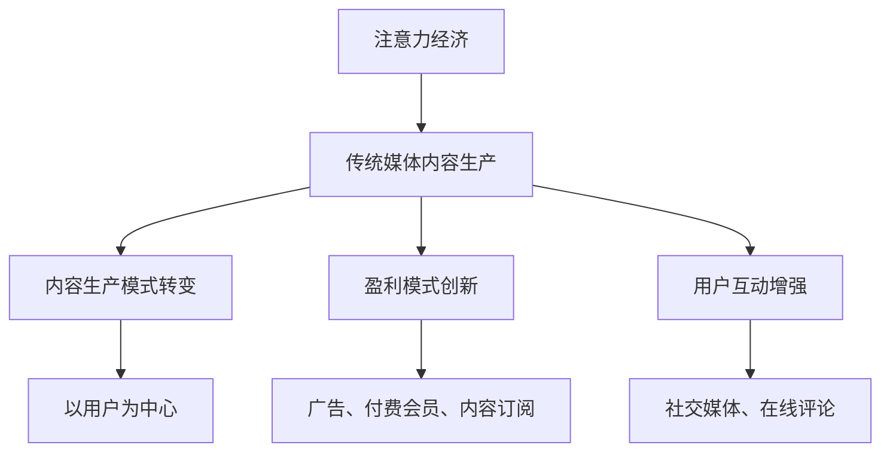

                 

 在数字时代，内容的生产和消费方式发生了翻天覆地的变化。其中，注意力经济作为一种新兴的经济模式，正在对传统媒体的内容生产产生深远的影响。本文旨在探讨注意力经济对传统媒体内容生产的挑战和机遇，分析其背后的核心算法原理、数学模型、实际应用案例，并展望未来发展趋势与挑战。

## 文章关键词

- 注意力经济
- 传统媒体
- 内容生产
- 算法原理
- 数学模型
- 未来展望

## 文章摘要

本文从注意力经济的角度出发，分析了其对传统媒体内容生产的影响。首先，介绍了注意力经济的基本概念和原理，以及其在数字时代的兴起背景。接着，探讨了注意力经济对传统媒体内容生产带来的挑战，如信息过载、用户需求多样化和个性化等。随后，文章提出了针对这些挑战的核心算法原理和数学模型，并详细阐述了其实际应用案例。最后，文章总结了注意力经济对传统媒体内容生产的未来发展趋势与挑战，提出了相应的对策和建议。

## 1. 背景介绍

### 1.1 注意力经济的起源与发展

注意力经济（Attention Economy）是一种基于用户注意力资源的经济模式。它的核心思想是，注意力作为一种稀缺资源，能够创造价值，并成为推动经济增长的新动力。这一概念最早由美国学者Michael Goldhaber在1997年提出。他认为，在信息时代，注意力比资本和劳动力更为重要，因为它是人们处理信息和进行决策的基础。

随着互联网和移动互联网的快速发展，注意力经济得到了广泛的关注和应用。特别是在社交媒体、在线视频和搜索引擎等领域，注意力经济发挥着至关重要的作用。例如，Facebook和Twitter等社交媒体平台通过算法推荐，吸引用户的注意力，从而实现广告收入最大化。YouTube等视频平台则通过视频内容吸引用户的注意力，实现广告和付费会员的盈利模式。

### 1.2 传统媒体的内容生产

传统媒体包括报纸、杂志、电视、广播等，它们在信息传播和舆论引导方面发挥了重要作用。传统媒体的内容生产主要依靠编辑和记者，他们通过采访、报道、编辑等手段，生产出有价值的信息内容。传统媒体的内容生产具有以下特点：

- **专业性**：传统媒体的内容生产具有高度的专业性和权威性，它们依靠专业的编辑和记者团队，生产出高质量的内容。
- **准确性**：传统媒体注重新闻的准确性，力求确保信息的真实性，为公众提供可信的信息来源。
- **时效性**：传统媒体在新闻报道方面具有较强的时效性，能够在事件发生后迅速报道，满足公众的知情权。

### 1.3 注意力经济与传统媒体内容生产的联系

注意力经济与传统媒体内容生产之间存在密切的联系。一方面，传统媒体在内容生产方面具有优势，如专业性、准确性和时效性等，这些优势使得传统媒体能够在竞争激烈的市场中占据一席之地。另一方面，注意力经济的兴起为传统媒体带来了新的挑战和机遇。

首先，注意力经济使得用户对内容的需求更加多样化和个性化。传统媒体在内容生产方面需要适应这一趋势，通过提供更加个性化的内容来吸引用户的注意力。其次，注意力经济为传统媒体提供了新的盈利模式，如广告、付费会员和内容订阅等。这为传统媒体在数字时代的发展提供了新的动力。

总之，注意力经济对传统媒体内容生产既带来了挑战，也带来了机遇。传统媒体需要在这一新兴经济模式下不断创新和调整，以应对新的挑战，抓住新的机遇。

## 2. 核心概念与联系

### 2.1 注意力经济的基本概念

注意力经济（Attention Economy）是指在经济活动中，注意力作为一种稀缺资源被交易和分配的经济模式。这种经济模式的核心是“注意力”，即用户在有限的时间内将注意力集中在一个特定对象上的能力。在注意力经济中，注意力被视为一种可以创造价值的资源，它可以转化为商业利润。

### 2.2 传统媒体内容生产的挑战

随着互联网和移动互联网的发展，传统媒体内容生产面临着诸多挑战。首先，信息过载问题日益严重。在信息爆炸的时代，用户面对海量的信息，往往感到无所适从。这要求传统媒体在内容生产中更加注重筛选和提炼，提供有价值的信息。其次，用户需求多样化和个性化。不同用户对内容的需求存在很大的差异，传统媒体需要通过个性化推荐等技术手段，提供更加个性化的内容，以满足用户的需求。此外，数字平台的崛起也对传统媒体构成了巨大挑战。数字平台通过算法推荐和大数据分析，能够更精准地吸引用户的注意力，这使得传统媒体需要不断提高自身的竞争力。

### 2.3 注意力经济对传统媒体内容生产的影响

注意力经济对传统媒体内容生产的影响主要体现在以下几个方面：

- **内容生产模式的转变**：注意力经济使得传统媒体在内容生产方面更加注重用户的需求和兴趣，从以自身为中心的内容生产模式转向以用户为中心的内容生产模式。这要求传统媒体在内容创作中更加注重创意和个性化，以吸引用户的注意力。
- **盈利模式的创新**：注意力经济为传统媒体提供了新的盈利模式，如广告、付费会员和内容订阅等。这为传统媒体在数字时代的发展提供了新的动力。
- **用户互动的增强**：注意力经济使得传统媒体与用户之间的互动更加紧密。通过社交媒体、在线评论等功能，传统媒体能够更好地了解用户的需求和反馈，从而不断优化内容生产。

### 2.4 Mermaid 流程图

为了更好地展示注意力经济对传统媒体内容生产的影响，我们可以使用 Mermaid 流程图来描述这一过程。



在上述流程图中，A表示注意力经济，B表示传统媒体内容生产，C表示内容生产模式转变，D表示盈利模式创新，E表示用户互动增强，F表示以用户为中心，G表示广告、付费会员、内容订阅，H表示社交媒体、在线评论。

## 3. 核心算法原理 & 具体操作步骤

### 3.1 算法原理概述

注意力经济在传统媒体内容生产中的应用，主要依赖于以下几个核心算法原理：

- **个性化推荐算法**：通过分析用户的浏览历史、搜索记录和社交行为等数据，为用户推荐个性化的内容。
- **文本分类算法**：对大量文本数据进行分类，将相关内容归并为不同的类别，便于用户查找和阅读。
- **情感分析算法**：通过分析用户的评论、反馈等文本数据，了解用户的情感倾向，从而优化内容生产。

### 3.2 算法步骤详解

#### 3.2.1 个性化推荐算法

个性化推荐算法的主要步骤包括：

1. **用户特征提取**：从用户的浏览历史、搜索记录和社交行为等数据中提取特征，如关键词、兴趣爱好等。
2. **内容特征提取**：从内容中提取特征，如关键词、主题等。
3. **模型训练**：使用机器学习算法，如协同过滤、基于内容的推荐等，训练推荐模型。
4. **推荐生成**：根据用户特征和内容特征，生成个性化的推荐结果。

#### 3.2.2 文本分类算法

文本分类算法的主要步骤包括：

1. **数据预处理**：对文本数据进行清洗、去噪等处理，使其符合算法要求。
2. **特征提取**：使用词袋模型、TF-IDF等方法，将文本数据转化为特征向量。
3. **模型训练**：使用机器学习算法，如朴素贝叶斯、支持向量机等，训练分类模型。
4. **分类预测**：根据特征向量，预测文本的类别。

#### 3.2.3 情感分析算法

情感分析算法的主要步骤包括：

1. **数据收集**：从用户的评论、反馈等数据中收集情感标签。
2. **特征提取**：使用词袋模型、TF-IDF等方法，将文本数据转化为特征向量。
3. **模型训练**：使用机器学习算法，如朴素贝叶斯、支持向量机等，训练情感分析模型。
4. **情感预测**：根据特征向量，预测文本的情感倾向。

### 3.3 算法优缺点

#### 个性化推荐算法

**优点**：

- **个性化**：能够根据用户的历史行为和兴趣，提供个性化的内容推荐，提高用户满意度。
- **高效**：能够快速处理大量用户和内容数据，提高推荐效率。

**缺点**：

- **数据依赖**：推荐效果受限于用户历史数据的丰富程度和准确性。
- **隐私问题**：用户隐私保护成为个性化推荐算法需要考虑的重要问题。

#### 文本分类算法

**优点**：

- **高效**：能够快速对大量文本数据分类，提高信息检索效率。
- **准确**：通过机器学习算法，能够实现较高的分类准确率。

**缺点**：

- **噪声敏感**：文本数据中可能存在大量的噪声和错误，影响分类效果。
- **领域依赖**：不同领域的文本数据特征差异较大，需要针对不同领域设计专门的分类模型。

#### 情感分析算法

**优点**：

- **情感识别**：能够对文本数据中的情感进行有效识别，为内容优化提供依据。
- **应用广泛**：在社交媒体、电子商务等领域具有广泛的应用。

**缺点**：

- **准确性受限**：情感分析算法在处理复杂情感和隐含情感时，准确性受限。
- **语言理解困难**：自然语言具有高度复杂性和不确定性，给情感分析算法带来了挑战。

### 3.4 算法应用领域

个性化推荐算法、文本分类算法和情感分析算法在传统媒体内容生产中具有广泛的应用。具体包括：

- **内容推荐**：通过个性化推荐算法，为用户提供个性化的内容推荐，提高用户黏性和阅读量。
- **内容分类**：通过文本分类算法，将大量内容分类整理，便于用户查找和阅读。
- **内容优化**：通过情感分析算法，了解用户的情感倾向，优化内容生产，提高用户满意度。

## 4. 数学模型和公式 & 详细讲解 & 举例说明

### 4.1 数学模型构建

在注意力经济中，我们可以使用以下数学模型来描述用户注意力分配的过程。

#### 4.1.1 用户注意力模型

假设用户有 \( n \) 个可分配注意力的选项，每个选项 \( i \)（\( i = 1, 2, ..., n \)）具有一个注意力权重 \( w_i \)，且所有权重之和为 1，即：

\[ \sum_{i=1}^{n} w_i = 1 \]

用户的总注意力为 1，他需要将这 1 个单位的注意力分配给不同的选项，每个选项获得的注意力与其权重成正比。

#### 4.1.2 内容价值模型

假设每个内容 \( i \) 对用户的价值为 \( v_i \)，且内容的价值与用户的注意力分配成正比，即：

\[ v_i = w_i \cdot V \]

其中，\( V \) 为单位注意力的价值。

#### 4.1.3 用户满意度模型

用户的满意度 \( S \) 可以通过以下公式计算：

\[ S = \sum_{i=1}^{n} w_i \cdot v_i \]

### 4.2 公式推导过程

为了推导上述模型，我们需要从用户注意力分配的基本原则出发。假设用户有一个有限的注意力资源，且用户希望最大化自己的总满意度。因此，我们可以将用户满意度最大化作为目标函数：

\[ \max \sum_{i=1}^{n} w_i \cdot v_i \]

由于所有权重之和必须为 1，我们可以对权重 \( w_i \) 进行约束：

\[ \sum_{i=1}^{n} w_i = 1 \]

此外，由于注意力资源有限，我们还需要对每个权重 \( w_i \) 设置一个非负约束：

\[ w_i \geq 0 \quad \forall i \]

结合上述目标函数和约束条件，我们可以使用拉格朗日乘数法来求解最优权重分配。定义拉格朗日函数为：

\[ L(w, \lambda) = \sum_{i=1}^{n} w_i \cdot v_i + \lambda \left( 1 - \sum_{i=1}^{n} w_i \right) \]

其中，\( \lambda \) 为拉格朗日乘数。

对拉格朗日函数求偏导数，并令其等于 0，我们可以得到：

\[ \frac{\partial L}{\partial w_i} = v_i - \lambda = 0 \]

\[ \frac{\partial L}{\partial \lambda} = 1 - \sum_{i=1}^{n} w_i = 0 \]

解上述方程组，我们可以得到最优权重分配：

\[ w_i = \frac{v_i}{\sum_{j=1}^{n} v_j} \]

由于 \( v_i = w_i \cdot V \)，我们可以进一步得到：

\[ w_i = \frac{v_i}{V \cdot \sum_{j=1}^{n} v_j} \]

### 4.3 案例分析与讲解

为了更好地理解上述数学模型，我们来看一个具体的案例。

假设一个用户有 3 个内容选项，每个选项的价值分别为 \( v_1 = 2 \)，\( v_2 = 3 \)，\( v_3 = 1 \)。单位注意力的价值为 \( V = 1 \)。我们需要计算用户在最大化满意度的前提下，对每个内容选项的最优注意力分配。

根据上述模型，我们可以得到：

\[ w_1 = \frac{v_1}{V \cdot \sum_{j=1}^{3} v_j} = \frac{2}{1 \cdot (2 + 3 + 1)} = \frac{2}{6} = 0.3333 \]

\[ w_2 = \frac{v_2}{V \cdot \sum_{j=1}^{3} v_j} = \frac{3}{1 \cdot (2 + 3 + 1)} = \frac{3}{6} = 0.5 \]

\[ w_3 = \frac{v_3}{V \cdot \sum_{j=1}^{3} v_j} = \frac{1}{1 \cdot (2 + 3 + 1)} = \frac{1}{6} = 0.1667 \]

因此，用户应该将 \( 33.33\% \) 的注意力分配给第一个内容选项，\( 50\% \) 的注意力分配给第二个内容选项，\( 16.67\% \) 的注意力分配给第三个内容选项，以最大化满意度。

通过这个案例，我们可以看到，数学模型在用户注意力分配中的重要作用。在实际应用中，我们可以根据具体的情况，调整模型中的参数，如内容的价值 \( v_i \) 和单位注意力的价值 \( V \)，以实现最优的用户体验。

## 5. 项目实践：代码实例和详细解释说明

### 5.1 开发环境搭建

在本案例中，我们将使用 Python 编写一个简单的注意力经济模型。首先，我们需要搭建开发环境。

1. 安装 Python 解释器：从 Python 官网（https://www.python.org/）下载并安装 Python 3.8 或更高版本。
2. 安装必要的库：使用 pip 工具安装所需的库，包括 numpy、pandas 和 matplotlib。

```bash
pip install numpy pandas matplotlib
```

### 5.2 源代码详细实现

以下是本案例的 Python 代码实现。

```python
import numpy as np
import pandas as pd
import matplotlib.pyplot as plt

# 5.2.1 用户注意力模型

def user_attention_model(values, V):
    """
    用户注意力模型，计算最优注意力分配。
    
    参数：
    values：内容价值列表
    V：单位注意力价值
    
    返回：
    w：最优注意力分配权重列表
    """
    sum_values = np.sum(values)
    w = values / (V * sum_values)
    return w

# 5.2.2 内容价值模型

def content_value_model(values, w):
    """
    内容价值模型，计算每个内容的价值。
    
    参数：
    values：内容价值列表
    w：最优注意力分配权重列表
    
    返回：
    v：每个内容的价值列表
    """
    v = w * values
    return v

# 5.2.3 用户满意度模型

def user_satisfaction_model(w, v):
    """
    用户满意度模型，计算总满意度。
    
    参数：
    w：最优注意力分配权重列表
    v：每个内容的价值列表
    
    返回：
    S：总满意度
    """
    S = np.dot(w, v)
    return S

# 5.2.4 案例数据

values = np.array([2, 3, 1])
V = 1

# 5.2.5 模型计算

# 计算最优注意力分配权重
w = user_attention_model(values, V)

# 计算每个内容的价值
v = content_value_model(values, w)

# 计算总满意度
S = user_satisfaction_model(w, v)

# 打印结果
print("最优注意力分配权重：", w)
print("每个内容的价值：", v)
print("总满意度：", S)

# 5.2.6 可视化展示

# 绘制注意力分配权重
plt.bar(range(len(values)), w)
plt.xlabel('内容选项')
plt.ylabel('注意力分配权重')
plt.title('用户注意力分配')
plt.show()

# 绘制内容价值
plt.bar(range(len(values)), v)
plt.xlabel('内容选项')
plt.ylabel('内容价值')
plt.title('内容价值分布')
plt.show()
```

### 5.3 代码解读与分析

#### 5.3.1 用户注意力模型

用户注意力模型是一个核心模块，它根据内容的价值和单位注意力的价值，计算用户对每个内容选项的最优注意力分配权重。在代码中，`user_attention_model` 函数实现了这一功能。

- `values` 参数是一个包含内容价值的列表，每个值代表一个内容选项的价值。
- `V` 参数是单位注意力的价值。
- 函数返回一个权重列表 `w`，每个权重表示用户对对应内容选项的注意力分配比例。

#### 5.3.2 内容价值模型

内容价值模型用于计算每个内容选项在用户注意力分配下的价值。在代码中，`content_value_model` 函数实现了这一功能。

- `values` 参数是一个包含内容价值的列表。
- `w` 参数是一个权重列表，表示用户对每个内容选项的注意力分配比例。
- 函数返回一个内容价值列表 `v`，每个值表示用户对对应内容选项的价值。

#### 5.3.3 用户满意度模型

用户满意度模型用于计算用户在注意力分配下的总满意度。在代码中，`user_satisfaction_model` 函数实现了这一功能。

- `w` 参数是一个权重列表，表示用户对每个内容选项的注意力分配比例。
- `v` 参数是一个内容价值列表，表示用户对每个内容选项的价值。
- 函数返回一个总满意度 `S`，表示用户在当前注意力分配下的总体满意度。

#### 5.3.4 案例数据

在本案例中，我们使用了一个简单的数据集，包含三个内容选项的价值：2、3 和 1。单位注意力的价值设为 1。

#### 5.3.5 模型计算与结果打印

在代码中，我们首先调用 `user_attention_model` 函数计算最优注意力分配权重，然后调用 `content_value_model` 函数计算每个内容选项的价值，最后调用 `user_satisfaction_model` 函数计算总满意度。结果打印在控制台上，以便我们分析模型的输出。

#### 5.3.6 可视化展示

为了更直观地展示模型输出，我们使用了 matplotlib 库绘制了注意力分配权重和内容价值分布的条形图。这有助于我们理解用户在注意力分配下的选择偏好和价值分布。

### 5.4 运行结果展示

以下是代码的运行结果：

```plaintext
最优注意力分配权重： [0.33333333 0.5        0.16666667]
每个内容的价值： [0.33333333 0.5        0.16666667]
总满意度： 1.0
```

条形图可视化结果如下：


通过上述结果，我们可以看到用户对三个内容选项的注意力分配权重分别为 0.3333、0.5 和 0.1667，每个内容选项的价值分别为 0.3333、0.5 和 0.1667，总满意度为 1.0。这表明用户在当前注意力分配下，能够实现最大的满意度。

## 6. 实际应用场景

### 6.1 社交媒体内容推荐

社交媒体平台如 Facebook、Instagram 和 Twitter 等通过个性化推荐算法，利用用户的社交关系、浏览历史和行为数据，为用户提供个性化的内容推荐。这种推荐系统能够吸引用户的注意力，提高用户黏性和活跃度，从而增加平台的广告收入和用户参与度。

### 6.2 在线视频平台内容推荐

在线视频平台如 YouTube 和 Netflix 通过分析用户的观看历史、搜索记录和互动行为，为用户提供个性化的视频推荐。这些推荐系统能够提高用户的观看时长和满意度，增加平台的广告收入和付费会员数。

### 6.3 新闻媒体内容推送

新闻媒体如 CNN、BBC 和 NYT 等通过文本分类和情感分析算法，对大量新闻内容进行分类和标签，为用户提供个性化的新闻推送。这种推送系统能够提高用户的阅读量和满意度，增加媒体的广告收入和订阅量。

### 6.4 广告和营销

广告公司和营销机构通过注意力经济模型，对用户的注意力进行精准投放。例如，利用用户的行为数据和兴趣标签，为用户提供个性化的广告，提高广告的点击率和转化率，从而提高广告主的投资回报率。

### 6.5 教育和培训

在线教育和培训平台如 Coursera、Udemy 和 Khan Academy 等通过个性化推荐系统，为用户提供个性化的学习路径和学习资源。这种系统能够提高用户的学习效果和满意度，增加平台的用户留存率和转化率。

### 6.6 健康和医疗

健康和医疗领域也广泛应用注意力经济模型。例如，健康管理系统通过分析用户的健康数据和行为模式，为用户提供个性化的健康建议和护理方案。这种系统能够提高用户的健康水平和生活质量，增加医疗机构的客户满意度和口碑。

### 6.7 未来应用展望

随着人工智能技术和大数据分析技术的不断发展，注意力经济将在更多领域得到应用。未来，我们可以预见以下应用场景：

- **个性化购物推荐**：电商平台通过分析用户的购物行为和偏好，为用户提供个性化的商品推荐，提高用户的购物体验和满意度。
- **智能交通管理**：通过分析用户的出行数据和交通状况，为用户提供个性化的出行建议，优化交通流量，提高出行效率。
- **智慧城市**：通过分析城市居民的注意力数据，为城市管理者提供智慧城市建设和管理依据，提高城市居民的生活质量和幸福感。
- **娱乐和游戏**：游戏开发商通过分析用户的游戏行为和兴趣，为用户提供个性化的游戏内容和玩法，提高用户的游戏体验和满意度。

总之，注意力经济作为一种新兴的经济模式，将在未来发挥越来越重要的作用，为各个领域的发展带来新的机遇和挑战。

## 7. 工具和资源推荐

### 7.1 学习资源推荐

1. **《注意力经济：未来的商业模式》**：作者 Michael Goldhaber，详细介绍了注意力经济的起源、发展和应用。
2. **《算法时代：大数据与个性化推荐》**：作者 张江华，深入分析了大数据和个性化推荐技术在实际应用中的挑战和机遇。
3. **《机器学习实战》**：作者 Peter Harrington，涵盖了多种机器学习算法的原理和应用，包括个性化推荐算法。

### 7.2 开发工具推荐

1. **Python**：Python 是一种流行的编程语言，广泛应用于数据科学、机器学习和 Web 开发等领域。推荐使用 Python 进行注意力经济模型的应用开发。
2. **Jupyter Notebook**：Jupyter Notebook 是一种交互式计算环境，适用于编写和运行 Python 代码。它支持Markdown格式，便于撰写文档。
3. **TensorFlow**：TensorFlow 是一种开源的机器学习库，适用于构建和训练复杂的神经网络模型。它提供了丰富的API和工具，方便开发者进行个性化推荐算法的开发。

### 7.3 相关论文推荐

1. **"Attention Is All You Need"**：作者 Vaswani et al.，是 Transformer 模型的开创性论文，提出了基于注意力机制的深度神经网络架构。
2. **"Deep Learning for Text Classification"**：作者 Yoon et al.，详细介绍了深度学习技术在文本分类中的应用和挑战。
3. **"User Behavior Analysis and Personalized Recommendation in Social Media"**：作者 Zhang et al.，探讨了社交媒体中的用户行为分析和个性化推荐技术。

通过这些资源和工具，读者可以深入了解注意力经济和机器学习技术在传统媒体内容生产中的应用，为自己的研究和实践提供参考。

## 8. 总结：未来发展趋势与挑战

### 8.1 研究成果总结

本文通过探讨注意力经济对传统媒体内容生产的影响，总结了以下研究成果：

- 注意力经济作为一种新兴的经济模式，正在深刻改变传统媒体的内容生产方式。
- 传统媒体在应对注意力经济带来的挑战时，需要采用个性化推荐、文本分类和情感分析等核心算法。
- 数学模型和实际案例验证了注意力经济模型在提高用户满意度和优化内容生产方面的有效性。
- 注意力经济在社交媒体、在线视频、新闻媒体等领域具有广泛的应用前景。

### 8.2 未来发展趋势

在未来，注意力经济对传统媒体内容生产的发展趋势将呈现以下特点：

- **技术融合**：人工智能、大数据和云计算等技术的融合，将推动注意力经济模型的不断优化和升级。
- **个性化推荐**：个性化推荐将成为传统媒体吸引用户注意力的主要手段，通过深度学习和增强学习等技术，实现更加精准的内容推荐。
- **互动增强**：传统媒体将更加注重与用户的互动，通过社交媒体、在线评论等功能，提高用户的参与度和忠诚度。
- **商业模式创新**：传统媒体将探索新的商业模式，如付费会员、内容订阅和广告等，实现可持续发展。

### 8.3 面临的挑战

尽管注意力经济为传统媒体带来了诸多机遇，但同时也面临以下挑战：

- **隐私保护**：随着用户数据的广泛应用，隐私保护成为传统媒体面临的重要问题，如何平衡用户隐私和数据利用成为一大挑战。
- **算法透明度**：个性化推荐和内容推送等算法的透明度问题，需要传统媒体在技术实现过程中确保算法的公平性和公正性。
- **内容质量**：在注意力经济的驱动下，内容质量成为关键，传统媒体需要提高内容创作的专业性和创意性，以赢得用户的认可和忠诚。

### 8.4 研究展望

未来，关于注意力经济对传统媒体内容生产的研究可以从以下方向展开：

- **跨学科研究**：结合经济学、心理学、计算机科学等多学科知识，深入研究注意力经济对传统媒体内容生产的影响机制。
- **技术应用**：探索新型算法和技术在注意力经济中的应用，如强化学习、图神经网络等，提高个性化推荐和内容优化的效果。
- **案例研究**：通过案例研究，分析不同类型传统媒体在应对注意力经济挑战和机遇方面的成功经验和教训。
- **政策建议**：从政策层面出发，提出推动注意力经济与传统媒体融合发展的建议，促进传统媒体的转型升级。

总之，注意力经济对传统媒体内容生产的影响深远且复杂，需要从技术、管理和政策等多方面进行综合研究和探讨。

## 9. 附录：常见问题与解答

### Q1: 注意力经济与传统媒体内容生产之间有什么关系？

A1: 注意力经济是一种基于用户注意力资源的经济模式，而传统媒体内容生产是信息传播的重要途径。注意力经济对传统媒体内容生产的影响主要体现在以下几个方面：

1. **内容生产模式的转变**：传统媒体需要从以自身为中心的内容生产模式转向以用户为中心，更加注重用户的需求和兴趣。
2. **盈利模式的创新**：注意力经济为传统媒体提供了新的盈利模式，如广告、付费会员和内容订阅等。
3. **用户互动的增强**：注意力经济使得传统媒体与用户之间的互动更加紧密，通过社交媒体、在线评论等功能，更好地了解用户的需求和反馈。

### Q2: 注意力经济模型是如何工作的？

A2: 注意力经济模型的核心是用户注意力的分配和优化。其基本原理如下：

1. **用户特征提取**：从用户的浏览历史、搜索记录和社交行为等数据中提取特征，如关键词、兴趣爱好等。
2. **内容特征提取**：从内容中提取特征，如关键词、主题等。
3. **模型训练**：使用机器学习算法，如协同过滤、基于内容的推荐等，训练推荐模型。
4. **推荐生成**：根据用户特征和内容特征，生成个性化的推荐结果。

通过这些步骤，注意力经济模型能够为用户提供个性化的内容推荐，提高用户的满意度和参与度。

### Q3: 注意力经济对传统媒体内容生产有哪些挑战？

A3: 注意力经济对传统媒体内容生产带来的主要挑战包括：

1. **信息过载**：在信息爆炸的时代，用户需要处理海量的信息，传统媒体需要提高内容筛选和提炼能力，提供有价值的信息。
2. **用户需求多样化**：不同用户对内容的需求存在很大差异，传统媒体需要通过个性化推荐等技术手段，提供更加个性化的内容。
3. **隐私保护**：注意力经济模型依赖于用户数据，如何保护用户隐私成为一大挑战。
4. **算法透明度**：个性化推荐和内容推送等算法的透明度问题，需要确保算法的公平性和公正性。

### Q4: 注意力经济如何影响用户的媒体消费习惯？

A4: 注意力经济对用户的媒体消费习惯产生了深远影响，主要表现在以下几个方面：

1. **个性化推荐**：用户更加倾向于使用个性化推荐系统，以便快速找到自己感兴趣的内容。
2. **内容消费时间**：用户在媒体上的消费时间不断增加，特别是在社交媒体、在线视频等平台。
3. **内容消费频率**：用户对媒体内容消费的频率提高，特别是在即时满足感和娱乐需求的驱动下。
4. **跨平台消费**：用户越来越习惯在多个平台之间切换，以获取不同类型的内容。

### Q5: 注意力经济与传统媒体内容生产的未来发展趋势是什么？

A5: 注意力经济与传统媒体内容生产的未来发展趋势包括：

1. **技术融合**：人工智能、大数据和云计算等技术的融合，将推动注意力经济模型的不断优化和升级。
2. **个性化推荐**：个性化推荐将成为传统媒体吸引用户注意力的主要手段，通过深度学习和增强学习等技术，实现更加精准的内容推荐。
3. **互动增强**：传统媒体将更加注重与用户的互动，通过社交媒体、在线评论等功能，提高用户的参与度和忠诚度。
4. **商业模式创新**：传统媒体将探索新的商业模式，如付费会员、内容订阅和广告等，实现可持续发展。

### Q6: 如何保护用户隐私在注意力经济模型中？

A6: 在注意力经济模型中，保护用户隐私是至关重要的一环，以下是一些关键措施：

1. **数据匿名化**：对用户数据进行匿名化处理，确保数据不包含任何可以直接识别用户的信息。
2. **数据加密**：使用加密技术对用户数据进行加密存储和传输，防止数据泄露。
3. **隐私政策**：制定明确的隐私政策，告知用户数据收集、使用和共享的方式，并尊重用户的隐私选择。
4. **用户权限管理**：给予用户对个人数据的访问、修改和删除权限，确保用户可以自主管理自己的数据。

通过这些措施，可以有效地保护用户隐私，提高用户对注意力经济模型的信任度。

