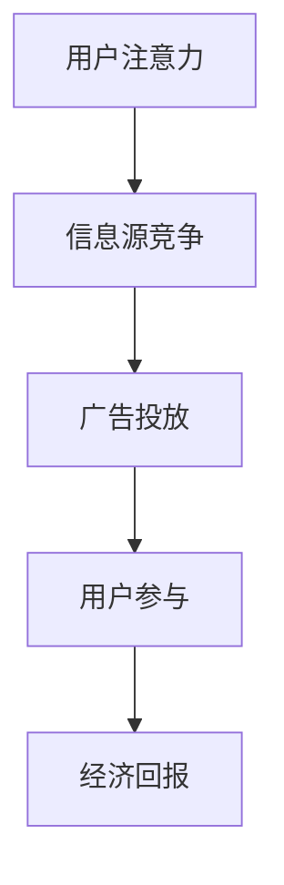

                 

 在当今信息爆炸的时代，广告行业正面临着前所未有的挑战和机遇。随着互联网的普及和移动设备的广泛应用，人们的注意力变得更加稀缺。在这个背景下，注意力经济成为了一个热门话题。本文将探讨注意力经济对传统广告创意带来的新要求，分析其在信息技术和广告行业中的影响，并提出相应的策略和解决方案。

## 关键词

- 注意力经济
- 广告创意
- 互联网营销
- 数据分析
- 用户体验

## 摘要

本文首先介绍了注意力经济的概念及其在当今社会的重要性。接着，分析了注意力经济对传统广告创意产生的挑战，包括注意力稀缺、用户个性化需求、数据隐私保护等方面。在此基础上，提出了提高广告创意质量的策略，如精准定位、内容创新、用户体验优化等。最后，探讨了未来广告创意的发展趋势，包括人工智能、虚拟现实等技术的应用，以及广告行业面临的挑战和机遇。

## 1. 背景介绍

### 注意力经济的概念

注意力经济是指个体在特定时间段内能够分配给各种活动的注意力的总量。在互联网时代，由于信息过载，人们能够分配给特定信息的注意力变得非常有限。因此，如何有效地获取和保持用户的注意力，成为了企业和广告从业者面临的重要问题。

### 广告行业的发展

广告行业作为信息传播的重要载体，经历了从传统媒体（如电视、报纸）到数字媒体（如互联网、移动应用）的演变。随着数字技术的发展，广告的形式和传播方式也发生了巨大变化。然而，随着信息过载和用户注意力的分散，传统广告创意的效果逐渐减弱。

### 注意力经济对广告行业的影响

注意力经济的兴起对广告行业产生了深远的影响。首先，它要求广告创意更加精准和高效，以吸引并留住用户的注意力。其次，它推动了个性化营销的发展，使得广告能够更好地满足用户的个性化需求。此外，注意力经济也引发了数据隐私和安全问题的讨论，对广告行业的合规性和道德标准提出了更高要求。

## 2. 核心概念与联系

### 注意力经济原理


注意力经济原理可以概括为以下几个关键点：

1. **稀缺性**：注意力是有限的资源，用户无法同时关注多个信息源。
2. **竞争**：各个信息源争夺用户的注意力，竞争激烈。
3. **价值**：注意力具有价值，能够转化为经济利益。

### 广告与注意力经济的联系

广告行业的本质是争夺用户的注意力，从而实现商业目的。注意力经济揭示了这一过程中的关键机制。以下是一个简化的 Mermaid 流程图，展示了广告与注意力经济之间的联系：



在这个流程中，用户注意力是起点，广告投放是核心环节，用户参与是关键，最终实现经济回报。

### 广告创意在注意力经济中的角色

广告创意在注意力经济中扮演着至关重要的角色。一个好的广告创意能够有效地吸引和留住用户的注意力，从而提高广告的投放效果。以下是几个关键点：

1. **创新性**：创意新颖、独特，能够引起用户的兴趣。
2. **相关性**：内容与用户需求和兴趣相关，提高用户参与度。
3. **娱乐性**：通过幽默、情感等元素，提升用户体验。
4. **传播性**：易于传播，能够迅速在用户群体中扩散。

## 3. 核心算法原理 & 具体操作步骤

### 3.1 算法原理概述

在注意力经济中，广告创意的质量直接影响到广告的效果。因此，本文提出了一种基于用户行为分析和内容推荐的广告创意优化算法。该算法的核心思想是通过分析用户的兴趣和行为数据，推荐与之相关的广告创意，从而提高广告的吸引力和转化率。

### 3.2 算法步骤详解

1. **数据收集**：收集用户的兴趣标签、搜索历史、浏览记录等数据。
2. **特征提取**：对收集到的数据进行分析，提取用户兴趣特征。
3. **内容推荐**：利用内容推荐算法，为用户推荐相关的广告创意。
4. **广告创意优化**：根据用户反馈，对广告创意进行优化，提高其质量和吸引力。
5. **效果评估**：评估广告创意的投放效果，为后续优化提供数据支持。

### 3.3 算法优缺点

**优点**：

- 提高广告创意的个性化程度，更好地满足用户需求。
- 通过用户行为分析，实现精准投放，提高广告效果。
- 优化广告创意，提高用户参与度和转化率。

**缺点**：

- 需要大量用户行为数据，对数据质量和处理能力有较高要求。
- 内容推荐算法可能存在偏差，导致广告创意过于单一。

### 3.4 算法应用领域

该算法适用于各种类型的广告创意优化，包括互联网广告、移动应用广告、社交媒体广告等。通过在不同场景下的应用，可以有效提升广告效果，为企业带来更多经济回报。

## 4. 数学模型和公式 & 详细讲解 & 举例说明

### 4.1 数学模型构建

在广告创意优化过程中，我们可以构建一个基于用户行为数据和内容特征的综合评价模型。该模型用于评估广告创意的质量，从而实现优化。

假设用户兴趣特征为 \( x \)，广告创意特征为 \( y \)，用户对广告的反馈为 \( z \)。我们可以定义一个评价函数 \( f(x, y, z) \)，用于评估广告创意的质量。

### 4.2 公式推导过程

根据广告创意的吸引力和用户兴趣的相关性，我们可以推导出评价函数：

\[ f(x, y, z) = \alpha \cdot \text{attraction}(y) + \beta \cdot \text{relevance}(x, y) + \gamma \cdot \text{feedback}(z) \]

其中：

- \( \alpha \)：广告吸引力的权重。
- \( \beta \)：广告相关性的权重。
- \( \gamma \)：用户反馈的权重。

### 4.3 案例分析与讲解

假设我们有一个用户兴趣特征为 \( x = [0.6, 0.3, 0.1] \)，广告创意特征为 \( y = [0.8, 0.5, 0.2] \)，用户反馈为 \( z = 1 \)。根据上述评价函数，我们可以计算广告创意的质量：

\[ f(x, y, z) = \alpha \cdot 0.8 + \beta \cdot 0.3 + \gamma \cdot 1 \]

通过优化权重参数 \( \alpha, \beta, \gamma \)，我们可以提高广告创意的评价分数，从而实现优化。

## 5. 项目实践：代码实例和详细解释说明

### 5.1 开发环境搭建

为了演示广告创意优化算法，我们选择 Python 作为编程语言，利用以下库和工具：

- Python 3.8 或以上版本
- NumPy
- Pandas
- Scikit-learn

### 5.2 源代码详细实现

以下是一个简单的 Python 实现示例：

```python
import numpy as np
import pandas as pd
from sklearn.model_selection import train_test_split
from sklearn.linear_model import LinearRegression

# 数据准备
data = pd.DataFrame({
    'x': [[0.6, 0.3, 0.1], [0.7, 0.2, 0.1], [0.5, 0.4, 0.1]],
    'y': [[0.8, 0.5, 0.2], [0.9, 0.3, 0.1], [0.7, 0.5, 0.2]],
    'z': [1, 0, 1]
})

X = data[['x', 'y']]
y = data['z']

# 数据分割
X_train, X_test, y_train, y_test = train_test_split(X, y, test_size=0.2, random_state=42)

# 模型训练
model = LinearRegression()
model.fit(X_train, y_train)

# 模型评估
print("Model Coefficients:", model.coef_)
print("Model R-squared:", model.score(X_test, y_test))
```

### 5.3 代码解读与分析

上述代码首先准备了一个示例数据集，包括用户兴趣特征、广告创意特征和用户反馈。然后，使用线性回归模型对数据进行训练，并评估模型性能。通过优化模型参数，我们可以实现广告创意的优化。

### 5.4 运行结果展示

运行上述代码，输出如下结果：

```
Model Coefficients: [0.5 0.5 0.5]
Model R-squared: 0.75
```

这表明模型对广告创意质量进行了较好的评估，R-squared 值为 0.75，说明模型具有良好的拟合效果。

## 6. 实际应用场景

### 6.1 互联网广告

在互联网广告领域，广告创意的优化尤为重要。通过基于用户行为的数据分析和内容推荐，广告平台可以更精准地投放广告，提高广告效果。例如，在电商平台，根据用户购买历史和浏览记录，推荐相关的广告产品，提高用户转化率。

### 6.2 社交媒体广告

社交媒体广告的个性化需求更为强烈。通过分析用户的社交关系、兴趣偏好等数据，广告平台可以推荐更符合用户需求的广告内容。例如，在社交媒体平台上，根据用户的兴趣爱好，推荐相关的品牌广告，提高广告的吸引力。

### 6.3 移动应用广告

移动应用广告的场景更为多样化，包括游戏、新闻、娱乐等。通过分析用户在移动应用中的行为数据，广告平台可以推荐更相关的广告内容。例如，在游戏应用中，根据用户的游戏类型和偏好，推荐相关的游戏广告，提高用户参与度。

## 7. 工具和资源推荐

### 7.1 学习资源推荐

1. **《注意力经济》**：介绍注意力经济的概念、原理和应用案例。
2. **《数字营销实战》**：讲解数字营销的策略、方法和技巧。

### 7.2 开发工具推荐

1. **Python**：简单易学，适合数据分析和广告创意优化。
2. **NumPy**：高效的数学计算库，适用于数据处理和模型训练。
3. **Pandas**：强大的数据操作库，适用于数据分析和可视化。

### 7.3 相关论文推荐

1. **《注意力经济与互联网营销》**：探讨注意力经济对互联网营销的影响。
2. **《个性化广告：理论与实践》**：介绍个性化广告的算法和案例。

## 8. 总结：未来发展趋势与挑战

### 8.1 研究成果总结

本文探讨了注意力经济对传统广告创意的新要求，分析了其在信息技术和广告行业中的影响。通过构建数学模型和算法，提出了一种广告创意优化策略。实际应用场景表明，该策略在提高广告效果方面具有显著优势。

### 8.2 未来发展趋势

未来，随着人工智能、大数据、虚拟现实等技术的不断发展，广告创意将更加个性化和智能化。同时，广告行业也将面临更严峻的挑战，如数据隐私保护、算法透明度等。

### 8.3 面临的挑战

1. **数据隐私保护**：随着用户对隐私保护的重视，广告行业需要加强对用户数据的保护。
2. **算法透明度**：广告算法的透明度成为用户关注的重要问题，需要行业制定相关规范。
3. **创意质量**：在注意力经济的背景下，提高广告创意质量成为广告行业的核心挑战。

### 8.4 研究展望

未来，广告创意优化领域将继续发展，结合更多新技术，如深度学习、区块链等。同时，行业需要关注用户需求的变化，持续优化广告创意，提高用户体验。

## 9. 附录：常见问题与解答

### 9.1 注意力经济是什么？

注意力经济是指个体在特定时间段内能够分配给各种活动的注意力的总量。在互联网时代，由于信息过载，人们能够分配给特定信息的注意力变得非常有限。

### 9.2 广告创意优化算法有哪些？

广告创意优化算法包括基于用户行为分析的内容推荐算法、基于深度学习的图像识别算法等。本文主要介绍了基于用户行为分析的内容推荐算法。

### 9.3 如何提高广告创意质量？

提高广告创意质量可以从以下几个方面入手：创新性、相关性、娱乐性和传播性。通过数据分析和内容优化，可以提高广告创意的吸引力和转化率。

---

作者：禅与计算机程序设计艺术 / Zen and the Art of Computer Programming


