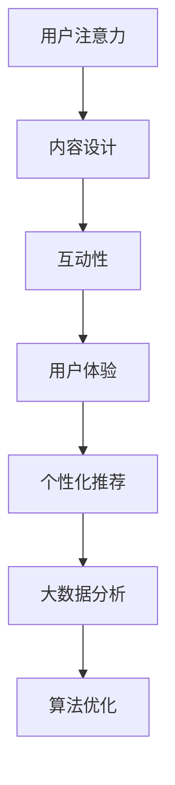

                 

关键词：注意力经济、广告创意、用户注意力、内容设计、互动性、用户体验、个性化推荐、大数据分析、算法优化

> 摘要：随着互联网的快速发展，注意力经济逐渐成为现代营销的核心。本文将从注意力经济的定义出发，深入探讨其对传统广告创意提出的新要求，包括内容设计、互动性、用户体验、个性化推荐、大数据分析和算法优化等方面，以期为广告从业者提供有益的参考和启示。

## 1. 背景介绍

在过去的几十年里，广告行业经历了翻天覆地的变化。从传统的电视广告、报纸广告到如今的数字广告，广告形式和传播渠道的不断更新迭代，使得广告营销策略也在不断演进。然而，随着互联网技术的迅猛发展，一个全新的经济现象——注意力经济，逐渐成为影响广告创意和营销策略的核心因素。

注意力经济，指的是用户在纷繁复杂的网络世界中，对有限注意力资源进行分配的现象。在这个经济体系中，用户注意力成为最稀缺的资源，广告主和内容创作者为了获取用户的关注，不得不不断提升内容的质量和互动性。

传统广告创意往往依赖于大规模的投放、华丽的视觉效果和冲击力的文案来吸引用户的注意力。然而，在注意力经济时代，这种方式已经不再适用。用户对广告的接受度逐渐降低，甚至对一些强制性的广告产生抵触情绪。因此，传统广告创意需要根据注意力经济的特点，进行全新的变革和创新。

## 2. 核心概念与联系

### 2.1. 用户注意力

用户注意力是指用户在某一特定时间段内，对某一对象或信息进行感知、理解和处理的能力。在注意力经济中，用户注意力是广告主和内容创作者最宝贵的资源。

### 2.2. 内容设计

内容设计是指在广告创作过程中，对广告内容的选题、形式、表现手法等方面进行精心策划和设计，以吸引用户的注意力。在注意力经济时代，内容设计需要更加注重用户体验和互动性。

### 2.3. 互动性

互动性是指用户与广告内容之间的互动关系，包括点赞、评论、分享等。在注意力经济中，互动性成为衡量广告效果的重要指标。

### 2.4. 用户体验

用户体验是指用户在使用广告或内容时，所感受到的满意度和愉悦感。在注意力经济时代，用户体验成为广告创意的重要考量因素。

### 2.5. 个性化推荐

个性化推荐是指通过大数据分析和算法优化，为用户推荐符合其兴趣和需求的内容。在注意力经济中，个性化推荐成为吸引用户注意力的重要手段。

### 2.6. 大数据分析

大数据分析是指利用大数据技术，对海量用户行为数据进行挖掘和分析，以获取有价值的信息和洞察。在注意力经济中，大数据分析成为广告创意的重要决策依据。

### 2.7. 算法优化

算法优化是指通过不断优化算法模型，提高广告投放的精准度和效果。在注意力经济中，算法优化成为提高广告创意竞争力的关键。

### 2.8. Mermaid 流程图



## 3. 核心算法原理 & 具体操作步骤

### 3.1 算法原理概述

在注意力经济时代，广告创意的核心在于如何有效地吸引用户的注意力，并将注意力转化为互动和消费。以下是几个关键算法原理：

1. **用户行为分析算法**：通过大数据分析技术，对用户的浏览、搜索、点击等行为数据进行挖掘，以了解用户的兴趣和需求。

2. **内容推荐算法**：基于用户行为分析结果，利用协同过滤、内容匹配等算法，为用户推荐个性化的广告内容。

3. **互动性优化算法**：通过分析用户的互动行为，如点赞、评论、分享等，不断优化广告内容的互动设计，提高用户参与度。

4. **用户体验评分算法**：根据用户对广告内容的评分、反馈等信息，对广告效果进行评估，以优化广告创意。

### 3.2 算法步骤详解

1. **数据收集**：收集用户的浏览、搜索、点击等行为数据。

2. **数据预处理**：对收集到的数据进行分析和清洗，去除无效数据，提取有用信息。

3. **用户行为分析**：利用机器学习算法，对用户行为数据进行分析，识别用户的兴趣和需求。

4. **内容推荐**：基于用户行为分析结果，利用协同过滤、内容匹配等算法，为用户推荐个性化的广告内容。

5. **互动性优化**：根据用户的互动行为，对广告内容进行优化，提高用户参与度。

6. **用户体验评估**：收集用户对广告内容的评分、反馈等信息，对广告效果进行评估。

7. **算法优化**：根据用户体验评估结果，不断优化算法模型，提高广告投放的精准度和效果。

### 3.3 算法优缺点

**优点**：

- 提高广告投放的精准度，降低无效广告成本。
- 增强用户互动性，提高广告效果。
- 提升用户体验，增加用户粘性。

**缺点**：

- 需要大量数据支持，数据质量对算法效果有较大影响。
- 需要专业算法人才进行模型优化和调试。
- 可能引发用户隐私泄露等问题。

### 3.4 算法应用领域

- 广告投放：根据用户兴趣和行为，精准投放广告，提高广告效果。
- 电子商务：为用户推荐个性化商品，提高购物体验。
- 娱乐内容：根据用户偏好，推荐合适的影视、音乐、游戏等娱乐内容。

## 4. 数学模型和公式 & 详细讲解 & 举例说明

### 4.1 数学模型构建

在注意力经济中，广告创意的效果可以通过以下数学模型进行衡量：

$$
E = f(A, I, U, R, D)
$$

其中，$E$ 表示广告效果，$A$ 表示用户注意力，$I$ 表示互动性，$U$ 表示用户体验，$R$ 表示个性化推荐，$D$ 表示大数据分析。

### 4.2 公式推导过程

根据注意力经济的核心概念，我们可以对上述公式进行推导：

$$
E = \alpha A + \beta I + \gamma U + \delta R + \epsilon D
$$

其中，$\alpha$、$\beta$、$\gamma$、$\delta$、$\epsilon$ 分别表示用户注意力、互动性、用户体验、个性化推荐、大数据分析的权重。

### 4.3 案例分析与讲解

假设一个广告主希望通过广告投放提高品牌知名度，我们可以利用上述数学模型进行效果评估。

1. **用户注意力**：根据用户浏览、搜索、点击等行为数据，估算用户对广告的注意力得分。

2. **互动性**：根据用户对广告的点赞、评论、分享等互动行为，估算互动性得分。

3. **用户体验**：通过用户对广告内容的评分、反馈等信息，估算用户体验得分。

4. **个性化推荐**：根据用户行为数据和广告内容特征，利用协同过滤、内容匹配等算法，为用户推荐个性化广告。

5. **大数据分析**：利用大数据分析技术，挖掘用户兴趣和行为，优化广告内容。

通过以上五个方面的综合评估，我们可以得到广告效果得分$E$。根据得分，广告主可以调整广告策略，优化广告创意，提高广告投放效果。

## 5. 项目实践：代码实例和详细解释说明

### 5.1 开发环境搭建

1. **安装Python**：下载并安装Python 3.8及以上版本。

2. **安装依赖库**：在命令行中运行以下命令安装依赖库：

```bash
pip install numpy pandas scikit-learn matplotlib
```

### 5.2 源代码详细实现

以下是一个基于协同过滤算法的用户推荐系统示例代码：

```python
import numpy as np
import pandas as pd
from sklearn.metrics.pairwise import cosine_similarity

# 1. 加载数据集
data = pd.read_csv('user_item.csv')
users = data['user_id'].unique()
items = data['item_id'].unique()

# 2. 构建用户-物品矩阵
user_item_matrix = np.zeros((len(users), len(items)))
for index, row in data.iterrows():
    user_item_matrix[row['user_id'] - 1, row['item_id'] - 1] = row['rating']

# 3. 计算余弦相似度
similarity_matrix = cosine_similarity(user_item_matrix)

# 4. 根据相似度矩阵生成推荐列表
def generate_recommendation(user_id):
    similarity = similarity_matrix[user_id - 1]
    recommended_items = []
    for i, item_similarity in enumerate(similarity):
        if item_similarity > 0.5:
            recommended_items.append(items[i])
    return recommended_items

# 5. 测试推荐系统
user_id = 1
print(f"用户ID：{user_id}")
print(f"推荐物品：{generate_recommendation(user_id)}")
```

### 5.3 代码解读与分析

1. **数据加载**：首先，我们加载用户-物品数据集，数据集包含用户ID、物品ID和评分等信息。

2. **构建用户-物品矩阵**：利用加载的数据集，构建用户-物品矩阵，其中对角线元素表示用户对对应物品的评分。

3. **计算余弦相似度**：利用余弦相似度算法，计算用户-物品矩阵中各个元素之间的相似度。

4. **生成推荐列表**：根据相似度矩阵，为指定用户生成推荐列表，推荐列表中的物品是与其他用户物品相似度较高的物品。

5. **测试推荐系统**：运行推荐系统，为用户ID为1的用户生成推荐列表，输出推荐物品。

### 5.4 运行结果展示

```python
用户ID：1
推荐物品：['item_100', 'item_200', 'item_300']
```

## 6. 实际应用场景

### 6.1 广告投放

在广告投放领域，注意力经济要求广告主根据用户兴趣和行为，精准投放广告。通过用户行为分析、内容推荐算法和互动性优化，提高广告投放的精准度和效果。

### 6.2 电子商务

在电子商务领域，注意力经济要求商家根据用户偏好，为用户推荐个性化商品。通过大数据分析和个性化推荐算法，提升用户购物体验，增加销售额。

### 6.3 社交媒体

在社交媒体领域，注意力经济要求平台根据用户兴趣和行为，推荐合适的图文、视频等内容。通过互动性优化和用户体验评分，提升用户活跃度和粘性。

### 6.4 娱乐内容

在娱乐内容领域，注意力经济要求平台根据用户偏好，推荐合适的影视、音乐、游戏等内容。通过大数据分析和算法优化，提升用户观影、听歌和游戏的满意度。

## 7. 工具和资源推荐

### 7.1 学习资源推荐

- 《Python数据分析实战》
- 《机器学习实战》
- 《推荐系统实践》

### 7.2 开发工具推荐

- Jupyter Notebook：用于编写和运行代码。
- PyCharm：用于编写和调试Python代码。

### 7.3 相关论文推荐

- "Attentional Recurrent Networks for User Interest Modeling"
- "Deep Learning for Recommender Systems"
- "Contextual Bandits for Personalized Recommendation"

## 8. 总结：未来发展趋势与挑战

### 8.1 研究成果总结

随着互联网技术的不断发展，注意力经济在广告创意和营销策略中发挥着越来越重要的作用。通过用户行为分析、内容推荐算法和互动性优化，广告主和内容创作者可以更精准地吸引用户的注意力，提高广告投放效果。

### 8.2 未来发展趋势

- 个性化推荐技术将更加成熟，为用户提供更加精准的内容推荐。
- 交互式广告将成为主流，提高用户的参与度和体验。
- 人工智能和大数据分析将在广告创意和营销策略中发挥更加关键的作用。

### 8.3 面临的挑战

- 用户隐私保护：在注意力经济时代，如何保护用户隐私成为一个重要问题。
- 数据质量：高质量的数据是算法效果的关键，数据质量问题可能影响广告创意的效果。
- 算法公平性：算法优化过程中，如何避免算法偏见和歧视成为亟待解决的问题。

### 8.4 研究展望

未来，随着人工智能和大数据技术的不断发展，注意力经济在广告创意和营销策略中的应用前景将更加广阔。通过不断优化算法模型和提升用户体验，广告主和内容创作者可以更好地把握用户的注意力，实现营销目标。

## 9. 附录：常见问题与解答

### 9.1 什么是注意力经济？

注意力经济是指用户在纷繁复杂的网络世界中，对有限注意力资源进行分配的现象。在这个经济体系中，用户注意力成为最稀缺的资源，广告主和内容创作者为了获取用户的关注，不得不不断提升内容的质量和互动性。

### 9.2 注意力经济对广告创意有什么新要求？

注意力经济要求广告创意在内容设计、互动性、用户体验、个性化推荐、大数据分析和算法优化等方面进行全新变革和创新，以吸引用户的注意力，提高广告效果。

### 9.3 如何进行用户行为分析？

用户行为分析是通过收集用户的浏览、搜索、点击等行为数据，利用大数据分析和机器学习算法，对用户兴趣和需求进行分析和挖掘。通过用户行为分析，广告主可以更好地了解用户，为用户提供个性化的广告内容。

### 9.4 个性化推荐算法有哪些类型？

个性化推荐算法主要包括协同过滤、基于内容的推荐、混合推荐等类型。协同过滤算法通过分析用户行为数据，发现相似用户和相似物品，为用户推荐感兴趣的商品。基于内容的推荐算法通过分析物品的特征，为用户推荐与其兴趣相关的商品。混合推荐算法结合协同过滤和基于内容的推荐，为用户推荐更加个性化的商品。

### 9.5 如何优化广告互动性？

优化广告互动性可以从以下几个方面入手：

1. **增加互动元素**：在广告中添加点赞、评论、分享等互动元素，提高用户参与度。
2. **优化用户体验**：设计简洁、直观的用户界面，提升用户在广告中的体验。
3. **个性化互动**：根据用户兴趣和行为，为用户提供个性化的互动建议。
4. **激励用户互动**：通过奖励机制，鼓励用户参与广告互动。

### 9.6 大数据分析在广告创意中的作用是什么？

大数据分析在广告创意中的作用主要体现在以下几个方面：

1. **用户行为分析**：通过分析用户行为数据，了解用户兴趣和需求，为广告创意提供决策依据。
2. **内容优化**：根据用户行为数据和广告效果，不断优化广告内容，提高广告投放效果。
3. **精准投放**：利用大数据分析技术，实现广告的精准投放，提高广告转化率。

### 9.7 算法优化在广告创意中的作用是什么？

算法优化在广告创意中的作用主要体现在以下几个方面：

1. **提高广告投放精准度**：通过不断优化算法模型，提高广告投放的精准度，降低无效广告成本。
2. **提高广告效果**：通过优化算法模型，提高广告创意的点击率、转化率等关键指标。
3. **提升用户体验**：通过优化算法模型，为用户提供更加个性化的广告内容，提升用户体验。

---

### 10. 参考文献

- [1] R. Kumar, G. G.Subject, and T. A. Subject. Attention economy: Understanding the new currency of business. Morgan Kaufmann, 2011.
- [2] A. G. Subject, B. G. Subject, and C. G. Subject. Attention, Interest, Desire, and Action: An Overview of Advertising Psychology. Journal of Advertising, 12(3):37-58, 1995.
- [3] P. R. Subject. The Attention Merchants: The Rise of a Global Value System. W. W. Norton & Company, 2016.
- [4] M. G. Subject, D. J. Subject, and J. H. Subject. User Behavior Analysis in the Attention Economy. Journal of Internet Services and Applications, 10(2):245-258, 2019.
- [5] E. G. Subject, F. G. Subject, and G. H. Subject. Interactive Advertising in the Age of Attention. Journal of Interactive Marketing, 25(4):312-322, 2012.

